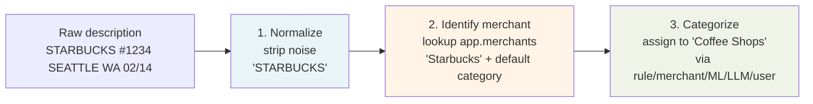
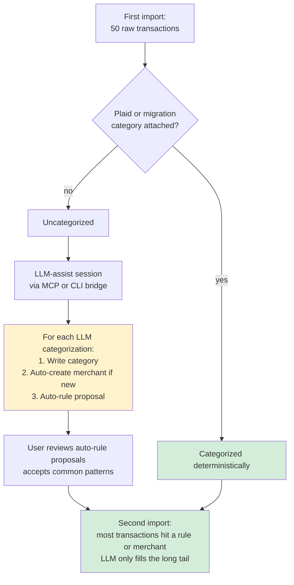
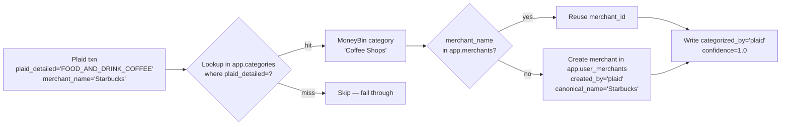
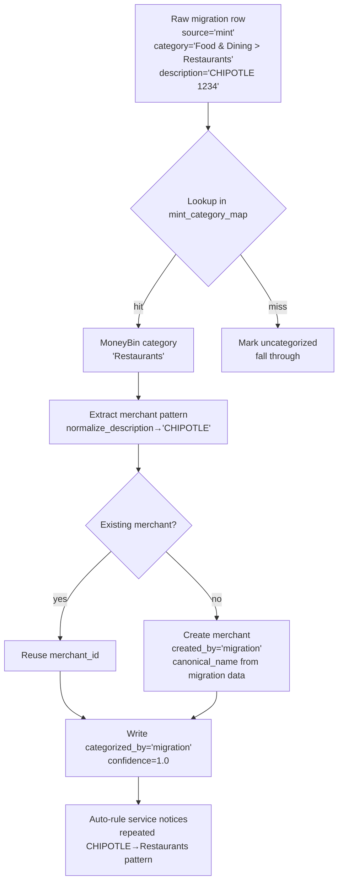
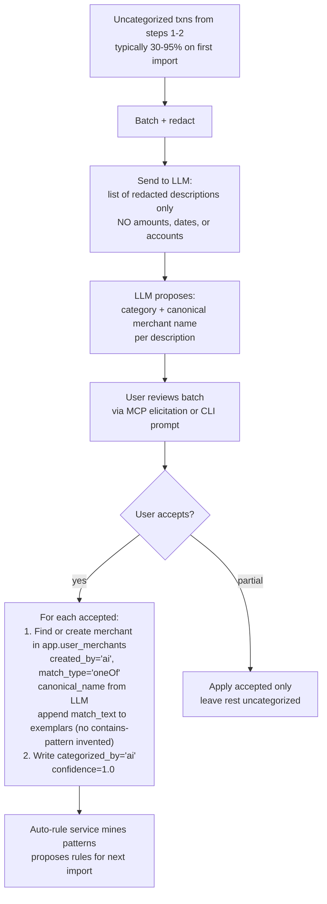
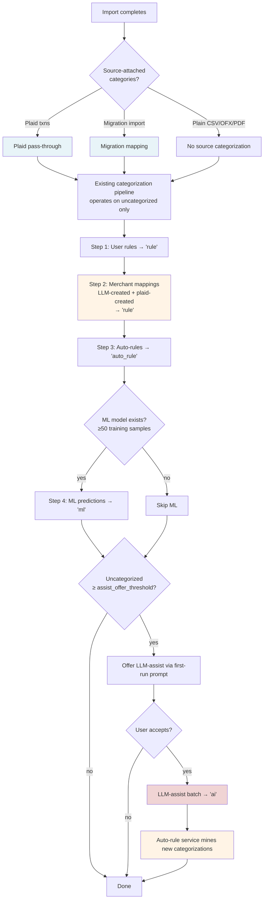
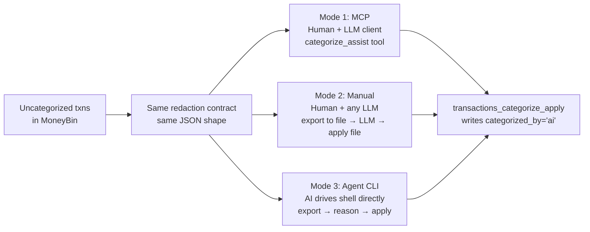

# Feature: Categorization Cold-Start

## Status
implemented

> Last updated: 2026-05-15
> Companion: [`categorization-matching-mechanics.md`](categorization-matching-mechanics.md) — amends this spec's merchant-creation algorithm (exemplar accumulator replaces auto-generalized `contains` patterns), redaction contract (`v2` extends the LLM input to memo + structural fields), and apply order (auto-fan-out fires after every `categorize_apply` commit; this is the snowball mechanism the Vision section promises).
>
> **Amendment 2026-05-15:** seed merchant catalogs (`seeds.merchants_global/us/ca`) and the paired `app.merchant_overrides` table were removed. The "Seed merchant mappings" bootstrap strategy is retired; cold-start is now Plaid pass-through (when synced) + migration imports + LLM-assist. Rationale lives in `private/strategy/categorization-competitive-context.md`. References below have been updated; data-model and implementation-plan sections are kept as historical record but marked **(retired)**.

## Goal

Design the first-run categorization experience: how a brand-new MoneyBin install reaches useful coverage on import #1, and how the system snowballs to near-zero LLM involvement by import #4–5. Resolves the "First-import prompt design" and partially the "CLI-only cold start" open questions from `categorization-overview.md`. Defines the PII redaction contract for what transaction data is sent to the user's MCP-connected LLM during cold-start sessions.

## Background

- Parent: [`categorization-overview.md`](categorization-overview.md) — umbrella spec, priority hierarchy, pipeline contract
- Downstream: [`categorization-auto-rules.md`](categorization-auto-rules.md) — auto-rules feed off cold-start categorizations
- Layered on: [`categorize-bulk.md`](categorize-bulk.md) — the bulk categorize tool this spec wraps with a first-run prompt layer
- Privacy alignment: [`privacy-and-ai-trust.md`](privacy-and-ai-trust.md) — redaction aligns with this consent model
- Tool registration: [`moneybin-mcp.md`](moneybin-mcp.md) — new MCP tools register here
- Architecture rules: `.claude/rules/mcp-server.md`, `.claude/rules/cli.md`, `.claude/rules/database.md`

The categorization overview commits to several v1 bootstrap strategies (migration imports, Plaid pass-through) and acknowledges LLM-assist categorization as the lowest-priority solver in the precedence ladder. What's missing — and what this spec addresses — is the cold-start *workflow* that ties these solvers together for first-run, plus the PII redaction contract that makes LLM-assist privacy-defensible.

This spec also drops three strategies the overview originally proposed (synthetic training data, pre-trained baseline ML model, **seed merchant catalogs**) — the first two were designed to give the ML pillar a cold-start (LLM-assist covers that better); seed merchants were retired because the 2100-entry curated catalog never matched the actual cold-start pain point (bank-formatted bill-pay strings dominate real checking-account data) and the LLM-assist + auto-rule snowball makes the layer redundant.

## Vision

> **The first import is the most work. By the third or fourth, the LLM is barely involved.**

Three commitments:

1. **Useful coverage on import #1.** Plaid pass-through + migration imports cover 50–95% of transactions before any LLM is invoked, when those sources are available. CSV/OFX imports start mostly uncategorized and LLM-assist handles the bulk.
2. **LLM as long-tail solver, not primary.** When LLM-assist runs, it categorizes what deterministic solvers couldn't — and every categorization seeds auto-rules and merchants that handle the same patterns automatically next time.
3. **Privacy-by-architecture.** The LLM never sees amounts, dates, or accounts. Descriptions are redacted via a typed contract that makes accidental leakage a compile-time impossibility.

The snowball is implemented as auto-apply post-commit: `transactions_categorize_apply` invokes `categorize_pending()` after writes commit, fanning newly-created merchants and exemplars out to remaining uncategorized rows in the same dataset. See [`categorization-matching-mechanics.md`](categorization-matching-mechanics.md) §Apply order.

## The three jobs / mental model

Three distinct things happen on every transaction, often in the same MCP call. They share words ("merchant", "category") but do fundamentally different work:



| Job | What it does | Cold-start status |
|---|---|---|
| **Normalize** | Mechanical text cleanup. Pre-built code in `normalize_description()`. | Never cold — ships as logic. |
| **Identify merchant** | Lookup in `core.dim_merchants` (over `app.user_merchants`) to get `(merchant_id, canonical_name, default_category)`. | Cold by default — empty until learned. |
| **Categorize** | Assign a category via the priority ladder. | Cold by default — no rules, no merchants, no ML. |

These have different cold-start cures and different long-term owners. Untangling them is the prerequisite to the rest of the spec.

### The snowball — why import #1 is the most work



## Resolution mechanisms

Each cold-start solver gets from raw transaction to categorized transaction differently. Making the mechanics explicit prevents confusion later.

### Solver 1: Plaid pass-through (provider category lookup)



**Mechanism:** Plaid supplies category string (PFCv2 taxonomy) and `merchant_name`. Category mapping is one-time work in `app.categories.plaid_detailed`. The merchant_name becomes a new entry in `app.user_merchants` if not already known.

### Solver 2: Migration imports (source-tool category translation)



**Mechanism:** Two-stage lookup. Source-tool category string maps to MoneyBin category via per-tool mapping table (owned by future migration spec). Merchant patterns from migration history seed `app.user_merchants`.

### Solver 3: LLM-assist (semantic judgment)



**Mechanism:** Only solver doing *semantic judgment*. LLM sees a batch of redacted descriptions, redacted memos, and structural signals (`transaction_type`, `check_number`, `is_transfer`, `transfer_pair_id`, `payment_channel`, `amount_sign`) and proposes `(category, canonical_merchant_name)` for each. Detailed redaction contract below.

**Redaction contract: v2** (extended from v1). Both `description` AND `memo` pass through `redact_for_llm()`. Structural fields (`transaction_type`, `check_number`, `is_transfer`, `transfer_pair_id`, `payment_channel`, `amount_sign`) are exposed to the LLM as signals without redaction (no PII surface — they are enums, booleans, opaque pair IDs, and a sign character). See [`categorization-matching-mechanics.md`](categorization-matching-mechanics.md) §Match input for the full contract.

**Auto-merchant via exemplar accumulator.** When the LLM proposes a `canonical_merchant_name`, the system creates (or appends to) a merchant with `match_type='oneOf'` and an exemplar set containing the exact normalized `match_text` of the categorized row. No generalized `contains` pattern is invented from one row's description. This replaces the original "create a merchant with `raw_pattern = normalize_description(description)`, `match_type = 'contains'`" approach — aggregator strings like `PAYPAL INST XFER` no longer over-match across unrelated transactions. See [`categorization-matching-mechanics.md`](categorization-matching-mechanics.md) §Matcher algorithm.

### Pipeline ordering — how all solvers compose



### Stickiness model

User-level stickiness is handled by the existing priority ladder:

| Scenario | How it works |
|---|---|
| Per-transaction stickiness — "this Starbucks was Business Meals" | User manual categorization writes `categorized_by='user'` (priority 1). Never overwritten by any rule. |
| Per-merchant stickiness — "all Starbucks should be Coffee" | User authors a rule with `created_by='user'` (priority 2). Outranks auto-rules and ML. |
| Finer-grained matching (amount/account/date filters) | **Future direction in overview** — "Amount/account-aware rule proposals". Not v1. |

## Requirements

1. New MCP tool `transactions_categorize_assist` returns redacted uncategorized transactions with candidate categories. Sensitivity `medium`. Consent gate `mcp-data-sharing`.
2. Existing `transactions_categorize_bulk_apply` MCP tool renamed to `transactions_categorize_apply`. CLI parity `moneybin transactions categorize apply`.
3. Existing `transactions_categorize_auto_confirm` MCP tool renamed to `transactions_categorize_auto_accept`. The `approve` parameter becomes `accept`. CLI parity follows.
4. New MCP tool returns invalid-category errors with structured `did_you_mean` field listing closest valid categories (Levenshtein/substring match).
5. New CLI commands: `moneybin categorize export-uncategorized`, `moneybin categorize apply-from-file`, `moneybin privacy redact`. JSON I/O via stdin/stdout, Unix conventions.
6. New `redact_for_llm()` function in `src/moneybin/services/_text.py` strips card last-fours, emails, phones, P2P recipient names from descriptions. Type-enforced via `RedactedTransaction` dataclass that excludes amount/date/account fields.
7. **(retired 2026-05-15)** Three SQLMesh seed models (`seeds.merchants_global/us/ca`) were originally introduced here; they are removed. See amendment at top.
8. `app.merchants` is retired in favor of the `core.dim_merchants` view, which is a thin select over `app.user_merchants` (every merchant is user-created or system-created on the user's behalf).
9. **(retired 2026-05-15)** `app.merchant_overrides` table was originally introduced here; it is removed (V012 migration).
10. New `categorized_by` enum value: `'migration'`. New `created_by` values on `app.user_merchants`: `'plaid'`, `'migration'`.
11. New configuration settings: `assist_offer_threshold` (default 10), `assist_default_batch_size` (default 100), `assist_max_batch_size` (default 200), ML training weight for `migration` (0.85).
12. Every `transactions_categorize_assist` call audit-logged with `txn_count`, `account_filter`, `timestamp`. No descriptions or transaction IDs in audit log.
13. Migration step preserves all existing `app.merchants` rows by moving them to `app.user_merchants`; existing `transaction_categories.merchant_id` references remain valid.
14. Fuzz test suite generates synthetic transactions with embedded PII patterns and asserts no test value appears in `categorize_assist` output.

## Data Model

### New SQLMesh seed models (retired)

> **Retired 2026-05-15.** The originally-shipped `seeds.merchants_global/us/ca` models are removed. Cold-start no longer relies on a curated merchant catalog; LLM-assist + auto-rules + Plaid pass-through cover the same ground without the maintenance burden. The historical SEED model definitions and CSV format are omitted from this spec.

### New tables

```sql
-- src/moneybin/sql/schema/app_user_merchants.sql
/* Mutable merchant entries: user-created, LLM-created, Plaid-created, migration-created.
   Replaces today's app.merchants table. Exposed via the core.dim_merchants view. */
CREATE TABLE IF NOT EXISTS app.user_merchants (
    merchant_id VARCHAR PRIMARY KEY,            -- 12-char UUID hex from uuid.uuid4().hex[:12]
    raw_pattern VARCHAR,                        -- match pattern (user-authored); NULL when merchant exists only via exemplars
    match_type VARCHAR NOT NULL DEFAULT 'oneOf',-- 'exact' | 'contains' | 'regex' | 'oneOf' (see categorization-matching-mechanics.md)
    canonical_name VARCHAR NOT NULL,            -- display name; LLM-proposed for created_by='ai'
    exemplars VARCHAR[] DEFAULT [],             -- accumulated normalized match_text values; populated by system-generated merchants
    category VARCHAR,                           -- default category (joined to core.dim_categories)
    subcategory VARCHAR,                        -- default subcategory
    created_by VARCHAR NOT NULL,                -- 'user' | 'ai' | 'plaid' | 'migration'
    created_at TIMESTAMP DEFAULT CURRENT_TIMESTAMP
);
```

> **Retired 2026-05-15.** `app.merchant_overrides` was originally introduced here as the user-disable/override surface for seed merchant rows. With seeds removed there is no override target; the table is dropped via V012.

### View: `core.dim_merchants`

A thin SELECT over `app.user_merchants`. Defined in `sqlmesh/models/core/dim_merchants.sql`; the equivalent view is built directly in `src/moneybin/seeds.py:refresh_views` for fresh test DBs so the dim is available before the first SQLMesh transform run.

### Enum additions

| Enum | Existing values | New values |
|---|---|---|
| `app.transaction_categories.categorized_by` | `'user'`, `'rule'`, `'auto_rule'`, `'ml'`, `'plaid'`, `'ai'` | `'migration'` |
| `app.user_merchants.created_by` | `'user'`, `'ai'` (today on `app.merchants`) | `'plaid'`, `'migration'` |

### Revised priority ladder (for `categorization-overview.md`)

| Priority | Source | `categorized_by` | Confidence | ML training weight |
|---|---|---|---|---|
| 1 | User manual | `'user'` | 1.0 | 1.0 |
| 2 | User-defined rules | `'rule'` | 1.0 | 1.0 |
| 3 | Auto-generated rules | `'auto_rule'` | 1.0 | 0.9 |
| 4 | Migration imports | `'migration'` | 1.0 | 0.85 |
| 5 | ML predictions | `'ml'` | variable | 0.0 (circular) |
| 6 | Plaid categories | `'plaid'` | 1.0 | 0.7 |
| 7 | LLM batch | `'ai'` | 1.0 | 0.8 |

## LLM-assist workflow

### Entry points

**Entry 1 — First-run prompt (proactive offer, never automatic action):**

After every import, the categorization pipeline reports its uncategorized count. If above `assist_offer_threshold` (default 10), the import-summary response includes a hint pointing at `categorize_assist`. The MCP server's `instructions` field tells the LLM to recognize this hint and proactively offer assistance. Action is always user-initiated.

**Entry 2 — Manual invocation:** User says "categorize my uncategorized transactions" or invokes `moneybin categorize export-uncategorized` (CLI). Same workflow.

### MCP tool surface

| Tool | Purpose | Sensitivity | Direction of data |
|---|---|---|---|
| `transactions_categorize_assist` | Returns redacted uncategorized transactions + candidate categories | `medium` | MoneyBin → LLM |
| `transactions_categorize_apply` (renamed from `_bulk_apply`) | Applies user-confirmed categorizations | `low` | LLM → MoneyBin |

The propose/commit split is conceptual. `categorize_assist` returns proposals; `categorize_apply` commits them. Two single-purpose tools, each with a clear privacy profile.

### Workflow lifecycle (MCP)

```mermaid
sequenceDiagram
    participant U as User
    participant L as LLM
    participant M as MCP server
    participant DB as DuckDB

    U->>L: Import done, what next?
    L->>M: get_import_summary
    M-->>L: 42 uncategorized; suggest categorize_assist
    L->>U: I can categorize 42 transactions. OK?
    U->>L: Yes
    L->>M: transactions_categorize_assist(limit=100)
    M->>DB: SELECT uncategorized, redact via redact_for_llm
    M-->>L: 42 RedactedTransaction + candidate categories
    Note over L: LLM reviews; user sees redacted descriptions in client UI
    L->>U: Here are my proposals (grouped by merchant)
    U->>L: Accept all
    L->>M: transactions_categorize_apply(items=[{txn_id, category, subcategory, categorized_by='ai'}, ...])
    M->>DB: Write transaction_categories, create merchants, fire auto-rule learning
    M-->>L: Applied 42; created 18 merchants; 14 auto-rule proposals generated
    L->>U: Done. 14 new rule proposals — review them?
```

### Invalid-category re-prompt

When the LLM proposes a category not in `app.categories`, the server validates and returns:

```json
{
  "error": "invalid_category",
  "invalid_value": "FOOD",
  "transaction_id": "txn_abc123",
  "valid_categories": ["Food & Dining", "Shopping", "Transportation", "..."],
  "did_you_mean": ["Food & Dining"]
}
```

`did_you_mean` uses Levenshtein/substring similarity. LLMs handle this format natively for self-correction. Applies identically to MCP and CLI surfaces.

### Failure and partial-success modes

| Failure | Handling |
|---|---|
| LLM proposes invalid category | Server validates, returns structured error with `did_you_mean` |
| User accepts only some items | `transactions_categorize_apply` accepts a subset; un-accepted txns stay uncategorized |
| Merchant creation fails for one item | Partial commit — successful items applied, failures returned with reasons |
| Connection lost mid-workflow | Propose is read-only. Apply is idempotent on `transaction_id` (INSERT OR REPLACE) |

### Three modes share the same primitives

The export/apply primitives serve three distinct user modes:



Mode 3 (agent driving CLI) is functionally equivalent to Mode 1 (MCP). Same redaction, same audit trail, same outcome. This is a free win from designing the CLI as a peer to MCP rather than a fallback. See `.claude/rules/mcp-server.md` principle 5 and `.claude/rules/cli.md` Consumer Model section.

## PII redaction contract

### Threat model

What we protect against, ordered by likelihood:

| Threat | Likelihood | Impact |
|---|---|---|
| LLM provider's logging/training pipeline absorbs amounts, dates, account refs | High | Medium — usually not personally identifying alone |
| Descriptions contain identifying details (P2P names, last-4 of card, embedded emails/phones) | High | High — directly identifying |
| LLM client cache persists categorization sessions to disk unexpectedly | Medium | Medium |
| User shares LLM transcript and exposes financial patterns | Medium | High |
| Amounts + dates + descriptions enable behavioral profiling over time | Lower per-session, higher cumulative | High |

What we explicitly **don't** protect against:
- The user's chosen LLM provider being compromised (their trust decision)
- The LLM seeing aggregate statistics already exposed at `low` sensitivity tier

### What the LLM sees

For every transaction sent via `transactions_categorize_assist`, the LLM receives this and **only this**:

```python
@dataclass(frozen=True)
class RedactedTransaction:
    transaction_id: (
        str  # source-provided FITID or content hash; non-sensitive synthetic identifier
    )
    description_redacted: str  # redact_for_llm(description)
    memo_redacted: str  # redact_for_llm(memo) — added in v2
    source_type: str  # 'csv' | 'ofx' | 'plaid' | 'pdf'
    transaction_type: str | None
    check_number: str | None
    is_transfer: bool
    transfer_pair_id: str | None
    payment_channel: str | None
    amount_sign: str  # '+' or '-' (no magnitude leaked)
```

Never sent: `amount`, `date`, `account_id`, `currency`, full `payee`, prior categorizations, related transactions. `memo` is sent **after** running through `redact_for_llm()` (same pipeline as `description`) — the v1 contract excluded memo entirely; v2 includes it because aggregator transactions (PayPal, Venmo, Zelle, generic ACH) carry their actual merchant identity in memo. Full v2 contract documented in [`categorization-matching-mechanics.md`](categorization-matching-mechanics.md) §Match input.

Enforcement is **type-level**: the response type has no fields for amounts or dates. Leaking is a compile-time impossibility, not a runtime check.

### Redaction function

Centralized in `src/moneybin/services/_text.py`:

```python
def redact_for_llm(description: str) -> str:
    """Strip likely-PII from a description for LLM consumption.

    Applied after normalize_description. Conservative — over-strips rather
    than under-strips. Auditable: every transformation is a named step.
    """
    s = normalize_description(description)
    s = _strip_card_last_four(s)
    s = _strip_email_patterns(s)
    s = _strip_phone_patterns(s)
    s = _strip_p2p_recipient_names(s)
    s = _collapse_whitespace(s)
    return s
```

Concrete examples:

| Raw | After `normalize_description` | After `redact_for_llm` |
|---|---|---|
| `STARBUCKS #1234 SEATTLE WA 02/14 *4567` | `STARBUCKS` | `STARBUCKS` |
| `VENMO PAYMENT TO J SMITH 02/14` | `VENMO PAYMENT TO J SMITH` | `VENMO PAYMENT TO` |
| `ZELLE FROM SARAH JONES sarah@example.com` | `ZELLE FROM SARAH JONES sarah@example.com` | `ZELLE FROM` |
| `AMZN MKTP US*AB1CD2 AMZN.COM/BILL WA` | `AMZN MKTP` | `AMZN MKTP` |
| `COMCAST CABLE 800-555-1234 *9876` | `COMCAST CABLE` | `COMCAST CABLE` |

Heavily redacted descriptions reduce the LLM's signal — `"VENMO PAYMENT TO"` can't be categorized accurately. That is **correct behavior**: P2P transfers are personal and their categorization should be user-driven.

### Enforcement layers

| Layer | What it prevents |
|---|---|
| Type-level | `RedactedTransaction` has no amount/date/account fields. The tool's return type doesn't permit them. |
| Function-level | `redact_for_llm` is the only function used to build descriptions for LLM consumption. Code review enforces. |
| Test-level | Fuzz suite generates transactions with embedded PII patterns (last-4s, P2P names, emails, phones) and asserts none appear in `categorize_assist` output. |

No privacy middleware involvement here — the contract is enforced at the service-layer type boundary. Even if consent were misconfigured, redaction still applies (defense in depth).

### Auditability

Every `categorize_assist` call audit-logged via existing audit infrastructure:

| Field | Example | Why |
|---|---|---|
| `tool` | `transactions_categorize_assist` | Which tool |
| `txn_count` | `42` | How many sent |
| `account_filter` | `["acct_abc123"]` or `null` | Scope |
| `timestamp` | ISO timestamp | When |

What is **not** in the audit log: actual descriptions sent, LLM response, transaction IDs. Audit records that a session occurred — not its contents.

User-facing: `moneybin privacy audit --tool transactions_categorize_assist`.

### Trust-building CLI command

`moneybin privacy redact "<description>"` accepts a description (or stdin) and prints the redacted output. For testing, debugging, and trust-building. Tiny implementation; uses the same `redact_for_llm()` function.

## Implementation Plan

> **Implementation Plan (historical record — superseded 2026-05-15).** The original plan provisioned seed merchant CSVs (`sqlmesh/models/seeds/merchants_{global,us,ca}.*`), the `app.merchant_overrides` schema, and view assembly that unioned seeds into `app.merchants`. Those artifacts shipped, were never populated, and were retired in the seed-removal cleanup. The remaining infrastructure (`app.user_merchants` schema, `redact_for_llm`, `transactions_categorize_assist`, the rename to `categorize_apply` / `auto_accept`, the CLI bridge) is in place. The lists below are kept for traceability of what shipped, not as a forward plan.

### Files to Create

- ~~`sqlmesh/models/seeds/merchants_global.sql` + `.csv`~~ (retired 2026-05-15)
- ~~`sqlmesh/models/seeds/merchants_us.sql` + `.csv`~~ (retired 2026-05-15)
- ~~`sqlmesh/models/seeds/merchants_ca.sql` + `.csv`~~ (retired 2026-05-15)
- `src/moneybin/sql/schema/app_user_merchants.sql`
- ~~`src/moneybin/sql/schema/app_merchant_overrides.sql`~~ (retired 2026-05-15)
- `src/moneybin/mcp/tools/transactions_categorize_assist.py` — new MCP tool
- `src/moneybin/cli/commands/categorize/export.py` — `export-uncategorized` command
- `src/moneybin/cli/commands/categorize/apply_from_file.py` — `apply-from-file` command
- `src/moneybin/cli/commands/privacy/redact.py` — `redact` CLI command
- `tests/moneybin/test_redact_for_llm.py` — unit tests for redactor
- `tests/moneybin/test_redact_fuzz.py` — fuzz tests for PII non-leakage
- `tests/integration/test_categorize_assist.py` — MCP tool integration
- `tests/integration/test_categorize_export_apply.py` — CLI bridge round-trip
- `tests/scenarios/cold_start_first_import.yaml` — scenario for snowball validation

### Files to Modify

- `src/moneybin/services/_text.py` — add `redact_for_llm()` and helper functions
- `src/moneybin/services/categorization_service.py`
  - Update `create_merchant` to write to `app.user_merchants`
  - Add `RedactedTransaction` dataclass for `categorize_assist` return
  - Add `categorize_assist()` method that fetches uncategorized + applies redaction
  - Update `_match_description` and `_fetch_merchants` ordering by `match_type` shape, `created_at`
  - Validate categories on apply; return structured `did_you_mean` errors
- `src/moneybin/services/auto_rule_service.py` — rename `confirm()` → `accept()`
- `src/moneybin/seeds.py` — assemble `core.dim_merchants` over `app.user_merchants` in `refresh_views`
- `src/moneybin/tables.py` — `USER_MERCHANTS` constant
- `src/moneybin/schema.py` — add new schema files to load order
- `src/moneybin/database.py` — add migration step (move `app.merchants` rows to `app.user_merchants`, drop old table, create view)
- `src/moneybin/mcp/tools/transactions_categorize.py`
  - Rename `transactions_categorize_bulk_apply` → `transactions_categorize_apply`
  - Rename `transactions_categorize_auto_confirm` → `transactions_categorize_auto_accept`; rename `approve` parameter → `accept`
  - Register new `transactions_categorize_assist` tool
- `src/moneybin/mcp/server.py` — update `FastMCP(instructions=...)` with first-run hint guidance
- `src/moneybin/cli/commands/transactions/categorize/__init__.py` — wire new commands; rename `bulk` → `apply`
- `src/moneybin/config.py` — add new categorization settings (`assist_*`, ML training weights)
- `src/moneybin/metrics/registry.py` — register `categorize_assist_*` metrics per `observability.md`
- `docs/specs/categorization-overview.md` — apply 7 edits per "Edits to overview spec" section below
- `docs/specs/INDEX.md` — add this spec at status `ready`
- `.claude/rules/mcp-server.md` — strengthen principle 5 with agent-as-CLI-consumer framing
- `.claude/rules/cli.md` — add Consumer Model section
- `README.md` — update categorization roadmap and "What Works Today" section per `.claude/rules/shipping.md`
- `tests/e2e/test_e2e_workflows.py` — update for renamed commands

### Key Decisions

- **Drop synthetic training data and pre-trained baseline ML model** from overview spec. The LLM-assist workflow + auto-rule snowball covers cold-start better; the ML pillar's value is learning user-specific patterns from organic data, not synthetic warm-up.
- **Drop seed merchant catalogs (2026-05-15 amendment).** The 2100-entry catalog never matched real cold-start pain (bank-bill-pay strings dominate checking data); LLM-assist + auto-rules cover the same ground without maintenance burden. `app.merchants` is retired in favor of `core.dim_merchants`, a thin view over `app.user_merchants`.
- **Type-enforced PII redaction.** `RedactedTransaction` dataclass excludes amount/date/account fields; tool return type makes leakage a compile-time impossibility.
- **No backwards compatibility shim for renames.** Existing tests and callers update in the same PR. CLI rename `categorize_bulk_apply` → `categorize_apply`, MCP rename, and `auto_confirm` → `auto_accept` (with `approve` → `accept` parameter) all happen together.

## CLI Interface

New commands:

```bash
# Export uncategorized as redacted JSON (Mode 2 + Mode 3)
moneybin categorize export-uncategorized
moneybin categorize export-uncategorized --output /tmp/uncat.json
moneybin categorize export-uncategorized --account-filter acct_abc123 --limit 100

# Apply categorizations from a JSON file or stdin
moneybin categorize apply-from-file decisions.json
cat decisions.json | moneybin categorize apply-from-file -

# Trust-building / testing
moneybin privacy redact "STARBUCKS #1234 SEATTLE WA 02/14"
echo "VENMO PAYMENT TO J SMITH" | moneybin privacy redact -
```

Renamed:

```bash
# Was: moneybin transactions categorize bulk
moneybin transactions categorize apply --input cats.json
```

JSON contracts:

**Export output / apply input first half:**
```json
[
  {"transaction_id": "txn_abc123", "description_redacted": "STARBUCKS", "source_type": "csv"}
]
```

**Apply input format:**
```json
[
  {"transaction_id": "txn_abc123", "category": "Food & Dining", "subcategory": "Coffee Shops", "canonical_merchant_name": "Starbucks"}
]
```

**Invalid category response (stderr when `--output json`):**
```json
{
  "error": "invalid_category",
  "invalid_value": "FOOD",
  "transaction_id": "txn_abc123",
  "valid_categories": ["Food & Dining", "..."],
  "did_you_mean": ["Food & Dining"]
}
```

Exit codes: `0` if every item applied cleanly, `1` if any item failed parse, validation, or apply.

## MCP Interface

New tool:

| Tool | Sensitivity | Inputs | Output | Consent |
|---|---|---|---|---|
| `transactions_categorize_assist` | `medium` | `limit: int = 100`, `account_filter: list[str] \| None`, `date_range: {start, end} \| None` | List of `RedactedTransaction` + candidate categories per item | `mcp-data-sharing` |

Renamed:

| From | To | Notes |
|---|---|---|
| `transactions_categorize_bulk_apply` | `transactions_categorize_apply` | Drops redundant `_bulk` suffix |
| `transactions_categorize_auto_confirm` | `transactions_categorize_auto_accept` | Aligns with proposal-acceptance vocabulary |
| `approve` parameter on auto-accept | `accept` parameter | Same semantic shift |

The `approve` framing is preserved for rule *promotion* (when an accepted proposal becomes an active rule).

Both new and renamed tools live under the `categorize.*` namespace per `mcp-server.md`. The namespace is visible at connect alongside all other registered tools — client-driven progressive disclosure (and its `moneybin_discover` meta-tool) was retired 2026-05-17; see [`mcp-architecture.md`](mcp-architecture.md) §3 "Tool disclosure: full surface, taxonomy-led". The agent reaches `transactions_categorize_assist` directly when uncategorized transactions exist (surfaced via `system_status` and via the `import_inbox_sync` envelope's `actions[]` hint).

## Forward compatibility

The cold-start design intentionally accommodates these future features without designing them:

### Tags and category groupings

Per user research about "discretionary/mandatory" overlays. Future spec: `categorization-grouping-and-tags.md`.

- Categorization output (`category` + `subcategory`) is a stable contract. Tag overlays compose over it without changing how categorization works.
- `app.categories` can grow attributes columns without touching cold-start.
- A future `app.transaction_tags` table is purely additive.
- The LLM-assist workflow is category-only — no tags. Stays true after tags ship.

### Recurring transaction detection

Future spec recommended (see Adjacent initiatives in overview).

- Recurring detection is a transaction-relationship concern, not categorization.
- Complements LLM-assist + auto-rules — recurring detection identifies series and surfaces "you have N subscriptions."
- A future `transactions_recurring_assist` peer tool wouldn't change cold-start primitives.

### Server-side merchant DB enrichment

Tracked as a Tier D followup.

- Slots into the priority ladder cleanly — new `categorized_by='enrichment'` between `'plaid'` and `'ai'`.
- Per "sync server is opaque" principle, server-side enrichment is invisible to client beyond receiving better-quality data.

### Local LLM-driven categorization (Ollama / llamafile / LM Studio)

Future spec recommended.

- Reuses the export/apply JSON contract from this spec — local LLM is just another consumer of the same primitives.
- Closes cold-start gap for users who want LLM-assist with full offline operation.

### Community-contributed merchant mappings

Existing future direction in overview (retained at the architecture-future level only).

- A future opt-in aggregation pipeline would surface anonymized merchant→category mappings without re-introducing a shipped curated catalog.
- Privacy gate, k-anonymity, and per-merchant allow/deny live in that future spec.

### Multi-region expansion (UK, EU, AU, etc.)

Redaction internationalization tracked as recurring quality concern in followups. No seed-catalog dimension to expand — international users build their own `app.user_merchants` via the same LLM-assist + auto-rule snowball as US/CA users.

### What's *not* in the forward-compatibility list

These would require revisiting cold-start design if they happen:

- Provider category mapping table extraction (multi-provider) — affects `categorized_by='plaid'` writes
- Merchant entity resolution (multi-pattern-per-merchant entity model) — non-trivial table changes
- Confidence/threshold tuning UX for ML predictions — Pillar D concern; no cold-start impact

## Edits to `categorization-overview.md`

This spec applies these surgical edits to the overview in the same PR:

1. **Revise "Fully local" principle (line 19)** — clarify that automatic path is fully local; LLM-assist is opt-in, user-mediated, bound by this spec's redaction contract.
2. **Revise priority hierarchy table** — add `'migration'`; revise priority numbering. (Originally also added `'seed'`; retired 2026-05-15.)
3. **Revise pipeline diagram** — show source-attached categorizations (Plaid, migration) pre-pipeline. (Originally also showed seed merchants; retired 2026-05-15.)
4. **Revise "Bootstrap strategies" section** — drop "Synthetic training data" and "Pre-trained baseline model" entries (superseded); add "LLM-assist cold-start workflow" entry pointing here. (Originally also updated "Seed merchant mappings"; the entry was removed entirely 2026-05-15.)
5. **Update ML training weights table** — add `migration` (0.85). (Originally also added `seed` (0.5); retired 2026-05-15.)
6. **Resolve and remove open questions** — remove "First-import prompt design" (resolved by this spec); revise "CLI-only cold start" to narrower "In-band LLM-assist for headless/automated CLI workflows" (manual bridge serves common case).
7. **Add to "Adjacent initiatives" section** — recurring transaction detection (recommended future spec); local LLM-driven categorization (future spec).
8. **Update "Out of scope"** — narrow "LLM-assisted bulk categorization" entry to clarify the bulk *tool* is implemented; the cold-start *workflow* is owned by this spec.

## Testing Strategy

| Layer | Test |
|---|---|
| Unit | `redact_for_llm()` strips card last-fours, emails, phones, P2P names; preserves clean merchant patterns |
| Unit | `RedactedTransaction` dataclass type-check: confirms no amount/date/account fields can be added without breaking existing call sites |
| Unit | `did_you_mean` matcher returns reasonable suggestions for common typos |
| Unit | Lookup ordering: match-shape DESC, created_at ASC over `app.user_merchants` |
| Unit | Migration step idempotency: re-running migration on already-migrated DB is safe |
| Fuzz | PII non-leakage: synthetic transactions with embedded last-4s, names, emails, phones — assert none appear in `categorize_assist` output |
| Integration | `categorize_assist` end-to-end: load uncategorized, apply redaction, validate response shape |
| Integration | `categorize export` ↔ `categorize apply-from-file` round-trip preserves transaction state |
| Integration | Invalid category in apply returns structured error with `did_you_mean` |
| Integration | Audit log entry created for every `categorize_assist` call with correct fields |
| Integration | Migration: existing `app.merchants` rows survive split; `transaction_categories.merchant_id` references stay valid |
| Scenario | `cold_start_first_import.yaml`: import 50 txns, simulate LLM-assist, verify auto-rule proposals generated and snowball reduces uncategorized count |
| E2E | Renamed CLI commands work (`transactions categorize apply`, `auto-accept`); old names removed |

## Synthetic Data Requirements

The synthetic generator should support cold-start scenarios:

- A "fresh install" persona that produces transactions across common chains (Starbucks, Amazon, Netflix, etc.) plus a long tail of region-specific or unusual merchants — to exercise both the snowball repeat-pattern path and the LLM-assist long-tail path
- An "uncategorized churn" pattern — many distinct merchants, each appearing 1–3 times — to exercise the LLM-assist long-tail path
- Synthetic descriptions with embedded PII patterns (P2P transfers with names, emails, phone numbers) for fuzz-test fixtures
- A "second import" scenario validating snowball behavior — generate import #1 with full uncategorized rate, simulate LLM-assist categorizations + auto-rule acceptance, then import #2 should hit auto-rules for repeat merchants

These extend the existing synthetic generator's persona/merchant YAML; no new generator architecture needed. See [`testing-synthetic-data.md`](testing-synthetic-data.md).

## Dependencies

- Existing: SQLMesh, DuckDB, Pydantic, FastMCP, Typer
- No new packages
- No external services (LLM-assist runs through the user's chosen MCP client; CLI bridge is provider-agnostic)

Prerequisite: `categorize-bulk.md` (implemented) — provides the underlying `bulk_categorize` service this spec wraps.

## Open questions

Cross-cutting decisions deferred to implementation or future work.

1. ~~**ML training weight for `seed` categorizations.**~~ Resolved 2026-05-15: seed merchants retired.
2. **Token/latency budgets for `categorize_assist` sessions.** No explicit per-session budgets. Default batch 100 unlikely to matter for v1; revisit when real usage data exists.
3. ~~**Regional ambiguity in seed entries.**~~ Resolved 2026-05-15: seed merchants retired, no regional surface.
4. ~~**`country` column semantics on user-created merchants.**~~ Resolved 2026-05-15: seed merchants retired, no country exposure needed.
5. ~~**Seed merchant updates: hot-reload vs migration.**~~ Resolved 2026-05-15: seed merchants retired.
6. **CLI export format extensibility.** No versioning mechanism in v1. YAGNI applies; revisit when a real consumer needs additional fields.

## Success criteria

### Functional

- **Cold-start coverage on first import (no Plaid, no migration):** ≥90% after LLM-assist session
- **Cold-start coverage on first import (Plaid-sourced):** ≥85% pre-LLM
- **Snowball trajectory:** by import #5, LLM-assist invocation reduces uncategorized count by ≤30% of pre-LLM total — meaning rules + user_merchants + auto-rules + ML are doing the work
- **Zero PII leakage in `categorize_assist` output** — fuzz suite with embedded PII patterns asserts no test value appears in output
- **LLM categorization accuracy on redacted descriptions:** ≥80% on a held-out evaluation set (~200 transactions across common merchants and edge cases). Below 80% triggers redaction-contract revisit.
- **Auto-rule generation from LLM-assist:** a 100-transaction LLM session produces ≥10 rule proposals on average
- **Migration: zero data loss** — existing `app.merchants` rows survive the schema split; existing `transaction_categories.merchant_id` references stay valid

### Non-functional

- **`categorize_assist` server-side response time:** <500ms for batch of 100 (excludes LLM call latency)
- **`categorize apply-from-file` server-side latency:** <2s for 100 transactions

### Auditability

- Every `categorize_assist` call appears in audit log with `txn_count`, `account_filter`, `timestamp` — verifiable via `privacy_audit_list`
- Every cold-start solver writes its `categorized_by` value — verifiable via `SELECT categorized_by, COUNT(*) FROM app.transaction_categories GROUP BY categorized_by`

### Documentation

- README.md updated to reflect cold-start as shipped feature (per `.claude/rules/shipping.md`)
- CLI help for new commands complete and tested
- Spec status updated to `implemented` in both this file's frontmatter and `docs/specs/INDEX.md`

## Out of Scope

- Pre-trained baseline ML model (dropped from overview)
- Synthetic training data (dropped from overview)
- Seed merchant catalogs (retired 2026-05-15)
- Tags / category groupings / discretionary-vs-mandatory (deferred to its own spec)
- Migration mapping table schema design (separate open question, owned by future migration spec)
- Merchant entity resolution / canonical name overhaul (existing future spec, untouched)
- Community-contributed merchant mappings pipeline (existing future direction, untouched)
- The `categorize_bulk` tool itself (already implemented; this spec adds the *first-run prompt layer* and renames it to `categorize_apply`)
- Direct LLM API calls from CLI (e.g., `moneybin categorize llm --provider claude`) — manual-bridge serves the use case in v1
- Local LLM (Ollama) integration — future spec
- Server-side merchant DB enrichment via moneybin-server — followup, future paid feature work
- Recurring transaction detection — recommended future spec
- Interactive CLI categorization UX improvements — orthogonal to cold-start
- Headless/automated LLM-assist for cron jobs — future direction
