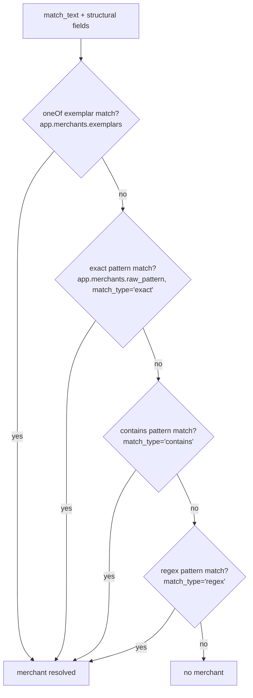
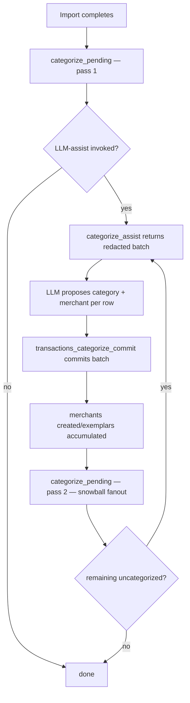

# Categorization — Matching Mechanics

> Last updated: 2026-05-17
> Status: Implemented
> Companions: [`categorization-overview.md`](categorization-overview.md) (parent — priority hierarchy, pipeline contract), [`categorization-cold-start.md`](categorization-cold-start.md) (LLM-assist workflow; this spec amends its merchant-creation and redaction behavior), [`categorization-auto-rules.md`](categorization-auto-rules.md) (auto-rule generation; consumes the precedence model), [`matching-transfer-detection.md`](matching-transfer-detection.md) (transfer subsystem; categorization runs independent of `is_transfer` per its principles), [`architecture-shared-primitives.md`](architecture-shared-primitives.md) (schema reference), [`observability.md`](observability.md) (metrics wiring)
>
> **Amendment 2026-05-15:** seed merchant catalogs were removed (see `categorization-cold-start.md` amendment). The `'seed'` value in the source-precedence ladder is retired. Numbering compacts: priority 7 is now `'ai'` (was 8). Lookup ordering drops the `is_user` discriminator since every merchant in `core.dim_merchants` is user/system-created.

## Purpose

This spec is the single source of truth for **how the categorization matcher works at runtime**. It defines what fields the matcher and LLM-assist consume, how patterns and exemplars are stored, how multiple categorization sources resolve precedence, and when the deterministic pipeline re-runs.

It exists because live testing of `categorization-cold-start.md` (status `implemented`) on a 279-transaction OFX checking-account dataset surfaced five concrete bugs that all trace to a too-narrow projection of the transaction record. Fixing them cleanly requires coordinated changes across the matcher, the LLM-input contract, the merchant-creation algorithm, and the apply-order semantics — large enough to warrant a dedicated mechanics spec rather than scattered amendments.

## Why this spec

Five bugs, all confirmed against the current `main`:

1. **`categorize_assist` SQL projects only `description, source_type, transaction_id`.** `memo` and structural fields (`transaction_type`, `check_number`, `is_transfer`, `payment_channel`) are dropped before redaction. For aggregator transactions (`PAYPAL INST XFER`, `ZELLE TO`, `VENMO PAYMENT`, generic ACH), the wrapped merchant identity lives in `memo` and the LLM never sees it.
2. **`_match_description` operates only on `description`.** Even a user-curated merchant for "Google YouTube" cannot fire when `description = 'PAYPAL INST XFER'` and the YouTube reference is in `memo`.
3. **Auto-merchant creation uses the full normalized description as the rule pattern with `match_type='contains'`.** Aggregator strings (`PAYPAL INST XFER`) over-generalize — every future PayPal row gets the first row's category. Varying strings (`BILL PAY Chase - Sapphire 1234`) fail to match siblings — no snowball.
4. **`categorize_pending()` is never called from the MCP `transactions_categorize_commit` tool.** Merchants and rules created in batch N never apply to still-uncategorized rows before batch N+1. Live observation: `by_source: {"ai": 241}` — every categorization came from the LLM-assist path because the deterministic pillars contributed zero between batches. The cold-start spec's "by the third or fourth import the LLM is barely involved" promise structurally cannot fire.
5. **OFX `<NAME>` (32-char-capped by the OFX 1.x format itself) becomes `description`; `<MEMO>` carries the real identity but is dropped from matchable text.** Not a bug we caused — it's how OFX is shaped — but it means `description`-only matching is structurally insufficient for OFX-sourced transactions.

Bugs 1, 2, 5 are the same problem (field coverage). Bugs 3 and 4 are independent. Together they explain every "why didn't the snowball roll?" symptom from the live test.

A cross-project survey of how Actual Budget, Firefly III, Maybe Finance, hledger, Beancount/smart_importer, and GnuCash handle matching at runtime informs the design choices below. Where this spec adopts a pattern verbatim from one of those projects, the source is cited.

## Design principles

1. **Field coverage parity.** Whatever signal the LLM is allowed to see, the deterministic matcher also sees. Whatever the matcher operates on, the LLM also sees (subject to redaction). The two must never diverge — otherwise rules learned from LLM-categorized rows fail to fire on identical future rows.
2. **Exemplars over patterns for system-created rules.** When the system (LLM-assist or import auto-rule) creates a merchant from a categorized row, store the exact normalized `match_text` as an exemplar in a `oneOf` set — never auto-generalize to a `contains` pattern. Generalization to `contains` / `regex` is a *user* action, deliberate and specific. (Adopted from Actual Budget's `imported_payee` rename pattern, which made the same trade-off after their auto-generalization caused over-matching.)
3. **Source precedence is enforced on write, not on read.** Every categorization source has a numeric priority. Lower-priority sources cannot overwrite higher-priority assignments. The `transaction_categories.categorized_by` column is the lock; no separate lock table is required.
4. **Apply runs after every commit, automatically.** When the LLM-assist tool commits a batch of categorizations (creating new merchants and rules along the way), `categorize_pending()` runs immediately to fan those new entries out to still-uncategorized rows. This is the snowball mechanism the cold-start spec promised but never implemented.
5. **`is_transfer` is a signal, not a gate.** Per the matching subsystem's load-bearing principle in `matching-transfer-detection.md` ("`is_transfer` and categorization are independent metadata axes"), categorization runs on all transactions regardless of transfer status. The matcher and LLM see `is_transfer` as a feature; report layers filter on it.
6. **Specificity ranks rules; user authority ranks sources.** Within a categorization source, a more-specific match (`oneOf` exemplar > `is` literal > `contains` substring > `regex`) wins. Across sources, user authorship always wins. The two axes are orthogonal.

## Match input — what the matcher and LLM see

### `match_text` construction

The matcher and the LLM-assist redactor both consume a derived field, `match_text`, computed from the transaction row:

```
match_text = description + "\n" + memo
```

with the following rules:

- If either field is `NULL` or empty after `TRIM`, the corresponding side and its separator are omitted (so a description-only row produces just `description`; a memo-only row produces just `memo`).
- The literal `\n` separator prevents accidental cross-field token fusion: `description='PAYPAL'` + `memo='INST XFER'` does not become `PAYPALINST XFER`.
- Both sides are passed through `normalize_description()` (existing implementation in `src/moneybin/services/_text.py`) before concatenation. Normalization is destructive but **deterministic** — the same input always yields the same output, so exemplars accumulated across calls compare cleanly.

### Structural fields exposed to the matcher and LLM

| Field | Type | Source | Purpose |
|---|---|---|---|
| `transaction_type` | TEXT | `core.fct_transactions` (source-specific) | Filter signal; LLM disambiguator (debit vs credit vs check vs transfer vs ATM) |
| `check_number` | TEXT | `core.fct_transactions` | Identity hint for handwritten checks |
| `is_transfer` | BOOLEAN | `core.fct_transactions` (JOIN-derived from `core.bridge_transfers`) | Signal that this row is part of a confirmed transfer pair |
| `transfer_pair_id` | TEXT | `core.fct_transactions` | Identity of the matched transfer pair (LLM may use to label both sides consistently) |
| `payment_channel` | TEXT | `core.fct_transactions` (Plaid-only today) | Channel hint (online / in store / other) |
| `amount_sign` | TEXT (`'+'` / `'-'` / `'0'`) | derived from `core.fct_transactions.amount` | Coarse direction hint without exposing magnitude. `'0'` covers NULL/zero amounts so the LLM isn't biased toward income-side categories on balance adjustments / voided rows. |

The full numeric `amount` is **not** sent to the LLM (privacy contract from `categorization-cold-start.md`). The matcher continues to consume `amount` for amount-bounded rules.

`transaction_type` remains source-specific in this spec — canonicalization across OFX / Plaid / future providers is a deferred concern (see Open Questions).

### `RedactedTransaction` schema (extended)

The frozen dataclass that crosses the privacy boundary in `src/moneybin/services/categorization/assist.py` is extended:

```python
@dataclass(frozen=True)
class RedactedTransaction:
    transaction_id: str
    description_redacted: str
    memo_redacted: str
    source_type: str
    transaction_type: str | None
    check_number: str | None
    is_transfer: bool
    transfer_pair_id: str | None
    payment_channel: str | None
    amount_sign: Literal["+", "-", "0"]
```

`memo_redacted` runs through the same `redact_for_llm()` pipeline that `description_redacted` does. The existing redactor already strips P2P recipients, account-number tails, hash-prefixed refs, bare digits, embedded contact info, dates, and city/state — the patterns that memos carry. No new redaction rules are required for the v1 expansion; the contract is "run the existing redactor over both fields."

## Matcher algorithm

### Lookup order (deterministic; per source)



Every merchant in `core.dim_merchants` is user-created or system-created on the user's behalf (created_by: `user`, `ai`, `rule`, `plaid`, `migration`). Ordering is by match-shape specificity then `created_at ASC`.

### OP_SCORES specificity ranking

Within a source, specificity is scored to break ties when multiple rules or merchants match the same row. Adopted verbatim from Actual Budget's `rules/rule-utils.ts`:

| Match shape | Score |
|---|---|
| `oneOf` exemplar set | 10 |
| `exact` (`is`, case-insensitive) | 10 |
| `contains` | 0 |
| `regex` | 0 |

Higher score wins; tie-broken by `created_at ASC`. This replaces the current ad-hoc `CASE match_type WHEN 'exact' THEN 1 WHEN 'contains' THEN 2 WHEN 'regex' THEN 3` ordering. The amount-bounded operators (`isApprox` / `between` / `gt` / `gte` / `lt` / `lte`) were originally specified but never implemented — they are excluded from the OP_SCORES table until amount-bounded rules ship.

Implementation: `score_match_shape(rule)` in `src/moneybin/services/categorization/_shared.py`. The score is rendered into the merchants-fetch `ORDER BY` SQL via `match_shape_case_sql()` so the Python and SQL ladders cannot drift.

### Exemplar accumulation

Each merchant carries an exemplar set in addition to its (optional) authored pattern:

```sql
ALTER TABLE app.user_merchants ADD COLUMN exemplars VARCHAR[] DEFAULT [];
```

When the system (LLM-assist or another auto-pillar) creates or augments a merchant from a categorized row:

1. Compute `match_text` for the row.
2. If the merchant already exists (matched by description in the LLM-proposed `canonical_merchant_name`), append `match_text` to `exemplars` if not already present.
3. If no merchant exists, create one with `exemplars = [match_text]`, `raw_pattern = NULL`, `match_type = 'oneOf'`.

The `oneOf` lookup is `match_text IN merchant.exemplars` (set membership). DuckDB list-contains is `list_contains(exemplars, match_text)` — O(N) per merchant but the merchant fetch is already O(M) and the existing matcher iterates merchants per uncategorized row, so the combined cost is unchanged in shape.

**Growth bound: none in v1.** Exemplar sets grow unbounded. Observability includes a `merchant_exemplar_count` metric; if any merchant exceeds 200 exemplars in production, a follow-up spec covers graduation to a generalized pattern. Until that signal lands, "no cap" is correct per AGENTS.md "no features beyond what was asked."

### What auto-merchant creation no longer does

The previous behavior — creating a merchant with `raw_pattern = normalize_description(description)` and `match_type = 'contains'` — is removed. Replaced by exemplar accumulation above (now in `src/moneybin/services/categorization/orchestrator.py`). User-authored `contains` and `regex` patterns continue to work; only the *system-generated* path changes.

## Source precedence

### Numeric priority

Per `categorization-overview.md` priority hierarchy, with a single normative ordering for matcher writes:

| Priority | `categorized_by` | Source |
|---|---|---|
| 1 (highest) | `'user'` | User manual categorization |
| 2 | `'rule'` | User-authored rule |
| 3 | `'auto_rule'` | System-generated rule |
| 4 | `'migration'` | Migration import |
| 5 | `'ml'` | ML prediction |
| 6 | `'plaid'` | Plaid pass-through |
| 7 (lowest) | `'ai'` | LLM-assist |

### Enforcement on write

All writes to `transaction_categories` go through a single guarded path:

```python
def write_categorization(
    self,
    transaction_id: str,
    category: str,
    *,
    subcategory: str | None,
    categorized_by: CategorizedBy,
    merchant_id: str | None = None,
) -> WriteOutcome:
    """Insert or replace a categorization, respecting source precedence.

    Returns WriteOutcome.WRITTEN if the new row was applied,
    WriteOutcome.SKIPPED_PRECEDENCE if an existing row outranks the new one.
    """
```

The `INSERT OR REPLACE` SQL becomes a parameterized `INSERT ... ON CONFLICT ... DO UPDATE WHERE` that compares precedence via an inlined `CASE` expression. The priority table lives at the call site so reviewers see it next to the write logic:

```sql
INSERT INTO app.transaction_categories
  (transaction_id, category, subcategory, categorized_at, categorized_by, merchant_id)
VALUES (?, ?, ?, CURRENT_TIMESTAMP, ?, ?)
ON CONFLICT (transaction_id) DO UPDATE SET
  category = EXCLUDED.category,
  subcategory = EXCLUDED.subcategory,
  categorized_at = EXCLUDED.categorized_at,
  categorized_by = EXCLUDED.categorized_by,
  merchant_id = EXCLUDED.merchant_id
WHERE
  (CASE EXCLUDED.categorized_by
     WHEN 'user' THEN 1 WHEN 'rule' THEN 2 WHEN 'auto_rule' THEN 3
     WHEN 'migration' THEN 4 WHEN 'ml' THEN 5 WHEN 'plaid' THEN 6
     WHEN 'ai' THEN 7 END)
  <= (CASE transaction_categories.categorized_by
        WHEN 'user' THEN 1 WHEN 'rule' THEN 2 WHEN 'auto_rule' THEN 3
        WHEN 'migration' THEN 4 WHEN 'ml' THEN 5 WHEN 'plaid' THEN 6
        WHEN 'ai' THEN 7 END);
```

Lower number = higher authority; new write replaces only if its priority is ≤ the existing row's. The SQL `CASE` is rendered from a single Python `SOURCE_PRIORITY` dict via `priority_case_sql()` (`src/moneybin/services/categorization/_shared.py`), so the SQL and Python ladders cannot drift. The dict is the canonical reference for the priority table above.

This is the entire locking primitive. No separate `app.locked_categorizations` table; no per-field locks; no JSONB lock map. The `categorized_by` column is the lock.

### What this guarantees

- A user-edited categorization (`'user'`) is never overwritten by any subsequent rule, merchant, or LLM call.
- A user-authored rule (`'rule'`) is never overwritten by an auto-rule, ML prediction, or LLM call.
- An LLM-assist categorization (`'ai'`) can be overwritten by *any* later source — which is correct: LLM-assist is the lowest-confidence pillar, and a deterministic match arriving later is more reliable.
- Re-running `categorize_pending()` on already-categorized rows is safe: same-or-lower-priority sources no-op; higher-priority writes take effect.

### What this does not provide (deferred)

- **Per-field locks.** A user fix to `category` does not free `subcategory` for further automation. If this becomes a real workflow, add a `locked_subcategory` boolean column or migrate to a JSONB lock map.
- **Cross-axis locks** (e.g. lock the merchant assignment but allow category changes). Same deferral.

## Apply order

### Triggers for `categorize_pending()`

| Trigger | Caller | Scope |
|---|---|---|
| Import completes | `import_service.py` (existing) | All uncategorized rows from the import |
| Rules CLI command | `cli/commands/transactions/categorize/rules.py` (existing) | All uncategorized rows |
| **`transactions_categorize_commit` commits a batch** | `transactions_categorize_commit` MCP tool (renamed from `_apply` per PR #171) | All still-uncategorized rows |
| **Edit op with `reapply=True`** | rule create/delete operations (`transactions_categorize_rules_create` / `_delete`) | Rows matching the edited entity |
| **Categorize cascade** | `transactions_categorize_run(methods=[...])` umbrella (PR #171) — canonical `["rules","merchants"]` routes through `categorize_pending()`'s shared-scan path; non-canonical orders fall through to per-method invocations | All still-uncategorized rows |

The third row is the snowball fix. After the LLM-assist batch's writes commit, `categorize_pending()` runs once. New merchants and rules from the batch fan out to remaining uncategorized rows in the same dataset. The next `categorize_assist` call sees only what's still genuinely uncategorized.

The fourth row is opt-in via flag — not a new tool. Edit operations on merchants and rules accept a `reapply: bool = False` parameter; when `True`, the operation runs `categorize_pending()` scoped to that one entity's match set after the write.

### Convergence

`categorize_pending()` is idempotent: a second run on the same state writes nothing. No multi-pass loop is needed in v1. If observability shows non-trivial cascades (rule A creates state that rule B then matches), a bounded loop (≤3 passes) is added then.

## Pipeline diagram

Updated from `categorization-overview.md` to reflect the new apply trigger and exemplar pillar:



`categorize_pending` runs the source-precedence-respecting matcher in a fixed order: rules first (priority 2–3), then merchants (priority 6–7), then ML (priority 5) — ML lives between rules and merchants per the overview spec but is gated by the existing confidence thresholds.

## Schema changes

### `app.user_merchants`

Add `exemplars` array column (DuckDB `LIST(VARCHAR)`):

```sql
ALTER TABLE app.user_merchants ADD COLUMN exemplars VARCHAR[] DEFAULT [];
```

`raw_pattern` becomes nullable: a merchant that exists only via exemplars has `raw_pattern = NULL`, `match_type = 'oneOf'`. A merchant created by user authoring still has `raw_pattern` set and `match_type` in `('exact', 'contains', 'regex')`. A merchant can carry both — exemplars feed the `oneOf` lookup, `raw_pattern` feeds the existing exact/contains/regex lookup.

```sql
ALTER TABLE app.user_merchants ALTER COLUMN raw_pattern DROP NOT NULL;
ALTER TABLE app.user_merchants ALTER COLUMN match_type SET DEFAULT 'oneOf';
```

A separate `InternalMatchType` literal in `src/moneybin/services/categorization/_shared.py` adds `'oneOf'` for the in-memory matcher and exemplar-creation paths; the public `MatchType` (rule-author input) remains the three-shape set `'exact' | 'contains' | 'regex'`.

### `app.merchants` view

`core.dim_merchants` is a thin SELECT over `app.user_merchants` (no seed catalog, no overrides table). `exemplars` is the user-merchant column directly.

### `app.transaction_categories`

No new columns. The `categorized_by` precedence is enforced via the new `INSERT ... ON CONFLICT ... WHERE` shape with an inlined `CASE` expression for the priority lookup. Existing rows are compatible — their `categorized_by` values already align with the priority table.

### Migration

A single SQLMesh migration:

1. Add `exemplars` column with default `[]`.
2. Drop NOT NULL from `raw_pattern`.
3. Update `match_type` default to `'oneOf'`.
4. Re-create the `app.merchants` view to include `exemplars`.

No data migration is required — existing merchants retain their `raw_pattern` + `match_type` and continue to match via the existing path.

## Implementation status

> **Shipped via PRs #155, #171, #174.** All seven planned steps landed. The original step-by-step plan and file-modification checklist are retired as historical noise; the shipped artifacts are:
>
> - **Categorization package** at `src/moneybin/services/categorization/` (PR #155 split): `__init__.py` (facade), `assist.py` (`RedactedTransaction`, `categorize_assist`), `matcher.py` (`_match_text`, `_match_exemplar`, `_fetch_merchants`), `applier.py` (`write_categorization`, commit pipeline), `orchestrator.py` (exemplar accumulation, `categorize_pending`), `queries.py` (shared SQL), `_shared.py` (`MatchType`, `priority_case_sql`, `match_shape_case_sql`).
> - **MCP tools** at `src/moneybin/mcp/tools/transactions_categorize.py`: `transactions_categorize_commit` (renamed from `_apply` in PR #171) calls `categorize_pending()` post-commit; `transactions_categorize_run` umbrella; `transactions_categorize_rules_create` / `_delete` accept `reapply`.
> - **Schema migration** `V008__user_merchants_exemplars.py` added `exemplars VARCHAR[]` and dropped NOT NULL from `raw_pattern`.
> - **`category_id` FK columns** added in V014 (PR #174) alongside `category`/`subcategory` on `app.user_merchants` / `app.transaction_categories` / `app.transaction_splits` — dual-write phase pending Phase 2 drop.

## Observability

Per `observability.md`, every spec touching app code wires metrics. New metrics:

| Metric | Type | Purpose |
|---|---|---|
| `categorize_match_text_construction_duration_seconds` | histogram | Detect regressions in `match_text` build cost |
| `categorize_match_outcome_total{outcome,shape}` | counter | `outcome` ∈ {`exemplar`, `exact`, `contains`, `regex`, `none`}; `shape` ∈ {`description_only`, `memo_only`, `both`} |
| `merchant_exemplar_count` | gauge | Per-merchant exemplar set size; alarms triggered if any merchant exceeds 200 |
| `categorize_write_skipped_precedence_total{src_existing,src_attempted}` | counter | Tracks how often precedence locks fire |
| `categorize_apply_post_commit_duration_seconds` | histogram | Latency of the snowball apply triggered by `transactions_categorize_commit`. Metric name retains the `categorize_apply_` prefix for Prometheus stability across the 2026-05 rename. |
| `categorize_apply_post_commit_rows_affected` | histogram | How many rows the snowball fanned out to per batch |

Existing metrics (`CATEGORIZE_BULK_*`, `CATEGORIZE_ASSIST_*`) remain unchanged.

## Testing layers

Per `.claude/rules/testing.md`, features that cross subsystem boundaries need coverage at every applicable layer:

- **Unit:** `match_text` construction; `score_match_shape`; precedence-comparison correctness (table-test all 8 × 8 source combinations against expected outcomes); exemplar dedup; redactor behavior on `memo`.
- **Service:** `categorize_assist` projects all expected fields; `bulk_categorize` accumulates exemplars and triggers `categorize_pending`; `write_categorization` honors precedence.
- **Integration:** Two-cycle `assist → apply` on a fixture dataset reproduces the snowball; precedence locks survive a re-import; user manual edit is immune to subsequent `categorize_pending`.
- **Scenario:** `tests/scenarios/data/categorize-snowball-rolls.yaml` — full live-flow simulation.
- **E2E:** existing `tests/e2e/test_e2e_workflows.py` extended to verify the snowball property end-to-end through the CLI bridge.

## Migration / rollout

- **Schema migration is forward-only.** The `exemplars` column defaults to `[]`; existing merchants continue to function.
- **Spec status flow:** `categorization-cold-start.md` flips `implemented` → `in-progress` at start of work; back to `implemented` at end. This spec starts `draft`; flips to `in-progress` at start of implementation; to `implemented` at merge.
- **No feature flag for the new matcher behavior.** The bugs are correctness bugs; rolling forward is safer than gating.

## Open questions / deferred

These came up during design and are explicitly out of scope. Each is tracked as follow-up work.

1. **`transaction_type` canonicalization.** Today the column carries source-specific vocabulary (OFX `DEBIT`/`CREDIT`/`XFER`, Plaid `payment_channel` enum). When users start authoring rules like `transaction_type = 'check'`, source coupling becomes a problem. Defer until that workflow surfaces.
2. **Field-prefix syntax** (`memo:youtube`, `payee:starbucks`). Firefly III and hledger support per-field rule patterns. This spec routes everything through concatenated `match_text`. Add prefix syntax only if a user reports false-positive matches caused by token bleed across fields.
3. **Exemplar set graduation.** No cap in v1; the `merchant_exemplar_count` metric will surface any merchant approaching pathological size. Graduation to a generalized `contains` pattern (LLM-proposed or user-confirmed) is a follow-up spec.
4. **Per-field locks.** v1 ships row-level precedence only. Per-field locks (lock `category` but allow `subcategory` automation) wait for a real workflow.
5. **Convergence loop in `categorize_pending`.** v1 runs a single pass. Multi-pass with idempotence detection added if observability shows non-trivial cascades.
6. **Transfer-pairing UI maturity.** `is_transfer` is exposed as a signal; the underlying transfer subsystem (`matching-transfer-detection.md`) is `implemented` but its review-queue UX is out of this spec's scope.
