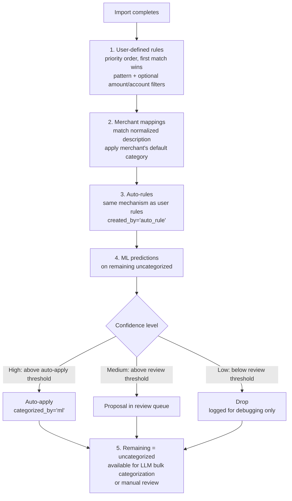
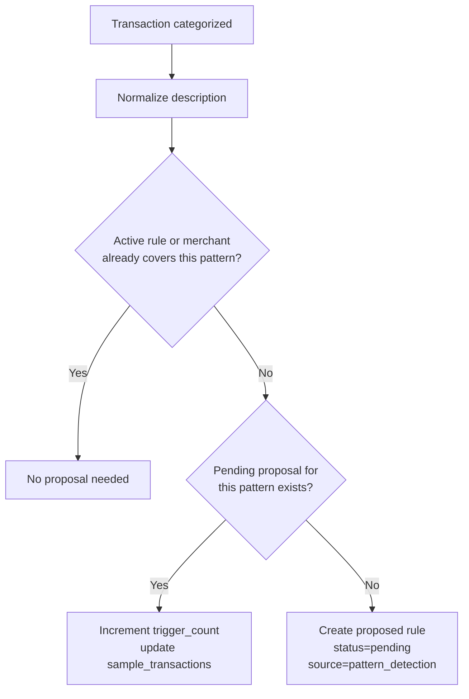
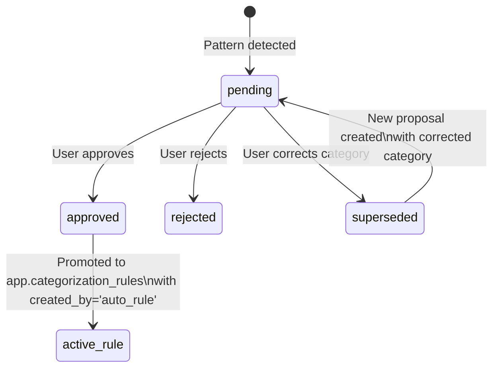
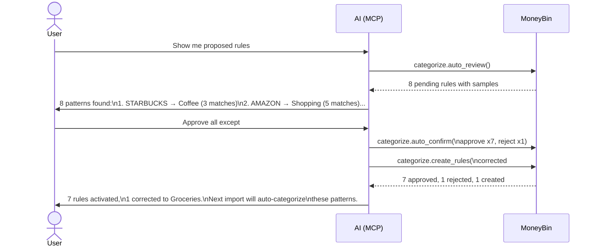

# Categorization — Overview

> Last updated: 2026-04-18
> Status: Draft — umbrella doc for the categorization initiative. Child specs listed in [Pillars](#pillars) are written separately.
> Companions: [`smart-import-overview.md`](smart-import-overview.md) (peer initiative, references this spec for pillars D & E), [`transaction-matching.md`](transaction-matching.md) (peer initiative, owns transfer detection), [`implemented/transaction-categorization.md`](implemented/transaction-categorization.md) (existing implementation this builds on), [`mcp-tool-surface.md`](mcp-tool-surface.md) (tool signatures), `CLAUDE.md` "Architecture: Data Layers"

## Purpose

Categorization is MoneyBin's umbrella spec for how transactions get labeled. It owns the full lifecycle: deterministic rules, learned patterns from user behavior, and statistical predictions from a local ML model. This doc fixes the vision, the priority hierarchy, the scope boundary, and the build order. Design and implementation details live in the child specs it points to.

## Vision

> **Every transaction gets the right label. The system learns from your decisions, proposes rules from your patterns, and trains on your history — so the tenth import requires almost no manual work.**

Three commitments:

1. **Accuracy over automation.** No silent miscategorization. Every automated decision is explainable and reversible. The user can trace any categorization to the rule, merchant mapping, or ML prediction that produced it.
2. **The system learns.** User categorizations seed auto-rules. Accumulated history trains a local ML model. Coverage improves with every import.
3. **Fully local.** Rules, merchant mappings, and ML models run entirely on the user's machine. No data leaves for categorization purposes. Verifiable from the audit log — a grep for outbound categorization calls should return zero rows.

## Target users

Categorization touches all four MoneyBin user personas:

- **Trackers** (broadest appeal) — accurate categories are what make "where does my money go?" dashboards meaningful.
- **Power users** — configurable rules, ML thresholds, and per-category accuracy metrics.
- **Budgeters** — budget tracking depends on consistent, accurate categories. Auto-rules reduce the monthly categorization chore.
- **Wealth managers** — investment transactions need category labeling for tax reporting (dividends, interest, capital gains).

## Categorization priority hierarchy

Every categorization source has a distinct `categorized_by` value for auditability. Higher-priority sources are never overwritten by lower ones.

| Priority | Source | `categorized_by` | Overwritten by | Confidence |
|---|---|---|---|---|
| 1 (highest) | User manual | `'user'` | Nothing | 1.0 |
| 2 | User-defined rules | `'rule'` | User only | 1.0 |
| 3 | Auto-generated rules | `'auto_rule'` | User, rules | 1.0 |
| 4 | ML predictions | `'ml'` | User, rules, auto-rules | Model confidence (0–1) |
| 5 | Plaid categories | `'plaid'` | All above | 1.0 (provider-supplied) |
| 6 (lowest) | LLM bulk categorize | `'ai'` | All above | 1.0 (user confirmed batch) |

The deterministic pipeline respects this ordering — a transaction already categorized by a higher-priority source is never re-categorized by a lower one.

## Deterministic categorization pipeline

The pipeline runs automatically after every import. Steps 1–2 exist today. Steps 3–4 are added by this spec.



Every step only operates on transactions not yet categorized by a higher-priority source. The pipeline is idempotent — running it twice produces the same result.

## Pillars

Categorization decomposes into two independent subsystems. Each has its own child spec; this doc fixes the shared vocabulary, sequencing, and pipeline contract.

| Pillar | Purpose | Child spec |
|---|---|---|
| **E.** Auto-rule generation | When a user categorizes a transaction, identify the pattern and propose a rule so future matching transactions are categorized automatically. User confirms before activation. | `auto-rule-generation.md` |
| **D.** ML-powered categorization | Local scikit-learn model trained on the user's own categorization history. Provides confidence-scored predictions for uncategorized transactions. | `ml-categorization.md` |

Both pillars share one architectural property: they operate within the existing categorization pipeline. Their output is a `categorized_by` value and a `confidence` score written to `app.transaction_categories`. No changes to the raw/prep/core pipeline.

**Relationship to Smart Import:** These pillars were originally listed as Smart Import pillars D and E. This spec absorbs them because categorization is a broader concern than import — rules, ML, and auto-rules apply regardless of how transactions entered the system. `smart-import-overview.md` references this spec for pillars D and E.

---

## Pillar E — Auto-rule generation

### Purpose

When a user categorizes a transaction, the system identifies the pattern and proposes a rule so future matching transactions are categorized automatically. Proposals are staged — never silently activated. The user reviews and approves them in batch.

### Trigger

After any categorization event (`categorize.bulk`, single categorization, or rule application), for each categorized transaction:



### Proposal data model

New table `app.proposed_rules`:

| Column | Type | Description |
|---|---|---|
| `proposed_rule_id` | `VARCHAR PK` | Unique identifier for this proposal |
| `merchant_pattern` | `VARCHAR NOT NULL` | Normalized pattern extracted from transaction description |
| `match_type` | `VARCHAR DEFAULT 'contains'` | How the pattern is matched: contains, exact, or regex |
| `category` | `VARCHAR NOT NULL` | Proposed category |
| `subcategory` | `VARCHAR` | Proposed subcategory |
| `status` | `VARCHAR DEFAULT 'pending'` | Lifecycle state: pending, approved, rejected, superseded |
| `trigger_count` | `INTEGER DEFAULT 1` | Number of categorizations that triggered or reinforced this proposal |
| `source` | `VARCHAR DEFAULT 'pattern_detection'` | How the proposal was generated: pattern_detection or ml |
| `sample_txn_ids` | `VARCHAR[]` | Up to 5 transaction_ids that triggered this proposal |
| `proposed_at` | `TIMESTAMP` | When the proposal was created |
| `decided_at` | `TIMESTAMP` | When the user approved or rejected |
| `decided_by` | `VARCHAR` | Who decided: 'user' or NULL if still pending |

### Status lifecycle



### Correction handling

When a user recategorizes a transaction that was auto-categorized by an auto-rule:

- **Single override:** The transaction gets `categorized_by='user'`, which outranks the rule per the priority hierarchy. The rule stays active. This is normal — one-off overrides don't indicate a bad rule.
- **Repeated overrides** (configurable via `categorization.auto_rule_override_threshold`, default 2): The system deactivates the rule, sets the original proposal to `superseded`, and creates a new proposal with the most common correction category. The user sees it in `categorize.auto_review`.

### User experience

**During categorization** — proposals accumulate silently. The `categorize.bulk` response includes a `rules_proposed` count and a hint to review:

```json
{
  "applied": 48,
  "merchants_created": 12,
  "rules_proposed": 7,
  "review_hint": "7 new rules proposed. Use categorize.auto_review to review."
}
```

**During review** — the user reviews proposals in batch via `categorize.auto_review` (shows pending proposals with sample transactions and trigger counts) and `categorize.auto_confirm` (approves or rejects in batch). Approved proposals are promoted to active rules in `app.categorization_rules` with `created_by='auto_rule'`.

**MCP flow:**



**CLI flow:**

```
moneybin categorize auto-review         # table of pending proposals
moneybin categorize auto-confirm \
  --approve ar_001 ar_002 ar_003 \
  --reject ar_004                       # batch approve/reject
```

### Open questions

- Should the proposal engine detect conflicting categorizations of the same pattern (e.g., same merchant categorized differently by amount range) and propose filtered rules? Defer to implementation experience.

---

## Pillar D — ML-powered categorization

### Purpose

A local machine learning model trained on the user's own categorization history. Provides confidence-scored predictions for uncategorized transactions, auto-applying high-confidence predictions and queuing medium-confidence ones for review.

### How it works

The ML categorizer works by analyzing the words in transaction descriptions to find patterns. During training, it learns associations like "descriptions containing STARBUCKS, PEETS, or BLUE BOTTLE tend to be Coffee Shops" and "descriptions containing SHELL, CHEVRON, or BP tend to be Gas Stations." When a new uncategorized transaction arrives, it compares its description against these learned patterns and predicts the most likely category with a confidence score.

The v1 implementation uses TF-IDF (term frequency–inverse document frequency) to convert descriptions into numeric features and SVM (support vector machine) as the classifier. This combination is lightweight (no GPU, sub-second training on personal-scale data), well-proven for short-text classification, and is the same approach used by Beancount's Smart Importer. The model interface is designed to be swappable — alternative approaches (word embeddings, pre-trained language models) can replace the internals without changing the categorization pipeline or user experience.

### Training

**Data sources** — all categorized transactions contribute to training, weighted by source quality:

| Source | Weight | Rationale |
|---|---|---|
| `user` | 1.0 | Highest signal — explicit user decision |
| `rule` | 1.0 | User-authored rule, equivalent confidence |
| `auto_rule` | 0.9 | User-approved, slightly less direct |
| `ml` | 0.0 | Excluded — circular (model training on its own output) |
| `plaid` | 0.7 | Provider-supplied, generally accurate but unvalidated |
| `ai` | 0.8 | LLM-decided, user confirmed the batch |

- **Minimum training samples:** configurable, default 50 categorized transactions.
- **Features:** TF-IDF on normalized transaction description (v1). Amount as an optional second feature for experimentation.
- **Retraining:** on-demand via `categorize.ml_train`. No automatic retraining — the user controls when the model is retrained.

### Model storage

The trained model is serialized and stored as a BLOB in `app.ml_models`, keeping the entire system in a single DuckDB file for portability and sync:

| Column | Type | Description |
|---|---|---|
| `model_id` | `VARCHAR PK` | Unique identifier for this model version |
| `model_type` | `VARCHAR DEFAULT 'categorizer'` | Model type identifier |
| `model_blob` | `BLOB NOT NULL` | Serialized scikit-learn model (pipeline: vectorizer + classifier) |
| `trained_at` | `TIMESTAMP` | When this model was trained |
| `training_samples` | `INTEGER` | Number of categorized transactions used for training |
| `accuracy` | `DECIMAL(5,4)` | Overall cross-validation accuracy |
| `feature_set` | `VARCHAR` | Features used: 'description' or 'description+amount' |
| `metadata` | `VARCHAR` | JSON: class labels, vectorizer params, per-category metrics |

### Prediction and automation posture

| Confidence | Behavior |
|---|---|
| Above `ml_auto_apply_threshold` | Auto-apply, logged with `categorized_by='ml'` and confidence score, reversible |
| Above `ml_review_threshold` | Queued as a proposal in `app.proposed_rules` with `source='ml'` |
| Below `ml_review_threshold` | Dropped (logged for debugging, not surfaced to user) |

Thresholds are configurable via Pydantic settings, independent from transaction-matching thresholds:

| Setting | Default | Description |
|---|---|---|
| `categorization.ml_auto_apply_threshold` | `0.90` | Predictions above this are auto-applied |
| `categorization.ml_review_threshold` | `0.70` | Predictions above this but below auto-apply are queued for review |

Defaults are conservative. The user tunes based on observed accuracy.

### Accuracy measurement

Model accuracy is measured by K-fold cross-validation (default K=5) on the user's categorized transaction history. The reported accuracy represents how often the model correctly predicts the category for transactions it wasn't trained on. Accuracy improves as more categorized transactions accumulate.

`categorize.ml_status` reports overall accuracy and a per-category breakdown with precision, recall, and support:

- **Precision** for a category = when the model predicts this category, how often is it correct? Low precision means false positives.
- **Recall** for a category = of all transactions that actually belong to this category, how many did the model find? Low recall means missed predictions.
- **Support** = number of training examples for this category. Low support explains low precision or recall — the model needs more examples.

```
Category          Precision  Recall   Support
Groceries         0.95       0.88     142
Coffee Shops      0.91       0.94      38
Shopping          0.72       0.68      95
Gas Stations      0.98       1.00      24
Entertainment     0.83       0.45      11
```

This gives the user actionable insight: "Shopping is noisy — maybe I should add more specific rules." "Entertainment has low recall because I only have 11 examples."

### MCP tools

| Tool | Purpose |
|---|---|
| `categorize.ml_status` | Model health: trained/untrained, sample count, accuracy, per-category precision/recall/support, confidence distribution |
| `categorize.ml_train` | Trigger training or retraining, returns accuracy metrics |
| `categorize.ml_apply` | Run predictions manually with configurable threshold and dry-run mode |

---

## Observability

Three levels of visibility into what the categorization system is doing.

### Import-time summary

Every import reports what the categorization pipeline did:

```
Imported 120 transactions from chase_checking.csv
  85 auto-categorized:
    42 by rules
    10 by auto-rules
    25 by merchant mappings
     8 by ML (confidence >= 0.90)
  35 uncategorized
  4 new rules proposed
  2 ML predictions queued for review
```

### Per-transaction explainability

`transactions.search` at `detail=full` includes categorization provenance for every transaction:

- `categorized_by` — which source categorized it
- `confidence` — how certain the source was
- `rule_id` — which rule matched (if rule or auto-rule)
- `merchant_id` — which merchant mapping matched (if merchant)

Every categorization is traceable to its origin. No black boxes.

### System-level statistics

`categorize.stats` extended with auto-rule and ML breakdowns:

- Total/categorized/uncategorized counts with percentage
- Breakdown by `categorized_by` source
- Auto-rule stats: proposed / approved / rejected / pending
- ML model stats: status, last trained, sample count, accuracy

---

## Bootstrap strategies

The categorization system starts cold — no rules, no merchant mappings, no ML model. These strategies accelerate the path to useful coverage.

### Seed merchant mappings (v1)

Ship a curated set of ~200–500 common merchant name-to-category mappings (STARBUCKS → Coffee, AMAZON → Shopping, NETFLIX → Entertainment, etc.). These are deterministic — no ML needed — and provide immediate value on first import.

The seed merchant list is loaded alongside the existing Plaid PFCv2 category seed. Users can disable or override any seed mapping.

### Migration-imported categories as bootstrap (v1)

When users import data from competing tools (Mint, YNAB, Tiller, Monarch) via the
[smart tabular importer](smart-tabular-import.md), source-provided categories are
preserved in `raw.tabular_transactions.category`. These migrated categories are
a powerful bootstrap signal:

1. **Direct rule seeding.** Each unique (merchant, category) pair in the migrated data
   becomes a candidate auto-rule. Import 3 years of Mint data where every Kroger
   transaction is "Groceries," and MoneyBin can instantly generate a rule for Kroger.
2. **Category mapping.** Source tool categories (e.g., Mint's "Food & Dining > Restaurants")
   are mapped to MoneyBin categories via a one-time mapping table per source tool.
3. **ML training data.** Migrated categorizations are pre-labeled training data for the
   ML model. A user who imports 5 years of history has a corpus that makes the ML model
   useful from day one.

This is the highest-leverage bootstrap strategy for users switching from another tool.
See `private/specs/strategic-analysis.md` §6 for the full migration strategy.

### Synthetic training data from seed merchants (v1)

Generate synthetic transaction descriptions from the seed merchant list (e.g., "SQ *STARBUCKS #1234", "AMZN MKTP US*AB1CD2") with their known categories. Train the initial ML model on this synthetic corpus as a cold-start strategy. Accuracy will be moderate but better than no model.

### Provider categories as training signal (automatic)

When transactions arrive from Plaid (or future providers), they include provider-supplied categories. These are weighted at 0.7 in the training pipeline — a free bootstrap signal for users with bank sync. Users with Plaid get a bootstrapped ML model faster.

### LLM categorizations as training signal (automatic)

When the AI bulk-categorizes via MCP, those categorizations (weighted at 0.8) become training data. A single MCP categorization session can provide enough labeled data to train an initial model.

### Community-contributed merchant mappings (future)

Users could opt in to share anonymized merchant-to-category mappings: normalized merchant name and category only, never amounts, dates, or raw descriptions. Privacy constraints this must satisfy:

- Explicit opt-in, not default
- User reviews what will be shared before sending
- Allowlist/blocklist of merchants the user is willing to share
- Aggregation threshold — a mapping only enters the public dataset if multiple users contributed it (k-anonymity)
- Aligns with `privacy-and-ai-trust.md` consent model

This is a future initiative with real privacy design work. The architecture supports it — the seed merchant list is loadable from external sources — but the contribution pipeline is out of scope for this spec.

---

## In scope

- Categorization priority hierarchy (user > rules > auto-rules > ML > plaid > ai)
- Auto-rule generation lifecycle: trigger, proposal, review, activation, correction handling
- ML categorization: training pipeline, prediction, confidence-gated automation, model storage
- Deterministic categorization pipeline documentation (rules + merchants, already implemented)
- `categorized_by` taxonomy and auditability
- Confidence thresholds (configurable, independent from transaction-matching)
- Observability: import summaries, per-transaction explainability, system-level stats
- Bootstrap strategies: seed merchants, synthetic training data, provider/LLM signal

## Out of scope

Explicitly deferred or owned elsewhere.

- **Split transactions** — removed per import-first philosophy (see `mcp-architecture.md` section 9). Transaction annotations (`transactions.annotate` with `cash_breakdown`) cover the ATM-cash use case without creating phantom records.
- **Transfer detection** — owned by `transaction-matching.md`. Different concern (record identity, not labeling).
- **Category taxonomy seed data** — Plaid PFCv2 seed is already implemented. This spec references it; it is not redesigned here.
- **Taxonomy evolution** — category merge/rename with cascading updates to rules, merchants, and transaction_categories. Future direction (see below).
- **Provider category mapping table** — the current `plaid_detailed` column on `app.categories` is provider-specific. When a second provider (Nordigen, etc.) is integrated, this column should be extracted to a generic `app.category_mappings` table. Future direction (see below).
- **LLM-assisted bulk categorization** — already implemented. This spec documents the contract and priority level; it does not redesign the workflow.
- **Merchant normalization** — already implemented. This spec documents the contract; it does not redesign the normalization logic.

## Adjacent initiatives

### Smart Import — `smart-import-overview.md`

Peer initiative. Originally listed ML categorization and auto-rule generation as its pillars D and E. This spec absorbs those pillars because categorization is a broader concern than import — rules, ML, and auto-rules apply regardless of how transactions entered the system. `smart-import-overview.md` has been updated to reference this spec for pillars D and E.

### Transaction Matching — `transaction-matching.md`

Peer initiative. Owns transfer detection, cross-source deduplication, and golden-record merge rules. Transfer detection is a record-identity concern, not a labeling concern — it stays with transaction matching.

### Privacy & AI Trust — `privacy-and-ai-trust.md`

Constrains any future cloud-based categorization features. The community-contributed merchant mappings strategy (future) must conform to this spec's consent model.

## Build order & rationale

1. **Pillar E — Auto-rule generation** — smallest scope, highest leverage on existing code, independent of ML. Delivers the "system learns" promise immediately. Establishes the proposal/review queue that ML predictions later feed into.
2. **Pillar D — ML categorization** — benefits from pillar E being in place (more categorized transactions = more training data). Uses the same proposal queue for medium-confidence predictions. Designed as a core pillar to enable experimentation, even though the 12-month MVP plan originally deferred it.

**Relationship to the 12-month plan:** Auto-rules are scheduled for Q1 Month 3. ML was originally deferred to post-MVP, but this spec designs it as a core pillar to enable earlier experimentation. The build order within Q1 is unchanged — auto-rules first. ML can begin as soon as there's enough categorized data to train on.

## Future directions

Not pillars, not designed in detail. Architectural constraints noted so the current design does not preclude them.

1. **Taxonomy evolution** — category merge/rename with cascading updates to rules, merchants, and transaction_categories. Needed when the seed taxonomy no longer fits a user's needs. The existing `app.categories` table supports custom categories; this future work adds merge/rename operations.

2. **Community-contributed merchant mappings** — see Bootstrap Strategies section. Requires its own spec with privacy design work.

3. **Provider category mapping table** — extract `plaid_detailed` from `app.categories` into a generic `app.category_mappings` table (`provider`, `provider_category`, `moneybin_category`, `moneybin_subcategory`). Triggered when a second provider is integrated. Single-column migration, architecturally simple.

4. **Amount/account-aware rule proposals** — detect when the same merchant is categorized differently depending on amount range or account and propose filtered rules. Deferred to implementation experience with the basic proposal engine.

## Success criteria

- **Coverage curve.** Categorization coverage (% of transactions categorized automatically on import) increases over time. The tenth import has meaningfully higher auto-categorization than the first.
- **Rule adoption rate.** >70% of proposed auto-rules are approved by the user. Low adoption signals noisy proposals.
- **ML accuracy.** Cross-validated accuracy >=80% when trained on >=200 categorized transactions. Per-category precision/recall identifies weak spots.
- **No silent miscategorization.** Every auto-applied categorization (rule or ML) is logged with source and confidence. Users can trace any categorization to its origin.
- **Zero external traffic.** Rules, merchant mappings, ML training, and ML prediction run entirely locally. Verifiable from the audit log.

## Open questions

Cross-cutting decisions deferred to child specs or to resolve during implementation.

- **ML retraining trigger.** Should the system suggest retraining when accuracy metrics decline or when a significant number of new categorizations have accumulated since the last training? v1 is on-demand only; automatic suggestions are a possible enhancement.
- **Auto-rule deduplication.** When multiple transactions trigger proposals for overlapping patterns (e.g., "STARBUCKS" and "STARBUCKS RESERVE"), how should the proposal engine handle it? Merge into the broader pattern? Keep both and let the user decide?
- **ML confidence calibration.** SVM confidence scores are not always well-calibrated probabilities. Should the spec require Platt scaling or isotonic regression to improve calibration? Defer to experimentation.
- **Interaction with Smart Import pillar F.** AI-parsed transactions enter the system with a pillar-F-specific `source_type` value (TBD). Should these be treated differently by the ML model (e.g., lower weight), or the same as any other source? The `categorized_by` hierarchy is independent of `source_type`, but the ML training pipeline could weight by source type as well as categorization source.
