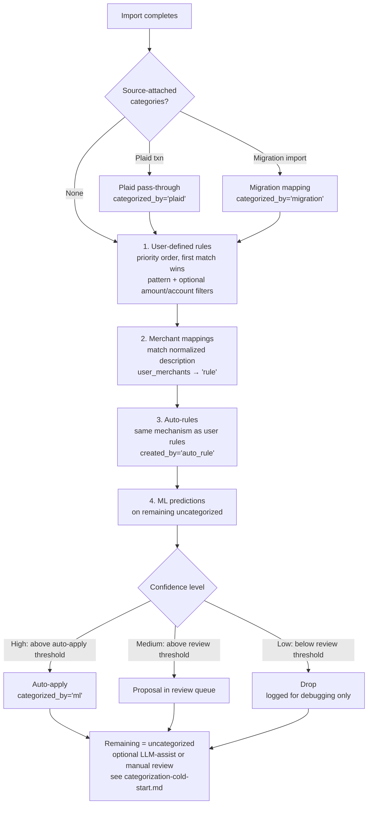

# Categorization — Overview

> Last updated: 2026-04-19
> Status: Ready — umbrella doc for the categorization initiative. Child specs listed in [Pillars](#pillars) are written separately.
> Companions: [`categorization-matching-mechanics.md`](categorization-matching-mechanics.md) (algorithm contract: `match_text` construction, exemplar accumulation, source-precedence enforcement on write, snowball auto-apply), [`smart-import-overview.md`](smart-import-overview.md) (peer initiative, references this spec for pillars D & E), [`matching-overview.md`](matching-overview.md) (peer initiative, owns transfer detection), [`archived/transaction-categorization.md`](archived/transaction-categorization.md) (existing implementation this builds on), [`moneybin-mcp.md`](moneybin-mcp.md) (tool signatures), `CLAUDE.md` "Architecture: Data Layers"

## Purpose

Categorization is MoneyBin's umbrella spec for how transactions get labeled. It owns the full lifecycle: deterministic rules, learned patterns from user behavior, and statistical predictions from a local ML model. This doc fixes the vision, the priority hierarchy, the scope boundary, and the build order. Design and implementation details live in the child specs it points to.

## Vision

> **Every transaction gets the right label. The system learns from your decisions, proposes rules from your patterns, and trains on your history — so the tenth import requires almost no manual work.**

Three commitments:

1. **Accuracy over automation.** No silent miscategorization. Every automated decision is explainable and reversible. The user can trace any categorization to the rule, merchant mapping, or ML prediction that produced it.
2. **The system learns.** User categorizations seed auto-rules. Accumulated history trains a local ML model. Coverage improves with every import.
3. **Fully local for the automatic path.** Rules, merchant mappings, Plaid pass-through, migration imports, and ML models run entirely on the user's machine. No data leaves for *automatic* categorization. LLM-assisted categorization (priority 7) is opt-in, user-mediated, and bound by the redaction contract documented in [`categorization-cold-start.md`](categorization-cold-start.md) — no transaction data leaves except via that explicit workflow. Verifiable from the audit log: outbound categorization calls only appear when the user invoked `transactions_categorize_assist` or its CLI equivalent.

## Target users

Categorization touches all four MoneyBin user personas:

- **Trackers** (broadest appeal) — accurate categories are what make "where does my money go?" dashboards meaningful.
- **Power users** — configurable rules, ML thresholds, and per-category accuracy metrics.
- **Budgeters** — budget tracking depends on consistent, accurate categories. Auto-rules reduce the monthly categorization chore.
- **Wealth managers** — investment transactions need category labeling for tax reporting (dividends, interest, capital gains).

## Categorization priority hierarchy

Every categorization source has a distinct `categorized_by` value for auditability. Higher-priority sources are never overwritten by lower ones.

| Priority | Source | `categorized_by` | Overwritten by | Confidence |
|---|---|---|---|---|
| 1 (highest) | User manual | `'user'` | Nothing | 1.0 |
| 2 | User-defined rules | `'rule'` | User only | 1.0 |
| 3 | Auto-generated rules | `'auto_rule'` | User, rules | 1.0 |
| 4 | Migration imports | `'migration'` | All above | 1.0 |
| 5 | ML predictions | `'ml'` | All above | Model confidence (0–1) |
| 6 | Plaid categories | `'plaid'` | All above | 1.0 (provider-supplied) |
| 7 (lowest) | LLM-assist | `'ai'` | All above | 1.0 (user accepted batch) |

The deterministic pipeline respects this ordering — a transaction already categorized by a higher-priority source is never re-categorized by a lower one. See [`categorization-cold-start.md`](categorization-cold-start.md) for the full per-source mechanism description.

**Enforcement is on write** via the `write_categorization` helper in `categorization_service.py` (see [`categorization-matching-mechanics.md`](categorization-matching-mechanics.md) §Source precedence). Every write to `app.transaction_categories` compares the incoming source's priority against the existing row's via an inlined `CASE` expression in an `INSERT ... ON CONFLICT ... DO UPDATE WHERE` shape — lower-priority sources cannot overwrite higher-priority assignments. The `categorized_by` column is the lock; there is no separate lock table.

## Deterministic categorization pipeline

The pipeline runs automatically after every import. Source-attached categorizations (Plaid, migration imports) apply at import time before the pipeline runs. Steps 1–2 exist today. Steps 3–4 are added by this spec. The optional LLM-assist step (after the deterministic pipeline) is owned by [`categorization-cold-start.md`](categorization-cold-start.md).



Every step only operates on transactions not yet categorized by a higher-priority source. The pipeline is idempotent — running it twice produces the same result.

**Pipeline triggers.** This pipeline runs after every import AND after every `transactions_categorize_apply` commit (the "snowball" auto-apply — see [`categorization-matching-mechanics.md`](categorization-matching-mechanics.md) §Apply order). When the LLM-assist batch creates new merchants or exemplars, `categorize_pending()` fires immediately so newly-learned patterns fan out to remaining uncategorized rows in the same dataset. Source-priority enforcement keeps user manual edits safe across re-runs.

## Pillars

Categorization decomposes into two independent subsystems. Each has its own child spec; this doc fixes the shared vocabulary, sequencing, and pipeline contract.

| Pillar | Purpose | Child spec |
|---|---|---|
| **E.** Auto-rule generation | When a user categorizes a transaction, identify the pattern and propose a rule so future matching transactions are categorized automatically. User confirms before activation. | `categorization-auto-rules.md` |
| **D.** ML-powered categorization | Local scikit-learn model trained on the user's own categorization history. Provides confidence-scored predictions for uncategorized transactions. | `categorization-ml.md` |

Both pillars share one architectural property: they operate within the existing categorization pipeline. Their output is a `categorized_by` value and a `confidence` score written to `app.transaction_categories`. No changes to the raw/prep/core pipeline.

**Relationship to Smart Import:** These pillars were originally listed as Smart Import pillars D and E. This spec absorbs them because categorization is a broader concern than import — rules, ML, and auto-rules apply regardless of how transactions entered the system. `smart-import-overview.md` references this spec for pillars D and E.

---

## Pillar E — Auto-rule generation

When a user categorizes a transaction, the system identifies the pattern and proposes a rule so future matching transactions are categorized automatically. Proposals are staged — never silently activated. The user reviews and approves them in batch.

**Key design decisions** (full detail in [`categorization-auto-rules.md`](categorization-auto-rules.md)):

- **Trigger:** After any categorization event (`transactions_categorize_apply` or CLI categorization), for each categorized transaction, check whether an active rule or merchant mapping already covers the pattern. If not, create or reinforce a proposal.
- **Pattern extraction:** Merchant-first — use the canonical merchant name when a `merchant_id` exists, fall back to `normalize_description()` cleanup otherwise. Reuses the existing description normalization code.
- **Proposal lifecycle:** `pending` → `approved` (promoted to `app.categorization_rules` with `created_by='auto_rule'`, `priority=200`) or `rejected` or `superseded` (when the user corrects the category).
- **Correction handling:** Single user overrides don't affect the rule. After `auto_rule_override_threshold` (default 2) overrides, the rule is deactivated and a new proposal is created with the corrected category.
- **UX:** Proposals accumulate silently. `transactions_categorize_apply` response includes a `rules_proposed` count and review hint. User reviews in batch via `transactions_categorize_auto_review` and `transactions_categorize_auto_confirm`. Approved rules take effect immediately against existing uncategorized transactions (synchronous promotion).
- **Conflicting categorizations:** Amount/account-aware rule proposals are deferred to future enhancements (see Future Directions).

---

## Pillar D — ML-powered categorization

### Purpose

A local machine learning model trained on the user's own categorization history. Provides confidence-scored predictions for uncategorized transactions, auto-applying high-confidence predictions and queuing medium-confidence ones for review.

### How it works

The ML categorizer works by analyzing the words in transaction descriptions to find patterns. During training, it learns associations like "descriptions containing STARBUCKS, PEETS, or BLUE BOTTLE tend to be Coffee Shops" and "descriptions containing SHELL, CHEVRON, or BP tend to be Gas Stations." When a new uncategorized transaction arrives, it compares its description against these learned patterns and predicts the most likely category with a confidence score.

The v1 implementation uses TF-IDF (term frequency–inverse document frequency) to convert descriptions into numeric features and SVM (support vector machine) as the classifier. This combination is lightweight (no GPU, sub-second training on personal-scale data), well-proven for short-text classification, and is the same approach used by Beancount's Smart Importer. The model interface is designed to be swappable — alternative approaches (word embeddings, pre-trained language models) can replace the internals without changing the categorization pipeline or user experience.

### Training

**Data sources** — all categorized transactions contribute to training, weighted by source quality:

| Source | Weight | Rationale |
|---|---|---|
| `user` | 1.0 | Highest signal — explicit user decision |
| `rule` | 1.0 | User-authored rule, equivalent confidence |
| `auto_rule` | 0.9 | User-accepted, slightly less direct |
| `migration` | 0.85 | User-attested in prior tool (Mint, YNAB, etc.) |
| `ml` | 0.0 | Excluded — circular (model training on its own output) |
| `plaid` | 0.7 | Provider-supplied, generally accurate but unvalidated |
| `ai` | 0.8 | LLM-decided, user accepted the batch |

- **Minimum training samples:** configurable, default 50 categorized transactions.
- **Features:** TF-IDF on normalized transaction description (v1). Amount as an optional second feature for experimentation.
- **Retraining:** auto-retrains when statistically significant new categorizations exist (threshold relative to training set size, configurable via `categorization.ml_retrain_threshold`). `transactions_categorize_ml_train` remains as a manual escape hatch but is not part of the standard workflow.

### Model storage

The trained model is serialized and stored as a BLOB in `app.ml_models`, keeping the entire system in a single DuckDB file for portability and sync:

| Column | Type | Description |
|---|---|---|
| `model_id` | `VARCHAR PK` | Unique identifier for this model version |
| `model_type` | `VARCHAR DEFAULT 'categorizer'` | Model type identifier |
| `model_blob` | `BLOB NOT NULL` | Serialized scikit-learn model (pipeline: vectorizer + classifier) |
| `trained_at` | `TIMESTAMP` | When this model was trained |
| `training_samples` | `INTEGER` | Number of categorized transactions used for training |
| `accuracy` | `DECIMAL(5,4)` | Overall cross-validation accuracy |
| `feature_set` | `VARCHAR` | Features used: 'description' or 'description+amount' |
| `metadata` | `VARCHAR` | JSON: class labels, vectorizer params, per-category metrics |

### Prediction and automation posture

| Confidence | Behavior |
|---|---|
| Above `ml_auto_apply_threshold` | Auto-apply, logged with `categorized_by='ml'` and confidence score, reversible |
| Above `ml_review_threshold` | Queued as a proposal in `app.proposed_rules` with `source='ml'` |
| Below `ml_review_threshold` | Dropped (logged for debugging, not surfaced to user) |

Thresholds are configurable via Pydantic settings, independent from transaction-matching thresholds:

| Setting | Default | Description |
|---|---|---|
| `categorization.ml_auto_apply_threshold` | `0.90` | Predictions above this are auto-applied |
| `categorization.ml_review_threshold` | `0.70` | Predictions above this but below auto-apply are queued for review |

Defaults are conservative. The user tunes based on observed accuracy.

### Confidence calibration

Raw SVM scores are distances from the decision boundary, not probabilities. A score of 0.90 does not mean "90% likely correct" — it means "far from the boundary." The ML pipeline uses **Platt scaling** (scikit-learn's `CalibratedClassifierCV`) to convert raw scores into calibrated probability estimates so that confidence thresholds correspond to actual accuracy rates.

Calibration is always on — no raw-score mode. On small training sets (< 200 samples), calibrated probabilities are noisier but still more meaningful than raw distances. Calibration precision improves naturally as training data grows.

### Progressive confidence disclosure

User-facing surfaces (CLI, MCP responses) display **qualitative confidence tiers** rather than raw numeric scores until the model has enough data for calibration to be reliable:

| Tier | Display | Internal range |
|---|---|---|
| High | "high confidence" | Above `ml_auto_apply_threshold` |
| Moderate | "moderate confidence" | Between `ml_review_threshold` and `ml_auto_apply_threshold` |
| Low | "low confidence" | Below `ml_review_threshold` |

`transactions_categorize_ml_status` and `detail=full` on transaction queries always expose the numeric score for power users. The qualitative tiers are the default presentation — they hide calibration noise while the model matures and communicate the system's certainty in terms that don't require ML background.

### Accuracy measurement

Model accuracy is measured by K-fold cross-validation (default K=5) on the user's categorized transaction history. The reported accuracy represents how often the model correctly predicts the category for transactions it wasn't trained on. Accuracy improves as more categorized transactions accumulate.

`transactions_categorize_ml_status` reports overall accuracy and a per-category breakdown with precision, recall, and support:

- **Precision** for a category = when the model predicts this category, how often is it correct? Low precision means false positives.
- **Recall** for a category = of all transactions that actually belong to this category, how many did the model find? Low recall means missed predictions.
- **Support** = number of training examples for this category. Low support explains low precision or recall — the model needs more examples.

```
Category          Precision  Recall   Support
Groceries         0.95       0.88     142
Coffee Shops      0.91       0.94      38
Shopping          0.72       0.68      95
Gas Stations      0.98       1.00      24
Entertainment     0.83       0.45      11
```

This gives the user actionable insight: "Shopping is noisy — maybe I should add more specific rules." "Entertainment has low recall because I only have 11 examples."

### MCP tools

| Tool | Purpose |
|---|---|
| `transactions_categorize_ml_status` | Model health: trained/untrained, sample count, accuracy, per-category precision/recall/support, confidence distribution |
| `transactions_categorize_ml_train` | Trigger training or retraining, returns accuracy metrics |
| `transactions_categorize_ml_apply` | Run predictions manually with configurable threshold and dry-run mode |

---

## Observability

Three levels of visibility into what the categorization system is doing.

### Import-time summary

Every import reports what the categorization pipeline did. User-facing output uses qualitative confidence tiers (see Progressive Confidence Disclosure):

```
Imported 120 transactions from chase_checking.csv
  85 auto-categorized:
    42 by rules
    10 by auto-rules
    25 by merchant mappings
     8 by ML (high confidence)
  35 uncategorized
  4 new rules proposed
  2 ML predictions queued for review (moderate confidence)
```

### Per-transaction explainability

`transactions_search` includes categorization provenance for every transaction. The level of detail depends on the `detail` parameter:

**`detail=standard`** (default) — qualitative confidence tiers:

```json
{
  "transaction_id": "txn_abc123",
  "description": "WHOLE FOODS MKT #10234",
  "category": "Groceries",
  "categorized_by": "ml",
  "confidence_tier": "high"
}
```

**`detail=full`** — numeric scores for power users:

```json
{
  "transaction_id": "txn_abc123",
  "description": "WHOLE FOODS MKT #10234",
  "category": "Groceries",
  "categorized_by": "ml",
  "confidence": 0.94,
  "confidence_tier": "high",
  "rule_id": null,
  "merchant_id": "m_whofoods"
}
```

Every categorization is traceable to its origin. No black boxes.

### System-level statistics

`transactions_categorize_stats` extended with auto-rule and ML breakdowns:

- Total/categorized/uncategorized counts with percentage
- Breakdown by `categorized_by` source
- Auto-rule stats: proposed / approved / rejected / pending
- ML model stats: status, last trained, sample count, accuracy

---

## Bootstrap strategies

The categorization system starts cold — no rules, no merchant mappings, no ML model. These strategies accelerate the path to useful coverage. See [`categorization-cold-start.md`](categorization-cold-start.md) for the full cold-start workflow that ties them together.

### Migration-imported categories as bootstrap (v1)

When users import data from competing tools (Mint, YNAB, Tiller, Monarch) via the
[smart tabular importer](smart-import-tabular.md), source-provided categories are
preserved in `raw.tabular_transactions.category`. These migrated categories are
a powerful bootstrap signal:

1. **Direct rule seeding.** Each unique (merchant, category) pair in the migrated data
   becomes a candidate auto-rule. Import 3 years of Mint data where every Kroger
   transaction is "Groceries," and MoneyBin can instantly generate a rule for Kroger.
2. **Category mapping.** Source tool categories (e.g., Mint's "Food & Dining > Restaurants")
   are mapped to MoneyBin categories via a one-time mapping table per source tool.
3. **ML training data.** Migrated categorizations are pre-labeled training data for the
   ML model. A user who imports 5 years of history has a corpus that makes the ML model
   useful from day one.

This is the highest-leverage bootstrap strategy for users switching from another tool. Migration-applied categorizations write `categorized_by='migration'` for traceability and weighted-training (0.85).

### LLM-assist cold-start workflow (v1)

The first-run LLM-assisted categorization workflow — designed in [`categorization-cold-start.md`](categorization-cold-start.md) — turns the user's MCP-connected LLM (or any LLM via the CLI bridge) into the cold-start solver for transactions not covered by Plaid or migration. PII redaction contract enforced at the type level: amounts, dates, and account references never leave; descriptions are stripped of card last-fours, emails, phones, and P2P recipient names before transmission. Auto-rule mining of LLM categorizations creates the snowball that reduces LLM involvement on subsequent imports.

### Provider categories as training signal (automatic)

When transactions arrive from Plaid (or future providers), they include provider-supplied categories. These are weighted at 0.7 in the training pipeline — a free bootstrap signal for users with bank sync. Users with Plaid get a bootstrapped ML model faster.

### LLM categorizations as training signal (automatic)

When the AI categorizes a batch via MCP or the CLI bridge, those categorizations (weighted at 0.8) become training data. A single LLM-assist session can provide enough labeled data to train an initial model.

### Community-contributed merchant mappings (future)

Users could opt in to share anonymized merchant-to-category mappings: normalized merchant name and category only, never amounts, dates, or raw descriptions. Privacy constraints this must satisfy:

- Explicit opt-in, not default
- User reviews what will be shared before sending
- Allowlist/blocklist of merchants the user is willing to share
- Aggregation threshold — a mapping only enters the public dataset if multiple users contributed it (k-anonymity)
- Aligns with `privacy-and-ai-trust.md` consent model

This is a future initiative with real privacy design work. The contribution pipeline is out of scope for this spec. When built, the community data could also feed a community-trained ML baseline model (see pre-trained baseline model above).

---

## In scope

- Categorization priority hierarchy (user > rules > auto-rules > ML > plaid > ai)
- Auto-rule generation lifecycle: trigger, proposal, review, activation, correction handling
- ML categorization: training pipeline, prediction, confidence-gated automation, model storage
- Deterministic categorization pipeline documentation (rules + merchants, already implemented)
- `categorized_by` taxonomy and auditability
- Confidence thresholds (configurable, independent from transaction-matching)
- Observability: import summaries, per-transaction explainability, system-level stats
- Bootstrap strategies: migration imports, provider/LLM signal, LLM-assist cold-start workflow (per [`categorization-cold-start.md`](categorization-cold-start.md)), progressive confidence disclosure

## Out of scope

Explicitly deferred or owned elsewhere.

- **Split transactions** — removed per import-first philosophy (see `mcp-architecture.md` section 9). Transaction annotations (`transactions_annotate` with `cash_breakdown`) cover the ATM-cash use case without creating phantom records.
- **Transfer detection** — owned by `matching-overview.md`. Different concern (record identity, not labeling).
- **Category taxonomy seed data** — Plaid PFCv2 seed is already implemented. This spec references it; it is not redesigned here.
- **Taxonomy evolution** — category merge/rename with cascading updates to rules, merchants, and transaction_categories. Future direction (see below).
- **Provider category mapping table** — the current `plaid_detailed` column on `app.categories` is provider-specific. When a second provider (Nordigen, etc.) is integrated, this column should be extracted to a generic `app.category_mappings` table. Future direction (see below).
- **LLM-assisted bulk categorization workflow** — the bulk tool itself is implemented; the cold-start workflow that wraps it (first-run prompt, PII redaction, propose/commit lifecycle) is owned by [`categorization-cold-start.md`](categorization-cold-start.md), not redesigned here.
- **Merchant normalization** — already implemented. This spec documents the contract; it does not redesign the normalization logic.

## Adjacent initiatives

### Smart Import — `smart-import-overview.md`

Peer initiative. Originally listed ML categorization and auto-rule generation as its pillars D and E. This spec absorbs those pillars because categorization is a broader concern than import — rules, ML, and auto-rules apply regardless of how transactions entered the system. `smart-import-overview.md` has been updated to reference this spec for pillars D and E.

### Transaction Matching — `matching-overview.md`

Peer initiative. Owns transfer detection, cross-source deduplication, and golden-record merge rules. Transfer detection is a record-identity concern, not a labeling concern — it stays with transaction matching.

### Privacy & AI Trust — `privacy-and-ai-trust.md`

Constrains any future cloud-based categorization features. The community-contributed merchant mappings strategy (future) must conform to this spec's consent model. The cold-start LLM-assist redaction contract (per [`categorization-cold-start.md`](categorization-cold-start.md)) aligns with this spec.

### Recurring transaction detection (recommended future spec)

Every commercial competitor surfaces "this is your monthly Netflix charge" as a first-class concept. Recurring detection complements categorization — recurring patterns are easy to categorize and surface as "you have N active subscriptions." A future spec would design transaction-series identification, schedule inference, and a `transactions_recurring_assist` peer to `transactions_categorize_assist`. Independent from cold-start; reuses the same workflow primitives.

### Local LLM-driven categorization (recommended future spec)

A future spec could add an opt-in path where MoneyBin invokes a locally-running LLM (Ollama, llamafile, LM Studio, etc.) for categorization without requiring an MCP client or external API. Closes the cold-start gap for users who want LLM-assist with full offline operation. Reuses the export/apply JSON contract from [`categorization-cold-start.md`](categorization-cold-start.md) — the local LLM is just another consumer of the same primitives. Not v1; revisit when local-LLM ergonomics mature and there's measured user demand.

## Build order & rationale

1. **Pillar E — Auto-rule generation** — smallest scope, highest leverage on existing code, independent of ML. Delivers the "system learns" promise immediately. Establishes the proposal/review queue that ML predictions later feed into.
2. **Pillar D — ML categorization** — benefits from pillar E being in place (more categorized transactions = more training data). Uses the same proposal queue for medium-confidence predictions. Designed as a core pillar to enable experimentation, even though the 12-month MVP plan originally deferred it.

**Relationship to the 12-month plan:** Auto-rules are scheduled for Q1 Month 3. ML was originally deferred to post-MVP, but this spec designs it as a core pillar to enable earlier experimentation. The build order within Q1 is unchanged — auto-rules first. ML can begin as soon as there's enough categorized data to train on.

## Future directions

Not pillars, not designed in detail. Architectural constraints noted so the current design does not preclude them.

1. **Taxonomy evolution** — category merge/rename with cascading updates to rules, merchants, and transaction_categories. Needed when the default category taxonomy no longer fits a user's needs. The existing `app.categories` table supports custom categories; this future work adds merge/rename operations.

2. **Community-contributed merchant mappings and community ML baseline** — see Bootstrap Strategies section. Merchant mappings and a community-trained ML model could both be built from anonymized opt-in data. Requires its own spec with privacy design work.

3. **Provider category mapping table** — extract `plaid_detailed` from `app.categories` into a generic `app.category_mappings` table (`provider`, `provider_category`, `moneybin_category`, `moneybin_subcategory`). Triggered when a second provider is integrated. Single-column migration, architecturally simple.

4. **Amount/account-aware rule proposals** — detect when the same merchant is categorized differently depending on amount range or account and propose filtered rules. Deferred to implementation experience with the basic proposal engine.

5. **Merchant entity resolution** (`merchant-entity-resolution.md`) — evolve `app.user_merchants` from a pattern-to-category cache into a first-class entity model. Today, canonical names are LLM-assigned strings with no authority or consistency enforcement. This future spec would design: multiple description patterns per merchant entity, automated pattern discovery (from auto-rules, ML, LLM interactions), query-time merchant resolution ("show me all Starbucks spending" finds all description variants), and conflict resolution UX (minimal user intervention — resolve ambiguities only, not manual mapping). Impacts auto-rules (merchant-first pattern extraction quality), ML (entity-level features), and analytics (merchant-level aggregation).

## Success criteria

- **Coverage curve.** Categorization coverage (% of transactions categorized automatically on import) increases over time. The tenth import has meaningfully higher auto-categorization than the first.
- **Rule adoption rate.** >70% of proposed auto-rules are approved by the user. Low adoption signals noisy proposals.
- **ML accuracy.** Cross-validated accuracy >=80% when trained on >=200 categorized transactions. Per-category precision/recall identifies weak spots.
- **No silent miscategorization.** Every auto-applied categorization (rule or ML) is logged with source and confidence. Users can trace any categorization to its origin.
- **Zero external traffic.** Rules, merchant mappings, ML training, and ML prediction run entirely locally. Verifiable from the audit log.

## Resolved questions

Decisions made during spec review, preserved for context.

- **ML retraining trigger.** Auto-retrain when statistically significant new categorizations exist. The ML prediction step checks whether retraining is warranted before running predictions. Threshold is relative to training set size and configurable via `categorization.ml_retrain_threshold`. `transactions_categorize_ml_train` remains as a manual escape hatch but is not part of the standard workflow. The import summary notes when retraining occurred. The system should feel like it's learning from the user — "accuracy over automation" does not override the "system learns" commitment.
- **Auto-rule deduplication.** Both proposals survive independently; user decides during review. See `categorization-auto-rules.md` Deduplication table and Out of Scope section. Intelligent merging of overlapping patterns is a future enhancement.
- **ML confidence calibration.** Always use Platt scaling (`CalibratedClassifierCV`). Raw SVM distances are not meaningful as thresholds. Calibrated probabilities are noisier on small datasets but still more useful than uncalibrated scores. Progressive confidence disclosure (qualitative tiers instead of numeric scores) hides calibration noise from users until the model matures. See Confidence Calibration and Progressive Confidence Disclosure sections under Pillar D.
- **Interaction with Smart Import pillar F.** ML training weights are determined by `categorized_by`, not `source_type`. No interaction. A transaction's label quality depends on who categorized it (user, rule, AI), not how the transaction entered the system (CSV, Plaid, AI-parsed PDF). If AI-parsed transactions have unreliable descriptions, that's a pillar F quality concern at parse time, not a training weight concern.

## Open questions

Cross-cutting decisions deferred to child specs or to resolve during implementation.
- **Observability strategy.** Multiple sections of this spec stipulate logging (retraining events, threshold-tier shifts, auto-rule proposals, ML predictions dropped). A cross-cutting logging/observability design pass is needed to ensure a coherent approach across import summaries, per-transaction provenance, and system-level statistics. This is a concern shared with other specs (sync, matching) and should be addressed holistically rather than per-feature.
- **Category mapping tables for migration.** The migration bootstrap strategy references "a one-time mapping table per source tool" but the mapping table schema is not designed. Needed before migration bootstrap can function.
- **In-band LLM-assist for headless/automated CLI workflows.** Designed-out for v1; the cold-start manual-bridge (`moneybin categorize export-uncategorized` + `apply-from-file`) serves the common case, and agents driving the CLI directly use the same primitives. Revisit if usage data shows demand for direct LLM-API-calling commands like `moneybin categorize llm --provider claude`. See [`categorization-cold-start.md`](categorization-cold-start.md) Section 9.
