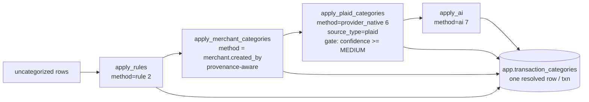

# Categorization Source Model & Plaid PFC Categorizer

> Last updated: 2026-06-30
> Status: in-progress
> Address: M1U (Ingestion Core)
> Type: Feature
> Owns: the category **source-model** contract — the `method` vs `source_type`
> split on `app.transaction_categories`, provenance-aware merchant-default
> authority, and the derived per-source candidate view. Ships the first
> provider-native categorizer (Plaid Personal Finance Category) on that contract.
> Mirrors: the identity-MDM pattern from
> [`merchant-entity-resolution.md`](merchant-entity-resolution.md) (M1T) and
> [`account-identity-resolution.md`](account-identity-resolution.md) (M1S) —
> per-source assertions + a resolved canonical + a (deferred) review queue, lifted
> from the *identity* grain to the *category* grain.
> Depends on: Tier-1 (PR #283) — `category_detailed` (Plaid PFC `detailed`) +
> `category_confidence` (`confidence_level`) captured into `raw.plaid_transactions`
> + `prep.stg_plaid__transactions`, backfillable via `moneybin sync pull --force`.
> Builds on: [`categorization-matching-mechanics.md`](categorization-matching-mechanics.md)
> (the `categorized_by` source-priority ladder and `categorize_pending` auto-apply)
> and [`merchant-entity-resolution.md`](merchant-entity-resolution.md) (Tier-2a
> merchant identity — Decision 8 left category to "the LLM / rules / Tier-2b").
> Unblocks: multi-aggregator category survivorship, a category conflict-review
> surface, and merchant-scoped categorization rules — all designed here, built as
> later M1U increments (Decision 7).

## One-line goal

Turn category assignment from a **single winner-take-all golden record** into a
**source-aware model** — so a provider's native categorization (Plaid PFC today,
MX/SimpleFIN later) is one clearly-labelled *source* among many, adjudicated by a
precedence policy that is honest about where each opinion came from — and ship the
Plaid PFC categorizer as the first source on that model. Activate Plaid's dormant
`plaid_detailed` seed to assign a real `category_id`, confidence-gated, at a
correct and provenance-aware priority.

## Problem statement

Category assignment today is a **single-golden-record-with-priority-ladder**, and
three properties of it break the moment a serious user's data disagrees with a
single provider:

1. **One row per transaction, no candidates.** `app.transaction_categories` has
   `PRIMARY KEY (transaction_id)` — exactly one category per transaction. Once a
   higher-priority source writes, the loser's opinion is gone from the app layer
   (it survives only in `raw`). There is no place to say "Plaid said Coffee, MX
   said Restaurants."
2. **`categorized_by` conflates *method* and *source*.** The value `'plaid'` means
   both "provider-native categorization" (a *method*) and "the Plaid aggregator"
   (a *source*). A second aggregator has nowhere to go but a new priority integer
   (`'mx': 6.5`), which does not scale and encodes source-trust as precedence.
3. **Merchant defaults launder their provenance.** `apply_merchant_categories`
   (`orchestrator.py`) reads a merchant's stored `category_id`
   (`app.user_merchants`) and writes it as `categorized_by='rule'` (priority 2) —
   regardless of whether that merchant category was set by the **user** or
   first-touch-guessed by the **LLM** (`created_by='ai'`). So a single AI guess
   about one transaction becomes a merchant-wide default that outranks every
   future provider-native signal.

These map directly onto the three questions this spec must answer:

- **Two aggregators disagree on a category** → needs per-source *lineage* plus a
  survivorship policy richer than one integer.
- **The user needs to be more precise than the aggregator** (e.g. *Amazon* is
  Shopping, but *Amazon AWS* is a business expense) → belongs to **rules**, not
  merchant metadata; a merchant is one entity and must not be forced to carry
  sub-transaction precision on its single `category_id`.
- **General MDM** (golden record, source lineage, conflict review) → *identity*
  already has this (`merchant_links` + `merchant_link_decisions` + a resolved
  canonical); *category* has none of it.

**Non-goal / what stays true:** the consumer contract — **one resolved category
per transaction** on `app.transaction_categories` — does not change. Every
addition here is either a new column, a derived view, or a later additive table.
No consumer query breaks.

## Prior art

- **Identity MDM — [`merchant-entity-resolution.md`](merchant-entity-resolution.md)
  (M1T) and [`account-identity-resolution.md`](account-identity-resolution.md)
  (M1S).** Both solve "many sources assert about one entity" with a per-source
  binding table + a review queue + a resolved canonical. This spec lifts the same
  shape to category: per-source candidates (derived from `raw` for now) + a
  resolved golden record + a deferred review queue.
- **The precedence ladder — [`categorization-matching-mechanics.md`](categorization-matching-mechanics.md).**
  Establishes `categorized_by` source-priority enforcement on write
  (`transaction_categories_repo.py` `upsert_guarded`) and `categorize_pending`
  auto-apply. This spec refines what `categorized_by` *means* and adds the
  provenance rule, without changing the guard mechanism.
- **Tier-2a Decision 8.** Merchant identity was shipped deliberately
  category-free: *"A category-less Plaid merchant is not a gap we introduce."*
  This spec is the sanctioned home for merchant category assignment it pointed to.
- **Auto-rules v2 — [`categorization-auto-rules.md`](categorization-auto-rules.md).**
  Already anticipates sub-merchant precision by amount (*"Starbucks $5 = Coffee,
  Starbucks $25 = Food & Drink… v1 surfaces the conflict; v2 resolves it"*). The
  merchant-scoped/richer-condition rules in Decision 7 extend that line.

## Decision 1 — Split *source* from *method* on `app.transaction_categories`

`categorized_by` is redefined to carry the **method** only; a new `source_type`
column carries the **origin aggregator**. This is essentially free right now:
**no `categorized_by='plaid'` row has ever been written** (the provider-native
method is dormant), so there is no data to migrate and the reserved `'plaid'`
value is renamed before it is ever used.

```sql
-- app.transaction_categories (delta)
-- categorized_by: METHOD ONLY. 'plaid' -> 'provider_native'.
--   CHECK (categorized_by IN
--     ('user','rule','auto_rule','migration','ml','provider_native','ai'))
source_type  TEXT  NOT NULL DEFAULT 'internal'
             -- origin aggregator: 'plaid' | 'mx' | 'simplefin' | ...
             -- 'internal' for user/rule/auto_rule/migration/ml/ai methods
```

- `SOURCE_PRIORITY` (`services/categorization/_shared.py`) key `"plaid"` becomes
  `"provider_native"` at the same priority (6). The `CategorizedBy` `Literal` and
  the repo's generated `CASE` ladder update in lockstep.
- Migration adds `source_type` and backfills every existing row to `'internal'`
  (all existing rows use internal methods). Provider-native writes set it to the
  aggregator (`'plaid'`).
- **Plaid PFC = `method=provider_native, source_type=plaid`.** A future MX PFC =
  `provider_native, source_type=mx` — **no new priority integer, zero schema
  change** (mirrors how `merchant_links.source_type` keeps identity
  provider-neutral).

## Decision 2 — Precedence stays a *method* ladder; source-trust is deferred, not encoded as priority

Precedence is decided by `categorized_by` (method), unchanged in mechanism:

```
user 1 > rule 2 > auto_rule 3 > migration 4 > ml 5 > provider_native 6 > ai 7
```

When two `provider_native` sources disagree — only possible once a **second**
aggregator ingests categories, which is not the case today — the tie breaks by
**confidence, then a source-trust order**, using the `confidence` and
`source_type` columns. That survivorship policy is **designed here but not built**
(Decision 7); with one aggregator it would be dead code. The columns that make it
possible (`source_type`, numeric `confidence`) land now so the later policy is
purely additive.

## Decision 3 — Provenance-aware merchant defaults (the AI-laundering fix)

`apply_merchant_categories` stops stamping a flat `categorized_by='rule'`. It
stamps the **authority of how the merchant's category was set**
(`user_merchants.created_by`), mapping to the same-named method:

| `user_merchants.created_by` | Applied `categorized_by` | vs `provider_native` (6) |
|---|---|---|
| `user` | `user` (1) | **wins** — the user declared it |
| `rule` | `rule` (2) | wins |
| `migration` | `migration` (4) | wins |
| `ai` (LLM first-touch) | **`ai` (7)** | **loses** — a fresh provider-native read wins over a stale guess |
| `plaid` | — | n/a (a Plaid-minted merchant has no default) |

This is the minimal, targeted fix for the "one-and-only value gets overwritten by
a per-transaction inference" concern: a **user-declared** merchant category stays
authoritative, but an **AI-derived** merchant default no longer silently outranks
Plaid's per-transaction signal. `merchant_id` is still written on the row for
lineage, so "this came via the merchant catalog" remains queryable.

**Tie / clobber safety.** `apply_merchant_categories` runs only on *uncategorized*
rows (`categorize_pending` fetches `WHERE transaction_categories IS NULL`), so a
merchant default can never overwrite an existing per-transaction user/rule
decision in the normal path. The one place a merchant default could meet an
existing higher-authority row is the opt-in upgrade pass (Decision 5); that pass
is scoped to upgrade `ai → provider_native` only and does not re-run merchant
defaults over already-categorized rows.

## Decision 4 — The Plaid PFC categorizer (`apply_plaid_categories`)

A new categorizer in `services/categorization/`, wired into `categorize_pending`.

**Reads:** `prep.stg_plaid__transactions.category_detailed` +
`category_confidence` for uncategorized transactions.
**Joins:** `core.dim_categories` on `plaid_detailed = category_detailed` → yields
`category_id`, `category`, `subcategory` (the seed
`sqlmesh/models/seeds/categories.csv` already carries subcategory).
**Writes** `app.transaction_categories` via the guarded repo:
`method=provider_native`, `source_type=plaid`, mapped numeric `confidence`,
`category_id` + `subcategory`, and `merchant_id` when the row resolved to one.



**Run order — last of the deterministic categorizers, just before AI.** Final
state is identical regardless of order (the precedence guard decides the winner),
so order is chosen for *cost*: Plaid deterministically clears the long tail so the
expensive LLM only ever sees genuinely ambiguous rows. (This intentionally differs
from the pickup prompt's "between rules and merchant" suggestion — the Decision 3
provenance fix removes the reason for that earlier placement.)

**Confidence map + gate.** Plaid emits `VERY_HIGH | HIGH | MEDIUM | LOW | UNKNOWN`.
Map to `DECIMAL(3,2)`: `VERY_HIGH→0.99, HIGH→0.90, MEDIUM→0.70, LOW→0.40,
UNKNOWN→NULL`. **Gate: assign at `MEDIUM` and above; skip `LOW`/`UNKNOWN`**, which
fall through to AI. Rationale: a provider that reports its own low confidence
should not produce an assertion even at priority 6. The numeric values are a
starting point; the **gate at ≥ MEDIUM** is the decision.

**Backfill / re-categorization.** The normal `categorize_pending` path stays
**uncategorized-only** (idempotent, unchanged). A separate **opt-in upgrade pass**
(a `categorize` flag) lets `provider_native` (6) re-categorize existing
**AI-categorized** (7) rows after the Tier-1 backfill lands `category_detailed`
onto historical rows — guard-respecting, so it never touches anything at priority
≤ 6. Explicit action = magic stays visible; no silent churn on every run.

**Old primary-as-text passthrough.** The existing `plaid_category → category`
fallback text in `prep.int_transactions__unioned` is **kept** as a display
fallback for skipped-`LOW` rows; flagged as low-priority cleanup once
provider-native coverage is proven. Minor.

## Decision 5 — Per-source lineage as a derived `core` view, not mutable state

"What did each source say?" is answered by a read-only view, **not** a new mutable
table — because `raw` already is the per-source assertion store (each aggregator's
native category lives immutably in its own raw table; internal method decisions
are single-authored and already captured by `categorized_by` + `rule_id`).

```sql
-- core.fct_transaction_category_candidates (VIEW)
-- one row per (transaction, source) native category candidate
transaction_id, source_type, native_raw, category_id, confidence, is_winner
```

v1 surfaces Plaid only (derived from `stg_plaid__transactions` +
`dim_categories`); `is_winner` compares against the resolved
`transaction_categories` row. A second aggregator plugs in as another `UNION`
branch — the exact seam the future conflict-review queue reads from. Near-free (a
view), and it is where "robust enough for multi-source" becomes concrete today.

## Decision 6 — Sub-merchant precision lives in rules, not merchant metadata

A merchant is one entity; its `category_id` is a **coarse default**, not a
per-transaction resolver. Precision beyond the merchant (Amazon → Shopping, but
Amazon **AWS** → Business) is the job of `app.categorization_rules` at priority 2,
which already outranks `provider_native`. Two notes:

- **Already possible today:** a global rule `description contains 'AWS' → Business`
  fires at priority 2 and beats Plaid — no new capability required for
  distinctive-substring cases.
- **The real gaps** (deferred, Decision 7): rules cannot be scoped to a merchant
  (`categorization_rules` has no `merchant_id`), and the richer amount/scope
  operators from `categorization-auto-rules.md` v2 are unbuilt. Those matter when
  the discriminator is **not** in the description (same text, differing by amount
  or account).

## Decision 7 — Designed now, built later (additive M1U increments)

Each deferred layer is provably **additive** — the golden-record contract (one row
per transaction) is unchanged whether lineage is a view or a table — so none of
this blocks shipping the Decision 1–6 slice. Registered, built when a real trigger
makes them earn their keep:

- **M1U.x — Category assertion store** (`app.transaction_category_assertions`,
  multi-row per txn; `transaction_categories` becomes derived survivorship). Built
  only if raw-as-source-of-truth proves insufficient for **internal** methods that
  need multi-candidate retention. Trigger: a second aggregator, or an internal
  need to keep rejected candidates.
- **M1U.y — Category conflict-review queue** (the magic-visible analog to
  `merchant_link_decisions`). Built when multi-source or confidence-gating actually
  produces reviewable disagreements. Trigger: a second provider-native source, or a
  decision to surface low-confidence conflicts.
- **M1U.z — Merchant-scoped + richer rules** (`rule.merchant_id`, amount/scope
  operators). Trigger: the works-today AWS-string case proves insufficient for a
  same-text discriminator.

## Decision 8 — Observability & the magic-stays-visible posture

**Metrics** (per [`observability.md`](observability.md), `metrics/registry.py`):
provider-native categorized count, skipped-by-confidence (`LOW`/`UNKNOWN`),
skipped-by-precedence (existing `CATEGORIZE_WRITE_SKIPPED_PRECEDENCE_TOTAL`),
surfaced in `categorization_stats` (`queries.py`).

**No confirm surface for this increment.** Per
[`design-principles.md`](../../.claude/rules/design-principles.md) ("calibrate
visibility to certainty; cheap, self-evident mistakes can lean automatic"), a
`provider_native` write at priority 6 with a MEDIUM+ gate: never overrides a
deliberate signal (user/rule/user-merchant all win), only fills the long tail, is
visible in the categorized result, is trivially overridable (a user fix → priority
1), and is non-destructive. Silent-but-visible is the right calibration. The
confirm/review surface is the deferred conflict-review queue (Decision 7),
activated when inferences actually get uncertain.

## Build scope of this increment (M1U)

**In:** Decisions 1–6 + 8 — the `source_type`/method split + migration; the
`provider_native` rename; provenance-aware merchant defaults; `apply_plaid_categories`
(join, confidence map + ≥MEDIUM gate, subcategory, run-order); the opt-in upgrade
pass; the derived candidates view; metrics.
**Out (designed, registered, additive):** the assertion store, the conflict-review
queue, and merchant-scoped/richer rules (Decision 7).

## Testing strategy

Per [`testing-scenario-comprehensive.md`](testing-scenario-comprehensive.md) — new
scenarios over synthetic ground truth (`make test-scenarios`), plus unit tests:

- **Precedence:** `provider_native` loses to user/rule/merchant-user-default; beats
  ai and ai-origin merchant defaults. Explicit case: an `ai`-origin merchant
  default is overridden by a confident Plaid read.
- **Confidence gate:** `MEDIUM+` assigns; `LOW`/`UNKNOWN` fall through to AI.
- **Multi-category merchant:** a general merchant (Amazon-like) with per-transaction
  Plaid categories gets **per-row** categories; its merchant default stays NULL —
  proving the single `category_id` is not forced.
- **Backfill/upgrade:** normal `categorize_pending` is uncategorized-only and
  idempotent; the opt-in pass upgrades `ai → provider_native` and touches nothing
  at priority ≤ 6.
- **Lineage view:** `fct_transaction_category_candidates.is_winner` agrees with the
  resolved `transaction_categories` row.

## Open questions

- **Exact confidence numerics.** The `MEDIUM+` gate is decided; the specific
  `0.99/0.90/0.70` values are a starting point to tune against real Plaid data.
- **ADR?** This establishes a category-source-model pattern later increments
  inherit (raw-as-assertion-store over a mutable candidate table; source/method
  split; provenance-aware precedence). It sits near the ADR bar in
  `design-principles.md`. Current call: capture rationale in this spec, no separate
  ADR (default "when in doubt, don't"); revisit if a contributor later proposes a
  mutable assertion store without this context.
