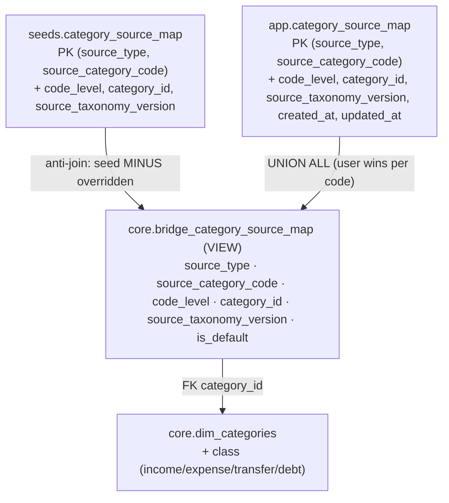

# Category Source Mapping — provider-code → canonical-category bridge

> Last updated: 2026-07-09
> Status: Implemented — M1V (Ingestion Core). Feature spec.
> Companions: [`categorization-overview.md`](categorization-overview.md) (umbrella; priority hierarchy — provider pass-through is priority 6), [`categorization-matching-mechanics.md`](categorization-matching-mechanics.md) (write-time precedence contract this feeds), [`architecture-shared-primitives.md`](architecture-shared-primitives.md) (layer rules, `source_type` vocabulary), `.claude/rules/identifiers.md` (source-provided IDs, FK Guard 3), `.claude/rules/database.md` (seed vs app layering, migration realism, column comments). Prerequisite for the Plaid provider-native categorizer, which shipped as [`categorization-source-model.md`](categorization-source-model.md) (M1U) — no longer parked.

## Purpose

Give MoneyBin a durable, aggregator-agnostic data model for mapping **any** provider's transaction-category code to **one** canonical MoneyBin category, keyed so the reverse lookup — *given a provider code, which MoneyBin category?* — is deterministic by data, not by a runtime heuristic. This is the mapping layer ("axis 1"). It deliberately does **not** expand the taxonomy content itself ("axis 2" — comprehensive / accounting-aligned category curation), which becomes purely additive once the bridge exists.

## Problem

The seed taxonomy carries a single `plaid_detailed` tag per category
(`sqlmesh/models/seeds/categories.csv` → exposed as
`core.dim_categories.plaid_detailed`). It was built as a *descriptive tag*
("which Plaid bucket is this category?"), not a reverse-lookup key. Three
defects follow:

1. **Non-deterministic reverse lookup.** 108 categories tag 83 distinct
   codes; 16 codes are tagged by 2–4 categories each. A naive
   `JOIN … ON dc.plaid_detailed = s.category_detailed` returns multiple rows
   per transaction — non-deterministic category choice and inflated counts.
2. **Single-aggregator by construction.** `plaid_detailed` is a
   provider-specific column. A second provider (MX, SimpleFIN) has nowhere to
   land without a schema change.
3. **Codes drifted from the real Plaid taxonomy.** Reconciling the 83 tags
   against Plaid's published Personal-Finance-Category (PFC) taxonomy (16
   primary / 104 detailed codes) found:
   - **62** valid detailed codes.
   - **16** rows tag a Plaid **primary** code in the detailed column — every
     MoneyBin top-level category (`INC`→`INCOME`, `LNP`→`LOAN_PAYMENTS`, …).
     This is an *implicit two-tier mapping* the flat column could not express,
     not an error — and it motivates the two-tier design below.
   - **5** invalid tags that do not exist in the Plaid taxonomy:
     `INCOME_OTHER` (should be `INCOME_OTHER_INCOME`),
     `MEDICAL_DENTISTS_AND_OPTOMETRISTS` (no such code — Plaid has separate
     `MEDICAL_DENTAL_CARE`, `MEDICAL_EYE_CARE`, `MEDICAL_PRIMARY_CARE`),
     `RENT_AND_UTILITIES_ELECTRICITY` and `RENT_AND_UTILITIES_GAS` (Plaid
     combines these as `RENT_AND_UTILITIES_GAS_AND_ELECTRICITY`), and `OTHER`
     (no Plaid equivalent at any level).
   - **42** real Plaid detailed codes are unused (coverage gap).

This spec replaces `plaid_detailed` with a bridge and reconciles the tags
against the verified taxonomy as part of the migration.

## Design

### Layering

Mirrors the existing `seeds.categories` + `app.category_overrides` →
`core.dim_categories` pattern: versioned reference rows in `seeds`, user
extensions/overrides in `app`, one resolved view in `core`.



**Precedence uses an anti-join, not `UNION`.** A user row and a seed row for
the same `(source_type, source_category_code)` may point at *different*
`category_id`s; `UNION` would keep both and re-break the one-row-per-code
guarantee. The view is therefore: seed rows whose `(source_type,
source_category_code)` is **not** present in `app`, `UNION ALL` all `app`
rows. This preserves exactly-one-row-per-code across the union.

### Grain: canonical-by-primary-key

The bridge is keyed **`(source_type, source_category_code)`**. Exactly one
canonical MoneyBin category per code is guaranteed by the primary key itself
— there is no `is_canonical` flag that could go two-TRUE or zero-TRUE. The
ambiguous-mapping winner is a visible, editable data row that cannot be made
ambiguous (satisfies the "magic stays visible" requirement in
`.claude/rules/design-principles.md`).

### Two-tier: detailed with primary fallback

Plaid sends **both** a primary and a detailed code on every transaction, and
the coverage gap means many detailed codes are unmapped for now. The bridge
therefore stores rows at **both** levels, distinguished by a `code_level`
column (`'detailed'` | `'primary'`). The reverse lookup prefers a detailed
match and falls back to the primary:

```sql
-- given a transaction's (detailed, primary) provider codes, return its one
-- canonical category (or nothing). Detailed wins; primary is the fallback.
SELECT category_id
FROM   core.bridge_category_source_map
WHERE  source_type = ?                       -- 'plaid' | 'mx' | 'simplefin' | …
  AND  source_category_code IN (?, ?)        -- (detailed, primary)
ORDER  BY code_level = 'detailed' DESC        -- detailed match first
LIMIT  1;
```

A code string is unique across levels (no primary equals any detailed), so
the primary key holds with both levels in one table. An unmapped detailed
code still lands in the right top-level category via its primary instead of
falling through to rules/AI.

### Columns

| Column | Type | Notes |
|---|---|---|
| `source_type` | `VARCHAR` | Provenance vocabulary (`plaid`, future `mx`/`simplefin`). Closed-vocabulary discriminator (not an entity reference). |
| `source_category_code` | `VARCHAR` | The provider's code, stored verbatim (source-provided ID, `.claude/rules/identifiers.md` strategy 1). |
| `code_level` | `VARCHAR` | `'detailed'` \| `'primary'` — the tier this code sits at for the provider. |
| `category_id` | `VARCHAR` | **FK** to `core.dim_categories.category_id` (Guard 3 — never text-key the relationship). May reference a `user_categories` row (app table only). |
| `source_taxonomy_version` | `VARCHAR` | The provider taxonomy revision the row was curated against (e.g. `plaid_pfc_v2`). Non-PK — drift insurance; promote into the key only if historical multi-version rows ever coexist. |
| `is_default` | `BOOLEAN` | View-only: `TRUE` for seed rows, `FALSE` for user rows (mirrors `dim_categories.is_default`). |
| `created_at` / `updated_at` | `TIMESTAMP` | App table only — audit of user edits. |

### Accounting classification on the category dim

Add a **`class`** column to the category dimension (`seeds.categories` +
`app.user_categories` → `core.dim_categories`), values
`income` | `expense` | `transfer` | `debt`. Every category carries exactly
one class, assigned at curation time (seed) or by the user (user category,
default `expense`). This replaces sign-convention-only classification and
unlocks income-statement separation, transfer-exclusion from spend
reporting, and a future tax (IRS Schedule C) crosswalk. It lives on the
category, not the bridge — reached through `category_id`.

### Multi-aggregator and free-text boundary

A second provider is additional rows with a different `source_type` and its
own `source_taxonomy_version` — **zero schema change**. The bridge serves
**controlled-vocabulary** providers (Plaid, MX, Yodlee). Free-text sources
(e.g. SimpleFIN, whose `category` is an arbitrary string) have no enumerable
code set; they correctly produce no bridge row and fall through to
rules/AI/LLM, which is the right solver for free text. Absence of a row is
fall-through, not data loss.

## Reverse-lookup contract

The `core.bridge_category_source_map` view **is** the contract the
provider-native categorizer consumes. Given a transaction's `(source_type,
detailed, primary)`, it returns exactly one `category_id` (detailed
preferred, else primary) or nothing. No Python resolver ships in this PR —
M1U's `apply_plaid_categories`
(`src/moneybin/services/categorization/orchestrator.py`) is that resolver;
see [`categorization-source-model.md`](categorization-source-model.md).

## Verified-taxonomy reconciliation (curation)

The migration seeds `seeds.category_source_map` by re-deriving each mapping
against Plaid's published PFC taxonomy, not by copying `plaid_detailed`
verbatim. Rules:

- **Every seeded code must exist in the published taxonomy** for its
  `source_taxonomy_version`. Implementation re-fetches the taxonomy CSV and
  fails the seed build on any unknown code.
- **Fix the 5 invalid tags:** `INCOME_OTHER` → `INCOME_OTHER_INCOME`; split
  `MEDICAL_DENTISTS_AND_OPTOMETRISTS` into the real `MEDICAL_DENTAL_CARE`
  (Dental), `MEDICAL_EYE_CARE` (Vision), `MEDICAL_PRIMARY_CARE` (Doctor) —
  this **dissolves** that 3-way fan-out; map both `HSG-ELC`/`HSG-GAS` to the
  combined `RENT_AND_UTILITIES_GAS_AND_ELECTRICITY`; `OTHER`-tagged
  categories get **no** row (no Plaid basis).
- **Formalize the 16 primary-level mappings** as `code_level = 'primary'`
  rows for the MoneyBin top-level categories.
- **Canonical selection for genuine fan-out** (multiple MoneyBin categories
  legitimately match one code that has no finer Plaid code): choose the
  category whose semantics match the code's own granularity; MoneyBin-finer
  subcategories the provider cannot distinguish get **no** row. The choice is
  a curated data row, reviewable in the seed.
- **Coverage gap (29 codes):** the detailed codes still unmapped after the
  re-derivation (of 104 total) are recorded as an axis-2 follow-up; unmapped
  codes fall through. A coverage query (source codes with no row) is **deferred
  to Tier-2b** — see "Deferred to Tier-2b" below. Resolved: the axis-2 pass
  ([`category-taxonomy-audit.md`](category-taxonomy-audit.md), M1W) triaged
  all 29 — added 6 as genuinely-distinct finer categories, rolled 23 up to
  their primary under a documented orphan/roll-up allowlist — and shipped the
  coverage query as an enumerated test
  (`tests/moneybin/test_seeds/test_category_source_map_seed.py::test_coverage_report_matches_intentional_rollups`).

The row-by-row curation table is produced in the implementation plan.

## `dim_categories` transition

**Hard-cut `plaid_detailed`** (pre-launch — the cheapest moment for a
one-way-door core-schema change). Remove it from every definition and
consumer in the same PR: `sqlmesh/models/core/dim_categories.sql`,
`sqlmesh/models/seeds/categories.sql`, `src/moneybin/seeds.py`
(`refresh_views` + `_ensure_seed_tables_exist` — the Python bootstrap twin),
`src/moneybin/services/categorization/queries.py`,
`src/moneybin/privacy/taxonomy.py`, `src/moneybin/privacy/payloads/categories.py`,
`tests/moneybin/db_helpers.py`, and the `plaid_detailed` reference in
`src/moneybin/tables.py`. Add `TableRef` constants for the three new tables.
CHANGELOG under `Changed`/`Removed`.

## Migration

A single forward migration, `V032__add_category_source_map_and_class.py`:

- Create `app.category_source_map` (schema DDL + `app_category_source_map.sql`).
- `ALTER TABLE app.user_categories ADD COLUMN class VARCHAR` (default
  `'expense'`; backfill existing rows).
- Drop `plaid_detailed` from the resolved views (rebuilt by `refresh_views`).

Seed data (`seeds.category_source_map`, `seeds.categories.class`) is SQLMesh
seed content, not migration DDL. Tested against **populated** fixtures (≥3
rows, idempotent, wrapped in the runner's `BEGIN`/`COMMIT`) per
`.claude/rules/database.md` migration realism. Step detail logs at `debug`.

## Observability

Per the app-code-touches-metrics rule, the `app.category_source_map` write
path (rows added / updated / removed) gets counters in
`src/moneybin/metrics/registry.py`, mirroring existing `app.*` writers — this
lands with the override writer itself (see "Deferred to Tier-2b" below; no
writer exists yet, so there is nothing to instrument). The coverage query
(source codes with no bridge row) shipped as observability with its first
consumer as planned — [`category-taxonomy-audit.md`](category-taxonomy-audit.md)
(M1W), not the categorizer.

## Scope

**In scope (this PR / M1V):** the three tables + view + two-tier contract;
the `class` column on the category dim (available on `core.dim_categories`
and the dict-based `get_active_categories()`); verified-taxonomy
re-derivation of the seed (fix the 5 invalid tags, formalize the 16 primary
rows); hard-cut `plaid_detailed`; migration (`V032`); `TableRef` constants;
spec + `INDEX.md` + `docs/roadmap.md` + CHANGELOG updates.

**Out of scope (deferred):**

- The Tier-2b categorizer itself — shipped as
  [`categorization-source-model.md`](categorization-source-model.md) (M1U),
  whose `apply_plaid_categories` is built on this view.
- **Axis-2 taxonomy content**: comprehensive / accounting-aligned expansion,
  the 29-code coverage-gap backfill, an `irs_schedule_c_line` crosswalk,
  de-duplicating redundant categories (e.g. `HSG-MTG` vs `LNP-MTG` Mortgage),
  and auditing whether the finer MoneyBin subcategories should exist. Each is
  purely additive on top of this bridge; gets its own increment and design.
  Shipped as [`category-taxonomy-audit.md`](category-taxonomy-audit.md)
  (M1W) — the coverage-gap backfill, mortgage-duplicate resolution, and
  `class` reconciliation are done; the IRS Schedule C crosswalk remains
  deferred to the `us_tax` package (M2M).
- Map-to-null suppression of a seed mapping; `parent_id` N-level nesting;
  promoting `source_taxonomy_version` into the primary key.
- See "Deferred to Tier-2b" immediately below for the three items pushed to
  the next increment by explicit decision.

### Deferred to Tier-2b

Three items were deliberately pushed past this PR — each lands with the
consumer that needs it, rather than speculatively here:

1. **Coverage query** (source codes with no bridge row). Landed with
   [`category-taxonomy-audit.md`](category-taxonomy-audit.md) (M1W), not the
   Tier-2b categorizer as originally planned — M1W's enumerated
   coverage-report test was the first real consumer.
2. **Typed-payload `class` exposure.** `class` is already available on
   `core.dim_categories` and on the dict-based `get_active_categories()`
   (`"class"` key, `src/moneybin/services/categorization/queries.py`). The
   typed `CategoryRow` field (`src/moneybin/privacy/payloads/categories.py`)
   is still not added — M1U's categorizer shipped without needing it on the
   typed path, so this remains open for whichever future consumer needs it.
3. **Write-path metrics** for `app.category_source_map`. No writer exists yet
   — an override writer still hasn't shipped; instrumenting an unwritten path
   would be speculative.

## Coordination

Landed **before** the parked `feat/plaid-pfc-categorizer` branch, as planned.
That work merged `main`, picked up `core.bridge_category_source_map`, and
rebuilt its categorizer on the reverse-lookup contract instead of joining
`plaid_detailed` — it shipped as
[`categorization-source-model.md`](categorization-source-model.md) (M1U).

## Open questions

- ~~Confirm the exact next migration number against `main` at
  implementation.~~ Resolved: `V032`.
- ~~The two-tier `ORDER BY code_level` lookup assumes the caller passes both
  detailed and primary; confirm the Plaid extractor surfaces both on
  `prep`/`raw` transactions before the categorizer consumes the view.~~
  Resolved: M1U's `apply_plaid_categories` reads both
  `category_detailed` and `plaid_category` off
  `prep.int_transactions__merged` and QUALIFYs to one row per transaction,
  detailed preferred.
