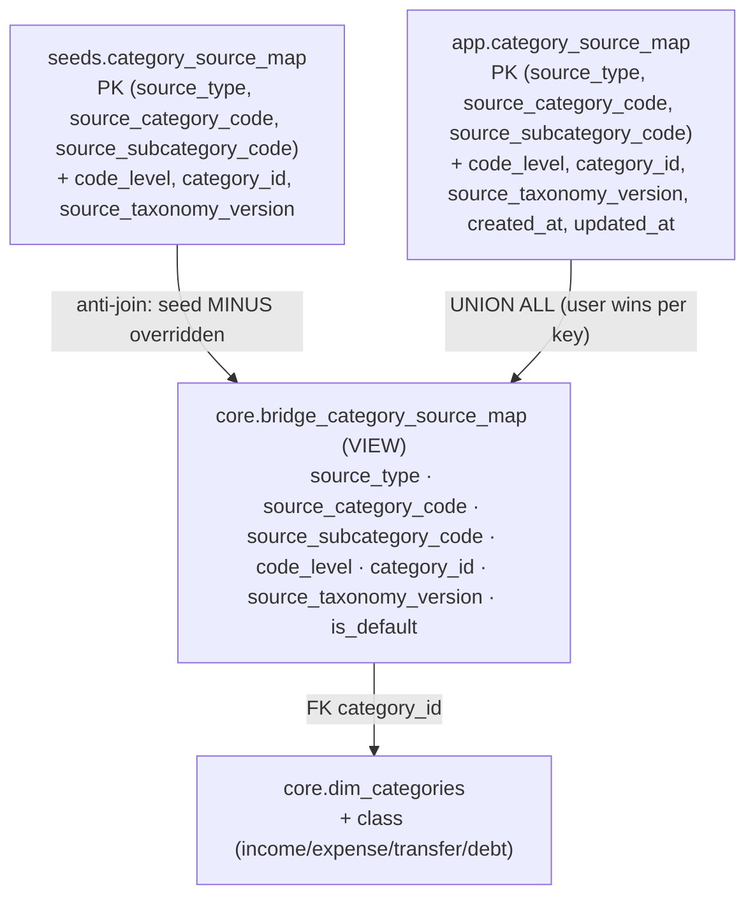

# Category Source Mapping — provider-code → canonical-category bridge

> Last updated: 2026-09-23
> Status: Implemented — M1V (Ingestion Core). Feature spec. See "Extension: imported (tabular/manual) category text (MB-180)" below for a post-launch addition, including the PR2 CLI curation surface and the ignore (map-to-null) extension ("Ignore: a translation to nothing").
> Companions: [`categorization-overview.md`](categorization-overview.md) (umbrella; priority hierarchy — provider pass-through is priority 6), [`categorization-matching-mechanics.md`](categorization-matching-mechanics.md) (write-time precedence contract this feeds), [`architecture-shared-primitives.md`](architecture-shared-primitives.md) (layer rules, `source_type` vocabulary), `.claude/rules/identifiers.md` (source-provided IDs, FK Guard 3), `.claude/rules/database.md` (seed vs app layering, migration realism, column comments). Prerequisite for the Plaid provider-native categorizer, which shipped as [`categorization-source-model.md`](categorization-source-model.md) (M1U) — no longer parked.

## Purpose

Give MoneyBin a durable, aggregator-agnostic data model for mapping **any** provider's transaction-category code to **one** canonical MoneyBin category, keyed so the reverse lookup — *given a provider code, which MoneyBin category?* — is deterministic by data, not by a runtime heuristic. This is the mapping layer ("axis 1"). It deliberately does **not** expand the taxonomy content itself ("axis 2" — comprehensive / accounting-aligned category curation), which becomes purely additive once the bridge exists.

## Problem

The seed taxonomy carries a single `plaid_detailed` tag per category
(`src/moneybin/sqlmesh/models/seeds/categories.csv` → exposed as
`core.dim_categories.plaid_detailed`). It was built as a *descriptive tag*
("which Plaid bucket is this category?"), not a reverse-lookup key. Three
defects follow:

1. **Non-deterministic reverse lookup.** 108 categories tag 83 distinct
   codes; 16 codes are tagged by 2–4 categories each. A naive
   `JOIN … ON dc.plaid_detailed = s.category_detailed` returns multiple rows
   per transaction — non-deterministic category choice and inflated counts.
2. **Single-aggregator by construction.** `plaid_detailed` is a
   provider-specific column. A second provider (MX, SimpleFIN) has nowhere to
   land without a schema change.
3. **Codes drifted from the real Plaid taxonomy.** Reconciling the 83 tags
   against Plaid's published Personal-Finance-Category (PFC) taxonomy (16
   primary / 104 detailed codes) found:
   - **62** valid detailed codes.
   - **16** rows tag a Plaid **primary** code in the detailed column — every
     MoneyBin top-level category (`INC`→`INCOME`, `LNP`→`LOAN_PAYMENTS`, …).
     This is an *implicit two-tier mapping* the flat column could not express,
     not an error — and it motivates the two-tier design below.
   - **5** invalid tags that do not exist in the Plaid taxonomy:
     `INCOME_OTHER` (should be `INCOME_OTHER_INCOME`),
     `MEDICAL_DENTISTS_AND_OPTOMETRISTS` (no such code — Plaid has separate
     `MEDICAL_DENTAL_CARE`, `MEDICAL_EYE_CARE`, `MEDICAL_PRIMARY_CARE`),
     `RENT_AND_UTILITIES_ELECTRICITY` and `RENT_AND_UTILITIES_GAS` (Plaid
     combines these as `RENT_AND_UTILITIES_GAS_AND_ELECTRICITY`), and `OTHER`
     (no Plaid equivalent at any level).
   - **42** real Plaid detailed codes are unused (coverage gap).

This spec replaces `plaid_detailed` with a bridge and reconciles the tags
against the verified taxonomy as part of the migration.

## Design

### Layering

Mirrors the existing `seeds.categories` + `app.category_overrides` →
`core.dim_categories` pattern: versioned reference rows in `seeds`, user
extensions/overrides in `app`, one resolved view in `core`.


```mermaid
flowchart TD
    seed["seeds.category_source_map<br/>PK (source_type, source_category_code, source_subcategory_code)<br/>+ code_level, category_id, source_taxonomy_version"]
    app["app.category_source_map<br/>PK (source_type, source_category_code, source_subcategory_code)<br/>+ code_level, category_id, source_taxonomy_version, created_at, updated_at"]
    view["core.bridge_category_source_map (VIEW)<br/>source_type · source_category_code · source_subcategory_code · code_level · category_id · source_taxonomy_version · is_default"]
    dim["core.dim_categories<br/>+ class (income/expense/transfer/debt)"]
    seed -- "anti-join: seed MINUS overridden" --> view
    app -- "UNION ALL (user wins per key)" --> view
    view -- "FK category_id" --> dim
```

**Precedence uses an anti-join, not `UNION`.** A user row and a seed row for
the same `(source_type, source_category_code, source_subcategory_code)` may
point at *different* `category_id`s; `UNION` would keep both and re-break the
one-row-per-key guarantee. The view is therefore: seed rows whose
`(source_type, source_category_code, source_subcategory_code)` is **not**
present in `app`, `UNION ALL` all `app` rows. This preserves
exactly-one-row-per-key across the union.

### Grain: canonical-by-primary-key

The bridge is keyed **`(source_type, source_category_code,
source_subcategory_code)`**. Exactly one canonical MoneyBin category per key
is guaranteed by the primary key itself — there is no `is_canonical` flag
that could go two-TRUE or zero-TRUE. The ambiguous-mapping winner is a
visible, editable data row that cannot be made ambiguous (satisfies the
"magic stays visible" requirement in `.claude/rules/design-principles.md`).
`source_subcategory_code` uses `''` as its sentinel for "the source supplied
no subcategory" — DuckDB primary keys reject NULL, so an absent subcategory
cannot be represented as one.

### Two-tier: detailed with primary fallback

Plaid sends **both** a primary and a detailed code on every transaction, and
the coverage gap means many detailed codes are unmapped for now. The bridge
therefore stores rows at **both** levels, distinguished by a `code_level`
column (`'detailed'` | `'primary'`). The reverse lookup prefers a detailed
match and falls back to the primary:

```sql
-- given a transaction's (detailed, primary) provider codes, return its one
-- canonical category (or nothing). Detailed wins; primary is the fallback.
SELECT category_id
FROM   core.bridge_category_source_map
WHERE  source_type = ?                       -- 'plaid' | 'mx' | 'simplefin' | …
  AND  source_category_code IN (?, ?)        -- (detailed, primary)
ORDER  BY code_level = 'detailed' DESC        -- detailed match first
LIMIT  1;
```

A code string is unique across levels (no primary equals any detailed), so
the primary key holds with both levels in one table. An unmapped detailed
code still lands in the right top-level category via its primary instead of
falling through to rules/AI.

### Columns

| Column | Type | Notes |
|---|---|---|
| `source_type` | `VARCHAR` | Taxonomy namespace: whose vocabulary the code belongs to. Two suppliers today — a provider tag (`plaid`, future `mx`/`simplefin`) for provider-native codes, and a `source_origin` slug (`chase_credit`, `mint`) for imported mappings (see "Extension" below). Closed-vocabulary discriminator (not an entity reference); deliberately not tied to the import vector — the same institution arriving as a PDF statement and as a CSV can resolve to one namespace value, so a future normalization layer can map several vectors onto one namespace without changing this column's meaning. |
| `source_category_code` | `VARCHAR` | The provider's code, stored verbatim (source-provided ID, `.claude/rules/identifiers.md` strategy 1). |
| `source_subcategory_code` | `VARCHAR` | Second half of the source's (category, subcategory) key. `''` is the sentinel for "no subcategory" — DuckDB primary keys reject NULL, so an absent subcategory cannot be stored as one; never a distinct real value. |
| `code_level` | `VARCHAR` | `'detailed'` \| `'primary'` — the tier this code sits at for the provider. |
| `category_id` | `VARCHAR` | **FK** to `core.dim_categories.category_id` (Guard 3 — never text-key the relationship). May reference a `user_categories` row (app table only). |
| `source_taxonomy_version` | `VARCHAR` | The provider taxonomy revision the row was curated against (e.g. `plaid_pfc_v2`). Non-PK — drift insurance; promote into the key only if historical multi-version rows ever coexist. |
| `is_default` | `BOOLEAN` | View-only: `TRUE` for seed rows, `FALSE` for user rows (mirrors `dim_categories.is_default`). |
| `created_at` / `updated_at` | `TIMESTAMP` | App table only — audit of user edits. |

### Accounting classification on the category dim

Add a **`class`** column to the category dimension (`seeds.categories` +
`app.user_categories` → `core.dim_categories`), values
`income` | `expense` | `transfer` | `debt`. Every category carries exactly
one class, assigned at curation time (seed) or by the user (user category,
default `expense`). This replaces sign-convention-only classification and
unlocks income-statement separation, transfer-exclusion from spend
reporting, and a future tax (IRS Schedule C) crosswalk. It lives on the
category, not the bridge — reached through `category_id`.

### Multi-aggregator and free-text boundary

A second provider is additional rows with a different `source_type` and its
own `source_taxonomy_version` — **zero schema change**. The bridge serves
**controlled-vocabulary** providers (Plaid, MX, Yodlee). Free-text sources
(e.g. SimpleFIN, whose `category` is an arbitrary string) have no enumerable
code set; they correctly produce no bridge row and fall through to
rules/AI/LLM, which is the right solver for free text. Absence of a row is
fall-through, not data loss.

## Extension: imported (tabular/manual) category text (MB-180)

An imported row (tabular/CSV, manual entry) was passed straight through to
`core.fct_transactions.category` via `fct_transactions.sql`'s
`COALESCE(dc.category, c.category, t.category)` — no `categorized_by`
attribution, invisible to `core.uncategorized_queue`, and never overridable
by a later rule. The owner's ruling: this text is only ever an INPUT to the
existing bridge above, never a passed-through value. The engine leg
(`CategorizationOrchestrator.apply_source_category_map`, PR1 of MB-180)
reuses `app.category_source_map` / `core.bridge_category_source_map`
unchanged; only the reverse-lookup key and code shape are new:

- **Keyed on `source_origin`, not the generic `source_type` ('tabular').**
  The primary key is `(source_type, source_category_code,
  source_subcategory_code)`; storing a concrete `source_origin` value
  (`chase_credit`, `mint`, `tiller`) in the `source_type` column — instead of
  Plaid's provider tag — lets two exporters map an identical category string
  to two different MoneyBin categories. This reframes rather than
  contradicts "Multi-aggregator and free-text boundary" above: a single
  exporter's own category list IS a closed vocabulary from that exporter's
  perspective, even though the generic `tabular`/`manual` discriminator is
  not — SimpleFIN's genuinely arbitrary free text is a different case and
  still falls through as documented.
- **Real second key column, not a composite code.** An imported row carries
  `category` and `subcategory` independently. An earlier version of this
  extension packed both into `source_category_code` via
  `to_json({'category': ..., 'subcategory': ...})` — but comparing that
  VARCHAR column against a JSON-typed literal made DuckDB cast the column to
  JSON, and seeded Plaid rows hold bare codes (`INCOME`) that are not valid
  JSON, so the cast raised `ConversionException` on every categorization run
  that touched the bridge with seeded data present. `source_subcategory_code`
  is a real second key column instead: `category` maps to
  `source_category_code` verbatim, `subcategory` maps to
  `source_subcategory_code` (normalized to `''` when absent, because a
  DuckDB primary key rejects NULL; collapsing `''` and NULL to one value
  matches how V054–V056 already treat blank taxonomy text). The write side
  (`CategorySourceMapRepo.upsert`) and the read side
  (`_source_category_bridge_candidates`, via
  `_shared.source_category_bridge_match_predicate`) both key on the two
  columns directly, so there is no serializer to keep in sync.
- **No confidence gate.** Unlike Plaid's ML-classifier confidence, a curated
  mapping row is a deterministic assertion — the same footing as a rule or
  merchant — so every match writes `confidence=1.0`.
- **Row grain, not merge grain.** Reads `prep.int_transactions__matched`
  (row-grain, pre-merge — carries the gold `transaction_id` alongside each
  source row's own `source_origin`/`category`/`subcategory`), not
  `prep.int_transactions__merged` (which resolves one winning value per
  transaction but drops which member contributed it).
- **Schema widening: `V067__add_source_subcategory_code.py`.** Adds
  `source_subcategory_code` and rebuilds the table's primary key (DuckDB
  cannot `ALTER` a primary key), replacing the JSON-encoded composite code
  described above.

PR1 shipped the engine only (repo write method + orchestrator leg, wired into
`categorize_pending`). PR2 adds the authoring surface:
`CategorizationQueries.list_unmapped_source_terms` enumerates distinct
unmapped `(source_origin, category, subcategory)` terms — the decision unit
is the term, not the transaction, since one curated mapping resolves every
row carrying that text — with up to 3 `did_you_mean` suggestions against
active MoneyBin category names; `MatchApplier.resolve_source_term` maps one
term to an existing category or a newly-created one (via `create_category`),
sharing one transaction with the `CategorySourceMapRepo.upsert` write. Both
are exposed as `moneybin categories mappings pending` / `... set`.

PR2 is CLI-only. The MCP surface, decided after PR2 opened, extends two
existing tools instead of adding one: an unmapped term is a
`source_categories` kind in `reviews`, and a mapping is a `source_category`
item in `taxonomy_set`, beside its `category` and `merchant` items. A mapping
is a translation of a source's label, not a pattern rule. It reads the
category the source attached rather than the transaction's own text, and it
writes at `provider_native` rank, so every rule and merchant mapping outranks
it. That is why it sits with merchant items in `taxonomy_set` and not in
`transactions_categorize_rules_set`. It ships in a follow-up slice.

### Ignore: a translation to nothing

`category_id` on `app.category_source_map` is nullable. A user row with
`category_id IS NULL` means "this label carries no useful category signal —
categorize nothing through it, and stop asking." `CategorySourceMapRepo.upsert`
accepts `category_id=None` for this; `MatchApplier.resolve_source_term` and
`moneybin categories mappings set --ignore` are the write surfaces (exactly one
of `--into`, `--new`, `--ignore`). Consequences fall out of existing mechanics
rather than new special-casing:

- **Leaves the pending inbox.** `list_unmapped_source_terms`'s `NOT EXISTS`
  keys on the three-column term, not on `category_id` — an ignored term has a
  bridge row, so it no longer enumerates as unmapped.
- **Categorizes nothing.** Both categorizer legs (`apply_plaid_categories` via
  `_plaid_bridge_candidates`, `apply_source_category_map` via
  `_source_category_bridge_candidates`) join the bridge's `category_id` onto
  `core.dim_categories`; a NULL never joins, so an ignored row's transactions
  fall through to rules/merchants/AI/manual exactly like an unmapped term.
- **Suppresses a seed mapping.** A user row overrides a seed row at the same
  `(source_type, source_category_code, source_subcategory_code)` key
  regardless of what either side's `category_id` holds — an ignored user row
  therefore switches off one of Plaid's shipped translations. This closes the
  "Map-to-null suppression of a seed mapping" item previously deferred below.
- **No fallback past an ignored detailed code.** The two-tier reverse lookup
  prefers `code_level='detailed'`, falling back to `primary` only when no
  detailed row exists at all. An *ignored* detailed row is a decision, not an
  absence: `_plaid_bridge_candidates` ranks detailed-over-primary with a
  `LEFT JOIN` onto `dim_categories` (so an ignored row still wins the
  detailed-vs-primary ranking on its own merits) and only checks
  `category_id IS NOT NULL` on the already-selected winner — never before
  ranking. Filtering the ignored row out before ranking (an inner join, or a
  `WHERE` clause — both evaluate ahead of `QUALIFY`) would let the primary row
  win by elimination, which is the silent fallback this design forbids.
  Imported-label matching (`source_category_bridge_match_predicate`) is exact
  with no tiering, so ignore is unambiguous there — nothing to invert.
- **Re-mappable.** `resolve_source_term --into <id>` upserts over an ignored
  row exactly like any other update.
- **Category deletion never produces an ignored row as a side effect.**
  `MatchApplier._apply_category_delete_plan`'s force path calls
  `CategorySourceMapRepo.delete_by_category`, which deletes the referencing
  mapping rows outright; it never nulls `category_id` to leave them behind.
  An ignored row (already `category_id IS NULL`) can never match that
  cascade's `WHERE category_id = ?` predicate, so it is untouched by any
  category's deletion.
- **Audited distinctly.** `CategorySourceMapRepo.upsert` emits
  `category_source_map.ignore` (vs. `.upsert`) so an ignore is distinguishable
  from a real mapping in `app.audit_log` and in the
  `moneybin_app_mutation_audit_emitted_total` metric's `action` label.

## Reverse-lookup contract

The `core.bridge_category_source_map` view **is** the contract the
provider-native categorizer consumes. Given a transaction's `(source_type,
detailed, primary)`, it returns exactly one `category_id` (detailed
preferred, else primary) or nothing — nothing also covers the case where the
detailed code resolves to an ignored row (see "Ignore" above); the lookup
does not fall back to primary in that case. No Python resolver ships in this
PR — M1U's `apply_plaid_categories`
(`src/moneybin/services/categorization/orchestrator.py`) is that resolver;
see [`categorization-source-model.md`](categorization-source-model.md).

## Verified-taxonomy reconciliation (curation)

The migration seeds `seeds.category_source_map` by re-deriving each mapping
against Plaid's published PFC taxonomy, not by copying `plaid_detailed`
verbatim. Rules:

- **Every seeded code must exist in the published taxonomy** for its
  `source_taxonomy_version`. Implementation re-fetches the taxonomy CSV and
  fails the seed build on any unknown code.
- **Fix the 5 invalid tags:** `INCOME_OTHER` → `INCOME_OTHER_INCOME`; split
  `MEDICAL_DENTISTS_AND_OPTOMETRISTS` into the real `MEDICAL_DENTAL_CARE`
  (Dental), `MEDICAL_EYE_CARE` (Vision), `MEDICAL_PRIMARY_CARE` (Doctor) —
  this **dissolves** that 3-way fan-out; map both `HSG-ELC`/`HSG-GAS` to the
  combined `RENT_AND_UTILITIES_GAS_AND_ELECTRICITY`; `OTHER`-tagged
  categories get **no** row (no Plaid basis).
- **Formalize the 16 primary-level mappings** as `code_level = 'primary'`
  rows for the MoneyBin top-level categories.
- **Canonical selection for genuine fan-out** (multiple MoneyBin categories
  legitimately match one code that has no finer Plaid code): choose the
  category whose semantics match the code's own granularity; MoneyBin-finer
  subcategories the provider cannot distinguish get **no** row. The choice is
  a curated data row, reviewable in the seed.
- **Coverage gap (29 codes):** the detailed codes still unmapped after the
  re-derivation (of 104 total) are recorded as an axis-2 follow-up; unmapped
  codes fall through. A coverage query (source codes with no row) is **deferred
  to Tier-2b** — see "Deferred to Tier-2b" below. Resolved: the axis-2 pass
  ([`category-taxonomy-audit.md`](category-taxonomy-audit.md), M1W) triaged
  all 29 — added 6 as genuinely-distinct finer categories, rolled 23 up to
  their primary under a documented orphan/roll-up allowlist — and shipped the
  coverage query as an enumerated test
  (`tests/moneybin/test_seeds/test_category_source_map_seed.py::test_coverage_report_matches_intentional_rollups`).

The row-by-row curation table is produced in the implementation plan.

## `dim_categories` transition

**Hard-cut `plaid_detailed`** (pre-launch — the cheapest moment for a
one-way-door core-schema change). Remove it from every definition and
consumer in the same PR: `src/moneybin/sqlmesh/models/core/dim_categories.sql`,
`src/moneybin/sqlmesh/models/seeds/categories.sql`, `src/moneybin/seeds.py`
(`refresh_views` + `_ensure_seed_tables_exist` — the Python bootstrap twin),
`src/moneybin/services/categorization/queries.py`,
`src/moneybin/privacy/taxonomy.py`, `src/moneybin/privacy/payloads/categories.py`,
`tests/moneybin/db_helpers.py`, and the `plaid_detailed` reference in
`src/moneybin/tables.py`. Add `TableRef` constants for the three new tables.
CHANGELOG under `Changed`/`Removed`.

## Migration

A single forward migration, `V032__add_category_source_map_and_class.py`:

- Create `app.category_source_map` (schema DDL + `app_category_source_map.sql`).
- `ALTER TABLE app.user_categories ADD COLUMN class VARCHAR` (default
  `'expense'`; backfill existing rows).
- Drop `plaid_detailed` from the resolved views (rebuilt by `refresh_views`).

Seed data (`seeds.category_source_map`, `seeds.categories.class`) is SQLMesh
seed content, not migration DDL. Tested against **populated** fixtures (≥3
rows, idempotent, wrapped in the runner's `BEGIN`/`COMMIT`) per
`.claude/rules/database.md` migration realism. Step detail logs at `debug`.

## Observability

Per the app-code-touches-metrics rule, the `app.category_source_map` write
path is instrumented — resolved differently than originally planned. PR2's
`CategorySourceMapRepo.upsert` (the override writer "Deferred to Tier-2b"
below anticipated) routes through `BaseRepo._emit_audit`, which every
repository already uses, so it increments the existing
`moneybin_app_mutation_audit_emitted_total` counter
(`src/moneybin/metrics/registry.py`) labeled `repository="category_source_map"`
— no dedicated counter was needed. The ignore extension makes an ignored
write distinguishable on the same metric: `upsert` emits action
`category_source_map.ignore` when `category_id=None`, `category_source_map.upsert`
otherwise, so a mapping and an ignore are separable in `app.audit_log` and in
that counter's `action` label without a schema change. The coverage query
(source codes with no bridge row) shipped as observability with its first
consumer as planned — [`category-taxonomy-audit.md`](category-taxonomy-audit.md)
(M1W), not the categorizer.

## Scope

### MCP taxonomy boundary

Agents read the canonical category and merchant catalog through
`taxonomy(view="categories")` or `taxonomy(view="merchants")`. They declare
category or merchant target state through `taxonomy_set(items=[...])`; each
item is discriminated by `kind` and `state`. The seeded provider-code rows
remain an internal categorization input, not a separate MCP mutation surface.
User-authored rows for imported vocabulary (MB-180) get no separate surface
either: the follow-up MCP slice declares them as a `source_category` item in
the same `taxonomy_set` batch.

**In scope (this PR / M1V):** the three tables + view + two-tier contract;
the `class` column on the category dim (available on `core.dim_categories`
and the dict-based `get_active_categories()`); verified-taxonomy
re-derivation of the seed (fix the 5 invalid tags, formalize the 16 primary
rows); hard-cut `plaid_detailed`; migration (`V032`); `TableRef` constants;
spec + `INDEX.md` + `docs/roadmap.md` + CHANGELOG updates.

**Out of scope (deferred):**

- The Tier-2b categorizer itself — shipped as
  [`categorization-source-model.md`](categorization-source-model.md) (M1U),
  whose `apply_plaid_categories` is built on this view.
- **Axis-2 taxonomy content**: comprehensive / accounting-aligned expansion,
  the 29-code coverage-gap backfill, an `irs_schedule_c_line` crosswalk,
  de-duplicating redundant categories (e.g. `HSG-MTG` vs `LNP-MTG` Mortgage),
  and auditing whether the finer MoneyBin subcategories should exist. Each is
  purely additive on top of this bridge; gets its own increment and design.
  Shipped as [`category-taxonomy-audit.md`](category-taxonomy-audit.md)
  (M1W) — the coverage-gap backfill, mortgage-duplicate resolution, and
  `class` reconciliation are done; the IRS Schedule C crosswalk remains
  deferred to the `us_tax` package (M2M).
- `parent_id` N-level nesting; promoting `source_taxonomy_version` into the
  primary key. (Map-to-null suppression of a seed mapping — previously listed
  here — shipped; see "Ignore: a translation to nothing" above.)
- See "Deferred to Tier-2b" immediately below for the three items pushed to
  the next increment by explicit decision.

### Deferred to Tier-2b

Three items were deliberately pushed past this PR — each lands with the
consumer that needs it, rather than speculatively here:

1. **Coverage query** (source codes with no bridge row). Landed with
   [`category-taxonomy-audit.md`](category-taxonomy-audit.md) (M1W), not the
   Tier-2b categorizer as originally planned — M1W's enumerated
   coverage-report test was the first real consumer.
2. **Typed-payload `class` exposure.** `class` is already available on
   `core.dim_categories` and on the dict-based `get_active_categories()`
   (`"class"` key, `src/moneybin/services/categorization/queries.py`). The
   typed `CategoryRow` field (`src/moneybin/privacy/payloads/categories.py`)
   is still not added — M1U's categorizer shipped without needing it on the
   typed path, so this remains open for whichever future consumer needs it.
3. **Write-path metrics** for `app.category_source_map`. Resolved — see
   "Observability" above: PR2's override writer routes through the generic
   `app_mutation_audit_emitted_total` counter every repository already
   increments, so no dedicated metric was needed.

## Coordination

Landed **before** the parked `feat/plaid-pfc-categorizer` branch, as planned.
That work merged `main`, picked up `core.bridge_category_source_map`, and
rebuilt its categorizer on the reverse-lookup contract instead of joining
`plaid_detailed` — it shipped as
[`categorization-source-model.md`](categorization-source-model.md) (M1U).

## Open questions

- ~~Confirm the exact next migration number against `main` at
  implementation.~~ Resolved: `V032`.
- ~~The two-tier `ORDER BY code_level` lookup assumes the caller passes both
  detailed and primary; confirm the Plaid extractor surfaces both on
  `prep`/`raw` transactions before the categorizer consumes the view.~~
  Resolved: M1U's `apply_plaid_categories` reads both
  `category_detailed` and `plaid_category` off
  `prep.int_transactions__merged` and QUALIFYs to one row per transaction,
  detailed preferred.
