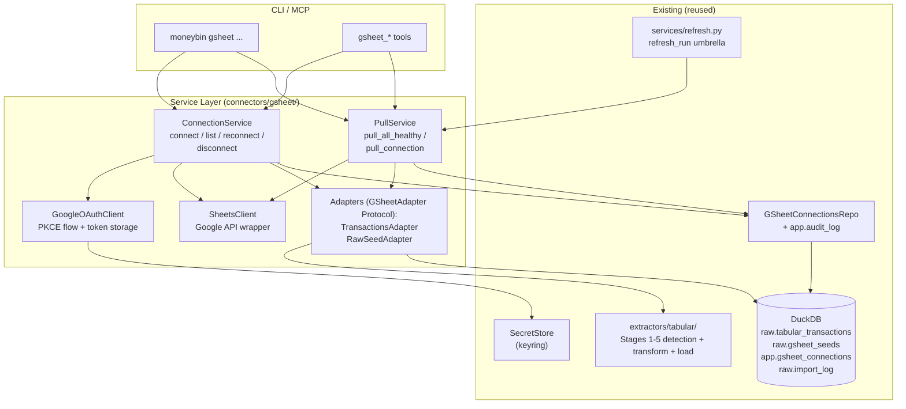
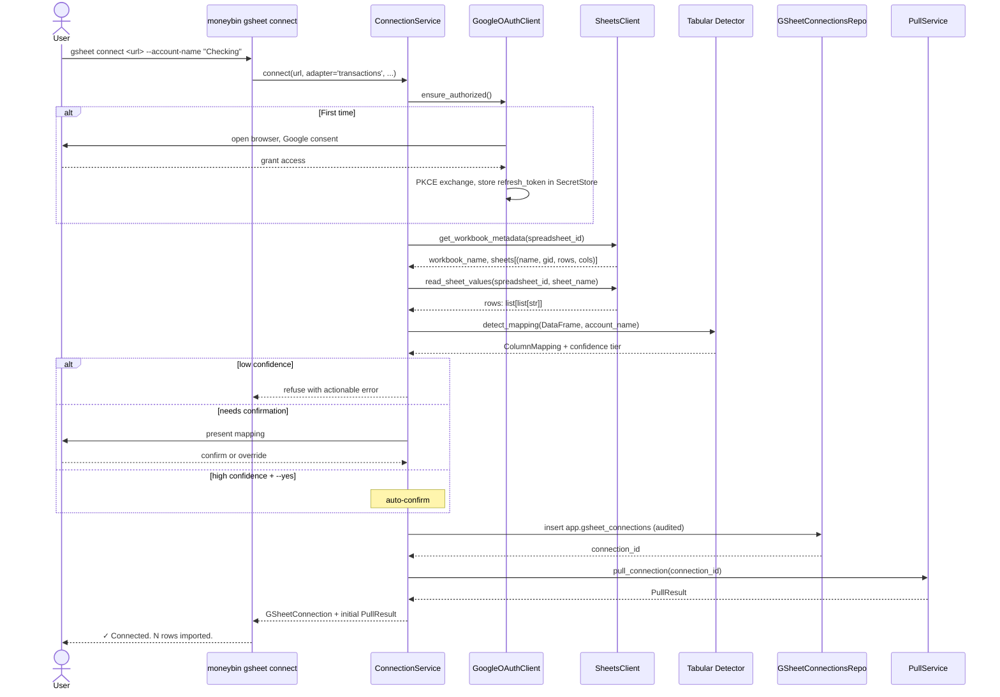
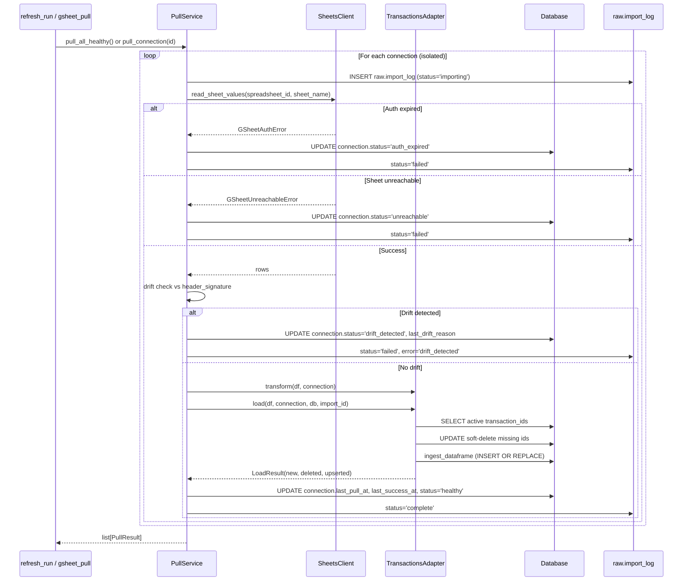
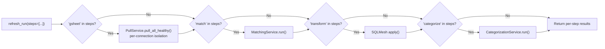
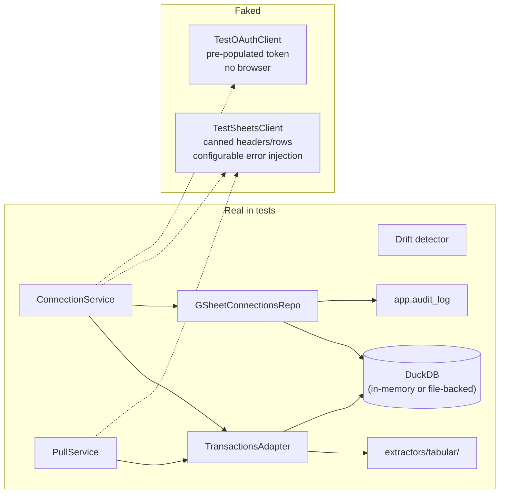

# Feature: Connect — Google Sheets (Live Tabular Sync)

> Companions: [`smart-import-tabular.md`](smart-import-tabular.md) (reused pipeline, Stages 1–5), [`smart-import-confirmation.md`](smart-import-confirmation.md) (confirm/confidence layer; confidence bands and `--column-mapping` partial-merge aligned here), [`smart-import-transform.md`](smart-import-transform.md) (refresh pipeline + transform handoff), [`sync-overview.md`](sync-overview.md) (provider-agnostic sync framework — gsheet is **not** part of it; see "Why not `sync`" below), [`matching-overview.md`](matching-overview.md) (cross-source dedup), [`categorization-overview.md`](categorization-overview.md), [`app-integrity-invariant.md`](app-integrity-invariant.md) (audit-paired mutations), [`privacy-data-protection.md`](privacy-data-protection.md) (encryption + SecretStore), [`mcp-architecture.md`](mcp-architecture.md), [`moneybin-cli.md`](moneybin-cli.md).

First entry in the `connect-*` family: live tabular sources connected via direct user OAuth, sitting alongside (not inside) the moneybin-server-mediated `sync` framework. Future siblings: `connect-airtable.md`, `connect-smartsheet.md`, `connect-notion.md`, etc.

## Status
<!-- draft | ready | in-progress | implemented -->
implemented

## Goal

Make a user's Google Sheets workbook a live data source for MoneyBin. Connect once (OAuth + automatic column detection), and every `refresh_run` re-pulls the latest sheet state through the connector's adapter machinery, with structural drift caught, soft-deletes preserving audit history, and downstream tables reflecting the current sheet content.

v1 ships **two adapters**:

- **`transactions`** — Tiller-style or hand-maintained ledger sheets. Routes through `raw.tabular_transactions` + the full matching, categorization, and reporting pipeline. The integrated case.
- **`seed`** (catch-all) — any sheet that doesn't match the transactions shape. Lands in `raw.gsheet_seeds` as queryable JSON with an auto-generated typed view per connection. Does not participate in matching / categorization (no schema contract), but IS available via `sql_query` MCP, `moneybin://schema` discoverability, and user-written SQL joins to `fct_transactions`. The escape-hatch case — "any sheet works to some level."

Connect time chooses the adapter: high-confidence transactions detection → `transactions`; low-confidence or explicit `--adapter=seed` → `seed`. Both adapters share the same connection lifecycle (auth, fetch, drift, soft-delete). Future adapters (Tiller categories/budgets/AutoCat, asset valuations, net-worth snapshots, subscriptions trackers) land as additional pluggable adapters — the seed adapter is the learn-from-usage path that surfaces which typed adapters to build next.

## Background

- [`smart-import-tabular.md`](smart-import-tabular.md) — the five-stage tabular pipeline this spec reuses unchanged for detection (Stages 1–3), transform (Stage 4), and load (Stage 5). New code lives upstream of Stage 1 and around Stage 5 (diff + soft-delete).
- [`smart-import-transform.md`](smart-import-transform.md) — the `refresh_run` umbrella (PR #173) that this spec extends with a new `gsheet` step.
- [`sync-overview.md`](sync-overview.md) — the provider-agnostic sync framework for moneybin-server-mediated financial providers (Plaid). gsheet is direct OAuth and does not route through moneybin-server — see "Why not `sync`" below.
- [`matching-overview.md`](matching-overview.md) — cross-source dedup that operates on `source_type` taxonomy. gsheet data participates via `source_type='gsheet'` with zero matching-engine changes.
- [`app-integrity-invariant.md`](app-integrity-invariant.md) — mutation routing: every change to `app.gsheet_connections` flows through a `GSheetConnectionsRepo` that emits a paired `app.audit_log` row in the same DuckDB transaction.
- [`privacy-data-protection.md`](privacy-data-protection.md) — OAuth tokens stored in `SecretStore` (keyring), not DuckDB. All raw and app tables encrypted at rest.
- [`identifiers.md`](../../.claude/rules/identifiers.md) — `connection_id` uses truncated-UUID strategy (strategy 3, app-layer entity with no natural key).
- [`surface-design.md`](../../.claude/rules/surface-design.md) — gsheet operations classified into the five-shape taxonomy; see "CLI / MCP Surface" below.

### Competitive context

Tiller is the dominant Google-Sheets-as-personal-finance product (~$80/yr, 100k+ users). Tiller users have years of categorization work, custom report tabs, and shared family budgeting workflows pinned to their workbook. Asking them to abandon the sheet to migrate to MoneyBin is a non-starter.

What this enables:

- **Tiller users** keep their workbook. MoneyBin treats the Transactions tab as a live source. Their workbook remains the editing surface; MoneyBin layers matching, categorization, AI assistance, MCP access, and richer reports on top.
- **Hand-maintained ledger users** (manual spreadsheet, debit/credit columns, simple Date/Amount/Desc tabs) get the same live-sync without converting to file-based imports.
- **Future**: Tiller categories / budgets / AutoCat tabs land as separate `transactions` siblings — each as a new adapter — without re-deriving the OAuth + connection lifecycle.

### Design rationale (key decisions made during brainstorm)

| Decision | Reason |
|---|---|
| OAuth user-flow over service account | Better UX (one-click connect vs. 15 min of Google Cloud Console setup). Accept the verification path; pre-launch ship in "unverified" or "testing" mode. Aligns with the "Bias Toward UX/DX/AX" principle in AGENTS.md. |
| PKCE with embedded public client ID, no client secret | Avoids the "secret in open source" awkwardness; Google explicitly supports this for installed apps. |
| Live mirror + soft-delete + stable-key detection, no write-back v1 | Magic-by-default for sheets with stable ID columns (Tiller users get edit-preserves-identity for free); content-hash fallback still mirrors correctly via diff. Write-back (Tiller-style `_moneybin_id` injection) is opt-in v2 — keeps read-only OAuth scope and avoids mutating user data. |
| Reuse `raw.tabular_transactions` with `source_type='gsheet'` | Coherence per `design-principles.md` — gsheet IS a tabular source. Downstream (matching, categorization, reports) automatically picks up gsheet data with zero changes. One new column (`deleted_from_source_at`) supports the soft-delete contract. |
| Strict drift refusal per-connection | Containment: a drifted sheet skips its pull but doesn't block other connections or the rest of `refresh_run`. User decides explicitly via `gsheet reconnect`. Prevents bad data from silently flowing through. |
| Soft-fail on transient failures (auth, rate-limit, network) | Refresh keeps working with stale gsheet data + visible warning, rather than blocking all of MoneyBin on a transient Google API issue. |
| Pluggable adapter abstraction; **v1 ships two adapters** (`transactions` + `seed`) | The connection lifecycle (auth, fetch, drift, soft-delete) is shared across all future targets. The `transactions` adapter covers the integrated path (matching/categorization/reports); the `seed` adapter is the catch-all escape hatch so any sheet works to some level. Without the seed adapter, v1 is "Tiller transactions only" — meaningfully thinner than the multi-purpose framing intended. Categories/budgets/asset-valuations/net-worth adapters are additive on top. |
| Seed adapter uses plain DuckDB views (not SQLMesh seeds or EXTERNAL models) in v1 | SQLMesh's `SEED` primitive is for static git-versioned CSV files — soft-delete fights its replace-on-load contract, and per-pull apply overhead is fundamental. SQLMesh Python models couple OAuth to apply timing. Plain DuckDB views match how `raw.tabular_*` is handled today (coherence per design-principles.md). v2 can add `EXTERNAL` model declarations for lineage tracking once evidence justifies it — see Out of Scope. |
| Top-level `gsheet` CLI group | `sync` is moneybin-server-mediated providers; `import` is one-shot file imports. gsheet is its own thing. If a second `connect-*` provider materializes, refactor to `moneybin connect <provider>` then. |
| Pre-refresh hook **plus** explicit verb | "Refresh = make everything current including sheets" is the magical default. Explicit `gsheet pull` exists for refresh-without-refresh and per-connection retry. |

### Why not `sync`

The `sync` framework (`sync-overview.md`) describes provider-agnostic data flow through moneybin-server: client authenticates with the server → server connects to the financial provider (Plaid, SimpleFIN, MX) → server pulls and decrypts data → client loads into raw. The client never speaks the provider's API directly.

gsheet inverts that model. The client speaks Google's API directly. moneybin-server is uninvolved. The data is user-controlled storage (their own document), not third-party financial data subject to privacy intermediation. Putting gsheet under `sync` would conflate two distinct trust models and force moneybin-server to be involved in something it has no purpose mediating.

`connect-*` is the right category: client-direct OAuth to user-owned data sources.

---

## Requirements

### Connection lifecycle

1. **Connect a sheet** via `moneybin gsheet connect <url>` (or `gsheet_connect` MCP). URL must include `/edit#gid=N` or `?gid=N` so the tab is unambiguous.
2. **OAuth on first run.** Open browser to Google consent (PKCE flow, embedded public client ID, no client secret). Capture redirect on `localhost:<random-port>`. Store refresh token in `SecretStore` (keyring).
3. **Detection at connect time.** Fetch sheet headers + sample rows, run `extractors/tabular/` Stages 1–3 (format detect, read, column mapping). Produce mapping + confidence tier.
4. **Confirmation gate.** High confidence + `--yes` flag → auto-confirm. Low confidence → refuse with actionable error. Medium → interactive confirmation (CLI prompt; MCP returns mapping for caller to accept). Confidence bands are aligned to `ImportSettings.confidence` (`T_high=0.90`, `T_med=0.70` defaults; configurable via `MONEYBIN_IMPORT___CONFIDENCE__T_HIGH` / `__T_MED`). Realized by [`smart-import-confirmation.md`](smart-import-confirmation.md).
5. **Pin the detection result.** Save `column_mapping`, `header_signature`, `date_format`, `sign_convention`, `number_format`, `skip_rows`, `skip_trailing_patterns` to `app.gsheet_connections`. The pinned mapping is the contract for subsequent pulls.
6. **Initial pull.** After save, trigger a normal pull (same path as subsequent pulls). Triggers end-of-pull refresh pipeline by default.
7. **Reconnect** via `moneybin gsheet reconnect <id>` — re-runs detection against the sheet's current state, updates the pinned mapping if the user confirms, clears any drift state.
8. **Disconnect** soft by default: `app.gsheet_connections.status='disconnected'`, raw rows retained for audit. `--purge` hard-deletes the connection row + all rows in `raw.tabular_transactions` with matching `source_origin`.
9. **Re-authentication** via `moneybin gsheet auth` CLI or `gsheet_auth` MCP tool — re-runs OAuth flow when the refresh token has been revoked. Both surfaces drive the same installed-app + PKCE flow inside the local process; tokens never leave SecretStore.

### Pull semantics

10. **Pre-refresh hook.** `refresh_run(steps=["gsheet", "match", "transform", "categorize"])` is the new default — gsheet pulls first, then the rest of the pipeline operates on the updated raw data.
11. **Explicit pull** via `moneybin gsheet pull [<id>]` (CLI) and `gsheet_pull(connection_id=None)` (MCP). With no ID → pulls all healthy connections. With ID → pulls one. By default runs end-of-pull refresh; `--no-refresh` disables (used when called as a sub-step of `refresh_run` to avoid recursion).
12. **Per-connection isolation.** A failure on connection A does not block connection B or downstream refresh steps. Each pull writes its own `raw.import_log` row.
13. **Live mirror with soft-delete.** Each pull computes the diff vs. the connection's currently-active rows. Rows in current pull but absent from active → INSERT OR REPLACE (or undelete via `deleted_from_source_at = NULL`). Rows previously active but absent from current pull → `UPDATE deleted_from_source_at = CURRENT_TIMESTAMP`.
14. **`fct_transactions` reflects the current sheet.** `stg_tabular__transactions` filters `WHERE deleted_from_source_at IS NULL`. Reports, balances, and matching operate on live data automatically.
15. **Audit retained in raw.** Soft-deleted rows stay in `raw.tabular_transactions` for diagnostic and revert purposes. Visible via direct SQL or `import history`.
16. **`import_revert <import_id>` works for gsheet pulls.** Reverting a pull undoes that pull's inserts AND restores any soft-deletes the pull set.

### Stable-key detection (transactions adapter only)

17. **Detect stable-ID columns at connect time.** Transactions adapter only. If a header maps cleanly to a stable per-row identifier (Tiller's `Transaction ID`, YNAB-style IDs, or any column the alias table identifies as such), preserve the value in `source_transaction_id` AND use it as `transaction_id` per `.claude/rules/identifiers.md` strategy 1 (source-provided ID). Edits to other columns in the source preserve identity, so `app.*` attachments (notes, tags, splits, categorizations) survive across edits.
18. **Fall back to content hash.** If no stable-ID column exists, leave `source_transaction_id` NULL and generate `transaction_id` via SHA-256 of `date|amount|description|account_id|row_number` (same fallback as CSV imports, per identifiers.md strategy 2). Edits to non-keyed columns produce delete+insert behavior — from the user's POV in `fct_transactions` this looks correct; `app.*` attachments don't follow. Documented in CLI/MCP error messages and the user-facing guide.

### Seed adapter (catch-all escape hatch)

18a. **Adapter selection at connect time.** Detection (Stage 1–3 of `extractors/tabular/`) is run targeting the `transactions` adapter first.
   - High confidence → `transactions` adapter (proceed as Requirement 4).
   - Medium confidence → present transactions mapping for confirmation; offer `seed` as alternative.
   - Low confidence → offer `seed` adapter without refusal (in contrast to the original Requirement 4 refusal for the transactions adapter alone).
   - Explicit `--adapter=seed` flag bypasses detection and goes directly to the seed adapter.

18b. **Seed connections require an alias.** A user-supplied `--alias=NAME` (kebab-case slug) is required for seed adapter connections. The alias becomes the view name (`raw.gsheet_<alias>`). If `--alias` is omitted, default to a sanitized slug from `<workbook>_<sheet>` and refuse with actionable error if that slug collides with an existing connection.

18c. **Seed storage.** Seed pulls write to a shared `raw.gsheet_seeds` table with JSON-encoded row data (one row per source row per pull, with soft-delete tracking). Schema in Data Model section below.

18d. **Auto-generated per-connection views.** On every successful seed pull, `CREATE OR REPLACE VIEW raw.gsheet_<alias>` projects the JSON paths into typed columns based on the connection's pinned column types (inferred at connect time from sample rows). Views are dropped on disconnect (`--purge`) and recreated on `reconnect`. View regeneration absorbs schema evolution gracefully — the JSON storage holds anything; the view declares the agent-facing shape.

18e. **Seed schema discoverability.** Seed views appear in `moneybin://schema` resource output alongside `core.*` and `app.*` tables, with their inferred column types and a marker indicating they are gsheet-seed-managed. Sample data and a one-line description from the connection are included for agent ergonomics (AX).

18f. **Seed connections do not participate in matching, categorization, or financial reports.** No schema contract. They are queryable via `sql_query` MCP, the REPL, or user-written SQL joining to `fct_transactions`. Documented at connect time and in `gsheet status`.

18g. **Soft-delete semantics apply to seed pulls.** Rows present-in-source on the most recent pull have `deleted_from_source_at = NULL`; rows absent from the most recent pull have it set. The per-connection view filters `WHERE deleted_from_source_at IS NULL` so consumers see the live mirror; raw retains the audit trail.

18h. **Drift detection for seeds is permissive but explicit.** Schema changes (new columns, renamed columns, type changes) trigger a view regeneration with a warning, not a strict pull refusal. The user explicitly opted into "I don't know what's in this sheet; just give me the data." Hard refusal applies only when the sheet becomes structurally unreadable (no rows, no headers, all-null data). `gsheet status` surfaces schema-change warnings so dependent SQL can be updated.
19. **Document the limitation.** When a connection uses content-hash IDs, surface a one-line hint in the connection's status block: *"Sheet has no stable-ID column; edits will not preserve categorization. Enable MoneyBin-managed IDs with `gsheet enable-stable-ids` (v2)."* The CLI / MCP referenced in the hint doesn't exist yet — it's the v2 placeholder.

### Drift detection

20. **Pinned header signature.** Store the ordered list of source headers at connect (or reconnect) time. Drift is evaluated against this signature on every pull.
21. **Strict drift triggers (skip pull):**
    - Any pinned header is missing from the current sheet's headers.
    - A column mapped to a required field is now >50% null in a sample.
    - A column mapped to a typed field (date, amount) is now unparseable for that type.
22. **Tolerated changes (pull proceeds):**
    - New columns added (ignored, INFO-logged).
    - Header reorder (mapping is by name).
    - Row count changes (handled by soft-delete diff).
    - Tab renamed (we fetch by `gid`, which is stable).
    - Workbook moved or renamed (`spreadsheet_id` is stable).
23. **Drift response.** Set `connection.status='drift_detected'`, populate `last_drift_reason` with a human-readable explanation, mark the pull's `raw.import_log.status='failed'`. Skip this connection's pull. **Do not** trigger soft-deletes. **Do not** abort `refresh_run` or other connections.
24. **Drift recovery.** `moneybin gsheet status <id>` surfaces the drift detail. `moneybin gsheet reconnect <id>` re-runs detection against the sheet's current state, presents a diff vs. the pinned mapping, and (on confirmation) updates the pinned mapping and clears drift state. `moneybin gsheet disconnect <id>` stops trying.

### Failure modes

25. **OAuth token revoked / expired.** Mark connection `status='auth_expired'`. Other connections sharing the OAuth identity also fail. Recovery: `moneybin gsheet auth` to re-run the OAuth flow.
26. **Sheet unshared / deleted / 404.** Mark connection `status='unreachable'`. Refresh continues for other connections. Recovery: `reconnect` if the sheet was renamed/moved (`spreadsheet_id` stable); `disconnect` otherwise.
27. **Rate limit (429).** Retry up to 3x with exponential backoff within the pull call. If still failing → skip, log warning. Self-resolves on next pull.
28. **Network error.** Same as rate-limit: retry within call, then skip.
29. **Per-row validation errors.** Reuse the existing tabular pipeline behavior — reject bad rows, log them in `raw.import_log.rows_rejected`, ingest valid rows, set status `partial`.

### Observability

30. **`system_status` extension.** Add a `gsheet` block alongside the existing `transforms` block (PR #143/#151). Reports connection counts by status, last-pull-at, drift counts, and `actions[]` hints when state requires attention.
31. **Logging.** Every pull logs entry + exit. Drift, auth failures, and rate limits log at WARNING. Successful no-op pulls log at INFO. No financial PII in any log line per `privacy-data-protection.md`.
32. **Metrics.** Per-connection pull duration, rows-inserted, rows-soft-deleted, rows-rejected, status transitions, drift count. Per `observability.md` instrumentation API.

### Surface (CLI + MCP)

33. **CLI commands** under top-level `moneybin gsheet`:
    - `connect <url> [--account-name=N] [--adapter=transactions] [--column-mapping=JSON] [--yes] [--no-initial-pull]`
    - `disconnect <id> [--purge] [--yes]`
    - `reconnect <id> [--yes]`
    - `auth`
    - `pull [<id>] [--refresh / --no-refresh]`
    - `list`
    - `status [<id>]`
34. **MCP tools** mirroring the CLI 1:1 in functional shape (not necessarily 1:1 in name, per `feedback_parity_functional_not_nominal`):
    - `gsheet_auth(force_reauth=False)` — shape 3; opens browser inside the local MCP server, listens on 127.0.0.1 callback, persists tokens to SecretStore. Per-tool timeout raised to 180s so the consent click-through has headroom.
    - `gsheet_connect(url, adapter, account_name=None, ...)` — shape 3
    - `gsheet_disconnect(connection_id, purge=False)` — shape 2 delete
    - `gsheet_reconnect(connection_id)` — shape 3
    - `gsheet_pull(connection_id=None)` — shape 3
    - `gsheet()` — shape 5 collection
    - `gsheet_status(connection_id=None)` — shape 5 status
35. **Refresh-step parameter.** `refresh_run` accepts `"gsheet"` in `steps=[...]`. Default `steps` list includes `"gsheet"` so the magical default holds.
36. **Audience layering.** `auth`, `connect`, `pull`, `list`, `status`, `reconnect`, `disconnect` are user-intent (promoted in `instructions`, surfaced in `actions[]` from other user-intent tools). `auth` is low-frequency in steady state but first-class in the onboarding flow — surfacing it via MCP makes agent-driven setup possible end-to-end.

### Non-functional

37. **No financial PII in logs.** Record counts, connection IDs, sheet IDs, statuses, and Google API response codes only.
38. **Encrypted at rest.** All `app.gsheet_connections` rows and `raw.tabular_transactions` rows under the existing AES-256-GCM DuckDB encryption.
39. **Read-only OAuth scope in v1** (`https://www.googleapis.com/auth/spreadsheets.readonly`). Write-scope deferred to v2 (stable-ID write-back).
40. **Single Google identity per profile** in v1. Multi-identity support deferred to v2.

---

## Architecture

### Component overview



### Connect flow



### Pull flow



### Drift detection rules

| Signal | Counts as drift? | Response |
|---|---|---|
| Pinned header missing from current sheet | YES | Skip pull, status='drift_detected', surface diff |
| Mapped column >50% null in sample | YES | Skip pull |
| Mapped typed column unparseable (e.g., amount column has text) | YES | Skip pull |
| New column added (not in pinned signature) | NO | Pull proceeds, INFO log |
| Header reorder (same set, different order) | NO | Pull proceeds |
| Row count changes (any direction) | NO | Soft-delete diff handles it |
| Tab renamed (`gid` stable) | NO | Pull proceeds, update sheet_name in connection |
| Workbook renamed (`spreadsheet_id` stable) | NO | Pull proceeds, update workbook_name |

### Refresh integration



Default step list extends to `["gsheet", "match", "transform", "categorize"]`. Skipping is a `steps=[...]` choice.

---

## Data Model

### New table: `app.gsheet_connections`

```sql
CREATE TABLE app.gsheet_connections (
    /* One row per connected (Google Sheets tab, adapter). Pre-refresh pull
       replays the sheet's current state through this connection's pinned
       mapping. All mutations route through GSheetConnectionsRepo to emit
       paired app.audit_log rows per app-integrity-invariant.md. */
    connection_id VARCHAR PRIMARY KEY,           -- Truncated UUID (uuid4().hex[:12]) per identifiers.md strategy 3
    spreadsheet_id VARCHAR NOT NULL,             -- Google workbook ID from URL
    sheet_gid INTEGER NOT NULL,                  -- Numeric tab ID; stable across renames
    sheet_name VARCHAR NOT NULL,                 -- Tab name at last successful pull (informational)
    workbook_name VARCHAR NOT NULL,              -- Workbook title at last successful pull (informational)
    adapter VARCHAR NOT NULL CHECK (adapter IN ('transactions', 'seed')), -- Adapter target. v1 values; future values add as new adapters ship.
    account_id VARCHAR,                          -- Destination account (single-account adapters); nullable for multi-account
    account_name VARCHAR,                        -- As provided by --account-name at connect time (informational)

    -- Pinned detection result (from connect or most recent reconnect)
    column_mapping JSON NOT NULL,                -- {source_header: dest_field} mapping
    header_signature JSON NOT NULL,              -- Ordered list of source headers at connect/reconnect time; drift baseline
    date_format VARCHAR,                         -- Pinned date format string (e.g. "%m/%d/%Y")
    sign_convention VARCHAR,                     -- negative_is_expense | negative_is_income | split_debit_credit | all_positive
    number_format VARCHAR,                       -- us | european | swiss | zero_decimal
    skip_rows INTEGER NOT NULL DEFAULT 0,        -- Rows to skip before header row
    skip_trailing_patterns JSON,                 -- Optional list of regex strings for trailing junk

    -- Lifecycle state (drives pre-refresh hook + status reporting)
    status VARCHAR NOT NULL DEFAULT 'healthy'
        CHECK (status IN ('healthy', 'auth_expired', 'unreachable',
                          'drift_detected', 'rate_limited', 'disconnected')),
    last_pull_at TIMESTAMP,                      -- Last pull attempt (success or failure)
    last_pull_import_id VARCHAR,                 -- FK to raw.import_log.import_id for most recent attempt
    last_success_at TIMESTAMP,                   -- Last pull that ingested cleanly
    last_drift_reason TEXT,                      -- Human-readable when status='drift_detected'
    consecutive_failure_count INTEGER NOT NULL DEFAULT 0,

    created_at TIMESTAMP NOT NULL DEFAULT CURRENT_TIMESTAMP,
    updated_at TIMESTAMP NOT NULL DEFAULT CURRENT_TIMESTAMP,

    alias VARCHAR,                               -- User-supplied slug; required for adapter='seed' (becomes view name raw.gsheet_<alias>); NULL for adapter='transactions'

    UNIQUE (spreadsheet_id, sheet_gid),          -- One connection per (workbook, tab)
    UNIQUE (alias)                               -- Alias collisions refused at connect time
);
```

**Why not reuse `app.tabular_formats`:** That table holds *reusable* shapes (`chase_credit` matching any Chase CSV). A gsheet connection is 1:1 with a specific sheet — pinning inline avoids accidental cross-matching at CSV import time, and prevents the orphan-on-format-delete failure mode. Reuse the *detection logic* (`extractors/tabular/`), not the storage row.

### New table: `raw.gsheet_seeds` (seed-adapter storage)

```sql
CREATE TABLE raw.gsheet_seeds (
    /* Row-level storage for the seed (catch-all) adapter. JSON column holds
       the original sheet row data; per-connection auto-generated views project
       the JSON paths into typed columns for ergonomic SQL access. */
    connection_id VARCHAR NOT NULL,              -- FK to app.gsheet_connections.connection_id
    spreadsheet_id VARCHAR NOT NULL,             -- Denormalized for audit / diagnostic
    sheet_gid INTEGER NOT NULL,                  -- Denormalized for audit / diagnostic
    row_number INTEGER NOT NULL,                 -- 1-based source row number (post skip_rows)
    row_hash VARCHAR NOT NULL,                   -- SHA-256(connection_id|row_number|canonical_json(data))[:16]; stable per-row key for diff
    data JSON NOT NULL,                          -- {header: cell_value, ...} JSON object; cell values are strings (typed extraction happens in views)
    deleted_from_source_at TIMESTAMP NULL,       -- Set when row absent from latest pull; NULL when present in source
    import_id VARCHAR NOT NULL,                  -- FK to raw.import_log.import_id; the pull that last touched this row
    loaded_at TIMESTAMP NOT NULL DEFAULT CURRENT_TIMESTAMP,

    PRIMARY KEY (connection_id, row_hash)
);
```

**Diff semantics:** Each pull computes `row_hash` for every current row. Existing rows with matching `row_hash` are no-ops (or undelete if previously soft-deleted). Existing rows whose `row_hash` is no longer in the current pull's set get `deleted_from_source_at` set. New `row_hash` values get inserted. This is the seed adapter's equivalent of the transactions adapter's `transaction_id` diff.

### Auto-generated per-connection views

On every successful seed pull, the connector executes:

```sql
CREATE OR REPLACE VIEW raw.gsheet_<alias> AS
SELECT
    CAST(data->>'Name'        AS VARCHAR)        AS name,
    CAST(data->>'Amount'      AS DECIMAL(18,2))  AS amount,
    CAST(data->>'Next Charge' AS DATE)           AS next_charge,
    -- ... per pinned column types from app.gsheet_connections.column_mapping
    row_number,
    deleted_from_source_at
FROM raw.gsheet_seeds
WHERE connection_id = '<connection_id>'
  AND deleted_from_source_at IS NULL;
```

Column types are inferred at connect time from sample rows and pinned in the connection's `column_mapping` JSON (the seed adapter stores a slightly different shape than the transactions adapter — header → `{dest_name, dest_type}` instead of header → field name). On schema changes (new column, type drift), the view is regenerated; the JSON storage absorbs anything.

**Why views, not tables:** Views are cheap to regenerate on schema evolution. Tables would require `ALTER TABLE` for column adds and migration for type changes — both risky for column renames (lossy) or type narrowing. Views give the same query ergonomics as tables (typed columns, natural SQL) with `CREATE OR REPLACE` idempotency.

### Schema change: `raw.tabular_transactions`

```sql
ALTER TABLE raw.tabular_transactions
  ADD COLUMN deleted_from_source_at TIMESTAMP NULL;

COMMENT ON COLUMN raw.tabular_transactions.deleted_from_source_at IS
'For live tabular sources (gsheet): timestamp when this row was observed
 absent from the source on the most recent pull. NULL means the row is
 currently present in source (or the source is non-live like a one-shot
 CSV import).';
```

One column. NULL for every existing row, every future CSV/Excel/Parquet import, and every gsheet row that is currently present in its source.

### Prep view update

```sql
-- sqlmesh/models/prep/stg_tabular__transactions.sql gains:
SELECT ...
FROM raw.tabular_transactions
WHERE deleted_from_source_at IS NULL;
```

Downstream `fct_transactions`, `core.bridge_*`, reports, and balances automatically reflect the current sheet state.

### Reused tables (no schema change)

| Table | gsheet usage |
|---|---|
| `raw.import_log` | One row per pull. `source_type='gsheet'`, `source_origin=<connection_id>`, `source_file='gsheet://<spreadsheet_id>/<gid>'`, `format_name='gsheet:<workbook>/<sheet>'`, `format_source='gsheet'`. |
| `raw.tabular_accounts` | Accounts inferred from multi-account sheets land here as today, with `source_type='gsheet'`. |
| `app.audit_log` | `GSheetConnectionsRepo` emits paired audit rows on every mutation. New `entity_type='gsheet_connection'`. |
| `SecretStore` (keyring) | New keys: `gsheet:refresh_token`, `gsheet:access_token`, `gsheet:access_token_expires_at`. Single identity per profile in v1. |

### Possible small extension to `raw.import_log`

If the existing schema doesn't already include a granular `error_reason` field (parallel to `error_message`), add one during implementation:

```sql
ALTER TABLE raw.import_log
  ADD COLUMN error_reason VARCHAR NULL;
-- Values: 'drift_detected', 'auth_expired', 'unreachable', 'rate_limited', 'partial_validation'
```

Verify against the current `raw_import_log.sql` schema at implementation time. Prefer extending existing columns over adding new ones.

---

## Implementation Plan

### Files to Create

| File | Purpose |
|---|---|
| `src/moneybin/connectors/gsheet/__init__.py` | Package entry |
| `src/moneybin/connectors/gsheet/oauth_client.py` | `GoogleOAuthClient` — PKCE flow, token storage via SecretStore |
| `src/moneybin/connectors/gsheet/sheets_api.py` | `SheetsClient` — google-api-python-client wrapper, error mapping |
| `src/moneybin/connectors/gsheet/errors.py` | `GSheetAuthError`, `GSheetUnreachableError`, `GSheetRateLimitError`, `GSheetAPIError`, `GSheetDriftError` |
| `src/moneybin/connectors/gsheet/connection_service.py` | `GSheetConnectionService` — connect / list / reconnect / disconnect |
| `src/moneybin/connectors/gsheet/pull_service.py` | `GSheetPullService` — per-connection pull orchestration |
| `src/moneybin/connectors/gsheet/drift.py` | Pure-function drift detector |
| `src/moneybin/connectors/gsheet/adapters/__init__.py` | Adapter registry |
| `src/moneybin/connectors/gsheet/adapters/base.py` | `GSheetAdapter` Protocol + shared dataclasses (`DetectionResult`, `LoadResult`) |
| `src/moneybin/connectors/gsheet/adapters/transactions.py` | `TransactionsAdapter` — integrated path |
| `src/moneybin/connectors/gsheet/adapters/raw_seed.py` | `RawSeedAdapter` — catch-all escape hatch; JSON storage + view generation |
| `src/moneybin/connectors/gsheet/view_generator.py` | `generate_seed_view()` — produces `CREATE OR REPLACE VIEW` SQL from a connection's pinned column types |
| `src/moneybin/repositories/gsheet_connections_repo.py` | Audited writes per `app-integrity-invariant.md` |
| `src/moneybin/sql/schema/app_gsheet_connections.sql` | DDL |
| `src/moneybin/sql/schema/raw_gsheet_seeds.sql` | DDL for seed-adapter storage |
| `src/moneybin/sql/migrations/VNNN_add_deleted_from_source_at.sql` | Column addition on raw.tabular_transactions |
| `src/moneybin/cli/gsheet.py` | Typer subgroup, command functions `gsheet_connect`, `gsheet_pull`, etc. |
| `src/moneybin/mcp/tools/gsheet.py` | MCP tool definitions for `gsheet_*` |
| `docs/guides/connect-gsheet.md` | User-facing connect + workflow guide |
| `tests/moneybin/test_connectors/test_gsheet/` | Unit + integration tests |
| `tests/moneybin/test_connectors/test_gsheet/test_oauth_client.py` | |
| `tests/moneybin/test_connectors/test_gsheet/test_sheets_api.py` | |
| `tests/moneybin/test_connectors/test_gsheet/test_drift.py` | |
| `tests/moneybin/test_connectors/test_gsheet/test_connection_service.py` | |
| `tests/moneybin/test_connectors/test_gsheet/test_pull_service.py` | |
| `tests/moneybin/test_connectors/test_gsheet/test_adapter_transactions.py` | |
| `tests/moneybin/test_connectors/test_gsheet/fixtures/` | YAML test fixtures |
| `tests/moneybin/test_cli/test_gsheet.py` | CLI tests |
| `tests/moneybin/test_mcp/test_gsheet.py` | MCP tool tests |
| `tests/e2e/test_gsheet_lifecycle.py` | E2E subprocess test |
| `tests/scenarios/gsheet/` | Scenario fixtures with synthetic gsheet data |

### Files to Modify

| File | Change |
|---|---|
| `src/moneybin/services/refresh.py` | Add `"gsheet"` to default steps, call `GSheetPullService.pull_all_healthy()` |
| `src/moneybin/sql/schema/raw_tabular_transactions.sql` | Add `deleted_from_source_at` column |
| `sqlmesh/models/prep/stg_tabular__transactions.sql` | Add `WHERE deleted_from_source_at IS NULL` filter |
| `src/moneybin/cli/__init__.py` | Register `gsheet` subgroup |
| `src/moneybin/mcp/server.py` (or equivalent registry) | Register `gsheet_*` tools |
| `src/moneybin/mcp/system_status.py` | Add `gsheet` block to status response |
| `src/moneybin/config.py` | Add `MoneyBinSettings.gsheet.*` for OAuth client ID, redirect port range, etc. |
| `src/moneybin/secrets.py` | Add constants for gsheet keyring keys |
| `pyproject.toml` | Add `google-api-python-client`, `google-auth-oauthlib`, `google-auth` deps |
| `docs/specs/INDEX.md` | Add new "Connect (Live External Sources)" section + this spec entry |
| `docs/specs/smart-import-tabular.md` | Note that `source_type='gsheet'` participates via this spec |
| `docs/roadmap.md` | Add 📐 row to M1F (new milestone) |
| `CHANGELOG.md` | Add `Added` bullet under `Unreleased` when implementation lands |
| `docs/features.md` | Add "Google Sheets live sync" capability |
| `docs/guides/data-import.md` | Cross-reference the new connect-gsheet guide |
| **`sync` verb rename — co-shipping with this spec** (see "Co-shipping sync rename" below) | |
| `docs/specs/sync-overview.md` | `sync connect` → `sync link` throughout (CLI table, MCP table, sequence diagrams, error messages, examples). Keep `app.sync_connections` table name unchanged ("connection" is the noun of "link"). |
| `docs/specs/sync-plaid.md` | Same rename pass for plaid-specific copy and error-message text |
| `src/moneybin/cli/sync.py` (or equivalent) | Rename Typer command `sync connect` → `sync link`. Keep `sync connect` as a deprecated alias for one minor release with a deprecation warning routed through `logging.warning`. |
| `src/moneybin/mcp/tools/sync.py` (or equivalent) | Rename `sync_connect` → `sync_link`, `sync_connect_status` → `sync_link_status`. Same alias-with-deprecation pattern. |
| `src/moneybin/services/sync_service.py` (or equivalent) | Rename `SyncService.connect()` → `SyncService.link()` and any internal callers |
| `tests/moneybin/test_cli/test_sync.py` | Update test invocations |
| `tests/moneybin/test_mcp/test_sync.py` | Update tool fixtures |

### Key Decisions (carried forward from brainstorm)

1. **OAuth user-flow with PKCE, embedded public client ID, no client secret.** Pre-launch ships in "unverified" mode; M3H launches with Google verification complete. Tokens in `SecretStore`.
2. **Read-only OAuth scope.** `https://www.googleapis.com/auth/spreadsheets.readonly` only. Write-scope is a v2 opt-in for stable-ID write-back.
3. **Reuse `raw.tabular_transactions`** with `source_type='gsheet'` and a single new `deleted_from_source_at` column.
4. **Pluggable adapter Protocol**; v1 ships **two adapters** — `TransactionsAdapter` (integrated path) and `RawSeedAdapter` (catch-all escape hatch).
5. **Pre-refresh hook is the default**, plus explicit `gsheet pull` verb.
6. **Strict drift refusal per-connection** (transactions adapter), permissive drift with view regeneration (seed adapter), soft-fail on transient errors for both.
7. **Top-level `gsheet` CLI group**; refactor to `moneybin connect <provider>` if and when a second `connect-*` provider materializes.
8. **Verb split locked: `_link` for mediated providers, `_connect` for user-controlled storage.** See `.claude/rules/surface-design.md` verb vocabulary. This spec ships the sync `connect → link` rename co-shipping (see below) to lock the split before launch.

### Co-shipping sync rename: `_connect` → `_link`

This spec co-ships a rename of the existing `sync-*` surface from `connect` to `link`, to lock the verb-split semantics (`.claude/rules/surface-design.md` verb vocabulary) atomically. Doing the rename in the same PR series avoids any window where both `sync connect` and `gsheet connect` exist with subtly different mediation semantics.

**Rationale.** "Plaid Link" is the dominant industry term-of-art for institution-connection flows (Plaid, YNAB, Mint, every major bank's "link external account"). The Plaid Link product is literally what `sync_connect` invokes today. Using `_link` for the mediated case matches that mental model; using `_connect` for the direct-OAuth case (gsheet, future `connect-*` providers) keeps each verb semantically distinct. Per `.claude/rules/agent-experience.md` and the UX/DX/AX bias principle in AGENTS.md: one verb, one meaning, no qualifier needed.

**Scope.** User-facing surface only — CLI verb, MCP tool names, doc copy, error-message text. The `app.sync_connections` storage table name is unchanged ("connection" is the noun form of "link" — the records of established links).

**Backwards compatibility.** Pre-launch, but `sync-plaid.md` is shipped (M1G Phase 1). Keep `sync connect` as a deprecated alias for one minor release with a deprecation warning. Remove on the next minor release. Same pattern for the MCP tool. Per `.claude/rules/design-principles.md` evolving-a-public-contract guidance.

**Files affected by the rename** are enumerated in the Files to Modify table above. The rename lands as its own commits within the gsheet PR series (one commit for the rename, one for the alias-with-deprecation), so reviewers can read the rename diff independently.

---

## CLI Interface

### `moneybin gsheet connect <url>`

```
Args:
  url                       Google Sheets URL (must include /edit#gid=N or ?gid=N)

Options:
  --adapter=NAME            Target adapter [default: auto-detect; values:
                            transactions, seed]
  --alias=SLUG              Required for --adapter=seed; becomes view name
                            raw.gsheet_<alias>. Refused if alias collides.
  --account-name=NAME       Destination account (transactions adapter)
  --account-id=ID           Explicit account ID bypass
  --column-mapping=JSON     Partial-merge override of the detected column mapping:
                            only the destination fields you name are overridden;
                            unspecified fields fall back to the detected mapping.
                            Previously a whole-map replacement — **behavior change**
                            to a shipped surface. (for low-confidence cases)
  --yes / -y                Auto-confirm detection
  --no-initial-pull         Save connection without running first pull (rare)

Behavior:
  1. Ensure OAuth (prompts + opens browser on first run)
  2. Parse spreadsheet_id, gid from URL
  3. Fetch sheet headers + sample rows via SheetsClient
  4. Detection (unless --adapter=seed explicitly chosen):
       Run extractors/tabular/ Stages 1-3 targeting transactions adapter
       - High confidence → transactions adapter
       - Medium confidence → offer transactions or seed; user picks
       - Low confidence → offer seed (no refusal); user accepts or aborts
  5. For seed adapter: require --alias (or derive from workbook/sheet name);
     refuse on alias collision
  6. Confirm pinned mapping (transactions) or inferred column types (seed)
  7. Persist app.gsheet_connections row (audited)
  8. For seed adapter: also CREATE OR REPLACE VIEW raw.gsheet_<alias>
  9. Trigger initial pull → end-of-pull refresh pipeline (unless --no-initial-pull)
```

### `moneybin gsheet pull [<id>]`

```
Args:
  id                        Optional connection ID; omitted → pull all healthy

Options:
  --refresh / --no-refresh  Run end-of-pull refresh pipeline [default:
                            --refresh when called explicitly; --no-refresh
                            when called as a refresh_run sub-step]

Behavior:
  Per-connection: fetch → drift check → transform → diff + soft-delete + load
  Per-connection isolation: A's failure does not block B
  Returns: list[PullResult] (per-connection counts, status, drift detail)
```

### `moneybin gsheet reconnect <id>`

```
Args:
  id                        Connection ID

Options:
  --yes / -y                Auto-confirm high-confidence detection

Behavior:
  Re-runs detection against current sheet structure; presents diff vs.
  pinned mapping; on confirmation updates the pinned mapping, clears
  drift state, triggers a pull.
```

### `moneybin gsheet disconnect <id>`

```
Args:
  id                        Connection ID

Options:
  --purge                   Hard-delete: remove connection row + all rows
                            in raw.tabular_transactions where
                            source_origin = connection_id
  --yes / -y                Skip confirmation prompt (required with --purge)

Behavior (default, no --purge):
  Soft-disconnect. Sets connection.status='disconnected'. Raw data retained.
  Pre-refresh hook skips this connection.
```

### `moneybin gsheet list`

Returns the collection of connections. Columns: ID (short form), workbook, sheet, adapter, account, status, last_pull_at, row counts.

### `moneybin gsheet status [<id>]`

Without args: collection summary with status breakdown and any connections needing attention.

With ID: full snapshot — pinned mapping, header signature, recent pull history (last 10 import_log rows), drift detail when present, recovery actions.

### `moneybin gsheet auth`

Re-runs the OAuth PKCE flow. Opens a browser and listens on a 127.0.0.1 loopback port for the callback. Tokens land in SecretStore. The same flow is exposed via the `gsheet_auth` MCP tool — see below.

---

## MCP Interface

| Tool | Shape | Audience | Description (used by agent) |
|---|---|---|---|
| `gsheet_auth` | 3 | user-intent | Authenticate with Google Sheets via OAuth PKCE. Opens a browser, listens on 127.0.0.1 callback, persists tokens to SecretStore. Short-circuits when already authorized unless `force_reauth=True`. |
| `gsheet_connect` | 3 | user-intent | Connect a Google Sheet for live sync. Runs column detection, returns the pinned mapping and initial pull result. Requires prior `gsheet_auth`. |
| `gsheet_pull` | 3 | user-intent | Pull the latest content from connected sheets. With no `connection_id`, pulls all healthy connections. Per-connection isolation; failures don't block others. |
| `gsheet_disconnect` | 2 | user-intent | Disconnect a sheet. Soft by default (data retained); `purge=True` for hard delete. |
| `gsheet_reconnect` | 3 | user-intent | Re-establish a connection's column mapping after drift was detected. |
| `gsheet` | 5 | user-intent | List all connections with status. |
| `gsheet_status` | 5 | user-intent | Get full status for one or all connections, including drift detail and recovery actions. |

All tools return the standard `ResponseEnvelope`. Drift responses populate `actions[]` with `gsheet_status` and `gsheet_reconnect` hints. Auth-expired responses populate `actions[]` with `gsheet_auth` (re-authenticate via the agent) and `moneybin gsheet auth` (CLI equivalent).

`gsheet_auth` is local-MCP-only by design: it opens a browser on the same machine as the MCP server. The launch-trigger MCP server (M3H hosted) will need a redirect-URL shape; that's tracked separately and does not block launch.

### `instructions` field updates

Add a line to the MCP `instructions` describing the gsheet capability: *"Connect a Google Sheets ledger for live sync via `gsheet_connect`; pull updates via `gsheet_pull` (or wait for the next `refresh_run`)."*

### `system_status` extension

```json
{
  "gsheet": {
    "total_connections": 2,
    "by_status": {
      "healthy": 1, "drift_detected": 1, "auth_expired": 0,
      "unreachable": 0, "rate_limited": 0, "disconnected": 0
    },
    "last_pull_at": "2026-05-19T14:32:01Z",
    "needs_attention": [
      {
        "connection_id": "conn_e5f6g7h8",
        "status": "drift_detected",
        "workbook": "Personal Budget",
        "sheet": "Expenses",
        "reason": "Pinned header 'Amount' is missing from current sheet (now sees 'Amount (USD)')"
      }
    ],
    "actions": [
      {
        "label": "View drift detail for conn_e5f6g7h8",
        "tool": "gsheet_status",
        "args": {"connection_id": "conn_e5f6g7h8"},
        "cli": "moneybin gsheet status conn_e5f6g7h8"
      },
      {
        "label": "Re-establish mapping for conn_e5f6g7h8",
        "tool": "gsheet_reconnect",
        "args": {"connection_id": "conn_e5f6g7h8"},
        "cli": "moneybin gsheet reconnect conn_e5f6g7h8"
      }
    ]
  }
}
```

When `needs_attention` is empty, the `actions[]` array does not include gsheet hints — keeps the response envelope clean.

---

## Testing Strategy

### Boundary: what's faked, what's real



`TestSheetsClient` is a **stub**, not a mock — it implements the full `SheetsClient` interface in-process. Per CLAUDE.md "no mocks in e2e tests": we substitute only the network-bound external API, never internal contracts (DB, repo, audit, refresh).

### Layers

| Layer | Coverage |
|---|---|
| Unit | URL parser, drift detector, diff logic, adapter.load() against in-memory DuckDB, error mapping. |
| Integration | ConnectionService + PullService end-to-end with TestSheetsClient. Multi-pull sequences for soft-delete diff verification. |
| CLI | Each `moneybin gsheet ...` subcommand via Typer CliRunner. Non-interactive parity. |
| MCP | Each `gsheet_*` tool via the existing MCP test harness. Response envelope shape, `actions[]` hints, redaction. |
| E2E | Subprocess: connect → pull → refresh_run → reports. Drift cycle: connect → mutate sheet → pull (drift) → reconnect → pull. Disconnect + purge cleanup. |
| Scenarios | Synthetic gsheet workbook in `tests/scenarios/gsheet/`. Whole-pipeline checks: gsheet data participates in cross-source matching, categorization, reports. Five-tier assertion taxonomy. |

### Required scenarios (must pass before `implemented`)

**Connect:**
1. Fresh connect (no OAuth token) → flow completes, connection persisted, initial pull succeeds.
2. Connect with `--yes` + high confidence → no interactive prompt.
3. Low-confidence detection + no `--column-mapping` → refuses with actionable error.
4. Stable-key column present (Tiller `Transaction ID`) → adapter uses it as `source_transaction_id`.
5. Re-connect same (spreadsheet_id, gid) → updates existing row (no duplicate insert).

**Pull + soft-delete diff:**
6. First pull → N rows inserted. All `deleted_from_source_at = NULL`.
7. Second pull with no sheet changes → no-op.
8. Pull with one row removed from sheet → `deleted_from_source_at` set; `fct_transactions` excludes it.
9. Previously-deleted row re-added (same content hash) → `deleted_from_source_at` reset to NULL.
10. Pull with one row's amount edited:
    - With stable-key column → same `transaction_id`, amount updated, `app.*` attachments survive.
    - Without stable-key → old row soft-deleted, new row inserted, attachments don't follow (documented).

**Drift:**
11. New column added → no drift, INFO logged.
12. Header reorder (same set) → no drift.
13. Pinned column renamed → drift detected, pull skipped, status updated, refresh continues.
14. Pinned column's data becomes unparseable → drift detected.
15. Reconnect after drift → re-detection runs, user confirms, drift cleared, next pull succeeds.

**Failures:**
16. OAuth refresh token revoked → `GSheetAuthError`, status='auth_expired', other connections unaffected.
17. Sheet unshared (403) → status='unreachable', refresh continues.
18. Rate limit (429) → 3x retry with backoff, success or skip.
19. Per-row validation failure → bad rows rejected, good rows ingested, `import_log.status='partial'`.

**Lifecycle:**
20. Soft disconnect → status='disconnected', `pull_all_healthy` skips, raw rows retained.
21. Purge disconnect → connection row removed, all matching `raw.tabular_transactions` rows deleted.
22. Refresh with mixed connection states → healthy ones pull, others skipped, per-connection results reported.

**Cross-source integration:**
23. gsheet transaction matches an OFX transaction same-date-same-amount → cross-source dedup works.
24. gsheet transactions categorized via existing rules + LLM-assist pipeline.

**Seed adapter (catch-all):**
25. Connect with `--adapter=seed --alias=subscriptions` → seed connection persisted, `raw.gsheet_seeds` rows written, `raw.gsheet_subscriptions` view created with typed columns.
26. `sql_query` MCP can `SELECT * FROM raw.gsheet_subscriptions` and returns typed results.
27. Connect without explicit adapter on a non-transactions sheet → low-confidence detection falls through; CLI prompts user; user accepts `seed` adapter and supplies `--alias`.
28. Connect with `--adapter=seed` but alias collides with an existing connection → refused with actionable error listing the conflict.
29. Seed pull with row deletion → row gets `deleted_from_source_at` set; view excludes it via the WHERE filter; raw retains it.
30. Seed sheet gains a new column → view regenerated with the new typed column; warning surfaced in `gsheet status`; existing SQL against the view continues working.
31. Seed sheet column type drifts (Amount becomes text) → view regenerated with VARCHAR; warning surfaced; downstream SQL needs review.
32. Seed sheet becomes structurally unreadable (no headers, all-null) → pull refused as drift; status='drift_detected'; existing view continues serving last-good data until reconnect.
33. Disconnect with `--purge` on seed connection → connection row removed, `raw.gsheet_seeds` rows for that connection deleted, view dropped.
34. `moneybin://schema` resource lists seed views alongside `core.*` and `app.*`, with inferred column types and a marker indicating gsheet-seed origin.

### Fixture format (YAML, contributor-friendly)

```yaml
# tests/moneybin/test_connectors/test_gsheet/fixtures/tiller_basic.yaml
sheet:
  spreadsheet_id: "1abc...xyz"
  gid: 12345
  workbook_name: "Tiller Foundation"
  sheet_name: "Transactions"
  headers: ["Date", "Description", "Category", "Amount", "Account", "Tags"]
  rows:
    - ["2026-01-15", "Whole Foods", "Groceries", "-87.42", "Chase Checking", ""]
    - ["2026-01-15", "Salary",     "Income",    "5000.00", "Chase Checking", ""]
expected:
  detection:
    confidence: high
    pinned_mapping:
      Date: transaction_date
      Description: description
      Category: category
      Amount: amount
      Account: account_name
  initial_pull:
    rows_inserted: 2
    rows_soft_deleted: 0
    status: complete
```

---

## Synthetic Data Requirements

The synthetic data generator (`testing-synthetic-data.md`) produces persona-driven CSV / OFX fixtures today. Extend with a "gsheet-style" variant:

- A multi-tab synthetic workbook serialized as a YAML fixture per the format above.
- One persona that has been "using a Google Sheet for years" — includes 18+ months of transactions across 3 accounts, with category labels in a separate Categories tab (forward-compatible with the v2 categories adapter).
- Ground-truth labels include `source_type='gsheet'` so scenario assertions can verify gsheet rows reach `fct_transactions` and participate in matching.
- Drift fixtures: same workbook with one pinned column renamed (drift_detected), one row deleted (soft-delete trigger), one row edited (delete+insert or stable-key edit depending on fixture variant).

---

## Dependencies

### Python packages (add to `pyproject.toml`)

- `google-api-python-client` — Google Sheets API v4 wrapper (well-maintained, BSD-licensed, Google's official client).
- `google-auth` — OAuth 2.0 + token management.
- `google-auth-oauthlib` — OAuth flow helpers (loopback server, PKCE).

All three are PyPA-blessed, widely used, and Google-maintained. Compatible with `design-principles.md` "boring dependencies" preference.

### System

None new. OAuth flow uses the user's default browser (already required by the moneybin-server Plaid Link flow).

### Prerequisite features

- `smart-import-tabular.md` (implemented) — Stages 1–5 reused.
- `app-integrity-invariant.md` (ready) — repo pattern + audit log for connection mutations. This spec is gated on it landing before implementation since `GSheetConnectionsRepo` follows that pattern.
- `smart-import-transform.md` (implemented) — `refresh_run` umbrella that this spec extends.

---

## Out of Scope

### Deferred to v2

- **Stable-ID write-back** (Tiller-style `_moneybin_id` injection). Requires write-scope OAuth, mutates user data, opt-in only.
- **Additional adapters** beyond `transactions` and `seed`. Categories tab, budgets tab, AutoCat (rules) tab, asset valuations, net-worth snapshots, subscriptions tracker. Each is a separate adapter spec. The `seed` adapter is the learn-from-usage path that surfaces which to build next.
- **Adapter upgrade migration.** `moneybin gsheet upgrade-adapter <connection> --adapter=subscriptions` to migrate a connection from `seed` to a typed adapter without re-connecting. Reuses pinned mapping where possible; user reviews any new typed-adapter constraints.
- **SQLMesh `EXTERNAL` model declarations** for `raw.gsheet_seeds` and per-connection views. Buys lineage tracking (which reports depend on which seed) at the cost of auto-generated `.sql` files in the SQLMesh project directory. Add when there's evidence the lineage signal materially helps users — pre-launch the payoff is speculative.
- **Multi-Google-identity per profile.** v1 stores one identity per profile.
- **Webhook / push-based updates.** Google Sheets has no webhook API for arbitrary sheets; v2 might explore Apps Script triggers for power users.
- **`gsheet enable-stable-ids <id>`** command (referenced in the documented limitation message in requirement 19) — the v2 write-back enablement command.

### Deferred to other specs

- **Tiller categories / budgets / AutoCat synchronization** — each tab gets its own adapter spec under the same `connect-gsheet-*` umbrella or as separate `connect-gsheet-categories.md`, `connect-gsheet-budgets.md`, `connect-gsheet-autocat.md`.
- **Airtable / Smartsheet / Notion** — separate `connect-*` specs sharing this spec's connection lifecycle pattern.
- **Hosted Google verification** — handled at M3H launch when public homepage + privacy policy are in place.

### Not planned

- **Sheet creation / template provisioning.** MoneyBin doesn't create or seed Google Sheets for users; users bring their own sheet.
- **Schema migration of sheet content.** If a user wants to restructure their sheet, they do it in the sheet and run `gsheet reconnect`.
- **Multi-tenant sharing.** Single-user MoneyBin profile, single Google identity.

---

## Roadmap placement

**M1F** (new milestone). Slots alongside:

- M1G — Plaid sync (shipped)
- M1J — investments
- M1K — multi-currency
- M2C — budgets
- M3C — Web UI
- M3D — remote / HTTP MCP
- M3H — hosted launch
- **M1F — Connect: live tabular sources** (this spec, plus future siblings)

Independent of M1G: no moneybin-server dependency. Could ship before or after the other M1 sub-milestones; placement after M1G is conservative since M1G establishes service-layer patterns this spec relies on (sync_models, SyncClient credential storage patterns).

---

## Acceptance Criteria (spec → implemented)

1. All 34 required test scenarios above pass in `make test`.
2. `moneybin gsheet --help` documents all subcommands; each matches the spec's CLI Interface section.
3. MCP `tools/list` includes all six `gsheet_*` tools with descriptions; `instructions` field references the connect capability.
4. `system_status` returns a `gsheet` block in both empty and `needs_attention` cases.
5. `refresh_run` default steps include `"gsheet"`; per-step results include per-connection PullResults.
6. A user can run the documented connect → pull → reports loop on a real Google Sheet (manual verification gate before declaring `implemented`).
7. Documentation updates land: `docs/guides/connect-gsheet.md`, `docs/features.md` row, CHANGELOG `Added` bullet, roadmap M1F row, `INDEX.md` row in the new "Connect (Live External Sources)" section.
8. `make check test` clean.
