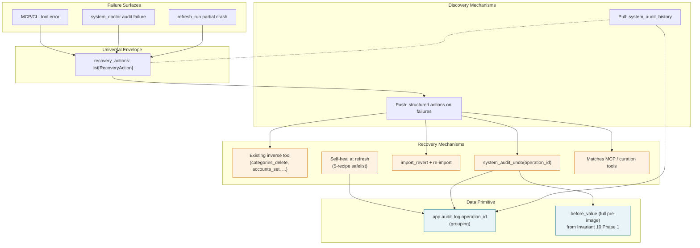

# Feature: Recoverable State Contract — Agent-Driven Recovery from Data Failures

## Status

draft

## Goal

Make every data failure in MoneyBin recoverable through MCP and CLI tools — never through SQL surgery. The system holds the contract; the agent reads structured `recovery_actions` from any failure and executes the named tool calls; nothing the system does is irreversible. This spec lands the cross-cutting infrastructure that closes the recovery gaps surfaced during the 2026-05-19 agent-experience review: error envelopes that don't tell the agent what to do, mutations with no undo, silent refresh crashes, an audit log without a consumer, and the matches domain only reachable from CLI.

The work has eight pieces, all interlocking:

1. A uniform `RecoveryAction` shape on every error and audit failure (push discovery).
2. `operation_id` grouping on `app.audit_log` so a tool call's mutations are one undoable unit.
3. An audit-log undo consumer — Phase 2 of Invariant 10 — exposed via `system_audit_undo` / `system_audit_history` / `system_audit_get`.
4. A doctor recipe registry: each invariant audit ships with a Python recipe producing `recovery_actions` from the failure's affected IDs.
5. A self-heal safelist run at refresh time — five active recipes, all reversible through the same audit-log undo, with five strict criteria that gate any future addition. A small "deferred" subsection captures known-shape future recipes that don't yet have a concrete trigger.
6. The matches MCP surface (`transactions_matches_run` / `_review` / `_set` / `_history`) closing the CLI-only gap.
7. `RefreshResult` extensions surfacing matching and categorization crashes that today log at DEBUG and accumulate dupes silently.
8. A new always-loaded project rule (`.claude/rules/data-recovery.md`) codifying the contract for future tools, audits, and refresh stages.

The umbrella property is the **trust contract**: the system *recomputes* but never *decides*. Self-heal removes only records whose existence depends entirely on something the user already deleted; it never alters anything the user authored. Every action — including self-heal — is logged and reversible. If the system would have to choose between two reasonable outcomes, it surfaces the choice with structured `recovery_actions` instead of guessing.

## Background

### Current state

Recoverability today is partial and inconsistent across domains:

- **Imports** — `import_revert(import_id)` is a clean reverse, with cascade detection (`status="superseded"` if a newer import shadowed the batch). Per-file error isolation on multi-file imports works.
- **App-state mutations** — Invariant 10 Phase 1 (spec `app-integrity-invariant.md`, status `ready`) routes every mutation to `app.*` through a `*Repo` with full pre-image capture in `app.audit_log.before_value` and cascade threading via `parent_audit_id`. The undo *consumer* is deferred to Phase 2.
- **Pipeline audits** — `system_doctor` runs three SQLMesh named audits (FK integrity, sign convention, transfer balance) plus a categorization-coverage check, returns pass/fail/warn per audit, optionally with affected IDs.
- **Error envelopes** — `UserError(message, code, hint, details)` carries machine-readable codes today, but the code taxonomy is undocumented and varies by domain. Success responses have an `actions: list[str]` array of navigational hints; error responses have nothing equivalent.
- **Matches domain** — CRUD operations exist as CLI commands (`moneybin transactions matches run/review/undo/history`) with no MCP surface.

### Gaps that motivate this spec

Surfaced during the 2026-05-19 brainstorm and prior agent-experience reports:

1. **Errors don't carry recovery actions.** A parse failure says "OFX parse failed at line 47" but doesn't tell the agent which tool fixes it. The agent has to know the recovery path from prior context.
2. **No general undo for `app.*` mutations.** Invariant 10 Phase 1 captures the data; Phase 2 builds the consumer. Without it, "I miscategorized 30 transactions, undo that" requires manual re-edits or reaching for `sql_query` — exactly the SQL surgery this spec rules out.
3. **Doctor failures don't point at recoveries.** "FK integrity failed on these 5 transaction IDs" leaves the agent guessing whether to revert an import, edit the account_id, or treat the orphan as intentional.
4. **Self-healing is absent.** When `import_revert` cascades and leaves orphan `app.transaction_categories` rows, those accumulate forever. No refresh-time cleanup.
5. **Refresh crashes silently.** Matcher and categorizer failures log at DEBUG (`followups.md:71`); the import looks healthy while dupes silently accumulate. No surface to detect partial-pipeline failure.
6. **Matching unreachable from MCP.** Agents diagnosing duplicate transactions can't act — `transactions_matches_*` is CLI-only.
7. **No "regret" surface.** Even with Phase 1 audit_log data, there's no agent-callable enumeration of recent mutations. The agent can't surface "you changed these 5 things in the last hour, want to undo any?" without raw SQL access.
8. **No project rule.** Each future spec re-invents how errors should hint at recovery, what self-heal is allowed, what counts as an audit-with-recipe vs untyped failure.

### Why this design

**Push + pull discovery.** Every failure carries structured `recovery_actions` (push), and a dedicated `system_audit_history` tool enumerates recent operations regardless of error (pull). Push covers the "something broke" case; pull covers the "I changed my mind" case. Together they make `sql_query` unnecessary for any recovery path.

**Audit-log-driven undo over per-domain inverse tools.** Invariant 10 Phase 1 already captures the data; Phase 2 is one consumer, not a dozen `un*` tools. The verb vocabulary in `.claude/rules/surface-design.md` doesn't have a `_undo` verb on purpose — reversibility lives in the audit log, not in paired tools. Explicit named tools exist only where the inverse is structurally a different operation (matches, splits — where the inverse is a state change, not a row restore).

**Safelist + report over aggressive auto-heal.** Refresh-time self-healing is gated on five strict criteria (derivable, idempotent, no information loss, auditable, reversible). Five active recipes pass all five; everything else surfaces as an audit failure with a recovery recipe. The system never destroys user-authored content automatically. The trust contract is concrete: **recompute, don't decide.**

**Block-don't-cascade undo.** `system_audit_undo` blocks when a later operation modified the same row and returns the blocker operations in `recovery_actions`. The agent walks the chain explicitly. Auto-cascade is exactly the magic that loses trust ("I undid one thing and it deleted my categorizations from last week"); blocking forces the agent to communicate the cascade to the user before acting.

**Uniform envelope across MCP and CLI.** CLI commands emit the same `recovery_actions` array in their JSON output. Per `feedback_cli_agent_surface.md`, CLI is a first-class agent surface — same JSON, same redaction, same audit. Human-readable CLI output renders the actions as a numbered list with `moneybin <cmd>` syntax.

### Related specs

- [`app-integrity-invariant.md`](app-integrity-invariant.md) — Phase 1 (audit_log pre-image capture, repository routing, lint rule, doctor invariants). **Prerequisite.** This spec implements Phase 2 (the undo consumer) and supersedes the Phase 2 description in that spec's [Out of Scope](app-integrity-invariant.md#out-of-scope) section.
- [`moneybin-doctor.md`](moneybin-doctor.md) — invariant audits surfaced by `system_doctor`. This spec adds the recipe registry that yields `recovery_actions` for each audit.
- [`architecture-shared-primitives.md`](architecture-shared-primitives.md) — Invariant 10 ("`app.*` mutation routing"), to which this spec adds a sister Invariant 11 ("Recoverability of mutations").
- [`moneybin-mcp.md`](moneybin-mcp.md) / [`moneybin-cli.md`](moneybin-cli.md) — surface specs the new tools and CLI commands extend.
- [`matching-same-record-dedup.md`](matching-same-record-dedup.md) — owns `app.match_decisions`; the matches MCP surface in this spec wraps the existing matching service.
- [`smart-import-financial.md`](smart-import-financial.md) / [`smart-import-tabular.md`](smart-import-tabular.md) — import error sites this spec retrofits with `recovery_actions`.
- [`transaction-curation.md`](transaction-curation.md) — owns curation mutations (notes/tags/splits); error envelopes from these tools get retrofitted.

## Requirements

1. **`RecoveryAction` type.** A structured value with the following shape, used uniformly on every error and audit failure:

    ```python
    class RecoveryAction:
        tool: str  # MCP tool name, e.g. "system_audit_undo"
        arguments: dict[str, Any]  # prefilled args — agent can execute directly
        rationale: str  # short prose: WHY this fixes the failure
        confidence: Literal["certain", "suggested"]
        # certain = this will fix it
        # suggested = agent should weigh other context
        idempotent: bool  # safe to retry on transient failure?
    ```

    Lists are ordered: most-likely-correct first. Empty list = nothing actionable; the agent MUST escalate to the user — never silently treat as auto-recovered.

2. **Universal envelope extension.** `UserError` and the success-path response envelope both gain an optional `recovery_actions: list[RecoveryAction] | None` field. The existing `actions: list[str]` on success responses stays — that field is navigational ("what to do next"), not recovery ("how to fix what broke"). The two coexist with distinct semantics. CLI JSON output carries the same field.

3. **Error code taxonomy.** Prefix-grouped, stable, agent-branchable:

    | Prefix | Domain |
    |--------|--------|
    | `import_*` | Loading raw data |
    | `mutation_*` | App-state writes |
    | `audit_*` | Doctor / invariant failures |
    | `refresh_*` | Pipeline (matcher / categorizer / SQLMesh) |
    | `undo_*` | Audit-log undo |
    | `recovery_*` | Recovery tooling itself (e.g. `recovery_no_path`) |

    Every existing `UserError` code is audited and migrated to this taxonomy in the rollout PR sequence. The `code` field becomes load-bearing — agents may branch on it. CHANGELOG entry under `Changed` for any pre-existing code that changes shape.

    **Implementation note (PR 2):** the taxonomy module (`src/moneybin/error_codes.py`) also declares `infra_*`, `sync_*`, and `gsheet_*` prefixes to absorb existing non-recovery error codes (`infra_database_locked`, `infra_io_error`, `sync_error`, `gsheet_error`, etc.) without leaving them unprefixed. `sync_*` (mediated providers) and `gsheet_*` (user-controlled storage) are distinct connector domains per the `_connect`/`_link` verb split in `surface-design.md`. These prefixes are *not* part of the recovery contract — they exist purely for taxonomy completeness so `test_error_codes::test_every_code_uses_valid_prefix` can be enforced repo-wide. New recovery codes must use one of the six prefixes in the table above.

4. **`operation_id` schema addition.** `app.audit_log` gains three columns:

    | Column | Type | Purpose |
    |--------|------|---------|
    | `operation_id` | `TEXT NOT NULL` | `op_<uuid4_hex>` (32-char hex prefixed with `op_`); all audit rows from one MCP/CLI call share this value. Pre-spec rows use the synthetic backfill form `op_legacy_<audit_id>` so they're queryable but not grouped. |
    | `is_undo` | `BOOLEAN NOT NULL DEFAULT FALSE` | True for rows produced by `system_audit_undo` |
    | `undoes_operation_id` | `TEXT NULL` | If `is_undo=True`, points at the original operation |

    Plus indexes on `(operation_id)` and `(occurred_at DESC, operation_id)`. The service-layer mutation context manager (introduced in this spec) sets `operation_id` once at the start of a tool call; every audit row written during that call inherits it. Self-heal recipes use the same mechanism with `operation_id='op_self_heal_<recipe>_<uuid4_hex>'` and `actor='system:self_heal'`.

5. **Audit-log undo consumer.** Three new MCP tools (with CLI parity):

    - **`system_audit_undo(operation_id)`** — push consumer. Reads all audit rows for the operation, computes per-row inverse (insert→delete, update→update-to-before_value, delete→insert), wraps in a transaction, writes new audit rows with `is_undo=True` and `undoes_operation_id`, returns summary with the new operation_id (so the undo itself is undoable). Errors:
        - `undo_operation_not_found` — bad operation_id. `recovery_actions` lists `system_audit_history` to enumerate valid ids.
        - `undo_already_undone` — an undo already reversed this op. `recovery_actions` suggests undoing the undo, `confidence=suggested`.
        - `undo_cascade_blocked` — a later operation modified the same `(target_table, target_id)`. `recovery_actions` lists blocker operation_ids with `system_audit_undo` calls in reverse chronological order.
    - **`system_audit_history(domain?, since?, actor?, limit=50, include_undone=False)`** — pull surface. Returns recent operations grouped by `operation_id`. Each entry includes the tool, arguments, actor, timestamp, tables touched, row count, `can_undo` bool, `undo_blocked_by: list[operation_id] | None`, and a `recovery_actions` list (always one `system_audit_undo` call).
    - **`system_audit_get(operation_id)`** — single-entity detail. Returns full `before_value` / `after_value` for every audit row in the operation, letting agents pre-check what an undo would change without executing.

6. **Block-don't-cascade undo.** `system_audit_undo` does NOT auto-cascade. When later operations touch the same rows, it returns `undo_cascade_blocked` with blockers in `recovery_actions`. The agent walks the chain explicitly. No `system_audit_undo_cascade` tool in Phase 1; revisit if agent UX shows the walk is too verbose.

7. **Doctor recipe registry.** Each invariant audit (SQLMesh named + DoctorService extra) ships with a Python recipe that produces `recovery_actions` from `affected_ids` and context:

    ```python
    def recovery_recipe(
        affected_ids: list[str],
        context: AuditContext,  # DB handle, settings, current state
    ) -> list[RecoveryAction]: ...
    ```

    Layout: `src/moneybin/audits/recipes/<audit_name>.py` and `src/moneybin/audits/registry.py` (`{audit_name: recipe_fn}` lookup). DoctorService loads the recipe by audit_name when constructing each `AuditResult`. `AuditResult` gains `recovery_actions: list[RecoveryAction]` (per-audit carrier, not bundled at the doctor-response level).

    Recipes for existing audits:

    | Audit | Recipe output |
    |-------|---------------|
    | `fct_transactions_fk_integrity` | (1) `accounts_get(account_id=<orphan>)` — investigate; (2) `import_revert(import_id=<source>)` if orphan from bad import. `confidence=suggested` |
    | `fct_transactions_sign_convention` | (1) `import_revert(import_id=<source>)` per affected txn. `confidence=suggested` |
    | `bridge_transfers_balanced` | (1) `transactions_matches_set(match_id, status="rejected")` to reject the bad transfer match; (2) `transactions_get(transaction_id)` to investigate. `confidence=suggested` |
    | `categorization_coverage` (warn) | (1) `transactions_categorize_run(methods=["rules","merchants"])`. `confidence=certain` |
    | `dedup_reconciliation` (fail) | (1) `refresh_run(steps=["match"])` to re-apply matching when a recorded decision didn't collapse its rows; (2) `system_doctor(verbose=True)` to inspect the raw/core count delta. `confidence=suggested` |
    | `orphan_app_state` (new) | (1) `transactions_notes_delete(note_ids=[...])` and/or `transactions_tags_set(transaction_id=..., tags=[])` per orphan. `confidence=certain` |

8. **Self-heal safelist.** Five active recipes run at refresh time. Each MUST satisfy all five criteria:

    1. **Derivable** — corrected state fully computable from inputs the user controls.
    2. **Idempotent** — running twice = running once.
    3. **No information loss** — never destroys user-authored content.
    4. **Auditable** — writes one `app.audit_log` row per affected entity with `reason='self_heal:<recipe_id>'` and full pre-image.
    5. **Reversible** — undoable through `system_audit_undo` like any other operation.

    Failing criterion 3 or 5 is disqualifying. The safelist:

    | # | Recipe | Trigger | Action |
    |---|--------|---------|--------|
    | 1 | `orphan_categorizations_cleanup` | After `import_revert` or hard data deletion | DELETE `app.transaction_categories` rows whose `transaction_id` no longer resolves in `core.fct_transactions` |
    | 2 | `orphan_splits_cleanup` | Same | DELETE `app.transaction_splits` rows whose parent transaction is gone |
    | 3 | `derived_table_rebuild` | Every refresh (already happens) | Rebuild `core.*` and `reports.*` from raw + app |
    | 4 | `match_index_recompute` | Account aliases change, or after revert | Rebuild matching index from current account+txn state |
    | 5 | `rule_apply_to_uncategorized` | After `transactions_categorize_rules_create` | Apply new rule to transactions where `app.transaction_categories` has no row — never to manually-categorized rows |

    Adding a recipe after Phase 1 requires explicit reference to all five criteria in the PR description; no recipe lands without that justification. Orphan `app.transaction_notes` / `app.transaction_tags` rows after revert explicitly stay OFF the safelist (fail criterion 3) — they surface as `orphan_app_state` audit failures instead.

    **Deferred safelist recipes** — known-shape recipes whose trigger doesn't yet warrant a concrete implementation. Documented so future contributors recognize the shape and don't re-derive the analysis; added to the active safelist (with the five-criteria justification) only when a real driver appears.

    | Recipe | Why deferred | Trigger that would promote it |
    |---|---|---|
    | `account_displayname_reresolve` | Refresh derived display references in `core.dim_accounts` and `reports.*` is already covered by `derived_table_rebuild` (recipe #3) in Phase 1. No non-derived cache of account display names exists today. Promoting now would allocate audit/undo surface for a no-op. | A non-derived projection that caches account display names appears (e.g., a saved-view system, a report that materializes display strings outside SQLMesh). At that point: add the recipe to the active list with explicit five-criteria justification. |

9. **`RefreshResult` error surfacing.** The response from `refresh_run` gains:

    ```python
    class RefreshResult:
        # existing
        transforms_applied: bool
        transforms_count: int
        matched_count: int
        categorized_count: int
        # new
        matching_error: str | None
        categorization_error: str | None
        self_heal_actions: list[SelfHealRecord]


    class SelfHealRecord:
        recipe_id: str  # one of the 6 safelist recipes
        rows_affected: int
        operation_id: str  # for undo via system_audit_undo
        timestamp: str
    ```

    Behavior change: catches in matcher/categorizer move from `logger.debug(...)` to `logger.error(...)` and populate the `*_error` field. Refresh continues — one stage's failure doesn't abort the pipeline (same partial-failure-isolation pattern import already uses). If any `*_error` is set, the response envelope's `recovery_actions` includes:

    - `refresh_run(steps=["match"])` or `refresh_run(steps=["categorize"])` for retry, `confidence=suggested`.
    - `system_doctor(verbose=True)` for diagnosis, `confidence=suggested`.

10. **Matches MCP surface.** Four MCP tools over the pair-decision model (`app.match_decisions`, one row per proposed pair keyed by `match_id`):

    | MCP tool | Shape | CLI equivalent |
    |----------|-------|----------------|
    | `transactions_matches_run(scope?, force?)` | 3 (discrete-verb batch) | `moneybin transactions matches run` |
    | `transactions_matches_review(scope?)` | 5 (collection projection) | `moneybin transactions review --type matches` |
    | `transactions_matches_set(match_id, status)` | 1b (accept/reject one decision) | `moneybin transactions matches set` (new — REC-PR5) |
    | `transactions_matches_history(since?, scope?)` | 5 (time-series) | `moneybin transactions matches history` |

    `_run` and `_history` mirror the existing CLI. `_set` is genuinely new non-interactive surface: today accept/reject lives only in the interactive `transactions review --type matches` queue, so agents can't reach it. `_set` accepts or rejects **one decision by `match_id`** (`status ∈ {accepted, rejected}`). There is no `match_group_id`/`primary` write surface — `match_group_id` is a derived prep-layer column (the connected-component group key in `int_transactions__matched`), and dedup collapses each group by field-level source-priority merge (`int_transactions__merged`), so no single physical row is "primary."

    No `transactions_matches_undo` MCP tool. `app.match_decisions` is protected by Invariant 10 → audit_log → `system_audit_undo`. The existing CLI `moneybin transactions matches undo` migrates to call `system_audit_undo` internally.

11. **Project rule.** A new always-loaded workflow rule lands at `.claude/rules/data-recovery.md`. It codifies:

    1. The trust contract (system recomputes, never decides; everything reversible; empty `recovery_actions` = escalate).
    2. The five safelist criteria for any new self-heal recipe.
    3. The six recovery paths — every failure must map to exactly one.
    4. The `RecoveryAction` shape and the `error_code` prefix taxonomy.
    5. When to add a doctor recipe vs leave as generic audit failure.
    6. When to use audit-log undo (any `app.*` mutation) vs explicit named tool.
    7. The hard rule: no `recovery_action` may name `sql_query` or any other DDL/write tool.
    8. The "many" convention — recovery citations use the canonical batch-capable tool, never a `_many` variant. Existing tools that only accept a single id must accept a list before being cited in a recipe.

12. **Existing-tool retrofit.** Every existing MCP tool's error path gains either a populated `recovery_actions` field or an explicit empty list with `error_code="recovery_no_path"` (forcing escalation rather than silence). Retrofit lands per-domain in small PRs after the envelope contract ships (PR 3 in the rollout). Domains: import, matching, categorize, accounts, balance, budget, transaction-curation, transform.

13. **`transactions_notes_delete` accepts a list.** Existing tool extends to accept `note_ids: list[str]` in addition to the single-id form. Backward compat: a single string id is still accepted during the deprecation window. The `orphan_app_state` recipe cites the list form. No new `_many` tool — per the "many native" convention.

14. **Invariant 11 — Recoverability of mutations.** Appended to `architecture-shared-primitives.md` §Architecture Invariants:

    > **Invariant 11 — Recoverability of mutations.** Every mutation that reaches a user-observable surface (MCP, CLI, REST) MUST be recoverable through one of six paths: (a) an existing inverse tool, (b) `system_audit_undo` against the operation's `operation_id`, (c) `import_revert` plus re-import, (d) a self-heal recipe at refresh time, (e) a doctor recipe with structured `recovery_actions`, or (f) a domain-specific MCP tool for state changes whose inverse is structurally distinct (matches, splits). No recovery path may name `sql_query` or any DDL/write tool; reaching for SQL is an indication that a recovery tool is missing and must be added.

## Data Model

`app.audit_log` schema additions (Migration `V0NN_audit_log_operation_id.sql`):

```sql
-- Step 1: add the new columns. operation_id starts NULLABLE so the
-- backfill UPDATE in Step 2 can populate it. DuckDB (like standard SQL)
-- does not permit column references in DEFAULT clauses, so a
-- `DEFAULT 'op_legacy_' || audit_id` is invalid — the backfill must be
-- a separate UPDATE.
ALTER TABLE app.audit_log ADD COLUMN operation_id TEXT;
ALTER TABLE app.audit_log ADD COLUMN is_undo BOOLEAN NOT NULL DEFAULT FALSE;
ALTER TABLE app.audit_log ADD COLUMN undoes_operation_id TEXT NULL;

-- Step 2: backfill existing rows with a deterministic synthetic id so
-- each pre-spec row is independently undoable but not grouped.
UPDATE app.audit_log
   SET operation_id = 'op_legacy_' || audit_id
 WHERE operation_id IS NULL;

-- Step 3: enforce NOT NULL going forward. From here on, the
-- service-layer MutationContext owns assignment at the AuditService
-- write boundary; new rows always have a value.
ALTER TABLE app.audit_log ALTER COLUMN operation_id SET NOT NULL;

-- Step 4: indexes for undo lookups.
CREATE INDEX idx_audit_log_operation_id ON app.audit_log (operation_id);
CREATE INDEX idx_audit_log_occurred_at_op ON app.audit_log (occurred_at DESC, operation_id);
```

Existing rows get a synthetic `operation_id` (`op_legacy_<audit_id>`) so each pre-spec row is independently undoable but not grouped. The column carries no SQL-level DEFAULT after the migration; new rows are populated explicitly by the service-layer MutationContext at the AuditService write boundary.

No other schema changes. The pre-image in `before_value` (full row, per Phase 1 Req 4) is what the undo consumer restores.

## Architectural Pattern



Every failure on the left funnels into the universal envelope; the agent reads `recovery_actions` and dispatches into one of the six recovery paths in Invariant 11. The right side of the diagram shows the five *executing* mechanisms; the sixth path — doctor recipes (Invariant 11 path (e)) — produces `recovery_actions` whose `tool` fields name one of those same five mechanisms, so it routes through the Push discovery layer rather than executing recovery itself. All mechanisms that touch `app.*` land in the audit log via Invariant 10 Phase 1's pre-image capture, so every recovery is itself recoverable.

## Implementation Plan

Phase 2 of Invariant 10 + sister contract work + matches MCP + refresh surfacing + project rule. Lands as a sequence of small reviewable PRs. PR 1 assumes Phase 1 (`app-integrity-invariant.md`) has shipped — Phase 1 is the hard prerequisite.

### PR 1 — `operation_id` schema + service-layer context manager

- Migration `V0NN_audit_log_operation_id.sql` (per Data Model).
- `src/moneybin/services/mutation_context.py` — context manager that mints an `operation_id` (`op_<uuid4_hex>`) at the start of every MCP/CLI tool call and threads it through the repository write path. Repositories pass `operation_id` to `AuditService.record_audit_event()`. The decorator that wraps MCP tool entry points and the CLI command framework both push the operation_id onto a contextvars frame; repositories read it from there.
- `AuditService.record_audit_event()` accepts `operation_id` (required after PR 1) and writes it.
- Backfill test: existing pre-spec audit rows get the legacy synthetic id; new rows from any tool share the contextvars value.
- No behavior changes visible at the MCP/CLI surface yet.

### PR 2 — `RecoveryAction` type + error_code taxonomy + envelope plumbing

- Define `RecoveryAction` (Pydantic model) and the `ErrorEnvelope` shape with the new optional field.
- `UserError` gains `recovery_actions: list[RecoveryAction] | None = None`. `build_error_envelope()` wires it through.
- Add the error_code prefix taxonomy as a documented enum/constants module (`src/moneybin/errors/codes.py`).
- Audit existing `UserError(...)` raises in-tree and migrate any codes that don't fit the taxonomy. CHANGELOG entry under `Changed`.
- AuditResult (from `system_doctor`) gains the same field.
- No tool yet populates `recovery_actions`; that's PRs 5 and 9a-N.

### PR 3 — Audit-log undo consumer (`system_audit_undo` + `_history` + `_get`)

- `src/moneybin/services/undo_service.py` — `UndoService.undo(operation_id)`, `.history(...)`, `.get(operation_id)`.
- MCP tools: `system_audit_undo`, `system_audit_history`, `system_audit_get` in `src/moneybin/mcp/tools/system.py`.
- CLI parity: `moneybin system audit undo`, `moneybin system audit history`, `moneybin system audit get`.
- Cascade detection: query for any later audit row in `(target_table, target_id, operation_id != self)`. If found, return `undo_cascade_blocked` with the blockers in `recovery_actions` (newest first, since blockers must undo in reverse order).
- Undo emission: each undo writes a new audit row per affected entity with `is_undo=TRUE`, `undoes_operation_id=<original>`, and a fresh `operation_id` of its own. The returned summary includes that new operation_id so the undo itself is queryable and undoable.
- Tests: round-trip per Invariant 10 protected table; cascade-blocked scenario; double-undo (`undo_already_undone`); `undo_operation_not_found`.

### PR 4 — Doctor recipe registry + recipes for existing audits

- `src/moneybin/audits/recipes/__init__.py`, `registry.py`, plus one Python module per existing audit (per Req 7).
- `DoctorService` constructs each `AuditResult` with `recovery_actions` populated from `registry.get(audit_name)(affected_ids, context)`.
- New audit + recipe: `orphan_app_state` — scans `app.transaction_notes`, `app.transaction_tags` for orphans (transaction_id missing in `fct_transactions`). Recipe produces batched delete actions per orphan.
- Tests per-recipe: seed failing state → audit fires → recipe yields expected actions → tool names + arguments are valid (round-trip-executable).

### PR 5 — Matches MCP surface

- Four new tools in `src/moneybin/mcp/tools/transactions_matches.py`, wrapping the existing matching service.
- CLI: existing commands stay (already implemented); CLI's `transactions matches undo` migrates to call `system_audit_undo` internally (thin wrapper).
- Tests: surface tests per `.claude/rules/testing.md`; cross-surface parity test asserts CLI and MCP yield equivalent JSON.

### PR 6 — `RefreshResult` error surfacing

- Extend `RefreshResult` per Req 9. Update `refresh_run` to populate the new fields.
- Move matcher/categorizer crash logging from DEBUG to ERROR; populate `*_error` fields.
- Update `refresh_run`'s response envelope to include `recovery_actions` when `*_error` is non-None.
- Tests: simulate matcher crash → `RefreshResult.matching_error` populated → envelope `recovery_actions` includes `refresh_run(steps=["match"])` and `system_doctor`.

### PR 7 — Self-heal safelist recipes

- `src/moneybin/services/self_heal/` — one module per recipe in the active safelist (recipes 1, 2, 4, 5; recipe 3 — derived table rebuild — already exists in refresh and just gains audit_log emission). Deferred recipes (e.g., `account_displayname_reresolve`) are not implemented in Phase 1; the spec's deferred subsection documents their shape for future promotion.
- `refresh_run` invokes the safelist after `derived_table_rebuild`. Each recipe writes per-entity audit rows with `actor='system:self_heal'` and `operation_id='op_self_heal_<recipe_id>_<uuid4_hex>'`. The triggered operation_ids accumulate into `RefreshResult.self_heal_actions`.
- Tests per recipe: seed drift → refresh runs → drift gone → audit rows present → `system_audit_undo(operation_id)` reverses the heal.
- Cross-cutting test: chain of revert → refresh → self-heal → audit_history shows the self-heal as undoable; user can `system_audit_undo` it to restore the orphan.

### PR 8 — `transactions_notes_delete` list-accepting form

- Extend the existing tool to accept `note_ids: list[str]`. Single-id form deprecated but accepted for one minor release per the post-launch evolution rule in `.claude/rules/design-principles.md` (we're pre-launch, but the symmetry is cheap to keep).
- Update the `orphan_app_state` recipe to cite the list form.

### PRs 9a-N — Per-domain retrofit of `recovery_actions` on existing tools

One small PR per domain. Each retrofits the tool's `UserError` raises with `recovery_actions`. Order suggested by failure frequency from agent-experience reports:

- 9a — Import (`import_files`, `import_preview`, `import_revert`).
- 9b — Categorize (`transactions_categorize_run`, `_rules_create`, `_rules_delete`, `_commit`).
- 9c — Accounts (`accounts_set`, `accounts_balance_assertions`, `accounts_balance_assertion_delete`).
- 9d — Curation (`transactions_notes_*`, `transactions_tags_*`, `transactions_splits_set`).
- 9e — Budgets (`budget_set`, `budget_delete`).
- 9f — Transform (`transform_apply`, `transform_validate`).

Each PR includes a property test asserting that every error path in the domain either populates `recovery_actions` or explicitly raises with `error_code="recovery_no_path"`.

### PR 10 — Project rule + Invariant 11 + roadmap + CHANGELOG

- `.claude/rules/data-recovery.md` per Req 11.
- Append Invariant 11 (Req 14) to `architecture-shared-primitives.md`.
- Update `docs/roadmap.md` — close M2D row with ✅ shipped.
- CHANGELOG entry under M2D dated section: added recoverable-state contract, audit-log undo, doctor recipes, matches MCP, refresh error surfacing.
- New guide: `docs/guides/agent-recovery.md` — how agents discover and execute recovery (audience: agent integrators / power users).
- Update `docs/specs/app-integrity-invariant.md` — mark Phase 2 as superseded by this spec; cross-link.
- Update `docs/specs/INDEX.md` — promote this spec to `implemented`.

## Test Coverage

Per `.claude/rules/testing.md` test layers.

| Layer | Test file(s) | Verifies |
|-------|--------------|----------|
| Unit (envelope) | `tests/moneybin/test_errors/test_envelope.py` | `RecoveryAction` validates; error-code constants stable; `UserError` round-trips through `build_error_envelope` |
| Unit (per recipe) | `tests/moneybin/test_audits/test_recipes/test_<audit>.py` | Recipe yields expected `RecoveryAction` list for seed inputs; tool names + arguments are agent-executable |
| Unit (self-heal) | `tests/moneybin/test_self_heal/test_<recipe>.py` | Each safelist recipe: seed drift → run → drift gone → audit rows correct → undo reverses |
| Integration (undo) | `tests/integration/test_audit_undo.py` | Mutate → `system_audit_undo` → verify pre-mutation state; `is_undo` and `undoes_operation_id` set; undo's own row is undoable |
| Integration (cascade) | `tests/integration/test_audit_undo_cascade.py` | op1 → op2 on same row → `system_audit_undo(op1)` fails with blocker list = [op2]; undo op2 then op1 succeeds |
| Integration (doctor recipe) | `tests/integration/test_doctor_recipes.py` | Seed audit-failing state → `system_doctor` → `recovery_actions` non-empty; tools named exist in registry |
| Integration (refresh) | `tests/integration/test_refresh_error_surfacing.py` | Inject matcher crash → `RefreshResult.matching_error` populated; envelope `recovery_actions` correct |
| Integration (matches MCP) | `tests/integration/test_matches_mcp.py` | All four new tools functional; parity with CLI JSON |
| Property | `tests/moneybin/test_envelope_property.py` | For every registered MCP tool, every code path that raises `UserError` either populates `recovery_actions` or sets `error_code="recovery_no_path"`. Fails CI if a new error site forgets. |
| Scenario | `tests/scenarios/test_scenario_recoverable_state.py` | End-to-end: import → categorize → split → tag → revert → verify orphans cleaned by self-heal; bad rule → undo via `system_audit_undo`; agent never reaches for `sql_query` |
| Cross-surface | `tests/integration/test_cli_mcp_recovery_parity.py` | CLI JSON output of recovery_actions = MCP envelope contents for matched failure shapes |

## Out of Scope

- **Sub-batch row-level `import_revert`.** Existing batch revert + re-import path stays the answer for "50 of 100 rows are bad." Row-level revert adds complexity for an unclear demand signal. Tracked as follow-up if agent-experience reports surface it.
- **Atomic time-range undo (`system_audit_undo_range(since, until)`).** Sequencing via `system_audit_history` + per-op `system_audit_undo` covers it. Atomic version is a sharp edge — could undo across user intent boundaries. Revisit if agent UX shows the walk is too verbose.
- **Encryption-key recovery.** Out of layer; covered by `privacy-data-protection.md` and external backups.
- **Schema migration rollback.** Covered by `database-migration.md`. The Phase 2 schema additions in this spec are forward-only.
- **External-state side-effect undo (M3A Plaid sync).** No external mutations in the current sync model; sync server is opaque per AGENTS.md. M3A spec decides if needed.
- **Undoing `import_revert` via `system_audit_undo`.** `import_revert` mutates `raw.*`, which is outside Invariant 10 / audit_log scope by design (the schema boundary is load-bearing — `raw.*` is bytes-from-source). The cascade self-heal that `import_revert` triggers (orphan cleanup in `app.transaction_categories`, `app.transaction_splits`) IS audit-logged and individually undoable, but undoing those rows without re-importing would only restore orphans pointing at deleted raw rows. The correct recovery for an unwanted revert is to re-import the source file; `import_revert`'s error envelope on a "no, I want it back" agent prompt MUST escalate to the user with `error_code="recovery_no_path"` rather than silently chain audit undos.
- **`dedup_reconciliation` invariant (formerly `staging_coverage`).** Unblocked separately against the real pair-decision model — no `is_primary`/group column needed; the expected absorbed count is simply the accepted-dedup decision count. Now active; see `moneybin-doctor.md`. Not part of this milestone.
- **`system_audit_undo_cascade` tool.** Block-don't-cascade is the Phase 1 default. Add later only if walk-and-retry pattern is verbose enough in real agent UX.
- **Aggressive auto-heal beyond the safelist.** The five criteria are the gate. Adding a recipe requires explicit justification.
- **Retroactive recovery_actions backfill on pre-spec error logs.** Errors before this spec don't get retroactive actions; the contract starts at deploy time.
- **Recovery analytics / agent-success metrics.** Whether `recovery_actions` actually got executed by agents is interesting but a separate measurement spec.

## Resolved Design Decisions

Resolved during the 2026-05-19/2026-05-20 brainstorm. Captured so future readers can see the path taken and the alternatives weighed against it.

1. **Push + pull discovery, not push-only.** Push (`recovery_actions` on failures) covers the reactive case. Pull (`system_audit_history`) covers regret — the user changed their mind, no error preceded the bad state. Push-only would force agents to reach for `sql_query` for regret cases; that's exactly the surgery this spec rules out. Cost: one extra tool surface (`system_audit_history`), worth it.

2. **Safelist + report posture for self-heal, not aggressive or detect-only.** "I don't want friction, but I don't want the kind of magic that loses trust." The five criteria are the line: derivable + idempotent + no information loss + auditable + reversible. Five active recipes pass all five (`account_displayname_reresolve` was drafted as a sixth but moved to the deferred subsection per the PR #188 review — it's "largely subsumed by `derived_table_rebuild`" in Phase 1, so reserving an active slot for it would allocate audit/undo surface for a no-op). Everything else — orphan notes, recategorization conflicts, budget references — surfaces as `orphan_app_state` audit failures with structured recovery_actions. Recipe #5 (`rule_apply_to_uncategorized`) stays auto-on; it only creates rows where `app.transaction_categories` has no entry for the transaction, so manual categorizations are protected.

3. **Audit-log-driven undo, not per-domain inverse tools.** Approach C (hybrid) over Approach B (per-domain). Phase 1 already captures the data; Phase 2 is one consumer rather than 6-8 `un*` tools. The verb vocabulary in `.claude/rules/surface-design.md` doesn't have a `_undo` verb on purpose — reversibility lives in the audit log. Explicit named tools exist only where the inverse is structurally a different operation (matches, splits).

4. **Block-don't-cascade undo.** When a later operation modified the same rows, `system_audit_undo` returns `undo_cascade_blocked` with blockers; the agent walks the chain explicitly. Auto-cascade is exactly the magic that loses trust ("I undid one thing and it deleted my categorizations from last week"). No `system_audit_undo_cascade` tool. Revisit only if real agent UX shows the walk is verbose enough to warrant it.

5. **Mutation tools handle the "many" case natively; no `_many` variants.** Confirmed 2026-05-20 against the initial proposal of `transactions_notes_delete_many`. The canonical `transactions_notes_delete` extends to accept `note_ids: list[str]`. Verb vocabulary stays clean; agent never disambiguates between `_delete` and `_delete_many`. Codified in the new project rule (Req 11.8).

6. **Empty `recovery_actions` = escalate, never silent no-op.** A failure with no actionable recovery MUST set `error_code="recovery_no_path"` explicitly; agents read this and escalate to the user. The contract is that the system never silently treats an unrecoverable error as auto-recovered.

7. **No `recovery_action` may name `sql_query` or DDL tools.** Hard rule. If a failure can only be recovered via SQL surgery, that's a missing tool — escalate to spec and add the tool. Codified in the project rule (Req 11.7).

8. **CLI parity from day one.** CLI JSON output carries the same `recovery_actions`. Per `feedback_cli_agent_surface.md`, CLI is a first-class agent surface — same JSON, same redaction, same audit. Human-readable CLI output renders recovery_actions as a numbered list with `moneybin <cmd>` invocation syntax.

9. **New milestone slot (M2D), not bundled into M2C.** The envelope is a one-way door — lock once, every future spec inherits — so it deserves its own scope. Bundling into M2C dilutes both. Cross-cutting into M3A-D fragments the contract.

10. **Invariant 11 (Recoverability of mutations), not just a documentation update.** Codified at the same level as Invariant 10 in `architecture-shared-primitives.md`. Forces future specs to declare their recovery path during design, not after.

11. **UUID4 over ULID for `operation_id`.** Drafted with "ULID" for chronological-sort properties; the spec was updated during review (2026-05-20, PR #188 review feedback) to use `op_<uuid4_hex>` — 32-char UUID4 hex prefixed with `op_`. Reasons: the project already uses UUID4 throughout (`identifiers.md` decision tree; `audit_id` itself is full UUID4 hex), adding a ULID dependency crosses the "fewer dependencies on the critical path" line in `.claude/rules/design-principles.md`, and chronological sort is available without ULID via the existing `app.audit_log.occurred_at` column (the `idx_audit_log_occurred_at_op` index serves the same use case). The `op_` prefix provides the visual discriminability ULID would have given.

12. **Two-step migration for `operation_id` backfill, not a column-reference DEFAULT.** Drafted with `ADD COLUMN operation_id TEXT NOT NULL DEFAULT 'op_legacy_' || audit_id`; the spec was updated during review (2026-05-20, PR #188 — Codex P1 + Claude review) to use the standard add-then-UPDATE-then-SET-NOT-NULL pattern. Reason: DuckDB (and standard SQL) does not allow column references inside `DEFAULT` clauses — that is a `GENERATED ALWAYS AS` feature, not a default. The original SQL would error at migration time and block adoption on every existing database. The four-step migration (ADD nullable → UPDATE backfill → ALTER NOT NULL → CREATE INDEX) is the deterministic safe path.

## Related Work

- Origin: 2026-05-19 brainstorm initiated by Brandon's question on data-quality failure modes and recovery paths.
- Prerequisite: `app-integrity-invariant.md` (Phase 1 — audit_log pre-image capture, repository routing, lint rule). This spec supersedes the Phase 2 description in that spec's Out of Scope section.
- Adjacent: `data-reconciliation.md` (draft) — broader ETL invariant work; this spec lands the agent-recovery contract that draft references.
- Companion rule: `.claude/rules/data-recovery.md` (new, lands in PR 10) — codifies the contract for future specs and tools.
- Followup items rolled into this spec: `followups.md:71` (silent refresh crashes) — covered by Req 9.
