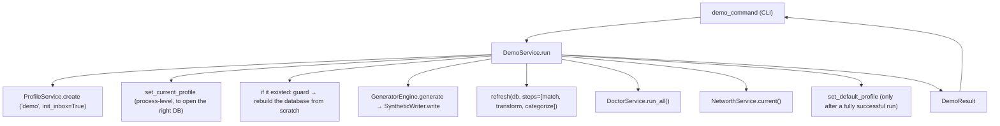

# Feature: Demo Profile Preset (`moneybin demo`)

## Status

implemented

## Address

M3A (Productization & Distribution — evaluator/testing surface; a
first-public-release deliverable per the "quiet distribution" step of
[`roadmap.md`](../roadmap.md)).

## Goal

Give an evaluator a single command — `moneybin demo` — that takes a fresh
install to a populated, categorized, doctor-clean profile and one obvious
first answer, in well under five minutes, without needing any real financial
data. It is the bridge between "installed" and "I see what this does."

Competitors (Treeline, TuskLedger, Finlynq, Syllogic) all let an evaluator see
the product without linking real accounts. `moneybin demo` closes that gap
using machinery MoneyBin already has: the persona-based
[synthetic data generator](testing-synthetic-data.md).

## Background

The pieces already exist; `demo` orchestrates them.

- **Synthetic generation** (`cli/commands/synthetic.py`, `synthetic/`): the
  `synthetic generate --persona {basic,family,freelancer}` command builds
  deterministic data (accounts, transactions, ground-truth labels) for a
  mapped profile (`basic→alice`, `family→bob`, `freelancer→charlie`), inserts
  into `raw.*`, and runs SQLMesh transforms. `synthetic reset` wipes
  synthetic-tagged rows (gated on the `synthetic.ground_truth` table) and
  regenerates. Both target a profile via `set_current_profile` and assume the
  profile + encrypted DB already exist.
- **Profile lifecycle** (`services/profile_service.py`): `ProfileService.create`
  builds the profile dir + `config.yaml` + encrypted DB + optional inbox. It
  does **not** activate the profile.
- **Refresh pipeline** (`services/refresh.py`): `refresh(db)` runs the full
  `match → transform → categorize` cascade. `synthetic generate` runs only the
  `transform` step, so synthetic data is materialized but **not matched or
  categorized** — `demo` needs the full cascade to land a categorized,
  doctor-clean dataset.
- **Doctor** (`services/doctor_service.py`): `DoctorService.run_all()` returns
  a report; `report.failing == 0` is "clean."
- **The answer** (`services/`… net worth): `NetworthService.current()` backs
  `moneybin reports networth` — a single headline number, the strongest
  first-payoff.

What's missing is the orchestration that (1) creates/activates a dedicated,
safe-to-reset profile, (2) runs the *full* pipeline (not just transform), (3)
asserts a clean doctor, and (4) ends on one obvious answer plus a guided
next-step menu.

## Design

### Command surface

A **leaf command** `moneybin demo` (a single setup action with no plausible
siblings — re-running handles the reset case, so no `demo reset` sibling; see
`cli.md` "Leaf Commands vs Sub-Groups"). Operation shape 3 (discrete-verb) per
`surface-design.md`. Function name `demo_command`.

| Flag | Default | Purpose |
|---|---|---|
| `--persona {basic,family,freelancer}` | `basic` | Data shape to load. |
| `--seed` | `DEMO_DEFAULT_SEED` (a fixed constant) | Deterministic data; override for variety. |
| `--years` | persona default | Years of history. |
| `--yes` / `-y` | off | Auto-accept the rebuild confirmation (agent/script parity). |
| `-o` / `--output {text,json}` | `text` | `json` emits the standard response envelope via `render_or_json`. |
| `-q` / `--quiet` | off | Suppress status lines; never the final answer. |

**Isolation by construction — there is no `--profile`.** `demo` always targets
the dedicated `demo` profile (`DEMO_PROFILE`). This is deliberate: an arbitrary
`--profile` target would let `demo` be pointed at a real financial profile, and
defending that required a guard enumerating *every* table that could hold real
data (transactions, balances, accounts, gsheet, PDF, investments, …) — a list
that grows with every new source and is never provably complete. Removing the
arbitrary target removes the attack surface instead of chasing it. A
differently-named synthetic sandbox is what `moneybin synthetic generate` is
for.

The guard itself survives as defense-in-depth — a user can still hand-create a
profile *named* `demo` and put real data in it — and it asks a different question
depending on whether the profile is provably ours. That split is what lets it be
safe without being brittle:

- **Generator-made** (`synthetic.ground_truth` exists) → it's a demo profile, and
  its `app.*` rows are derived from the synthetic raw rows and regenerated by the
  rebuild. Only *real* data mixed in matters, so the check is
  `has_non_synthetic_data`: it enumerates the **closed** set of tables the
  generator writes (`GENERATOR_WRITTEN_TABLES`; `SyntheticWriter` is the only
  producer, so that set is ours to keep exact) and reads the live DuckDB catalog
  for everything else — any `raw.*` table outside that set is real data by
  default.
- **Not generator-made** → someone else's profile that merely happens to be named
  `demo`. Here `has_any_user_content` refuses on *any* row in *any* `app.*` /
  `raw.*` table beyond migration bookkeeping (`app.schema_migrations`,
  `app.versions` — the only tables a fresh profile has rows in).

Both halves enumerate a **closed** set and treat everything else as real. The
original guard did the opposite — it listed the tables that *might* hold real
data — which fails **open**: each newly-added source stays invisible to the guard
until someone remembers to list it. That is exactly how `raw.pdf_seeds`,
`raw.manual_investment_transactions`, and then `app.securities` each slipped past
it in turn. Being over-conservative on the not-ours path costs nothing — it only
ever declines to destroy something — while the happy path (our own demo profile,
re-run) never touches that check, so it cannot false-positive.

The persona still chooses the *data shape* (`basic`/`family`/`freelancer`); it
lands in the `demo` profile rather than the `alice`/`bob`/`charlie` profiles the
test suite uses, so the evaluator sandbox never collides with test fixtures.

**Registration:** `main.py` at the **setup** workflow stage. `demo` is added to
the wizard/dir-check exemption tuple (alongside `profile` and `synthetic`)
because it manages its own profile lifecycle and must not trip the lazy
first-run wizard.

### Architecture — thin CLI over `DemoService`

Per `cli.md` (CLI commands are thin wrappers; complex work lives in tested
business-logic classes), the orchestration is a new
`services/demo_service.py` → `DemoService.run(...) -> DemoResult`. It composes
existing primitives and writes no new data-generation code:

`DemoResult` is a small dataclass carrying `profile`, `persona`, `seed`,
account/transaction counts, the `doctor` outcome (`doctor_failing` count +
`doctor_failing_names`), and the net-worth summary — everything the CLI renders
in both `text` and `json` modes.

**One extraction of existing code:** the reset-deletion allowlist
`_RESET_DELETIONS` and its delete loop lived inside `cli/commands/synthetic.py`.
They move to `synthetic/reset.py` (`RESET_DELETIONS`, `reset_synthetic_rows`,
plus the shared `has_synthetic_ground_truth` / `has_non_synthetic_data`
safety checks) so `synthetic reset` and `DemoService` share one
security-sensitive allowlist rather than duplicating it. `synthetic reset` keeps
its surgical row-deletion behavior (and gains the `has_non_synthetic_data`
guard); **demo does not use it** — demo rebuilds its database instead, for the
reasons below. `RESET_DELETIONS` stays raw/synthetic-only and never touches an
audited `app.*` table.

*Deliberately out of scope:* the larger "extract a full `SyntheticService` and
move `_run_generate` out of the CLI layer" refactor. The
`_run_generate`-in-CLI smell is real but pre-existing; fixing it is a separate
follow-up (filed), not part of this feature. `DemoService` calls the clean
`GeneratorEngine`/`SyntheticWriter` primitives directly.

### Data flow (`DemoService.run`)

1. **Ensure** the `demo` profile exists → `ProfileService.create(DEMO_PROFILE,
   init_inbox=True)`, tolerating `ProfileExistsError`.
2. **Point the process at it** (`set_current_profile`) so we open the right
   database. The *persisted* default switch is deferred to step 7.
3. **If it already existed** → guard, then **rebuild the database from
   scratch** (`_rebuild_database`: delete the DB file, `init_db` a fresh one),
   then `ProfileService.ensure_registered` — `create()` raises
   `ProfileExistsError` off the directory alone, so a bare
   `moneybin db init --profile demo` would otherwise leave the profile without a
   `config.yaml` (hidden from `profile list`) and with no inbox, while the run
   still reported success. Registration is completed only *after* the guard
   clears, so we never scaffold a profile we then refuse.
   - Fails the guard above → **refuse** (`DemoProfileNotOursError`). Rebuilding
     destroys the file, so we only ever do it to a profile we can prove the
     generator made and that holds nothing real.
   - Holds transactions → require `reset_confirmed`, then rebuild.
   - Holds **no transactions** → rebuild unprompted. There is nothing the user
     could lose. This covers both an empty shell and a run that died part-way
     through generating: `SyntheticWriter` creates `synthetic.ground_truth`
     *before* it writes transactions, so a partial run leaves the marker with no
     data behind it. Gating on the marker rather than on the transactions would
     dead-end such a profile — the CLI's `profile_has_data` check sees no
     transactions, so it never prompts, so `reset_confirmed` is never set, so the
     run could never proceed.
4. **Generate** → `GeneratorEngine(persona, seed, years).generate()` →
   `SyntheticWriter(db).write(...)`.
5. **Refresh** → `refresh(db, steps=["match", "transform", "categorize"])`. The
   `gsheet` step is deliberately excluded: demo generated its own raw data and
   must never trigger a live external pull. A failure in *any* step (including
   `matching_error` / `categorization_error`) aborts — demo's premise is a
   clean, categorized pipeline.
6. **Doctor** → `DoctorService(db).run_all()`; **answer** →
   `NetworthService(db).current()`.
7. **Activate** → `set_default_profile(DEMO_PROFILE)`, only after a fully
   successful run, so a refused or failed run never silently switches the
   user's default profile. The displaced profile is returned as
   `DemoResult.previous_default` and the CLI prints both the switch and the way
   back (`moneybin profile switch <previous>`) — repointing every later command
   at `demo` is real, and magic stays visible.

**Why rebuild instead of deleting the generated rows?** Surgically un-writing a
demo run means (a) deleting derived state (`app.match_decisions`,
`app.transaction_categories`) or leaving it orphaned when a new persona/seed
changes the synthetic ids — which fails doctor's FK invariants; and (b) those
`app.*` tables are audited and may only be mutated through their `*Repo`
(Invariant 10), never by raw `DELETE`. A fresh database has neither problem: no
orphans to clean, no `app.*` mutation at all. It is both simpler and more
correct. `reset_synthetic_rows` therefore stays raw/synthetic-only and demo does
not use it.

### Idempotency & reset model

The default seed is a fixed constant, so `moneybin demo` produces a known,
reproducible dataset. Re-running when the demo profile already holds data
**prompts to confirm the rebuild** unless `--yes` is passed — the rebuild
destroys the demo database, so it stays a visible, dismissible confirm
("magic stays visible", `design-principles.md`). Agents and scripts pass
`--yes`.

**Prompt ownership.** The confirmation is a CLI concern; the rebuild is a
service action. The CLI first asks `DemoService.profile_has_data()` (a cheap
read), prompts via `typer.confirm` unless `--yes`, then calls
`DemoService.run(..., reset_confirmed=<bool>)`. `run` rebuilds only when
`reset_confirmed` is true and never prompts. If data exists and the rebuild
isn't confirmed, the command aborts before any destructive action.

**Guard scope.** Because there is no arbitrary `--profile` target, the only
profile demo can destroy is one literally named `demo`. The guard therefore
does not attempt to enumerate every table that could hold real data; it refuses
anything it cannot positively attribute to the generator (no
`synthetic.ground_truth` marker) or that trips `has_non_synthetic_data()`. That
is a deliberate scope choice: enumeration can never be proven complete, and
removing the arbitrary target removed the need for it.

### The closing answer

On success the CLI prints:

1. The **net-worth headline** (from `DemoResult`) and a one-line doctor status
   (`✅ system doctor clean`).
2. A short **next-steps menu** — a few CLI commands (`moneybin reports
   spending`, `reports cashflow`, `review`) and a few example MCP prompts
   (e.g. *"What did I spend on dining last month?"*, *"Show my net-worth
   trend."*).

The numbers come from the service; the menu and example prompts are static
presentation in the CLI layer. `--output json` routes the `DemoResult` through
the project's standard `render_or_json(build_envelope(...), cli_actor="demo")`
path — same `{status, summary, data, actions}` envelope every other JSON-emitting
command returns, and the same `privacy.log.jsonl` audit entry — and omits the
prose menu.

### Error handling

- `handle_cli_errors()` plus a `DatabaseKeyError` catch (with the
  `moneybin db unlock` hint), per `cli.md`.
- A **non-clean doctor is a non-zero exit** with the failing invariants
  surfaced. A demo that boots dirty is a real signal, not a warning to swallow.
- Refresh / SQLMesh hard-failures propagate (unlike `synthetic generate`, which
  treats transform failure as non-fatal — `demo` requires a clean pipeline).

### Observability

A new `DEMO_RUN_TOTAL` counter labeled by `persona`, in
`metrics/registry.py`, mirroring the existing `SYNTHETIC_RESET_TOTAL`.

## Batched fix (ships in the same PR, standalone bugfix — no spec of its own)

First-run onboarding guidance is misleading for one path: when a profile
directory exists **without** a `config.yaml` (e.g. a manual delete/recreate),
`moneybin db init` creates a working encrypted DB but leaves the profile
**unregistered** — absent from `moneybin profile list`, no inbox scaffolding.
The "Database not found" guidance (`errors.py`, `database.py`,
`cli/commands/db.py`) always points at `db init`, even when the correct
canonical setup is `moneybin profile create <name> --init-inbox`.

**Fix (honest guidance, not a semantics change):** where the guidance is
generated, detect whether the active profile is *registered* (has a
`config.yaml`). Unregistered → point at `profile create <name> --init-inbox`;
registered-but-DB-missing → keep the `db init` guidance. `db init`'s behavior
is unchanged. `moneybin demo` itself uses `ProfileService.create`, so it does
not hit this bug — this is an independent first-run-surface correctness fix,
kept in its own commit.

## Testing

TDD, tests at every applicable layer (`testing.md` coverage-by-layer):

- **`DemoService` unit** (fast `db` fixture): ensure-profile branch (create vs
  already-exists), reset-on-rerun path, that the full refresh yields
  *categorized* rows (not just transformed), doctor-clean assertion,
  `DemoResult` shape, and the non-synthetic-data refusal guard.
- **CLI e2e** (subprocess): `moneybin demo --yes --seed <fixed>` → exit 0,
  profile created + activated, deterministic account/transaction counts,
  `--output json` shape, `-q` suppresses status but not the final answer.
- **Batched fix unit:** both guidance branches (registered → `db init`;
  unregistered → `profile create`).
- **Cold-start:** `-X importtime` confirms no heavy import (`sqlmesh`,
  `polars`, `fastmcp`) leaks into `moneybin.cli.main` via the new module.

## Out of scope

- A public demo video / hosted demo (stays deferred; this is local/private).
- The first-run **wizard** (a separate M3A deliverable).
- Multi-persona-in-one-profile datasets (personas are distinct people; one
  persona per demo profile).
- Extracting a full `SyntheticService` (separate follow-up).

## Shipping checklist (on `implemented`)

Per `.claude/rules/shipping.md`: flip status here + in `INDEX.md`; `roadmap.md`
M3A row note; `CHANGELOG.md` **Added**; `docs/features.md` entry; the
`moneybin demo` reference already anticipated in `user-facing-doc-polish.md`.
