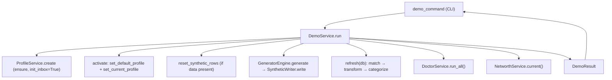

# Feature: Demo Profile Preset (`moneybin demo`)

## Status

implemented

## Address

M3A (Productization & Distribution — evaluator/testing surface; a
first-public-release deliverable per the "quiet distribution" step of
[`roadmap.md`](../roadmap.md)).

## Goal

Give an evaluator a single command — `moneybin demo` — that takes a fresh
install to a populated, categorized, doctor-clean profile and one obvious
first answer, in well under five minutes, without needing any real financial
data. It is the bridge between "installed" and "I see what this does."

Competitors (Treeline, TuskLedger, Finlynq, Syllogic) all let an evaluator see
the product without linking real accounts. `moneybin demo` closes that gap
using machinery MoneyBin already has: the persona-based
[synthetic data generator](testing-synthetic-data.md).

## Background

The pieces already exist; `demo` orchestrates them.

- **Synthetic generation** (`cli/commands/synthetic.py`, `synthetic/`): the
  `synthetic generate --persona {basic,family,freelancer}` command builds
  deterministic data (accounts, transactions, ground-truth labels) for a
  mapped profile (`basic→alice`, `family→bob`, `freelancer→charlie`), inserts
  into `raw.*`, and runs SQLMesh transforms. `synthetic reset` wipes
  synthetic-tagged rows (gated on the `synthetic.ground_truth` table) and
  regenerates. Both target a profile via `set_current_profile` and assume the
  profile + encrypted DB already exist.
- **Profile lifecycle** (`services/profile_service.py`): `ProfileService.create`
  builds the profile dir + `config.yaml` + encrypted DB + optional inbox. It
  does **not** activate the profile.
- **Refresh pipeline** (`services/refresh.py`): `refresh(db)` runs the full
  `match → transform → categorize` cascade. `synthetic generate` runs only the
  `transform` step, so synthetic data is materialized but **not matched or
  categorized** — `demo` needs the full cascade to land a categorized,
  doctor-clean dataset.
- **Doctor** (`services/doctor_service.py`): `DoctorService.run_all()` returns
  a report; `report.failing == 0` is "clean."
- **The answer** (`services/`… net worth): `NetworthService.current()` backs
  `moneybin reports networth` — a single headline number, the strongest
  first-payoff.

What's missing is the orchestration that (1) creates/activates a dedicated,
safe-to-reset profile, (2) runs the *full* pipeline (not just transform), (3)
asserts a clean doctor, and (4) ends on one obvious answer plus a guided
next-step menu.

## Design

### Command surface

A **leaf command** `moneybin demo` (a single setup action with no plausible
siblings — re-running handles the reset case, so no `demo reset` sibling; see
`cli.md` "Leaf Commands vs Sub-Groups"). Operation shape 3 (discrete-verb) per
`surface-design.md`. Function name `demo_command`.

| Flag | Default | Purpose |
|---|---|---|
| `--persona {basic,family,freelancer}` | `basic` | Data shape to load. |
| `--profile` | `demo` | Target profile name. |
| `--seed` | `DEMO_DEFAULT_SEED` (a fixed constant) | Deterministic data; override for variety. |
| `--years` | persona default | Years of history. |
| `--yes` / `-y` | off | Auto-accept the reset confirmation (agent/script parity). |
| `-o` / `--output {text,json}` | `text` | `json` returns the structured `DemoResult` for agents/scripts. |
| `-q` / `--quiet` | off | Suppress status lines; never the final answer. |

**Persona and profile are orthogonal.** The persona chooses the *data shape*;
the profile is *where it lands*. `demo` passes an explicit `profile="demo"` so
the persona → profile default map in `synthetic` is bypassed — an evaluator
ends up with a clearly-named `demo` profile, not a mystery `bob`, and the demo
sandbox never collides with the `alice`/`bob`/`charlie` profiles the test suite
uses.

**Registration:** `main.py` at the **setup** workflow stage. `demo` is added to
the wizard/dir-check exemption tuple (alongside `profile` and `synthetic`)
because it manages its own profile lifecycle and must not trip the lazy
first-run wizard.

### Architecture — thin CLI over `DemoService`

Per `cli.md` (CLI commands are thin wrappers; complex work lives in tested
business-logic classes), the orchestration is a new
`services/demo_service.py` → `DemoService.run(...) -> DemoResult`. It composes
existing primitives and writes no new data-generation code:

`DemoResult` is a small dataclass carrying `profile`, `persona`, `seed`,
account/transaction counts, the `doctor` outcome (`doctor_failing` count +
`doctor_failing_names`), and the net-worth summary — everything the CLI renders
in both `text` and `json` modes.

**One extraction of existing code** (the only change to existing modules): the
reset-deletion allowlist `_RESET_DELETIONS` and its delete loop currently live
inside `cli/commands/synthetic.py`. They move to the `synthetic/` package
(e.g. `synthetic/reset.py::reset_synthetic_rows(db)`) so both `synthetic reset`
and `DemoService` share the one security-sensitive allowlist rather than
duplicating it. The `synthetic reset` command is rewired to call the shared
helper; its behavior is unchanged.

*Deliberately out of scope:* the larger "extract a full `SyntheticService` and
move `_run_generate` out of the CLI layer" refactor. The
`_run_generate`-in-CLI smell is real but pre-existing; fixing it is a separate
follow-up (filed), not part of this feature. `DemoService` calls the clean
`GeneratorEngine`/`SyntheticWriter` primitives directly.

### Data flow (`DemoService.run`)

1. **Ensure** the target profile exists → `ProfileService.create(profile,
   init_inbox=True)`, tolerating `ProfileExistsError`.
2. **Activate** it (`set_default_profile` + `set_current_profile`) so the next
   `moneybin` command uses it with no extra step.
3. **Open** the DB. Inspect for existing data:
   - Synthetic data present (`synthetic.ground_truth` exists) → **reset** the
     synthetic rows (after the CLI's confirmation gate).
   - Non-synthetic data present → **refuse** (guard; mirrors `synthetic reset`).
     A `demo` profile should only ever hold synthetic data.
   - Empty → proceed.
4. **Generate** → `GeneratorEngine(persona, seed, years).generate()` →
   `SyntheticWriter(db).write(...)`.
5. **Full refresh** → `refresh(db)` (match → transform → categorize).
6. **Doctor** → `DoctorService(db).run_all()`.
7. **Answer** → `NetworthService(db).current()`.

### Idempotency & reset model

The default seed is a fixed constant, so `moneybin demo` produces a known,
reproducible dataset. Re-running when the demo profile already holds data
**prompts to confirm the reset** unless `--yes` is passed — the same UX as
`synthetic reset`, honoring "magic stays visible" (`design-principles.md`)
even though wiping synthetic demo data is self-evidently safe. Agents and
scripts pass `--yes`.

**Prompt ownership.** The confirmation is a CLI concern; the reset is a service
action. The CLI first asks `DemoService` whether the target profile already
holds data (a cheap read), prompts via `typer.confirm` unless `--yes`, then
calls `DemoService.run(..., reset_confirmed=<bool>)`. `run` performs the reset
only when `reset_confirmed` is true and never prompts. If data exists and the
reset isn't confirmed, the command aborts before any destructive action.

### The closing answer

On success the CLI prints:

1. The **net-worth headline** (from `DemoResult`) and a one-line doctor status
   (`✅ system doctor clean`).
2. A short **next-steps menu** — a few CLI commands (`moneybin reports
   spending`, `reports cashflow`, `review`) and a few example MCP prompts
   (e.g. *"What did I spend on dining last month?"*, *"Show my net-worth
   trend."*).

The numbers come from the service; the menu and example prompts are static
presentation in the CLI layer. `--output json` emits the structured
`DemoResult` and omits the prose menu.

### Error handling

- `handle_cli_errors()` plus a `DatabaseKeyError` catch (with the
  `moneybin db unlock` hint), per `cli.md`.
- A **non-clean doctor is a non-zero exit** with the failing invariants
  surfaced. A demo that boots dirty is a real signal, not a warning to swallow.
- Refresh / SQLMesh hard-failures propagate (unlike `synthetic generate`, which
  treats transform failure as non-fatal — `demo` requires a clean pipeline).

### Observability

A new `DEMO_RUN_TOTAL` counter labeled by `persona`, in
`metrics/registry.py`, mirroring the existing `SYNTHETIC_RESET_TOTAL`.

## Batched fix (ships in the same PR, standalone bugfix — no spec of its own)

First-run onboarding guidance is misleading for one path: when a profile
directory exists **without** a `config.yaml` (e.g. a manual delete/recreate),
`moneybin db init` creates a working encrypted DB but leaves the profile
**unregistered** — absent from `moneybin profile list`, no inbox scaffolding.
The "Database not found" guidance (`errors.py`, `database.py`,
`cli/commands/db.py`) always points at `db init`, even when the correct
canonical setup is `moneybin profile create <name> --init-inbox`.

**Fix (honest guidance, not a semantics change):** where the guidance is
generated, detect whether the active profile is *registered* (has a
`config.yaml`). Unregistered → point at `profile create <name> --init-inbox`;
registered-but-DB-missing → keep the `db init` guidance. `db init`'s behavior
is unchanged. `moneybin demo` itself uses `ProfileService.create`, so it does
not hit this bug — this is an independent first-run-surface correctness fix,
kept in its own commit.

## Testing

TDD, tests at every applicable layer (`testing.md` coverage-by-layer):

- **`DemoService` unit** (fast `db` fixture): ensure-profile branch (create vs
  already-exists), reset-on-rerun path, that the full refresh yields
  *categorized* rows (not just transformed), doctor-clean assertion,
  `DemoResult` shape, and the non-synthetic-data refusal guard.
- **CLI e2e** (subprocess): `moneybin demo --yes --seed <fixed>` → exit 0,
  profile created + activated, deterministic account/transaction counts,
  `--output json` shape, `-q` suppresses status but not the final answer.
- **Batched fix unit:** both guidance branches (registered → `db init`;
  unregistered → `profile create`).
- **Cold-start:** `-X importtime` confirms no heavy import (`sqlmesh`,
  `polars`, `fastmcp`) leaks into `moneybin.cli.main` via the new module.

## Out of scope

- A public demo video / hosted demo (stays deferred; this is local/private).
- The first-run **wizard** (a separate M3A deliverable).
- Multi-persona-in-one-profile datasets (personas are distinct people; one
  persona per demo profile).
- Extracting a full `SyntheticService` (separate follow-up).

## Shipping checklist (on `implemented`)

Per `.claude/rules/shipping.md`: flip status here + in `INDEX.md`; `roadmap.md`
M3A row note; `CHANGELOG.md` **Added**; `docs/features.md` entry; the
`moneybin demo` reference already anticipated in `user-facing-doc-polish.md`.
