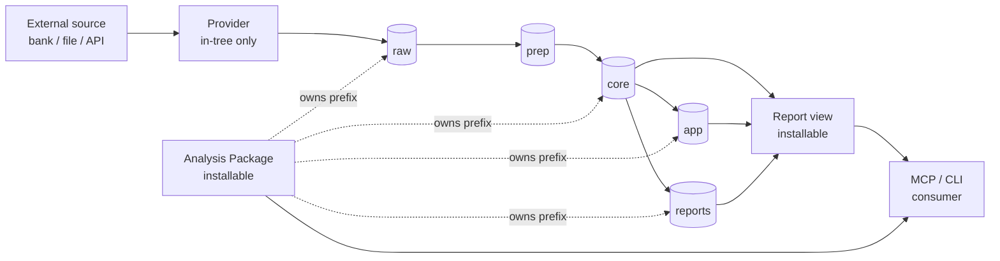

# Extension Contracts

## Status

- **Type:** Architecture
- **Status:** in-progress
- **Authority:** Defines the contributor-facing surface for the three extension types — **Reports**, **Analysis Packages**, and **Providers**. The contract every future MoneyBin extension lands as. The framework is M1Q and locks at the M1→M2 boundary; reference packages are M2M; contributor UX is M3I.

## Goal

MoneyBin's strategic frame is that the largest competitor isn't other PFM apps — it's the cohort of technically inclined users rolling their own finance system on DuckDB/dbt/Plaid/Streamlit. The hypothesis: be the platform those users converge on instead of starting from scratch, with a contributor-facing surface designed with the same rigor as the MCP and CLI surfaces.

This spec defines that contributor-facing surface: three extension types, their trust postures, their registration mechanisms, their quality progression, and the guided-contribution skills shipped alongside. Together they answer: *how does someone who wants to extend MoneyBin do so, cleanly and predictably?*

This spec is not a feature spec. It defines contracts that future feature specs cite. The pre-launch surgical work it implies — provider `Protocol` definition, package framework implementation, scaffolder templates, validator CLI — is enumerated in [§Pre-launch surgical work](#pre-launch-surgical-work) and tracked separately as implementation plans.

This is intentionally narrower than a general plugin SDK. The 1.0 contract is
for warehouse-coherent extensions — Reports, Analysis Packages, and Providers —
not arbitrary UI plugins. MoneyBin optimizes for coherent data contracts,
capability declarations, and Quality Scale evidence before plugin count. UI
component slots can arrive later as typed extensions of reports/packages once the
Web UI and hosted runtime are mature.

## Background

Extensibility is a durable differentiator for MoneyBin, but the codebase is unevenly prepared for it: reports already follow a uniform recipe across five files; providers improvise across three different shapes; analysis packages don't exist as a concept. The contributor-facing surface — what a third-party would actually interact with — has no spec, no validator, no scaffolder, and no quality bar.

This spec closes that gap pre-launch. The contracts described here are designed for both in-tree authors (MoneyBin Core developers) and future external contributors (community PRs against the main line, eventually third-party packages on PyPI). Pluggability is durable per [`design-principles.md`](../../.claude/rules/design-principles.md) — the contract supports both scenarios from launch without breaking changes when third-party install becomes real.

### Related specs

- [`architecture-shared-primitives.md`](architecture-shared-primitives.md) — schema layer conventions, primitives every extension depends on
- [`mcp-architecture.md`](mcp-architecture.md) — MCP tool taxonomy, response envelopes, sensitivity tiers (cited; not duplicated)
- [`moneybin-mcp.md`](moneybin-mcp.md) — concrete tool enumeration
- [`moneybin-cli.md`](moneybin-cli.md) — CLI subgroup conventions
- [`reports-recipe-library.md`](reports-recipe-library.md) — existing in-tree reports inventory
- [`testing-scenario-runner.md`](testing-scenario-runner.md) — scenario test infrastructure (Platinum tier requirement)
- [`observability.md`](observability.md) — metrics emit conventions
- [`privacy-data-classification.md`](privacy-data-classification.md) — sensitivity tier classification

### Related rules

- [`.claude/rules/surface-design.md`](../../.claude/rules/surface-design.md) — operation shapes, verb vocabulary; extensions inherit
- [`.claude/rules/design-principles.md`](../../.claude/rules/design-principles.md) — durable path selection; pluggability decision invokes this protocol
- [`.claude/rules/mcp.md`](../../.claude/rules/mcp.md) — surface change discipline; extensions register only when their backing spec reaches `in-progress`/`implemented`
- [`.claude/rules/identifiers.md`](../../.claude/rules/identifiers.md) — ID hygiene; extensions follow

## Architecture: three extension types

MoneyBin's contributor-facing surface is three extension types, distinguished by trust posture and data-flow position:

| Type | Reads from | Writes to | Trust posture | Distribution path |
|---|---|---|---|---|
| **Report** | `core`, `app`, `reports` | Nothing (read-only SQL view) | Open ecosystem | Marketplace eventually; in-tree at launch |
| **Analysis Package** | `core`, `app`, `reports`; own prefix in `raw`/`prep` | `core.<pkg>_*`, `app.<pkg>_*`, `reports.<pkg>_*`, `raw.<pkg>_*` (capability-declared) | Open ecosystem with constraints | Marketplace eventually; in-tree at launch |
| **Provider** | External APIs / files + `SecretStore` for credentials | `raw.<source>_*` | **In-tree only.** AI-drafted PRs welcome; merge gated by maintainers; signed releases. | Always main line. No marketplace. |



### Core vs Package distinction

Existing MoneyBin domain logic — categorization, budget, merchants, accounts, sync, refresh, investments (M1J), multi-currency (M1K) — is **built-in MoneyBin functionality**, not an analysis package. It lives in the existing layered structure (`extractors/`, `services/`, `mcp/`, `cli/`) and the analysis-package contract does not retroactively apply.

New modular domains contributed as installable units (`assets`, `us_tax`, future `crypto`, `canadian_tax`, `retirement`, etc.) follow the analysis-package contract.

**The decision rule for whether a future domain is core or package:** *"If a user without this feature would say MoneyBin doesn't deliver on its promise, it's core. If they'd say MoneyBin works fine without it, it's a package."* Investments → core (foundational). Tax computations → package (locale-specific). Crypto → package (optional). Real-estate-deep-dive → package (supplementary). The choice is about commitment level, not depth — packages can be just as deep as core; they're isolated for modularity, not relegated.

### 1.0 launch lineup

The reference packages shipping at M2M:

- **`assets`** — user-entered domain data (real estate, vehicles, collectibles). Validates the "new entity types, user-entered" package shape.
- **`us_tax`** — locale-specific tax computations layered on investments core (Schedule D, wash-sale checks, estimated payments). Validates the "deep analytical layer over core" shape. Seeds the follow-on community-contribution story (`canadian_tax`, `uk_tax`, etc.).

Both ship at Platinum quality (see [§Quality Scale](#quality-scale)). Cost basis tracking is part of core investments, not its own package.

Arbitrary UI plugins are out of scope for the 1.0 launch lineup. The package
contract may later gain typed UI or MCP App component slots for reports/packages,
but it should not become a playground for unbounded client-side UI code before
the core Web UI contract is stable.

## Analysis Package contract

### File layout

A package mirrors MoneyBin's layered architecture, scoped to its own prefix. The canonical layout:

```
src/moneybin/packages/<pkg>/
├── moneybin_package.yaml        # manifest
├── __init__.py                  # exports register() — invoked at framework startup
├── models/                      # SQLMesh model files
│   ├── core/                    # canonical dim/fct contributions
│   ├── prep/                    # staging models (if package ingests raw)
│   └── reports/                 # presentation views
├── schema/                      # DDL for raw + app tables
│   ├── raw_<pkg>_*.sql
│   └── app_<pkg>_*.sql
├── services/                    # Python service layer
├── tools/                       # MCP + CLI tool registrations
│   ├── __init__.py              # register(mcp, cli) entry point
│   └── <tool_name>.py
├── tests/
│   ├── fixtures/                # YAML per project convention
│   ├── test_service.py
│   └── test_tools.py
└── README.md                    # contributor-facing docs
```

SQLMesh is configured to scan both `src/moneybin/sqlmesh/models/` (core) and `src/moneybin/packages/*/models/` (packages). Each package's models live with the package; the unified `sqlmesh ls` / `sqlmesh plan` tooling shows them together. The split is documented in `src/moneybin/sqlmesh/README.md`.

### Manifest schema

The `moneybin_package.yaml` manifest declares what the package is, what it does, and what tier of quality it claims. Example (`assets`):

```yaml
name: assets
display_name: Assets Tracker
version: 1.0.0
quality_scale: platinum
owns_prefix: assets              # tables and tools must be prefixed assets_

publisher:
  name: MoneyBin Core
  url: https://moneybin.app
  verified: true                 # automatic for in-tree

description: |
  Tracks owned physical assets like real estate, vehicles, art, jewelry.
  Supports user-entered valuations, optional API-driven value lookups,
  and depreciation calculations.

capabilities:
  writes:
    - core.assets_*              # canonical entities
    - prep.stg_assets__*         # staging
    - app.assets_*               # user state
    - reports.assets_*           # derived views
    - raw.assets_*               # raw imports
  reads:
    - core.dim_currencies        # FX lookups
    - core.fct_transactions      # discovering bank-side asset-purchase events
  network: []                    # no outbound HTTP
  secrets: []                    # no SecretStore keys

requires:
  moneybin: ">=1.0.0,<2.0.0"

entry_points:
  tools:  "moneybin.packages.assets.tools:register"
  cli:    "moneybin.packages.assets.cli:register"
  models: "moneybin.packages.assets.models"        # Python module path (resolved to filesystem at startup via importlib.resources)
  schema: "moneybin.packages.assets.schema"        # Python module path (resolved to filesystem at startup via importlib.resources)
```

For `us_tax`, the manifest emphasizes read-heavy capabilities (analytical layer, no new canonical entities):

```yaml
name: us_tax
display_name: US Tax
version: 1.0.0
quality_scale: platinum
owns_prefix: us_tax
publisher: { name: MoneyBin Core, ..., verified: true }
description: |
  US-specific tax computations: Schedule D capital-gains preview,
  wash-sale detection, estimated quarterly payments, qualified dividends.
capabilities:
  writes:
    - app.us_tax_*               # filing-status config (wash-sale state lands when the us_tax child spec designs it)
    - reports.us_tax_*           # Schedule D, wash-sale flags
  reads:
    - core.dim_holdings
    - core.fct_investment_transactions
    - core.fct_realized_gains    # Schedule D inputs (realized gain/loss per lot)
    - app.lot_selections         # core lot-selection overrides (cost basis is core, not this package)
    - core.fct_transactions      # deductible-categorization data
    - core.dim_currencies
  network: []
  secrets: []
requires:
  moneybin: ">=1.0.0,<2.0.0"
entry_points:
  tools:  "moneybin.packages.us_tax.tools:register"
  cli:    "moneybin.packages.us_tax.cli:register"
  models: "moneybin.packages.us_tax.models"        # Python module path (resolved to filesystem at startup via importlib.resources)
  schema: "moneybin.packages.us_tax.schema"        # Python module path (resolved to filesystem at startup via importlib.resources)
```

The capability declarations are the package's contract with users — readable in `moneybin packages info <name>` before install. Users (or agents acting for them) decide trust based on declared behavior.

### Registration via entry points

Packages register via Python setuptools entry points — the standard plug-in discovery mechanism, conceptually identical to `package.json` (JS), `Cargo.toml` (Rust), `manifest.json` (VS Code) in their respective ecosystems.

In-tree packages declare themselves in MoneyBin's root `pyproject.toml`:

```toml
[project.entry-points."moneybin.packages"]
assets = "moneybin.packages.assets"
us_tax = "moneybin.packages.us_tax"
```

Future third-party packages on PyPI declare themselves the same way in their own `pyproject.toml`:

```toml
[project.entry-points."moneybin.packages"]
canadian_tax = "moneybin_canadian_tax"
```

At framework startup, MoneyBin:

1. Enumerates all `moneybin.packages` entry points (in-tree + pip-installed).
2. Reads each package's `moneybin_package.yaml` manifest **from distribution metadata, without importing the package**.
3. Validates capabilities against framework rules (see [§Capability declarations](#capability-declarations)).
4. Validates the declared `quality_scale` tier against actual evidence in the package.
5. Calls the package's `tools.register(mcp)` and `cli.register(app)` to wire up tools — the **first point any package Python is imported**.
6. Adds the package's `models/` and `schema/` paths to SQLMesh and the schema initializer.

Discovery is uniform: a third-party package looks identical to in-tree from the framework's perspective.

**Validate before import.** Discovery resolves the manifest from `importlib.metadata` file records rather than `EntryPoint.load()`, so an installed-but-malformed package cannot run import-time side effects before the capability/prefix/quality gate vets it. Package code executes only at step 5, after validation passes. (Some PEP 660 editable installs omit data files from the dist record and are skipped by metadata-only discovery; in-tree reference packages ship inside the MoneyBin wheel and are unaffected.)

### Naming and prefix discipline

The package name is load-bearing — it's the prefix everything inherits. Coherence rule per [`design-principles.md`](../../.claude/rules/design-principles.md): violations fail registration.

| Surface | Convention | Example (`assets`) | Example (`us_tax`) |
|---|---|---|---|
| Package name | `snake_case`, matches Python module name | `assets` | `us_tax` |
| Schema tables | `<schema>.<pkg>_<entity>` | `core.assets_properties` | `app.us_tax_filing_config` |
| Stg models | `prep.stg_<pkg>__<entity>` | `prep.stg_assets__valuations` | (none) |
| MCP tools | `<pkg>_<verb>` per [`surface-design.md`](../../.claude/rules/surface-design.md) | `assets_holdings`, `assets_set` | `us_tax_schedule_d` |
| CLI subgroup | `moneybin <pkg> <cmd>` (kebab in CLI, snake in Python) | `moneybin assets holdings` | `moneybin us-tax schedule-d` |
| Schema files | `raw_<pkg>_<entity>.sql`, `app_<pkg>_<entity>.sql` | `raw_assets_imports.sql` | `app_us_tax_filing_config.sql` |

The framework validates at registration:

- Every SQL file in `<pkg>/schema/` matches `(raw|app)_<pkg>_*.sql`.
- Every `CREATE TABLE` / `CREATE VIEW` in those files writes to a schema matching the package's declared prefix.
- Every MCP tool registered by the package has a name starting with `<pkg>_`.
- Every CLI command registered lives under the `<pkg>` subgroup.

A package that violates any of these refuses to register with a precise error.

### Capability declarations

The manifest declares four capability axes. Framework enforcement levels differ between launch and post-launch hardening:

| Axis | What it declares | Launch enforcement | Post-launch hardening |
|---|---|---|---|
| **writes** | Glob patterns of tables the package writes | Validated at registration: every `CREATE` statement matches a declared pattern; package fails to register otherwise | Same — strong from day one |
| **reads** | Patterns of tables the package reads | Documentation only; surfaced in `moneybin packages info <name>` | Runtime-enforced via DuckDB views with limited grants |
| **network** | Hostnames the package may HTTP to | Documentation only | Runtime-enforced via outbound proxy / DNS allowlist |
| **secrets** | `SecretStore` keys the package needs | Validated at first access: `SecretStore` accessor refuses keys outside the declaration | Same — strong from day one |

The **writes** axis is the load-bearing capability — pre-launch and post-launch, a package physically cannot write to a table outside its declared prefix because registration refuses to start if SQL violates the declaration.

The **reads**, **network**, and **secrets** declarations being present at v1 — even when not fully runtime-enforced — matters because they document the package's contract for users and provide the schema the framework will enforce against later without breaking changes.

### Cross-package interaction

Packages reading from other packages' tables (e.g., `us_tax` reading `core.fct_investment_transactions` which is core, not a package) is the common case and unrestricted by capability declarations on the reading side. The reading package declares the source in its `reads` capability; that's it.

Packages writing to another package's prefix is not permitted — the writes-capability validation prevents it at registration. Cross-package data flow is read-only from one direction.

## Report contract

### What a Report is

A Report is a single decorated **Python runner** over a `reports.*` view. The runner is the report's whole definition — it validates parameters, resolves free-text inputs to ids, and builds a parameterized read-only `SELECT`, returning a `ReportQuery`. The framework introspects the runner's signature and Google-style docstring into a `ReportSpec` and auto-generates the registration trinity (MCP tool, CLI command, `TableRef` wiring) from that one definition.

```python
@report(name="cashflow", view=REPORTS_CASH_FLOW)
def cash_flow(db, *, from_month=None, to_month=None, by="account-and-category") -> ReportQuery:
    """Google-style docstring: summary + Args + Examples."""
    ...validate params, resolve free-text→id, build SQL...
    return ReportQuery(sql, params, actions=[...], period=...)
```

A Report has no separate service class, no schema writes beyond its own view, no external API calls, no secrets. Read-only by construction — the runner *is* the report's service layer.

There is no SQL-comment grammar and no central `ReportsService`: the runner owns parameter validation, free-text→id resolution, and SQL construction directly.

### Two scenarios

A report always pairs a `reports.*` view (its SQL definition) with a `@report` runner (its parameter/SQL surface). The two scenarios differ only in who owns the view and where the runner lives.

**Scenario A — Embedded report (inside an analysis package):** The package contributes the view under its prefix and a runner module that decorates it:

```
src/moneybin/packages/assets/
├── models/reports/assets_summary.sql   → reports.assets_summary view
└── reports/assets_summary.py           → @report(name="assets_summary", view=REPORTS_ASSETS_SUMMARY)
```

The package's `register()` calls `discover_reports(<reports module>)` and feeds the runners to the same `register_reports` path core uses — no separate manifest. The report inherits the package's prefix and Quality Scale.

**Scenario B — Standalone report extension:** A contributor adds a single report — either in-tree (PR against MoneyBin Core) or as an installable PyPI package (`moneybin-report-<name>`). The view ships as a SQLMesh model; the runner is a `@report`-decorated module.

Minimal manifest for the standalone case:

```yaml
name: report_seasonal_spending
type: report                              # tells the framework this is a Report, not a full Package
display_name: Seasonal Spending Report
version: 1.0.0
quality_scale: bronze

publisher: { name: Community Contributor, verified: false }

description: |
  Breaks down spending by season (winter/spring/summer/fall) and year.

capabilities:
  reads:
    - core.fct_transactions
    - core.dim_categories
  writes:
    - reports.seasonal_spending           # exactly one view, must match name
  network: []
  secrets: []
```

The `type: report` flag changes framework validation: a Report extension contributes exactly one view in `reports.*` plus its `@report` runner, may NOT include other `services/`, `models/{raw,core,app,prep}/`, or `schema/` subdirectories, and gets its MCP tool name auto-derived (`reports_<name>` for standalone). The runner's `view=` must resolve to that one `reports.*` view.

### Naming conventions

| Position | Prefix pattern | Example |
|---|---|---|
| Core cross-entity reports | `reports_<name>` | `reports_networth`, `reports_spending` |
| Core single-entity reads | `<entity>_<noun>` | `accounts_summary`, `transactions_review` |
| Package reports (read on package's own data) | `<pkg>_<name>` | `assets_summary`, `us_tax_schedule_d` |
| Standalone report extensions | `reports_<name>` | `reports_seasonal_spending` |

The `reports_*` prefix belongs to core's cross-entity space and to standalone contributions. Packages use their own prefix per [Shape 5 of `surface-design.md`](../../.claude/rules/surface-design.md) (entity-prefix for reads).

### Auto-generation of the registration trinity

A report contributor writes one `@report`-decorated runner. The framework introspects the runner's **signature** (parameter names, resolved types, defaults) and its **Google-style docstring** (summary, `Args:`, `Examples:`) into a `ReportSpec`, then generates the MCP tool, CLI command, and `TableRef` wiring from that single definition.

Worked example — the shipped `cashflow` runner (`src/moneybin/reports/definitions/cash_flow.py`):

```python
@report(
    name="cashflow",
    view=REPORTS_CASH_FLOW,
    classes={  # declared output-column privacy contract (ADR-013)
        "year_month": DataClass.TXN_DATE,
        "account_id": DataClass.ACCOUNT_IDENTIFIER,
        "account_name": DataClass.USER_NOTE,
        "category": DataClass.CATEGORY,
        "inflow": DataClass.TXN_AMOUNT,
        "outflow": DataClass.TXN_AMOUNT,
        "net": DataClass.TXN_AMOUNT,
        "txn_count": DataClass.AGGREGATE,
    },
)
def cash_flow(
    db: Database,
    *,
    from_month: str | None = None,
    to_month: str | None = None,
    by: str = "account-and-category",
) -> ReportQuery:
    """Monthly cash flow rollup: inflow/outflow/net per account x category.

    Defaults to the last 12 calendar months when both bounds are omitted.
    Amounts use the accounting convention (negative = expense, positive =
    income) in the currency named by summary.display_currency.

    Args:
        db: Open read-only database connection.
        from_month: Lower bound (inclusive) as 'YYYY-MM'.
        to_month: Upper bound (inclusive) as 'YYYY-MM'.
        by: account | category | account-and-category — how to group.

    Examples:
        reports_cashflow(by="category", from_month="2024-01")
        reports_cashflow(by="account")
    """
    if by not in CASHFLOW_GROUPINGS:
        raise ValueError(f"Unknown by: {by}")
    ...  # build parameterized SELECT
    return ReportQuery(sql, params, actions=[...], period=period)
```

How the parts map (introspection rules, `src/moneybin/reports/_framework/introspect.py`):

- The first parameter must be named `db`; every other parameter must be keyword-only (declared after a bare `*`). That shape is what lets each param map 1:1 onto an MCP-tool argument and a Typer `--flag`.
- The **docstring summary** becomes the tool/command description; each **`Args:`** entry becomes that parameter's help string; each **`Examples:`** line is captured on `ReportSpec.examples` as a usage hint. (Runtime next-step hints in the response envelope come from the runner's own `ReportQuery.actions`, which the runner sets per call — distinct from the static docstring examples.)
- Each parameter's resolved type and default flow into both surfaces. The runner raises `ValueError` for invalid enum values; the CLI registrar converts that to a clean `typer.BadParameter` exit.

From the `ReportSpec`, the framework generates:

- **`TableRef` wiring** — the runner declares `view=REPORTS_CASH_FLOW` (a `TableRef` constant); the spec carries it for execution and schema lineage.
- **MCP tool** — `reports_cashflow(from_month: str | None = None, to_month: str | None = None, by: str = "account-and-category") -> ResponseEnvelope` (`src/moneybin/reports/_framework/mcp_register.py`). The tool name is `reports_<name>`.
- **CLI command** — `moneybin reports cashflow [--from-month ...] [--to-month ...] [--by ...]` (`src/moneybin/reports/_framework/cli_register.py`). The command name is `<name>` with underscores rendered as hyphens.

At call time the framework executes the runner's `ReportQuery`, classifies each output column from the report's **declared `classes` map** (`src/moneybin/reports/_framework/classify.py`; an undeclared column fails closed), masks CRITICAL columns through the shared `redact_records` path — the **same redaction bottleneck `sql_query` uses** — and builds the standard response envelope (`src/moneybin/reports/_framework/execute.py`). Both surfaces build identical envelopes via the shared `ReportResult`.

Report column classification is **declared, not lineage-derived** ([ADR-013](../decisions/013-report-classification-declared.md)). SQLMesh deploys each report view as a `SELECT * FROM <internal physical table>` pointer, so lineage on the deployed view body classifies the pointer (not the logic) and would leak; and provenance ≠ sensitivity for derived columns (a z-score of an amount is `AGGREGATE`, not `TXN_AMOUNT`). Reports are a fixed, first-party surface known at design time, so each declares its `column → DataClass` map on `@report` — on the same footing as the `CLASSIFICATION` registry that declares `core`/`app` base truth. A scenario test (`tests/scenarios/test_reports_classification.py`) asserts the declared map covers the real built view's columns and that `account_id` stays CRITICAL. (`sql_query` keeps using lineage — its correct home: an arbitrary agent query reading `core`/`app` directly.)

The six in-tree view-backed reports — `cashflow`, `spending`, `recurring`, `merchants`, `large_transactions`, `balance_drift` — ship through this framework as `@report` runners in `src/moneybin/reports/definitions/`. They are wired via an explicit `ALL_REPORTS` list in `src/moneybin/reports/definitions/__init__.py`; packages contribute reports through the same `@report` decorator and the `discover_reports` scanner. `reports_networth` / `reports_networth_history` stay hand-written (`NetworthService`-backed, not single-view reads) — a documented exception, not part of `ALL_REPORTS`. `reports_budget` was removed (it synthesized from `BudgetService` rather than a `reports.*` view; it returns through the framework once M3C ships a `reports.budget` view).

### Documentation requirements

Reports ship with documentation per the Quality Scale tiers (see [§Type-specific requirements](#type-specific-requirements)):

- **Bronze** — the runner's docstring has a summary line and at least one `Examples:` entry (the summary becomes the auto-generated tool description; examples become usage hints).
- **Silver** — the docstring `Args:` section documents every parameter's semantics; the summary describes the question(s) the report answers; 2-3 `Examples:` invocations.
- **Gold** — `docs/guides/reports/<name>.md` user guide covering when-to-use, parameter combinations, sample output, MCP/CLI usage examples.
- **Platinum** — documentation includes cross-references to related reports, anti-patterns, composition examples ("this report feeds the FIRE projection package's net-worth-trajectory input"), and the doc structure is forward-compatible with a future UI / MCP App component slot.

The Platinum doc requirement anticipates the future expansion of reports beyond SQL: when a report grows a UI component (interactive chart, filter panel) or an MCP App (multi-step interactive workflow), `docs/guides/reports/<name>.md` is the natural place for the richer UX docs to land alongside the SQL contract. Designing the doc structure now to accommodate this avoids migration later.

## Provider contract

### Why providers are in-tree only

Providers hold credentials (bank OAuth tokens, broker API keys) and write into the canonical `raw.*` layer that feeds every downstream consumer. The n8n January 2026 supply-chain attack — OAuth tokens exfiltrated via a typosquatted community node — is the cautionary tale this posture defends against.

The trust posture: providers are reviewed and maintained in-tree, ship as signed releases with MoneyBin Core, and never run third-party code holding user credentials. AI-drafted PRs are encouraged (see [§AI-drafted PR scaffolder](#ai-drafted-pr-scaffolder)) — the drafter accelerates contribution; the human merge gate stays tight.

### The Provider Protocol

Every provider implements a shared Protocol. The Protocol replaces the audit-identified split between `extractors/` (file-based) and `loaders/` (sync-response-based) — every provider is an extractor regardless of input shape.

```python
# src/moneybin/extractors/_protocol.py
from typing import Protocol, runtime_checkable
from pathlib import Path
from .types import ProviderSource, ExtractionResult, ProviderConfig


@runtime_checkable
class Provider(Protocol):
    """A data source that ingests external data into raw.<source>_* tables.

    Providers are in-tree only. Third-party Provider packages are not supported.
    See docs/specs/extension-contracts.md for the trust posture rationale.
    """

    name: str  # snake_case source identifier; matches raw.<name>_* prefix
    source_type: str  # written into source_type column on every row
    config: ProviderConfig  # Pydantic config model declared by the provider module

    def extract(self, source: ProviderSource) -> ExtractionResult:
        """Extract data from the source into per-table DataFrames.

        ProviderSource is a typed union: FilePath, SyncResponse, OAuthSession.
        Each provider declares which shape(s) it accepts.

        Returns a dict {raw_table_name: pl.DataFrame}; the framework writes
        each DataFrame to its declared raw table via Database.ingest_dataframe(),
        stamping every row with import_id, source_type, source_origin,
        extracted_at, loaded_at.
        """
        ...

    def schema_files(self) -> list[Path]:
        """Return paths to the SQL DDL files defining raw.<name>_* tables.

        Replaces the central src/moneybin/schema.py hardcoded list. The framework
        enumerates schema_files() across all registered providers at init.
        """
        ...
```

**Supporting types** (defined in `src/moneybin/extractors/_types.py` — see Plan 1):

```python
# src/moneybin/extractors/_types.py
from dataclasses import dataclass
from pathlib import Path
from typing import Any, TypeAlias
import polars as pl
from pydantic import BaseModel


@dataclass(frozen=True, slots=True)
class FilePath:
    """A file on disk the provider reads (OFX, CSV, Parquet, etc.)."""

    path: Path


@dataclass(frozen=True, slots=True)
class SyncResponse:
    """A pre-fetched payload from a mediated sync provider (e.g., Plaid Hosted Link
    delivers a SyncDataResponse via moneybin-sync)."""

    payload: Any
    job_id: str | None = None


@dataclass(frozen=True, slots=True)
class OAuthSession:
    """An authenticated OAuth session for direct-connect providers
    (reserved for future `connect-*` providers per docs/specs/connect-gsheet.md)."""

    access_token: str
    refresh_token: str | None = None
    expires_at: int | None = None  # epoch seconds


ProviderSource: TypeAlias = FilePath | SyncResponse | OAuthSession
ExtractionResult: TypeAlias = dict[str, pl.DataFrame]


class ProviderConfig(BaseModel):
    """Base class for per-provider Pydantic config models."""

    model_config = {"extra": "forbid", "frozen": True}
```

Per-provider configuration follows a uniform pattern via Pydantic models declared next to each provider:

```python
# src/moneybin/extractors/ofx/config.py
class OFXProviderConfig(ProviderConfig):
    """Merged into MoneyBinSettings.providers.ofx at framework startup."""

    encoding: str = "auto"
    strict_validation: bool = False
    # ... fields
```

Config models are merged into `MoneyBinSettings.providers.<name>` at startup, replacing the current split between `MoneyBinSettings.import_`, ad-hoc dataclasses, and per-provider settings.

### Directory layout

Providers live in `src/moneybin/extractors/<source>/`:

```
src/moneybin/extractors/<source>/
├── __init__.py                          # exports the Provider class
├── extractor.py                         # implements the Provider Protocol
├── config.py                            # Pydantic config model
├── schema/
│   ├── raw_<source>_transactions.sql
│   └── raw_<source>_accounts.sql
├── tests/
│   ├── fixtures/                        # YAML per project convention
│   └── test_extractor.py
└── README.md
```

Existing extractors (OFX, Plaid, tabular) migrate to this shape as part of pre-launch surgical work. The `loaders/` directory is collapsed into `extractors/<name>/` — every provider is unified under one location regardless of input shape. (The W2 PDF-extraction provider was cut from M3H scope; tax-data ingestion will be re-designed as part of the broader tax-domain work.)

### Registration: filesystem discovery

Unlike packages and reports (entry-points-discovered for pluggability), providers are **filesystem-discovered**: the framework scans `src/moneybin/extractors/*/` at startup, looks for a `Provider`-compatible class, and registers each one.

This is appropriate because providers are in-tree only — there's no future "pip install moneybin-bank-acme" path. Entry-points buy nothing; filesystem scan is simpler and signals correctly that providers are part of MoneyBin Core, not extensions.

### AI-drafted PR scaffolder

The in-tree posture is viable as a contributor experience because the `/moneybin-draft-provider` Claude Code skill scaffolds the entire provider directory from a contributor's input (API docs URL or sample data file). See [§Contributor experience](#contributor-experience).

The human-merge gate stays tight regardless of how the PR was drafted: maintainers verify credential handling uses `SecretStore`, SQL DDL doesn't conflict with existing schemas, no credential leakage in logs or error messages, test coverage is real (not LLM-confabulated), and the provider's data shape matches what end-users actually get from the source.

## Quality Scale

### The four tiers

| Tier | Meaning | Badge UX |
|---|---|---|
| **Bronze** | Works, follows the contract, has the manifest, passes basic registration | "Functional" — usable but not vetted |
| **Silver** | Real test coverage, documented, named code owner | "Maintained" — someone's responsible |
| **Gold** | Signed releases, observability emits, edge cases handled | "Trusted" — production-quality |
| **Platinum** | Scenario-test coverage, regression fixtures, schema-drift watch | "Reference quality" — sets the bar |

The tier is declared in the manifest (`quality_scale: bronze|silver|gold|platinum`). The framework validates mechanically-checkable evidence at registration — manifest validity, capability-vs-SQL match, prefix discipline, code-owner declared, tests/scenario tests/regression fixtures present at expected paths. Signed-release verification at registration is **post-launch hardening** (parallel to runtime reads/network enforcement, deferred per [§Launch shipping posture](#launch-shipping-posture)). Pre-launch, the signed-release claim is verified manually at PR review time for in-tree content; external content's signature claim is honor-system until the marketplace verification pipeline ships.

### Type-specific requirements

Same tier names; different evidence by extension type. Each row in the tables below names what registration validates at that tier.

#### Reports

| Tier | Requirement |
|---|---|
| **Bronze** | View compiles; `@report` runner introspects cleanly (docstring summary + at least one `Examples:` entry; first param `db`, rest keyword-only); auto-generated tool registers; **declares a complete `classes` column→DataClass map** covering every column the view exposes (the privacy contract — [ADR-013](../decisions/013-report-classification-declared.md); an undeclared column fails closed, and the real-views classification test enforces completeness) |
| **Silver** | Fixture-based tests verifying view shape; example queries in the runner's `Examples:` section; runner docstring `Args:` describes every parameter's semantics and the summary states the question(s) the report answers (2-3 sample invocations) |
| **Gold** | Signed-publisher tied; performance benchmark documented (e.g., "<2s against 100k transactions"); `docs/guides/reports/<name>.md` user guide covers when-to-use, parameter combinations, sample output, MCP/CLI usage examples |
| **Platinum** | Regression fixtures spanning at least one schema version; explicit schema-drift handling; documentation extended with cross-references to related reports, anti-patterns, composition examples, forward-compatible with future UI / MCP App component slot |

#### Analysis Packages

| Tier | Requirement |
|---|---|
| **Bronze** | Manifest valid; `register()` works; capability declarations match actual SQL (write-prefix validated) |
| **Silver** | Service-layer test coverage ≥80%; README documents the package's purpose, data sources, and tool list; code-owner declared in manifest |
| **Gold** | GPG-signed releases tied to the publisher's verified domain; observability metrics emitted via the shared `registry.py`; integration tests against canonical core schema; `docs/guides/packages/<name>/` user guide covering each tool and typical workflows |
| **Platinum** | Scenario-test coverage per [`testing-scenario-runner.md`](testing-scenario-runner.md); regression fixtures pinned to release versions; explicit upgrade-path testing across minor versions; composition guide (how the package interacts with core data and other packages), anti-patterns, future-surface accommodations |

#### Providers

| Tier | Requirement |
|---|---|
| **Bronze** | Implements `Provider` Protocol; basic happy-path test against fixture data; `schema_files()` return valid DDL |
| **Silver** | Error-case tests (auth failures, schema drift, partial data); fixture corpus covers historical bank quirks; documented in `docs/guides/data-import.md` |
| **Gold** | Named code owner; signed releases (MoneyBin Core's release pipeline signs all in-tree providers); `system_doctor` checks for the provider's data freshness/integrity; per-provider section in `docs/guides/data-import.md` covering auth setup, known bank quirks, troubleshooting |
| **Platinum** | Scenario-test coverage; schema-drift alarm (provider notifies framework when bank changes export format); regression fixtures across multiple bank-format eras; full migration/troubleshooting reference covering historical format eras |

### Verified Publisher signal

A lighter, cheaper trust signal layered on top of the Quality Scale — modeled on VS Code's and npm's verified-publisher pattern.

For external packages and reports (post-launch marketplace), `publisher.verified: true` requires:

- Domain ownership verification (DNS TXT record containing the publisher's key)
- 6+ months of continuous domain ownership
- GPG-signed release artifacts using a key tied to the verified domain

For in-tree content (MoneyBin Core's reports, packages, and all providers), `verified: true` is automatic.

End-user UI surfaces the verified status:

- `moneybin packages info <name>` shows verification status alongside the quality-scale badge
- `moneybin packages search` defaults to verified-only with `--include-unverified` flag
- Marketplace UI (post-launch) sorts verified above unverified

### Public trust posture

The single-line statement shipped in `docs/security.md`, README security section, and onboarding material:

> *"MoneyBin Providers are in-tree only — your bank credentials never touch third-party code. Analysis Packages and Reports may be contributed by third parties, gated by manifest-declared capabilities (what each may read, write, and access) and a Quality Scale (bronze → platinum) validated at install. MoneyBin Core's content ships at Platinum; external content starts at Bronze and is promoted by demonstrating verifiable test coverage, signed releases, and a verified publisher."*

### Launch shipping posture

What ships at M3H vs. what's deferred:

| Element | M3H launch | Post-launch hardening |
|---|---|---|
| `quality_scale` manifest field | ✅ Required for all extensions | — |
| Bronze → Platinum tier validation at registration | ✅ Manifest validity, capability-vs-SQL match, prefix discipline, code-owner declared, tests/scenario tests/regression fixtures present | Signed-release signature verification, test-coverage threshold enforcement, observability-emit detection (harder runtime checks) |
| **All in-tree extensions ship at Platinum** | ✅ assets, us_tax, all providers, all in-tree reports | — |
| Verified publisher mechanism | ❌ Not at launch | Post-marketplace |
| Promotion workflow (UI, request-to-promote) | ❌ Not at launch | Post-marketplace |
| Marketplace badge surfaces | ❌ Not at launch | Post-marketplace |

The Platinum-everywhere bar applies uniformly to in-tree content: assets, us_tax, the three providers (OFX, Plaid, tabular), and the existing core reports (spending, recurring, networth, cash_flow). Each ships with scenario-test coverage, regression fixtures, observability emits, signed releases (signature verified manually at PR time pre-launch), named code owners, and the documentation surface its tier requires.

External-content path unchanged: third-party packages start at Bronze, climb with evidence (signed releases, test coverage, code owner, scenario tests). Bronze remains the realistic on-ramp for community contribution.

## Contributor experience

The piece that makes the rest feel inevitable rather than intimidating. The contributor-facing surface gets the same rigor as the MCP surface — same design discipline applied to the same kind of agent-driven interaction.

### Four guided-contribution skills

Shipped with the MoneyBin Claude Code plugin (the launch distribution unit). When the plugin installs, the skills register; users invoke via the standard `/skill-name` slash syntax.

| Skill | Drives |
|---|---|
| `/moneybin-create-report` | Single-report contribution — drafts a `reports.*` SQL view plus its `@report` runner module (Google-style docstring + keyword-only params), validates, installs to `src/moneybin/sqlmesh/models/reports/` + `src/moneybin/reports/definitions/` (in-tree PR) or `~/.moneybin/reports/` (local-only) |
| `/moneybin-create-package` | Full analysis package scaffold — generates `src/moneybin/packages/<name>/` with manifest, models, tools, services, tests, README |
| `/moneybin-extend-package` | Adds to an existing package — drafts a new report/tool/model respecting prefix discipline and capability declarations |
| `/moneybin-draft-provider` | In-tree provider PR scaffold — generates `src/moneybin/extractors/<name>/` from API docs URL or sample data file, opens a draft PR |

Each skill:

1. Asks contextual questions of the user.
2. Inspects MoneyBin's MCP surface — `moneybin://schema` for canonical schema, existing tool registry for naming conflicts.
3. Drafts files using versioned scaffolder templates (see [§Scaffolder mechanics](#scaffolder-mechanics)).
4. Runs `moneybin extension validate` to confirm the draft conforms.
5. Stages the contribution: writes to disk (local-only or PR-mode) and shows the human the auto-generated surface for confirmation.

The skills don't bypass validation or the human gate — they accelerate the drafting and verification. Provider PRs in particular still require maintainer sign-off; the skill produces a clean starting point, not a merge-ready commit.

### The extension validator

`moneybin extension validate <path>` — exposed as both a CLI command and an MCP tool (`extension_validate`), per CLI↔MCP parity. Invoked by skills, CI, and contributors before opening a PR.

Checks performed:

- **Manifest schema validity** — required fields, version format, capability declarations parsable
- **Capability declarations match implementation** — every `CREATE TABLE`/`CREATE VIEW` in SQL has a matching write declaration
- **Prefix discipline** — tables, tools, CLI commands, schema files use the declared prefix
- **Quality Scale claim matches evidence** — tier requirements present at the claimed level
- **SQL compiles against current canonical schema** — references to `core.*` and `app.*` resolve
- **No prefix collisions** — declared prefix doesn't overlap with another registered extension or core
- **Tests pass** — runs the extension's test suite, surfaces failures

Returns the standard `ResponseEnvelope` shape so invoking agents can react programmatically. CI invocation gates merge; skill invocation surfaces issues at draft-time.

### Scaffolder mechanics

Skills fill versioned templates rather than generating code from scratch. Templates live in `src/moneybin/scaffolders/templates/` and ship with MoneyBin (versioned together; a template upgrade requires a MoneyBin upgrade).

```
src/moneybin/scaffolders/templates/
├── report/
│   ├── view.sql.j2                  # the reports.* SQLMesh view
│   └── runner.py.j2                 # @report runner (Google docstring + keyword-only params)
├── package/
│   ├── moneybin_package.yaml.j2
│   ├── __init__.py.j2
│   ├── models/reports/example.sql.j2
│   ├── tools/__init__.py.j2
│   ├── services/example_service.py.j2
│   ├── tests/test_service.py.j2
│   └── README.md.j2
└── provider/
    ├── extractor.py.j2
    ├── config.py.j2
    └── schema/raw_example_transactions.sql.j2
```

Templates enforce the Platinum-quality bar that ships at launch — they include scenario-test skeletons, fixture stubs, observability hooks, and the manifest fields needed for Platinum registration. Scaffolded extensions start at Bronze (skeletons aren't real tests); the path to Platinum is mechanical: fill in the scenario test, populate the fixture corpus, wire schema-drift detection.

### Claude Code plugin packaging

The MoneyBin Claude Code plugin (launch distribution unit per the AI-native distribution strategy) bundles:

- The MCP server (`moneybin.mcp.server`)
- The CLI (`moneybin`)
- The four guided-contribution skills
- The validator (`moneybin extension validate` CLI + `extension_validate` MCP tool)
- The scaffolder templates

Install path: `claude plugins install moneybin@moneybin-marketplace` per the Claude Code plugin syntax. Skills register on install; the user invokes them from any Claude Code session.

For non–Claude Code surfaces (Claude Desktop `.mcpb`, Cursor, ChatGPT/Codex MCP), the *skills* don't ship — those clients lack Claude Code's slash-skill primitive — but the *underlying CLI commands* and `extension_validate` MCP tool ship across all surfaces. A Claude Desktop user can still ask the agent to "help me create a report"; the agent uses MCP tools and CLI invocations to do the same work the skill orchestrates explicitly. Skills are *guided* contribution; the MCP/CLI surface enables *unguided* contribution via the same primitives.

## Pre-launch surgical work

Items required to make the contracts in this spec describable cleanly. These land before M3H:

| Item | Scope | Effort estimate |
|---|---|---|
| Define `Provider` Protocol + types module | New file `src/moneybin/extractors/_protocol.py`; codifies existing extractor shape | ~1 day |
| Migrate OFX, Plaid, tabular to `extractors/<name>/` layout | Collapse `loaders/` into `extractors/<name>/`; update imports across codebase | ~2-3 days |
| Per-provider Pydantic config models | Each provider exports its config; merge into `MoneyBinSettings.providers.<name>` | ~1-2 days |
| Decentralize `schema.py` 38-file list | Per-provider `schema_files()` enumeration; framework iterates registered providers | ~1 day |
| Build `moneybin_package.yaml` parser + validator | Pydantic models for manifest + capability declarations | ~2-3 days |
| Build entry-points-based package discovery + registration | Framework scans `moneybin.packages` entry points; loads each manifest; calls `register()` | ~2-3 days |
| Build prefix-discipline validator | Registration-time check that SQL writes match declared prefix | ~1-2 days |
| Build Quality Scale tier validator | Mechanical checks for each tier's evidence (scenario tests, regression fixtures, etc.) | ~3-4 days |
| Auto-generate registration trinity from `@report` runners | Signature + Google-docstring introspection → `ReportSpec`; dynamic FastMCP/Typer registration; declared per-report column classification (ADR-013) | ~3-5 days |
| Build scaffolder templates for all three types | Jinja templates encoding Platinum-quality scaffolds | ~2-3 days |
| Build `moneybin extension validate` CLI + MCP tool | Wraps the registration validator as a callable command | ~1-2 days |
| Build four Claude Code skills | Skills invoking the scaffolder and validator | ~3-4 days |
| Implement `assets` package at Platinum | Full package with scenario tests, regression fixtures, observability, signed release | ~1-2 weeks |
| Implement `us_tax` package at Platinum | Same | ~1-2 weeks |
| Platinum-ify existing providers (OFX, Plaid, tabular) | Add scenario tests, regression fixtures, schema-drift detection, code-owner declarations | ~3-5 days per provider |
| Platinum-ify existing reports | Migrate to `@report` runner shape; add fixture-based tests; write `docs/guides/reports/<name>.md` user guides | ~1-2 days per report |
| Resolve audit B-tier reports items | Unregister `reports_budget` (gated on M2C); remove `reports_health` CLI stub; update `merchant_id` spec drift in `reports-recipe-library.md` | ~½ day |

Total estimate: ~8-12 weeks of agent-coordinated effort with parallelization. The implementation plan that follows this spec (via `/writing-plans`) decomposes into ordered work units.

## Future work

Items deliberately deferred to post-launch hardening, captured here to anchor the contract's evolution path:

- **Runtime read-enforcement** — DuckDB-grant-aware connection wrappers that physically restrict packages to their declared `reads` patterns
- **Runtime network-enforcement** — outbound HTTP proxy or DNS allowlist enforcing `network` declarations
- **Marketplace UI** — browseable directory with verification badges, quality-scale display, install button (the `claude plugins install` flow handles distribution today)
- **Promotion workflow** — request-to-promote flow for external packages climbing from Bronze upward; automated verification of tier evidence
- **First investment-augmentation package** — fundamentals overlay, FIRE projection, analyst signals — deferred until investments-core (M1J) is spec'd; shape depends on the investments contract
- **UI/MCP App components for reports** — the doc surface defined at Platinum (`docs/guides/reports/<name>.md`) accommodates this expansion; the manifest gains optional `ui_component` and `mcp_app` fields when the feature ships
- **Cross-package data flow constraints** — currently unrestricted on the reading side; if abuse emerges, add explicit read-from-other-package declarations

## Cascading edits

This spec implies updates to several other specs and rules to remove now-obsolete references and add cross-references. Tracked separately via `/update-specs`:

- [`reports-recipe-library.md`](reports-recipe-library.md) — fix `merchant_id` column-table drift on `reports.recurring_subscriptions`; cross-reference this spec for the Report contract
- [`mcp-architecture.md`](mcp-architecture.md) — reference the entry-points-based registration mechanism for packages
- [`moneybin-mcp.md`](moneybin-mcp.md) — add `extension_validate` MCP tool entry
- [`moneybin-cli.md`](moneybin-cli.md) — add `moneybin extension validate` and `moneybin packages` command groups
- [`architecture-shared-primitives.md`](architecture-shared-primitives.md) — note packages prefix conventions in schema layer descriptions
- [`.claude/rules/surface-design.md`](../../.claude/rules/surface-design.md) — reference this spec for extension naming discipline
