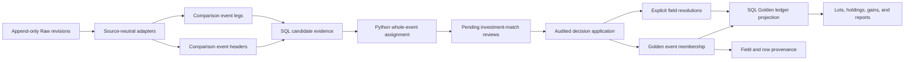

# Investment Event Matching

> Last updated: 2026-09-04
> Status: ready
> Address: M1J.7 (Investments — cross-source event matching)
> Type: Feature
> Owns: source-neutral matching of whole investment events, review decisions,
> Golden event materialization, and investment-transaction identity continuity
> Refines: [`investments-overview.md`](investments-overview.md) and
> [`matching-overview.md`](matching-overview.md)
> Constrained by:
> [`investments-data-model.md`](investments-data-model.md),
> [`source-observations.md`](source-observations.md),
> [`account-identity-resolution.md`](account-identity-resolution.md),
> [`matching-consistency-boundaries.md`](matching-consistency-boundaries.md),
> [`app-integrity-invariant.md`](app-integrity-invariant.md), and
> [`observability.md`](observability.md)

## One-line goal

Recognize manual and aggregator observations of the same whole investment event,
let a person ratify the result, and rebuild one stable Golden event without
losing source fidelity or prior curation.

## Decision summary

MoneyBin adds a dedicated, source-neutral investment-event matcher with a
review-first launch posture:

1. A comparison layer adapts every source into event headers and typed legs.
2. SQL performs normalization, candidate blocking, evidence calculation, and
   Golden projections; Python performs whole-event assignment and applies
   reviewed decisions.
3. `event_group_id` becomes the stable MoneyBin-owned identity of a Golden
   investment event. A singleton transaction is a one-leg event.
4. Matching is atomic at the event boundary. MoneyBin never accepts only part
   of a reinvestment, transfer, or other multi-leg event.
5. Every candidate remains pending until a person accepts or rejects it in the
   first production release. The engine may label a candidate `auto_eligible`
   for measurement, but that label has no mutation authority.
6. Accepted membership binds exact Raw observation revisions. Proposal-issued
   field choices, rejected fingerprints, provenance, and transaction-id aliases
   are durable and reversible.
7. The existing visible-collision guard remains in force until a separate
   promotion proves that matched history is safe enough to replace it.

The contract starts with manual and Plaid adapters, but no table, decision key,
or service contract treats Plaid as the generic source.

## Why this exists

Manual entry and aggregator sync currently contribute independent rows to
`core.fct_investment_transactions`. When both histories describe the same
economic activity, downstream lots, holdings, realized gains, income, and fees
can all be counted twice. Suppressing one source wholesale is safer than a
wrong ledger, but it also hides legitimate non-overlapping history.

Cash matching cannot simply absorb this problem. Cash candidates are primarily
row or graph relationships; an investment event may contain several
semantically linked legs whose quantities, cash effects, fees, dates, and
accounts must agree as one unit. Treating those legs independently could keep
the dividend from one source and the reinvestment purchase from another, or
accept one side of a transfer without the other. Either result creates a
plausible but incorrect tax ledger.

## Goals

- Match manual and Plaid observations of the same economic investment event.
- Make the matching contract source-neutral so another Source type adds an
  adapter rather than a parallel matching system.
- Preserve every source observation revision in Raw.
- Give each accepted event and leg a stable MoneyBin-owned identity.
- Preserve explicit user curation when a better source observation joins an
  existing event.
- Show the evidence, field differences, alternatives, and downstream effect
  before a person decides.
- Make acceptance, rejection, staleness, and undo atomic and auditable.
- Keep lots, holdings, gains, and reports deterministic rebuilds of the Golden
  ledger.

## Non-goals

- Automatically accepting investment matches in the first production release.
- Replacing cash matching or storing investment state in
  `app.match_decisions`.
- Inferring account or security identity. Matching consumes already-ratified
  `account_id` and `security_id` values.
- Reconstructing a split ratio that a source did not provide. Plaid split
  matching remains disabled until M1J.5 supplies a trustworthy adapter.
- Repairing incomplete aggregator history, inventing missing event legs, or
  synthesizing a transfer counterpart.
- Changing tax-lot policy, cost-basis elections, or wash-sale handling.
- Replacing the visible-collision guard as part of the matcher launch.
- Providing a partial-acceptance escape hatch for a multi-leg event.

## Vocabulary and grain

| Term | Meaning |
|---|---|
| Source observation | One immutable Raw revision of a manual or aggregator claim. |
| Observation version | A full SHA-256 digest of the source values that can affect comparison or Golden projection. |
| Comparison leg | One normalized investment-transaction row used as matching evidence. |
| Source event | One or more comparison legs that one source says form one economic event. |
| Proposal | One inferred set of source events that may represent the same real event. |
| Golden event | The ratified, canonical event exposed through the core ledger. |
| Golden leg | One canonical investment transaction inside a Golden event. |
| Event fingerprint | A versioned digest of normalized member identities and match-relevant values. |

In the Golden core ledger, `event_group_id` identifies both a multi-leg event
and a singleton event. It is therefore no longer merely an optional hint
connecting decomposed rows. Raw and source-staging values remain nullable and
source-shaped; they are inputs to source-event construction, not canonical
identities. `investment_transaction_id` identifies a Golden leg within the
Golden event.

## Architecture



### Ownership boundaries

The investment matcher is a dedicated module. It may reuse generic graph data
structures and the existing review workflow, but it does not extend the cash
match decision schema or make cash services understand investment legs.

SQL owns operations that are naturally relational and inspectable:

- source-neutral normalization;
- event and leg comparison views;
- candidate blocking and evidence columns;
- deterministic Golden-field defaults;
- Golden-ledger materialization; and
- field and source-row provenance projections.

Python owns operations whose correctness depends on graph-wide state or an
audited mutation:

- global candidate assignment;
- competing-Proposal detection;
- freshness validation;
- atomic accept, reject, and undo; and
- orchestration of the downstream rebuild.

This split keeps the evidence queryable without expressing global assignment as
opaque procedural SQL or moving deterministic warehouse projections into
application code.

## Comparison contract

### Source event construction

Each adapter emits a source event key and one or more typed legs. When the
source already provides a trustworthy group reference, the adapter uses it.
Manual grouped rows use their authored group. An ungrouped transaction becomes
a singleton source event.

Each event header carries:

- `source_type` and `source_origin`;
- source event key;
- resolved account set and security set;
- normalized event type and date interval;
- member count and event fingerprint; and
- adapter capability flags, including whether split semantics are supported.

Each comparison leg carries the source-row identity and exact observation
version plus normalized type, subtype, semantic leg role, account, security,
trade and settlement dates, quantity, price, amount, fees, currency, Native
references, and the original Golden identity when one exists.

Normalization may remove representational differences such as sign convention,
decimal scale, case, and trade-date-versus-settlement-date placement. It must
not erase a material disagreement.

Descriptions are projection-only context: they can help a person understand a
Proposal but never contribute match evidence or confidence. They remain
versioned because the chosen description is a Golden field and must not change
silently after review.

### Source observation revisions

Every adapter identifies a source row by its Source type, Source origin, Native
reference, and `observation_version`. The version is a full SHA-256 digest over
every captured source value that can affect comparison or Golden projection;
ingestion metadata such as job id and load time is excluded. An identical
re-delivery reuses the version. A changed date, quantity, amount, fee, price,
currency, type, relationship, or description appends another Raw revision.

M1J.7 migrates `raw.plaid_investment_transactions` from its shipped current-row
upsert grain to append-only revisions. The migration records each existing row
as its first revision. Manual correction follows the same contract: it appends
a revision rather than rewriting the reviewed claim. Staging exposes the latest
revision per source-row identity for new planning, while accepted membership
and provenance join the exact historical Raw revision they name.

Raw remains the canonical home for source observations. M1J.7 adds no parallel
Core or App state observation table.

### Eligibility gates

A candidate is ineligible unless all applicable legs agree on:

- ratified canonical account identity;
- ratified canonical security identity;
- effective currency for every compared monetary field; and
- an event shape supported by both adapters.

A transfer compares the entire account pair, direction, security, and quantity.
A missing or unresolved identity routes to its existing account- or
security-identity review; the event matcher does not guess it.

After account identity resolves, each leg's effective currency is
`COALESCE(source currency, canonical account currency)`, matching the shipped
investment ledger. A candidate is ineligible only when an effective currency is
still unknown or the compared effective currencies disagree. The Proposal
fingerprint includes the resolved account identity, effective currency, and the
canonical account-currency value used to derive it. Acceptance rereads those
inputs, so an account-currency correction stales the old eligibility result.

Splits require an exact normalized ratio and an adapter that declares split
support. The manual adapter may support that contract. The Plaid adapter must
declare splits unsupported until M1J.5 resolves aggregator split semantics, so a
Plaid split cannot enter a matching Proposal in this increment.

### Candidate bands

Candidates are evaluated in descending confidence:

1. **Native identity.** A source-native relationship or an already-ratified
   membership identifies the same event.
2. **Exact economic identity.** Shape, identities, dates, quantities, and cash
   values agree after harmless normalization.
3. **Constrained fuzzy identity.** Required identities and shape agree, while
   bounded date or numeric differences remain within the type-specific matrix.

Descriptions explain a candidate but never establish it. A fuzzy trade must
pass both quantity and cash evidence. A correction or reversal requires a
native relationship or remembered ratified relationship; similarity alone is
insufficient.

### Initial tolerance matrix

These thresholds admit review candidates; they do not authorize acceptance.

| Evidence | Candidate threshold |
|---|---|
| Buy, sell, or reinvest date | Same date or within 5 calendar days across trade and settlement dates |
| Dividend, interest, or fee date | Same date or within 3 calendar days |
| Transfer date | Same date or within 7 calendar days |
| Quantity | Exact at 10 decimal places, or difference no greater than `max(0.000001, abs(quantity) * 0.00000001)` |
| Amount | Difference no greater than `0.01` after sign normalization |
| Fees | Gross/net reconciliation differs by no more than `0.01` |
| Price | Difference no greater than `max(0.01, abs(price) * 0.0001)`, or the quantity/cash equation reconciles within `0.01` |
| Correction or reversal | Native or remembered relationship only |
| Split | Exact normalized ratio and supported adapters only |

The scenario suite owns the boundary examples for every threshold. A threshold
change is a behavior change and must update those examples.

## Whole-event assignment

The planner assigns source events, not individual legs. An accepted Proposal
must satisfy all of these invariants:

- each source event belongs to at most one active Golden event;
- every leg of every source event moves together;
- the proposed leg correspondence is total for the supported event shape;
- competing assignments remain visible rather than being broken by arbitrary
  row order; and
- repeated identical events are solved globally, not greedily.

An unambiguous two-by-two set of same-day trades may produce two Proposals when
the total assignment is unique. A one-to-two or otherwise equally valid
assignment remains competing and cannot be accepted until the ambiguity is
resolved.

Every planned Proposal records a versioned fingerprint over its exact
observation versions, normalized members, and match-relevant fields. Acceptance
rereads the latest versions, recomputes the fingerprint, and refuses a stale
Proposal. Re-running the planner must not create another pending review for an
unchanged pending, accepted, or rejected fingerprint.

## Durable state

The exact migration DDL may follow repository conventions, but the following
semantic homes are fixed.

### `app.investment_match_decisions`

One audited Proposal decision with status `pending`, `accepted`, `rejected`,
`stale`, or `reversed`. It stores the Proposal identity, algorithm version,
source-event keys, exact observation versions, normalized fingerprint,
confidence band, evidence summary, timestamps, and actor. Rejected fingerprints
suppress unchanged Proposals; a materially different fingerprint is a new
Proposal.

### `app.investment_event_members`

The active and historical mapping from each exact source-event and source-leg
revision to its Golden `event_group_id`, Golden `investment_transaction_id`,
and semantic leg role. The refresh step registers a standalone membership the
first time it sees a new source event, so even an unmatched singleton has a
stable Golden event identity. Acceptance rewrites the entire affected
membership set atomically. Reversal retires that accepted membership rather
than deleting its history. Historical membership retains observation versions,
prior Golden ids, and source-group references as provenance.

There is no separate mutable `app.investment_events` registry or App state
observation snapshot. An active Golden event exists because it has active
membership, and its source values remain in Raw. This avoids parallel sources
of truth for event existence or source evidence.

### `core.bridge_investment_event_id_aliases`

A derived public bridge maps a retired post-M1J.7 Golden `event_group_id` to its
active Golden id. It is projected from historical membership, not maintained as
another mutable registry. Public consumers can therefore resolve an id retired
by a later accepted Match. Pre-M1J.7 source-group references are provenance,
not aliases in this bridge.

### `app.investment_match_field_resolutions`

Only explicit user choices for material field conflicts. Deterministic defaults
remain derived in SQL and do not become mutable copies. A resolution identifies
the Golden event or leg, proposal-issued conflict and choice ids, field, chosen
source observation revision, decision, and audit metadata.

### `app.investment_transaction_id_aliases`

Append-only mapping from a previously published investment transaction id to
the active Golden leg id. Existing `app.lot_selections` and other curated
references resolve through this alias path so acceptance does not silently
orphan them. Decision application re-points both disposal references and
derived acquisition `lot_id` references to their new canonical ids inside the
same transaction. An accepted match is blocked when a selection cannot be
mapped without ambiguity.

All mutations use repositories under `src/moneybin/repositories/`. Services do
not issue raw writes against these protected tables.

## Golden identity and field selection

### Identity

On first observation, MoneyBin mints a truncated UUID `event_group_id` that is
independent of source row ids and values, then persists it with the standalone
membership. M1J.7 is a pre-launch hard cut: there are no legacy Golden ids or
consumers to preserve. Existing Raw and staging `event_group_id` values remain
source-group references in provenance, while every migrated source event
receives a newly minted MoneyBin-owned Golden id. Core exposes only the Golden
id after migration; no compatibility alias is created for a pre-M1J.7
source-group reference.

When acceptance joins existing Golden events, the oldest established Golden
event identity remains canonical, with the opaque id as the deterministic
tie-breaker. The public event-id bridge forwards every post-M1J.7 retired Golden
event id to the result. Golden leg ids follow the corresponding established
semantic leg where one exists; other previously published transaction ids
become append-only aliases. Adding a third observation to an existing event
therefore changes neither the event id nor its leg ids.

A material change to leg structure stales the existing decision. The system
does not silently repurpose a leg id for a different semantic role. When an
accepted match replaces previously published source-derived transaction ids,
the alias table preserves continuity.

### Field fidelity

Golden fields follow this order:

1. preserve an explicit user resolution or curation;
2. normalize harmless representational differences;
3. prefer the aggregator observation for objective financial fields; and
4. require an explicit field choice for a material conflict.

Objective fields include dates, quantities, prices, amounts, fees, currencies,
and aggregator-native references. Aggregator preference is a default, not a
claim that aggregator data is infallible. A manually curated field that was
explicitly chosen remains authoritative when another observation joins the
event.

Description follows the same explicit-curation-first rule and otherwise uses
the aggregator observation. Different descriptions do not create a material
field conflict because they are not accounting evidence.

Every Golden field exposes provenance to its chosen source observation or
explicit resolution. Event membership provenance separately retains every
contributing source row, including observations whose value was not selected.

### Source correction lifecycle

Golden projection reads the exact observation versions named by active
membership, never whichever revision happens to be latest in staging. A source
correction therefore cannot silently change a reviewed Golden field.

When a source row receives a new revision:

- an affected pending Proposal becomes `stale`, and the planner may issue a new
  Proposal over the latest revisions;
- an active standalone membership not governed by an accepted Match advances
  atomically to the latest revision while retaining its Golden event and leg
  ids; this creates neither a Proposal nor a second active membership;
- any accepted or multi-source membership becomes stale and untrusted, but
  continues to project the last-reviewed exact revisions until a person accepts
  a replacement or reverses the Match; and
- the visible-collision guard remains active and review surfaces identify the
  changed source row without exposing its financial values in logs.

If the advancing singleton participated in a pending Proposal, that Proposal
still becomes stale; a later planning pass may issue a replacement over its new
revision. Historical membership retains the prior exact revision.

Acceptance of the replacement atomically installs the new exact membership and
field resolutions. Reversal restores the prior exact membership and its field
resolutions. No accepted membership ever advances merely because ingestion
observed a newer revision.

## Review and operation surfaces

### Planning and inspection

```text
moneybin investments matches run
moneybin investments matches pending
moneybin investments matches history
```

`run` refreshes pending Proposals but changes no Golden membership. `pending`
shows the whole event, corresponding legs, confidence band, exact evidence,
material field differences, competing candidates, and the expected downstream
effect. For every material field conflict it also shows one opaque,
Proposal-issued conflict id and the allowed choice ids. `history` shows
accepted, rejected, stale, and reversed decisions.

### Decision and undo

Investment matching joins the existing cross-domain review surface:

```text
moneybin review --type investment-matches --confirm <review-id> \
  --field-choice <conflict-id>=<choice-id>
moneybin review --type investment-matches --reject <review-id>
moneybin system audit undo <operation-id>
```

MCP reuses `reviews`, `reviews_decide`, and `system_audit_undo`. The read queue
uses `reviews(kind="investment_matches", ...)`. Decisions add an
`investment_match` variant to the existing discriminated item union and retain
the existing batch envelope:

```text
reviews_decide(decisions=[{
  "kind": "investment_match",
  "decision_id": "<review-id>",
  "decision": "accept",
  "field_choices": [
    {"conflict_id": "<conflict-id>", "choice_id": "<choice-id>"}
  ]
}])
```

The CLI flag is repeatable. Accept requires exactly one currently allowed
choice for every material conflict. Missing, unknown, duplicate, or stale ids
fail the request. Reject forbids field choices. A Proposal with no material
conflicts accepts with an empty choice set. This keeps CLI and MCP semantics
identical without adding one tool per command.

Before committing acceptance, the service constructs every complete selected
Golden leg and validates it against the existing investment-ledger contract.
The combined selection must satisfy required and forbidden fields by type,
quantity and cash signs, multi-leg completeness, and fee-aware
quantity-price-cash consistency under the approved numeric tolerances. This
prevents individually allowed field choices from creating a combination that
no source asserted and the ledger cannot represent. An incoherent selection
fails atomically and leaves the Proposal pending.

Accept and reject operate on a whole Proposal. The confirmation copy states
that acceptance rebuilds the investment ledger and its dependent lots,
holdings, gains, and reports. Acceptance revalidates the Proposal fingerprint
and exact observation versions, then persists the accepted decision, complete
membership set, and every required field resolution in one database
transaction. Any validation or write failure leaves all three unchanged. A
stale Proposal cannot be confirmed. Undo restores the prior active membership
and field resolutions and rebuilds the same dependency set.

### Refresh and failure semantics

The refresh registry gains an `investment_match` step after source staging and
identity resolution but before the Golden investment ledger and its dependent
models. Planning is safe to repeat.

Decision state commits before the rebuild it requires. If the decision commits
and the subsequent rebuild fails, the operation reports both facts: the
decision is durable, derived surfaces are stale, and the visible-collision guard remains
active. It must not claim rollback or expose the partially refreshed result as
current. A later refresh retries the rebuild from the same durable decision.

## Visible-collision guard and promotion

The existing MB-97 safety boundary is a visible-collision guard, not
account-level withholding. When manual and aggregator investment histories
coexist for one Account, SyncService emits the review-surfaced warning and
system doctor reports the overlap. Core, lots, gains, and reports still include
both histories, so they remain explicitly untrusted for that Account until the
person selects one history. M1J.7 materialization alone does not remove the
warning or make the remaining unmatched history trustworthy.

During initial rollout, a pending, competing, stale, unsupported, or otherwise
ambiguous event risk keeps that warning active. Accepting one Match does not
establish that every remaining row is safe.

The shipped overlap detector currently observes Plaid investment transactions,
but bootstrap opening lots can also enter Core from Plaid holdings. That is an
unclosed guard gap: M1J.7 slice 1 must expand SyncService and system doctor
overlap evidence to cover both transaction observations and holdings/bootstrap
evidence before later slices may rely on the warning. This design PR does not
claim that expansion is implemented.

Replacing or narrowing the visible-collision guard is a separate promotion
decision after real-data evidence. It must define the exact state and read
semantics and prove which unmatched rows can be trusted without double-counting.
Account-level withholding is not part of the current guard or this initial
matcher delivery.

Automatic acceptance is also a separate promotion. The first release may
record which Proposals would have been auto-eligible so precision can be
measured without granting them mutation authority.

## Observability

Metrics use bounded, non-sensitive labels and are added to
`src/moneybin/metrics/registry.py`:

| Metric | Type | Labels | Meaning |
|---|---|---|---|
| `moneybin_investment_match_proposals_total` | Counter | `band`, `outcome` | Planned, pending, suppressed, competing, or stale Proposals |
| `moneybin_investment_match_decisions_total` | Counter | `decision` | Accepted, rejected, or reversed decisions after commit |
| `moneybin_investment_match_events_total` | Counter | `event_type`, `outcome` | Whole events materialized or left under the visible-collision guard |
| `moneybin_investment_match_rebuild_total` | Counter | `outcome` | Successful or failed dependent rebuilds |
| `moneybin_investment_match_duration_seconds` | Histogram | `operation` | Planning, decision, and rebuild latency |

Logs may include counts, opaque event ids, status codes, event types, and
operation names. They must not include descriptions, security names, monetary
values, quantities, account labels, or source payloads.

## Scenario matrix

The implementation is not accepted until the following cases have explicit
fixtures and expected Golden-ledger outcomes.

| Area | Required scenarios |
|---|---|
| Simple events | Exact and fuzzy buy, sell, dividend, interest, and fee matches; legitimate unmatched neighbors remain separate |
| Dates | Same date and both sides of every type-specific boundary; trade date matched to settlement date |
| Precision | Exact decimal normalization plus inside/outside quantity, amount, fee, and price thresholds |
| Reinvestment | Manual and aggregator multi-leg shapes; income and acquisition move atomically; a missing leg is not accepted |
| Transfers | Both account directions and quantities agree; one-sided or mismatched transfers remain ineligible |
| Repetition | Unique two-to-two assignment of identical same-day trades; ambiguous one-to-two assignment remains competing |
| Partial history | Non-overlapping manual and aggregator periods remain present after a later guard-promotion decision |
| Corrections | Native or remembered correction/reversal accepted; fuzzy-only similarity rejected |
| Revisions | Identical re-delivery reuses a version; an unreviewed singleton advances without rotating Golden ids; changed accepted or multi-source evidence stales without silently changing Golden fields |
| Identity | Unresolved or contradictory account, security, or effective currency identities remain ineligible; omitted source currency inherits the canonical account currency |
| Identity migration | Pre-M1J.7 source-group references remain provenance while every event receives a new Golden id; only later retired Golden ids enter the public forwarding bridge |
| Splits | Normalized contract fixtures pass for supported adapters; Plaid split candidates stay disabled |
| Stability | Repeated sync, input reordering, and an additional source observation preserve Golden ids and avoid duplicate reviews |
| Extensibility | A third-Source-type fixture joins an accepted event without changing public Golden identities |
| Curation | Explicit field and lot-selection curation survives acceptance, added observations, rebuild, and undo |
| Field choices | Missing, unknown, duplicate, stale, incoherent, and complete choice sets have identical CLI/MCP outcomes; acceptance validates the full projected event and writes decision, membership, and resolutions atomically |
| Downstream | Exact lots, holdings, realized gains, income, and fee results before acceptance, after acceptance, and after undo |
| Recovery | Stale Proposal refusal; committed decision plus failed rebuild reports durable decision and stale derived state |
| Guard coverage | Manual history overlapping Plaid transactions or holdings-derived bootstrap rows emits the same visible warning and doctor finding |

## Verification

- Pure normalization and tolerance tests for every supported event type.
- Currency tests for explicit values, account inheritance, unknown or
  contradictory effective currency, and account-currency changes that stale a
  Proposal.
- Pure global-assignment tests, including competing and repeated-event graphs.
- DuckDB repository tests for atomic membership, rejection suppression, aliases,
  field resolutions, observation-version binding, audit records, and reversal.
- Raw-loader tests proving identical re-delivery is idempotent and a changed
  match-relevant or Golden-projected value appends a new observation revision.
- SQLMesh tests for comparison views, Golden projection, provenance, and stable
  identities.
- Membership tests proving an unreviewed singleton advances to one active latest
  revision with stable Golden ids while preserving its prior history.
- Scenario tests for every row in the matrix, including exact downstream tax-lot
  outputs.
- CLI and MCP parity tests for plan, inspect, accept, reject, stale, failure, and
  undo outcomes, including identical field-choice and complete Golden-event
  invariant validation.
- Property or invariant tests proving a source event has at most one active
  Golden membership and every accepted multi-leg event is complete.
- Real mixed-history validation before any guard or auto-accept promotion.

No auto-accept threshold may ship from synthetic precision alone. Promotion
requires zero false consolidations in the labeled scenario corpus and the
approved real-data validation set, with ambiguous cases remaining visible.

## Delivery slices

Each slice is independently reviewable. Public implementation issues are opened
only after this contract is accepted.

1. **Comparison foundation.** Add manual and Plaid adapters, event/leg comparison
   views, normalization, tolerances, explicit inactive split capability, and
   the Raw transaction-revision migration. Expand the existing overlap detector
   to cover Plaid transactions and holdings/bootstrap evidence before any later
   slice relies on that guard.
2. **Review-only planner.** Add whole-event assignment, versioned fingerprints,
   competing detection, Proposal-issued conflict and choice ids, and pending
   Proposals without changing the core ledger.
3. **Decision workflow.** Persist pending, rejected, and stale lifecycle state
   plus rejection suppression; add identical CLI/MCP field-choice request
   validation, audit integration, and metrics. Acceptance remains unavailable
   until slice 4 can apply the whole transition atomically.
4. **Golden materialization.** Add stable event and leg identities, membership,
   the public event-id bridge, transaction aliases, field resolution,
   provenance, and the dependent rebuild. Perform the pre-launch Golden-id hard
   cut, preserving existing source-group references only as provenance. Enable
   acceptance after validating the complete Golden event, then commit its
   decision, exact revision membership, and field resolutions in one
   transaction. Advance an unreviewed singleton to a newer revision atomically
   without rotating its Golden ids or creating a Proposal.
5. **Lifecycle proof.** Complete the scenario matrix, repeated-sync and failure
   recovery tests, labeled real-data validation, and evidence for a later
   guard-promotion decision.

## Deferred decisions

- The precision threshold, eligible bands, and safeguards for a future
  auto-accept promotion.
- The exact state and read rule for a future guard-promotion decision.
- Plaid split matching, owned by M1J.5.
- Source-specific adapters beyond manual and Plaid.
- Event shapes not represented by the current ledger taxonomy.
