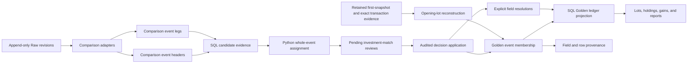

# Investment Event Matching

> Last updated: 2026-09-04
> Status: ready
> Address: M1J.7 (Investments — cross-source event matching)
> Type: Feature
> Owns: source-neutral matching of whole investment events, review decisions,
> Golden event materialization, and investment-transaction identity continuity
> Refines: [`investments-overview.md`](investments-overview.md) and
> [`matching-overview.md`](matching-overview.md)
> Constrained by:
> [`investments-data-model.md`](investments-data-model.md),
> [`source-observations.md`](source-observations.md),
> [`account-identity-resolution.md`](account-identity-resolution.md),
> [`matching-consistency-boundaries.md`](matching-consistency-boundaries.md),
> [`app-integrity-invariant.md`](app-integrity-invariant.md), and
> [`observability.md`](observability.md)

## One-line goal

Recognize manual and aggregator observations of the same whole investment event,
let a person ratify the result, and rebuild one stable Golden event without
losing source fidelity or prior curation.

## Decision summary

MoneyBin adds a dedicated, source-neutral investment-event matcher with a
review-first launch posture:

1. A comparison layer adapts every source into event headers and typed legs.
2. SQL performs normalization, candidate blocking, evidence calculation, and
   Golden projections; Python performs whole-event assignment and applies
   reviewed decisions.
3. `event_group_id` becomes the stable MoneyBin-owned identity of a Golden
   investment event. A singleton transaction is a one-leg event.
4. Matching is atomic at each adapter-validated Source-event boundary. MoneyBin
   never accepts only part of such an event. M1J.7's only compound Source shape
   is reinvest; supported `transfer_in` and `transfer_out` observations remain
   one-leg events.
5. Every candidate remains pending until a person accepts or rejects it in the
   first production release. The engine may label a candidate `auto_eligible`
   for measurement, but that label has no mutation authority.
6. Membership binds exact Raw observation revisions or exact opening-lot
   reconstruction inputs. Proposal-issued field choices, rejected fingerprints,
   provenance, Core id resolution, and audited curation remaps are durable and
   reversible.
7. The existing visible-collision guard remains in force until a separate
   promotion proves that matched history is safe enough to replace it.

The contract starts with manual and Plaid comparison adapters, but no table,
decision key, or service contract treats Plaid as the generic source.

## Why this exists

Manual entry and aggregator sync currently contribute independent rows to
`core.fct_investment_transactions`. When both histories describe the same
economic activity, downstream lots, holdings, realized gains, income, and fees
can all be counted twice. Suppressing one source wholesale is safer than a
wrong ledger, but it also hides legitimate non-overlapping history.

Cash matching cannot simply absorb this problem. Cash candidates are primarily
row or graph relationships; an investment event may contain several
semantically linked legs whose quantities, cash effects, fees, dates, and
accounts must agree as one unit. Treating legs that an adapter has validated as
one Source event independently could keep the dividend from one source and the
reinvestment purchase from another. That creates a plausible but incorrect tax
ledger.

## Goals

- Match manual and Plaid observations of the same economic investment event.
- Make the matching contract source-neutral so another Source type adds a
  comparison adapter rather than a parallel matching system.
- Preserve every source observation revision in Raw.
- Give each accepted event and leg a stable MoneyBin-owned identity.
- Preserve explicit user curation when a better source observation joins an
  existing event.
- Show the evidence, field differences, alternatives, and downstream effect
  before a person decides.
- Make acceptance, rejection, staleness, and undo atomic and auditable.
- Keep lots, holdings, gains, and reports deterministic rebuilds of the Golden
  ledger.

## Non-goals

- Automatically accepting investment matches in the first production release.
- Replacing cash matching or storing investment state in
  `app.match_decisions`.
- Inferring account or security identity. Matching consumes already-ratified
  `account_id` and `security_id` values.
- Reconstructing a split ratio that a source did not provide. Plaid split
  matching remains disabled until M1J.5 supplies a trustworthy comparison adapter.
- Detecting or reversing Plaid canceled, retracted, or disappeared investment
  transactions. M1J.7 receives neither an investment removal feed nor a native
  cancellation-to-original relationship.
- Repairing incomplete aggregator history, inventing missing event legs, or
  synthesizing a transfer counterpart.
- Inferring that separate `transfer_in` and `transfer_out` observations compose
  one internal transfer, or constructing merger, spin-off, or trade compounds.
  Those shapes require an atomic manual interface and a validated comparison-
  adapter contract in a later increment.
- Changing tax-lot policy, cost-basis elections, or wash-sale handling.
- Replacing the visible-collision guard as part of the matcher launch.
- Providing a partial-acceptance escape hatch for a multi-leg event.

## Vocabulary and grain

| Term | Meaning |
|---|---|
| Source observation | One immutable Raw revision of a manual or aggregator claim. |
| Native reference | Stable upstream transaction identifier; with Source type and Source origin, it forms the version-free native source-row identity. |
| Observation version | A SHA-256 digest truncated to 16 hex characters over the source values that can affect comparison or Golden projection. |
| Comparison adapter | A source-specific translator that emits the source-neutral comparison event and leg contract. |
| Comparison leg | One normalized investment-transaction row used as matching evidence. |
| Source group reference | Source-authored or MoneyBin-minted evidence that several observations form one Source event; it is structural only when the comparison adapter validates the complete shape. |
| Source event | One or more comparison legs that one source says form one economic event. |
| Opening-lot reconstruction | A MoneyBin-derived one-leg Golden event representing a pre-window Plaid position. It is not a Source observation, Source event, Proposal, or match candidate. |
| Proposal | One inferred set of source events that may represent the same real event. |
| Match | An accepted Proposal and its resulting audited multi-source Golden membership; it may later become stale or reversed. |
| Golden event | The ratified, canonical event exposed through the core ledger. |
| Golden leg | One canonical investment transaction inside a Golden event. |
| Event fingerprint | A versioned digest of normalized member identities and match-relevant values. |

In the Golden core ledger, `event_group_id` identifies both a multi-leg event
and a singleton event. It is therefore no longer merely an optional hint
connecting decomposed rows. Raw and source-staging values remain nullable and
source-shaped; they are inputs to source-event construction, not canonical
identities. `investment_transaction_id` identifies a Golden leg within the
Golden event.

## Architecture



### Ownership boundaries

The investment matcher is a dedicated module. It may reuse generic graph data
structures and the existing review workflow, but it does not extend the cash
match decision schema or make cash services understand investment legs.

SQL owns operations that are naturally relational and inspectable:

- source-neutral normalization;
- event and leg comparison views;
- candidate blocking and evidence columns;
- deterministic Golden-field defaults;
- Golden-ledger materialization; and
- field and source-row provenance projections.

Python owns operations whose correctness depends on graph-wide state or an
audited mutation:

- global candidate assignment;
- competing-Proposal detection;
- freshness validation;
- atomic accept, reject, and undo; and
- orchestration of the downstream rebuild.

This split keeps the evidence queryable without expressing global assignment as
opaque procedural SQL or moving deterministic warehouse projections into
application code.

## Comparison contract

### Source event construction

Each comparison adapter emits a source event key and one or more typed legs. It
may use a source group reference only when the comparison adapter defines and
validates the complete event shape.

M1J.7 removes caller-authored `event_group_id` from `investments add` and
`investments_record`. The manual reinvest convenience submits one complete
event and MoneyBin mints its opaque Source group reference internally. Every
other supported manual entry is a singleton. A future manual compound shape
must arrive as one atomic, structurally validated event; reusing a string across
calls never appends a leg. Pre-M1J.7 group strings are untrusted migration hints:
only a complete supported shape groups, while every other row remains a
singleton and retains the original string as provenance.

The Plaid comparison adapter constructs a two-leg reinvest Source event only
when exactly one normalized `reinvest` acquisition and one income observation
form a complete, unambiguous shape. The compatible funding-subtype-to-income-type
pairs are `dividend` to `dividend`, `interest` to `interest`, and `capital_gain`
to `capital_gain_distribution`; their resolved Account, Security, and effective
currency must agree; their dates must be no more than 3 calendar days apart;
their income and acquisition cash must
reconcile within the approved amount and fee tolerances; and neither leg may
have another eligible pairing. Its source-event key derives from the two stable
native source-row identities `(source_type, source_origin, native_reference)`
and excludes `observation_version`. A missing leg or any alternative pairing
leaves the observations as singletons, so they cannot partially match a manual
reinvest event.

M1J.7 treats ordinary normalized `transfer_in` and `transfer_out` observations
as one-leg Source events. A Proposal may compare a manual and aggregator event
only when their normalized transfer direction is the same. The adapters never
infer that independently observed in/out legs form one internal transfer and
never synthesize a missing counterpart. Plaid merger, spin-off, and trade legs
remain singleton evidence but are marked as an unsupported compound shape, so
they cannot enter either a compound Proposal or a partial one-leg match.

Each event header carries:

- `source_type` and `source_origin`;
- source event key;
- resolved account set and security set;
- normalized event type and date interval;
- member count and event fingerprint; and
- comparison-adapter capability flags, including whether split semantics are
  supported.

Each comparison leg carries the source-row identity and exact observation
version plus normalized type, subtype, semantic leg role, account, security,
trade and settlement dates, quantity, price, amount, fees, currency, Native
references, and the original Golden identity when one exists.

Normalization may remove representational differences such as sign convention,
decimal scale, case, and trade-date-versus-settlement-date placement. It must
not erase a date or numeric difference outside the applicable tolerance or a
categorical eligibility contradiction.

Descriptions are projection-only context: they can help a person understand a
Proposal but never contribute match evidence or confidence. They remain
versioned because the chosen description is a Golden field and must not change
silently after review.

### Source observation revisions

Every comparison adapter identifies a stable upstream source row by its Source
type, Source origin, and Native reference. An immutable Source observation
revision is that identity plus `observation_version`. The version is a SHA-256
digest truncated to 16 hex characters over every captured source value that can
affect comparison or Golden projection; ingestion metadata such as job id and
load time is excluded. An identical re-delivery reuses the version. A changed
date, quantity, amount, fee, price, currency, type, relationship, or description
appends another Raw revision.

M1J.7 migrates `raw.plaid_investment_transactions` from its shipped current-row
upsert grain to append-only revisions. The migration records each existing row
as its first revision and first delivery receipt. Every delivered transaction
then writes two Raw records in the same database transaction: the immutable
content revision if it does not already exist, and an idempotent per-pull row in
`raw.plaid_investment_transaction_receipts` at grain
`(investment_transaction_id, source_origin, source_file)`. The receipt names the
delivered `observation_version`, `extracted_at`, `loaded_at`, and a local
monotonic `ingestion_sequence` allocated only when that receipt is first
inserted. Replaying the same `source_file` preserves its sequence.

Staging exposes the version named by the latest receipt under the deterministic
order `extracted_at DESC, ingestion_sequence DESC` for each stable source-row
identity. The sequence is the final delivery-order tie-breaker when distinct
sync jobs report the same extraction timestamp; sequence gaps are harmless. An
A→B→A delivery sequence therefore reuses the immutable A revision but records a
new receipt that makes A current again; B remains available for history and
exact membership. Reprocessing the same sync job reuses its receipt without
making an old job current, and an absent row writes no receipt and does not imply
cancellation. Accepted membership and provenance continue to join the exact
historical Raw revision they name.

M1J.7 adds no manual correction operation. `investments add` and
`investments_record` remain create-only, and their Raw observations are
immutable. A future manual-correction feature requires its own accepted
contract and a distinct whole-event correction operation; it is not implicit
in `investments_record` and is not prerequisite machinery for matching.

Raw remains the canonical home for source observations. M1J.7 adds no parallel
Core or App state observation table.

### Eligibility gates

A candidate is ineligible unless all applicable legs agree on:

- ratified canonical account identity;
- ratified canonical security identity;
- effective currency for every compared monetary field; and
- an event shape supported by both comparison adapters.

A supported one-leg transfer compares direction, Account, Security, effective
currency, and quantity. M1J.7 does not infer an account pair from separate
transfer observations.
A missing or unresolved identity routes to its existing account- or
security-identity review; the event matcher does not guess it.

After account identity resolves, each leg's effective currency is
`COALESCE(source currency, canonical account currency)`, matching the shipped
investment ledger. A candidate is ineligible only when an effective currency is
still unknown or the compared effective currencies disagree. The Proposal
fingerprint includes the resolved account identity, effective currency, and the
canonical account-currency value used to derive it. Acceptance rereads those
inputs, so an account-currency correction stales the old eligibility result.

Splits require an exact normalized ratio and a comparison adapter that declares
split support. The manual comparison adapter may support that contract. The
Plaid comparison adapter must declare splits unsupported until M1J.5 resolves
aggregator split semantics, so a Plaid split cannot enter a matching Proposal in
this increment.

### Candidate bands

Candidates are evaluated in descending confidence:

1. **Native identity.** A comparison-adapter-delivered and validated
   source-native relationship or an already-ratified membership identifies the
   same event.
2. **Exact economic identity.** Shape, identities, dates, quantities, and cash
   values agree after harmless normalization.
3. **Constrained fuzzy identity.** Required identities and shape agree, while
   bounded date or numeric differences remain within the type-specific matrix.

Descriptions explain a candidate but never establish it. A fuzzy trade must
pass both quantity and cash evidence. A correction or reversal requires a
native relationship that the comparison adapter actually delivers and
validates, or a remembered ratified relationship; similarity alone is
insufficient.

### Initial tolerance matrix

These thresholds admit review candidates; they do not authorize acceptance.

| Evidence | Candidate threshold |
|---|---|
| Buy, sell, or reinvest date | Same date or within 5 calendar days across trade and settlement dates; the 3-day rule in Source event construction is the earlier Plaid-internal reinvest-leg pairing window, not this cross-source candidate window |
| Dividend, interest, or fee date | Same date or within 3 calendar days |
| Transfer date | Same date or within 7 calendar days |
| Quantity | Exact at 10 decimal places, or difference no greater than `max(0.000001, abs(quantity) * 0.00000001)` |
| Amount | Difference no greater than `0.01` after sign normalization |
| Fees | Gross/net reconciliation differs by no more than `0.01` |
| Price | Difference no greater than `max(0.01, abs(price) * 0.0001)`, or the quantity/cash equation reconciles within `0.01` |
| Correction or reversal | Comparison-adapter-delivered and validated native relationship, or remembered relationship, only |
| Split | Exact normalized ratio and supported comparison adapters only |

The scenario suite owns the boundary examples for every threshold. A threshold
change is a behavior change and must update those examples.

The same date and numeric thresholds define field-choice materiality. A
normalized difference within its applicable threshold takes the deterministic
aggregator default. A difference beyond that threshold is a material field
conflict and requires an explicit choice when a validated native relationship
or prior ratified membership otherwise keeps the Source events eligible.
Account, Security, effective currency, normalized event shape, and semantic leg
roles are eligibility or structural conditions, not field-choice conflicts.

## Whole-event assignment

The planner assigns source events, not individual legs. An accepted Proposal
must satisfy all of these invariants:

- each source event belongs to at most one active Golden event;
- every Proposal contains at least two Source events, and no two share the same
  `(source_type, source_origin)`; multiple validated legs inside one Source
  event do not count as multiple sources;
- every leg of every source event moves together;
- the proposed leg correspondence is total for the supported event shape;
- competing assignments remain visible rather than being broken by arbitrary
  row order; and
- repeated identical events are solved globally, not greedily.

An unambiguous two-by-two set of same-day trades may produce two Proposals when
the total assignment is unique. A one-to-two or otherwise equally valid
assignment remains competing and cannot be accepted until the ambiguity is
resolved.

Every planned Proposal records a versioned fingerprint over its exact
observation versions, normalized members, source-diversity tuples, and
match-relevant fields. It also
records a content-derived candidate-graph fingerprint for the connected
candidate component containing those members. That graph fingerprint covers
every candidate node and edge in the component, their relevant observation
versions, normalized scoring inputs, and the matching-algorithm version; it is
not a mutable global generation.

Acceptance rereads the latest inputs, reconstructs that connected candidate
component, recomputes both fingerprints, and reruns its global assignment in the
same decision transaction before any membership write. A changed graph or
assignment stales the Proposal, including when a newly arrived event creates an
equally plausible alternative without changing the originally proposed members.
Re-running the planner must not create another pending review for an unchanged
pending, accepted, or rejected fingerprint.

The fingerprint also binds each leg's canonical-identity dependency: terminal
Account and Security ids, the relevant accepted Link or merge decision
generation, and any canonical Account currency used for effective currency.
Broad entity `updated_at` values are excluded so display-only edits do not stale
a Proposal. Planning and acceptance recompute the dependency tuple.

Canonical identity operations never rewrite Raw observations after M1J.7. An
audited equivalence merge changes Link or alias routing and forwards the prior
canonical id to its survivor. It stales pending Proposals because the candidate
graph may change, but an accepted Match remains accepted: the identity decision
itself establishes equivalence, while exact source evidence and event membership
are unchanged. Before the new alias route becomes visible, that audited
transaction advances `projection_changed_at` for every affected active
membership because live canonical ids in the Golden projection may change. A
rebind, unlink, or split that changes an observation's identity equivalence
class is different: it atomically stales affected pending and accepted or
multi-source Matches before the new mapping becomes visible. The prior bound
identity remains resolvable for the last-reviewed projection until a replacement
Match is accepted or reversed.

The same pre-publication transaction handles every affected standalone
membership. When the proposed identity change still yields one complete event
with unambiguous one-to-one semantic leg correspondence, it replaces the
identity-bound membership revision, records `projection_changed_at`, preserves
the Golden event and leg ids, and applies the same audited complete-selection
remap before exposing the new identity mapping. Any ambiguous or incomplete
curation mapping blocks the entire identity operation before publication. If
the new identity is unresolved or changes that structure, the transaction
retires the standalone membership first. Later registration may reactivate the
prior Golden ids only when the same event and semantic leg correspondence is
unambiguous; otherwise it mints new ids and the Core resolvers report the prior
ids as terminally retired or forwarded as appropriate. Live alias routing never
silently changes a standalone Golden projection.

## Durable state

The exact migration DDL may follow repository conventions, but the following
semantic homes are fixed.

### `app.investment_match_decisions`

One audited Proposal decision with status `pending`, `accepted`, `rejected`,
`stale`, or `reversed`. It stores the Proposal identity, algorithm version,
source-event keys, exact observation versions, normalized fingerprint,
candidate-graph fingerprint, confidence band, evidence summary, timestamps, and
actor. It also stores the planner's immutable `auto_eligible` boolean at
Proposal creation. The flag is deterministic from the persisted evidence and
`algorithm_version`; changing that version produces a new Proposal. The flag
has no mutation authority; first-decision review quality is the share of reviewed
`auto_eligible` Proposals whose first audited human decision is `accepted` rather
than `rejected`; `stale` and still-pending Proposals are excluded. Rejected
fingerprints suppress unchanged Proposals; a changed member identity, exact
revision, normalized scoring input, or connected-graph fingerprint is a new
Proposal.

### `app.investment_event_members`

The active and historical mapping from each member revision to its Golden
`event_group_id`, Golden `investment_transaction_id`, and semantic leg role.
`member_kind` is `source_event` or `opening_lot_reconstruction`. A Source-event
member names its exact source-event and source-leg revisions. The refresh step
registers a standalone membership the first time it sees a new Source event, so
even an unmatched singleton has a stable Golden event identity. Acceptance
rewrites the entire affected membership set atomically. Reversal retires that
accepted membership rather than deleting its history. Historical membership
retains observation versions, prior Golden ids, and source-group references as
provenance.

Every projection-affecting membership transition records one
`projection_changed_at` value on the history rows it activates or retires. The
value is written in the same transaction as a membership registration,
replacement, reversal, reconstruction advance, or reconstruction retirement.
The same watermark advances on affected active membership rows, without
changing their decision or evidence, when a canonical dependency changes the
live Golden projection without a membership transition. This includes an
equivalence merge that changes Account or Security alias routing and a canonical
Account-currency correction used by an unreviewed standalone or opening-lot
membership. The audited identity or Account update and the watermark advance
commit in one transaction before the new dependency is visible. An accepted or
multi-source Match retains its exact reviewed effective currency when an Account
currency changes; that operation stales the Match but does not advance the
watermark until replacement or reversal changes the projection. Planning,
rejection, and any other stale transition that deliberately retains the
last-reviewed projection do not write it.

An opening-lot reconstruction uses the stable key `(plaid, source_origin,
source_account_key, source_security_key, first_snapshot_source_file, lot_key)`.
`lot_key` is the existing positional/institution-lot key or the reserved
residual or position sentinel. The key excludes quantity, basis, and the
derived reconstruction revision, and mints one stable Golden event and leg id.
Its revision digests the reconstruction-algorithm version, exact retained first
snapshot receipt/holding/lot inputs, exact in-window transaction observation
revisions used to calculate the gap, and canonical-identity dependencies that
affect Golden projection. Provenance exposes those inputs and the algorithm
version. Gap calculation resolves every in-window transaction through active
membership rather than latest staging. When a correction stales an accepted or
multi-source Match, the reconstruction therefore continues using that Match's
last-reviewed transaction revision. Only replacement acceptance or reversal
changes the selected transaction inputs and atomically advances the
reconstruction revision.

An opening-lot reconstruction never becomes a Proposal or cross-source Match.
When its inputs change, active membership advances atomically to the new
reconstruction revision while retaining Golden ids when the stable key
survives. If the key no longer produces a row, active membership retires. No
superseded reconstruction continues to project. A surviving stable Golden leg
preserves its derived lot id across reconstruction-evidence revisions while its
canonical Account, Security, and acquisition inputs remain unchanged. A
canonical-identity rekey may rotate that existing content-derived lot id and
uses the same audited complete-selection remap as an accepted Match. A retired
reconstruction or impossible stored lot selection keeps dependent output
non-current until resolved rather than retaining a phantom lot.

There is no separate mutable `app.investment_events` registry or App state
observation snapshot. An active Golden event exists because it has active
membership, and its source values remain in Raw. This avoids parallel sources
of truth for event existence or source evidence.

### `core.alias_investment_event_ids`

A derived resolver exposes every currently or formerly published Golden
`event_group_id` from historical membership. It returns
`requested_event_group_id`, nullable `active_event_group_id`, and
`resolution_status` (`active`, `forwarded`, or `retired`). Active ids map to
themselves, consolidation-retired ids forward to their active successor, and an
id retired without a successor—such as a vanished opening-lot reconstruction—
has status `retired` and a null active id. Pre-M1J.7 source-group references are
provenance, not inputs to this resolver.

### `core.alias_investment_transaction_ids`

A derived resolver exposes every currently or formerly published Golden
`investment_transaction_id` from historical membership. It returns
`requested_investment_transaction_id`, nullable
`active_investment_transaction_id`, and the same `resolution_status`. Active ids
self-map, consolidation-retired ids forward, and ids retired without a successor
return `retired` with a null active id. Active and forwarded outcomes contain no
cycles or inactive target, and ambiguous leg correspondence blocks acceptance
instead of producing a mapping.

Both resolvers derive from the same active and historical membership authority.
No separately mutable investment alias table, validity flag, or deactivation
write exists. Reversal reactivates prior membership, so its resurrected ids
naturally self-resolve and superseded forwarding disappears from the current
view.

### `app.investment_match_field_resolutions`

Only explicit user choices for material field conflicts. Deterministic defaults
remain derived in SQL and do not become mutable copies. A resolution identifies
the Golden event or leg, proposal-issued conflict and choice ids, field, chosen
source observation revision, decision, and audit metadata.

All mutations use repositories under `src/moneybin/repositories/`. Services do
not issue raw writes against these protected tables.

## Golden identity and field selection

### Identity

On first observation, MoneyBin mints a truncated UUID `event_group_id` that is
independent of source row ids and values, then persists it with the standalone
membership. M1J.7 is a pre-launch hard cut: there are no legacy Golden ids or
consumers to preserve. Existing Raw and staging `event_group_id` values remain
source-group references in provenance, while every migrated source event
receives a newly minted MoneyBin-owned Golden id. Core exposes only the Golden
id after migration; no compatibility alias is created for a pre-M1J.7
source-group reference.

When acceptance joins existing Golden events, the oldest established Golden
event identity remains canonical, with the opaque id as the deterministic
tie-breaker. The two Core id resolvers derive the current resolution outcome for
every post-M1J.7 retired Golden event or leg id from membership history, with
forwarding only when an active successor exists. Golden leg ids follow the
corresponding established semantic leg where one exists. Adding a third
observation to an existing event therefore changes neither the event id nor its
leg ids.

A change to leg count or complete semantic leg correspondence stales the
existing decision. The system does not silently repurpose a leg id for a
different semantic role. When an accepted Match replaces previously published
source-derived transaction ids, the derived Core resolver preserves continuity.

### Field fidelity

Golden fields follow this order:

1. preserve an explicit user resolution or curation;
2. normalize harmless representational differences;
3. exclude missing values from default selection when any eligible member has a
   present value; a nullable field remains `NULL` only when every eligible exact
   revision has `NULL`, unless explicit curation deliberately clears it;
4. require an explicit field choice for a normalized date or numeric difference
   beyond its applicable tolerance; and
5. otherwise choose field provenance through the deterministic source
   precedence below.

Objective fields include dates, quantities, prices, amounts, fees, currencies,
and aggregator-native references. For a field with no explicit resolution,
prefer a present aggregator value over a present manual value, then use the
lexicographically smallest
`(source_type, source_origin, native_reference)` as the final tie-breaker. The
active exact revision of that stable row supplies the value and provenance.
This identity tie-breaker only selects among values already eligible for the
deterministic default; it never breaks candidate assignment or bypasses a field
conflict. Aggregator preference is not a claim that aggregator data is
infallible. A manually curated field that was explicitly chosen remains
authoritative when another observation joins the event.

Description follows the same explicit-curation-first, present-value, and
deterministic source precedence. Different descriptions do not create a
material field conflict because they are not accounting evidence.

Every Golden field exposes provenance to its chosen source observation or
explicit resolution. Event membership provenance separately retains every
contributing source row, including observations whose value was not selected.

### Source correction lifecycle

Golden projection reads the exact observation versions named by active
membership, never whichever revision happens to be latest in staging. A source
correction therefore cannot silently change a reviewed Golden field.

M1J.7 covers delivered aggregator revisions. It does not support Plaid
cancellation, retraction, or disappearance: the Plaid comparison adapter
supplies no native relationship to the original, so it creates no reversal
candidate and does not stale or reverse existing membership on that signal. A
future comparison adapter that supplies a stable original-event relationship
may opt into the generic correction/reversal rule. Manual observations do not
revise because the create-only manual surface has no correction operation.

When a source row receives a new revision:

- an affected pending Proposal becomes `stale`, and the planner may issue a new
  Proposal over the latest revisions;
- before an active standalone membership not governed by an accepted Match
  advances, the same transaction reconstructs every affected comparison-adapter
  Source event from current revisions. It retains the Golden event and leg ids
  only when reconstruction yields the same source-event key and the same
  complete, unambiguous source-row-to-semantic-leg correspondence. Otherwise it
  retires every affected standalone membership and registers the reconstructed
  Source event or events through the normal identity rules. A structurally
  changed event or leg mints new ids; prior ids remain resolver-visible as
  retired or forwarded only when an active successor exists;
- any accepted or multi-source membership becomes stale and untrusted, but
  continues to project the last-reviewed exact revisions until a person accepts
  a replacement or reverses the Match; and
- the visible-collision guard remains active and review surfaces identify the
  changed source row without exposing its financial values in logs.

This reconstruction never infers a transfer counterpart: ordinary `transfer_in`
and `transfer_out` observations remain one-leg Source events. If an advancing
event participated in a pending Proposal, that Proposal still becomes stale; a
later planning pass may issue a replacement over its new revision. Historical
membership retains the prior exact revision.

Acceptance of the replacement atomically installs the new exact membership and
field resolutions. Reversal restores the prior exact membership and its field
resolutions. No accepted membership ever advances merely because ingestion
observed a newer revision.

## Review and operation surfaces

### Planning and inspection

```text
moneybin investments matches run
moneybin investments matches pending
moneybin investments matches history
```

`run` refreshes pending Proposals but changes no Golden membership. `pending`
shows the whole event, corresponding legs, confidence band, exact evidence,
material field differences, competing candidates, and the expected downstream
effect. For every material field conflict it also shows one opaque,
Proposal-issued conflict id and the allowed choice ids. `history` shows
accepted, rejected, stale, and reversed decisions.

### Decision and undo

Investment matching joins the existing cross-domain review surface:

```text
moneybin review --type investment-matches --confirm <review-id> \
  --field-choice <conflict-id>=<choice-id>
moneybin review --type investment-matches --reject <review-id>
moneybin system audit undo <operation-id>
```

M1J.7 reuses the existing MCP tools `reviews`, `reviews_decide`, and
`system_audit_undo`. It extends the `reviews` kind enum with
`investment_matches` and the `reviews_decide` item union with the
`investment_match` discriminator while retaining the existing batch envelope.
The new decision-item shape is:

```json
{
  "kind": "investment_match",
  "decision_id": "<review-id>",
  "decision": "accept",
  "field_choices": [
    {"conflict_id": "<conflict-id>", "choice_id": "<choice-id>"}
  ]
}
```

The CLI flag is repeatable. Accept requires exactly one currently allowed
choice for every material field conflict. Missing, unknown, duplicate, or stale
ids fail the request. Reject forbids field choices. A Proposal with no material
field conflicts accepts with an empty choice set. This keeps CLI and MCP
semantics identical without adding one tool per command.

Before committing acceptance, the service constructs every complete selected
Golden leg and validates it against the existing investment-ledger contract.
The combined selection must satisfy required and forbidden fields by type,
quantity and cash signs, multi-leg completeness, and fee-aware
quantity-price-cash consistency under the approved numeric tolerances. This
prevents individually allowed field choices from creating a combination that
no source asserted and the ledger cannot represent. An incoherent selection
fails atomically and leaves the Proposal pending.

Acceptance also preflights every affected `app.lot_selections` collection. Each
disposal id and selected acquisition `lot_id` must map unambiguously to the
selected Golden legs. The preflight groups remapped collections by target
disposal. One source collection is accepted; multiple source collections are
accepted only when their complete remapped `(acquisition_lot_id, quantity)` sets
are exactly identical. Differing collections block acceptance instead of
overwriting one another. The same audited transaction collection-replaces an
agreeing target set once through `LotSelectionsRepo`, preserving every source
before-image and linking the child audit events to the Match decision's parent
operation. Any ambiguous or incomplete id mapping blocks acceptance before a
write.

Accept and reject operate on a whole Proposal. The confirmation copy states
that acceptance rebuilds the investment ledger and its dependent lots,
holdings, gains, and reports. Acceptance revalidates the Proposal fingerprint
and exact observation versions, then persists the accepted decision, complete
membership set, every required field resolution, and every affected complete
lot-selection set in one database transaction. Any validation or write failure
leaves all four unchanged. A stale Proposal cannot be confirmed.

Undo restores the prior active membership and field resolutions and reverses
each child lot-selection audit event inside the same transaction, recovering
the exact pre-accept selection sets. A later user mutation of an affected
selection blocks undo instead of overwriting newer curation. The two Core id
resolvers change only because active membership changed: ids reactivated by
undo self-resolve, and no stale forwarding remains. Undo then rebuilds the same
dependency set.

### Refresh and failure semantics

The refresh registry gains an `investment_match` step after source staging and
identity resolution but before the Golden investment ledger and its dependent
models. Before that step, SQLMesh performs a narrow pre-match bootstrap of only
the comparison and opening-lot input views, plus dependencies required to
evaluate them. This bootstrap creates those inputs for a fresh profile and
applies newly added input-view models, but it cannot select the Golden ledger or
any dependent model. Its SQLMesh executions therefore do not acknowledge
Golden-ledger freshness or clear the stale-read guard.

Planning is safe to repeat. Unlike existing best-effort enrichment stages,
`investment_match` is a fail-closed prerequisite to the dependent transform: it
must register, advance, or retire every eligible Source event and opening-lot
membership before returning success. Any bootstrap or `investment_match` error
prevents the full `TransformService.apply` from running, so SQLMesh cannot
acknowledge Raw or App inputs that membership did not process. A later refresh
retries from durable Raw evidence and membership history.

The refresh selector treats the pre-match bootstrap and `investment_match` as
transitive dependencies of `transform`: every transform request, including
`moneybin refresh --step transform` and `refresh_run(steps=["transform"])`, runs
them first. No CLI, MCP, or internal caller can request the dependent transform
while skipping those prerequisites. The prerequisite-aware refresh path becomes
the sole production entry point for a full transform: the existing transform
CLI, MCP schema-drift self-heal, and import-service shim delegate to it rather
than calling `TransformService.apply` directly. `TransformService.apply` remains
the orchestrator's lower-level full SQLMesh boundary, not a separately callable
full-transform workflow.

Investment-event membership is a materialization input. Transform freshness is
pending when either Raw landing data or the latest
`app.investment_event_members.projection_changed_at` is newer than the oldest
SQLMesh execution timestamp across the Golden ledger and every registered
dependent rebuild model. That watermark includes both membership transitions
and the dependency-only alias or Account-currency advances defined above, so no
projection-affecting identity change can become visible without making the
dependent ledger stale. The decision, identity, or Account transaction persists
the applicable timestamp before returning. A successful transform is the
acknowledgement; SQLMesh's existing execution state clears the comparison
without a second mutable generation or completion record.

Decision state commits before the rebuild it requires. If the decision commits
and the subsequent rebuild fails or the process crashes, `system_status`
remains pending. One shared investment-ledger freshness guard covers CLI and MCP
investment lists, investment-dependent reports, canonical bundle preparation
that includes investment datasets, and SQL queries whose resolved lineage
reaches the affected ledger models. Those reads and exports refuse to render or
publish stale values; MCP and JSON forms return a standard `refresh_stale`
error envelope with `moneybin refresh --step transform` and
`refresh_run(steps=["transform"])` retry actions. `system_status`, refresh,
review and decision history, provenance, and reads unrelated to the investment
ledger remain available. No surface presents the pre-decision projection as
current. The operation reports that the decision is durable, derived surfaces
are stale, and the visible-collision guard remains active. It must not claim
rollback. A later refresh retries the rebuild from the same durable membership.

## Visible-collision guard and promotion

The existing MB-97 safety boundary is a visible-collision guard, not
account-level withholding. When manual and aggregator investment histories
coexist for one Account, SyncService emits the review-surfaced warning and
system doctor reports the overlap. Core, lots, gains, and reports still include
both histories, so they remain explicitly untrusted for that Account until the
person selects one history. M1J.7 materialization alone does not remove the
warning or make the remaining unmatched history trustworthy.

During initial rollout, a pending, competing, stale, unsupported, or otherwise
ambiguous event risk keeps that warning active. Accepting one Match does not
establish that every remaining row is safe.

The shipped overlap detector currently observes Plaid investment transactions,
but bootstrap opening lots can also enter Core from Plaid holdings. That is an
unclosed guard gap: M1J.7 slice 1 must expand SyncService and system doctor
overlap evidence to cover both transaction observations and holdings/bootstrap
evidence before later slices may rely on the warning. This design PR does not
claim that expansion is implemented.

Replacing or narrowing the visible-collision guard is a separate promotion
decision after real-data evidence. It must define the exact state and read
semantics and prove which unmatched rows can be trusted without double-counting.
Account-level withholding is not part of the current guard or this initial
matcher delivery.

Automatic acceptance is also a separate promotion. The first release may
record which Proposals would have been auto-eligible so first-decision review
quality can be measured as one input to that later decision without granting
them mutation authority.

## Observability

Metrics use bounded, non-sensitive labels and are added to
`src/moneybin/metrics/registry.py`:

| Metric | Type | Labels | Meaning |
|---|---|---|---|
| `moneybin_investment_match_proposals_total` | Counter | `band`, `outcome` | Planned, pending, suppressed, competing, or stale Proposals |
| `moneybin_investment_match_decisions_total` | Counter | `decision`, `auto_eligible` | Accepted, rejected, or reversed decisions after commit |
| `moneybin_investment_match_events_total` | Counter | `event_type`, `outcome` | Whole events materialized or left under the visible-collision guard |
| `moneybin_investment_match_rebuild_total` | Counter | `outcome` | Successful or failed dependent rebuilds |
| `moneybin_investment_match_duration_seconds` | Histogram | `operation` | Planning, decision, and rebuild latency |

The `auto_eligible` metric label is the bounded string `"true"` or `"false"`.
An accepted or rejected outcome emits exactly once for the first audited human
decision with the Proposal's immutable flag. A later reversal may emit
`decision="reversed"` but never rewrites or recounts that first outcome. The
accepted and rejected counters where `auto_eligible="true"` therefore provide
the numerator and denominator for first-decision review quality without including
pending or stale Proposals. They are not a current-state precision measure and
do not set or authorize a future auto-accept promotion; reversals remain
separately audited and counted without rewriting that first-decision measure.

Logs may include counts, opaque event ids, status codes, event types, and
operation names. They must not include descriptions, security names, monetary
values, quantities, account labels, or source payloads.

## Scenario matrix

The implementation is not accepted until the following cases have explicit
fixtures and expected Golden-ledger outcomes.

| Area | Required scenarios |
|---|---|
| Simple events | Exact and fuzzy buy, sell, dividend, interest, and fee matches; legitimate unmatched neighbors remain separate |
| Dates | Same date and both sides of every type-specific boundary; trade date matched to settlement date |
| Precision | Exact decimal normalization plus inside/outside quantity, amount, fee, and price thresholds |
| Reinvestment | Manual and Plaid two-leg shapes match only when the Plaid comparison adapter finds one normalized `reinvest` acquisition and an income leg using the explicit `dividend` to `dividend`, `interest` to `interest`, or `capital_gain` to `capital_gain_distribution` compatibility mapping within 3 calendar days, with one complete unambiguous cash/fee-reconciled pairing; a 4-day Plaid-internal pair remains singleton, while already-constructed manual and Plaid Source events may cross-source match at 4 or 5 days but not 6; both legs move atomically, and a missing or multiply paired leg is not accepted |
| Transfers | Same-direction one-leg manual and Plaid `transfer_in` or `transfer_out` events match only when Account, Security, effective currency, quantity, and the 7-day candidate window agree; when manual supplies `original_acquisition_date` or basis and Plaid has `NULL`, the present manual value and its exact provenance project instead of being erased; opposing legs are never inferred as an internal-transfer pair, and merger, spin-off, or trade legs remain ineligible for partial matching |
| Source diversity | A manual-to-Plaid or other distinct-origin Proposal may be eligible; two manual/user events or two events from one Plaid connection never consolidate through this review matcher, while multiple legs already validated inside one Source event remain atomic |
| Repetition | Two-to-two same-day trades with non-arbitrary distinguishing evidence produce a unique global assignment; genuinely indistinguishable two-to-two and one-to-two assignments remain competing; a new equally plausible event arriving after planning changes the connected candidate graph and stales the old Proposal before acceptance |
| Partial history | Non-overlapping manual and aggregator periods remain present after a later guard-promotion decision |
| Corrections | Delivered Plaid revisions follow the singleton-versus-reviewed lifecycle; Plaid cancellation/retraction produces no candidate because its native relationship is unavailable; a generic comparison-adapter fixture proves validated native or remembered reversal relationships while fuzzy-only similarity is rejected; manual correction is unavailable in M1J.7 |
| Revisions | Identical aggregator re-delivery reuses a version and per-job receipt while preserving its first-ingestion sequence; A→B→A content reuses the immutable A revision but a new receipt makes A current while retaining B in history, including when two jobs share an extraction timestamp; a changed observation version with unchanged stable native identities, unique partner, and semantic roles preserves the Source-event key and Golden ids while updating exact membership provenance, but a changed Native reference does not; a revision that loses uniqueness, becomes incomplete, or changes partner retires the affected prior membership and normally registers the rebuilt singleton or pair without reusing a changed semantic-leg id; changed accepted or multi-source evidence stales without silently changing Golden fields |
| Opening lots | A reconstruction key survives an evidence revision with stable Golden and lot ids when canonical Account, Security, and acquisition inputs are unchanged; changed exact inputs advance revision and provenance; a correction to an accepted Match leaves gap quantity and basis on its last-reviewed transaction revisions until replacement acceptance or reversal; a canonical identity rekey remaps complete selections through audit; a vanished key retires; an impossible stored selection keeps dependent output non-current |
| Manual grouping | Public caller-authored grouping is unavailable; reinvest grouping is minted and validated atomically; invalid pre-M1J.7 group hints remain singleton provenance |
| Identity | Unresolved or contradictory account, security, or effective currency identities remain ineligible; omitted source currency inherits the canonical account currency; an equivalence merge follows aliases, stales pending Proposals only, and advances projection freshness for affected active membership before the route is visible; an Account-currency correction likewise advances freshness for affected unreviewed projection while an accepted or multi-source Match retains reviewed currency and stales; before a non-equivalent rebind, unlink, or split becomes visible, pending and accepted or multi-source Matches stale while a structurally unchanged standalone membership advances with stable Golden ids and a now-unresolved or structurally changed standalone retires; Raw remains unchanged |
| Identity migration | Pre-M1J.7 source-group references remain provenance while every event receives a new Golden id; consolidation-retired event and leg ids forward through the two derived Core views, ids retired without a successor return a terminal `retired` status and null active id, and undo reactivates prior ids as self-maps |
| Splits | Normalized contract fixtures pass for supported comparison adapters; Plaid split candidates stay disabled |
| Stability | Repeated sync, input reordering, and an additional source observation preserve Golden ids and avoid duplicate reviews |
| Extensibility | A third-Source-type fixture joins an accepted event without changing public Golden identities |
| Curation | Explicit field and lot-selection curation survives acceptance, added observations, rebuild, and undo; multiple collections converging on one disposal write once only when their complete remapped sets are identical, otherwise acceptance blocks; ambiguous remapping blocks acceptance and later overlapping curation blocks undo |
| Field choices | A date or numeric difference at its tolerance takes the deterministic aggregator default, while an otherwise-eligible native or ratified candidate beyond tolerance requires a choice; missing, unknown, duplicate, stale, incoherent, and complete choice sets have identical CLI/MCP outcomes; acceptance validates the full projected event and writes decision, membership, and resolutions atomically |
| Field provenance | Explicit curation outranks the default; otherwise present values outrank missing values, aggregator beats manual, and the stable source tuple breaks an aggregator tie, so a basis-bearing manual transfer is not erased by aggregator `NULL` and differing descriptions from two Plaid origins plus input reordering produce one unchanged value and exact provenance without affecting assignment |
| Downstream | Exact lots, holdings, realized gains, income, and fee results before acceptance, after acceptance, and after undo |
| Recovery | A fresh profile and a newly added comparison-input model bootstrap only pre-match views before membership; bootstrap or membership failure prevents the dependent transform and its SQLMesh acknowledgement; committed decision plus crash or failed rebuild remains pending in transform freshness and every dependent read until a successful rebuild |
| Guard coverage | Manual history overlapping Plaid transactions or holdings-derived bootstrap rows emits the same visible warning and doctor finding |
| Measurement | An `auto_eligible` Proposal remains pending, records the flag immutably, and contributes to first-decision review quality only after its first human accept or reject decision; a later reversal emits its separate outcome without rewriting that historical measure or becoming auto-accept authority |

## Verification

- Pure normalization and tolerance tests for every supported event type,
  proving each within-tolerance boundary takes the aggregator default and each
  beyond-tolerance native or ratified candidate requires a field choice.
- Currency tests for explicit values, account inheritance, unknown or
  contradictory effective currency, and account-currency changes that stale a
  Proposal.
- Pure global-assignment tests, including repeated-event graphs with
  non-arbitrary distinguishing evidence, genuinely indistinguishable two-to-two
  and one-to-two graphs, and an equally plausible event arriving after Proposal
  planning.
- Proposal-measurement tests proving `auto_eligible` is recorded at planning,
  is deterministic for the persisted evidence and algorithm version, cannot
  authorize a mutation, and uses bounded decision-metric labels emitted once
  for first human accepted or rejected decisions while excluding pending and
  stale outcomes. Acceptance followed by reversal emits the separate reversal
  outcome without changing the first-decision measure or treating it as a
  current-state precision or promotion gate.
- Reinvest Source-event tests proving the Plaid comparison adapter groups one
  normalized `reinvest` acquisition with an income leg only for the explicit
  `dividend` to `dividend`, `interest` to `interest`, or `capital_gain` to
  `capital_gain_distribution` compatibility mapping inside the 3-calendar-day
  and cash/fee thresholds, and leaves missing, mistyped, out-of-window, or
  multiply paired observations as singletons. A 4-day Plaid-internal pair stays
  singleton, while already-constructed cross-source reinvest events match at 4
  and 5 days but not 6.
- Transfer tests proving same-direction one-leg events match only across
  distinct Source tuples with Account, Security, currency, quantity, and date
  agreement; a manual basis or `original_acquisition_date` projects when the
  aggregator field is `NULL`; no in/out counterpart is inferred; and merger,
  spin-off, and trade legs cannot enter a partial Proposal.
- Source-diversity tests proving same-manual and same-Plaid-origin duplicates do
  not produce Proposals, while validated multi-leg observations remain one
  Source event.
- DuckDB repository tests for atomic membership, rejection suppression, field
  resolutions, observation-version binding, projection-change timestamps, audit
  records, and reversal.
- Raw-loader tests proving identical Plaid re-delivery is idempotent and a
  changed match-relevant or Golden-projected value appends a new observation
  revision. A→B→A across three sync jobs writes three delivery receipts, reuses
  the immutable A content revision, exposes A as current, retains B for history,
  and still selects the third receipt when extraction timestamps tie;
  reprocessing one job creates no duplicate receipt or new
  `ingestion_sequence`. Migration backfills one receipt per legacy current row,
  and a failed revision/receipt write exposes neither half.
- Manual grouping tests proving caller-authored grouping is absent from public
  inputs, reinvest grouping is system-minted and atomic, and invalid
  pre-M1J.7 group hints do not group observations.
- SQLMesh tests for comparison views, Golden projection, provenance, and stable
  identities.
- Field-provenance tests proving explicit curation wins, present values outrank
  missing values, and otherwise aggregator-over-manual plus the stable source
  tuple selects one exact value and provenance across multiple aggregator
  origins, differing descriptions, input reordering, and an added observation
  without changing assignment.
- Membership tests proving an unreviewed adapter event advances to one active
  latest revision with stable Golden ids only when its source-event key and
  complete source-row-to-semantic-leg correspondence are unchanged. Plaid
  reinvest fixtures prove that a changed observation version with unchanged
  native identities and semantic roles preserves the key and exact-id lineage,
  while a changed Native reference does not. They also cover loss and switching
  of a unique partner, including the displaced former partner, and assert normal
  identity retirement or forwarding, no reused id for a changed semantic leg,
  and one active membership per rebuilt Source event. Accepted and multi-source
  controls instead stale and retain their last-reviewed exact revisions.
- Opening-lot reconstruction tests proving stable-key identity, exact-input and
  algorithm-version provenance, revision advance, retirement, stable surviving
  lot ids when canonical identity and acquisition inputs are unchanged, audited
  complete-selection remap after a canonical identity rekey, accepted-Match
  correction using last-reviewed transaction revisions for gap quantity and
  basis until replacement or reversal, and non-current output for an impossible
  stored selection.
- Core id-resolution tests proving current ids self-resolve,
  consolidation-retired event and leg ids forward, terminally retired ids return
  `retired` with a null active id, and accept followed by undo makes reactivated
  ids self-resolve without stale forwarding.
- Lot-selection tests proving acceptance remaps and undo exactly restores a
  complete selection set, identical collections converging on one disposal are
  written once with every before-image retained, differing collections block
  acceptance, ambiguous id remapping blocks acceptance, and newer user curation
  blocks undo.
- Freshness and read-guard tests proving a committed membership change followed
  by a crash or failed rebuild remains pending and blocks investment-dependent
  CLI, MCP, report, canonical bundle export, and SQL reads until every dependent
  model rebuilds successfully, while status, recovery, audit, provenance, and
  unrelated reads remain available.
- Refresh-orchestration tests proving any `investment_match` error prevents the
  dependent transform and SQLMesh timestamp advancement, and proving a direct
  transform-only selector expands the dependency so a later retry completes
  membership processing before rebuilding.
- Bootstrap tests proving a fresh profile and a newly added comparison-input
  model create only the required pre-match views before membership processing,
  never execute a Golden or dependent model, and cannot clear dependent
  freshness.
- Entry-point tests proving the transform CLI, MCP schema-drift self-heal, and
  import-service shim use that prerequisite-aware route, plus a structural test
  that rejects new production `TransformService.apply` callers outside the
  refresh orchestrator.
- Identity-dependency tests proving an equivalence merge follows aliases
  without staling accepted Matches, a non-equivalent rebind, unlink, or split
  stales affected Matches before its mapping becomes visible, and neither path
  rewrites Raw. They also prove equivalence alias publication and unreviewed
  Account-currency projection changes advance the shared freshness watermark in
  the same transaction, while an accepted or multi-source currency change
  retains reviewed projection and stales without a watermark advance.
- Standalone-identity tests proving a non-equivalent rebind, unlink, or split
  atomically replaces or retires affected membership before mapping publication,
  records projection freshness, preserves Golden ids only for unambiguous
  one-to-one semantic correspondence, applies the audited complete-selection
  remap, blocks publication on ambiguous or incomplete curation, and never
  changes projection through live alias routing alone.
- Scenario tests for every row in the matrix, including exact downstream tax-lot
  outputs.
- CLI and MCP parity tests for plan, inspect, accept, reject, stale, failure, and
  undo outcomes, including identical field-choice and complete Golden-event
  invariant validation.
- Property or invariant tests proving a source event has at most one active
  Golden membership and every accepted multi-leg event is complete.
- Real mixed-history validation before any guard or auto-accept promotion.

No auto-accept threshold may ship from synthetic precision alone. Promotion
requires zero false consolidations in the labeled scenario corpus and the
approved real-data validation set, with ambiguous cases remaining visible.

## Delivery slices

Each slice is independently reviewable. Public implementation issues may be
pre-staged alongside the design PR for review, but remain subordinate to the
accepted contract and must be reconciled to it before delivery begins.

1. **Comparison foundation.** Add manual and Plaid comparison adapters,
   event/leg comparison views, normalization, tolerances, explicit inactive
   split capability, and the Plaid Raw transaction-revision and per-delivery
   receipt migration. Remove
   caller-authored `event_group_id` from CLI and MCP inputs, mint reinvest
   grouping internally, and validate pre-M1J.7 group hints before using them as
   event structure. Stop canonical identity changes from rewriting Raw
   observations and resolve them through Link or alias routing instead. Expand
   the existing overlap detector to also cover holdings/bootstrap evidence
   before any later slice relies on that guard.
2. **Review-only planner.** Add whole-event assignment, versioned fingerprints,
   canonical-identity dependency tuples, competing detection, Proposal-issued
   conflict and choice ids, and pending Proposals without changing the core
   ledger.
3. **Decision workflow.** Persist pending, rejected, and stale lifecycle state
   plus rejection suppression; add identical CLI/MCP field-choice request
   validation, audit integration, and metrics. Acceptance remains unavailable
   until slice 4 can apply the whole transition atomically.
4. **Golden materialization.** Add stable event and leg identities, Source-event
   and opening-lot-reconstruction membership, the two derived Core id
   resolvers, field resolution, exact provenance, `projection_changed_at`, and
   the pre-match input-view bootstrap and dependent rebuild. Perform the
   pre-launch Golden-id hard cut, preserving existing source-group references
   only as provenance. Enable acceptance after
   validating the complete Golden event and every lot-selection mapping, then
   commit its decision, exact revision membership, field resolutions, and
   complete remapped selection sets in one transaction. Undo restores those
   selection sets from the same audit chain and blocks on later overlapping
   curation. Reconstruct affected Source events before an unreviewed aggregator
   revision advances; preserve Golden ids only when the stable source-event key
   and complete semantic membership survive, otherwise retire and register the
   rebuilt events normally. Make
   equivalence merges follow the canonical alias path, and make a
   non-equivalent rebind, unlink, or split invalidate affected pending and
   accepted or multi-source Matches before publishing the new mapping.
5. **Lifecycle proof.** Complete the scenario matrix, repeated-sync and failure
   recovery tests, labeled real-data validation, and evidence for a later
   guard-promotion decision.

## Deferred decisions

- The current-state precision metric and reversal treatment, threshold, eligible
  bands, and safeguards for a future auto-accept promotion. The shipped
  first-decision review-quality counters do not decide it.
- The exact state and read rule for a future guard-promotion decision.
- Plaid split matching, owned by M1J.5.
- Source-specific comparison adapters beyond manual and Plaid.
- Event shapes not represented by the current ledger taxonomy.
- Manual investment-event correction and its distinct whole-event interface.
- Compound manual event shapes beyond the atomic reinvest operation.
- Compound internal-transfer, merger, spin-off, and trade construction or
  matching.
- Plaid investment cancellation, retraction, and removal ingestion.
