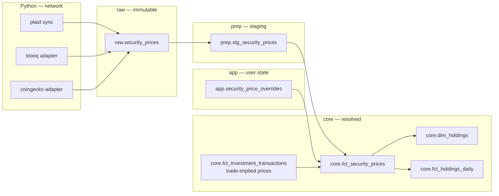

# Feature: Investment Price Feeds & Valuation

## Status
<!-- draft | ready | in-progress | implemented -->
ready

## Goal

Pillar C of the investments initiative (M1J.3). Store an append-only daily price
history for held securities, resolve one price per security per date from
competing sources, and publish holdings market value and unrealized gain/loss on
top of the shipped cost-basis engine.

MoneyBin computes cost basis today and no market value anywhere.
`core.dim_holdings` carries `quantity`, `cost_basis`, and `average_cost`;
`src/moneybin/sqlmesh/models/reports/net_worth.sql` reads `core.fct_balances_daily`
alone and excludes holdings entirely. A brokerage account therefore contributes
its cash balance to net worth and none of its positions. This spec closes that
gap and supplies the daily valued series Pillar D
(`investments-net-worth.md`) joins into `reports.net_worth`.

## Background

Pillars A+B shipped in [`investments-data-model.md`](investments-data-model.md)
(PR #300): the securities catalog, the 14-type investment-transaction ledger, the
four-method cost-basis engine, and derived lots, realized gains, and holdings.
[`sync-plaid-investments.md`](sync-plaid-investments.md) (PR #318) feeds that
ledger from Plaid.

Realized gain/loss is ledger-derived and needs no price. Unrealized gain/loss —
the paper value of what is still held — needs a current price for every open
position. That is the whole of Pillar C.

Two constraints shape the design before any choice is made:

1. **The extension seal.** `_seal_connection()` disables `HTTPFileSystem`,
   `S3FileSystem`, and `HuggingFaceFileSystem` and sets `lock_configuration=true`.
   No SQLMesh model reaches the network. Every price arrives through a Python
   fetch that lands in `raw.*`; models read from there.
2. **Prices are observations, not a cache.** A historical close is immutable.
   Volume is small enough to store outright: 100 securities × 252 trading days ×
   10 years is roughly 126,000 rows.

Related specs:

- [`investments-overview.md`](investments-overview.md) — the umbrella; fixes the
  contracts this child builds on.
- [`investments-data-model.md`](investments-data-model.md) — the ledger, lots,
  and cost-basis engine this values.
- [`sync-plaid-investments.md`](sync-plaid-investments.md) — supplies
  broker-carried prices and the holdings snapshots the divergence check reads.
- [`multi-currency.md`](multi-currency.md) — owns FX conversion (M1K.2); this
  spec stores a quote currency per price and converts nothing.
- [`asset-tracking.md`](asset-tracking.md) — defines the staleness vocabulary
  this spec is the first to implement.
- [`reports-net-worth.md`](reports-net-worth.md) — the cash-only net worth that
  Pillar D extends.

---

## Requirements

1. **Store an append-only daily price history.** One row per security, date,
   quote currency, and source. A stored row is never updated or deleted.
2. **Record what each source claimed it sent.** Every row carries a declared
   adjustment basis. Ingest rejects a row whose basis the adapter cannot state.
3. **Resolve one price per security per date**, deterministically, with the
   source that supplied it visible on the result.
4. **Value holdings as of a date** without a same-date price, by carrying the
   most recent earlier close forward, and mark every carried-forward value as
   such.
5. **Never present an unpriced holding as worth zero.** A holding with no usable
   price carries an explicit status that aggregates can detect.
6. **Let a user set a price by hand** for any security and date, including
   securities no feed covers. A later provider fetch never overwrites that mark.
7. **Surface staleness rather than repairing it.** Every valued row reports the
   date of the price it used and how old that price is.
8. **Refresh prices only on an explicit instruction**, or opportunistically
   during a sync that is already performing network work. A read path performs
   no network call.
9. **Withhold market value for a position whose share quantity is known to be
   wrong**, rather than publishing a confidently incorrect number.
10. **Ship without a network dependency.** Broker-carried prices already arrive
    through `sync pull`; phase C.1 uses them and adds no outbound call.

---

## Data model



### New table: `raw.security_prices`

The provider cache. Immutable, append-only, one row per observation.

| Column | Type | Notes |
|---|---|---|
| `security_id` | VARCHAR | FK to `app.securities` |
| `price_date` | DATE | the date the price applies to |
| `quote_currency` | VARCHAR | ISO 4217; the currency the price is expressed in |
| `source` | VARCHAR | `plaid`, `stooq`, `coingecko` — provider observations only |
| `close` | DECIMAL(28,10) | price of one unit |
| `price_basis` | VARCHAR | `raw`, `split_adjusted`, `split_and_dividend_adjusted` |
| `fetched_at` | TIMESTAMP | when the row was observed |

Primary key `(security_id, price_date, quote_currency, source)`.

**Quote currency belongs in the key.** A security quoted in two currencies — an
ADR against its ordinary listing, a venue reporting pence against another
reporting pounds — produces two legitimate prices for one security-date-source.
Without the column they collide and one silently overwrites the other. The column
also keeps a security price and a currency rate the same shape, so M1K.2 extends
this structure instead of introducing a second one beside it.

**`price_basis` is declared, never inferred.** The adapter states what the
provider documented itself as returning. An adapter that cannot state a basis
fails at ingest. Inferring the basis from the data — comparing close ratios
across a known split date, for instance — produces a guess that flips silently
when a provider changes policy.

### New table: `app.security_price_overrides`

User marks. Written through a `SecurityPriceRepo` per Invariant 10.

| Column | Type | Notes |
|---|---|---|
| `security_id` | VARCHAR | FK to `app.securities` |
| `price_date` | DATE | the date the mark applies to |
| `quote_currency` | VARCHAR | ISO 4217 |
| `close` | DECIMAL(28,10) | the user's price |
| `note` | VARCHAR | why the user set it |
| `created_at` | TIMESTAMP | |

Primary key `(security_id, price_date, quote_currency)`. No provider write
touches this table.

### New model: `prep.stg_security_prices`

Staging view over `raw.security_prices` — type casting, currency-code
normalization, and rejection of non-positive closes. Kind VIEW. Core models read
staging, never `raw` directly.

### New model: `core.fct_security_prices`

The resolved series. One row per `(security_id, price_date, quote_currency)`,
carrying the winning `close` plus `source` and `price_basis` as provenance.
Kind FULL.

It unions three inputs: provider observations from `raw.security_prices`, user
marks from `app.security_price_overrides` as `source = 'override'`, and
trade-implied prices derived from `core.fct_investment_transactions` as
`source = 'trade_implied'`. Only the first is a stored provider observation, so
only the first lives in `raw`; the other two are derived at model build.

Only `price_basis = 'raw'` is eligible for valuation. An adjusted series states a
price relative to the corporate actions known when it was fetched, so a row
fetched as `split_adjusted` in one year stops being correctly adjusted after the
next split. That makes an adjusted price unusable as a durable historical fact.
Adjusted rows are stored, visible, and excluded from valuation with the reason
recorded, rather than silently valued.

### Extended model: `core.dim_holdings`

Adds `market_value`, `unrealized_gain`, `price_date`, `price_source`,
`days_since_observed`, and `valuation_status`. The header comment stating that
"MoneyBin computes no market value until price feeds land" is removed.

### New model: `core.fct_holdings_daily`

Grain `(account_id, security_id, valuation_date)`. A forward-filled daily series
of `quantity × close`, following the `fct_balances_daily.py` Python-model
precedent. Every row carries `price_date`, `days_since_observed`, and
`valuation_status`. Kind FULL.

The date spine runs to `max(last_transaction_date, last_price_date)`, so a
position with no recent trades keeps being valued as long as prices arrive.

---

## Price resolution

Resolution answers one question: for a security, a quote currency, and an as-of
date, which price applies?

```
candidates = union of provider observations, overrides, and trade-implied prices
             where price_date <= as_of_date
               and price_basis = 'raw'
               and price_date >= first_available_price_on(security, source)

winner     = argmax(price_date), ties broken by source rank
```

**Bounded lookback.** Only prices dated on or before the as-of date are
candidates. A price observed after the valuation date never values it.

**As-of, not equal.** Markets close roughly 114 days a year between weekends and
holidays, and providers skip days beyond that. Resolution takes the most recent
earlier close, which is what makes a continuous daily series possible at all.

**Source rank breaks same-date ties**, in this order:

| Rank | Source | Rationale |
|---|---|---|
| 1 | `override` | The user stated it. |
| 2 | broker-carried (`plaid`) | The institution holding the position reported it. |
| 3 | market feed (`stooq`, `coingecko`) | A settled public close. |
| 4 | `trade_implied` | An execution price reflects one order's size and spread. |

**Freshness dominates rank.** An override applies to one
`(security_id, price_date, quote_currency)`. Within that date it beats every
provider row; across dates the latest price wins, including over an older
override. This is what `multi-currency.md` means by "a later provider refresh
never silently overwrites it" — the guarantee is per-date. A mark on
2026-07-12 survives any later re-fetch of 2026-07-12, and does not suppress a
2026-07-18 close.

**Cross-source disagreement is a signal.** Two sources agreeing on a date is
uninteresting; two sources disagreeing beyond a relative tolerance means one is
wrong. `system doctor` reports the disagreement rather than resolution silently
picking a winner.

### Trade-implied prices

An investment transaction carrying a per-unit `price` yields a price observation
for its trade date at `source = 'trade_implied'`, `price_basis = 'raw'`. An
executed trade is a raw observation by construction.

This is the only price a restricted-stock grant, a pre-IPO holding, an interval
fund, or a private placement will ever have. Without it those securities value at
nothing forever, and the user is asked to re-enter by hand a number already
recorded on the transaction.

### First-available floor

`first_available_price_on(security, source)` is the earliest date a source served
data for a security, derived as `MIN(price_date)` per `(security_id, source)` over
`raw.security_prices` — no separate storage. Forward-fill never reaches back past
it.

Without the floor, a position held in 2018 is valued from a 2024 listing price.
The carry rule looks backward for the most recent earlier close, and for a
security that listed in 2024 the earliest row that exists is already later than
the date being valued — so every pre-listing date resolves to the listing price
rather than to nothing.

---

## Staleness and valuation status

Every valued row carries `valuation_status`:

| Status | Meaning |
|---|---|
| `valued` | A price exists for the valuation date. |
| `carried_forward` | An earlier price was carried forward; `days_since_observed > 0`. |
| `unpriced` | No usable price. `market_value` is NULL. |
| `withheld` | Quantity is known to be wrong; see "Split desync". |

`unpriced` and `withheld` set `market_value` to NULL, never zero. A zero is
indistinguishable from a genuinely worthless position and silently understates
every aggregate that sums it. Consumers reporting a portfolio total report the
count of non-`valued` positions alongside it.

Staleness reuses the vocabulary `asset-tracking.md` establishes:
`days_since_observed` on the valued row, `staleness_threshold_days` resolving
per-security, then per-security-type default, then
`MoneyBinSettings.investments.price_staleness_default_days`. This spec is the
first implementation of that vocabulary; the shape it lands is the one physical
assets inherit.

`days_since_observed` counts calendar days. Type defaults absorb ordinary market
closure: 4 days for `equity`, `etf`, `mutual_fund`, and `bond`; 1 day for
`crypto`, which trades continuously. A Monday reading three days stale on an
equity is a normal weekend, not a fault.

---

## Split desync

Share quantity must be restated at a split for `quantity × price` to be correct.
MoneyBin models this today: `split` is one of the 14 ledger types, `quantity`
carries the multiplier (Decision D6), and `_apply_split` rescales every open lot
while preserving total basis.

Coverage is asymmetric by source. A manually recorded split reaches the
cost-basis engine and restates quantity. A Plaid-reported split is routed to
review with `review_reason = 'split_underivable'` and held out of
`core.fct_investment_transactions`, because a derived multiplier that is wrong
corrupts the basis of the whole position. Until that behavior is settled against
recorded provider payloads, a Plaid-synced position that splits reports the
pre-split quantity.

Publishing a market value against that quantity produces a number wrong by the
split factor while every other signal reads healthy. So Pillar C withholds it.

**Existing checks already detect the condition.** `investment_holdings_divergence`
compares `quantity` against `provider_reported_quantity` with exact inequality,
and `investment_staging_rejects` reports the held-out split at the moment it
arrives. Pillar C consumes those signals: a position flagged by either publishes
`valuation_status = 'withheld'` and a NULL `market_value`. It adds no second
alarm for a condition an existing check already covers.

**One gap needs a new check.** Divergence detection requires a broker snapshot to
compare against, so it is inert for a manual-only or disconnected account. For
those, `investment_price_discontinuity` reports a single-day market-value change
exceeding a threshold on a date with no transaction — the observable signature of
an unrecorded split or an adjustment-basis change.

Restoring symmetry between the manual and Plaid split paths is M1J.5, tracked
separately against the ledger rather than here.

---

## Provider adapters

Adapters live in `src/moneybin/connectors/prices/`, matching the
`connectors/gsheet/` shape: a network client that pulls into `raw.*`. Two
concrete modules behind one Protocol. Provider identity is data in the `source`
column, so nothing needs runtime registration.

```python
class PriceAdapter(Protocol):
    source: str
    price_basis: str

    def fetch(
        self, securities: Sequence[SecurityRef], start: date, end: date
    ) -> Sequence[PriceObservation]: ...
```

- **`stooq.py`** — equities, ETFs, and funds. No credential.
- **`coingecko.py`** — crypto, keyed by the `coingecko_id` already on
  `app.securities`. No credential.

Which securities to fetch, and for which dates, derives from holdings: a security
is fetched over the interval it was actually held, extended to today while the
position is open. Fetching every security ever seen across its full history
exhausts provider rate limits on every sync and stores data no report reads.

Failure handling follows `GSheetPullService`:

- **A batch reports partial success.** A refresh over 40 securities that loses 2
  reports 38 written and names the 2 with reasons.
- **An unreachable provider leaves stored prices in place.** Valuation continues
  from the last close with staleness rising. Withholding an entire portfolio
  valuation because one refresh failed is worse than the honest stale answer.
- **Rate limiting backs off exponentially**, on rate-limit responses only.
- **An undeclared `price_basis` fails ingest.**
- **A security no source covers** is reported in the refresh result and carries
  `valuation_status = 'unpriced'`.

New error types register with `classify_user_error`.

---

## CLI interface

```
moneybin investments prices sync [--securities TICKER ...] [--since DATE]
moneybin investments prices set SECURITY DATE PRICE [--currency CUR] [--note TEXT]
moneybin investments prices list SECURITY [--since DATE] [--source SRC]
```

`moneybin sync pull` refreshes prices for held securities as part of its existing
run. `investments holdings` and `investments gains` gain `market_value`,
`unrealized_gain`, and an as-of column reporting `price_date` and staleness.

Sensitivity is `high`, matching the tier MCP derives for cost-basis and quantity
data. Market values are the same class of data as the holdings they value.

## MCP interface

- `investments_prices_sync` — refresh; returns counts written, failed, and
  skipped, with per-security reasons.
- `investments_prices_set` — record a mark.

`investments_holdings` and `investments_gains` return `market_value`,
`price_date`, `days_since_observed`, and `valuation_status` per position, plus a
portfolio-level count of positions not in `valued` status. An agent reading a
total learns from the same response how much of it rests on stale or missing
prices.

---

## Testing strategy

- **Resolution comparator** — table-driven over the as-of date, source rank, and
  override matrix. Covers an override losing to a newer provider row, a future
  price never valuing a past date, and the first-available floor.
- **Split arithmetic** — a 2:1 split with historical quantity from the ledger,
  asserting pre-split dates value at the pre-split quantity and price. Then the
  desync case: a Plaid-held-out split publishes `withheld`, not a number.
- **Carry-forward** — a weekend and a holiday produce continuous daily rows with
  `carried_forward` status and correct `days_since_observed`.
- **Unpriced** — a security with no source yields NULL market value, and a
  portfolio total reports the uncounted position.
- **`price_basis` enforcement** — an adapter returning no basis fails ingest.
- **Adapter fixtures** — recorded provider responses. No test performs a network
  call.
- **Scenario coverage** for ingest → resolve → value → net worth.

A change to `core` grain requires `make test-scenarios`, which the default
`make check test` gate does not run.

---

## Implementation plan

Three phases, each independently shippable.

**C.1 — broker-carried prices and current value.** No network code. Route the
`close_price` and `institution_price` Plaid already delivers into
`raw.security_prices`, build `core.fct_security_prices`, extend
`core.dim_holdings`. Closes the no-market-value gap for every Plaid brokerage
user.

**C.2 — feeds, overrides, and staleness.** The two adapters, the override table
and repo, trade-implied prices, the first-available floor, staleness surfacing,
and the CLI and MCP surface.

**C.3 — the daily series.** `core.fct_holdings_daily` and
`investment_price_discontinuity`. Unblocks Pillar D.

### Files to create

- `src/moneybin/sql/schema/raw_security_prices.sql`
- `src/moneybin/sql/schema/app_security_price_overrides.sql`
- `src/moneybin/repositories/security_price_repo.py`
- `src/moneybin/sqlmesh/models/prep/stg_security_prices.sql`
- `src/moneybin/sqlmesh/models/core/fct_security_prices.sql`
- `src/moneybin/sqlmesh/models/core/fct_holdings_daily.py`
- `src/moneybin/connectors/prices/__init__.py`
- `src/moneybin/connectors/prices/protocol.py`
- `src/moneybin/connectors/prices/stooq.py`
- `src/moneybin/connectors/prices/coingecko.py`
- `src/moneybin/services/price_service.py`
- `src/moneybin/cli/commands/investments/prices.py`
- `src/moneybin/mcp/tools/investment_prices.py`

### Files to modify

- `src/moneybin/sqlmesh/models/core/dim_holdings.sql` — valuation columns
- `src/moneybin/sqlmesh/models/prep/stg_plaid__securities.sql` — route
  `close_price` into the price cache
- `src/moneybin/services/doctor_service.py` — `investment_price_discontinuity`
- `src/moneybin/config.py` — staleness defaults, backfill bound
- `src/moneybin/tables.py` — new table constants
- `src/moneybin/cli/commands/investments/__init__.py` — register `prices`
- `docs/specs/INDEX.md`, `docs/specs/investments-overview.md`,
  `docs/roadmap.md`, `CHANGELOG.md`

---

## Out of scope

- **FX conversion.** Prices store a quote currency and convert nothing. M1K.2
  owns conversion, and the `quote_currency` column is what lets it extend this
  table rather than add another.
- **Price inversion and triangulation.** Deriving a price through an
  intermediate currency belongs to the conversion layer.
- **Alternative valuation-date policies.** This spec materializes one number per
  position per date: the close for that date. The underlying series stays intact,
  so cost-basis, at-transaction-date, and restate-at-a-fixed-date policies remain
  derivable without a schema change.
- **Intraday and real-time quotes.** Daily grain only.
- **Bid, ask, and NAV as distinct price types.** One close per source per date.
- **Benchmark comparison, time-weighted and money-weighted return.**
- **Options, derivatives, short positions.**
- **Tier 3, a sync-brokered keyed provider.** The `source` column and resolution
  rule accommodate it; nothing cross-repo lands here.
- **Split-source symmetry.** M1J.5.

---

## Key decisions

- **Quote currency is part of the price key.** A security legitimately carries
  two prices for one date when quoted in two currencies. Excluding the column
  loses one of them silently, and forces currency rates into a second table with
  a second resolution path.

- **One `raw` table with a `source` column, not a table per provider.**
  `investments-data-model.md` establishes per-provider raw tables for entities
  pulled from a provider's API — transactions, holdings, securities — because
  each provider's payload has its own shape. A price observation has one shape
  regardless of who supplied it: security, date, currency, close. It is a
  reference series, matching the `raw.exchange_rates` pattern `multi-currency.md`
  sets for the same reason. Keeping sources in one table is also what makes
  same-date cross-source disagreement detectable in a single query.

- **Adjustment basis is declared by the adapter, never inferred.** Inference from
  price ratios across a split date is a guess that flips silently when a provider
  changes policy. A source that cannot state its basis is not ingested.

- **Only raw prices value holdings.** An adjusted series is stated relative to the
  corporate actions known when it was fetched, so it stops being correct after
  the next one. Ledger quantity already reflects splits as of each date; raw
  price is its correct multiplicand. Adjusted rows are stored and excluded with
  the reason recorded.

- **Resolution is as-of and bounded.** The most recent close on or before the
  valuation date. Equality would leave holes on every non-trading day; unbounded
  lookahead would value a past date with a price observed later.

- **Freshness dominates source rank; overrides are per-date.** Rank decides only
  same-date ties. This reconciles a user mark that must survive re-fetch with a
  series that must stay current.

- **An unpriced holding is NULL, never zero.** Zero is indistinguishable from a
  worthless position and understates every aggregate silently. Status travels
  with the value so consumers, including agents, cannot render a number without
  its caveat.

- **A known-wrong quantity withholds the value.** A Plaid-synced position whose
  split was held out reports the pre-split quantity. Publishing
  `quantity × price` there yields a number wrong by the split factor with no
  other signal of trouble.

- **Split desync reuses the existing doctor checks.**
  `investment_holdings_divergence` and `investment_staging_rejects` already
  detect it. A new check covers only the case they cannot see: an account with no
  broker snapshot to compare against.

- **Trade-implied prices are a source.** An executed trade is a raw observation,
  and for a restricted grant, a pre-IPO holding, or a private fund it is the only
  price that will ever exist.

- **Refresh is explicit; read paths never fetch.** Two identical commands return
  the same number, an offline machine still values a portfolio, and a report does
  not block on HTTP. Staleness is surfaced instead, which is the same posture
  `investments-overview.md` sets for prices generally.

- **Fetch scope derives from holdings.** A security is fetched over the interval
  it was held. Fetching everything ever seen exhausts rate limits and stores rows
  no report reads.

---

## Open questions

- **stooq coverage and terms.** Its equity and ETF breadth against a real
  portfolio, and its terms for programmatic access, need checking before C.2 is
  built. If coverage falls short for mutual funds, the override path covers the
  remainder and the gap is visible rather than silent. Settled by: a coverage
  probe against the author's own holdings.

- **Backfill depth on first fetch.** The proposal is each security's earliest
  acquisition date, bounded by a configurable cap. A fixed window is simpler and
  loses early history. Settled by: measuring a first-run fetch against a real
  portfolio in C.2.

- **Whether hosted deployments fetch prices for users.** This decides tier 3's
  shape: a server-side key with pooled rate limits, or per-user credentials. The
  contract accommodates either. Settled by: the M3H hosted launch decision.
