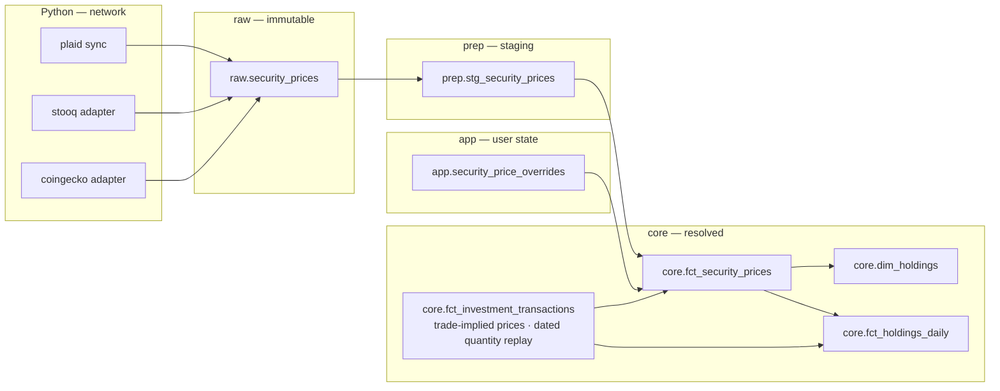

# Feature: Investment Price Feeds & Valuation

## Status
<!-- draft | ready | in-progress | implemented -->
in-progress

## Goal

Pillar C of the investments initiative (M1J.3). Store an append-only daily price
history for held securities, resolve one price per security per date from
competing sources, and publish holdings market value and unrealized gain/loss on
top of the shipped cost-basis engine.

Phase C.1 shipped: `core.dim_holdings` carries `market_value`, `unrealized_gain`,
`price_date`, `price_source`, `days_since_observed`, and `valuation_status` beside
`quantity`, `cost_basis`, and `average_cost`, valued from the close Plaid already
delivers in its existing sync payload. External feeds, manual overrides, and
trade-implied prices (C.2) and the daily valued series (C.3) remain designed.
`src/moneybin/sqlmesh/models/reports/net_worth.sql` reads `core.fct_balances_daily`
alone and excludes holdings entirely. A brokerage account therefore contributes
its cash balance to net worth and none of its positions. This spec closes that
gap and supplies the daily valued series Pillar D
(`investments-net-worth.md`) joins into `reports.net_worth`.

## Background

Pillars A+B shipped in [`investments-data-model.md`](investments-data-model.md)
(PR #300): the securities catalog, the 14-type investment-transaction ledger, the
four-method cost-basis engine, and derived lots, realized gains, and holdings.
[`sync-plaid-investments.md`](sync-plaid-investments.md) (PR #318) feeds that
ledger from Plaid.

Realized gain/loss is ledger-derived and needs no price. Unrealized gain/loss —
the paper value of what is still held — needs a current price for every open
position. That is the whole of Pillar C.

Two constraints shape the design before any choice is made:

1. **The extension seal.** `_seal_connection()` disables `HTTPFileSystem`,
   `S3FileSystem`, and `HuggingFaceFileSystem` on every connection; read-only
   opens additionally set `lock_configuration=true`. The filesystem disable
   alone is what closes the network, and it applies to the write connections
   SQLMesh transforms run on. No SQLMesh model reaches the network. Every price
   arrives through a Python fetch that lands in `raw.*`; models read from there.
2. **Prices are observations, not a cache.** A historical close is immutable.
   Volume is small enough to store outright: 100 securities × 252 trading days ×
   10 years is roughly 126,000 rows.

Related specs:

- [`investments-overview.md`](investments-overview.md) — the umbrella; fixes the
  contracts this child builds on.
- [`investments-data-model.md`](investments-data-model.md) — the ledger, lots,
  and cost-basis engine this values.
- [`sync-plaid-investments.md`](sync-plaid-investments.md) — supplies
  broker-carried prices and the holdings snapshots the divergence check reads.
- [`multi-currency.md`](multi-currency.md) — owns FX conversion (M1K.2); this
  spec stores a quote currency per price and converts nothing.
- [`asset-tracking.md`](asset-tracking.md) — defines the staleness vocabulary
  this spec is the first to implement.
- [`reports-net-worth.md`](reports-net-worth.md) — the cash-only net worth that
  Pillar D extends.

---

## Requirements

1. **Store an append-only daily price history.** One row per security, date,
   quote currency, and source. A stored row is never updated or deleted.
2. **Record what each source claimed it sent.** Every row carries a declared
   adjustment basis. Ingest rejects a row whose basis the adapter cannot state.
3. **Resolve one price per security per date**, deterministically, with the
   source that supplied it visible on the result.
4. **Value holdings as of a date** without a same-date price, by carrying the
   most recent earlier close forward, and mark every carried-forward value as
   such.
5. **Never present an unpriced holding as worth zero.** A holding with no usable
   price carries an explicit status that aggregates can detect.
6. **Let a user set a price by hand** for any security and date, including
   securities no feed covers. A later provider fetch never overwrites that mark.
7. **Surface staleness rather than repairing it.** Every valued row reports the
   date of the price it used and how old that price is.
8. **Refresh prices only on an explicit instruction**, or opportunistically
   during a sync that is already performing network work. A read path performs
   no network call.
9. **Withhold market value for a position whose share quantity is known to be
   wrong**, rather than publishing a confidently incorrect number.
10. **Ship without a network dependency.** Broker-carried prices already arrive
    through `sync pull`; phase C.1 uses them and adds no outbound call.

---

## Data model



### New table: `raw.security_prices`

The provider cache. Immutable, append-only, one row per observation.

| Column | Type | Notes |
|---|---|---|
| `provider_security_key` | VARCHAR | the provider's own identifier — Plaid's `security_id`, a ticker, a `coingecko_id` |
| `price_date` | DATE | the date the price applies to |
| `quote_currency` | VARCHAR | ISO 4217; the currency the price is expressed in |
| `source` | VARCHAR | `plaid`, `stooq`, `coingecko` — provider observations only |
| `source_origin` | VARCHAR | which connection produced it; `''` for single-tenant feeds |
| `close` | DECIMAL(28,10) | price of one unit |
| `price_basis` | VARCHAR | `raw`, `split_adjusted`, `split_and_dividend_adjusted` |
| `extracted_at` | TIMESTAMP | when the provider served the observation |
| `loaded_at` | TIMESTAMP | when the row was written locally |

Primary key
`(source, source_origin, provider_security_key, price_date, quote_currency)`.

**Append-only is enforced by the conflict mode, not by convention.**
`Database.ingest_dataframe` offers four modes and only one preserves
immutability. The default `insert` raises on a primary-key conflict, so
re-running a sync that re-reports a stored close fails the pull outright.
`upsert` — what every other Plaid `_load_*` uses — overwrites in place, which is
exactly the mutation this table exists to prevent. Prices therefore write with
`on_conflict="ignore"`: the first observation for a key is kept and later
re-reports of the same key are dropped. The seed store
(`extractors/pdf/seed_store.py`) already uses this mode for the same reason.

**The timestamp pair matches every other raw table.** `extracted_at` is the
provider's own serve instant (for Plaid, `sync_data.metadata.synced_at`) and
`loaded_at` is the local insert instant. This is the same pair
`raw.plaid_securities` and every sibling carries, so it is named the same here
rather than introducing a third term for a concept the schema already has.
Both columns are `pl.Datetime(time_zone="UTC")` on the Polars side; any DATE
derived from them must go through the extractor's `_utc_date` helper, because
DuckDB rebases a tz-aware value into the session zone on insert and a naive
`::DATE` cast would record the local calendar date.

**`raw` stores the provider's key, not the canonical one.** Canonical
`security_id` is minted by `SecurityResolver`, which `sync_service.pull()` runs
*after* `_load_securities()`. An extractor writing at ingestion time therefore
does not yet have it, and on a first pull for a new security it cannot: it would
have to write an orphan FK or drop the observation. Storing the provider key
matches every other `raw.plaid_*` table, and resolution to `security_id` happens
in staging where the link tables are available — the layer that exists for
exactly this normalization.

**`source_origin` keeps two connections from colliding.** Two linked Plaid items
can each report a close for the same security on the same date. Without the
column those are one row by identity, so an append-only table must either reject
the second or lose it. `source_origin` mirrors the column
`raw.plaid_securities` already carries. Feeds with a single global answer —
stooq, CoinGecko — write `''`.

**Only `close_price` becomes a price row.** Plaid carries two price-shaped
fields, and they are not the same kind of fact. `close_price` on the security
record is a security-level close and belongs here. `institution_price` on a
holding is a per-`(account, security)` valuation, not a property of the security.
Routing both into one security-grain table would collide two different
measurements under one key. `institution_price` reaches
`prep.stg_plaid__investment_holdings` and stops there; `core.dim_holdings`
carries the separate `institution_value` field as `provider_reported_value`
under the store-don't-trust convention, so the per-account signal is already
retained at the grain that fits it.

**Quote currency belongs in the key.** A security quoted in two currencies — an
ADR against its ordinary listing, a venue reporting pence against another
reporting pounds — produces two legitimate prices for one security-date-source.
Without the column they collide and one silently overwrites the other. The column
also keeps a security price and a currency rate the same shape, so M1K.2 extends
this structure instead of introducing a second one beside it.

**`price_basis` is declared, never inferred.** The adapter states what the
provider documented itself as returning. An adapter that cannot state a basis
fails at ingest. Inferring the basis from the data — comparing close ratios
across a known split date, for instance — produces a guess that flips silently
when a provider changes policy.

### New table: `app.security_price_overrides`

User marks. Written through a `SecurityPriceRepo` per Invariant 10.

| Column | Type | Notes |
|---|---|---|
| `security_id` | VARCHAR | FK to `app.securities` |
| `price_date` | DATE | the date the mark applies to |
| `quote_currency` | VARCHAR | ISO 4217 |
| `close` | DECIMAL(28,10) | the user's price |
| `note` | VARCHAR | why the user set it |
| `created_at` | TIMESTAMP | |

Primary key `(security_id, price_date, quote_currency)`. No provider write
touches this table.

### New model: `prep.stg_security_prices`

Staging view over `raw.security_prices`. Kind VIEW. Core models read staging,
never `raw` directly.

It does three things: casts types and normalizes currency codes, rejects
non-positive closes, and **resolves `provider_security_key` to the canonical
`security_id`** through the same link tables `SecurityResolver` populates. A row
whose provider key has not resolved yet stays in `raw` and is absent from
staging — it is not dropped, and it appears once its security resolves.
`investment_unresolved_securities` already reports that backlog.

**Every provider resolves the same way, including the keyless feeds.**
`app.security_links` is already provider-neutral by design — its header calls
`(source_type, ref_kind, ref_value)` the strong-ref key and its `source_type`
comment reads "plaid (future: ofx institutions, ...)" — but its `ref_kind` CHECK
admits only `plaid_security_id` and `institution_security_id`. C.2 extends that
CHECK with `stooq_ticker` and `coingecko_slug` in a migration, and the adapters
bind through `SecurityLinksRepo` exactly as the Plaid path does.

The two alternatives were considered and rejected against existing rules.
Resolving at fetch time, since the adapter already holds a canonical
`SecurityRef`, would leave Plaid resolving in staging and market feeds resolving
in Python — two mechanisms for one job, which the coherence rule names as the
largest source of rot. Binding through the `ticker` and `coingecko_id` columns
`app.securities` already carries is cheaper still, but it is a text-keyed
cross-table reference: `identifiers.md` Guard 3 requires the FK, and lists the
`LOWER(ticker) = LOWER(?)` predicate such a join needs as a smell that the FK is
missing. It also cannot disambiguate one ticker listed on two exchanges, and it
records no audit trail for the binding.

Extending the CHECK costs one migration per new provider. That is the price of a
single resolution path whose bindings are reversible, audited, and uniform — and
`app.*` schema is a one-way door, so the cheap shape is the expensive one.

### New model: `core.fct_security_prices`

The resolved series. One row per `(security_id, price_date, quote_currency)`,
carrying the winning `close` plus `source` and `price_basis` as provenance.
Kind FULL.

It unions three inputs: provider observations from `raw.security_prices`, user
marks from `app.security_price_overrides` as `source = 'override'`, and
trade-implied prices derived from `core.fct_investment_transactions` as
`source = 'trade_implied'`. Only the first is a stored provider observation, so
only the first lives in `raw`; the other two are derived at model build.

Only `price_basis = 'raw'` is eligible for valuation. An adjusted series states a
price relative to the corporate actions known when it was fetched, so a row
fetched as `split_adjusted` in one year stops being correctly adjusted after the
next split. That makes an adjusted price unusable as a durable historical fact.
Adjusted rows are stored, visible, and excluded from valuation with the reason
recorded, rather than silently valued.

### Extended model: `core.dim_holdings`

Adds `market_value`, `unrealized_gain`, `price_date`, `price_source`,
`days_since_observed`, and `valuation_status`. Shipped in C.1, which also
rewrote the two comments the change made stale — the header's cost-basis-only
note and the parenthetical on `provider_reported_value` that described MoneyBin
as computing no market value.

### New model: `core.fct_holdings_daily`

Grain `(account_id, security_id, valuation_date)`. A forward-filled daily series
of `quantity × close`, following the `fct_balances_daily.py` Python-model
precedent. Every row carries `price_date`, `days_since_observed`, and
`valuation_status`. Kind FULL.

**Quantity comes from replaying the ledger, not from any derived table.**
`core.dim_holdings` has grain `(account_id, security_id)` and reports the
position as it stands now, so multiplying it by a historical close would value
every past date at today's share count — wrong for every position touched by a
buy, sale, transfer, or split.

`core.fct_investment_lots` cannot supply it either, and the reason matters. That
model stores each lot's *final* state: `remaining_quantity` is what survives
after every disposal, with no disposal date recorded, so a fully-sold lot reads
zero on every historical date rather than on the dates after its sale. Worse for
this spec's purpose, `_apply_split` scales `original_quantity` and
`remaining_quantity` in place, so the stored numbers are post-split on every
date — reading them for a pre-split date reintroduces exactly the double-count
`price_basis = 'raw'` exists to prevent.

So `fct_holdings_daily` **replays `core.fct_investment_transactions`** — the
ledger the umbrella names as the source of truth — accumulating quantity per
`(account_id, security_id)` forward through the date spine, applying each event
on its own date and each split multiplier on the split's date. This is the same
sequential-replay shape `fct_investment_lots.py` already uses and the reason both
are Python models rather than SQL: the state at each date depends on the state
before it.

**One quote currency per position, chosen explicitly.** `fct_security_prices`
permits several `quote_currency` rows for one security and date, while this model
is position-grain and omits currency. Joining on security and date alone would
either fan the grain out or value a holding at a close denominated differently
from its own cost basis. For the no-FX phase the join requires
`quote_currency = dim_holdings.currency_code`; a position whose currency has no
price row is `unpriced`, not silently valued in another currency. M1K.2 replaces
this constraint with conversion.

**The spine is global and runs through today.** It starts at the earliest
transaction across all positions and ends at `today`, matching
`fct_balances_daily.py`, whose spine must end at the newest observation across
all accounts rather than each account's own. A per-position bound would drop a
position out of `reports.net_worth` the moment its own data went stale while
other positions kept valuing — a silent, load-bearing omission. Ending the spine
at the last price would also make carry-forward unobservable: weekends, holidays,
and provider outages are exactly when a carried-forward value with rising
`days_since_observed` needs to be published. An open position with no price at
all still emits rows, carrying `valuation_status = 'unpriced'`.

**Pre-window dates report no value, and say why.** Plaid's transaction window is
roughly 24 months while its holdings snapshot reports the whole position, so an
established account's long-held shares enter the ledger as synthetic
`opening_bootstrap` rows dated `window_start - 1 day`
(`prep.stg_plaid__opening_lots`). Replaying the ledger therefore yields no
quantity for any earlier date. Those dates carry
`valuation_status = 'unreconstructable'` and a NULL market value — never zero,
which would be indistinguishable from a genuinely empty portfolio and would
silently understate every aggregate that sums it.

**Why the broker's own acquisition dates do not rescue this.** The bootstrap
preserves each lot's real date in `original_acquisition_date`, so seeding those
lots at that date rather than at the window boundary looks like free history. It
is not, and the reason is worth recording so the idea is not re-attempted.
Plaid's `tax_lots[]` reports the **current, post-split** quantity beside the
**pre-split** acquisition date. Valuing that quantity against the raw,
unadjusted closes this spec stores overstates the position by the full split
factor: a lot of 25 shares bought before a 4:1 split is reported as 100 shares
dated to the original purchase, and 100 shares against a pre-split close is four
times the truth.

Nothing detects it. `prep.int_plaid__opening_positions` guards only
`has_in_window_split` (`sp.trade_date >= p.window_start`), and a pre-window split
produces no in-window transaction for Plaid to reject, so the
`split_underivable` path never fires either. The error would be silent, smooth,
and in the wrong direction — an overstatement, not the conservative floor it
first appears to be.

The pairing that *is* sound is post-split quantity against a **split-adjusted**
series, which is correct precisely because both sides are restated. That is
genuine design work — sourcing an adjusted series, owning its refresh obligation
after every corporate action, and reconciling it with this spec's raw-only
storage rule — and it belongs to **M1J.6**, not to a clause here. Until it
lands, an honest NULL beats a plausible wrong number: a missing value that names
its reason is recoverable, while a published value that later has to be retracted
is not.

---

## Price resolution

Resolution answers one question: for a security, a quote currency, and an as-of
date, which price applies?

```
candidates = union of provider observations, overrides, and trade-implied prices
             where price_date <= as_of_date
               and price_basis = 'raw'
               and (source not in ('plaid', 'stooq', 'coingecko')   -- non-provider
                    or price_date >= first_available_price_on(security, source))

winner     = first row ordered by
               price_date DESC,          -- freshness dominates
               source_rank ASC,          -- then declared precedence
               source_origin ASC,        -- then the connection
               observation_key ASC       -- then the row's own identifier
```

The floor applies to provider observations only, predicated on **source
identity** rather than rank. Overrides and trade-implied prices are not rows in
`raw.security_prices`, so their floor evaluates to NULL and `price_date >= NULL`
would silently discard every one of them, taking manual valuation for feedless
securities with it. Rank cannot carry this test: `override` is rank 1 and
`trade_implied` is rank 5, so no threshold separates the two non-provider sources
from the three provider ones.

The ordering is a **total** order, not a partial one. `price_date` and
`source_rank` alone leave ties: two Plaid connections differ only by
`source_origin`, and several trade-implied executions can share one day. Without
the last two keys a rebuild can select a different price — or the same price with
different reported provenance — from identical inputs. `observation_key` is the
row's own unique identifier: `provider_security_key` for a provider observation,
the transaction id for a trade-implied one.

**Bounded lookback.** Only prices dated on or before the as-of date are
candidates. A price observed after the valuation date never values it.

**As-of, not equal.** Markets close roughly 114 days a year between weekends and
holidays, and providers skip days beyond that. Resolution takes the most recent
earlier close, which is what makes a continuous daily series possible at all.

**Source rank breaks same-date ties.** It is a total order over sources, not a
grouping — two sources sharing a tier would leave `argmax` with multiple winners
and let a rebuild pick a different price each time, which fails the
deterministic-resolution requirement.

| Rank | Source | Rationale |
|---|---|---|
| 1 | `override` | The user stated it. |
| 2 | `plaid` | The institution holding the position reported it. |
| 3 | `stooq` | A settled public close. |
| 4 | `coingecko` | A settled public close; ranked below stooq only to break ties, since the two never cover the same security. |
| 5 | `trade_implied` | An execution price reflects one order's size and spread. |

A new adapter takes the next free rank. Where two providers disagree on the same
date the rank picks one deterministically and `system doctor` reports the
disagreement — resolution stays stable, and the conflict stays visible.

**Freshness dominates rank.** An override applies to one
`(security_id, price_date, quote_currency)`. Within that date it beats every
provider row; across dates the latest price wins, including over an older
override. This is what `multi-currency.md` means by "a later provider refresh
never silently overwrites it" — the guarantee is per-date. A mark on
2026-07-12 survives any later re-fetch of 2026-07-12, and does not suppress a
2026-07-18 close.

**Cross-source disagreement is a signal.** Two sources agreeing on a date is
uninteresting; two sources disagreeing beyond a relative tolerance means one is
wrong. `system doctor` reports the disagreement rather than resolution silently
picking a winner — an inference that could be wrong surfaces where it happens
rather than resolving quietly.

The check is `investment_price_disagreement`, a sibling to
`investment_price_discontinuity`: it fires when two *provider* sources —
`source IN ('plaid', 'stooq', 'coingecko')` — hold rows for the same
`(security_id, price_date, quote_currency)` differing by more than
`price_disagreement_tolerance_pct` (a config field, following the staleness
defaults). The comparison is deliberately restricted to provider closes, because
the other two sources are *expected* to differ: an override exists precisely to
correct a close the user believes is wrong, and a trade-implied price reflects
one execution's size and spread rather than the day's close. Comparing those
against a provider row would raise a standing warning on every ordinary
correction and every intraday fill.

The two are separate checks because their remedies differ — a discontinuity says
distrust a *day*, a disagreement says distrust a *feed* — and a single merged
finding could not say which. It lands in C.2, the first phase in which a security
can carry two sources at all.

### Trade-implied prices

An investment transaction carrying a per-unit `price` yields a price observation
for its trade date at `source = 'trade_implied'`, `price_basis = 'raw'`. An
executed trade is a raw observation by construction.

This is the only price a restricted-stock grant, a pre-IPO holding, an interval
fund, or a private placement will ever have. Without it those securities value at
nothing forever, and the user is asked to re-enter by hand a number already
recorded on the transaction.

### First-available floor

`first_available_price_on(security, source)` is the earliest date a source served
data for a security, derived as `MIN(price_date)` per `(security_id, source)` over
`raw.security_prices` — no separate storage. Forward-fill never reaches back past
it.

Without the floor, a position held in 2018 is valued from a 2024 listing price.
The carry rule looks backward for the most recent earlier close, and for a
security that listed in 2024 the earliest row that exists is already later than
the date being valued — so every pre-listing date resolves to the listing price
rather than to nothing.

---

## Staleness and valuation status

Every valued row carries `valuation_status`:

| Status | Meaning |
|---|---|
| `valued` | A price exists for the valuation date. |
| `carried_forward` | An earlier price was carried forward; `days_since_observed > 0`. |
| `unpriced` | No usable price. `market_value` is NULL. |
| `unreconstructable` | Quantity is unknown for this date. `market_value` is NULL. |
| `withheld` | Quantity is known to be wrong; see "Split desync". |

`unpriced`, `unreconstructable`, and `withheld` set `market_value` to NULL, never
zero. A zero is indistinguishable from a genuinely worthless position and
silently understates every aggregate that sums it. Consumers reporting a
portfolio total report the count of non-`valued` positions alongside it.

The three non-`valued` NULL statuses are distinct on purpose, because each has a
different remedy: `unpriced` wants a price feed, `unreconstructable` wants
earlier transaction history, and `withheld` wants a split reconciled. Collapsing
them into one "no value" state would tell the user something is missing without
telling them what to do about it.

Every status either carries a number the user can rely on or carries none at all.
No status publishes a qualified figure, because a qualification the reader cannot
evaluate is not a disclosure — and a number that later has to be retracted costs
more trust than a NULL that named its reason from the start.

Staleness reuses the vocabulary `asset-tracking.md` establishes:
`days_since_observed` on the valued row, `staleness_threshold_days` resolving
per-security, then per-security-type default, then
`MoneyBinSettings.investments.price_staleness_default_days`. This spec is the
first implementation of that vocabulary; the shape it lands is the one physical
assets inherit.

`days_since_observed` counts calendar days. Type defaults absorb ordinary market
closure: 4 days for `equity`, `etf`, `mutual_fund`, and `bond`; 1 day for
`crypto`, which trades continuously. A Monday reading three days stale on an
equity is a normal weekend, not a fault.

---

## Split desync

Share quantity must be restated at a split for `quantity × price` to be correct.
MoneyBin models this today: `split` is one of the 14 ledger types, `quantity`
carries the multiplier (Decision D6), and `_apply_split` rescales every open lot
while preserving total basis.

Coverage is asymmetric by source. A manually recorded split reaches the
cost-basis engine and restates quantity. A Plaid-reported split is routed to
review with `review_reason = 'split_underivable'` and held out of
`core.fct_investment_transactions`, because a derived multiplier that is wrong
corrupts the basis of the whole position. Until that behavior is settled against
recorded provider payloads, a Plaid-synced position that splits reports the
pre-split quantity.

Publishing a market value against that quantity produces a number wrong by the
split factor while every other signal reads healthy. So Pillar C withholds it.

**Existing checks already detect the condition, but their result is too coarse to
consume whole.** `investment_holdings_divergence` compares `quantity` against
`provider_reported_quantity` with exact inequality — and also fails on a pure
cost-basis mismatch where quantity agrees. `investment_staging_rejects` fires on
any non-null `review_reason`, including `unmapped_subtype` and
`transfer_direction_underivable`. Neither of those implies a wrong quantity, and
market value is `quantity × price` — it does not depend on cost basis at all.
Gating on the aggregate check result would withhold a correct market value for
unrelated reasons, contradicting Requirement 9.

So withholding uses a **quantity-specific predicate over the same underlying
data**, evaluated per position:

```
withheld = quantity <> provider_reported_quantity          -- the divergence
                                                            -- check's quantity leg
           or exists a staging row for this security with
              review_reason = 'split_underivable'
              whose trade_date is not already covered by a
              'split' event in THIS position's own ledger   -- detected per
                                                            -- security, resolved
                                                            -- per position
           or the position is flagged by
              investment_phantom_holdings                   -- broker no longer
                                                            -- reports it
```

**The split clause is detected per security and resolved per position, and both
halves are load-bearing.** A split is a corporate action on the security, so a
reject arriving through one account is evidence that *every* position in that
security may carry a pre-split quantity — scoping detection to the rejecting
account would leave sibling positions valued at a quantity wrong by the split
factor, which is the exact harm this section exists to prevent. But a position
whose own ledger already carries a `split` event on that date has been restated
correctly, whether the user entered it manually or another source supplied it,
and withholding it would suppress a right answer.

Checking the position's own ledger also makes the clause self-clearing: when the
Plaid split behavior is settled and the events reach
`core.fct_investment_transactions`, positions stop withholding without a separate
resolved-flag to maintain. `prep.stg_plaid__investment_transactions` exposes
canonical `account_id`, `security_id`, and `trade_date` on the reject row, so the
predicate needs no new plumbing.

The third clause is not redundant with the first. When a fresh snapshot omits a
position the ledger still carries, `provider_reported_quantity` is NULL, so
`quantity <> provider_reported_quantity` evaluates to UNKNOWN rather than true
and the position slips through — publishing a market value for shares the broker
says are gone, and overstating net worth by exactly that amount.
`investment_phantom_holdings` already identifies this case, including shares left
open by an unmodeled option assignment.

Pillar C reuses those two signals and adds no second
alarm for a condition an existing check already covers.

**One gap needs a new check.** Divergence detection requires a broker snapshot to
compare against, so it is inert for a manual-only or disconnected account. For
those, `investment_price_discontinuity` reports a single-day market-value change
exceeding a threshold on a date with no transaction — the observable signature of
an unrecorded split or an adjustment-basis change.

Restoring symmetry between the manual and Plaid split paths is M1J.5, tracked
separately against the ledger rather than here.

---

## Provider adapters

Adapters live in `src/moneybin/connectors/prices/`, matching the
`connectors/gsheet/` shape: a network client that pulls into `raw.*`. Two
concrete modules behind one Protocol. Provider identity is data in the `source`
column, so nothing needs runtime registration.

```python
class PriceAdapter(Protocol):
    source: str
    price_basis: str

    def fetch(
        self, securities: Sequence[SecurityRef], start: date, end: date
    ) -> Sequence[PriceObservation]: ...
```

- **`stooq.py`** — equities, ETFs, and funds. No credential.
- **`coingecko.py`** — crypto, keyed by the `coingecko_id` already on
  `app.securities`. No credential.

Which securities to fetch, and for which dates, derives from holdings: a security
is fetched over the interval it was actually held, extended to today while the
position is open. Fetching every security ever seen across its full history
exhausts provider rate limits on every sync and stores data no report reads.

Failure handling follows `GSheetPullService`:

- **A batch reports partial success.** A refresh over 40 securities that loses 2
  reports 38 written and names the 2 with reasons.
- **An unreachable provider leaves stored prices in place.** Valuation continues
  from the last close with staleness rising. Withholding an entire portfolio
  valuation because one refresh failed is worse than the honest stale answer.
- **Rate limiting backs off exponentially**, on rate-limit responses only.
- **An undeclared `price_basis` fails ingest.**
- **A security no source covers** is reported in the refresh result and carries
  `valuation_status = 'unpriced'`.

New error types register with `classify_user_error`.

---

## CLI interface

```
moneybin investments prices sync [--securities TICKER ...] [--since DATE]
moneybin investments prices set SECURITY DATE PRICE [--currency CUR] [--note TEXT]
moneybin investments prices delete SECURITY DATE [--currency CUR]
moneybin investments prices list SECURITY [--since DATE] [--source SRC]
```

`delete` removes a manual mark and returns that date to provider-derived
valuation. Without it an override is unreachable once written: source precedence
makes it beat every provider row for its date, and `set` can only replace the
value while keeping `source = 'override'` provenance. `surface-design.md` also
requires a paired `_delete` for this mutation shape.

`moneybin sync pull` refreshes prices for held securities as part of its existing
run. `investments holdings` gains `market_value`, `unrealized_gain`, and an as-of
column reporting `price_date` and staleness. `investments gains` does not: it
reports realized disposals for 1099-B reconciliation, where the sale price is the
recorded one and a current market close has no bearing.

Sensitivity is `high`, matching the tier MCP derives for cost-basis and quantity
data. Market values are the same class of data as the holdings they value.

## MCP interface

- `investments_prices_sync` — refresh; returns counts written, failed, and
  skipped, with per-security reasons.
- `investments_prices_list` — the observation history for a security: every
  stored row with its `source`, `price_date`, `quote_currency`, `price_basis`,
  and whether it is the resolved winner for its date.
- `investments_prices_set` — record a mark.
- `investments_prices_delete` — remove a mark, returning the date to
  provider-derived valuation.

`investments_prices_list` is not optional ergonomics. `mcp.md` makes MCP exposure
the default and admits only two exceptions — secret material and hands-on
operator territory — and price history is neither. It also closes a concrete gap:
an agent about to call `_set` cannot otherwise discover that an override already
exists for that date, because `investments_holdings` reports the *resolved* value
and not the observations behind it. Writing blind over an existing mark is
exactly the silent action `design-principles.md` requires a surface for.

The grain differs from `investments_holdings` — observations per security-date
rather than one row per position — which is why it is a separate tool rather than
a flag on the holdings response.

`investments_holdings` returns `market_value`, `price_date`,
`days_since_observed`, and `valuation_status` per position, plus a
portfolio-level count of positions not in `valued` status. An agent reading a
total learns from the same response how much of it rests on stale or missing
prices. `investments_gains` does not carry these columns: it reports realized
disposals for 1099-B reconciliation, where the sale price is the recorded one
and a current market close has no bearing.

---

## Testing strategy

- **Resolution comparator** — table-driven over the as-of date, source rank, and
  override matrix. Covers an override losing to a newer provider row, a future
  price never valuing a past date, and the first-available floor.
- **Split arithmetic** — a 2:1 split with historical quantity from the ledger
  replay, asserting pre-split dates value at the pre-split quantity and price.
  Assert against the replay specifically: `fct_investment_lots` stores post-split
  quantities on every date, so a test reading it would pass while being wrong.
  Then the desync case: a Plaid-held-out split publishes `withheld`, not a number.
- **Split withhold scope** — one security held in three accounts with a single
  `split_underivable` reject: the two positions with no `split` event in their own
  ledger withhold, and the third, which recorded the split, still values. Then
  the self-clearing case: once a `split` event reaches the ledger for a withheld
  position, it values without any flag being cleared by hand.
- **Dated quantity replay** — a position bought, partly sold, split, then fully
  sold reports the correct quantity on a date inside each interval, and zero
  after the final disposal.
- **Pre-window dates** — a bootstrapped position reports `unreconstructable` with
  NULL market value for every date before its `opening_bootstrap` row, never zero
  and never a value derived from the lot's `original_acquisition_date`. The
  regression that matters: a lot that split before the window must not value at
  its post-split quantity against pre-split closes.
- **Cross-source disagreement** — two sources within tolerance on one date raise
  nothing; beyond tolerance, `investment_price_disagreement` fires while
  resolution still returns the rank winner deterministically.
- **Resolution totality** — two Plaid connections reporting the same security,
  date, and currency pick the same winner across repeated rebuilds; likewise two
  trade-implied executions on one day.
- **Non-provider floor exemption** — an override and a trade-implied price for a
  security with no provider rows both survive resolution rather than being
  filtered out by a NULL floor.
- **Carry-forward** — a weekend and a holiday produce continuous daily rows with
  `carried_forward` status and correct `days_since_observed`.
- **Unpriced** — a security with no source yields NULL market value, and a
  portfolio total reports the uncounted position.
- **`price_basis` enforcement** — an adapter returning no basis fails ingest.
- **Non-Plaid key binding** — a stooq ticker and a CoinGecko slug each bind
  through `SecurityLinksRepo` and resolve in `prep.stg_security_prices`; an
  unbound key leaves its row in `raw` and surfaces in
  `investment_unresolved_securities` rather than vanishing. The migration test
  runs against a populated `app.security_links`, per the migration-realism rule.
- **Adapter fixtures** — recorded provider responses. No test performs a network
  call.
- **Scenario coverage** for ingest → resolve → value → net worth.

A change to `core` grain requires `make test-scenarios`, which the default
`make check test` gate does not run.

---

## Metrics

Registered in `src/moneybin/metrics/registry.py` per
[`observability.md`](observability.md). A refresh reaches the network and can
partially fail, so it is unobservable without them.

| Metric | Type | Labels | Purpose |
|---|---|---|---|
| `price_refresh_duration_seconds` | Histogram | `source` | Per-adapter fetch latency; the signal that a provider is degrading before it fails. |
| `price_refresh_securities_total` | Counter | `source`, `outcome` | `outcome` ∈ `written` / `failed` / `skipped`. Makes partial success countable rather than buried in a CLI string. |
| `price_rows_written_total` | Counter | `source` | Ingest volume, and the check that a backfill wrote what it claimed. |
| `price_resolution_status_total` | Counter | `status` | `status` ∈ `valued` / `carried_forward` / `unpriced` / `unreconstructable` / `withheld`. Coverage over time; a rise in `unpriced` is the first sign a feed stopped matching securities, and the `unreconstructable` share is how much history M1J.6 would recover. |
| `price_staleness_days` | Gauge | — | Maximum `days_since_observed` across held securities. One number answering "how old is the oldest price my net worth rests on." |

No metric carries a security identifier or a monetary value as a label — labels
stay low-cardinality and non-identifying, per the logging and privacy rules.

---

## Implementation plan

Three phases, each independently shippable. **C.1 has shipped; C.2 and C.3 are
designed but unbuilt** — which is why this spec stays `in-progress` rather than
`implemented`.

**C.1 — broker-carried prices and current value.** *Shipped.* No outbound network code.
Capture the `close_price` Plaid already delivers into `raw.security_prices`,
build `core.fct_security_prices`, extend `core.dim_holdings`. Closes the
no-market-value gap for every Plaid brokerage user.

**The capture happens in the extractor, not in a staging view.**
`raw.plaid_securities` is written with `on_conflict="upsert"` keyed
`(security_id, source_origin)`, so each pull overwrites the previous
`close_price` in place. A model reading that table sees only the newest value and
can never reconstruct the history it already destroyed. `PlaidExtractor` must
therefore append the price row during ingestion, in the same pass that upserts
the security. This is why the price history is append-only while the securities
table is not: the two have different retention contracts, and only the extractor
sits between them.

**C.2 — feeds, overrides, and staleness.** The two adapters, the `ref_kind`
extension that lets their keys bind, the override table and repo, trade-implied
prices, the first-available floor, staleness surfacing,
`investment_price_disagreement` (the first phase in which one security can carry
two sources), and the CLI and MCP surface.

**C.3 — the daily series.** `core.fct_holdings_daily` and
`investment_price_discontinuity`. Unblocks Pillar D. Pre-window dates report
`unreconstructable`; extending valuation earlier is M1J.6.

### Files to create

- `src/moneybin/sql/schema/raw_security_prices.sql`
- `src/moneybin/sql/schema/app_security_price_overrides.sql`
- `src/moneybin/repositories/security_price_repo.py`
- `src/moneybin/sqlmesh/models/prep/stg_security_prices.sql`
- `src/moneybin/sqlmesh/models/core/fct_security_prices.sql`
- `src/moneybin/sqlmesh/models/core/fct_holdings_daily.py`
- `src/moneybin/connectors/prices/__init__.py`
- `src/moneybin/connectors/prices/protocol.py`
- `src/moneybin/connectors/prices/stooq.py`
- `src/moneybin/connectors/prices/coingecko.py`
- `src/moneybin/services/price_service.py`
- `src/moneybin/cli/commands/investments/prices.py`
- `src/moneybin/mcp/tools/investment_prices.py`
- `src/moneybin/sql/migrations/V0NN__extend_security_link_ref_kinds.py` (C.2) —
  adds `stooq_ticker` and `coingecko_slug` to the `app.security_links.ref_kind`
  CHECK. `V038` is the highest at the time of writing; take the next free number
  when the work starts rather than reserving one now, since a migration that
  collides with another branch's has to renumber anyway

### Files to modify

- `src/moneybin/sqlmesh/models/core/dim_holdings.sql` — valuation columns
- `src/moneybin/sql/schema/app_security_links.sql` — widen the `ref_kind` CHECK
  to match the migration, so a fresh database and a migrated one agree
- `src/moneybin/extractors/plaid/extractor.py` — append `close_price` keyed by
  Plaid's own security key to `raw.security_prices` during ingestion, before the
  upsert overwrites it and before the resolver has minted a canonical id. Adds a
  `security_prices_loaded` field to the `LoadResult` dataclass and a call in
  `load()`, matching every other per-table count. `SyncSecurity.close_price` is
  nullable and its currency arrives as the mutually exclusive
  `iso_currency_code` / `unofficial_currency_code` pair, so a security missing
  either a price or its date yields no row rather than a NULL-keyed one
- `src/moneybin/metrics/registry.py` — the five price metrics
- `src/moneybin/schema.py` — add both new DDL files to
  `_NON_PROVIDER_SCHEMA_FILES`. `_all_schema_files()` enumerates that explicit
  list plus a `raw_*.sql` glob inside provider directories, so a file added
  under `src/moneybin/sql/schema/` is not discovered on its own and the first
  write would hit a missing table
- `src/moneybin/services/doctor_service.py` — `investment_price_disagreement`
  (C.2) and `investment_price_discontinuity` (C.3), registered alongside the nine
  existing investment checks
- `src/moneybin/config.py` (C.2) — staleness defaults, backfill bound,
  `price_disagreement_tolerance_pct`. No `InvestmentsSettings` class exists
  today, so this creates the section and registers it on `MoneyBinSettings`
  alongside `matching`, `doctor`, and the rest. It lands in C.2 rather than
  C.1 because nothing in C.1 reads a threshold: `days_since_observed` is a
  raw day count and `valuation_status` turns on whether a price exists, not on
  whether it is old enough to warn about. The first consumers are
  `investment_price_disagreement` and the CLI's staleness column.
  `asset-tracking.md` proposes a sibling `asset_staleness_default_days` at the
  settings root; the two land under one vocabulary rather than diverging
- `src/moneybin/tables.py` — new table constants. `core.fct_security_prices`
  takes `audience="interface"` to match the five shipped investment core models;
  the raw and app tables stay internal
- `src/moneybin/cli/commands/investments/__init__.py` — register `prices`
- `tests/moneybin/db_helpers.py` — `CORE_DIM_HOLDINGS_STUB_DDL` hardcodes
  `dim_holdings`' column list for tests that INSERT fixture rows, so it drifts
  silently the moment the model gains a column. Any core-model column addition
  has to update the stub in the same change
- `docs/specs/INDEX.md`, `docs/specs/investments-overview.md`,
  `docs/roadmap.md`, `CHANGELOG.md`

---

## Out of scope

- **FX conversion.** Prices store a quote currency and convert nothing. M1K.2
  owns conversion, and the `quote_currency` column is what lets it extend this
  table rather than add another.
- **Price inversion and triangulation.** Deriving a price through an
  intermediate currency belongs to the conversion layer.
- **Alternative valuation-date policies.** This spec materializes one number per
  position per date: the close for that date. The underlying series stays intact,
  so cost-basis, at-transaction-date, and restate-at-a-fixed-date policies remain
  derivable without a schema change.
- **Intraday and real-time quotes.** Daily grain only.
- **Bid, ask, and NAV as distinct price types.** One close per source per date.
- **Benchmark comparison, time-weighted and money-weighted return.**
- **Options, derivatives, short positions.**
- **Tier 3, a sync-brokered keyed provider.** The `source` column and resolution
  rule accommodate it; nothing cross-repo lands here.
- **Split-source symmetry.** M1J.5.

---

## Key decisions

- **Quote currency is part of the price key.** A security legitimately carries
  two prices for one date when quoted in two currencies. Excluding the column
  loses one of them silently, and forces currency rates into a second table with
  a second resolution path.

- **One `raw` table with a `source` column, not a table per provider.**
  `investments-data-model.md` establishes per-provider raw tables for entities
  pulled from a provider's API — transactions, holdings, securities — because
  each provider's payload has its own shape. A price observation has one shape
  regardless of who supplied it: security, date, currency, close. It is a
  reference series, matching the `raw.exchange_rates` pattern `multi-currency.md`
  sets for the same reason. Keeping sources in one table is also what makes
  same-date cross-source disagreement detectable in a single query.

- **Adjustment basis is declared by the adapter, never inferred.** Inference from
  price ratios across a split date is a guess that flips silently when a provider
  changes policy. A source that cannot state its basis is not ingested.

- **Only raw prices value holdings.** An adjusted series is stated relative to the
  corporate actions known when it was fetched, so it stops being correct after
  the next one. Ledger quantity already reflects splits as of each date; raw
  price is its correct multiplicand. Adjusted rows are stored and excluded with
  the reason recorded.

- **Resolution is as-of and bounded.** The most recent close on or before the
  valuation date. Equality would leave holes on every non-trading day; unbounded
  lookahead would value a past date with a price observed later.

- **Freshness dominates source rank; overrides are per-date.** Rank decides only
  same-date ties. This reconciles a user mark that must survive re-fetch with a
  series that must stay current.

- **An unpriced holding is NULL, never zero.** Zero is indistinguishable from a
  worthless position and understates every aggregate silently. Status travels
  with the value so consumers, including agents, cannot render a number without
  its caveat.

- **A known-wrong quantity withholds the value.** A Plaid-synced position whose
  split was held out reports the pre-split quantity. Publishing
  `quantity × price` there yields a number wrong by the split factor with no
  other signal of trouble.

- **Split desync reuses the existing doctor checks.**
  `investment_holdings_divergence` and `investment_staging_rejects` already
  detect it. A new check covers only the case they cannot see: an account with no
  broker snapshot to compare against.

- **Trade-implied prices are a source.** An executed trade is a raw observation,
  and for a restricted grant, a pre-IPO holding, or a private fund it is the only
  price that will ever exist.

- **Refresh is explicit; read paths never fetch.** Two identical commands return
  the same number, an offline machine still values a portfolio, and a report does
  not block on HTTP. Staleness is surfaced instead, which is the same posture
  `investments-overview.md` sets for prices generally.

- **Fetch scope derives from holdings.** A security is fetched over the interval
  it was held. Fetching everything ever seen exhausts rate limits and stores rows
  no report reads.

---

## Open questions

- **stooq coverage and terms.** Its equity and ETF breadth against a real
  portfolio, and its terms for programmatic access, need checking before C.2 is
  built. If coverage falls short for mutual funds, the override path covers the
  remainder and the gap is visible rather than silent. Settled by: a coverage
  probe against the author's own holdings.

- **Backfill depth on first fetch.** The proposal is each security's earliest
  acquisition date, bounded by a configurable cap. A fixed window is simpler and
  loses early history. Settled by: measuring a first-run fetch against a real
  portfolio in C.2.

- **Whether hosted deployments fetch prices for users.** This decides tier 3's
  shape: a server-side key with pooled rate limits, or per-user credentials. The
  contract accommodates either. Settled by: the M3H hosted launch decision.
