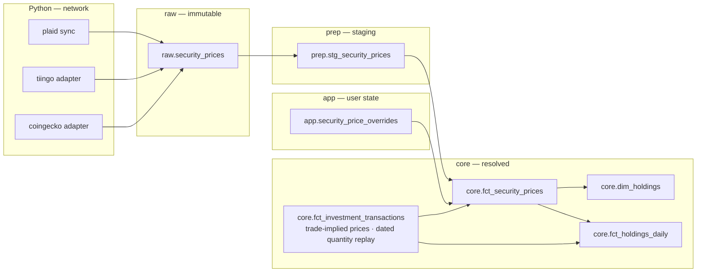

# Feature: Investment Price Feeds & Valuation

## Status
<!-- draft | ready | in-progress | implemented -->
in-progress

## Goal

Pillar C of the investments initiative (M1J.3). Store an append-only daily price
history for held securities, resolve one price per security per date from
competing sources, and publish holdings market value and unrealized gain/loss on
top of the shipped cost-basis engine.

Phase C.1 shipped: `core.dim_holdings` carries `market_value`, `unrealized_gain`,
`price_date`, `price_source`, `days_since_observed`, and `valuation_status` beside
`quantity`, `cost_basis`, and `average_cost`, valued from the close Plaid already
delivers in its existing sync payload. Phase C.2 shipped: Tiingo and CoinGecko
adapters, per-date user price marks in `app.security_price_overrides`,
trade-implied prices derived from executions, staleness surfacing, four
`system doctor` price checks, and the `investments prices` CLI. The daily valued
series (C.3) remains designed.
`src/moneybin/sqlmesh/models/reports/net_worth.sql` reads `core.fct_balances_daily`
alone and excludes holdings entirely. A brokerage account therefore enters net
worth at its provider-reported balance, and none of its positions enter as
holdings — but that balance already *is* the total position value, not a cash
sleeve, so the positions' value is counted today, just not as holdings. This spec
carries the remaining price-observation and daily-series work that Pillar D
(`investments-net-worth.md`) folds into `reports.net_worth`, subject to the
count-once constraint in
[`investments-overview.md`](investments-overview.md) → Open questions.

## Background

Pillars A+B shipped in [`investments-data-model.md`](investments-data-model.md)
(PR #300): the securities catalog, the 14-type investment-transaction ledger, the
four-method cost-basis engine, and derived lots, realized gains, and holdings.
[`sync-plaid-investments.md`](sync-plaid-investments.md) (PR #318) feeds that
ledger from Plaid.

Realized gain/loss is ledger-derived and needs no price. Unrealized gain/loss —
the paper value of what is still held — needs a current price for every open
position. That is the whole of Pillar C.

Two constraints shape the design before any choice is made:

1. **The extension seal.** `_seal_connection()` disables `HTTPFileSystem`,
   `S3FileSystem`, and `HuggingFaceFileSystem` on every connection; read-only
   opens additionally set `lock_configuration=true`. The filesystem disable
   alone is what closes the network, and it applies to the write connections
   SQLMesh transforms run on. No SQLMesh model reaches the network. Every price
   arrives through a Python fetch that lands in `raw.*`; models read from there.
2. **Prices are observations, not a cache.** A historical close is immutable.
   Volume is small enough to store outright: 100 securities × 252 trading days ×
   10 years is roughly 126,000 rows.

Related specs:

- [`investments-overview.md`](investments-overview.md) — the umbrella; fixes the
  contracts this child builds on.
- [`investments-data-model.md`](investments-data-model.md) — the ledger, lots,
  and cost-basis engine this values.
- [`sync-plaid-investments.md`](sync-plaid-investments.md) — supplies
  broker-carried prices and the holdings snapshots the divergence check reads.
- [`multi-currency.md`](multi-currency.md) — owns FX conversion (M1K.2); this
  spec stores a quote currency per price and converts nothing.
- [`asset-tracking.md`](asset-tracking.md) — defines the staleness vocabulary
  this spec is the first to implement.
- [`reports-net-worth.md`](reports-net-worth.md) — the balance-spine net worth
  that Pillar D values from holdings, counting each account once.

---

## Requirements

1. **Store an append-only daily price history.** One row per security, date,
   quote currency, and source. A stored row is never updated or deleted.
2. **Record what each source claimed it sent.** Every row carries a declared
   adjustment basis. Ingest rejects a row whose basis the adapter cannot state.
3. **Resolve one price per security per date**, deterministically, with the
   source that supplied it visible on the result.
4. **Value holdings as of a date** without a same-date price, by carrying the
   most recent earlier close forward, and mark every carried-forward value as
   such.
5. **Never present an unpriced holding as worth zero.** A holding with no usable
   price carries an explicit status that aggregates can detect.
6. **Let a user set a price by hand** for any security and date, including
   securities no feed covers. A later provider fetch never overwrites that mark.
7. **Surface staleness rather than repairing it.** Every valued row reports the
   date of the price it used and how old that price is.
8. **Refresh prices only on an explicit instruction**, or opportunistically
   during a sync that is already performing network work. A read path performs
   no network call.
9. **Withhold market value for a position whose share quantity is known to be
   wrong**, rather than publishing a confidently incorrect number.
10. **Ship without a network dependency.** Broker-carried prices already arrive
    through `sync pull`; phase C.1 uses them and adds no outbound call.

---

## Data model


```mermaid
flowchart LR
    subgraph fetch["Python — network"]
        P["plaid sync"]
        S["tiingo adapter"]
        C["coingecko adapter"]
    end
    subgraph rawl["raw — immutable"]
        R["raw.security_prices"]
    end
    subgraph prepl["prep — staging"]
        G["prep.stg_security_prices"]
    end
    subgraph appl["app — user state"]
        O["app.security_price_overrides"]
    end
    subgraph corel["core — resolved"]
        L["core.fct_investment_transactions<br/>trade-implied prices · dated quantity replay"]
        F["core.fct_security_prices"]
        H["core.dim_holdings"]
        D["core.fct_holdings_daily"]
    end
    P --> R
    S --> R
    C --> R
    R --> G
    G --> F
    O --> F
    L --> F
    F --> H
    F --> D
    L --> D
```

### New table: `raw.security_prices`

The provider cache. Immutable, append-only, one row per observation.

| Column | Type | Notes |
|---|---|---|
| `provider_security_key` | VARCHAR | the provider's own identifier — Plaid's `security_id`, a ticker, a `coingecko_id` |
| `price_date` | DATE | the date the price applies to |
| `quote_currency` | VARCHAR | ISO 4217; the currency the price is expressed in |
| `source` | VARCHAR | `plaid`, `tiingo`, `coingecko` — provider observations only |
| `source_origin` | VARCHAR | which connection produced it; `''` for single-tenant feeds |
| `close` | DECIMAL(28,10) | price of one unit |
| `price_basis` | VARCHAR | `raw`, `split_adjusted`, `split_and_dividend_adjusted` |
| `fetched_at` | TIMESTAMP | when the row was observed |

Primary key
`(source, source_origin, provider_security_key, price_date, quote_currency)`.

**`raw` stores the provider's key, not the canonical one.** Canonical
`security_id` is minted by `SecurityResolver`, which `sync_service.pull()` runs
*after* `_load_securities()`. An extractor writing at ingestion time therefore
does not yet have it, and on a first pull for a new security it cannot: it would
have to write an orphan FK or drop the observation. Storing the provider key
matches every other `raw.plaid_*` table, and resolution to `security_id` happens
in staging where the link tables are available — the layer that exists for
exactly this normalization.

**`source_origin` keeps two connections from colliding.** Two linked Plaid items
can each report a close for the same security on the same date. Without the
column those are one row by identity, so an append-only table must either reject
the second or lose it. `source_origin` mirrors the column
`raw.plaid_securities` already carries. Feeds with a single global answer —
Tiingo, CoinGecko — write `''`.

**Only `close_price` becomes a price row.** Plaid carries two price-shaped
fields, and they are not the same kind of fact. `close_price` on the security
record is a security-level close and belongs here. `institution_price` on a
holding is a per-`(account, security)` valuation, not a property of the security.
Routing both into one security-grain table would collide two different
measurements under one key. `institution_price` reaches
`prep.stg_plaid__investment_holdings` and stops there; `core.dim_holdings`
carries the separate `institution_value` field as `provider_reported_value`
under the store-don't-trust convention, so the per-account signal is already
retained at the grain that fits it.

**Quote currency belongs in the key.** A security quoted in two currencies — an
ADR against its ordinary listing, a venue reporting pence against another
reporting pounds — produces two legitimate prices for one security-date-source.
Without the column they collide and one silently overwrites the other. The column
also keeps a security price and a currency rate the same shape, so M1K.2 extends
this structure instead of introducing a second one beside it.

**`price_basis` is declared, never inferred.** The adapter states what the
provider documented itself as returning. An adapter that cannot state a basis
fails at ingest. Inferring the basis from the data — comparing close ratios
across a known split date, for instance — produces a guess that flips silently
when a provider changes policy.

### New table: `app.security_price_overrides`

User marks. Written through a `SecurityPriceRepo` per Invariant 10.

| Column | Type | Notes |
|---|---|---|
| `security_id` | VARCHAR | FK to `app.securities` |
| `price_date` | DATE | the date the mark applies to |
| `quote_currency` | VARCHAR | ISO 4217 |
| `close` | DECIMAL(28,10) | the user's price |
| `note` | VARCHAR | why the user set it |
| `created_at` | TIMESTAMP | |

Primary key `(security_id, price_date, quote_currency)`. No provider write
touches this table.

`CHECK (close > 0)`, mirroring `raw.security_prices`. Without it the guarantee
"an unpriced holding is NULL, never zero" has a hole on exactly the path a user
controls. Two of the three sources reaching `core.fct_security_prices` enforce
positivity in the schema this way; the third cannot —
`core.fct_investment_transactions.price` legitimately records `0` for a vesting
grant or a stock dividend, so the trade-implied branch filters `price > 0` in the
model instead. A genuinely worthless position is a ledger event — a disposal or
write-off — not a zero price: that keeps "what is this worth" and "do I still
own this" as separate questions, and it is what the tax treatment wants anyway.
The alternative, admitting `0` as a distinct "worthless" value, would make
*worthless* and *unknown* two states every downstream total, report, and doctor
check has to tell apart, and a bug conflating them understates net worth
silently — the exact failure the never-zero rule exists to prevent.

### New model: `prep.stg_security_prices`

Staging view over `raw.security_prices`. Kind VIEW. Core models read staging,
never `raw` directly.

It does three things: casts types and normalizes currency codes, rejects
non-positive closes, and **resolves `provider_security_key` to the canonical
`security_id`** through the same link tables `SecurityResolver` populates. A row
whose provider key has not resolved yet stays in `raw` and is absent from
staging — it is not dropped, and it appears once its security resolves.
The unresolved-security backlog remains available through the current
investment workflow; it does not add a separate MCP callback.

**Every provider resolves the same way, market feeds included.**
`app.security_links` is already provider-neutral by design — its header calls
`(source_type, ref_kind, ref_value)` the strong-ref key and its `source_type`
comment reads "plaid (future: ofx institutions, ...)" — but its `ref_kind` CHECK
admits only `plaid_security_id` and `institution_security_id`. C.2 extends that
CHECK with `tiingo_ticker` and `coingecko_slug` in a migration, and the adapters
bind through `SecurityLinksRepo` exactly as the Plaid path does.

**A feed key binds silently only on a near-certain signal.** A ticker is not an
identifier: the same symbol names different securities across exchanges (BHP on
NYSE and ASX), share classes collide (GOOG / GOOGL), and symbols are recycled
after a delisting. `app.securities` already records this — `ticker` is commented
"nullable, not unique (tickers get reused)" and `exchange` "disambiguates
duplicate tickers." So deriving a feed key from the catalog is sometimes exact
and sometimes a guess, and per `design-principles.md` ("Magic stays visible")
those two cases cannot share a path.

| Signal | Action |
|---|---|
| A binding the user already confirmed | Reuse it. Never re-ask. |
| `cusip` or `isin` match | Bind silently — these are unique by construction, and Plaid supplies them for US-listed securities. |
| Exact `ticker` + `exchange`, exactly one candidate | Bind silently. |
| Bare ticker, no exchange, no CUSIP/ISIN, >1 candidate | Route to `app.security_link_decisions` for review. |
| Ticker matches but the provider name diverges from the catalog name | Route to review. |
| The derived key is one the user already undid | Route to review (`binding_was_reversed`). Never re-bind it silently. |
| A decision for this pairing is already pending, or was rejected | Propose nothing. A rejected pairing is the never-re-propose set. |
| The bound key no longer matches the catalog value it came from | Retire the binding and re-derive — but only when it was bound automatically. |
| No match at all | Leave unbound. Nothing to propose, so no queue row — the held-but-unpriced doctor check is what surfaces it. |

**The divergence checks read Tiingo's metadata endpoint, not just our catalog.**
`GET /tiingo/daily/<ticker>` returns documented `name` and `exchangeCode` fields,
so a binding rests on the provider's own statement of what the symbol names
rather than on the symbol string alone. The exchange comparison is what actually
resolves the BHP-on-two-exchanges case the paragraph above names; comparing names
only would not. The cost is one extra request per security, paid once — rung 1
adopts the binding on every later pull, so a steady-state refresh makes no
metadata calls at all.

**Name comparison drops corporate-form suffixes before comparing.** A catalog
"Apple" against a provider "Apple Inc" is one issuer, and asking a user to ratify
that difference is precisely the queue noise the near-empty-queue rule forbids.
What survives the suffix strip is compared at `SecurityResolver`'s existing name
cutoff, so "do these two strings name the same issuer?" has one answer across the
codebase rather than two.

A name can strip to nothing — every word of "The Trust" or "Class A Fund" is a
suffix. That is an absence of evidence, not agreement, and it must not satisfy
the check: doing so leaves the exchange comparison authorizing a silent binding
by itself, on a symbol the provider may attach to any issuer. An empty side falls
back to comparing the literal names, which still agree when they are the same
string, and otherwise routes to review.

**A queued review records what the provider said**, not what the catalog already
holds. `provider_ticker` and `provider_name` are the provider's values — the same
contract `SecurityResolver` honours on the Plaid path. Filling them from the
catalog would show the reviewer two identical names and withhold the one piece of
evidence the decision turns on.

**An undone binding stays undone.** A key the user removed is not re-derived and
re-bound on the next pull: re-deriving reaches the same conclusion from the same
inputs, so a silent re-bind would restore the valuation the user rejected, with
no confirm and no queue row. Both removal paths count — `system audit undo`,
which deletes the row and leaves only an audit entry, and a reversal, which
leaves a `reversed` row. Reversals MoneyBin performs itself, retiring a binding
whose catalog value moved, record `auto` and are excluded; that is bookkeeping,
not a judgement about the pairing.

**A binding is revalidated against the catalog before it is reused.** Correcting a
typo'd ticker writes only `app.securities` — nothing cascades to
`app.security_links` — so without this the position keeps fetching the old
symbol's closes forever and reports them as `valued`. Only automatic bindings are
revalidated: a user-confirmed key may deliberately differ from the ticker, since
provider symbol formats diverge from ours (`BRK.B` against `BRK-B`), and
overriding that would re-ask a settled question.

**Retirement happens after the replacement is derived, not before.** The stale
binding is the only key pricing that security, so reversing it first turns every
way the *derivation* can fail — no provider coverage for the new symbol, a
transient metadata error, an ambiguous match routed to review — into a holding
that was valued yesterday and is unpriced today. The retirement therefore runs
immediately before the replacement is inserted, which still leaves exactly one
accepted link per `ref_kind`.

The *insert* can still fail, when another security already holds the derived key,
and that security is then left with no accepted link at all. This is deliberate.
Retiring cannot help the insert succeed — uniqueness is keyed on
`(source_type, ref_kind, ref_value)`, so freeing the old key does not clear a
conflict on the new one — and keeping a key the catalog has moved away from is
worse than holding none: it prices this security from a symbol it no longer
claims, and blocks the security that legitimately holds that key from binding it.
Unpriced is reported (`feed_key_bound_elsewhere`, then the held-but-unpriced
check) and the next pull re-derives; mispriced is silent. Inserting first and
retiring on success would also change the crash window from one accepted link
missing to two present, and `prep` resolves both.

**A retired key keeps resolving its own history.** `prep.stg_security_prices`
joins `app.security_links` to turn a provider key back into a `security_id`, so
admitting only `accepted` rows would drop every close stored under the old symbol
out of prep and out of `core.fct_security_prices` — an ordinary ticker rename
erasing the entire pre-rename series, with no error. The join therefore also
matches a `reversed` row whose `reversed_by` is `auto`, for observations dated
before its `reversed_at`. `reversed_by` separates bookkeeping from judgement: a
user's reversal says the pairing was wrong, so its closes must stay dropped.

**A provider key is owned for an interval, not outright.** A rename frees the old
symbol and tickers get recycled, so a key can pass through several securities.
Each link therefore resolves the closes from its predecessor's retirement up to
its own — the upper bound from its own `reversed_at`, the lower one from the
latest `auto` retirement of the same `(source_type, ref_kind, ref_value)` decided
before it. Both edges are load-bearing:

- Without the upper bound, a retired link keeps claiming every later close and
  values its security from the next listing's series.
- Without the lower bound, the next owner's accepted link claims the closes
  stored before it ever listed. The previous owner's retired link still resolves
  those same rows, so one observation becomes **two** securities' price history
  rather than merely going missing. The same gap lets one key retired twice —
  bound, retired, rebound, retired again — resolve its earliest closes through
  both retired links, duplicating them under a single security.

A user reversal creates no handover edge. It says the pairing was never real, so
it transfers nothing: the next holder owns the whole series, not just the part
after a boundary that describes someone's mistake.

**The exchange comparison is deliberately weak.** Either label absent does not
contradict — an absent signal never votes — and a label that prefixes the other
(`NASDAQ` vs `NASDAQ-GS`) agrees. Treating every spelling difference as a
contradiction would queue a review for most of a real portfolio, which fails the
same rule.

**Derivation lives in `PriceService`, not in an adapter.** An adapter takes a key
and never infers one, so the certainty judgement sits in one place for every
provider instead of being re-implemented per feed. A pending decision suppresses
re-derivation, so a second pull does not file a duplicate row for a question
already awaiting a human.

`app.security_link_decisions.ref_kind` is therefore widened alongside
`app.security_links.ref_kind`. It carries a second *kind* of decision — a
pull-side derivation MoneyBin proposes about its own catalog, rather than a
push-side claim a provider made — so reviewer-facing text distinguishes the two.

**Accepting the two kinds does opposite things, so the accept path routes on
`ref_kind`.** An identity ref (`plaid_security_id`, `institution_security_id`)
asks whether two catalog rows are one instrument; accepting MERGES — every
reference re-points onto the survivor and the provisional row is deleted. A feed
key (`tiingo_ticker`, `coingecko_slug`) asks whether a market-data symbol names
this security; accepting BINDS — the link that did not exist is created and
nothing else moves.

Routing both through the merge path would make a feed-key decision impossible to
accept by construction: the merge requires an accepted binding to move away, and
a feed key has none — that absence is exactly why it queued. The reviewer sees
one queue and one intent ("yes, this pairing is right"), so the surface keeps one
verb and dispatches beneath it; asking the caller to name the mechanism would
leak an implementation detail. The MCP confirmation text differs per kind for the
same reason: the merge prompt states that tax lots are fused and a security is
deleted, and neither is true of a binding.

**The queue must stay near-empty in normal operation.** A review entry per held
position is a design failure, not a safety feature: no comparable tool asks a
user to ratify every holding, and a queue that noisy trains people to accept
without reading, which is worse than not asking. If a real portfolio produces
more than a handful of entries, the fix is a stronger derivation rule, not more
confirming.

The two alternatives were considered and rejected against existing rules.
Resolving at fetch time, since the adapter already holds a canonical
`SecurityRef`, would leave Plaid resolving in staging and market feeds resolving
in Python — two mechanisms for one job, which the coherence rule names as the
largest source of rot. Binding through the `ticker` and `coingecko_id` columns
`app.securities` already carries is cheaper still, but it is a text-keyed
cross-table reference: `identifiers.md` Guard 3 requires the FK, and lists the
`LOWER(ticker) = LOWER(?)` predicate such a join needs as a smell that the FK is
missing. It also cannot disambiguate one ticker listed on two exchanges, and it
records no audit trail for the binding.

Extending the CHECK costs one migration per new provider. That is the price of a
single resolution path whose bindings are reversible, audited, and uniform — and
`app.*` schema is a one-way door, so the cheap shape is the expensive one.

### New model: `core.fct_security_prices`

The resolved series. One row per `(security_id, price_date, quote_currency)`,
carrying the winning `close` plus `source` and `price_basis` as provenance.
Kind FULL.

It unions three inputs: provider observations from `raw.security_prices`, user
marks from `app.security_price_overrides` as `source = 'override'`, and
trade-implied prices derived from `core.fct_investment_transactions` as
`source = 'trade_implied'`. Only the first is a stored provider observation, so
only the first lives in `raw`; the other two are derived at model build.

Only `price_basis = 'raw'` is eligible for valuation. An adjusted series states a
price relative to the corporate actions known when it was fetched, so a row
fetched as `split_adjusted` in one year stops being correctly adjusted after the
next split. That makes an adjusted price unusable as a durable historical fact.
Adjusted rows are stored, visible, and excluded from valuation with the reason
recorded, rather than silently valued.

**`close` is classified by the strictest value it can carry.** C.1 classified this column
`AGGREGATE` (LOW) on the rationale that a market close is public reference data —
what a security's price *was* on a date — unlike
`fct_investment_transactions.price`, which is what the user actually paid. That
holds while `plaid` is the only source. C.2 breaks it by unioning in two sources
that are personal facts:

- **`trade_implied`** is derived from the user's own executions. It *is*
  `fct_investment_transactions.price`, recomputed — the exact value the LOW
  rationale names as its sensitive counterexample.
- **`override`** on a security no feed covers — a restricted grant, a pre-IPO
  position, a private fund — is the user's own valuation of a private holding,
  and the only place that number exists. Those are precisely the cases the
  override path was built to serve, so the exposure lands on the people using
  the feature as designed.

A single column-level class cannot express that split. `CLASSIFICATION` maps a
column to one class and cannot vary per row, so `close` is classified by the
strictest value it can hold: `TXN_AMOUNT` (HIGH), on both
`core.fct_security_prices` and `app.security_price_overrides`. That costs the
provider closes a tier they do not need — a price read reports a
`summary.sensitivity` of `high` rather than `low`. It buys the guarantee that
the resolved column never advertises a user's own fill, or a private-company
mark, as public data.

Two alternatives were weighed and declined. Source-aware classification needs a
class that varies per row, which no other column in the map does. Splitting
provider-only closes into their own column or model recovers LOW for the public
series, but is a core schema change and leaves consumers unioning two columns;
it stays available if the sensitivity label on price reads ever costs something
real. Raising the column is reversible in a way a leaked private valuation is
not.

No report degrades today: only CRITICAL fields are masked, so a HIGH `close` is
classified rather than transformed.
`test_a_resolved_close_is_never_less_sensitive_than_what_flows_into_it` holds
the ordering against the columns that feed it. If a masking transform is ever
added here, ship an unaliased "an ordinary public-price query still works"
fixture beside it — no privacy test fails on over-masking, so a mask that
swallowed the whole provider series would ship green.

### Extended model: `core.dim_holdings`

Phase C.1 shipped `market_value`, `unrealized_gain`, `price_date`,
`price_source`, `days_since_observed`, and `valuation_status`, and rewrote the
two comments that change made stale — the header's cost-basis-only note and the
parenthetical on `provider_reported_value` that described MoneyBin as computing
no market value. C.2/C.3 retain this projection while adding price sources and
the dated series.

### New model: `core.fct_holdings_daily`

Grain `(account_id, security_id, valuation_date)`. A forward-filled daily series
of `quantity × close`, following the `fct_balances_daily.py` Python-model
precedent. Every row carries `price_date`, `days_since_observed`, and
`valuation_status`. Kind FULL.

**Quantity comes from replaying the ledger, not from any derived table.**
`core.dim_holdings` has grain `(account_id, security_id)` and reports the
position as it stands now, so multiplying it by a historical close would value
every past date at today's share count — wrong for every position touched by a
buy, sale, transfer, or split.

`core.fct_investment_lots` cannot supply it either, and the reason matters. That
model stores each lot's *final* state: `remaining_quantity` is what survives
after every disposal, with no disposal date recorded, so a fully-sold lot reads
zero on every historical date rather than on the dates after its sale. Worse for
this spec's purpose, `_apply_split` scales `original_quantity` and
`remaining_quantity` in place, so the stored numbers are post-split on every
date — reading them for a pre-split date reintroduces exactly the double-count
`price_basis = 'raw'` exists to prevent.

So `fct_holdings_daily` **replays `core.fct_investment_transactions`** — the
ledger the umbrella names as the source of truth — accumulating quantity per
`(account_id, security_id)` forward through the date spine, applying each event
on its own date and each split multiplier on the split's date. This is the same
sequential-replay shape `fct_investment_lots.py` already uses and the reason both
are Python models rather than SQL: the state at each date depends on the state
before it.

**One quote currency per position, chosen explicitly.** `fct_security_prices`
permits several `quote_currency` rows for one security and date, while this model
is position-grain and omits currency. Joining on security and date alone would
either fan the grain out or value a holding at a close denominated differently
from its own cost basis. For the no-FX phase the join requires
`quote_currency = dim_holdings.currency_code`; a position whose currency has no
price row is `unpriced`, not silently valued in another currency. M1K.2 replaces
this constraint with conversion.

**The spine is global and runs through today.** It starts at the earliest
transaction across all positions and ends at `today`, matching
`fct_balances_daily.py`, whose spine must end at the newest observation across
all accounts rather than each account's own. A per-position bound would drop a
position out of `reports.net_worth` the moment its own data went stale while
other positions kept valuing — a silent, load-bearing omission. Ending the spine
at the last price would also make carry-forward unobservable: weekends, holidays,
and provider outages are exactly when a carried-forward value with rising
`days_since_observed` needs to be published. An open position with no price at
all still emits rows, carrying `valuation_status = 'unpriced'`.

**Pre-window dates report no value, and say why.** Plaid's transaction window is
roughly 24 months while its holdings snapshot reports the whole position, so an
established account's long-held shares enter the ledger as synthetic
`opening_bootstrap` rows dated `window_start - 1 day`
(`prep.stg_plaid__opening_lots`). Replaying the ledger therefore yields no
quantity for any earlier date. Those dates carry
`valuation_status = 'unreconstructable'` and a NULL market value — never zero,
which would be indistinguishable from a genuinely empty portfolio and would
silently understate every aggregate that sums it.

**Why the broker's own acquisition dates do not rescue this.** The bootstrap
preserves each lot's real date in `original_acquisition_date`, so seeding those
lots at that date rather than at the window boundary looks like free history. It
is not, and the reason is worth recording so the idea is not re-attempted.
Plaid's `tax_lots[]` reports the **current, post-split** quantity beside the
**pre-split** acquisition date. Valuing that quantity against the raw,
unadjusted closes this spec stores overstates the position by the full split
factor: a lot of 25 shares bought before a 4:1 split is reported as 100 shares
dated to the original purchase, and 100 shares against a pre-split close is four
times the truth.

Nothing detects it. `prep.int_plaid__opening_positions` guards only
`has_in_window_split` (`sp.trade_date >= p.window_start`), and a pre-window split
produces no in-window transaction for Plaid to reject, so the
`split_underivable` path never fires either. The error would be silent, smooth,
and in the wrong direction — an overstatement, not the conservative floor it
first appears to be.

The pairing that *is* sound is post-split quantity against a **split-adjusted**
series, which is correct precisely because both sides are restated. That is
genuine design work — sourcing an adjusted series, owning its refresh obligation
after every corporate action, and reconciling it with this spec's raw-only
storage rule — and it belongs to **M1J.6**, not to a clause here. Until it
lands, an honest NULL beats a plausible wrong number: a missing value that names
its reason is recoverable, while a published value that later has to be retracted
is not.

---

## Price resolution

Resolution answers one question: for a security, a quote currency, and an as-of
date, which price applies?

```
candidates = union of provider observations, overrides, and trade-implied prices
             where price_date <= as_of_date
               and price_basis = 'raw'

winner     = first row ordered by
               price_date DESC,          -- freshness dominates
               source_rank ASC,          -- then declared precedence
               source_origin ASC,        -- then the connection
               observation_key ASC       -- then the row's own identifier
```

**The two halves live in different models.** `core.fct_security_prices` has
grain `(security_id, price_date, quote_currency)` — one row per observation date
— so it resolves competition *within* a date and its ORDER BY therefore leads
with `source_rank`. The `price_date DESC` half is the as-of pick *across* dates,
and it belongs to the consumer: `core.dim_holdings` today
(`price_date <= CURRENT_DATE` ordered `price_date DESC`), `core.fct_holdings_daily`
per spine date in C.3. Reading the pseudocode as one query is what makes the
first-available floor below look necessary.

**The same-pull withhold is scoped by source identity, not by rank.** Two
partial fills of one security on one day share `source_type`, `source_origin`,
and `extracted_at` while carrying different transaction ids and different
prices — every condition the provider key-churn conflict tests for. Withholding
there blanks a routine grain and reports the position unpriced. Rank cannot
carry the distinction: `override` is rank 1 and `trade_implied` is rank 5, so
the two derived sources bracket the three provider ones, and a rank *range*
would break silently the first time a new adapter takes rank 6.

The ordering is a **total** order, not a partial one. `price_date` and
`source_rank` alone leave ties: two Plaid connections differ only by
`source_origin`, and several trade-implied executions can share one day. Without
the last two keys a rebuild can select a different price — or the same price with
different reported provenance — from identical inputs. `observation_key` is the
row's own unique identifier: `provider_security_key` for a provider observation,
the transaction id for a trade-implied one.

**Bounded lookback.** Only prices dated on or before the as-of date are
candidates. A price observed after the valuation date never values it.

**As-of, not equal.** Markets close roughly 114 days a year between weekends and
holidays, and providers skip days beyond that. Resolution takes the most recent
earlier close, which is what makes a continuous daily series possible at all.

**Source rank breaks same-date ties.** It is a total order over sources, not a
grouping — two sources sharing a tier would leave `argmax` with multiple winners
and let a rebuild pick a different price each time, which fails the
deterministic-resolution requirement.

| Rank | Source | Rationale |
|---|---|---|
| 1 | `override` | The user stated it. |
| 2 | `plaid` | The institution holding the position reported it. |
| 3 | `tiingo` | A settled public close. |
| 4 | `coingecko` | A settled public close; ranked below tiingo only to break ties, since the two never cover the same security. |
| 5 | `trade_implied` | An execution price reflects one order's size and spread. |

A new adapter appends the next free rank to `seeds.price_source_map`. Where
two providers disagree on the same
date the rank picks one deterministically and `system doctor` reports the
disagreement — resolution stays stable, and the conflict stays visible.

**Adding or retiring a provider — two rules that outlive any one adapter.**
Both are cheap to honour and expensive to discover late.

- **Append ranks; never reorder them.** Inserting a provider at rank 3 and
  demoting the incumbent changes which close wins on every historical date where
  both hold a row, which silently revalues `core.dim_holdings.market_value` and
  the C.3 daily series. The code change is one line either way; the consequence
  is not. Reordering is a deliberate, announced revaluation, not a refactor.
- **A retired provider's registry row stays forever.** Because
  `raw.security_prices` is append-only, a provider's rows outlive the decision to
  stop fetching from it — and `prep.stg_security_prices` resolves each row through
  the `ref_kind` its `seeds.price_source_map` row declares, with an INNER JOIN.
  Deleting a retired source's row therefore discards every historical row it wrote,
  silently and unrecoverably. Retiring a provider means clearing its
  `security_types` so nothing routes to it, never removing the row or its
  `ref_kind`.

  **One registry, then three guards over what it cannot see.**

  `seeds.price_source_map` is the single declaration: one CSV row supplies the
  `ref_kind` `prep.stg_security_prices` joins on, the `source_rank`
  `core.fct_security_prices` orders by, and — through `moneybin.price_sources` —
  the adapter routing, `feed_ref_kind`, and feed-key set that `PriceService` and
  `SecurityLinksService` dispatch on. The C.2 failure mode is therefore structural
  rather than guarded: a writer cannot ship ahead of its mapping, because
  declaring the source declares both.

  `tests/moneybin/test_stg_security_prices.py::test_every_mapped_source_resolves_end_to_end`
  iterates the registry and asserts each mapped source resolves end to end, so
  adding a row without widening the `ref_kind` CHECK fails loudly. It cannot see a
  *deleted* row — removing one merely shrinks the set it iterates — which is what
  `tests/moneybin/test_price_sources.py` pins, along with the shipped rank order.

  `tests/moneybin/test_services/test_price_service.py::test_every_source_the_service_writes_resolves_in_staging`
  watches the remaining direction: every source the service routes to must carry a
  `ref_kind`. The shared helper additionally fails if `prep.stg_security_prices`
  stops JOINing the registry or restates a `CASE p.source_type` beside it, so the
  mapping cannot quietly fork back into two places.

  `investment_price_disagreement`'s sibling `investment_unmapped_price_source`
  closes the run-time half: any `source_type` present in `raw.security_prices`
  with an accepted binding whose rows still never reach staging. It covers rows
  already written and sources no registry row names — including a retired
  provider whose row someone deletes.

**Freshness dominates rank.** An override applies to one
`(security_id, price_date, quote_currency)`. Within that date it beats every
provider row; across dates the latest price wins, including over an older
override. This is what `multi-currency.md` means by "a later provider refresh
never silently overwrites it" — the guarantee is per-date. A mark on
2026-07-12 survives any later re-fetch of 2026-07-12, and does not suppress a
2026-07-18 close.

**Cross-source disagreement is a signal.** Two sources agreeing on a date is
uninteresting; two sources disagreeing beyond a relative tolerance means one is
wrong. `system doctor` reports the disagreement rather than resolution silently
picking a winner — an inference that could be wrong surfaces where it happens
rather than resolving quietly.

The check is `investment_price_disagreement`, a sibling to
`investment_price_discontinuity`: it fires when two *provider* sources hold rows
for the same `(security_id, price_date, quote_currency)` differing by more than
`investments.price_disagreement_tolerance_pct` (a config field, following the
staleness defaults). The comparison is deliberately restricted to provider
closes, because the other two sources are *expected* to differ: an override
exists precisely to correct a close the user believes is wrong, and a
trade-implied price reflects one execution's size and spread rather than the
day's close. Comparing those against a provider row would raise a standing
warning on every ordinary correction and every intraday fill.

**That restriction is structural, not an enumerated source list.** The check
reads `prep.stg_security_prices`, which carries provider observations only —
overrides and trade-implied prices are derived at model build and never land in
`raw.security_prices`. An enumerated `source IN (...)` list would add nothing
over that and could only go stale in the direction that *hides* disagreements,
by omitting a provider added later. Reading the resolved fact table instead
would not work at all: it has already collapsed each conflicting pair to its
rank winner, so the disagreement is no longer visible there.

**A marked grain stops being reported.** Reading staging is also what makes the
competing rows outlive the correction that settled them: a mark fixes the winner
in `core`, while both provider closes stay in `prep` permanently. The check
therefore skips any `(security_id, price_date, quote_currency)` carrying a row in
`app.security_price_overrides`. Without that, following the check's own printed
remediation leaves it firing on every subsequent run with nothing left to do, and
a finding that cannot be cleared teaches the reader to skip the report. The
exclusion matches the mark's full key rather than the security, because a mark
settles the date it names — silencing a security outright would hide exactly the
wrong-key binding the check exists to catch.

**Default tolerance: 2.0%.** Sized to the failure the check actually catches — a
feed key bound to the wrong security, which yields order-of-magnitude
differences — not to the precision two correct feeds agree to. Legitimate
differences exist and must not fire: a broker strikes its crypto valuation at
its own snapshot time while CoinGecko's is a 00:00 UTC close, so a volatile day
separates two correct figures by more than a percent. A threshold tight enough
to catch a genuinely wrong close a percent away would fire on those constantly,
and a warning that fires constantly is one the reader learns to skip.

The two are separate checks because their remedies differ — a discontinuity says
distrust a *day*, a disagreement says distrust a *feed* — and a single merged
finding could not say which. It lands in C.2, the first phase in which a security
can carry two sources at all.

**Held but unpriced** — `investment_unpriced_holdings` — is a third C.2 check. A position whose feed key never bound
— an unrecognized ticker, a security no provider covers — values as `unpriced`
and simply reads blank forever. `valuation_status` records it on the holdings
view, but only where someone is already looking at that position; nothing
surfaces it in the place users go to ask "is anything wrong with my data?"
Earlier drafts of this spec pointed at "the unresolved-security backlog" for this
case, but the check bearing that name (`investment_unresolved_securities`) scans
the *transaction ledger* for events whose security never resolved and never
examines price rows, so the safety net it implied does not exist. The new check
closes that gap: an open position carrying no usable price on the current
valuation date, reported with the securities affected.

It reports per security rather than per position, because the remedy — bind a
feed key, or record a mark — applies to the security. One holding spread across
three accounts is one piece of work, not three. It is scoped to
`valuation_status = 'unpriced'` alone: `withheld` also publishes no value, but
wants a share count reconciled rather than a price source, and routing it here
would send the user to fix something that was never broken. `carried_forward`
has a usable price whose age the staleness surface already carries.

**The population this check reports shrank when trade-implied prices landed.** A
per-unit price on a ledger event is now an observation on its trade date, so a
feedless position bought years ago reports `carried_forward` at its execution
price rather than `unpriced`. That is the correct answer — the user did pay that
price — but it means this check no longer surfaces the position, and the honesty
moves entirely onto `days_since_observed` and the staleness threshold.

### Trade-implied prices

An investment transaction carrying a per-unit `price` yields a price observation
for its trade date at `source = 'trade_implied'`, `price_basis = 'raw'`. An
executed trade is a raw observation by construction.

This is the only price a restricted-stock grant, a pre-IPO holding, an interval
fund, or a private placement will ever have. Without it those securities value at
nothing forever, and the user is asked to re-enter by hand a number already
recorded on the transaction.

### First-available floor — not built, deliberately

Earlier drafts specified `first_available_price_on(security, source)` as
`MIN(price_date)` per `(security_id, source)`, with resolution admitting a
provider row only when `price_date >= ` that value. **It is a no-op and C.2 does
not implement it.** The reasoning is recorded here because the idea is
intuitive enough to be re-proposed.

The predicate is taken over the very set it filters, so every row satisfies it by
the definition of `MIN`. The failure it was meant to prevent — "a position held in
2018 is valued from a 2024 listing price" — requires resolution to reach *forward*
in time, and bounded lookback already forbids that: `core.dim_holdings` takes
`price_date <= CURRENT_DATE` ordered `price_date DESC`, so a 2024 row is not a
candidate for an earlier date at all. A security that listed in 2024 has no row
on or before any 2018 date, which resolves to `unpriced` — the correct answer —
without a floor.

A floor becomes meaningful only if `core.fct_holdings_daily` fills its spine
*backward* from the first observation. It must not: C.3 carries the most recent
earlier close forward, and a date before a position's first price is `unpriced`
(or `unreconstructable` before the ledger window). Should that ever change, the
floor has to be predicated on **source identity** rather than rank — overrides and
trade-implied prices are not rows in `raw.security_prices`, so a provider-derived
floor evaluates to NULL for them and `price_date >= NULL` would discard every
manual valuation for feedless securities.

---

## Staleness and valuation status

Every valued row carries `valuation_status`:

| Status | Meaning |
|---|---|
| `valued` | A price exists for the valuation date. |
| `carried_forward` | An earlier price was carried forward; `days_since_observed > 0`. |
| `unpriced` | No usable price. `market_value` is NULL. |
| `unreconstructable` | Quantity is unknown for this date. `market_value` is NULL. |
| `withheld` | Quantity is known to be wrong; see "Split desync". |
| `source_overlap` | The account's investment ledger arrives from more than one source at once, so every derived figure double-counts. `market_value` is NULL. |

`unpriced`, `unreconstructable`, `withheld`, and `source_overlap` set
`market_value` to NULL, never
zero. A zero is indistinguishable from a genuinely worthless position and
silently understates every aggregate that sums it. Consumers reporting a
portfolio total report the count of non-`valued` positions alongside it.

The four non-`valued` NULL statuses are distinct on purpose, because each has a
different remedy: `unpriced` wants a price feed, `unreconstructable` wants
earlier transaction history, `withheld` wants a split reconciled, and
`source_overlap` wants one of the two feeds removed. Collapsing
them into one "no value" state would tell the user something is missing without
telling them what to do about it.

`source_overlap` is the only one whose remedy is outside the pipeline entirely,
and the only one a `system doctor` check `fail`s on
(`investment_source_overlap`, whose recipe names `import_revert` and
`sync_disconnect` as the two exits). It is also the only one keyed on the
ACCOUNT rather than the position: it withholds every position in the account,
because the double-count reaches all of them.

Every status either carries a number the user can rely on or carries none at all.
No status publishes a qualified figure, because a qualification the reader cannot
evaluate is not a disclosure — and a number that later has to be retracted costs
more trust than a NULL that named its reason from the start.

Staleness reuses the vocabulary `asset-tracking.md` establishes:
`days_since_observed` on the valued row, judged against a threshold that
resolves per-security-type, then `MoneyBinSettings.investments.
price_staleness_default_days` (4). This spec is the first implementation of that
vocabulary; the shape it lands is the one physical assets inherit, so the
resolution itself lives in `moneybin.staleness` — one helper both domains call,
parameterized by their own type table and global default. A second
implementation of one rule is the coherence failure `design-principles.md` names
as the largest source of rot.

Both documents originally specified a third, innermost tier: a per-entity
`staleness_threshold_days` override column. It is deliberately unbuilt. No user
has asked to grant one security a longer leash than its type, the per-type
default is what tracks market reality, and a nullable column is an additive
migration whenever someone does ask. Building the override surface first would
be configurability nobody requested.

`days_since_observed` counts calendar days. Type defaults absorb ordinary market
closure: 4 days for `equity`, `etf`, `mutual_fund`, and `bond`; 1 day for
`crypto`, which trades continuously. A Monday reading three days stale on an
equity is a normal weekend, not a fault. `cash` and `other` carry no entry and
fall through to the global default — a bespoke number for a type neither
document specifies would be a guess wearing the authority of a constant.

The comparison is strictly greater-than, matching `asset-tracking.md`'s "exceeds
its staleness threshold": an observation sitting exactly on its threshold is
still within it. A security never observed at all is `unpriced`, not stale —
distinct statuses because the first wants a price source and the second wants a
refresh.

`system doctor`'s `investment_stale_prices` is where the threshold is applied.
Everything else publishes the age as a number and judges nothing:
`core.dim_holdings.days_since_observed` per position,
`holdings.max_days_since_observed` across the portfolio, and the
`price_staleness_days` gauge. That split is deliberate — a per-position boolean
would fire on the ~114 days a year markets are closed — but it leaves one gap the
numbers cannot close on their own: a position no feed covers keeps its last
close indefinitely, is summed into portfolio totals as `carried_forward`, and
nothing marks the figure as one nobody has confirmed in years. A doctor check
resolves the threshold once per security type and reports only the positions
past it, which is what makes the warning affordable enough to be worth reading.

---

## Split desync

Share quantity must be restated at a split for `quantity × price` to be correct.
MoneyBin models this today: `split` is one of the 14 ledger types, `quantity`
carries the multiplier (Decision D6), and `_apply_split` rescales every open lot
while preserving total basis.

Coverage is asymmetric by source. A manually recorded split reaches the
cost-basis engine and restates quantity. A Plaid-reported split is routed to
review with `review_reason = 'split_underivable'` and held out of
`core.fct_investment_transactions`, because a derived multiplier that is wrong
corrupts the basis of the whole position. Until that behavior is settled against
recorded provider payloads, a Plaid-synced position that splits reports the
pre-split quantity.

Publishing a market value against that quantity produces a number wrong by the
split factor while every other signal reads healthy. So Pillar C withholds it.

**Existing checks already detect the condition, but their result is too coarse to
consume whole.** `investment_holdings_divergence` compares `quantity` against
`provider_reported_quantity` with exact inequality — and also fails on a pure
cost-basis mismatch where quantity agrees. `investment_staging_rejects` fires on
any non-null `review_reason`, including `unmapped_subtype` and
`transfer_direction_underivable`. Neither of those implies a wrong quantity, and
market value is `quantity × price` — it does not depend on cost basis at all.
Gating on the aggregate check result would withhold a correct market value for
unrelated reasons, contradicting Requirement 9.

So withholding uses a **quantity-specific predicate over the same underlying
data**, evaluated per position:

```
withheld = quantity <> provider_reported_quantity          -- the divergence
                                                            -- check's quantity leg
           or exists a staging row for this security with
              review_reason = 'split_underivable'
              whose trade_date is not already covered by a
              'split' event in THIS position's own ledger   -- detected per
                                                            -- security, resolved
                                                            -- per position
           or the position is flagged by
              investment_phantom_holdings                   -- broker no longer
                                                            -- reports it
```

**The split clause is detected per security and resolved per position, and both
halves are load-bearing.** A split is a corporate action on the security, so a
reject arriving through one account is evidence that *every* position in that
security may carry a pre-split quantity — scoping detection to the rejecting
account would leave sibling positions valued at a quantity wrong by the split
factor, which is the exact harm this section exists to prevent. But a position
whose own ledger already carries a `split` event on that date has been restated
correctly, whether the user entered it manually or another source supplied it,
and withholding it would suppress a right answer.

Checking the position's own ledger also makes the clause self-clearing: when the
Plaid split behavior is settled and the events reach
`core.fct_investment_transactions`, positions stop withholding without a separate
resolved-flag to maintain. `prep.stg_plaid__investment_transactions` exposes
canonical `account_id`, `security_id`, and `trade_date` on the reject row, so the
predicate needs no new plumbing.

The third clause is not redundant with the first. When a fresh snapshot omits a
position the ledger still carries, `provider_reported_quantity` is NULL, so
`quantity <> provider_reported_quantity` evaluates to UNKNOWN rather than true
and the position slips through — publishing a market value for shares the broker
says are gone, and overstating net worth by exactly that amount.
`investment_phantom_holdings` already identifies this case, including shares left
open by an unmodeled option assignment.

Pillar C reuses those two signals and adds no second
alarm for a condition an existing check already covers.

**One gap needs a new check.** Divergence detection requires a broker snapshot to
compare against, so it is inert for a manual-only or disconnected account. For
those, `investment_price_discontinuity` reports a single-day market-value change
exceeding a threshold on a date with no transaction — the observable signature of
an unrecorded split or an adjustment-basis change.

Restoring symmetry between the manual and Plaid split paths is M1J.5, tracked
separately against the ledger rather than here.

---

## Provider adapters

Adapters live in `src/moneybin/connectors/prices/`, matching the
`connectors/gsheet/` shape: a network client that pulls into `raw.*`. Two
concrete modules behind one Protocol. Provider identity is data in the
`source_type` column, so nothing needs runtime registration.

```python
class PriceAdapter(Protocol):
    source_type: str
    price_basis: str

    def fetch(
        self, securities: Sequence[SecurityRef], start: date, end: date
    ) -> PriceFetchResult: ...
```

`fetch` returns observations *and* per-security failures together, because
partial success is the normal outcome rather than an error path.

- **`tiingo.py`** — equities, ETFs, and mutual funds. Reads Tiingo's end-of-day
  `close`, which its documentation defines as the as-traded close beside a
  separate `adjClose`, so the adapter declares `price_basis = 'raw'`. Mutual
  fund rows carry the day's NAV in the OHLC fields. Requires an API token, read
  through `SecretStore` like every other credentialed connector, and sent as an
  `Authorization: Token …` header rather than the `?token=` query parameter
  Tiingo also accepts — a credential in a URL reaches access logs.
- **`coingecko.py`** — crypto, keyed by the `coingecko_id` already on
  `app.securities`. No credential. Spot crypto has no splits or dividends, so
  its closes are raw by construction.

**The keyless CoinGecko tier constrains the endpoint and the window.** Verified
against the live API on 2026-07-24, because the documentation states neither:
`/coins/{id}/market_chart/range` answers **401** without a key, while
`/coins/{id}/market_chart?days=N` answers 200. `/coins/{id}/ohlc/range` — the one
endpoint that would return a true daily *close* — is Analyst-plan-and-above. So
the adapter uses the `days` form, and a `--since` reaching further back than the
keyless tier's 365-day bound is **refused**, naming the earliest date CoinGecko
can serve. Clamping to 365 days instead wrote those rows and reported an ordinary
success, so a five-year backfill returned one year and said so nowhere. The
refusal is a whole-batch condition — one window covers every coin in the run — so
`pull` contains it per source and every Tiingo row still lands.

**A crypto observation is the midnight boundary of the following day.** The only
daily point the keyless tier serves is 00:00:00 UTC, which is the value at the
*end* of the preceding date, so it is stored against that preceding date. This
keeps `price_date` meaning "value at the end of this date" for crypto exactly as
it does for every equity close in the table; labelling it by its own date would
blend a Friday equity close with Thursday-end crypto inside one portfolio total
and report that row's staleness as zero days. Two costs are accepted
deliberately: today's crypto is never priced, and a stored row disagrees by one
day with CoinGecko's own `/history?date=D` page, which labels the same snapshot
`D`.

**Granularity varies with window width, so the adapter pins the boundary point.**
`days=200` returned points spaced 86,400,000 ms at exact midnight UTC; `days=5`
returned points spaced 3,600,000 ms — matching the documented auto-granularity
rule. Taking any non-midnight point would make a stored price depend on how wide
a window happened to be requested, and `raw.security_prices` is append-only with
`on_conflict="ignore"`, so a 30-day refresh and a 365-day backfill would disagree
on a date and whichever ran first would win permanently and silently. Keeping
only the exact-midnight point makes the stored value a pure function of its date.

**Neither adapter writes an adjusted basis**, so `price_basis` stays out of
`raw.security_prices`' primary key for C.2. The key must gain it before any
adapter or backfill first writes an adjusted series alongside `raw`; until then
`on_conflict="ignore"` has no second basis to drop.

**The quote currency is supplied by the caller, not read from the response.**
Tiingo's end-of-day payload carries no currency field, and CoinGecko takes the
currency as a *request* parameter, so neither adapter can learn it from the
provider. `SecurityRef` therefore carries `quote_currency` from
`app.securities.currency_code`. Hard-coding USD would mislabel every non-US
listing permanently on an append-only table; sourcing it from the catalog makes a
wrong currency one fixable catalog row.

Which securities to fetch, and for which dates, derives from holdings: a security
is fetched over the interval it was actually held, extended to the last complete
day while the position is open. Fetching every security ever seen across its full
history exhausts provider rate limits on every sync and stores data no report
reads.

**A refresh never requests today.** `raw.security_prices` is append-only with
`on_conflict="ignore"` and `price_date` in its primary key, so the first writer
owns a date permanently — a midday pull storing an in-progress close makes the
evening pull carrying the settled close a silent no-op, and that date's valuation
wrong forever. `.claude/rules/data-extraction.md` forbids partial-day extraction
for this reason. CoinGecko is already structurally incapable of it, since its
close for date D is the 00:00 UTC point of D+1; bounding the window gives the
equity path the same guarantee, and makes both providers agree on the newest date
a pull can produce — which `investment_price_disagreement` compares them on.
`--since` moves the start only.

Failure handling follows `GSheetPullService`:

- **A batch reports partial success.** A refresh over 40 securities that loses 2
  reports 38 written and names the 2 with reasons.
- **An unreachable provider leaves stored prices in place.** Valuation continues
  from the last close with staleness rising. Withholding an entire portfolio
  valuation because one refresh failed is worse than the honest stale answer.
- **A whole-source failure is contained to that source.** `PriceFeedError` and
  its subclasses are whole-batch conditions, so `pull` catches them per source,
  records every security routed there as `price_feed_error`, and continues. The
  refresh still stores what other sources returned — a missing Tiingo token must
  not discard CoinGecko rows that needed no credential. The failure is reported
  in `PullResult.failed_sources` with the provider's message, because a
  contained failure that says nothing is only a quieter outage.
- **A security whose provider ref another security already holds** is reported
  `feed_key_bound_elsewhere`. Neither `ticker` nor `coingecko_id` is unique in
  `app.securities`, so two catalog rows for one instrument is a reachable state,
  not a corruption — and it belongs to that security, not to the refresh.
- **A close outside the storable range is dropped**, not stored and not raised.
  `raw.security_prices.close` is `DECIMAL(28,10)` under `CHECK (close > 0)`, so
  a quote outside that column fails the insert for every security batched with
  it. Both ends are checked, magnitude first, because quantizing an oversized
  value overflows the decimal context before a precision test could answer. A
  sub-1e-10 quote quantizes to zero and reports
  `close_below_storable_precision`; one above 18 integer digits becomes NULL in
  frame construction and reports `close_above_storable_range`.
- **Rate limiting backs off exponentially**, on rate-limit responses only.
- **An undeclared `price_basis` fails ingest.**
- **A security no source covers** is reported in the refresh result and carries
  `valuation_status = 'unpriced'`.

New error types register with `classify_user_error`.

---

## CLI interface

```
moneybin investments prices sync [--securities TICKER ...] [--since DATE]
moneybin investments prices set SECURITY DATE PRICE [--currency CUR] [--note TEXT]
moneybin investments prices delete SECURITY DATE [--currency CUR]
moneybin investments prices list SECURITY [--since DATE] [--source SRC]
```

`delete` removes a manual mark and returns that date to provider-derived
valuation. Without it an override is unreachable once written: source precedence
makes it beat every provider row for its date, and `set` can only replace the
value while keeping `source = 'override'` provenance. `surface-design.md` also
requires a paired `_delete` for this mutation shape.

`moneybin sync pull` refreshes prices for held securities as part of its existing
run. `investments holdings` and `investments gains` gain `market_value`,
`unrealized_gain`, and an as-of column reporting `price_date` and staleness.

**Sensitivity is `high` on both reads.** `market_value` is `high` because
quantity x close reveals position size — the same class of data as the holdings
it values. `close` is `high` for the separate reason recorded above: the privacy
registry classifies `core.fct_security_prices.close` and
`app.security_price_overrides.close` as `TXN_AMOUNT`, since the resolved column
carries a `trade_implied` row (the user's own fill) or an `override` row (a
valuation the user authored) as readily as a provider close, and one column gets
one class. So `investments prices list` and `investments holdings` both derive
`high`, and the payloads follow the registry.

## MCP and report integration

This spec adds no price-observation MCP route. C.1 already extends the existing
`investments(view="holdings", ...)` projection with `market_value`,
`unrealized_gain`, `price_date`, `days_since_observed`, and `valuation_status`.
C.2/C.3 may add further price sources and a dated series, but an
observation-grain capability remains unnamed until it passes the standard
tool-admission review. Holdings do not yet feed the registered net-worth reports;
that integration remains Pillar D.

---

## Testing strategy

- **Resolution comparator** — table-driven over the as-of date, source rank, and
  override matrix. Covers an override winning its own date over a fresher provider
  row, an override not suppressing another date's close, and a future price never
  valuing a past date.
- **Split arithmetic** — a 2:1 split with historical quantity from the ledger
  replay, asserting pre-split dates value at the pre-split quantity and price.
  Assert against the replay specifically: `fct_investment_lots` stores post-split
  quantities on every date, so a test reading it would pass while being wrong.
  Then the desync case: a Plaid-held-out split publishes `withheld`, not a number.
- **Split withhold scope** — one security held in three accounts with a single
  `split_underivable` reject: the two positions with no `split` event in their own
  ledger withhold, and the third, which recorded the split, still values. Then
  the self-clearing case: once a `split` event reaches the ledger for a withheld
  position, it values without any flag being cleared by hand.
- **Dated quantity replay** — a position bought, partly sold, split, then fully
  sold reports the correct quantity on a date inside each interval, and zero
  after the final disposal.
- **Pre-window dates** — a bootstrapped position reports `unreconstructable` with
  NULL market value for every date before its `opening_bootstrap` row, never zero
  and never a value derived from the lot's `original_acquisition_date`. The
  regression that matters: a lot that split before the window must not value at
  its post-split quantity against pre-split closes.
- **Cross-source disagreement** — two sources within tolerance on one date raise
  nothing; beyond tolerance, `investment_price_disagreement` fires while
  resolution still returns the rank winner deterministically.
- **Resolution totality** — two Plaid connections reporting the same security,
  date, and currency pick the same winner across repeated rebuilds; likewise two
  trade-implied executions on one day.
- **Derived sources reach the model without a binding** — an override and a
  trade-implied price for a security with no provider rows and no accepted
  `app.security_links` row both resolve. Neither passes through
  `prep.stg_security_prices`' INNER JOIN, and that is what makes a feedless
  security priceable at all.
- **Partial fills are not a key churn** — two same-day fills at different prices,
  sharing one `extracted_at`, resolve to the lower-sorting transaction id rather
  than withholding the grain.
- **Zero never becomes a close** — a vesting grant or stock dividend recorded at
  `price = 0` yields no price observation while the ledger event survives, and a
  priced trade whose security never bound yields none either.
- **Carry-forward** — a weekend and a holiday produce continuous daily rows with
  `carried_forward` status and correct `days_since_observed`.
- **Unpriced** — a security with no source yields NULL market value, and a
  portfolio total reports the uncounted position.
- **`price_basis` enforcement** — an adapter returning no basis fails ingest.
- **Non-Plaid key binding** — a Tiingo ticker and a CoinGecko slug each bind
  through `SecurityLinksRepo` and resolve in `prep.stg_security_prices`; an
  unbound key leaves its row in `raw` and surfaces in the unresolved-security
  backlog rather than vanishing. The migration test
  runs against a populated `app.security_links`, per the migration-realism rule.
- **Adapter fixtures** — recorded provider responses served through `respx`. No
  test performs a network call, and no test needs a Tiingo token. The two
  invariants worth naming, because each guards a permanent write:
  - **The window does not change the price.** A narrow (hourly) CoinGecko window
    and a wide (daily) one must agree on a shared date, or an append-only table
    stores whichever refresh ran first.
  - **A close never travels as a float.** `json.loads` reads 212.55 as
    212.55000000000001136868377216160297393798828125 without
    `parse_float=Decimal`, and that value would land in `DECIMAL(28,10)`.
- **Adapter guards are verified by mutation, not by coverage.** Each guard —
  the midnight filter, the end-of-day offset, both non-positive-close checks, the
  history clamp, reading `close` over `adjClose`, the header-not-query token, the
  whole-batch auth propagation, retry-on-429-only, and the basis vocabulary — has
  one fixture that fails when *that* guard alone is deleted. A guard nothing fails
  without is not a guard.
- **Scenario coverage** for ingest → resolve → value → net worth.

A change to `core` grain requires `make test-scenarios`, which the default
`make check test` gate does not run.

---

## Metrics

Registered in `src/moneybin/metrics/registry.py` per
[`observability.md`](observability.md). A refresh reaches the network and can
partially fail, so it is unobservable without them.

| Metric | Type | Labels | Emitted where | Purpose |
|---|---|---|---|---|
| `price_refresh_duration_seconds` | Histogram | `source_type` | `PriceService.pull` | Per-adapter fetch latency; the signal that a provider is degrading before it fails. |
| `price_refresh_securities_total` | Counter | `source_type`, `outcome` | `PriceService.pull` | `outcome` ∈ `written` / `failed` / `skipped`. Makes partial success countable rather than buried in a CLI string. |
| `price_rows_written_total` | Counter | `source_type` | `PriceService._store` | Ingest volume, and the check that a backfill wrote what it claimed. |
| `price_resolution_status_total` | Counter | `status` | `InvestmentService.holdings` | `status` ∈ `valued` / `carried_forward` / `unpriced` / `unreconstructable` / `withheld` / `source_overlap`. Coverage over time; a rise in `unpriced` is the first sign a feed stopped matching securities, and the `unreconstructable` share is how much history M1J.6 would recover. |
| `price_staleness_days` | Gauge | — | `InvestmentService.holdings` | Maximum `days_since_observed` across held securities carrying a value. One number answering "how old is the oldest price my net worth rests on." NaN when no position carries a value: `days_since_observed` is 0 on a same-day close, so publishing 0 for a total pricing outage would make it read as the freshest possible portfolio and leave a `> N days` alert unable to fire. |

The label is `source_type`, not `source` — the canonical provenance column name
across every layer (`database.md`), so a metric and a query name the same thing
the same way.

**The three `outcome` values are disjoint and exhaustive over the securities a
refresh considers, and each routes to a different remedy.** `failed` means the
provider was asked and refused: retry, or check the credential. `skipped` means
MoneyBin never asked — no adapter covers the security type, or no feed key
derived. A security that *was* asked and came back with neither a price nor an
error is also `skipped`, not `failed`: real providers do this (the Tiingo
adapter drops a non-positive close without reporting an error), and calling it a
failure sends the reader to check a credential that is fine.

**The two holdings metrics are recorded only on an unfiltered read.** Both
describe the whole portfolio, and `holdings()` accepts account and security
filters. Recording a filtered read would make the exported value depend on
whichever filter the last caller happened to pass — asking for one
recently-priced position would publish its age as the age of every number in net
worth, while the stale position that filter excluded vanished from the status
counts.

No metric carries a security identifier or a monetary value as a label — labels
stay low-cardinality and non-identifying, per the logging and privacy rules.

---

## Implementation plan

Three phases, each independently shippable.

**C.1 — broker-carried prices and current value.** No outbound network code.
Capture the `close_price` Plaid already delivers into `raw.security_prices`,
build `core.fct_security_prices`, extend `core.dim_holdings`. Closes the
no-market-value gap for every Plaid brokerage user.

**The capture happens in the extractor, not in a staging view.**
`raw.plaid_securities` is written with `on_conflict="upsert"` keyed
`(security_id, source_origin)`, so each pull overwrites the previous
`close_price` in place. A model reading that table sees only the newest value and
can never reconstruct the history it already destroyed. `PlaidExtractor` must
therefore append the price row during ingestion, in the same pass that upserts
the security. This is why the price history is append-only while the securities
table is not: the two have different retention contracts, and only the extractor
sits between them.

**C.2 — feeds, overrides, and staleness.** The two adapters, the `ref_kind`
extension that lets their keys bind, the override table and repo, trade-implied
prices, staleness surfacing, `investment_price_disagreement` (the first phase in
which one security can carry two sources), the CLI surface, and the existing
investment/report integration. The first-available floor was dropped as a no-op
— see "First-available floor — not built, deliberately".

**C.3 — the daily series.** `core.fct_holdings_daily` and
`investment_price_discontinuity`. Unblocks Pillar D. Pre-window dates report
`unreconstructable`; extending valuation earlier is M1J.6.

### Files to create

- `src/moneybin/sql/schema/raw_security_prices.sql`
- `src/moneybin/sql/schema/app_security_price_overrides.sql`
- `src/moneybin/repositories/security_price_repo.py`
- `src/moneybin/sqlmesh/models/prep/stg_security_prices.sql`
- `src/moneybin/sqlmesh/models/core/fct_security_prices.sql`
- `src/moneybin/sqlmesh/models/core/fct_holdings_daily.py`
- `src/moneybin/connectors/prices/__init__.py`
- `src/moneybin/connectors/prices/protocol.py`
- `src/moneybin/connectors/prices/errors.py`
- `src/moneybin/connectors/_http.py` — the one request path every feed shares
  (the exchange-rate adapter joined it at M1K.2, which is why it sits above the
  `prices` package and takes the caller's `FeedErrorTypes`): retry on rate limit
  only, map status to a typed error, and parse with
  `parse_float=Decimal` so a quote never becomes a float. Returns `object` rather
  than `Any`, so a provider shape change degrades to a named per-security failure
  instead of a traceback mid-refresh
- `src/moneybin/connectors/prices/tiingo.py`
- `src/moneybin/connectors/prices/coingecko.py`
- `src/moneybin/services/price_service.py`
- `src/moneybin/cli/commands/investments/prices.py`
- `src/moneybin/sql/migrations/V042__widen_security_link_ref_kinds.py` (C.2) —
  adds `tiingo_ticker` and `coingecko_slug` to the `ref_kind` CHECK on both
  `app.security_links` (where a feed key binds) and `app.security_link_decisions`
  (where an ambiguous derivation is queued for review, per the binding-certainty
  table above). DuckDB cannot alter a CHECK in place, so it rebuilds each table
  on the V034/V035 idiom, guarding the two independently so the migration stays
  idempotent on a database where only one has been widened; both schema DDL files
  carry the same widened CHECKs for fresh installs.
- `src/moneybin/sql/migrations/V043__create_app_security_price_overrides.py` (C.2)
  — the existing-database path for `app.security_price_overrides`. The schema DDL
  above creates it on a fresh install; without this migration a database created
  before C.2 has no table for `investments prices set` to write to.

### Files to modify

- `src/moneybin/sqlmesh/models/core/dim_holdings.sql` — valuation columns
- `src/moneybin/sql/schema/app_security_links.sql` and
  `src/moneybin/sql/schema/app_security_link_decisions.sql` — widen each
  `ref_kind` CHECK to match the migration, so a fresh database and a migrated one
  agree
- `src/moneybin/extractors/plaid/extractor.py` — append `close_price` keyed by
  Plaid's own security key to `raw.security_prices` during ingestion, before the
  upsert overwrites it and before the resolver has minted a canonical id
- `src/moneybin/metrics/registry.py` — the five price metrics
- `src/moneybin/schema.py` — add both new DDL files to
  `_NON_PROVIDER_SCHEMA_FILES`. `_all_schema_files()` enumerates that explicit
  list plus a `raw_*.sql` glob inside provider directories, so a file added
  under `src/moneybin/sql/schema/` is not discovered on its own and the first
  write would hit a missing table
- `src/moneybin/services/doctor_service.py` — `investment_price_disagreement`,
  `investment_unpriced_holdings`, `investment_unmapped_price_source` (C.2) and
  `investment_price_discontinuity` (C.3), registered alongside the nine existing
  investment checks
- `src/moneybin/config.py` — staleness defaults, backfill bound,
  `price_disagreement_tolerance_pct`
- `src/moneybin/tables.py` — new table constants
- `src/moneybin/cli/commands/investments/__init__.py` — register `prices`
- `docs/specs/INDEX.md`, `docs/specs/investments-overview.md`,
  `docs/roadmap.md`, `CHANGELOG.md`

---

## Out of scope

- **FX conversion.** Prices store a quote currency and convert nothing. M1K.2
  owns conversion, and the `quote_currency` column is what lets it extend this
  table rather than add another.
- **Price inversion and triangulation.** Deriving a price through an
  intermediate currency belongs to the conversion layer.
- **Alternative valuation-date policies.** This spec materializes one number per
  position per date: the close for that date. The underlying series stays intact,
  so cost-basis, at-transaction-date, and restate-at-a-fixed-date policies remain
  derivable without a schema change.
- **Intraday and real-time quotes.** Daily grain only.
- **Bid, ask, and NAV as distinct price types.** One close per source per date.
- **Benchmark comparison, time-weighted and money-weighted return.**
- **Options, derivatives, short positions.**
- **Tier 3, a sync-brokered keyed provider.** The `source` column and resolution
  rule accommodate it; nothing cross-repo lands here.
- **Split-source symmetry.** M1J.5.

---

## Key decisions

- **Quote currency is part of the price key.** A security legitimately carries
  two prices for one date when quoted in two currencies. Excluding the column
  loses one of them silently, and forces currency rates into a second table with
  a second resolution path.

- **One `raw` table with a `source` column, not a table per provider.**
  `investments-data-model.md` establishes per-provider raw tables for entities
  pulled from a provider's API — transactions, holdings, securities — because
  each provider's payload has its own shape. A price observation has one shape
  regardless of who supplied it: security, date, currency, close. It is a
  reference series, matching the `raw.exchange_rates` pattern `multi-currency.md`
  sets for the same reason. Keeping sources in one table is also what makes
  same-date cross-source disagreement detectable in a single query.

- **Adjustment basis is declared by the adapter, never inferred.** Inference from
  price ratios across a split date is a guess that flips silently when a provider
  changes policy. A source that cannot state its basis is not ingested.

- **Only raw prices value holdings.** An adjusted series is stated relative to the
  corporate actions known when it was fetched, so it stops being correct after
  the next one. Ledger quantity already reflects splits as of each date; raw
  price is its correct multiplicand. Adjusted rows are stored and excluded with
  the reason recorded.

- **The equity feed must publish an unadjusted series, which costs a credential.**
  The rule above is a provider-selection constraint, not only a storage one: a
  source whose sole product is an adjusted series can be ingested and can never
  value a holding, so its adapter is inert the day it ships. This is what ruled
  out stooq, the provider this spec originally named — it publishes adjusted
  closes with no unadjusted series available, and separately offers no documented
  programmatic interface. Tiingo publishes `close` and `adjClose` as distinct
  documented fields, which is what lets an adapter declare its basis instead of
  inferring it. Every provider that documents an unadjusted series requires an
  API token; `SecretStore` already owns that path. The free tier allows 1,000
  requests a day against a fetch scope of one request per held security, so a
  thirty-position portfolio refreshing daily uses 3% of it. Tiingo's free tier is
  internal-use-only, which does not constrain a local ledger but does bear on the
  hosted-deployment question in Open questions below.

- **Resolution is as-of and bounded.** The most recent close on or before the
  valuation date. Equality would leave holes on every non-trading day; unbounded
  lookahead would value a past date with a price observed later.

- **Freshness dominates source rank; overrides are per-date.** Rank decides only
  same-date ties. This reconciles a user mark that must survive re-fetch with a
  series that must stay current.

- **An unpriced holding is NULL, never zero.** Zero is indistinguishable from a
  worthless position and understates every aggregate silently. Status travels
  with the value so consumers, including agents, cannot render a number without
  its caveat.

- **A known-wrong quantity withholds the value.** A Plaid-synced position whose
  split was held out reports the pre-split quantity. Publishing
  `quantity × price` there yields a number wrong by the split factor with no
  other signal of trouble.

- **Split desync reuses the existing doctor checks.**
  `investment_holdings_divergence` and `investment_staging_rejects` already
  detect it. A new check covers only the case they cannot see: an account with no
  broker snapshot to compare against.

- **Trade-implied prices are a source.** An executed trade is a raw observation,
  and for a restricted grant, a pre-IPO holding, or a private fund it is the only
  price that will ever exist.

- **Refresh is explicit; read paths never fetch.** Two identical commands return
  the same number, an offline machine still values a portfolio, and a report does
  not block on HTTP. Staleness is surfaced instead, which is the same posture
  `investments-overview.md` sets for prices generally.

- **Fetch scope derives from holdings.** A security is fetched over the interval
  it was held. Fetching everything ever seen exhausts rate limits and stores rows
  no report reads.

---

## Open questions

- **Tiingo coverage against a real portfolio.** Its documentation claims
  equities, ETFs, and mutual-fund NAVs; that breadth has not been measured
  against an actual holdings set. Where coverage falls short the override path
  covers the remainder and the gap is visible rather than silent. Settled by: a
  coverage probe against the author's own holdings, run with the real tickers
  rather than a large-cap sample.

- **Backfill depth on first fetch.** The proposal is each security's earliest
  acquisition date, bounded by a configurable cap. A fixed window is simpler and
  loses early history. Settled by: measuring a first-run fetch against a real
  portfolio in C.2.

- **Whether hosted deployments fetch prices for users.** This decides tier 3's
  shape: a server-side key with pooled rate limits, or per-user credentials. The
  contract accommodates either. A hosted deployment also changes what the
  provider's terms permit — Tiingo's free tier is internal-use-only and its
  commercial tier is a separate licence, so a server fetching on a user's behalf
  is a licensing decision, not only an architectural one. Settled by: the M3H
  hosted launch decision.
