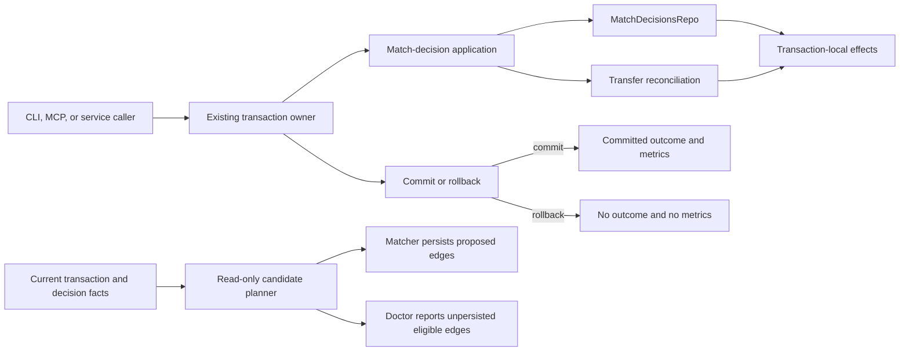

# Matching Consistency Boundaries

> Last updated: 2026-08-15
> Status: ready
> Address: M1B.4 (Ingestion Core — matching consistency boundaries)
> Type: Architecture
> Owns: executable ownership of match-decision consequences and dedup-candidate
> planning semantics
> Refines: [`matching-overview.md`](matching-overview.md),
> [`matching-nway-dedup.md`](matching-nway-dedup.md), and
> [`account-identity-resolution.md`](account-identity-resolution.md)
> Constrained by: [`app-integrity-invariant.md`](app-integrity-invariant.md) and
> [`observability.md`](observability.md)

## One-line goal

Make each matching rule have one executable owner so every mutation surface
reports the same committed consequences and every diagnostic evaluates the same
candidate graph as the matcher.

## Decision summary

MoneyBin establishes two internal architecture boundaries:

1. A **match-decision application boundary** owns accepted/rejected status
   transitions, transfer reconciliation, effective committed statuses, and the
   domain facts from which callers build outcomes and committed metrics.
2. A **read-only candidate-planning boundary** owns candidate eligibility,
   rejected-pair suppression, component assignment, and physical-source
   cardinality. The matcher persists its plan; `doctor` diagnoses that same
   plan without writing.

These boundaries centralize semantics, not orchestration. Existing services
retain their public responsibilities, transaction owners retain control of
their wider transactions, and CLI/MCP response contracts do not change.

Implementation is deliberately split into two independently reviewable and
releasable changes. This spec is not authorization for one combined refactor.

## Why this exists

The account-merge/rematch work exposed two recurring classes of finding.

### Decision consequences are recomputed by each caller

At the baseline captured by the follow-up to PR #388, three paths independently
perform variations of the same work:

- `MatchingService.set_status`
- `MatchingService.accept_all_pending`
- `ReviewDecisionsService.apply_ordinary`

Each path updates match rows, runs transfer reconciliation, rereads statuses
that may have changed inside the transaction, distinguishes newly accepted rows
that were immediately reversed from previously standing transfers that were
retired, commits, and records metrics. The matcher and refresh pipeline carry a
related partial-result protocol for failures after durable writes.

The distinctions are real user-facing semantics, but their implementations are
distributed. A change to one consequence therefore requires reviewers to find
and compare every caller. The recent fixes for committed-status reporting,
retirement propagation, and metrics ordering are evidence that this is an
ownership problem rather than merely insufficient review depth.

### `doctor` reimplements the matcher

`DoctorService._run_unproposed_cross_source_duplicates` contains a separate SQL
implementation of matcher behavior, including:

- cross-source classification;
- node and rejected-pair identity;
- accepted/pending component closure;
- rejected-pair suppression grain;
- physical-source membership; and
- the component cardinality guard.

The query's comments explicitly map its clauses back to `scoring.py`,
`assignment.py`, and `engine.py`. That care makes the current check useful, but
it cannot make two implementations stay equivalent. Every matcher change
creates an implicit obligation to update a semantic mirror that neither tests
nor module ownership make obvious.

## Goals

- Give match-decision consequences one implementation used by single, bulk,
  and mixed review-batch mutation paths.
- Preserve the transaction boundary required by each caller while preventing
  callers from independently redefining the result.
- Make metrics describe committed state and keep telemetry failures from
  controlling domain sequencing.
- Give matcher and `doctor` one side-effect-free source of candidate/component
  semantics.
- Preserve current matching behavior and all public CLI/MCP shapes while the
  boundaries are introduced.
- Make future changes local enough that reviewers can exhaustively inspect a
  semantic rule without rediscovering its copies.

## Non-goals

- Changing matching scores, thresholds, decision statuses, transfer behavior,
  or account-identity policy.
- Changing `app.match_decisions`, core, prep, or reports schemas.
- Replacing repositories, `Database`, or the existing explicit transaction
  model with a generic unit-of-work framework.
- Introducing a domain event bus or asynchronous consequence handlers.
- Folding categorization, account-link mutation, or refresh orchestration into
  a matching service.
- Changing public CLI commands, MCP tools, response fields, or error codes.
- Refactoring unrelated `doctor` invariants.
- Limiting review rounds or weakening adversarial review. The objective is to
  remove duplicated reasoning, not to constrain finding depth.

## Architecture

The two boundaries share the matching domain but not mutable orchestration.
They may share value types such as node keys and decision identities; neither
boundary may call the other merely to create a central “matching manager.”

## Boundary 1 — match-decision application

### Responsibility

The application boundary is the sole owner of the semantic operation:

> Apply these requested match-decision transitions inside the active
> transaction, reconcile the graph they produce, then describe what the
> transaction would commit.

It owns:

- validating and applying match status transitions through
  `MatchDecisionsRepo`;
- deciding whether reconciliation is required;
- running transfer reconciliation once per application batch;
- rereading any affected rows whose final status can differ from the request;
- computing effective accepted, rejected, unchanged, and immediately reversed
  rows;
- separating reversals of rows accepted by the current operation from
  retirement of previously standing transfers; and
- returning transaction-local facts with no surface-specific prose.

It does **not** own:

- beginning or committing a transaction that contains other domain work;
- categorization decisions in a mixed review batch;
- account-link merge or refresh sequencing;
- CLI/MCP envelopes, confirmation language, or recovery actions; or
- emitting committed metrics before the transaction owner confirms commit.

### Transaction ownership

Two entry shapes are required, even if implementation names differ:

1. **Standalone application.** A thin wrapper begins a transaction, invokes the
   transaction-scoped primitive, commits, records committed metrics, and returns
   a committed outcome. `MatchingService.set_status` and
   `accept_all_pending` use this shape.
2. **Participating application.** A caller that owns a wider atomic operation
   invokes the primitive inside its already-active transaction. After its own
   successful commit, it records the returned effects as committed.
   `ReviewDecisionsService.apply_ordinary` uses this shape because match and
   categorization decisions commit together.

The participating shape is intentionally explicit. The boundary must not
silently commit a transaction owned by another service, and the outer service
must not recalculate matching consequences.

### Outcome contract

The transaction-local result contains enough typed data to answer all current
surface questions without querying or recomputing matching semantics:

| Fact | Meaning |
|---|---|
| requested transition | Match id and requested status for each input row |
| prior status | Status observed during the transaction's guarded validation |
| effective status | Status after reconciliation, before commit |
| changed | Whether this operation changed the row |
| reconciliation reversals | Raw number of transfer reversals performed |
| immediate reversals | Input rows accepted and reversed in this transaction |
| standing transfers retired | Reversals minus immediate reversals |

Counts such as “accepted” are derived from effective statuses, never from the
number of attempted updates. The calculation of `standing transfers retired`
is owned by this result type or its application boundary; callers may format or
omit the value according to an existing surface contract but may not derive it
again.

The exact Python type and field names are implementation details. The semantic
distinctions in this table are the contract.

### Failure and commit semantics

| Failure point | Required behavior |
|---|---|
| Before commit, transaction rolls back | No domain effect, retirement metric, or committed outcome is reported. |
| Reconciliation raises inside an outer transaction | The outer owner rolls back the entire operation; transaction-local counts are not durable. |
| A standalone matcher operation has already committed earlier rows by design | Its existing structured partial-result carrier reports only durable effects. |
| Metric recording fails after commit | The committed domain outcome remains successful; the failure is logged without changing follow-on domain sequencing. |
| A later refresh/rematch step fails after an earlier identity merge committed | The caller preserves and reports the earlier committed effect separately from the later failure. |

Telemetry is never a transaction participant. A metrics exception cannot
rollback a commit, suppress a required rematch, or replace a more useful domain
error.

### Surface mapping

Existing service outcome types may remain as compatibility adapters. They map
from the centralized committed outcome:

- single decision: effective status + standing transfers retired;
- bulk accept: effective accepted count + immediate reversals + standing
  transfers retired;
- mixed ordinary review: each item's effective status + standing transfers
  retired when reconciliation ran; and
- refresh/matcher: existing durable-write and partial-failure reporting.

This refactor does not add fields or change disclosure rules at public
boundaries.

## Boundary 2 — read-only candidate planning

### Responsibility

The candidate planner is the sole executable owner of the question:

> Given current transaction facts, existing match decisions, matching settings,
> and a requested tier, which candidate edges would the matcher persist?

It is deterministic and side-effect-free. It returns an ordered plan; it never
writes `app.match_decisions`, audits, metrics, or logs that imply mutation.

The plan must apply the same semantics the matcher currently spreads across
candidate queries, `TransactionMatcher`, and `assign_components`, including:

- tier eligibility and blocking;
- rejected-pair suppression at exact pair grain;
- active component seeding;
- node identity and account scoping;
- confidence ordering;
- redundant-edge suppression; and
- physical-source cardinality.

Those rules may remain implemented in focused helpers. The architectural rule
is that both mutation and diagnosis call them through the same plan, rather
than translating them into a second language.

### Matcher use

The matcher requests a plan for each tier and persists the planned decisions in
the existing order using the existing repository. Classification, auditing,
commit behavior, transfer reconciliation, and result reporting remain matcher
responsibilities unless Boundary 1 already owns the relevant consequence.

### Doctor use

`DoctorService._run_unproposed_cross_source_duplicates` requests a read-only
cross-source dedup plan over current state and reports eligible edges for which
no decision exists. It must not reproduce component closure, rejected-pair, or
cardinality behavior in recursive SQL.

The diagnostic may use a narrowed data fetch or a dedicated read model for
performance, but that fetch may only gather facts. It cannot independently
decide eligibility. If the planner would persist no edge, `doctor` must not warn
that a refresh can clear one.

Candidate blocking remains in DuckDB through shared candidate data access; this
boundary is not permission to load the full transaction table into Python.

Doctor detail remains privacy-safe: counts and opaque account identifiers only,
with fixed external error text if evaluation fails.

## Ownership matrix

| Concern | Executable owner | Consumers |
|---|---|---|
| Match-row mutation and audit write | `MatchDecisionsRepo` | Application boundary, matcher |
| Consequences of requested decision transitions | Match-decision application boundary | Matching service, review service |
| Transfer invalidation rule | Matching reconciliation helper | Application boundary, matcher |
| Committed consequence metrics | Transaction owner using centralized effects | Matching service, review service, matcher/refresh |
| Candidate blocking and scoring facts | Matching candidate data access/scoring helpers | Candidate planner |
| Component and physical-source eligibility | Candidate planner/assignment helpers | Matcher, doctor |
| Public outcome formatting and recovery actions | Existing surface/service adapters | CLI, MCP |
| Wider identity-merge and refresh sequencing | Account/review services | CLI, MCP |

No concern gains two owners merely because two callers need differently shaped
output.

## Compatibility and migration

- No database migration is required.
- Existing decisions are read without transformation.
- Existing CLI/MCP requests and responses remain compatible.
- Existing metrics retain their names and labels.
- Existing matching order and persisted decision shapes remain unchanged.
- The `doctor` invariant keeps its name, status levels, privacy posture, and
  recovery commands. Its fresh N-way-cluster pair count becomes the exact
  number of decisions the matcher would propose (`N-1`) instead of the current
  pre-assignment upper bound.
- The architecture can be reverted one delivery slice at a time because each
  slice preserves behavior and schema.

Matching mutation parity is measured against the post-PR-#388 baseline. Apart
from the named diagnostic-count correction above, an observed behavior change
during extraction is a bug unless separately designed and approved.

## Observability

This architecture adds no metric merely to measure the refactor.

The existing transfer-retirement counter is incremented from raw committed
reversal facts exactly once per successful commit. Surface disclosure discounts
immediate reversals, but the operational counter records every durable reversal.

Errors from post-commit metrics are sanitized and logged. They do not change
the returned domain outcome or skip later required work. Planner evaluation
does not emit mutation counters.

## Testing strategy

### Shared decision-outcome matrix

Run the same scenario table through single, bulk, and mixed-review entry points:

- rejection and idempotent no-op;
- accepted dedup with no invalidated transfer;
- accepted decision retiring a standing transfer;
- a newly accepted transfer immediately losing reconciliation;
- one batch containing both the invalidating edge and losing transfer; and
- multiple standing transfers with deterministic winner selection.

For every path, assert committed row statuses, audit coverage, returned counts,
and metrics. The expected semantic outcome is shared test data, not copied
arithmetic in each test module.

### Transaction and fault injection

- Failure before commit rolls back decisions, reconciliation, audits, and
  metrics.
- Failure after commit preserves the committed outcome.
- Metrics failure cannot suppress rematch/refresh sequencing.
- Existing matcher partial-result behavior reports durable writes only.

### Planner parity

One fixture matrix drives both matcher persistence and read-only doctor
diagnosis, covering:

- accepted and pending seed components;
- exact rejected pairs and unrelated rejections;
- reversed decisions;
- repeated source-native ids in different accounts;
- differing source type versus differing source origin;
- same-file cardinality conflicts, including null origins/files; and
- N-way candidates where assignment persists a spanning forest.

For each fixture, the edges the matcher would newly persist must equal the
planner edges observed by `doctor`. `doctor` may summarize them, but it cannot
produce an edge absent from the plan.

### Regression gates

Each implementation slice runs the full Python checklist because it changes
`src/` and `tests/`. Matching scenario tests also run because the refactor
touches matching/data-shape behavior even though intentional output changes are
out of scope.

## Delivery slices

### Slice 1 — decision application boundary

- Introduce the transaction-scoped application primitive and typed effects.
- Route single decision, bulk accept, and mixed ordinary review through it.
- Centralize committed-status and retirement calculations.
- Keep compatibility adapters at existing service boundaries.
- Consolidate after-commit metric recording and fault tests.

This slice must ship independently with no candidate-planner dependency.

### Slice 2 — candidate-planning boundary

- Extract a read-only plan from current candidate, classification, and
  assignment behavior.
- Make the matcher persist that plan without changing decision order or shape.
- Replace the semantic SQL mirror in the doctor invariant with the same plan.
- Add shared matcher/doctor parity fixtures and performance coverage.

This slice must ship independently after Slice 1; it may be reverted without
restoring duplicated consequence handling.

## Acceptance criteria

1. Single, bulk, and mixed-review mutation paths invoke one implementation to
   calculate effective match statuses and retirement consequences.
2. No caller subtracts self-reversals or rereads final statuses to reconstruct a
   consequence already supplied by the application boundary.
3. Retirement metrics are emitted exactly once and only for committed
   reversals; a telemetry failure does not change domain sequencing.
4. Matcher and `doctor` invoke the same read-only planner for candidate and
   component eligibility.
5. The doctor invariant contains no independent recursive component closure or
   translation of rejected-pair/cardinality rules.
6. Existing CLI/MCP contract tests pass without response-shape changes.
7. Existing matching scenarios pass, plus the shared outcome and planner-parity
   matrices described above.
8. Each delivery slice is small enough to review and merge separately, with its
   own complete verification evidence.

## Alternatives rejected

### Keep helpers distributed and add more cross-caller tests

This is the smallest code change, but it preserves multiple semantic owners.
Tests can detect known disagreements only after expected outcomes are encoded
separately; every new consequence still requires coordinated edits and review.

### Have `doctor` run the mutating matcher and roll back

Rollback avoids persisted decisions but still executes mutation-oriented code,
audits, and metrics under a diagnostic command. It makes safety depend on every
future side effect being transactional. A read-only plan is explicit and
testable.

### Introduce domain events and consequence handlers

Events could decouple callers from reconciliation, but they add ordering,
delivery, retry, and transaction-boundary questions that MoneyBin does not need
to solve here. The current consequences are synchronous and must be atomic with
the decision; a direct application boundary is simpler and safer.

### Combine both slices into one implementation PR

The two seams share a domain but have different failure modes and verification
strategies. Combining them increases review surface and makes regressions harder
to localize without improving the final architecture.

## Ready gate

Promote this spec from `draft` to `ready` only after review confirms:

- the transaction owner/application boundary is explicit enough to prevent an
  inner service from committing an outer operation;
- transaction-local versus committed effects cannot be confused;
- planner extraction preserves, rather than redesigns, matching behavior; and
- both delivery slices remain independently shippable.
