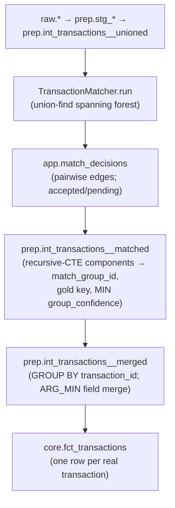

# N-Way Dedup: Merge 3+ Copies of the Same Transaction

> Last updated: 2026-05-22 — initial draft
> Status: draft
> Parent: [`matching-overview.md`](matching-overview.md) (pillars A + C)
> Enhances: [`matching-same-record-dedup.md`](matching-same-record-dedup.md) — supersedes its Requirement 3 (1:1 bipartite assignment)
> Companions: `CLAUDE.md` "Architecture: Data Layers", `.claude/rules/database.md` (recursive CTE syntax, column naming), `.claude/rules/surface-design.md` (review-surface shapes), `docs/specs/moneybin-doctor.md` (staging_coverage)

## Goal

When the same real-world transaction is imported from **three or more sources** — or appears in three or more overlapping within-source files — collapse all copies to exactly one `core.fct_transactions` gold record. Today only two copies ever merge; the rest survive as duplicate core rows.

## Background

The dedup matcher collapses at most **one pair per transaction**. Verified against `main` (commit `6cc8d2bc`, 2026-05-22):

- `src/moneybin/matching/assignment.py::assign_greedy` — greedy best-score-first 1:1: once a row is claimed by a winning pair it cannot join another pair.
- `src/moneybin/matching/engine.py::TransactionMatcher.run` — runs Tier 2b (within-source) then Tier 3 (cross-source); `already_matched.update(...)` (lines 135, 150) excludes rows matched in an earlier tier from later tiers. A row therefore lands in **at most one** dedup edge across all tiers and re-runs.
- `sqlmesh/models/prep/int_transactions__matched.sql` — a two-pass connected-component fold whose NOTE states it is "correct only when each transaction participates in at most one match… if multi-hop matches are added, replace with a recursive CTE label-propagation." Verified: the two-pass is correct for a 3-node chain but **splits a 4-node chain** (A–B–C–D) into two groups. The matcher never produces the multi-edge components that would exercise this, so the latent bug is currently dormant.

### Worked example (3 sources)

```
Real txn X from 3 sources:    ofx_X   csv_X   plaid_X
Cross-source candidate pairs: (ofx,csv) (ofx,plaid) (csv,plaid)
assign_greedy commits the single best pair, e.g. (ofx,csv):
   ofx_X, csv_X claimed  -> 1 decision, 2 -> 1 collapse
   (ofx,plaid), (csv,plaid) skipped (a side already claimed)
   plaid_X -> UNMATCHED  -> survives as a duplicate core row
Result: 1 real txn -> 2 core rows.
```

The mixed intra+inter case has the same shape: if `csv_X` appears twice, Tier 2b claims both CSV rows, then the OFX copy finds both partners excluded in Tier 3 and survives separately.

### Key insight: the downstream is already group-aware

The prep/merge layer already models groups, not just pairs:

- `int_transactions__matched.sql` already computes `match_group_id`, a sorted-member gold key (`SHA256(LISTAGG(sorted member keys))`), and a per-group `match_confidence`.
- `int_transactions__merged.sql` already folds via `GROUP BY transaction_id` with `ARG_MIN` field-level merge and `COUNT(*) AS source_count`. There is **no "primary row"** — field-merge stays.

N-way dedup is therefore predominantly a **matcher** problem: make the matcher emit the edges that form real connected components, make the prep fold robust for any topology, and the existing pairwise schema and merge logic carry the rest.

## Design decisions

| Fork | Decision | Rationale |
|---|---|---|
| Matcher shape | Union-find spanning forest | Smallest change that is correct; subsumes 1:1 exactly when every group has size 2 |
| `app.match_decisions` semantics | **Pairwise edges, groups derived downstream** — no schema change | The component is a view over currently-accepted edges; accept/reject/undo stay per-edge and groups re-split for free. A stored group entity is a one-way-door schema change with no current need (YAGNI) |
| Group confidence | **MIN (weakest link)** | The merged row is only as trustworthy as its shakiest accepted edge — honest about "is this all one transaction" |
| Review/accept UX | **Presentation-layer grouping + edge-level mutation** | The mutation contract `transactions_matches_set(match_id, status)` stays edge-level; the review queue clusters pending edges by component. A group-id mutation is rejected: `match_group_id` is derived (changes each transform) and has no place in a public mutation contract |
| Tier interaction | Shared component set across 2b and 3, seeded from existing active edges | A row matched in 2b can still gain a cross-source edge in 3 when it connects a new component |
| Prep fold | Recursive-CTE transitive closure | Robust for any group topology; the two-pass breaks at 4-node chains |
| Transfer interaction | Exclude all non-primary component members | Generalizes the current "lower side of the pair" exclusion to groups |

This **applies** the existing dedup and medallion patterns rather than establishing a new one, so no ADR is warranted (per `.claude/rules/design-principles.md`).

## Requirements

### Matcher

1. The matcher emits a **spanning forest**: for each set of copies of the same transaction it produces a connected component with exactly **N−1 edges** (a spanning tree — no cycles, no redundant edges).
2. Assignment is **union-find** over candidate pairs in descending confidence order, with a **deterministic tiebreak** (score desc, then the ordered source-key pair) so the spanning tree is reproducible across runs. An edge is added only if its two endpoints lie in **different** components.
3. The union-find is **seeded with currently-active (accepted and pending) edges** before processing new candidates, so a newly imported copy attaches to a pre-existing component (cross-run attachment) and redundant edges are never re-proposed.
4. Tiers 2b and 3 share one component set within a run; a row matched in 2b remains eligible for a cross-source edge in 3 when it connects a distinct component. This supersedes Requirement 3 of `matching-same-record-dedup.md` (1:1 bipartite assignment).
5. Per-edge classification is unchanged: `>= high_confidence_threshold` (0.95) → accepted; Tier 3 `>= review_threshold` (0.70) and `< high` → pending; below → dropped. A component may carry mixed accepted and pending edges.
6. Rejected pairs are still excluded from candidacy. Rejecting the only edge attaching a member detaches it; on the next run the previously-redundant alternative edge is re-proposed (recovery behavior).

### Prep fold

7. `int_transactions__matched.sql` replaces the two-pass label propagation with a **recursive-CTE transitive closure** over accepted, non-reversed dedup edges, producing a stable `match_group_id` for any topology (chains, stars, longer chains). DuckDB recursive CTE syntax per `.claude/rules/database.md`.
8. The group gold key remains `SHA256(LISTAGG(sorted (source_type, source_transaction_id, account_id), '|'))`. It is deterministic given the member set, which the recursive closure makes exact. Adding a member changes the gold key (and thus the merged `transaction_id`) — inherent to content-addressed dedup, already true for 2-way.

### Group confidence

9. The merged row's `match_confidence` is the **minimum** confidence over the accepted edges in the component (weakest link). Implemented by changing the `group_confidence` CTE in `int_transactions__matched.sql` from `MAX` to `MIN`. (`int_transactions__merged`'s `MAX(m.match_confidence)` is a no-op aggregate since all members share the group value; leave it.) This changes the semantics of a near-public `core.fct_transactions.match_confidence` value — permitted pre-launch.

### Transfer interaction

10. `engine._fetch_active_dedup_decisions().secondary_ids` excludes **all non-primary members of each component** (every member except the highest-`source_priority` representative) from transfer detection, computed via the same connected-component logic as the prep fold. Generalizes the current single-lower-side-of-pair exclusion so only one canonical row per merged group is eligible for transfer matching.

### Review UX

11. The review queue (`transactions review --type matches`, the `transactions_matches_*` MCP tools, `matches history`) **clusters pending dedup edges by their connected component** and presents each cluster as a unit (e.g., "3 copies of −$42.00 on 2024-03-15 across ofx/csv/plaid").
12. "Accept group" / "reject group" expand to per-edge `transactions_matches_set(match_id, status)` calls over the pending edges in the cluster. The mutation contract is unchanged. Re-split is automatic via Requirement 6.

### Doctor / staging_coverage

13. `doctor_service._run_staging_coverage` (currently a no-op `skipped` awaiting a non-existent `is_primary` column) is implemented group-aware. Expected dedup-absorbed rows are computed from the components as `Σ(group_size − 1)`:

    ```
    dedup_absorbed = COUNT(rows with match_group_id) − COUNT(DISTINCT match_group_id)
    ```

    off `prep.int_transactions__matched`. This is exact for any group size and removes the `is_primary` dependency. Update `docs/specs/moneybin-doctor.md` accordingly.

## Algorithm

```
assign_components(candidates, existing_edges):
    uf = UnionFind()
    for (a, b) in existing_edges:        # seed: accepted + pending active edges
        uf.union(a, b)
    added = []
    for pair in sort(candidates, by=(-score, ordered_source_keys)):
        if pair endpoints in same component:   # redundant
            continue
        if pair is rejected:
            continue
        uf.union(a, b)
        added.append(pair)
    return added                          # only newly added edges -> new decisions
```

```
N=3 example, candidates desc:
  ofx-csv   0.96  -> {ofx} vs {csv}              ADD  (accepted)
  ofx-plaid 0.82  -> {ofx,csv} vs {plaid}        ADD  (pending, tier-3)
  csv-plaid 0.80  -> {ofx,csv,plaid} same        SKIP (redundant)
emitted: ofx-csv(accepted) + ofx-plaid(pending)        # 2 edges = N-1
prep fold (accepted-only) collapses {ofx,csv}; plaid stays separate
with a pending edge until the user accepts it, then all three fold.
```

## Data flow



## Out of scope

- No explicit group entity in `app.match_decisions` (pairwise stays).
- No group-id-based mutation contract.
- No row-primary / canonical-row selection (a separate, deferred decision tracked outside this spec).
- No change to scoring or blocking — only assignment and the downstream fold.
- No backward-compatibility shims (pre-launch posture).

## Testing

Per `.claude/rules/testing.md` (real-DB fixtures; YAML scenario fixtures + independently-derived expectations):

### Scenarios (`tests/scenarios/`)

- **`dedup-nway` (new):** a persona where one transaction appears in **3 sources** (ofx + csv + plaid) **and** another appears across **3 overlapping within-source files**, asserting collapse to exactly one `core.fct_transactions` row each. Hand-derived expected row count.
- **Negative:** distinct-but-similar transactions that must **not** over-merge — extend `dedup-negative-fixture` or add a sibling scenario.

### Unit

- `assign_components`: spanning-tree edge count (N−1), redundant-edge skip, cross-run attachment (new copy joins an existing component), deterministic tiebreak, reject-then-re-propose-alternative.
- Prep fold: 4+-node chain closes to one group (the case the two-pass broke); star topology.
- Group confidence: MIN over mixed-confidence accepted edges.
- Transfer exclusion: all non-primary members of a 3-member group excluded.
- Doctor: `staging_coverage` green with a multi-member group; `Σ(group_size − 1)` matches absorbed.

## Done when

A real transaction imported from N≥3 sources (and N≥3 overlapping within-source files) collapses to exactly one `core.fct_transactions` row; a scenario test proves both the collapse and a negative (distinct transactions do not over-merge); `staging_coverage` is implemented and green with its expected term computed from group sizes; the prep fold is a recursive CTE; group confidence is weakest-link MIN; the review queue presents pending edges grouped by component; specs reconciled (`matching-same-record-dedup.md` Requirement 3 superseded, `moneybin-doctor.md` updated).
