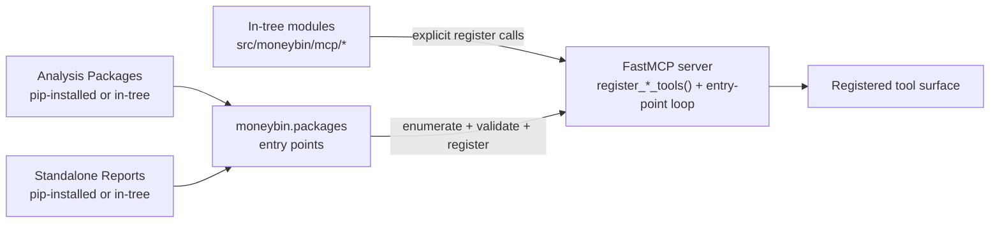
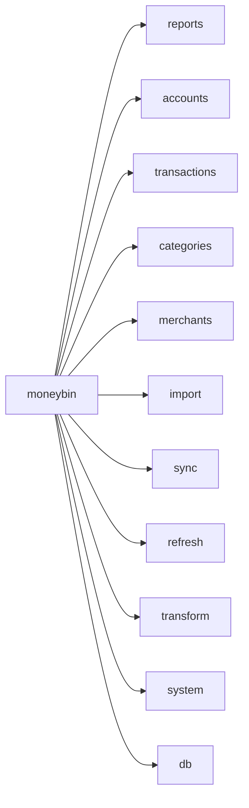

# MCP Architecture & Design

> Companions: [`privacy-and-ai-trust.md`](privacy-and-ai-trust.md) (AI data flow tiers, consent model), [`moneybin-mcp.md`](moneybin-mcp.md) (concrete tool/prompt/resource definitions), [`mcp-tool-surface-scaling.md`](mcp-tool-surface-scaling.md) (M3K.2’s 45-tool standard registry and promotion evidence), [`extension-contracts.md`](extension-contracts.md) (contributor-facing surface — packages and reports register capabilities into this server via entry points), [ADR-003: MCP Primary Interface](../decisions/003-mcp-primary-interface.md)
> Supersedes: `mcp-tier1-tools.md` (prototype-era tool list), [`archived/mcp-read-tools.md`](archived/mcp-read-tools.md), [`archived/mcp-write-tools.md`](archived/mcp-write-tools.md)

## Purpose

This spec defines the architecture, design philosophy, and conventions for MoneyBin's MCP server and its symmetric CLI surface. It is the "how we think about MCP tools" document. The companion spec [`moneybin-mcp.md`](moneybin-mcp.md) defines every concrete tool, prompt, and resource — the "what we're building" document.

Together they replace the prototype-era MCP specs (read tools, write tools, tier-1 tools) with a production-grade design built for modern AI desktop applications.

## Status

in-progress

## Mission

**MoneyBin's MCP server is the primary programmatic interface to the user's financial data.** It serves two classes of consumer — AI desktop apps (Claude, ChatGPT, Cursor) and AI-augmented CLIs (Claude Code, Codex) — with equal priority. The CLI is functionally equivalent and human-optimized.

---

## 1. Design Philosophy

### Core tenets

1. **Import-first, not ledger-first.** Transactions enter MoneyBin through source files (OFX, CSV, PDF) and connectors (Plaid). There is no general-purpose `add_transaction` tool. Corrections and annotations are metadata on source-imported records, not counter-entries. This is a data warehouse, not an accounting ledger.

2. **Privacy by architecture.** Every tool declares a data sensitivity tier.
   Classification and critical-field masking are wired through shared
   infrastructure; the consent ledger exists, but **global consent enforcement
   is deferred**. Individual tools must not assume an automatic consent gate or
   degraded response.

3. **Batch-first, composable tools.** Each tool is designed to be called once per turn and return a complete, actionable result. Tools that operate on collections (categorization, rule creation, corrections) accept lists, not single items. Complex workflows compose multiple tools across turns, not multiple calls within a turn.

4. **AI-ergonomic by default.** Tool names, descriptions, and parameter schemas are designed for LLM tool selection. Response shapes give the model enough context to reason (structured data with summary metadata) without overwhelming the context window (pagination, configurable detail levels).

5. **CLI capability symmetry.** MCP and CLI cover the same capability IDs and
   observable service outcomes with surface-appropriate ergonomics. Method and
   name equality are not required. Both are thin surfaces over a shared service
   layer; neither implements business logic directly.

### Import-first rationale

Traditional personal finance tools (Beancount, GnuCash, YNAB) treat manual transaction entry as a primary workflow. This made sense when bank data was hard to get. In 2026, with OFX exports, CSV downloads, and Plaid API access, manual entry is a legacy interaction model.

MoneyBin's position:

- **Transactions come from sources** — files and connectors. Every transaction has provenance.
- **Corrections are metadata** — when a source record is wrong, the fix is an override in the prep layer ("for this transaction_id, the canonical amount is $42.50"), not a counter-entry in a ledger. The correction travels with the transaction, is auditable, and doesn't create phantom records.
- **Annotations enrich, they don't create** — tags, notes, and cash breakdowns are metadata on existing transactions. A $200 ATM withdrawal can be annotated with how the cash was spent, but the annotation doesn't create new transactions that double-count the withdrawal.
- **No general-purpose `add_transaction`** — investment trades, manual adjustments, and other sourceless records wait for their domain-specific source (broker CSV import, Plaid Investments). Domain-specific recording tools may exist within their namespace (e.g., future `investments.record_trade`), but there is no generic transaction creation tool.

This philosophy is a deliberate product decision. MoneyBin is a data platform that imports and analyzes financial data, not a bookkeeping tool that records it manually.

---

## 2. Architectural Layers

### The service layer contract

MCP tools and CLI commands are both thin wrappers around the same service layer. Neither contains business logic — they translate between their interface idiom (MCP tool calls / Typer commands) and service method calls.

```
+-----------------+  +-----------------+
|    MCP Tools    |  |       CLI       |
|    (FastMCP)    |  |     (Typer)     |
+--------+--------+  +--------+--------+
         |                     |
         v                     v
+------------------------------------------+
|          Privacy Middleware               |
|  (classification, critical-field masking,|
|   response filtering; consent gate deferred) |
+---------+--------------------------------+
          |
          v
+------------------------------------------+
|            Service Layer                 |
|  (business logic, queries,               |
|   data operations)                       |
+---------+--------------------------------+
          |
          v
+------------------------------------------+
|              DuckDB                      |
|     (raw / prep / core / app)            |
+------------------------------------------+
```

### Key boundaries

- **MCP/CLI layer** — Parameter validation, input/output formatting, help text.
  No SQL or business logic. Both map to the same capability and service
  outcomes, not necessarily 1:1 methods.
- **Privacy middleware** — Carries sensitivity classification and wired
  critical-field masking/response filtering. The consent ledger is available,
  but global consent enforcement is deferred; tools must not assume a missing
  grant will block or degrade a response.
- **Service layer** — Business logic, query construction, data operations. Parameterized SQL only. Returns typed Python objects (dataclasses or Pydantic models), never raw query results.
- **DuckDB** — Read-only connection for queries, short-lived write connection for mutations (existing pattern from the prototype).

### Privacy middleware: current state and target flow

The middleware sits between the tool/CLI layer and the service layer. Today it
carries sensitivity classification and critical-field masking where wired. The
consent ledger exists, but **global consent enforcement is deferred**.

#### Target consent/degradation flow (not yet enforced)

When global enforcement is implemented, the middleware will apply this flow on
every call:

1. **Resolve sensitivity tier** — look up the tool's declared sensitivity.
2. **Check consent** — for tier-2+ tools, verify active consent grant for the relevant feature category (`mcp-data-sharing`).
3. **If consented (or tier 0/1)** — pass through to service layer, log to audit table, return full result.
4. **If not consented** — call the service layer's *degraded* variant (aggregates instead of row-level data), append consent instructions to the response, log the degraded call to audit table.
5. **Always** — redact critical-tier fields (account numbers, SSNs) regardless of consent, unless verified-local mode with `LOCAL_UNMASK_CRITICAL` enabled.

Until that target ships, tool authors must not depend on the middleware to
check consent or substitute a degraded response.

---

## 3. Tool Taxonomy & Namespace Design

### Namespace structure

Tools use a hybrid namespace that reflects the most natural way an AI or user would think about the action. The first segment is the **domain**, the second is the **action or view**.

| Namespace | Domain | Purpose |
|---|---|---|
| `system_*` | Orientation and audit | Data inventory, audit, and operation reversal |
| `reports` | Read-only analytics | Registered catalog and report execution |
| `accounts_*`, `investments_*` | Financial entities | Account state, balances, investment ledger, and lots |
| `transactions_*`, `reviews*` | Transaction workflows | Query, curation, categorization, and user decisions |
| `taxonomy_*` | Reference data | Categories and related taxonomy target state |
| `import_*` | File ingestion | Import, preview, confirmation, status, and reversal |
| `sync_*`, `gsheet_*` | External connections | Mediated financial sync and user-controlled sheets |
| `privacy_*` | Consent | Privacy read and consent target state |
| `refresh_*`, `sql_*` | Platform operations | Derived-state workflow and read-only SQL |

### Namespace principles

1. **One namespace per concern, not per entity.** `import` handles all file types — there's no `import_ofx`, `import_csv`, `import_pdf`. The tool figures out the file type or accepts a hint parameter.
2. **Read and write in the same namespace.** `transactions_categorize_commit` (write) lives alongside the read paths in the same `transactions_*` taxonomy. The verb in the tool name distinguishes intent.
3. **No CRUD naming.** Tools are named for what the user wants to accomplish, not the database operation. `transactions_categorize_commit` not `create_transaction_categories`; `accounts_set` not `update_account`.
4. **New domains require admission.** A new prefix is a public-contract change;
   it must pass the seven-question admission record. Multi-currency remains a
   crosscutting service concern, not a separate namespace.

### Naming conventions

- **Noun = query.** `reports`, `accounts`, `transactions`, and `reviews` return
  typed projections. No `_list` suffix: collection/detail/summary selection is
  expressed by a bounded view or filter, not a second public identity. See
  `.claude/rules/surface-design.md` "Verb conventions".
- **Verb = action.** `transactions_categorize_commit`, `refresh_run`, `import_files` — mutates state.
- **Underscore separator.** `accounts_balances`, `transactions_categorize_commit`.
  The MCP spec (rev 2025-11-25) and SEP-986 permit dot-separated namespaces
  (e.g. `reports.spending`), and dots were the original convention here.
  **Anthropic's and OpenAI's first-party clients enforce a stricter
  `^[a-zA-Z0-9_-]{1,64}$` regex**
  ([issue #1063](https://github.com/modelcontextprotocol/modelcontextprotocol/issues/1063))
  and reject dots, so the portable subset is `[A-Za-z0-9_-]`.

### Tool registration paths

Tools land on the FastMCP server through two discovery paths. Both will produce the same registered shape — the agent cannot distinguish them, and the surface-discipline, taxonomy, and sensitivity rules above apply identically to each.

1. **In-tree imports.** Core MoneyBin tools live under `src/moneybin/mcp/` and are wired in by explicit `register_*_tools(mcp)` calls in `mcp/server.py`. This is the path for the current standard-45 snapshot.
2. **Entry-point discovery and registration.** The package framework implements `discover_packages()` over the `moneybin.packages` entry-point group and `register_package()` for manifest, capability, prefix, and quality-scale validation before a package hook is imported. Installed package entries therefore remain subject to explicit registration and the same public-surface admission record; installation alone does not create a tool slot or bypass the exact standard registry. An admitted operational package tool must be included in the evaluated registry snapshot. Report extensions instead register a stable report-catalog entry, `TableRef` wiring, and an ergonomic CLI command from one `@report` runner; MCP executes them through the single admitted `reports` tool, never an additional tool. See `extension-contracts.md` §"Auto-generation of report surfaces".

The naming conventions above are load-bearing for path 2: a package named `assets` may only register tools prefixed `assets_*`, and registration will refuse to start when a package's tool names violate its declared prefix. This is how the taxonomy will stay coherent as the registered set grows beyond what `mcp/server.py` imports directly.



For the consuming agent there is one surface, governed by one set of rules. The two paths exist for the contributor — they determine *who* can add a tool and through what review gate — not for the runtime.

### Tool disclosure: full surface, taxonomy-led

**Current registry.** The operating surface is one 45-tool standard registry.
Generic clients receive every tool. Supported hosts may defer schemas from that
same registry without reconnect, packs, or profiles; names, annotations,
approvals, allowlists, and audit identity do not change. Reports are catalog
entries behind `reports`, never tool slots. The deterministic contract passes,
but promotion remains unready while context-budget and host-deferral evidence
are `not_observed`.

> **Decision (2026-05-17, supersedes the 2026-05-10 "wired but disabled" stance):** Client-driven progressive disclosure is retired as a strategy. The full registered tool surface is visible at connect. Orientation is delivered through the FastMCP `instructions` field in the `initialize` response and through prefix-grouped tool names with crisp descriptions — both surfaces MoneyBin controls end-to-end. `moneybin_discover`, `MoneyBinSettings.mcp.progressive_disclosure`, and the `Visibility(False, tags={domain})` transforms have been removed. The `tags={domain}` markers on tools (still set via `@mcp_tool(domain=...)`) are kept as dormant metadata, in case a future first-party client (M3C Web UI, or anything driving the Anthropic API directly) can implement prompt-level schema injection in the style of Claude Code's `tool_search`.

> **Historical context (2026-07-15):** the former registry of 105 tools exceeded
> Windsurf's ceiling. It is now the frozen byte/evaluation baseline; it is not
> the live registry. M3K.2 selected the current 45-tool standard registry.

#### Why retire client-driven disclosure

`tools/list_changed` is part of the MCP spec, but client support is too uneven to design against — Claude Desktop is unreliable, VS Code Copilot and most generic MCP clients ignore it, and Claude Code's reliable handling is a property of the harness rather than the protocol. Building MoneyBin's disclosure story on a capability most clients lack means the agent silently never sees the extended tools because the client never re-fetches the list. That failure mode is worse than the soft cost of an above-sweet-spot tool count, because the soft cost is recoverable through three levers MoneyBin controls entirely:

1. **`instructions` field as the AI's elevator pitch.** ~200–400 tokens at session start enumerating top-level domains, the response envelope shape, sensitivity tier legend, and "where to look first" pointers. Already wired and treated as load-bearing (see `.claude/rules/mcp.md` "Server Instructions Field").
2. **Prefix-grouped names + sharp descriptions.** The taxonomy *is* the discovery UI. A model that cannot pick the right tool from a well-named full surface will not be rescued by progressive disclosure either.
3. **Surface discipline.** A tool may be registered only when its backing spec in `docs/specs/INDEX.md` reaches `in-progress` or `implemented`. No stubs on the public surface. Codified in `.claude/rules/mcp.md` "Surface change discipline".

#### Historical pre-cutover tool namespaces

| Namespace | Purpose |
|---|---|
| `accounts.*` | Account listing, balances, net worth |
| `investments.*` | Ledger events, holdings, tax lots, realized gains, securities catalog |
| `transactions.*` | Universal query, corrections, annotations, categorization (incl. rules, merchants, ML, auto-rule review), recurring |
| `reports.*` | Cross-domain analytics: networth, spending, cashflow, financial health, budget vs actual |
| `categories.*`, `merchants.*` | Taxonomy reference data |
| `import.*`, `sync.*` | Data ingestion (files, providers) |
| `system.*` | Orientation, data status, audit log, schema health |
| `sql.*` | Read-only escape hatch |

This table is an archival naming snapshot only. It does not describe the live
registry, current admission policy, or current orientation surface; those are
defined by the 45-tool standard registry and its governing scaling spec.

#### Design implications for new tools

- Assume every registered tool is always visible to the agent. Its description, parameter schema, and namespace placement compete for the same finite attention budget as every other tool.
- The description opens with distinct intent-specific selection guidance and
  carries operation-specific mutation, recovery, and precondition details.
  Shared trust, privacy, and sign-convention prose belongs in server
  instructions where it can be loaded once. See `.claude/rules/mcp.md`
  "Description requirements".
- The `actions` array in response envelopes is the only remaining "what to call next" affordance. When a tool returns `actions`, those tools are already registered and callable — no discover step in between.
- When proposing a new tool, ask: does the work it does justify ~50–150 tokens of permanent model attention forever? If not, fold it into an adjacent tool (a parameter, a `detail` level) or drop it.

#### Why this is now being revisited

The original decision named two conditions that would warrant reopening:

1. **Client convergence on reliable disclosure.** If `tools/list_changed` becomes universally honored across the major clients MoneyBin targets, the dormant tag metadata can be re-activated without re-architecting.
2. **First-party MoneyBin client.** A MoneyBin-owned Web UI (M3C) or direct Anthropic API host could implement prompt-level schema injection in the style of Claude Code's `tool_search`. Worth re-evaluating once M3C is concrete.

Universal `tools/list_changed` support has not arrived, so server-driven
dynamic disclosure remains rejected. The revisit is instead triggered by a
hard client ceiling and a third path that does not require server mutation:
consolidate to one bounded standard registry, then let capable hosts defer
schemas from that same registry. Generic clients receive it in full. The
45-tool registry is operating; its promotion evidence remains incomplete.

### Multi-currency as a crosscutting concern

Multi-currency is not a tool domain. It surfaces as:

- A **parameter** on existing tools (e.g., `detail` level that includes native currency alongside home-currency amounts).
- **Response metadata** (`display_currency`, `native_currencies` — see section 4).
- A **service-layer concern** (conversion at query time using cached exchange rates).
- **Rate overrides** handled via the curation taxonomy (a per-transaction note / split / tag, or a manual reversing transaction via `transactions_create`) — `transactions_correct` was retired in favor of the curation tools per `transaction-curation.md`.

---

## 4. Tool Design Patterns

### Batch semantics

Tools that operate on collections accept and return lists in a single call. The pattern:

1. **Read tool** returns candidates with enough context for the AI to reason about all of them.
2. **AI reasons** across the full set in one turn.
3. **Write tool** accepts the full list of decisions in one call.

```
Turn 1: transactions_categorize_assist(limit=50)
        -> returns 50 redacted candidate transactions with descriptions, amounts, dates, suggested categories

Turn 2: transactions_categorize_commit([{id: "tx_1", category: "groceries"}, {id: "tx_2", category: "dining"}, ...])
        -> applies all 50 categorizations, returns summary: {applied: 48, skipped: 2, errors: [...]}
```

No tool accepts a single item when a list is the natural unit of work. Tools that *could* operate on one item still accept a list — a list of one is fine.

### Response envelope

Every tool returns a consistent envelope:

```json
{
  "summary": {
    "total_count": 247,
    "returned_count": 50,
    "has_more": true,
    "period": "2026-01 to 2026-04",
    "sensitivity": "medium",
    "display_currency": "USD"
  },
  "data": [ ... ],
  "actions": [
    "Use reports(report_id=\"core:spending\", parameters={...}) for a category breakdown",
    "Use transactions(date_from=..., date_to=...) for row-level transactions in this window"
  ]
}
```

Three sections:

- **`summary`** — Metadata the AI needs to frame its response: counts, whether results are truncated, the time period covered, the sensitivity tier of the data returned, the currency amounts are denominated in. Always present, even on empty results.
- **`data`** — The payload. Structured objects, never pre-formatted strings. Shape is tool-specific but consistent within a namespace (all `spending.*` tools return amounts in the same format with the same field names).
- **`actions`** — Contextual next steps. Not prescriptive — the AI decides whether to surface them. Helps the AI discover composable follow-up tools without scanning the full tool catalog. Empty list when no follow-ups are relevant.

### Currency in responses

Currency information lives in response metadata, not per-row:

- **`summary.display_currency`** — the currency all amounts are denominated in (home currency after conversion). One field, top of response.
- **`summary.native_currencies`** — present only when the result spans multiple source currencies, so the AI knows conversions were applied.
- **Per-row `currency` field** — only when a tool returns rows in their native (unconverted) currencies. This is the exception, not the default.

Single-currency users see zero currency fields on individual rows.

### Target: degraded responses (not yet enforced)

When global consent enforcement ships, a tier-2 tool called without consent
will use this degraded variant. The target response uses the **same envelope**
so the AI does not need special handling:

```json
{
  "summary": {
    "total_count": 247,
    "returned_count": 5,
    "has_more": false,
    "period": "2026-01 to 2026-04",
    "sensitivity": "low",
    "degraded": true,
    "degraded_reason": "Transaction-level data requires data-sharing consent"
  },
  "data": [
    {"category": "Groceries", "total": 1245.67, "transaction_count": 42},
    {"category": "Dining", "total": 387.20, "transaction_count": 18}
  ],
  "actions": [
    "Run `moneybin privacy grant mcp-data-sharing` to enable full transaction details"
  ]
}
```

Target properties:

- **Never fail.** The tool always returns *something* useful within the current consent level.
- **Same envelope.** `summary.degraded: true` signals the AI that the response is limited. The AI can mention this to the user or silently work with what's available.
- **Aggregate, don't truncate.** A degraded response returns category totals, not the first 5 transactions. The user still gets value.
- **One consent action.** The `actions` array tells the AI exactly how to unlock full data. One command, not a privacy policy essay.

### Pagination

Tools return a configurable number of results (default varies by tool, respects `MAX_ROWS`). For large result sets:

> **Current contract:** the bounded registry uses noun-oriented coarse reads —
> `reports`, `accounts`, `accounts_balances`, `transactions`, `reviews`, and
> `privacy`. Views and filters carry query variation; `_list` is not used for
> additional read identities. See `.claude/rules/surface-design.md`.

- **`limit`** and **`offset`** parameters on read tools that can return unbounded results.
- **`summary.has_more: true`** signals more data is available.
- **Prefer filtering over paging.** Tools expose rich filter parameters (date ranges, amount thresholds, categories, accounts) so the AI narrows the query rather than paging through everything. A well-filtered query should rarely need page 2.

### Parameter conventions

Consistent across all tools:

| Parameter | Convention | Example |
|---|---|---|
| Date ranges | `start_date` / `end_date` as ISO 8601 strings, optional | `2026-01-01` |
| Lookback | `months` integer as alternative to explicit dates | `months=3` |
| Account filter | `account_id`, optional, accepts list | `["acct_1", "acct_2"]` |
| Pagination | `limit` (default per tool), `offset` (default 0) | `limit=50, offset=100` |
| Output detail | `detail` enum: `summary`, `standard`, `full` | `detail="full"` |

The `detail` parameter controls response verbosity — `summary` returns aggregates only (always tier-1 safe), `standard` is the default, `full` includes every available field. This gives the AI a way to request minimal data when it only needs a quick answer.

---

## 5. Sensitivity Tiers & Privacy Integration

### Tool sensitivity declarations

Every tool declares its **maximum data sensitivity** — the highest sensitivity tier that could appear in its full (non-degraded) response. This is a static property of the tool, not a runtime calculation.

Classification and critical-field masking are current behavior. The consent
ledger is current, but **global consent enforcement is deferred**; the
consented/not-consented columns below describe the target gate, not current
response behavior.

| Sensitivity | Data characteristics | Consent-enforcement target | Example tools |
|---|---|---|---|
| `low` | Aggregates, counts, category labels, structural metadata | None | `reports`, `system_status`, `accounts` |
| `medium` | Row-level data: descriptions, amounts, dates, merchant names | `mcp-data-sharing` (tier-2, persistent) | `transactions`, `reviews`, `transactions_categorize_assist` |
| `high` | Responses that include critical-tier fields (account numbers, routing numbers) — masked for cloud backends, unmaskable only in verified-local mode | `mcp-data-sharing` (tier-2) + masking invariant | `accounts` |

### Target sensitivity behavior by tier (not yet enforced)

| | `low` tool | `medium` tool (consented) | `medium` tool (not consented) | `high` tool (consented) | `high` tool (not consented) |
|---|---|---|---|---|---|
| Response | Full data | Row-level data, critical fields masked | Degraded to aggregates | Full data, critical fields masked unless verified-local + `LOCAL_UNMASK_CRITICAL` | Degraded to aggregates |
| Audit logged | Yes | Yes | Yes (degraded) | Yes | Yes (degraded) |

### Target consent/degradation flow through the middleware (not yet enforced)

```
Tool declares: sensitivity = "medium"
                    |
                    v
        +-- Consent granted? ------- Yes --> Full response
        |                                    (critical fields still masked)
        |
        No
        |
        v
  Degraded response
  (aggregates only, sensitivity = "low")
```

Once the target gate ships, the tool author will write one service method that
returns full data while the middleware handles:

- Checking consent status for the tool's declared sensitivity.
- Swapping in the degraded service method when consent is absent.
- Masking critical-tier fields in all responses regardless of consent (unless verified-local override).
- Logging the call to the audit table.

### Target sensitivity and the `detail` parameter (not yet enforced)

The `detail` parameter interacts with sensitivity:

| `detail` value | `low` tool | `medium` tool (consented) | `medium` tool (not consented) |
|---|---|---|---|
| `summary` | Aggregates | Aggregates (no row-level data sent even with consent) | Aggregates |
| `standard` | Default view | Row-level with standard fields | Degraded aggregates |
| `full` | Expanded view | Row-level with all fields | Degraded aggregates |

After the target gate ships, `detail=summary` will provide a tier-1-safe answer
without a consent check. Until then, this table is design guidance, not an
automatic enforcement guarantee.

### Target verified-local bypass (not yet enforced)

When the target gate ships, a configured verified-local AI backend (Ollama on
localhost) will:

- Tier-2 consent gates are skipped — data never leaves the machine.
- `summary.sensitivity` still reflects the true tier for transparency.
- Audit log still records the call with `backend_local=true`.
- Critical field masking remains on by default (user can override with `LOCAL_UNMASK_CRITICAL`).

### Dependencies consumed (not defined here)

| Subsystem | What this spec needs from it |
|---|---|
| Redaction engine | Field-level masking rules per sensitivity tier, deterministic redaction |
| Consent management | `app.ai_consent_grants` schema, grant/revoke lifecycle, consent check API |
| Audit log | Unified `app.audit_log` schema, logging contract, query API — AI calls land as `action='ai.external_call'`. See [`transaction-curation.md`](transaction-curation.md) §Data Model. |
| Provider profiles | `AIBackend` interface, provider metadata, verified-local detection |

Each gets its own spec. This spec defines how the MCP layer *consumes* them.

---

## 6. Prompts & Resources

### Prompts

MCP prompts are guided workflows — structured templates that help the AI walk the user through a multi-step task. They're not tools (they don't execute actions), they're scripts that orchestrate tool calls.

**Design principles:**

1. **Workflow-oriented, not tool-oriented.** A prompt represents a user goal
   ("review my monthly finances"), not a tool wrapper ("call
   reports(report_id=...) with these parameters"). The prompt orchestrates
   multiple tools.
2. **Opinionated sequence.** Each prompt defines the order of operations, what data to gather, what to present, and when to ask the user for input. The AI follows the script rather than improvising.
3. **Composable with tools.** Prompts reference tools by name. When tools evolve (new parameters, richer responses), prompts automatically benefit.
4. **Few, high-value.** Prompts exist for workflows that are common enough to standardize and complex enough that an AI might not discover the right tool composition on its own.

**Prompt categories:**

| Category | Purpose | Examples |
|---|---|---|
| **Review** | Periodic financial review workflows | Monthly review, annual review, tax prep |
| **Triage** | Investigate and resolve pending items | Categorization triage, match review, anomaly investigation |
| **Setup** | First-run and configuration workflows | Onboarding, privacy setup, import wizard |

**Prompt-tool contract:** Prompts specify which tools to call and in what
order, but the tools do the work. Prompts must not assume an automatic consent
gate or degraded response: global consent enforcement is deferred. They should
minimize sensitive data in their requested and summarized results.

### Resources

MCP resources are read-only data endpoints that give the AI ambient context without requiring a tool call. They're loaded into context when the AI connects, not on demand.

**Design principles:**

1. **Ambient, not interactive.** Resources provide background context the AI needs to be helpful — schema information, configuration state, available accounts. They don't accept parameters or perform actions.
2. **Small and stable.** Resources should be compact enough to load into context without waste. They change infrequently (account list, schema shape, privacy status).
3. **Bootstrap the AI.** The right set of resources means the AI's first tool call is the right one. Without resources, the AI has to call `overview_status` before it can do anything useful.

**Resources:**

| Resource | Content | Why ambient |
|---|---|---|
| `moneybin://status` | Data freshness, row counts, date ranges per source, last import timestamp | Lets the AI know what data exists without a tool call |
| `moneybin://accounts` | Account list with types, institutions, currencies | Lets the AI reference accounts by name, filter by type |
| `moneybin://privacy` | Active consent grants, configured backend, consent mode | Lets the AI know what it can and can't do before hitting a consent wall |
| `moneybin://schema` | Core table schemas with column descriptions | Lets the AI write accurate SQL in `sql_query` without calling `describe_table` first |

**What's NOT a resource:** Anything that changes frequently (transaction lists, balance snapshots, budget status) or requires parameters (filtered queries). Those are tools.

---

## 7. CLI capability symmetry

### Shared service layer

The MCP server and CLI are co-equal consumers of the same service layer. The
symmetry is structural and outcome-based: both map to the same capability IDs,
typed domain operations, and observable results. One MCP umbrella may call
several service stages that remain separate CLI operator commands.

```python
# Shared registered report
SPENDING = ReportSpec(
    report_id="core:spending",
    runner=spending,
    parameter_schema=...,
)


# MCP: one catalog/runner for every ReportSpec
@mcp_tool(sensitivity="low")
def reports(
    report_id: str | None = None,
    parameters: dict[str, object] | None = None,
) -> ResponseEnvelope:
    with get_database(read_only=True) as db:
        return ReportRegistry(db).catalog_or_execute(report_id, parameters)


# CLI: one ergonomic command for this report
@reports_app.command("spending")
def reports_command(from_month: str | None = None) -> None:
    with get_database(read_only=True) as db:
        result = ReportRegistry(db).execute(
            "core:spending",
            {"from_month": from_month},
        )
    render_table(result.columns, result.rows)
```

This illustrates the operating M3K.2 shared-service shape. The concrete
registered schemas and report catalog remain authoritative in the runtime
snapshot and `moneybin-mcp.md`.

### What symmetry means in practice

| Concern | MCP | CLI |
|---|---|---|
| **Capabilities and outcomes** | Same capability IDs | Same capability IDs |
| **Parameters** | JSON schema optimized for agents | Typer arguments/options optimized for humans |
| **Output format** | Structured JSON (response envelope) | Human-readable tables, status lines, icons per `cli.md` |
| **Privacy enforcement** | Middleware intercepts tool calls | Same middleware wraps service calls |
| **Error handling** | Structured error in response envelope | `logger.error` + `typer.Exit(1)` |
| **Discoverability** | Tool descriptions + `actions` array | `--help` + command group structure |

`transactions_categorize_commit` has direct command parity because the natural
shape matches both surfaces. `refresh_run`, by contrast, is an MCP workflow
umbrella while the CLI may retain separate match, transform, categorize, and
identity stage controls. Both forms reach the same service outcomes.

### What symmetry does NOT mean

- **Not identical UX.** The CLI uses tables, progress bars, and icons. MCP returns structured data. Same data, different presentation.
- **Not identical invocation.** `moneybin reports spending --from-month
  2025-01` versus `reports(report_id="core:spending",
  parameters={"from_month": "2025-01"})`.
- **Not identical granularity.** CLI subgroups make surgical operator commands
  cheap to discover. MCP spends a permanent context and selection budget per
  tool, so compatible operations consolidate around intent.
- **Mostly hand-crafted, with a generated report exception.** The CLI is hand-crafted for human ergonomics and is not auto-generated from MCP tool schemas; most surfaces are independently authored over a shared service layer. View-backed reports share one `@report` runner that generates their catalog entry and ergonomic CLI command (see `extension-contracts.md`). Under M3K.2, MCP calls the generic `reports` runner rather than generating one tool per report.

### CLI command structure

The CLI uses corresponding domain groups, but need not mirror MCP tool
granularity (no `data` subgroup — `transform`, `import`, and `sync` are
siblings under `moneybin`). The authoritative surface is
[`moneybin-cli.md`](moneybin-cli.md); the shape today:



CLI groups use the applicable operation shapes from
`.claude/rules/surface-design.md`; they do not mechanically expose every verb.
See [`moneybin-cli.md`](moneybin-cli.md) for the current subcommand list and
[`moneybin-capabilities.md`](moneybin-capabilities.md) for the CLI↔MCP outcome
map.

### Metadata for AI consumers

Both surfaces carry enough metadata for AI tools (Claude Code, Codex) to use the CLI effectively:

- **CLI help text** mirrors MCP tool descriptions — same language, same parameter documentation.
- **Structured output flag** — `--output json` on any CLI command returns the same response envelope as the MCP tool, enabling AI tools that prefer CLI to parse results programmatically.
- **Exit codes** are consistent and documented: 0 = success, 1 = error, 2 = consent required.

`--output json` lets an AI consume a CLI report or operation through its
documented command-specific arguments and the equivalent outcome envelope, with
no parsing heuristics needed.

---

## 8. MCP Apps Readiness

This spec does not define MCP Apps — that is the immediate follow-on spec. But every tool designed here must be consumable by an MCP App without needing tool changes later.

### Design-for-Apps principles

1. **Structured data, never pre-formatted.** Tools return typed fields (`amount: 1245.67`, `date: "2026-04-15"`) not display strings (`"$1,245.67"`, `"April 15, 2026"`). Formatting is the consumer's job — whether that consumer is an AI composing a text response or an App rendering a chart.

2. **Aggregation-ready responses.** `reports(report_id=..., parameters=...)`
   returns time-series entries in a shape that maps directly to chart axes —
   arrays of `{period, value}` objects, not prose summaries. An App can render
   a chart from the response without post-processing.

3. **Currency in metadata, not per-row.** `summary.display_currency` at the top of the response, not `currency: "USD"` on every row. Per-row currency fields only when the response contains mixed unconverted currencies (see section 4).

4. **Field names chosen deliberately.** Field names in response schemas will become the API contract at 1.0. Before 1.0, breaking changes are acceptable and handled by the migration playbook. No versioning overhead prematurely — but names are chosen with care because they'll stick.

5. **Summary metadata enables adaptive rendering.** The `summary` section (`total_count`, `has_more`, `period`, `degraded`) gives an App enough information to decide how to render: show a "load more" control, display a "limited data" banner, or switch from detail to aggregate view.

### What the MCP Apps spec will own

The follow-on MCP Apps spec will define:

- Which tools get App companions (spending dashboard, import wizard, portfolio when investments exist)
- HTML/JS rendering approach (inline vs. resource-served, chart library choice)
- App manifest format and client compatibility testing
- Interaction model (read-only charts vs. write-back actions)
- Fallback behavior when the MCP client doesn't support Apps

This spec's job is to ensure that when the Apps spec arrives, it finds a tool surface that's ready to consume. The Apps spec is planned as the immediate follow-on to ship a proof-of-concept App MVP as soon as the tool surface is implemented.

### Remote HTTP transport (future milestone — design inputs)

Today the server ships full-capability stdio plus **unauthenticated** HTTP fallbacks (`--transport streamable-http` and `--transport sse` — both run with no auth branch and expose the identical full tool surface); authenticated remote HTTP is a future milestone, not part of v1. The auth model, token lifecycle, and scope semantics are a one-way-door surface, so capturing the shape now — while it costs nothing — keeps the eventual spec from re-deriving it. Shipped competitor implementations prove out each piece:

- **Scope-filtered tool registration at connect.** Tools outside the session's granted scope are never registered, so they never appear in the tool list — better AX than registering everything and refusing at call time. This composes with, rather than reopens, the §3 "full surface at connect" decision: full surface *within the granted scope*.
- **Self-issued OAuth for self-hosters.** A self-hosted instance mints its own per-client, scope-exact tokens with no dependency on a cloud identity provider — a shipped open-source implementation demonstrates this end to end. A hosted deployment may still front a managed IdP; the self-hosted path must not require one.
- **User-visible, revocable token lifecycle.** `moneybin mcp tokens list` / `revoke` (CLI, with MCP parity where it fits the taxonomy); RFC 7009 token revocation; dynamic-client-registration clients that auto-expire after a bounded window; a connected-apps view showing what holds a token and when it was last used.
- **Profile key wrapped under token secrets.** A granted token unlocks only what its scope allows and revocation is meaningful at rest — never a bearer token that hands over the whole encrypted profile.

These are design inputs, not commitments; the milestone itself is large. The constraint that holds regardless: both unauthenticated HTTP transports (`streamable-http` and `sse`) stay gated behind an explicit opt-in and are never the recommended path — the future milestone must bring either under the auth model, not just one.

---

## 9. Dependencies & Foundational Work

### Specs this depends on (consumed, not defined)

| Dependency | What this spec needs from it | Status |
|---|---|---|
| **Redaction Engine** (new spec) | Field-level masking rules per sensitivity tier, deterministic redaction, reverse-lookup mapping | Not yet written |
| **Consent Management** | `app.ai_consent_grants` ledger and grant/revoke lifecycle; global enforcement gate | Ledger implemented; enforcement deferred |
| **Audit Log** | Unified `app.audit_log` schema, logging contract, query API — AI calls land as `action='ai.external_call'` with metadata on `context_json`. See [`transaction-curation.md`](transaction-curation.md) §Data Model and [`privacy-and-ai-trust.md`](privacy-and-ai-trust.md) §Audit log. | Implemented |
| **Provider Profiles** (new spec) | `AIBackend` interface, provider metadata, verified-local detection | Not yet written |
| **AIConfig** (new spec) | `MoneyBinSettings.ai` configuration block, backend selection | Not yet written |
| **Privacy & AI Trust** | Framework spec — the design authority for all of the above | Draft |
| **Transaction Matching** | Provenance schema, `source_type` taxonomy, match review UX | Draft |

### Q1 12-month plan interactions

| Item | Relationship |
|---|---|
| **Schema migration playbook** | New tables (`ai_consent_grants`, unified `audit_log`, corrections, annotations) need migrations on existing DBs |
| **`get_base_dir` fix** | MCP server uses this to locate the database; must be resolved before MCP v1 ships |
| **Synthetic data** | Testing the new tool surface requires realistic multi-account, multi-source data |
| **Transfer detection** | Affects spending/cashflow tool accuracy — tools should work correctly with and without transfer detection in place |

### Items removed from the 12-month plan

Based on the import-first design philosophy:

| Removed item | Original schedule | Rationale |
|---|---|---|
| **Manual transaction entry** | Q1 Month 2 | Import-first philosophy. Transactions come from sources, not manual data entry. Corrections and annotations are metadata on source-imported records, not counter-entries or phantom records. Cash spending is annotated on the ATM withdrawal, not double-counted as new transactions. |
| **Split transactions** | Q1 Month 2 | Deferred past MVP. Legacy accounting pattern for allocating one transaction across multiple categories. Not needed for MoneyBin's target segments with traditional budgeting. Revisit only if envelope budgeting is added. |

These decisions and their rationale should be documented in the 12-month plan.

### New concepts this spec introduces

| Concept | Description |
|---|---|
| **Transaction corrections** | First-class override mechanism in the prep layer — amount, date, description corrections as metadata on source-imported records, not counter-entries |
| **Transaction annotations** | Tags, notes, cash breakdowns as metadata on existing transactions |
| **Privacy middleware** | Shared classification, critical-field masking, and response filtering; global consent enforcement remains deferred |
| **Service layer formalization** | Explicit shared services consumed by both MCP and CLI, returning typed Python objects |
| **Response envelope** | Consistent `{summary, data, actions}` shape across all tools |
| **Sensitivity declarations** | Static per-tool sensitivity tier driving automatic privacy enforcement |
| **Tool disclosure** | Full registered surface visible at connect; orientation via FastMCP `instructions` field and prefix-grouped taxonomy. Client-driven progressive disclosure (`tools/list_changed` + `moneybin_discover`) retired 2026-05-17 — see §3. |

---

## 10. Relationship to Existing Specs

### Superseded specs

| Spec | Disposition |
|---|---|
| `mcp-tier1-tools.md` | Superseded. Prototype-era tool list designed before the privacy framework. Tool concepts that survive are redesigned in `moneybin-mcp.md`. |
| [`archived/mcp-read-tools.md`](archived/mcp-read-tools.md) | Historical record of the prototype. Implementation will be replaced. |
| [`archived/mcp-write-tools.md`](archived/mcp-write-tools.md) | Historical record of the prototype. Implementation will be replaced. |

### Companion specs (planned)

| Spec | Relationship |
|---|---|
| **`moneybin-mcp.md`** | Concrete tool, prompt, and resource definitions. Consumes this architecture spec. |
| **MCP Apps spec** (name TBD) | First MCP App MVP. Consumes the tool surface. Immediate follow-on to `moneybin-mcp.md`. |

### Specs that reference or depend on this one

| Spec | How it relates |
|---|---|
| [`privacy-and-ai-trust.md`](privacy-and-ai-trust.md) | Defines the privacy framework this spec consumes. MCP field minimization section references tool sensitivity declarations. |
| [`smart-import-overview.md`](smart-import-overview.md) | Pillar F (AI-assisted parsing) uses the same consent/audit infrastructure. Import tools in this spec's surface replace the prototype `import_file` tool. |
| [`matching-overview.md`](matching-overview.md) | Match-review outcomes use the admitted `reviews` and `identity_links_decide` contracts. Audit log is shared infrastructure. |
| [`extension-contracts.md`](extension-contracts.md) | Defines how third-party Analysis Packages register admitted operations and standalone Reports register catalog entries through Python entry points (`moneybin.packages`). Names, namespaces, response envelopes, and registry budgets defined here are inherited by every extension. |

## Resolved Decisions

- **`sql_query` tool.** Kept as a power-user escape hatch with guardrails:
  read-only validation, file-access function blocking, and `MAX_ROWS` cap. Its
  current contract is in [`moneybin-mcp.md`](moneybin-mcp.md).
- **Prompt count.** Seven prompts: `monthly_review`, `categorization_organize`,
  `review_auto_rules`, `onboarding`, `curate_recent_transactions`,
  `review_curation_history`, and `sync_review`. Their current contracts are in
  [`moneybin-mcp.md`](moneybin-mcp.md).
- **Service layer packaging.** All services live in `src/moneybin/services/` (flat directory, one file per service class). This directory already exists with `categorization_service.py` and `import_service.py`. New services (`spending_service.py`, `transaction_service.py`, etc.) follow the same pattern. Revisit if adding major new domains makes the flat structure unwieldy.
- **Privacy middleware implementation.** Decorator-based
  (`@mcp_tool(sensitivity="medium")`) with a middleware class for
  classification, critical-field masking, and response filtering. The global
  consent gate remains a deferred extension of that architecture.
- **Tool count strategy (operating, promotion-pending).** The 45-tool standard
  registry is visible at connect with taxonomy-led discovery and stub gating.
  Client-driven progressive disclosure remains retired. Generic clients receive
  the complete registry; supported hosts may defer schemas from that same
  registry without packs, profiles, or reconnect modes. Compatible projections,
  target-state writes, batches, workflow umbrellas, and the generic `reports`
  runner provide consolidation; materially different intent, safety,
  authorization, sensitivity, confirmation, output, audit, or recovery
  contracts keep separate identities. Promotion remains pending observed context
  budget and host-native deferral evidence. See §3 and `.claude/rules/mcp.md`.
