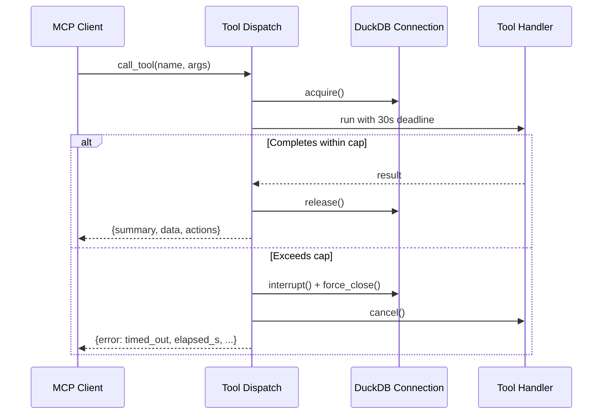

# Feature: MCP Tool Timeouts and Cancellation

## Status

implemented

## Goal

Guarantee every MCP tool call returns within a bounded wall-clock time with a structured error rather than hanging the client indefinitely. Timeouts must release the underlying DuckDB connection so subsequent calls aren't wedged behind a stale write lock.

## Background

A `import_inbox_sync` call hung the MoneyBin MCP server for 30+ minutes against a profile with five Wells Fargo QBO files in the inbox. The client (Claude Code) had no way to recover — MCP tool calls are synchronous from the agent's perspective, so the agent blocked on a response that never arrived. Worse, the first interrupted call appears to have left a DuckDB transaction open, so the reconnected server's next call immediately deadlocked behind the orphaned write lock.

Realistic SQLMesh-on-DuckDB workloads at personal-finance scale (tens of thousands to low millions of rows) complete in 1–10 seconds, with 30 seconds being a generous worst case. A multi-minute response means the server is deadlocked or in a runaway loop, not doing legitimate work.

Related code: `src/moneybin/mcp/` (tool registration and dispatch), `src/moneybin/database.py` (DuckDB connection management).

## Requirements

1. Every MCP tool dispatch is wrapped in a hard wall-clock timeout. Default: **30 seconds**, configurable via `MoneyBinSettings`.
2. On timeout, the server attempts to interrupt the running DuckDB statement (`connection.interrupt()`) and force-close the connection, releasing any held write lock.
3. The client receives a structured timeout response — not a hang, not a transport error. The envelope follows the standard MCP tool response shape: `{summary, data: null, actions: [], error: {kind: "timed_out", tool: "<name>", elapsed_s: <float>, timeout_s: <float>}}`.
4. The server logs a single structured line per timeout including tool name, elapsed seconds, and configured cap. No PII or query payloads in the log.
5. The next tool call after a timeout must succeed (assuming the underlying issue is transient) — i.e., no orphaned connection or transaction state survives the timeout path.
6. The cap is global (one value applies to all tools). No per-tool overrides in this iteration.
7. Tools that already complete in well under the cap are unchanged in behavior; the timeout is invisible on the happy path.

## Data Model

No schema changes. One new configuration field:

- `MoneyBinSettings.mcp.tool_timeout_seconds: float = 30.0` (env: `MONEYBIN_MCP__TOOL_TIMEOUT_SECONDS`)

## Implementation Plan

### Files to Create

- `tests/moneybin/test_mcp/test_tool_timeouts.py` — unit + integration coverage for the timeout path.

### Files to Modify

- `src/moneybin/config.py` — add `tool_timeout_seconds` to the MCP settings group.
- `src/moneybin/mcp/server.py` (or wherever tool dispatch lives) — wrap every registered tool handler in a timeout guard.
- `src/moneybin/mcp/responses.py` (or equivalent envelope helper) — extend the error envelope schema to carry `kind`, `tool`, `elapsed_s`, `timeout_s`.
- `src/moneybin/database.py` — expose a context manager that yields a connection and guarantees `interrupt()` + `close()` on cancellation.

### Key Decisions

- **One global cap, not per-tool.** YAGNI: a single 30s value catches every realistic deadlock without a registry, decorators, or config sprawl. Promote to per-tool only if a specific tool proves it needs a different value.
- **Cancellation must reach DuckDB.** Naive `asyncio.wait_for` cancels the future but leaves the worker thread running and the connection held. The dispatch layer must (a) hold a reference to the active `DuckDBPyConnection`, (b) call `interrupt()` on timeout, and (c) force-close the connection in a `finally` block so the lock is released even if `interrupt()` is a no-op for the current statement (e.g., mid-`COPY`).
- **Connection-per-call as the cleanup fallback.** Each tool dispatch acquires a fresh connection from the connection manager. On timeout, that connection is closed, which aborts the transaction and releases the lock. Long-lived shared connections are not used in the MCP path.
- **No background continuation.** A timed-out call does not silently keep running. The work is cancelled. If a tool legitimately needs longer than the cap (today, none should), it must be redesigned — e.g., `import_inbox_sync` decomposed into per-file calls. Background-job semantics are explicitly out of scope for this iteration.
- **Logging stays low-cardinality.** Log tool name, elapsed seconds, configured cap. Do not log arguments — they may contain account IDs, search strings, or other sensitive context.



## CLI Interface

No CLI changes. The new settings field is reachable via the standard `MONEYBIN_MCP__TOOL_TIMEOUT_SECONDS` env var.

## MCP Interface

No new tools. The error envelope gains a structured `error` object on the timeout path:

```json
{
  "summary": null,
  "data": null,
  "actions": [],
  "error": {
    "kind": "timed_out",
    "tool": "import_inbox_sync",
    "elapsed_s": 30.0,
    "timeout_s": 30.0
  }
}
```

Existing tools that return `error: null` on success are unaffected.

## Testing Strategy

- **Unit**: a fake tool handler that sleeps 60s returns the structured timeout envelope within ~30s wall-clock.
- **Unit**: a fake tool handler that holds a DuckDB connection and runs a long query — verify `interrupt()` is called and the connection is closed on timeout.
- **Integration**: two back-to-back calls where the first times out — the second must succeed against the same profile (proves the lock was released).
- **Regression**: existing fast tools (e.g., `accounts_list`, `spending_summary`) complete unchanged and well under the cap on the standard test fixture.

## Synthetic Data Requirements

None. The timeout mechanism is data-agnostic; existing test fixtures are sufficient.

## Dependencies

- DuckDB Python API: `connection.interrupt()` (already available, no version bump).
- Python `asyncio.wait_for` (stdlib).
- No new third-party packages.

## Out of Scope

- Per-tool timeout overrides.
- Background continuation / job-handle pattern (`job_status` / `job_result` tools). If a future tool legitimately needs longer than the cap, that's the time to design this — not now.
- Streaming progress updates from long-running tools.
- Decomposing `import_inbox_sync` into per-file calls. The timeout will surface that this tool needs redesign; the redesign itself is a separate spec.
- Recovery from corrupted on-disk state caused by an unclean DuckDB shutdown. The contract is "release the lock" not "guarantee transactional consistency under SIGKILL."
- Client-side MCP request timeouts (e.g., Claude Code's per-call deadline). Those live in the client and vary across MCP hosts. This spec ensures the server always responds within the cap so a client-side timeout isn't load-bearing for correctness.
