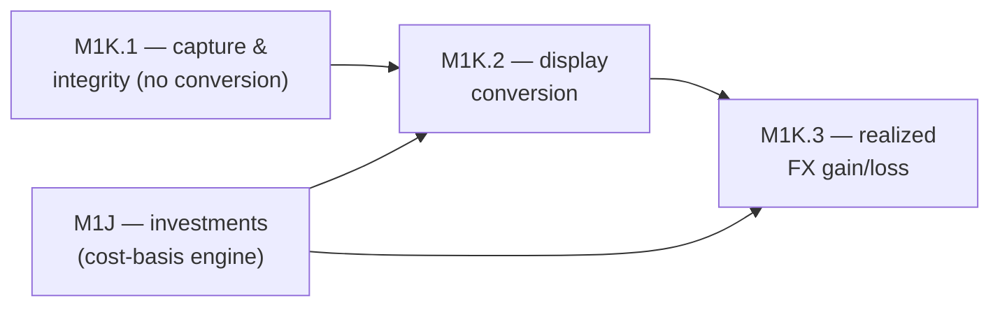

# Feature: Multi-Currency

## Status

in-progress

## Goal

Make every monetary value in MoneyBin carry an explicit currency, let a user
declare a **home currency**, and present amounts in that home currency through
**auditable conversion** — without ever silently mixing currencies or mutating the
original-currency source of truth. This is the foundational M1K schema wave: the
*original* currency is canonical at every grain; conversion is a presentation
layer staged on top.

The wave is phased so the **capture + integrity** layer (M1K.1) can land early —
independent of investments — while **live conversion** (M1K.2) and **realized FX
gain/loss** (M1K.3) follow the investment cost-basis engine they depend on.

## Background

Today amounts are *implicitly* USD, inconsistently:

- `prep.int_transactions__unioned` already carries a `currency_code`, but every arm
  defaults unknown to USD: tabular, manual, and Plaid all `COALESCE(..., 'USD')`
  (Plaid's `iso_currency_code` **is** read here — captured all the way from
  `SyncTransaction` through `stg_plaid__transactions` already — just badly
  defaulted to USD when null); **OFX hardcodes `'USD'` outright** with no read at
  all — `CURDEF` isn't captured anywhere in the OFX pipeline (raw parse, staging,
  or union) yet.
- `core.fct_transactions` exposes `currency_code`; `core.dim_accounts` has
  `currency_code` — but **balances carry no currency at all** (`core.fct_balances`,
  `reports.net_worth` have no currency column).
- Reports `SUM` across rows with no currency dimension. A user who imports EUR rows
  via CSV (currency lands in `fct_transactions`) gets every report summing EUR+USD
  into a single number while the envelope claims USD. **This is a live correctness
  bug**, not a hypothetical — M1K.1's guard closes it.

**Update, 2026-07-17:** the capture gaps and the `dim_accounts` naming described
above are closed (Requirements 1–3, 8). The no-silent-blend guard (Requirement 5)
that fully closes the live correctness bug is not yet built, so reports can still
blend currencies until it ships.

The design move is the same one [`investments-data-model.md`](investments-data-model.md)
makes: **lock the schema, stage the algorithm.** The investments spec (implemented,
PR #300) lands a `currency_code` column on its ledger/lots/gains/holdings now and
explicitly defers conversion to M1K (*"currency column now, conversion later"*) —
already adopting this spec's canonical `currency_code` naming (see §Key Decisions).
So investments is self-contained in its own denominating currency; M1K is the layer
that adds conversion across both cash and investments.

Related specs:

- [`investments-data-model.md`](investments-data-model.md) — implemented (PR #300);
  carries per-instrument `currency_code` natively; defers FX conversion to this spec.
  **M1K.3 reuses its cost-basis engine** for realized FX gain/loss.
- [`architecture-shared-primitives.md`](architecture-shared-primitives.md) — layer
  conventions; **Invariant 8** (derivations live in SQLMesh, never snapshotted into
  `app.*`); the `ResponseEnvelope.summary.display_currency` contract.
- [`reports-net-worth.md`](reports-net-worth.md) and the report recipe library —
  consumers that must segment-or-convert, never silently blend.
- [`account-management.md`](account-management.md) — `app.account_settings`; per-account
  `currency_code` already validated against ISO 4217.
- [`smart-import-financial.md`](smart-import-financial.md),
  [`smart-import-tabular.md`](smart-import-tabular.md), [`sync-plaid.md`](sync-plaid.md) —
  the capture points where currency must stop being dropped.
- [`identifiers.md`](../../.claude/rules/identifiers.md) (agent rules, not a spec) — the
  surrogate-key guideline for the M1K.3 conversion-pair identity; `raw.exchange_rates`
  itself keys naturally on `(from_currency, to_currency, rate_date, source)`.

## The core decision (one-way door)

**Original currency is the canonical stored amount at every grain. Conversion to a
home/display currency happens at presentation time — never by mutating stored
originals.**

Concretely: `amount` is always in `currency_code` (the row's original currency).
Reports, queries, and MCP envelopes convert *on read* to a requested display
currency, recording which rate they used. No converted amount is ever persisted at
row grain.

Why this is the durable path:

- **Home currency stays mutable for free.** Changing it re-presents; it never
  re-converts stored data, because nothing converted was stored.
- **Raw stays the source of truth.** Core is rebuilt from raw, not patched
  (consistent with the medallion architecture). The migration is *additive columns*,
  not a backfill of derived values.
- **Rate corrections don't strand data.** A corrected historical rate changes future
  presentation; it doesn't require rewriting millions of stored converted amounts.
- **It matches the investments pattern** ("lock the schema, stage the algorithm"),
  so the two foundational waves are coherent rather than divergent.

The rejected alternative — storing `home_amount`/`home_currency` at row grain —
forces conversion to exist before any row lands, freezes the home currency, and
makes rate corrections a data-rewrite. Not chosen.

**Shipped prior art (both rejected alternatives, both regretted in practice).**
Two competing products have shipped the very designs this decision rejects, and
their mechanics confirm the cost:

- One persists converted amounts at row grain — its own release notes describe
  amounts "stored at the historical date rate per transaction," with reports
  summing the stored figures. A corrected historical rate then means rewriting
  stored data, exactly the data-rewrite this spec avoids by converting on read.
- Another maintains derived valuation snapshots in mutable tables that require
  session-gated rebuilds and reaping of orphaned rows on every recompute — the
  standing maintenance burden that deriving in SQLMesh (Invariant 8,
  derive-don't-snapshot) removes entirely.

## Phasing

| Phase | Scope | Depends on | Notes |
|---|---|---|---|
| **M1K.1** | Currency capture & integrity (no conversion) | nothing | Independent of investments; **may be pulled into the first public release** (see [`roadmap.md`](../roadmap.md) §"The first public release"). Closes the live silent-blend bug. Requirements 1, 2, 3, 8 (capture, schema, account-currency inheritance) implemented 2026-07-17; Requirements 4–7 (home currency, no-silent-blend guard, doctor check, report guard) remain open. |
| **M1K.2** | Display conversion (auditable rates) | M1K.1 + **investments (M1J)** | The unifying conversion layer over both cash and investment grains. Sequenced after investments so it converts *everything* in one coherent pass. |
| **M1K.3** | Realized FX gain/loss | M1K.2 + investments cost-basis engine | Reuses the investments lot/cost-basis machinery; the genuinely investment-shaped part. |

**Sequencing rule:** investments (M1J) lands before M1K.2/M1K.3. The dependency runs
one direction only — realized FX gain/loss is currency-lot accounting, i.e. the same
engine securities use; it cannot precede it. M1K.1 carries no such dependency.

## Requirements

Numbered, testable. Tagged by phase.

### M1K.1 — Currency capture & integrity

1. **Currency captured at every ingestion grain.** OFX import records `CURDEF`
   end-to-end (raw parse → `stg_ofx__transactions` → union) — today none of these
   three stages capture it at all. Plaid **transaction** currency is already
   partially captured: `SyncTransaction.iso_currency_code` and
   `stg_plaid__transactions` both exist and the union already reads it (Requirement
   2 fixes how the read value gets defaulted). What's still missing on the Plaid
   side is **balances**: `SyncBalance` (`src/moneybin/connectors/sync_models.py`)
   has no `iso_currency_code`/`unofficial_currency_code` field, so balance currency
   isn't captured at all yet. Adding it to `SyncBalance` and moneybin-sync's mapping
   is an **additive, optional** contract change (one-way door: additive only).
   **Implemented 2026-07-17:** OFX `CURDEF` now flows raw parse → `stg_ofx__transactions`
   → union; `SyncBalance` gained `iso_currency_code`/`unofficial_currency_code` and
   moneybin-sync's mapping populates it.
2. **The union stops hardcoding `'USD'`.** `int_transactions__unioned.sql` reads the
   captured currency for the OFX and Plaid arms and leaves it `NULL` when the source omits
   it — it does **not** `COALESCE` to a literal `'USD'`, which would relabel a non-USD
   account's rows before account-currency inheritance (Req 3) can run. The tabular/manual
   arms' blind-`'USD'` fallback is the same class of bug (they do read source currency when
   present) and is dropped in the same pass; account inheritance (Req 3) fills currency where
   known, and anything still unknown is segmented, not guessed (Req 8).
   **Implemented 2026-07-17:** no arm (OFX/manual/tabular/Plaid) defaults to a literal
   `'USD'` anymore, including the CLI `transactions create --currency` entry point that
   fed the manual arm.
3. **Currency at every core monetary grain.** `core.fct_balances` **and the derived
   `core.fct_balances_daily`** (the model `reports.net_worth` actually aggregates) gain a
   `currency_code`; `core.fct_transactions` already carries it. `core.dim_accounts` also
   carries it today, but under the legacy name `iso_currency_code` — this phase renames it
   to `currency_code` end-to-end per the resolved naming decision and scope (§Key
   Decisions, Decision 5). Where a grain genuinely cannot know its currency, it inherits
   the account's `currency_code`, never a blind `'USD'`.
   **Implemented 2026-07-17:** `dim_accounts.currency_code` (renamed), `fct_balances`/
   `fct_balances_daily.currency_code`, and account-currency inheritance on
   `fct_transactions`/`fct_balances` all shipped.
4. **Home currency setting.** A profile-level `home_currency` (ISO 4217), **mutable**,
   defaulted by **locale auto-detection with explicit user confirmation** in the
   [first-run wizard](mcp-first-run-setup.md). Distinct from per-account currency. It is
   **`app.*` state (DB-resident)**, not YAML config — the no-blend guard and report views
   are SQLMesh models that must read it to segment home vs. foreign — so it is written
   through a `*Repo` (Invariant 10), not the generic YAML `profile set`.
5. **No-silent-blend invariant.** An aggregation across rows of differing
   `currency_code` MUST NOT emit a single combined figure unless an explicit
   conversion with recorded rate provenance is applied. Absent conversion (all of
   M1K.1), results are **segmented per currency** (a sub-total per currency), never
   blended.
6. **Doctor check.** `system doctor` reports when a profile holds more than one
   distinct currency across transactions/accounts/balances, **flags accounts/rows whose
   currency is unknown (`NULL`) so the user can assign one before it can blend**, and flags
   any report path that would violate Requirement 5.
7. **Report guard.** Report views that sum money detect mixed currency and either
   segment (default) or return an explicit "cross-currency total unavailable until
   conversion ships" signal — never a silent blend. Single-currency profiles (the
   common case, including USD-only users) see **zero behavior change**.
8. **Migration is additive.** New currency columns are nullable additions to raw tables;
   core is rebuilt from raw (no in-place core patch). The migration does **not** depend on
   `home_currency` (also introduced in M1K.1): a row with no captured currency inherits its
   account's `currency_code` (Req 3); a value still `NULL` after that is treated as
   **unknown currency** — never silently resolved to the home currency (that would be a guess
   the no-blend guard couldn't see). Unknown-currency rows are segmented out (Req 5) and
   surfaced by `system doctor` (Req 6) for the user to assign. `home_currency` itself is
   established by the first-run wizard (Req 4), not the migration. Versioned migration under
   `src/moneybin/sql/migrations/`.
   **Implemented 2026-07-17** for the capture/inheritance columns above; the Requirements 5
   and 6 behaviors referenced in this item (segmentation, doctor surfacing) are still open.

### M1K.2 — Display conversion

9. **Display currency on read.** Reports/queries/MCP accept an optional display
   currency (default: home currency) and convert original amounts to it on
   presentation, populating `ResponseEnvelope.summary.display_currency`. Original
   amounts remain available for drilldown.
10. **Auditable rate provenance.** Every converted figure traces to a stored rate — a
    provider rate in `raw.exchange_rates` (`(from_currency, to_currency, rate_date, rate,
    source, fetched_at)`, unique on `(from_currency, to_currency, rate_date, source)`) or a
    user override in `app.*` (Req 14). A "show me the rate" path exposes the exact rate
    behind any converted number (consistent with the lineage promise).
11. **Free reference-rate source.** Rates fetch lazily on first need from **Frankfurter**
    (ECB-backed, no auth, historical to 1999), cached in `raw.exchange_rates`.
    `ExchangeRate.host`/`open.er-api.com` are documented fallbacks. **Only currency
    codes and dates leave the machine — never amounts or PII** (same structural-signal
    posture as categorization redaction).
12. **Offline fails loud.** A needed historical rate that is neither cached nor
    fetchable causes an explicit, surfaced error — never a silent substitution of
    today's rate or `1.0`.
13. **Weekend/holiday handling.** A non-trading date resolves to the ECB last-published
    business day; the resolution is recorded in `rate_date` provenance, not hidden.
14. **User rate override.** A user may override an auto-fetched rate (the bank's actual rate
    differs from the ECB mid-rate). An override is **mutable user-authored state**, so it
    lives in `app.*` (e.g. `app.exchange_rate_overrides`), mutated only via a `*Repo` with
    paired audit (Invariant 10) — **not** in `raw.exchange_rates` (the immutable provider
    cache). The conversion layer prefers an app override over the cached provider rate, and a
    later provider refresh never silently overwrites it. **Scope:** an override is a daily
    reference-rate correction — one per `(from, to, rate_date)`, matching the
    `app.exchange_rate_overrides` key — *not* a per-transaction bank-spread capture. Two
    same-day transactions at different effective rates (spreads/fees) are out of scope here; a
    genuine per-transaction rate belongs on the conversion-pair model (M1K.3).
15. **Segmentation becomes the fallback.** For currency pairs the source can't provide
    (exotics, crypto-as-currency) or while offline, reports fall back to M1K.1
    segmentation rather than guessing.
16. **Investment bridge (display).** Investment holdings (which carry their own
    `currency_code` per `investments-data-model.md`) convert to home currency for a
    unified net-worth number through this same layer.

### M1K.3 — Realized FX gain/loss

17. **Conversion-pair identity.** A currency conversion event (e.g. a EUR debit paired
    with a USD credit) is modeled as a first-class pair, not inferred from two
    unrelated rows.

    **Reserved import shape — single-row FX transfer.** Some source formats express
    an FX transfer as one row carrying *both* legs (the sent amount/currency plus a
    received amount and target currency), rather than two rows. Reserve a
    received-leg column pair — `to_amount` + `to_currency` — on the raw import tables
    (`raw.*`, e.g. `raw.tabular_transactions`) where a source row lands, so an
    importer that meets this shape has somewhere to put the second leg instead of
    dropping it or fabricating a paired row; the row's own `amount`/`currency_code`
    is then the sent leg, and the conversion-pair model consumes either shape.
    `to_amount`/`to_currency` follow the directional `from_currency`/`to_currency`
    prefix convention already used on `raw.exchange_rates` — reserving them now
    (schema reservation, not yet built) keeps a later importer from coining an
    ad-hoc, differently-ordered name and compounding the currency-column naming
    drift §Key Decisions already flags. (A shipped competitor carries this shape as
    `amount_received` / `currency_to`.)
18. **Currency-lot accounting.** Realized FX gain/loss on disposing a foreign-currency
    holding is computed via the **investments cost-basis engine** (FIFO / average per
    the elected method in `investments-data-model.md`), treating currency holdings as
    lots. Realized FX gain/loss on a foreign-denominated *security* sale is the same
    engine applied to the currency leg.
19. **Decimal throughout.** All amounts and rates are `DECIMAL`, never `FLOAT`
    (`DECIMAL(18,2)` amounts; `DECIMAL(18,8)` rates per the `database.md` precision
    convention).

## Data Model

Sketch; exact DDL settled per phase during implementation planning.

### M1K.1

```sql
-- core.fct_balances: add original currency (mirrors fct_transactions)
ALTER TABLE ... ADD COLUMN currency_code VARCHAR;   -- ISO 4217; inherits account currency
-- core.fct_balances_daily (Python model feeding reports.net_worth): propagate currency_code
--   through the daily rollup so net_worth can segment/convert per currency

-- raw OFX/Plaid transaction + balance tables: capture original currency
--   OFX: CURDEF;  Plaid: iso_currency_code / unofficial_currency_code
-- prep.int_transactions__unioned: every arm reads captured currency and leaves NULL when
--   the source omits it (no COALESCE to literal 'USD'); account inheritance fills where known,
--   anything still unknown stays NULL (segmented, not guessed)

-- profile-level home currency: app.* state (DB-resident so SQLMesh guard/views can read it
-- to segment home vs. foreign), mutated via a *Repo (Invariant 10). If a profile-settings
-- app table already exists, add the field there; otherwise introduce app.profile_settings.
--   home_currency VARCHAR NOT NULL  -- ISO 4217, mutable, ISO-validated
```

### M1K.2

```sql
-- raw.exchange_rates: the auditable provider rate cache (immutable; overrides live in app.*)
CREATE TABLE raw.exchange_rates (
    from_currency  VARCHAR NOT NULL,   -- ISO 4217
    to_currency    VARCHAR NOT NULL,   -- ISO 4217
    rate_date      DATE    NOT NULL,   -- resolved trading day
    rate           DECIMAL(18,8) NOT NULL,  -- from->to multiplier; precision per database.md
    source         VARCHAR NOT NULL,   -- provider only: 'frankfurter' | 'exchangerate_host' | ...
    fetched_at     TIMESTAMP NOT NULL,
    UNIQUE (from_currency, to_currency, rate_date, source)
);

-- app.exchange_rate_overrides: user-authored overrides (mutable user state, NOT raw).
-- Mutated only via a *Repo with paired audit (Invariant 10); the conversion layer prefers
-- an override here over the cached provider rate above.
CREATE TABLE app.exchange_rate_overrides (
    from_currency  VARCHAR NOT NULL,           -- ISO 4217
    to_currency    VARCHAR NOT NULL,           -- ISO 4217
    rate_date      DATE    NOT NULL,
    rate           DECIMAL(18,8) NOT NULL,     -- user-entered; precision per database.md
    note           VARCHAR,                    -- why the user overrode the provider rate
    created_at     TIMESTAMP NOT NULL,
    updated_at     TIMESTAMP NOT NULL,
    UNIQUE (from_currency, to_currency, rate_date)
);
```

### M1K.3

Conversion-pair + realized-FX model derived in SQLMesh (Invariant 8), reusing the
`core.fct_investment_lots` / cost-basis derivation from `investments-data-model.md`.
DDL fixed when M1K.3 is planned.

## Sequencing & Dependencies



- **M1K.1** depends on nothing; independent of investments. Eligible to ride into the
  first public release.
- **M1K.2 / M1K.3** follow investments (M1J): M1K.2 is the unifying conversion layer
  over cash *and* investment grains; M1K.3 reuses the cost-basis engine.
- External: Frankfurter (M1K.2). Cross-repo: the sync-contract currency field (M1K.1)
  touches moneybin-sync.

## CLI Interface

- Set/adjust the home currency (M1K.1) — locale-detected default confirmed in the first-run
  wizard, mutable thereafter. Surfaced through the existing `profile` command group (alongside
  `profile show`), not a new `settings` group; exact invocation settles with `moneybin-cli.md`.
  Because `home_currency` is `app.*` state, the command routes through a `*Repo`, **not** the
  generic YAML `profile set` (whose `section.field` keys don't write `app.*`).
- Reports accept `--display-currency <ISO>` (M1K.2; default home).
- `moneybin fx rate <FROM> <TO> [DATE]` (M1K.2) — inspect/seed a cached rate.
- `moneybin fx override <FROM> <TO> <DATE> <RATE>` (M1K.2) — auditable user override.
  The `fx` group is a **new top-level CLI namespace**; like the MCP names above, its exact
  shape settles with the surface specs — `moneybin-cli.md` and the capabilities map must
  register it when M1K.2 is planned, not be invented standalone from this spec.
- `system doctor` gains the mixed-currency integrity checks (M1K.1).

## MCP Interface

- `ResponseEnvelope.summary.display_currency` populated whenever money is returned
  (the profile's home currency for single-currency profiles — never a hardcoded `USD`,
  which would mislabel a EUR/GBP-only user; the requested/home currency under conversion).
- M1K.2 rate / conversion / exposure operations follow the existing MCP taxonomy —
  multi-currency is a **crosscutting service-layer concern, not its own tool namespace**
  (`mcp-architecture.md`), and tool names use the noun=query / path-prefix-verb-suffix
  contract (no verb-first `get_*` / `record_*`); exact names settle with the surface specs.
  Same envelope, sensitivity, audit, and confirmation rules as every other tool.
- Per-currency segmentation surfaces in report tool output under M1K.1 (so an agent
  can see *why* there is no single total yet).

## Testing Strategy

- **Scenario fixtures (YAML):** add a multi-currency profile (e.g. USD + EUR + GBP
  cash, plus a foreign-denominated holding now that investments exist) with ground-truth
  per-currency sub-totals. Existing single-currency scenarios must be **unchanged**
  (Requirement 7: zero behavior change for single-currency profiles).
- **Guard tests (M1K.1):** a mixed-currency profile makes summing reports segment or
  flag — never emit a blended number; the doctor check fires.
- **Property-based (M1K.2/3):** round-trip conversion identity within tolerance;
  realized FX gain/loss conserves value across lots (Hypothesis, mirroring the
  investments lot-conservation tests).
- **Offline/edge (M1K.2):** missing-rate-offline fails loud; weekend/holiday resolves
  to the recorded business day; an override survives a refresh.

## Synthetic Data Requirements

The generator should be able to emit a multi-currency persona: accounts in ≥2
currencies, cross-currency transfer pairs (for M1K.3 conversion-pair ground truth),
and at least one currency outside Frankfurter's set (to exercise the segmentation
fallback). Ground truth includes per-currency sub-totals and, for M1K.3, expected
realized FX gain/loss on the conversion pairs.

## Dependencies

- **Investments (M1J)** — prerequisite for M1K.2 and M1K.3 (not M1K.1).
- **Frankfurter** (ECB reference rates; free, no auth) — M1K.2; fallbacks documented.
- **moneybin-sync** — the M1K.1 sync-contract currency field (additive).
- DuckDB / SQLMesh migration tooling — additive schema migration (M1K.1).

## Key Decisions

1. **Original currency is canonical; conversion is presentation-time** (the §"core
   decision" one-way door): convert-at-view, not store-both; additive columns, core
   rebuilt from raw.
2. **Home currency default = locale auto-detect with confirm; mutable.**
   Mutability is cheap *because* of decision 1.
3. **Rates lazy-fetch + cache, never pre-populated.**
4. **Realized FX gain/loss lives in a dedicated conversion-pair model, not a column on
   `fct_transactions`** — a conversion is a relationship between two
   events, and reuses the investments cost-basis engine.
5. **Canonical currency column name = `currency_code`** *(coherence decision — resolved
   2026-07-17).* **Decision: rename `dim_accounts.iso_currency_code` → `currency_code`
   end-to-end, as a direct rename with no deprecation shim.** Confirmed with Brandon
   2026-07-17. Exact call sites and migration steps are M1K.1 implementation-plan detail
   (see Requirement 3), not spec content — the scope in brief: the `app.account_settings`
   schema + repo, `AccountService`, `core.dim_accounts`, the privacy taxonomy/payloads,
   and the `accounts_set` MCP tool's parameter name. The CLI is already clean (`accounts
   set --currency`, not `--iso-currency-code`) and is unaffected.

   Three names existed when this spec was drafted: `currency_code` (`fct_transactions`),
   `iso_currency_code` (`dim_accounts`), `currency` (investments spec, then unbuilt).
   Investments shipped (PR #300) and adopted **`currency_code`** directly
   (`investments-data-model.md` Requirement 15). Plaid Investments sync then shipped too
   (PR #318 / moneybin-sync #29) and reinforced the same split three more times: the
   broker wire contract (`SyncSecurity`, `SyncInvestmentTransaction`, `SyncHolding`)
   deliberately keeps `iso_currency_code`/`unofficial_currency_code` (mirroring Plaid's
   own field names, consistent with how every other passthrough field is handled), while
   staging translates it and every `core.*` table — `dim_securities`, `dim_holdings`,
   `fct_investment_transactions`, `fct_transactions` — normalizes to `currency_code`.
   `core.dim_accounts` was the one remaining holdout in `core` against a pattern now
   established four times over. The raw `iso_currency_code` grep count across `src/` is
   large (dozens) but mostly irrelevant to this decision — nearly all of it is the wire
   layer above, which correctly keeps the provider's name; only the account-currency
   surface listed above is actually in scope.

   The original text here assumed the MCP-parameter rename needed the
   ship-alongside-the-old-name-for-one-release protocol from `design-principles.md`. That
   protocol is explicitly **post-launch only**; per that doc's own launch trigger
   (**M3H** hosted launch, or the first tagged release adopted by a non-author user —
   `design-principles.md` itself currently misstates this as "M3E," a separate stale
   milestone-code reference worth fixing there independently of this spec), MoneyBin is
   still pre-launch — no tag has been cut and no non-author user has adopted the MCP
   contract yet. So the rename is a direct, one-time change: no shim, no follow-up removal
   PR. Implementation is scoped to M1K.1, not this spec pass — see Requirement 3.

   **Implemented as decided, 2026-07-17:** `dim_accounts.iso_currency_code` (and
   `app.account_settings.iso_currency_code`, the `accounts_set` MCP parameter, and every
   internal reference) renamed to `currency_code` end-to-end; no shim.

## Out of Scope

- **Crypto-as-currency** (BTC/ETH *as* a denominating currency) — use the investment
  model (`investments-data-model.md`, `crypto` security type), not the FX path.
- **Intraday / real-time rates** — daily ECB granularity only.
- **Currencies ECB does not publish** beyond the documented fallback — segmentation,
  not a guessed rate.
- **IRS election rules for FX gain/loss** (e.g. §988/§987) — MoneyBin mirrors the
  mechanics, it does not police tax policy (same stance as the investments spec on
  1099-B).
- **Multi-currency *budgets*** — M2C concern; this spec provides the currency grain it
  builds on, not the budgeting semantics.
