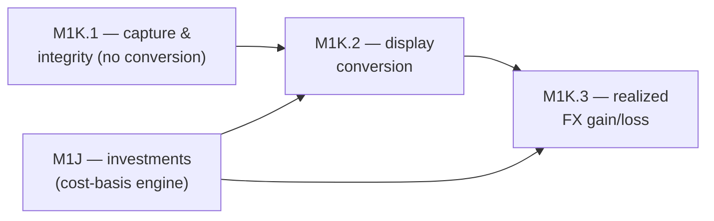

# Feature: Multi-Currency

## Status

in-progress

## Goal

Make every monetary value in MoneyBin carry an explicit currency, let a user
declare a **home currency**, and present amounts in that home currency through
**auditable conversion** — without ever silently mixing currencies or mutating the
original-currency source of truth. This is the foundational M1K schema wave: the
*original* currency is canonical at every grain; conversion is a presentation
layer staged on top.

The wave is phased so the **capture + integrity** layer (M1K.1) can land early —
independent of investments — while **live conversion** (M1K.2) and **realized FX
gain/loss** (M1K.3) follow the investment cost-basis engine they depend on.

## Background

Today amounts are *implicitly* USD, inconsistently:

- `prep.int_transactions__unioned` already carries a `currency_code`, but every arm
  defaults unknown to USD: tabular, manual, and Plaid all `COALESCE(..., 'USD')`
  (Plaid's `iso_currency_code` **is** read here — captured all the way from
  `SyncTransaction` through `stg_plaid__transactions` already — just badly
  defaulted to USD when null); **OFX hardcodes `'USD'` outright** with no read at
  all — `CURDEF` isn't captured anywhere in the OFX pipeline (raw parse, staging,
  or union) yet.
- `core.fct_transactions` exposes `currency_code`; `core.dim_accounts` has
  `currency_code` — but **balances carry no currency at all** (`core.fct_balances`,
  `reports.net_worth` have no currency column).
- Reports `SUM` across rows with no currency dimension. A user who imports EUR rows
  via CSV (currency lands in `fct_transactions`) gets every report summing EUR+USD
  into a single number while the envelope claims USD. **This is a live correctness
  bug**, not a hypothetical — M1K.1's guard closes it.

**Update, 2026-07-17:** the capture gaps and the `dim_accounts` naming described
above are closed (Requirements 1–3, 8).

**Update, 2026-07-26:** the no-silent-blend guard (Requirement 5) shipped, closing
the live correctness bug: every `reports.*` model that sums money segments per
`currency_code`, and the envelope no longer claims USD for rows that are not.
The account grain stopped defaulting to `'USD'` in the same pass, which is what
makes an unknown currency representable end-to-end (Requirement 3).

The design move is the same one [`investments-data-model.md`](investments-data-model.md)
makes: **lock the schema, stage the algorithm.** The investments spec (implemented,
PR #300) lands a `currency_code` column on its ledger/lots/gains/holdings now and
explicitly defers conversion to M1K (*"currency column now, conversion later"*) —
already adopting this spec's canonical `currency_code` naming (see §Key Decisions).
So investments is self-contained in its own denominating currency; M1K is the layer
that adds conversion across both cash and investments.

Related specs:

- [`investments-data-model.md`](investments-data-model.md) — implemented (PR #300);
  carries per-instrument `currency_code` natively; defers FX conversion to this spec.
  **M1K.3 reuses its cost-basis engine** for realized FX gain/loss.
- [`architecture-shared-primitives.md`](architecture-shared-primitives.md) — layer
  conventions; **Invariant 8** (derivations live in SQLMesh, never snapshotted into
  `app.*`); the `ResponseEnvelope.summary.display_currency` contract.
- [`reports-net-worth.md`](reports-net-worth.md) and the report recipe library —
  consumers that must segment-or-convert, never silently blend.
- [`account-management.md`](account-management.md) — `app.account_settings`; per-account
  `currency_code` already validated against ISO 4217.
- [`smart-import-financial.md`](smart-import-financial.md),
  [`smart-import-tabular.md`](smart-import-tabular.md), [`sync-plaid.md`](sync-plaid.md) —
  the capture points where currency must stop being dropped.
- [`identifiers.md`](../../.claude/rules/identifiers.md) (agent rules, not a spec) — the
  surrogate-key guideline for the M1K.3 conversion-pair identity; `raw.exchange_rates`
  itself keys naturally on `(from_currency, to_currency, rate_date, source)`.

## The core decision (one-way door)

**Original currency is the canonical stored amount at every grain. Conversion to a
home/display currency happens at presentation time — never by mutating stored
originals.**

Concretely: `amount` is always in `currency_code` (the row's original currency).
Reports, queries, and MCP envelopes convert *on read* to a requested display
currency, recording which rate they used. No converted amount is ever persisted at
row grain.

Why this is the durable path:

- **Home currency stays mutable for free.** Changing it re-presents; it never
  re-converts stored data, because nothing converted was stored.
- **Raw stays the source of truth.** Core is rebuilt from raw, not patched
  (consistent with the medallion architecture). The migration is *additive columns*,
  not a backfill of derived values.
- **Rate corrections don't strand data.** A corrected historical rate changes future
  presentation; it doesn't require rewriting millions of stored converted amounts.
- **It matches the investments pattern** ("lock the schema, stage the algorithm"),
  so the two foundational waves are coherent rather than divergent.

The rejected alternative — storing `home_amount`/`home_currency` at row grain —
forces conversion to exist before any row lands, freezes the home currency, and
makes rate corrections a data-rewrite. Not chosen.

**Rejected alternatives.** Persisting converted amounts at row grain makes a
corrected historical rate a data rewrite. Maintaining derived valuation
snapshots in mutable tables adds rebuild and orphan-cleanup obligations on every
recompute. Converting at presentation time and deriving through SQLMesh avoid
both failure modes while preserving original-currency facts.

## Phasing

| Phase | Scope | Depends on | Notes |
|---|---|---|---|
| **M1K.1** | Currency capture & integrity (no conversion) | nothing | Independent of investments; **may be pulled into the first public release** (see [`roadmap.md`](../roadmap.md) §"The first public release"). Closes the live silent-blend bug. Requirements 1, 2, 3, 8 (capture, schema, account-currency inheritance) implemented 2026-07-17; Requirements 4–7 (home currency, no-silent-blend guard, doctor check, report guard) implemented 2026-07-25, and Requirement 3's account-grain `'USD'` fallback removed 2026-07-26 — **M1K.1 closed**, except the first-run-wizard locale default explicitly descoped under Requirement 4. |
| **M1K.2** | Display conversion (auditable rates) | M1K.1 + **investments (M1J)** | The unifying conversion layer over both cash and investment grains. Sequenced after investments so it converts *everything* in one coherent pass. |
| **M1K.3** | Realized FX gain/loss | M1K.2 + investments cost-basis engine | Core conversion, Currency-lot, and realized-FX accounting implemented 2026-09-04, including optional paired Transfers that preserve same-currency basis across Accounts. The report and deliberate EUR/USD statement tie-out remain open. |

**Sequencing rule:** investments (M1J) lands before M1K.2/M1K.3. The dependency runs
one direction only — realized FX gain/loss is currency-lot accounting, i.e. the same
engine securities use; it cannot precede it. M1K.1 carries no such dependency.

## Requirements

Numbered, testable. Tagged by phase.

### M1K.1 — Currency capture & integrity

1. **Currency captured at every ingestion grain.** OFX import records `CURDEF`
   end-to-end (raw parse → `stg_ofx__transactions` → union) — today none of these
   three stages capture it at all. Plaid **transaction** currency is already
   partially captured: `SyncTransaction.iso_currency_code` and
   `stg_plaid__transactions` both exist and the union already reads it (Requirement
   2 fixes how the read value gets defaulted). What's still missing on the Plaid
   side is **balances**: `SyncBalance` (`src/moneybin/connectors/sync_models.py`)
   has no `iso_currency_code`/`unofficial_currency_code` field, so balance currency
   isn't captured at all yet. Adding it to `SyncBalance` and moneybin-sync's mapping
   is an **additive, optional** contract change (one-way door: additive only).
   **Implemented 2026-07-17:** OFX `CURDEF` now flows raw parse → `stg_ofx__transactions`
   → union; `SyncBalance` gained `iso_currency_code`/`unofficial_currency_code` and
   moneybin-sync's mapping populates it.
2. **The union stops hardcoding `'USD'`.** `int_transactions__unioned.sql` reads the
   captured currency for the OFX and Plaid arms and leaves it `NULL` when the source omits
   it — it does **not** `COALESCE` to a literal `'USD'`, which would relabel a non-USD
   account's rows before account-currency inheritance (Req 3) can run. The tabular/manual
   arms' blind-`'USD'` fallback is the same class of bug (they do read source currency when
   present) and is dropped in the same pass; account inheritance (Req 3) fills currency where
   known, and anything still unknown is segmented, not guessed (Req 8).
   **Implemented 2026-07-17:** no arm (OFX/manual/tabular/Plaid) defaults to a literal
   `'USD'` anymore, including the CLI `transactions create --currency` entry point that
   fed the manual arm.
3. **Currency at every core monetary grain.** `core.fct_balances` **and the derived
   `core.fct_balances_daily`** (the model `reports.net_worth` actually aggregates) gain a
   `currency_code`; `core.fct_transactions` already carries it. `core.dim_accounts` also
   carries it today, but under the legacy name `iso_currency_code` — this phase renames it
   to `currency_code` end-to-end per the resolved naming decision and scope (§Key
   Decisions, Decision 5). Where a grain genuinely cannot know its currency, it inherits
   the account's `currency_code`, never a blind `'USD'`.
   **Implemented 2026-07-17:** `dim_accounts.currency_code` (renamed), `fct_balances`/
   `fct_balances_daily.currency_code`, and account-currency inheritance on
   `fct_transactions`/`fct_balances` all shipped.
   **Completed 2026-07-26:** the account grain itself kept a `COALESCE(..., 'USD')`
   until this pass — the one place the "never a blind `'USD'`" rule was still
   broken, and the terminal fallback of the whole chain, so it silently supplied a
   currency to every row that lacked one. `core.dim_accounts` now resolves
   user override → the currency the account's own source reported (OFX `CURDEF` via
   `prep.stg_ofx__balances`, Plaid `iso_currency_code`/`unofficial_currency_code` via
   `prep.stg_plaid__balances`, the tabular `currency` column) → `NULL`. Until this
   landed, Requirement 8's unknown-currency rule and Requirement 6's `fail` branch
   were both unreachable in production.
   **Extended to the investment grain 2026-09-01.** The manual investment write
   path was the last one still substituting a literal: the CLI option, the MCP
   adapter, the service parameter, the `raw.manual_investment_transactions` DDL
   default and a staging `COALESCE` each supplied `'USD'` for an omitted
   currency, so a foreign-currency brokerage account's lots were denominated in
   dollars before cost basis and realized gains read them. All five are gone;
   `core.fct_investment_transactions` now resolves
   `COALESCE(event.currency_code, account.currency_code)`, the same expression
   `core.fct_transactions` uses for the cash grain. Rows written before the fix
   keep their stored `'USD'`: every write path passed it explicitly, so a
   fabricated value is indistinguishable from a typed one and a backfill would
   erase real answers. `accounts set --currency` repairs an event carrying no
   currency; one already carrying a wrong value has no in-product remedy yet,
   because a manual investment event has no delete or revert. `app.securities.currency_code` still carries
   `NOT NULL DEFAULT 'USD'` — a catalog entry has no account to inherit from, so
   removing that literal needs a nullability decision of its own.
4. **Home currency setting.** A profile-level `home_currency` (ISO 4217), **mutable**,
   defaulted by **locale auto-detection with explicit user confirmation** in the
   [first-run wizard](mcp-first-run-setup.md). Distinct from per-account currency. It is
   **`app.*` state (DB-resident)**, not YAML config — the no-blend guard and report views
   are SQLMesh models that must read it to segment home vs. foreign — so it is written
   through a `*Repo` (Invariant 10), not the generic YAML `profile set`.
   **Implemented 2026-07-25** as `app.profile_settings` (singleton row, V044) behind
   `ProfileSettingsRepo`. `moneybin profile set home_currency EUR` dispatches the
   managed key to the repo while dotted `section.field` keys still write `config.yaml`;
   `profile show` splits `Config (config.yaml)` from `Settings (database)`. MCP gained
   `profile` and `profile_set`. Unset reports null — never an implied USD. The
   first-run-wizard locale default is **not** built: the setting is mutable and
   segmentation does not depend on it, so nothing reads it yet.
5. **No-silent-blend invariant.** An aggregation across rows of differing
   `currency_code` MUST NOT emit a single combined figure unless an explicit
   conversion with recorded rate provenance is applied. Absent conversion (all of
   M1K.1), results are **segmented per currency** (a sub-total per currency), never
   blended.
   **Implemented 2026-07-25.** Every `reports.*` model that sums money projects and
   groups by `currency_code`; `reports.balance_drift` projects it without regrouping
   (asserted and computed balances are the same account's, so the comparison is
   single-currency by construction). Two consumers re-aggregate the segmented views
   and had to segment too: the `core:cashflow` runner (`currency_code` is in
   `select_cols`/`group_cols` unconditionally, for every `by` value) and
   `NetworthService` (see Requirement 7). `reports.large_transactions` additionally
   scopes its median/MAD baselines and its top-100 rank per currency — a pooled
   baseline compares unlike units and scores a typical charge in the
   smaller-denominated currency as an anomaly. That per-currency scoping is also
   why those three columns cannot survive a display conversion: the baseline is
   the row's original currency, each row prices at its own `txn_date` rate, and
   rates move between dates, so the converted amounts are not one scaling of the
   population that produced the score. A converted read returns them null rather
   than attribute them to a currency they were not measured in; the rows
   themselves are still ranked and anomaly-filtered in SQL, on the original
   amounts.
   **Ranking and reachability, 2026-07-26.** Segmentation makes each figure
   correct; two follow-on defects left a correct figure unreadable or absent.
   The framework truncates with `records[:max_rows]`, so the *first* sort key
   decides what a capped response can contain: a report that emitted one
   currency's rows before the next let a single currency fill the cap and drop
   the others out of the response entirely — missing, not merely ranked lower.
   Four of the six runners did this — `balance_drift` ordered globally by raw
   `drift_abs`; `large_transactions`, `merchant_activity`, and
   `recurring_subscriptions` ranked correctly per currency and then re-grouped
   by `currency_code` at the top level, undoing it. All four now order by
   rank-within-currency first, so any prefix represents every currency.
   `test_no_report_sort_lets_a_cap_omit_a_currency` scans the sources rather
   than waiting for someone to build a mixed-currency fixture per report — the
   defect reached four runners because each was fixed where it was found rather
   than swept for. (`cash_flow` and `spending_trend` were exempted here on a
   rationale the next paragraph retracts.) Separately, `core.fct_transaction_lines` — the
   canonical split-expanded grain — projected every parent column except the
   denomination, so an agent on it could not tell a EUR line from a USD one; it
   now carries `currency_code`, as does `core.uncategorized_queue`, whose review
   surface asks a user to act on the amount it shows. The curated `sql_schema`
   examples that sum money across `core.*` group by currency, held by
   `test_every_money_aggregating_example_names_its_currency`, which derives its
   eligible set from `CLASSIFICATION` so a new money example on a
   currency-bearing table inherits the guard rather than escaping it.
   The prefix-truncation defect had a second channel the runner scan cannot
   see: `sql_query` also keeps a prefix (`rows[:max_rows]`), and so does an
   agent's own `LIMIT`, which examples asking for "top" anything invite. Twelve
   curated examples led their sort with `currency_code` and now rank within
   each currency first, or lead with the non-currency dimension where the query
   is a time series or a closed vocabulary. Two keep `ORDER BY currency_code`
   because they return exactly one row per currency, where ordering is not the
   lever — any prefix of *k* rows holds *k* currencies whatever the sort key
   is. `test_no_example_leads_its_sort_with_currency_code` asserts set equality
   against those two, so a new offender fails and so does a stale exemption.

   **The sweep that closed the class, 2026-07-27.** The exemption above was
   wrong. It held that a leading `year_month` makes truncation drop tail months
   across all currencies alike — true only when each (month, currency) is
   exactly one row, which is the case for neither report. `cash_flow` groups on
   a caller-chosen dimension and `spending_trend` on category, so a single month
   holds several rows per currency and sorting currency-major hands that month's
   entire budget to the lexicographically-first currency. Both now rank within
   (month, currency) and order `year_month, rank_in_currency, currency_code`:
   the month stays outermost because it is a time series, and the rank
   interleaves the currencies inside it. The invariant is therefore *not* that a
   rank leads the sort, but that a rank precedes any bare `currency_code` key.

   Enumerating the whole grid rather than the reported sites found two more the
   review had not. `networth_history` is a `ServiceReportSpec` whose SQL lives in
   `networth_service`, so a scan over `reports/definitions/` could never see it;
   it walked one currency's entire series before starting the next, and a
   currency opened partway through the window vanished from a capped response
   instead of showing a shorter series. And the `sort="impact"` branch of
   `CategorizationQueries.list_uncategorized_transactions` ranks `priority_score`
   — `ABS(amount) * age_days`, which `core.uncategorized_queue`'s own column
   comment calls meaningful only within one currency — across denominations
   before `LIMIT`, so the highest-denomination currency filled the whole queue.
   That last one names no `currency_code` in its sort at all. The class has two
   limbs, and only one is a property of the sort keys:

   - **Interleaving** — `currency_code` sorts major to the metric. A source scan
     owns it: `test_no_report_sort_lets_a_cap_omit_a_currency` covers both report
     channels, deriving the service channel from the service classes
     `service_reports` imports, so a new service-backed report inherits the guard
     rather than escaping it the way `networth_history` did.
   - **Cross-unit ranking** — a money metric ranked across currencies with no
     `PARTITION BY currency_code`. It leaves no trace in the sort keys, so no
     scan can catch it; it is guarded behaviourally beside the surface that ranks
     (`test_impact_queue_spans_currencies_under_cap`).

   `sort="date"` is deliberately untouched: `txn_date` is currency-agnostic, so a
   cap drops the oldest rows across every currency alike, and interleaving there
   would only break the "most recent first" contract the sort exists to provide.
   `SpendingService.by_category` summed `ABS(amount)` with no `currency_code`
   anywhere in the module — a real blend, but it had no caller and sat outside
   the guard's scope because it was not report-reachable. Removed as dead code
   (MB-56) rather than fixed; the live spending report is
   `reports/definitions/spending_trend.py`.
   **Which payloads owe a currency, 2026-07-26.** The MCP-side enumeration
   (`test_money_tools_name_their_currency`) asked whether a payload carries a
   money-classed field and no `DataClass.CURRENCY`, and six tools answered yes.
   That question is wrong: `TXN_AMOUNT` marks a field *masking-sensitive*, not
   *denominable*. Walking each payload to the exact leaf, only two were real.
   `transactions` was — the flagship read returned bare amounts, so a
   mixed-currency page (`display_currency` null by design) had no denomination
   anywhere in the response; its rows now carry `currency_code` from
   `core.fct_transactions` through both the MCP and CLI construction sites.
   The other real one is `transactions_categorize_rules`: `min_amount`/
   `max_amount` are genuine bounds, but `app.categorization_rules` has no
   currency column, so a rule cannot say which currency it bounds — schema work,
   deferred to M1K.2. The remaining four are classification artifacts with no
   currency to state: `import_files` and `import_preview` expose
   `as_printed`/`as_recorded`, a single magnitude printed and then negated as
   `str` so the caller can confirm a sign convention; `investments_lots_select`
   exposes `quantity`, a share count; `system_audit` exposes
   `before_value`/`after_value`, polymorphic audit evidence whose audited column
   differs per event. The guard now splits three ways instead of two, and each
   not-denominable entry pins the money-classed `(field, type)` leaves its
   reason rests on — a payload that grows a real `Decimal` amount fails rather
   than inheriting an exemption written for a string sample.
   **Known limit — unknown pools into one segment.** `GROUP BY currency_code`
   puts every row whose currency is unknown into a single `NULL` segment and
   sums it. Two accounts denominated in genuinely different currencies that
   both lack one are therefore added together, producing a figure in no unit.
   This is not fixable by grouping: nothing distinguishes two unknowns from
   each other. It is why Requirement 6 makes an unknown currency a **failure**
   rather than a warning — the remedy is `accounts set --currency`, not an
   aggregate MoneyBin could compute. Withholding the segment's totals instead
   was considered and rejected: the population this creates is tabular imports
   whose file carried no currency column, who are almost always single-currency,
   and blanking net worth and cash flow for all of them to guard a case their
   own doctor output already fails on trades a certain harm for a rare one.
   **The invariant binds `core.*` too, not only `reports.*`.**
   `core.fct_balances_daily` carries a balance forward adjusted by intervening
   transactions, and `fct_transactions.currency_code` resolves per row — so an
   account whose statements are USD can hold a transaction of its own in EUR.
   Summing them and adding the result to the carry blends currencies one layer
   *below* every guard: the row still reports the observation's currency, so
   `balance_drift`'s `currency_mismatch` check compares two matching `USD`
   values and passes the blended number through to `reports.net_worth`. The
   carry therefore applies only the transactions denominated in the currency it
   is carrying. The excluded movement is not dropped silently — it lands in the
   next observation's `reconciliation_delta` and reads as drift, and the
   Requirement 6 warn names the behaviour. The same reasoning governs the
   *carry itself*: `core.fct_balances.currency_code` resolves per row, so a
   corrected re-import can move an account from USD to EUR between two
   consecutive observations. `reconciliation_delta` subtracts the prior carry
   from the new observation, so across that boundary it would difference two
   units and label the result with the newer one — invisible to the same
   `currency_mismatch` check, which would again see two agreeing codes. The
   delta is therefore `NULL` whenever the observed currency differs from the
   carried one, and `balance_drift` already renders a null delta as `no-data`.
   **Guard placement rule:** a currency guard on a derived value must sit where
   the arithmetic happens. A guard downstream of the blend can only compare
   labels, and both labels survive a blend intact.

6. **Doctor check.** `system doctor` reports when a profile holds more than one
   distinct currency across transactions/accounts/balances, **flags accounts/rows whose
   currency is unknown (`NULL`) so the user can assign one before it can blend**, and flags
   any report path that would violate Requirement 5.
   **Implemented 2026-07-25** as the `currency_integrity` invariant: **fail** on any
   unknown-currency account/transaction/balance (with the `accounts set --currency`
   fix in the detail, the `moneybin transform` that makes it take effect in `core.*`,
   and the affected ids attached), **warn** on two or more known
   currencies with nothing unknown — naming both consequences a user would
   otherwise read as a bug: reports sub-total per currency, and a transaction
   denominated differently from its account sits out of that account's carried
   balance and shows up as its drift — **pass** otherwise. It publishes
   `moneybin_profile_currencies` and `moneybin_unknown_currency_rows{grain}`.
   The third clause — "any report path that would violate Requirement 5" — is a
   **build-time** guard rather than a runtime one, because the set of report paths is
   code, not data: `test_every_money_bearing_report_projects_the_currency_it_is_denominated_in`
   enumerates the live report catalog and fails CI for any registered report that
   declares a `TXN_AMOUNT`/`BALANCE` column without a `currency_code` one. A runtime
   check could only re-assert what CI already proved, and would go stale against a
   report added later.
7. **Report guard.** Report views that sum money detect mixed currency and either
   segment (default) or return an explicit "cross-currency total unavailable until
   conversion ships" signal — never a silent blend. Single-currency profiles (the
   common case, including USD-only users) see **zero behavior change**.
   **Implemented 2026-07-25.** Segmentation is the default everywhere. The one place
   that takes the explicit-signal branch is `core:networth`'s scalar headline, which
   has no room for a sub-total per currency: `NetWorthSnapshotPayload` nulls
   `net_worth`/`total_assets`/`total_liabilities`/`currency_code` when more than one
   currency contributes and carries each currency's totals in `per_currency`; its
   report records attach each account row to its own currency's totals.
   `NetworthService.history` partitions both its bucketing and its period-over-period
   `LAG` by `currency_code`, so a change is never the difference between two
   currencies' positions. Zero-behavior-change is held by fixtures, not assertion: the
   pre-existing single-currency report and net-worth tests assert the same figures
   unchanged, and `tests/scenarios/test_multi_currency_report_segmentation.py` proves
   the mixed case is what discriminates a segmented model from a blending one
   (restoring the blend in `reports.cash_flow` fails it; a single-currency fixture
   cannot).
8. **Migration is additive.** New currency columns are nullable additions to raw tables;
   core is rebuilt from raw (no in-place core patch). The migration does **not** depend on
   `home_currency` (also introduced in M1K.1): a row with no captured currency inherits its
   account's `currency_code` (Req 3); a value still `NULL` after that is treated as
   **unknown currency** — never silently resolved to the home currency (that would be a guess
   the no-blend guard couldn't see). Unknown-currency rows are segmented out (Req 5) and
   surfaced by `system doctor` (Req 6) for the user to assign. `home_currency` itself is
   established by the first-run wizard (Req 4), not the migration. Versioned migration under
   `src/moneybin/sql/migrations/`.
   **Implemented 2026-07-17** for the capture/inheritance columns above.
   **Completed 2026-07-26:** segmentation and doctor surfacing shipped with Requirements
   5–7, and the account-grain `'USD'` fallback that made "still `NULL`" impossible is
   gone (see Requirement 3). `tests/scenarios/test_multi_currency_report_segmentation.py::test_a_transaction_with_no_captured_currency_stays_unknown`
   holds the whole chain: an uncaptured currency stays `NULL` through core, gets its own
   report segment, and fails `system doctor`.

### M1K.2 — Display conversion

9. **Display currency on read.** Reports/queries/MCP accept an optional display
   currency (default: home currency) and convert original amounts to it on
   presentation, populating `ResponseEnvelope.summary.display_currency`. Original
   amounts remain available for drilldown.
10. **Auditable rate provenance.** Every converted figure traces to a stored rate — a
    provider rate in `raw.exchange_rates` (`(from_currency, to_currency, rate_date, rate,
    source, fetched_at)`, unique on `(from_currency, to_currency, rate_date, source)`) or a
    user override in `app.*` (Req 14). A "show me the rate" path exposes the exact rate
    behind any converted number (consistent with the lineage promise).
    **Implemented in two halves.** The storage half landed with the rate layer
    (2026-08-15): every rate is stored with its source, and `moneybin fx rate` /
    `fx list` read it back. The exposure half needed converted figures to exist,
    so it landed with display conversion (2026-08-16): `summary.applied_rates`
    carries one entry per distinct pair and date — rate, source, requested date,
    and the date actually priced — and the terminal prints the rate when a single
    one priced the report. Deduplicated by (currency, date), because a thousand
    rows on one date were priced by one rate. Absent when nothing was converted,
    which is deliberately distinct from present-but-empty.
    That dedup is also why the set alone is not the whole answer: a report
    holding two source currencies on one date publishes two entries, while
    conversion has relabelled every row to the target, leaving no way to say
    which entry priced which figure. A converted read therefore also carries
    `original_currency_code` per row — the other half of the (currency, date)
    key — added by the framework rather than by any report, since no model
    projects it. Present only on a read that actually priced something: on a
    segmented or already-in-target result it would restate `currency_code` and
    imply a conversion that did not happen. The one row it cannot describe is
    `core:networth`'s collapsed headline, which sums several currencies and so
    carries null rather than name whichever one sorted first.
    The published set is also narrowed to the rows that survive a row cap. A
    capped read prices one row past the cap to decide `has_more`, so a rate
    resolved only for that row would name no figure the caller received while
    disclosing its `requested_date` — a transaction date on a per-transaction
    report. Narrowing is skipped when any surviving row carries no
    `original_currency_code`, since that row was priced by more than one rate
    and cannot name them; publishing one rate too many is a smaller error than
    dropping the rate behind a figure on screen.
    The investments surface answers the same way: `investments(view="holdings")`
    publishes `data.applied_rates` beside its converted `total_market_value`,
    reusing `FxRatePayload` so a rate is shown with the same six fields and the
    same privacy classes wherever it appears. A converted figure with no trail
    back to its rate is the failure this requirement names, and a second surface
    publishing one would have been exactly that.
    `moneybin export report` is the one report surface that never converts, so it
    never needs the trail: an artifact outlives the rate that made it, and the
    original amount stays checkable forever.
11. **Free reference-rate source.** Rates come from **Frankfurter** (ECB-backed, no
    auth, historical to 1999), cached in `raw.exchange_rates`.
    `ExchangeRate.host`/`open.er-api.com` are documented fallbacks. **Only currency
    codes and dates leave the machine — never amounts or PII** (same structural-signal
    posture as categorization redaction).
12. **Offline fails loud.** A needed historical rate that is neither cached nor
    fetchable causes an explicit, surfaced error — never a silent substitution of
    today's rate or `1.0`.
13. **Weekend/holiday handling.** A non-trading date resolves to the ECB last-published
    business day; the resolution is recorded in `rate_date` provenance, not hidden.
14. **User rate override.** A user may override an auto-fetched rate (the bank's actual rate
    differs from the ECB mid-rate). An override is **mutable user-authored state**, so it
    lives in `app.*` (e.g. `app.exchange_rate_overrides`), mutated only via a `*Repo` with
    paired audit (Invariant 10) — **not** in `raw.exchange_rates` (the immutable provider
    cache). The conversion layer prefers an app override over the cached provider rate, and a
    later provider refresh never silently overwrites it. **Scope:** an override is a daily
    reference-rate correction — one per `(from, to, rate_date)`, matching the
    `app.exchange_rate_overrides` key — *not* a per-transaction bank-spread capture. Two
    same-day transactions at different effective rates (spreads/fees) are out of scope here; a
    genuine per-transaction rate belongs on the conversion-pair model (M1K.3).
15. **Segmentation becomes the fallback.** For currency pairs the source can't provide
    (exotics, crypto-as-currency) or while offline, reports fall back to M1K.1
    segmentation rather than guessing.
16. **Investment bridge (display).** Investment holdings (which carry their own
    `currency_code` per `investments-data-model.md`) convert to home currency for a
    unified net-worth number through this same layer.
17. **Each row prices at its own date.** A converted figure uses the rate for the
    date that row carries — a transaction's `transaction_date`, a daily balance's
    `balance_date` — never a single as-of rate applied across a range. A report
    spanning three years therefore needs a rate per date it touches, which is what
    makes Requirement 18 necessary. Resolution of a non-trading date is Requirement
    13's; this requirement fixes only *which* date is asked for.
18. **Rates are gathered during refresh, not during a report read.** A `rates` step
    runs last in the refresh cascade and caches the span the profile's own rows
    imply: for each currency reachable from `core.fct_transactions`,
    `core.fct_balances_daily`, `core.fct_investment_transactions` or
    `core.dim_holdings`, one provider call covering the earliest date that currency
    appears through today. The date a holding contributes is its own
    `price_date` — the close its market value was struck at — because that is
    the date the read prices it on. Planning today's rate instead would fetch
    one no read asks for, and a carried-forward position whose close predates
    the refresh would report no combined value right after a successful one. A
    holding with no `price_date` is skipped by that same read, so it implies no
    window at all.

    The window is derived from what the profile needs, never from what the cache
    appears to hold. `raw.exchange_rates` records the dates a provider published,
    not the ranges MoneyBin requested, so a span fetched in full and a span
    bracketed by two rows from separate `moneybin fx rate` lookups are identical
    in it. Reading its `MIN`/`MAX` as coverage would resume from the newest row
    and — because the window only moves forward — strand every date between those
    two lookups permanently, which is the gap this requirement exists to close. A
    date-set model fails the other way, since a reference series has legitimate
    holes on every weekend and holiday that it would re-request forever. So the
    whole implied span is re-requested each refresh and the append-only cache
    discards what it already holds: one provider call per foreign currency per
    refresh, spent to make the stranded-span case impossible rather than unlikely.

    Both directions across the provider boundary are bounded, because both carry
    untrusted values. Outbound, `currency_code` is source data — a CSV whose
    columns shifted by one puts an account label in it — so a code that fails the
    ISO-4217 shape gate is skipped rather than sent, satisfying Requirement 11 by
    construction instead of by convention; the skip is counted, never logged by
    value. Inbound, two filters apply before the append-only write: a response
    date outside the requested window (allowing Requirement 13's bounded backward
    resolution at the start bound) is discarded, because a row filed under a date
    nobody asked about cannot be corrected in place and every later conversion on
    that date reads it; and a rate the `DECIMAL(18,8)` column cannot hold — one
    that quantizes to zero, exceeds the magnitude bound, or is not finite — is
    discarded for the reason Requirement 13's single-date path already rejects it,
    with the added consequence that raising here would abort the remaining pairs
    in the same refresh rather than costing only its own.

    Placement is a correctness constraint, not a preference. A report read opens
    the database read-only; fetching there would need the exclusive per-profile
    writer lock behind a command that looks read-only, and would fail whenever a
    sync held it. Refresh already holds that lock. The step runs after `transform`
    because the pairs and dates are derived from `core.*`, and last because nothing
    downstream consumes it, so a provider outage costs the run nothing that had
    already succeeded. A profile with no home currency set fetches nothing.

    A pair the step could not fill is reported as one of three kinds, because
    their remedies differ. A *failed* pair — the provider call raised — is
    retried on the next refresh and needs nothing from the user. An *unsupported*
    pair — the provider does not publish that currency at all — will answer the
    same way forever, so it is named separately and points at `moneybin fx set`.
    Collapsing those two would either send a user to record rates by hand over a
    dropped connection, or leave them waiting for a refresh that can never
    succeed. They are told apart by the provider's own currency list, read for
    *both* sides of the pair — a profile whose home currency is unpublished is
    unsupported through an ordinary base — and when that list cannot be read,
    neither kind is claimed.

    A *discarded* pair is the third: the provider answered, and the answer did
    not cover the window. Either MoneyBin threw part of it away — the rate fell
    outside the requested range, or the rate column could not hold it — or the
    answer's own span fell short of the requested one at either end. Those last
    two are a currency the provider only started carrying partway through the
    profile's history, and one it stopped carrying; both drop nothing, so they
    are found only by comparing the earliest and latest rates kept against the
    requested bounds. An empty answer for a published pair is the total case of
    the first.

    The two bounds are deliberately not equally strict. The opening one is
    exact, because nothing prices a date from a later observation —
    Requirement 13 resolves backward only — so a series starting even a few days
    in leaves those dates needing a live fetch, and waiting cannot fill the gap:
    the window opens at the profile's earliest row and moves back only when
    earlier data is imported. The publication slack lives in the *request*
    instead, which opens `MAX_BACKWARD_RESOLUTION_DAYS` before the window does,
    so a profile whose earliest row falls on a closed market is covered by the
    last publication day before it rather than reported short forever. The
    closing bound allows that same span, because a missing recent date is
    routine and self-healing — no rate is published on a weekend, often none for
    today until the afternoon, and the window's end moves forward on its own —
    so an exact bound there would warn on every healthy profile instead of on a
    series that has genuinely stopped.
    It is not exclusive with the other two and does not mean the pair is empty,
    so it reports that coverage may be short on some dates rather than naming a
    remedy. Without it, a pair whose every rate was discarded is
    indistinguishable from a profile that needed no rates at all: both report
    zero written and no named pairs.

    This does not weaken Requirement 12: a rate that is still missing at read time
    is an explicit surfaced error, never a substitution.

    **Open — coverage is checked at the answer's edges, not through its
    middle.** Both bounds above ask how far the answer reaches. Neither asks
    whether what lies between is whole, and an interior hole is invisible from
    either end: a response that omits a single weekday inside its span passes
    every check and is reported as fully covered. That includes a dated entry
    the provider returns without the requested quote, which the adapter drops as
    absent. Nothing files a rate under a wrong date, so Requirement 12 holds
    either way; what is missing is the warning. Closing it means verifying
    stored coverage against the dates the profile actually needs rather than
    against the answer's bounds — the span model the hole below already calls
    for.

    **Closed for the conversion layer — the read path cannot reach the
    weekday-holiday hole.** A complete backfill still leaves no row on a weekday
    the market was closed; verified live 2026-08-15, the EUR/USD series skips
    Thursday 2026-01-01 entirely. A transaction dated that day misses the cache,
    and `_last_publication_day` deliberately does not hop a weekday, so
    `CurrencyService.resolve_rate` would fall through to a live fetch **and a
    cache write** — on a report read that opened the database read-only. It
    never gets the chance: report execution and the holdings portfolio total
    both build their service through `build_cache_only_currency_service`, which
    passes no adapter, and `_fetch` raises `RateUnavailableError` at its
    `self._adapter is None` check before the adapter is touched. The row
    degrades instead — a report segments under Requirement 15, and the holdings
    total reports no combined figure rather than a wrong one.

    **Still open — pricing a holiday-dated row instead of degrading it.** The
    backfill is what makes this fixable. `_last_publication_day`'s docstring
    rejects a general "nearest earlier stored day" fallback because a missing
    weekday is ambiguous — closed market, or nobody fetched it yet. Coverage
    recorded as a span removes the ambiguity: **inside** `[earliest stored,
    newest stored]` for a pair, a missing date is provably a non-publication
    day and may resolve back to the last stored one; **outside** that span it is
    genuinely unfetched and stays an error. Resolving backward within proven
    coverage is not a guess, and it is what lets Requirement 17 price a
    holiday-dated row offline.

### M1K.3 — Realized FX gain/loss

19. **Conversion-pair identity.** A Currency conversion (e.g. a EUR debit paired
    with a USD credit) is modeled as one first-class economic event, not inferred
    from two unrelated rows. The accepted two-row shape reuses an accepted
    `app.match_decisions` Transfer Decision as its trusted link; the Transfer
    remains the movement between Accounts while `core.bridge_currency_conversions`
    owns the executed cross-currency terms. A pending or rejected Transfer never
    becomes a Currency conversion, and approximate date/amount proximity is never
    sufficient evidence.

    **Reserved import shape — single-row Currency conversion.** Some source formats
    express a Currency conversion as one row carrying *both* legs (the sent
    amount/currency plus a received amount and target currency), rather than two
    rows. Reserve a
    nullable received-leg column pair — `to_amount DECIMAL(18,2)` +
    `to_currency VARCHAR` — on `raw.ofx_transactions`,
    `raw.tabular_transactions`, `raw.plaid_transactions`, and
    `raw.manual_transactions`, so a Provider that meets this shape has somewhere
    to put the second leg instead of dropping it or fabricating a paired row. The
    row's own `amount`/normalized `currency_code` is the sent leg, and the
    conversion-pair model consumes either shape. M1K.3 reserves and propagates the
    fields but adds no format mapping or Provider behavior.

    `to_amount`/`to_currency` follow the directional `from_currency`/`to_currency`
    prefix convention already used on `raw.exchange_rates` — reserving them now
    keeps a later Provider from coining an
    ad-hoc, differently-ordered name and compounding the currency-column naming
    drift §Key Decisions already flags.

    `conversion_id` is content-derived from the evidence identity, never the
    mutable amounts or dates: an accepted two-row shape hashes its Transfer
    Decision id; a single-row shape hashes its canonical Transaction id. Later
    corrections therefore revise one event instead of minting a second identity.

    `core.bridge_transfers` continues to represent the movement between Accounts.
    Its exact numeric cancellation audit applies only when both legs share a
    currency; for a cross-currency Transfer, integrity instead requires both legs
    to exist and the derived Currency conversion to preserve their actual amounts
    and currencies. This is a refinement of the existing audit, not a relaxation
    for same-currency Transfers.
20. **Currency-lot accounting.** Realized FX gain/loss on disposing a foreign
    currency is computed by a currency-lot loader that calls the existing
    `compute_lots_and_gains` engine through one optional, currency-agnostic paired-
    transfer input. Callers that provide no pairs retain the existing interface
    and behavior. The loader uses a non-colliding private key such as
    `currency:EUR` only at the engine interface; it neither inserts a Security nor
    widens `app.securities.security_type`.

    The holding Account's `app.account_settings.default_cost_basis_method` is the
    election: NULL resolves to FIFO, `fifo` stays FIFO, and `average` uses the
    engine's average-cost path. `hifo` and `specific` remain valid Security
    elections but are unsupported for Currency lots in this phase and surface as
    incomplete coverage rather than silently becoming FIFO.

    A Home-to-foreign conversion opens a Currency lot whose basis is the actual
    Home-currency amount sent. A foreign-to-Home conversion disposes the sent
    foreign units for the actual Home-currency amount received. A foreign-to-
    foreign conversion uses the actual two-leg amounts for its executed rate and
    uses a stored M1K.2 rate or override only to value the received leg in Home
    currency; the valuation source stays separate and auditable. Missing valuation
    evidence leaves basis and gain/loss uncovered while retaining both quantity
    movements.

    A foreign-denominated Security sale opens a Currency lot for the net foreign
    proceeds, using its recorded fees and stored sale-date Home valuation as that
    Currency lot's basis. The existing Security gain remains separate. Receiving
    the foreign proceeds realizes no second gain; only their later disposal can
    produce realized FX gain/loss.

    An accepted same-currency Transfer between Accounts moves foreign-Currency lot
    slices without realizing gain. It is not a Currency conversion and never enters
    `core.bridge_currency_conversions`. The engine consumes the source Account's
    lots under that Account's FIFO or average election, then opens destination lots
    with the same historical basis, acquisition date, Home currency, and opening
    conversion or Security-sale provenance. The destination Account's election
    governs later disposal. `source_transfer_id` records the accepted Transfer that
    placed the lot in its current Account; a later Transfer replaces this immediate
    movement id while preserving the original acquisition provenance.
    Reversing or deleting an accepted Transfer advances both affected
    Account/Currency positions through its audit snapshot without treating the
    inactive evidence as a movement.

    A paired Transfer is atomic on the later of its two posting dates. Same-day
    acquisitions precede it and same-day ordinary disposals follow it; multiple
    Transfers at the same time apply dependency-first so A→B precedes B→C, then
    use Transfer id as the deterministic tie-break. When the source has less
    attributable inventory than the amount received, known slices still move and
    the unmatched destination remainder is a `transfer` acquisition with
    `coverage_reason='incomplete_history'` and NULL basis. No basis is invented and
    no gain is emitted. For quantity movement under an unsupported election, HIFO
    uses the engine's HIFO ordering and specific identification uses its existing
    deterministic FIFO fallback when no Currency-lot selections exist; affected
    source and destination slices expose NULL basis with `unsupported_method`.
    Unsupported elections never turn either Transfer leg into a realized-gain
    placeholder; only a later Currency disposal can realize gain.
    Home-currency Transfers remain outside Currency-lot accounting.
21. **Decimal throughout.** All amounts and rates are `DECIMAL`, never `FLOAT`
    (`DECIMAL(18,2)` amounts; `DECIMAL(18,8)` rates per the `database.md` precision
    convention). `updated_at` is the maximum timestamp of the contributing inputs,
    never the model execution time. The required conservation invariant is:

    `sum(realized basis) + sum(open remaining basis) == sum(contributed basis)`.
22. **Visible coverage.** An unaccepted pair produces no Currency conversion; if
    it has a Proposal, that Proposal remains in the existing Review queue. A
    candidate with accepted evidence but incomplete inputs remains inspectable
    with `coverage_status='incomplete'` and one closed reason:
    `incomplete_shape`, `missing_leg`, `unknown_currency`,
    `missing_home_currency`, `missing_valuation_rate`, `negative_inventory`,
    `incomplete_history`, or `unsupported_method`. Incomplete rows retain identity
    and provenance but expose NULL basis and gain/loss; the engine's zero-basis
    fallback is never published as a trustworthy FX result. The same rule applies
    to unmatched or unsupported same-currency Transfer quantity: it remains visible
    as an incomplete Currency lot, never a zero-basis acquisition. When only one
    conversion leg has a valid Currency, that leg still changes its known quantity
    while remaining uncovered with `unknown_currency`; the invalid leg is omitted.
23. **Foundation boundary and observability.** The first delivery slice produces
    the Core conversion, Currency-lot, and realized-FX rows. It adds no CLI command,
    MCP tool, report, Provider parsing, or mutable App table. A bounded
    `moneybin_fx_accounting_rows` Gauge records current row counts by `grain` and
    closed `coverage_reason`, using `complete` for covered rows; it contains no
    financial values or identifiers.

    **Implemented foundation, 2026-09-04.** Accepted Transfer Decisions and the
    reserved single-row shape now feed `core.bridge_currency_conversions`, with
    canonical Transaction currency inherited from its Account when the source row
    omits it. Relevant committed changes to the Home currency, an Account's
    Currency or cost-basis method, exchange-rate overrides, and accepted Transfer
    Decisions — including undoing those changes — trigger a targeted restatement of
    this bridge and its downstream FX-accounting models before the mutation surface
    reports success. Removing an exchange-rate override also advances affected row
    freshness through its audit event, even when valuation falls back to an older
    provider rate. The same audit watermark preserves freshness when undo deletes
    or restores Home-currency and cost-basis settings or restores or re-keys an
    accepted Transfer Decision. Account timestamps cover inherited Currency clears
    on canonical cash transactions, both conversion legs, and Security sales. A
    implemented slice's cache-only loader adapts completed conversions, eligible
    foreign-Security sale proceeds, and accepted exact same-currency Transfers to
    the investments cost-basis engine, producing `core.fct_currency_lots` and
    `core.fct_realized_fx_gains`; unsupported methods and missing Home currency still
    preserve known quantities while basis and gain remain visibly uncovered. The
    engine's optional paired-transfer input atomically moves attributable source
    slices into the destination Account, preserves original acquisition provenance,
    records immediate `source_transfer_id`, and leaves an underfunded remainder
    visibly incomplete without realizing gain. Inherited Account Currency changes, including
    clearing the value, advance conversion freshness. Rate backfill includes the
    received leg of materialized conversions,
    so a single-row conversion can obtain a Home valuation when that Currency appears
    nowhere else. The bounded row-count Gauge above is live, and the international
    synthetic scenario proves complete
    conversions and exactly $5.00 of realized FX gain per completed month. This is
    a Core accounting foundation, not a public reporting surface.

    M1K.3 and MB-111 remain open until the user-visible report and deliberate
    EUR/USD statement tie-out also ship.

## Data Model

Earlier phases retain their historical sketches; the M1K.3 public shape is fixed
below.

### M1K.1

```sql
-- core.fct_balances: add original currency (mirrors fct_transactions)
ALTER TABLE ... ADD COLUMN currency_code VARCHAR;   -- ISO 4217; inherits account currency
-- core.fct_balances_daily (Python model feeding reports.net_worth): propagate currency_code
--   through the daily rollup so net_worth can segment/convert per currency

-- raw OFX/Plaid transaction + balance tables: capture original currency
--   OFX: CURDEF;  Plaid: iso_currency_code / unofficial_currency_code
-- prep.int_transactions__unioned: every arm reads captured currency and leaves NULL when
--   the source omits it (no COALESCE to literal 'USD'); account inheritance fills where known,
--   anything still unknown stays NULL (segmented, not guessed)

-- profile-level home currency: app.* state (DB-resident so SQLMesh guard/views can read it
-- to segment home vs. foreign), mutated via a *Repo (Invariant 10). If a profile-settings
-- app table already exists, add the field there; otherwise introduce app.profile_settings.
--   home_currency VARCHAR NOT NULL  -- ISO 4217, mutable, ISO-validated
```

### M1K.2

```sql
-- raw.exchange_rates: the auditable provider rate cache (immutable; overrides live in app.*)
CREATE TABLE raw.exchange_rates (
    from_currency  VARCHAR NOT NULL,   -- ISO 4217
    to_currency    VARCHAR NOT NULL,   -- ISO 4217
    rate_date      DATE    NOT NULL,   -- resolved trading day
    rate           DECIMAL(18,8) NOT NULL,  -- from->to multiplier; precision per database.md
    source         VARCHAR NOT NULL,   -- provider only: 'frankfurter' | 'exchangerate_host' | ...
    fetched_at     TIMESTAMP NOT NULL,
    UNIQUE (from_currency, to_currency, rate_date, source)
);

-- app.exchange_rate_overrides: user-authored overrides (mutable user state, NOT raw).
-- Mutated only via a *Repo with paired audit (Invariant 10); the conversion layer prefers
-- an override here over the cached provider rate above.
CREATE TABLE app.exchange_rate_overrides (
    from_currency  VARCHAR NOT NULL,           -- ISO 4217
    to_currency    VARCHAR NOT NULL,           -- ISO 4217
    rate_date      DATE    NOT NULL,
    rate           DECIMAL(18,8) NOT NULL,     -- user-entered; precision per database.md
    note           VARCHAR,                    -- why the user overrode the provider rate
    created_at     TIMESTAMP NOT NULL,
    updated_at     TIMESTAMP NOT NULL,
    UNIQUE (from_currency, to_currency, rate_date)
);
```

### M1K.3

All three outputs are SQLMesh-derived Core models (Invariant 8). The SQL below
fixes their public shape; implementation may use SQL or a thin Python model as
appropriate, but no caller learns the engine adapter.

```sql
CREATE TABLE core.bridge_currency_conversions (
    conversion_id            VARCHAR,          -- content hash of the trusted evidence identity
    transfer_pair_id         VARCHAR,          -- accepted Transfer Decision; NULL for single-row
    from_transaction_id      VARCHAR,          -- canonical sent Transaction
    to_transaction_id        VARCHAR,          -- canonical received Transaction; NULL for single-row
    from_account_id          VARCHAR,
    to_account_id            VARCHAR,          -- same as from_account_id for single-row
    from_source_transaction_id VARCHAR,
    to_source_transaction_id VARCHAR,
    source_shape             VARCHAR,          -- linked_two_row | single_row
    from_currency            VARCHAR,
    to_currency              VARCHAR,
    home_currency            VARCHAR,
    valuation_source_type    VARCHAR,          -- actual | override | provider; NULL when unavailable
    from_source_type         VARCHAR,
    from_source_origin       VARCHAR,
    to_source_type           VARCHAR,
    to_source_origin         VARCHAR,
    coverage_status          VARCHAR,          -- complete | incomplete
    coverage_reason          VARCHAR,          -- closed reason vocabulary; NULL when complete
    from_amount              DECIMAL(18,2),     -- positive magnitude actually sent
    to_amount                DECIMAL(18,2),     -- positive magnitude actually received
    executed_rate            DECIMAL(18,8),     -- to_amount / from_amount; never a reference rate
    home_value               DECIMAL(18,2),     -- actual Home leg, else auditable valuation
    valuation_rate           DECIMAL(18,8),
    from_date                DATE,
    to_date                  DATE,
    valuation_rate_date      DATE,
    updated_at               TIMESTAMP
);

CREATE TABLE core.fct_currency_lots (
    currency_lot_id          VARCHAR,
    account_id               VARCHAR,
    source_conversion_id     VARCHAR,
    source_investment_transaction_id VARCHAR,
    source_transfer_id       VARCHAR,
    currency_code            VARCHAR,
    acquisition_type         VARCHAR,          -- conversion | security_sale | transfer
    cost_basis_method        VARCHAR,          -- fifo | average
    home_currency            VARCHAR,
    coverage_status          VARCHAR,
    coverage_reason          VARCHAR,
    original_quantity        DECIMAL(18,2),
    remaining_quantity       DECIMAL(18,2),
    cost_basis_total         DECIMAL(18,2),
    cost_basis_remaining     DECIMAL(18,2),
    basis_incomplete         BOOLEAN,
    acquisition_date         DATE,
    updated_at               TIMESTAMP
);

CREATE TABLE core.fct_realized_fx_gains (
    realized_fx_gain_id      VARCHAR,
    account_id               VARCHAR,
    conversion_id            VARCHAR,
    currency_lot_id          VARCHAR,
    currency_code            VARCHAR,
    home_currency            VARCHAR,
    cost_basis_method        VARCHAR,
    valuation_source_type    VARCHAR,
    coverage_status          VARCHAR,
    coverage_reason          VARCHAR,
    disposed_amount          DECIMAL(18,2),
    proceeds                 DECIMAL(18,2),
    cost_basis               DECIMAL(18,2),
    gain_loss                DECIMAL(18,2),
    fee_amount               DECIMAL(18,2),
    valuation_rate           DECIMAL(18,8),
    acquisition_date         DATE,
    disposal_date            DATE,
    valuation_rate_date      DATE,
    updated_at               TIMESTAMP
);
```

`moneybin.currency_lots.sqlmesh_loader` is the one module interface between
these models and `moneybin.investments.cost_basis`. It loads trusted conversions
and foreign-Security sale proceeds plus accepted same-currency Transfers, resolves
the supported Account election, translates acquisitions and disposals to
`LedgerEvent` and movements to the engine's optional paired-transfer input, calls
`compute_lots_and_gains`, and maps its results back to the currency-specific tables.
The engine remains unaware of Currencies and the models remain thin. Internally, a
paired Transfer consumes source slices with the existing allocation rules and
opens destination slices carrying their historical basis; no-transfer callers keep
their existing output byte-for-byte.

## Sequencing & Dependencies


```mermaid
flowchart LR
    M1K1["M1K.1 — capture &<br/>integrity (no conversion)"]
    M1J["M1J — investments<br/>(cost-basis engine)"]
    M1K2["M1K.2 — display<br/>conversion"]
    M1K3["M1K.3 — realized<br/>FX gain/loss"]
    M1K1 --> M1K2
    M1J --> M1K2
    M1J --> M1K3
    M1K2 --> M1K3
```

- **M1K.1** depends on nothing; independent of investments. Eligible to ride into the
  first public release.
- **M1K.2 / M1K.3** follow investments (M1J): M1K.2 is the unifying conversion layer
  over cash *and* investment grains; M1K.3 reuses the cost-basis engine.
- External: Frankfurter (M1K.2). Cross-repo: the sync-contract currency field (M1K.1)
  touches moneybin-sync.

## CLI Interface

- Set/adjust the home currency (M1K.1) — locale-detected default confirmed in the first-run
  wizard, mutable thereafter. Surfaced through the existing `profile` command group (alongside
  `profile show`), not a new `settings` group; exact invocation settles with `moneybin-cli.md`.
  Because `home_currency` is `app.*` state, the command routes through a `*Repo`, **not** the
  generic YAML `profile set` (whose `section.field` keys don't write `app.*`).
- Reports accept `--display-currency <ISO>` (M1K.2; default home).
- `moneybin fx rate <FROM> <TO> [DATE]` (M1K.2) — inspect/seed a cached rate.
- `moneybin fx list <FROM> <TO>` (M1K.2) — the stored series for one pair, read-only.
- `moneybin fx set <FROM> <TO> <DATE> <RATE>` (M1K.2) — auditable user override;
  `moneybin fx delete <FROM> <TO> <DATE>` returns that date to provider pricing.
  The `fx` group is a **new top-level CLI namespace**. Its shape settled with the
  surface specs as required, not standalone from here: the tree is registered in
  [`moneybin-cli.md`](moneybin-cli.md) and the four paths in the capabilities map.
  The verb is `set`, not `override` — the repo spells this operation `set` in
  `investments prices set` and carries no `--delete` flag anywhere.
- `system doctor` gains the mixed-currency integrity checks (M1K.1).

## MCP Interface

- `ResponseEnvelope.summary.display_currency` populated whenever money is returned
  (the profile's home currency for single-currency profiles — never a hardcoded `USD`,
  which would mislabel a EUR/GBP-only user; the requested/home currency under conversion).
- **The envelope derives it; call sites do not have to remember.** `build_envelope`
  reads `currency_code` off the payload it is given — the record itself, or the rows
  of its single primary list — and applies `resolve_display_currency`: one agreed
  known code, else null. An explicit argument still wins, for the caller that
  resolved a currency the payload cannot show (the reports framework resolves across
  every matching row, not just the returned page).

  This is placement, not preference. A default of `"USD"` on the parameter is
  inherited silently by every call site that omits it, so the guard has to sit
  where the envelope is *constructed*, not at each of the 251 places that build
  one. Rounds 10 and 11 of the M1K.1 review fixed named call sites twice and the
  class reopened both times — nine of the eleven money-bearing tools were still
  claiming USD when the third round found `accounts_set`. Same lesson as the
  reconciliation guard below: a currency guard must sit where the value is
  produced, because downstream nothing can tell an inherited default from a
  deliberate one.

  A payload that records no currency anywhere reports null rather than a guess.
  That is honest but uninformative, so the set of such tools is pinned by
  `tests/moneybin/test_mcp/test_money_tools_name_their_currency.py` — enumerated
  from the live registry with set equality, so a new money tool cannot join it
  silently.
- M1K.2 rate / conversion / exposure operations follow the existing MCP taxonomy —
  multi-currency is a **crosscutting service-layer concern, not its own tool namespace**
  (`mcp-architecture.md`), and tool names use the noun=query / path-prefix-verb-suffix
  contract (no verb-first `get_*` / `record_*`); exact names settle with the surface specs.
  Same envelope, sensitivity, audit, and confirmation rules as every other tool.
- Per-currency segmentation surfaces in report tool output under M1K.1 (so an agent
  can see *why* there is no single total yet).

## Testing Strategy

- **Scenario fixtures (YAML):** add a multi-currency profile (e.g. USD + EUR + GBP
  cash, plus a foreign-denominated holding now that investments exist) with ground-truth
  per-currency sub-totals. Existing single-currency scenarios must be **unchanged**
  (Requirement 7: zero behavior change for single-currency profiles).
- **Guard tests (M1K.1):** a mixed-currency profile makes summing reports segment or
  flag — never emit a blended number; the doctor check fires.
- **Property-based (M1K.2/3):** round-trip conversion identity within tolerance;
  realized FX gain/loss conserves value across lots (Hypothesis, mirroring the
  investments lot-conservation tests).
- **Offline/edge (M1K.2):** missing-rate-offline fails loud; weekend/holiday resolves
  to the recorded business day; an override survives a refresh.
- **Deterministic M1K.3:** cover accepted two-row and source-provided single-row
  shapes, identity stability, partial/full disposal, multiple acquisition rates,
  FIFO/average, fee-inclusive and explicit-fee inputs, reversals, foreign-to-
  foreign valuation provenance, and the foreign-Security currency leg. Pin every
  incomplete coverage reason, including negative inventory; prove amount/date
  proximity alone never creates a Currency conversion. Prove the Transfer audit
  still rejects a non-zero same-currency pair while accepting a valid
  cross-currency pair with both legs present. Prove a reviewed linked pair wins
  when one of its Transactions also carries single-row conversion terms. Cover
  partial, full, chained, underfunded, average-cost, and same-day same-currency
  Transfers; each movement realizes zero gain, preserves known historical basis,
  and makes any unknown remainder visibly incomplete. Account-merge undo must
  rebuild from the Account root when an active Transfer's endpoint changes.
- **M1K.3 conservation:** property-test
  `realized basis + open remaining basis == contributed basis` across arbitrary
  acquisition/disposal sequences. Existing single-currency fixtures remain
  byte-for-byte unchanged.

## Synthetic Data Requirements

The generator should be able to emit a multi-currency persona: accounts in ≥2
currencies, cross-currency transfer pairs (for M1K.3 conversion-pair ground truth),
and at least one currency outside Frankfurter's set (to exercise the segmentation
fallback). Ground truth includes per-currency sub-totals and, for M1K.3, expected
realized FX gain/loss on the conversion pairs.

## Dependencies

- **Investments (M1J)** — prerequisite for M1K.2 and M1K.3 (not M1K.1).
- **Frankfurter** (ECB reference rates; free, no auth) — M1K.2; fallbacks documented.
- **moneybin-sync** — the M1K.1 sync-contract currency field (additive).
- DuckDB / SQLMesh migration tooling — additive schema migration (M1K.1).

## Key Decisions

1. **Original currency is canonical; conversion is presentation-time** (the §"core
   decision" one-way door): convert-at-view, not store-both; additive columns, core
   rebuilt from raw.
2. **Home currency default = locale auto-detect with confirm; mutable.**
   Mutability is cheap *because* of decision 1.
3. **Rates are cached and never invented; gathered during refresh** *(timing
   superseded 2026-08-16 by Requirement 18).* Originally "lazy-fetch + cache":
   fetch on the read that needs a rate. Requirement 18 moved the fetch to a
   `rates` step in the refresh cascade, because display conversion prices every
   row at its own date — a report read would put a network call and the
   exclusive writer lock behind a command that looks read-only, and would fail
   outright whenever a sync held that lock. Unchanged: no rate table ships
   pre-populated, and no rate is ever invented — an unfilled pair is reported,
   not estimated.
4. **Realized FX gain/loss lives in a dedicated conversion-pair model, not a column on
   `fct_transactions`** — a conversion is a relationship between two
   events, and reuses the investments cost-basis engine.
5. **Canonical currency column name = `currency_code`** *(coherence decision — resolved
   2026-07-17).* **Decision: rename `dim_accounts.iso_currency_code` → `currency_code`
   end-to-end, as a direct rename with no deprecation shim.** Confirmed with Brandon
   2026-07-17. Exact call sites and migration steps are M1K.1 implementation-plan detail
   (see Requirement 3), not spec content — the scope in brief: the `app.account_settings`
   schema + repo, `AccountService`, `core.dim_accounts`, the privacy taxonomy/payloads,
   and the `accounts_set` MCP tool's parameter name. The CLI is already clean (`accounts
   set --currency`, not `--iso-currency-code`) and is unaffected.

   Three names existed when this spec was drafted: `currency_code` (`fct_transactions`),
   `iso_currency_code` (`dim_accounts`), `currency` (investments spec, then unbuilt).
   Investments shipped (PR #300) and adopted **`currency_code`** directly
   (`investments-data-model.md` Requirement 15). Plaid Investments sync then shipped too
   (PR #318 / moneybin-sync #29) and reinforced the same split three more times: the
   broker wire contract (`SyncSecurity`, `SyncInvestmentTransaction`, `SyncHolding`)
   deliberately keeps `iso_currency_code`/`unofficial_currency_code` (mirroring Plaid's
   own field names, consistent with how every other passthrough field is handled), while
   staging translates it and every `core.*` table — `dim_securities`, `dim_holdings`,
   `fct_investment_transactions`, `fct_transactions` — normalizes to `currency_code`.
   `core.dim_accounts` was the one remaining holdout in `core` against a pattern now
   established four times over. The raw `iso_currency_code` grep count across `src/` is
   large (dozens) but mostly irrelevant to this decision — nearly all of it is the wire
   layer above, which correctly keeps the provider's name; only the account-currency
   surface listed above is actually in scope.

   The original text here assumed the MCP-parameter rename needed the
   ship-alongside-the-old-name-for-one-release protocol from
   `design-principles-depth.md`. That protocol is explicitly **post-launch
   only**; per the launch trigger in `design-principles.md` (**M3H** hosted
   launch, or the first tagged release adopted by a non-author user — that rule
   currently misstates this as "M3E," a separate stale milestone-code reference
   worth fixing there independently of this spec), MoneyBin is
   still pre-launch — no tag has been cut and no non-author user has adopted the MCP
   contract yet. So the rename is a direct, one-time change: no shim, no follow-up removal
   PR. Implementation is scoped to M1K.1, not this spec pass — see Requirement 3.

   **Implemented as decided, 2026-07-17:** `dim_accounts.iso_currency_code` (and
   `app.account_settings.iso_currency_code`, the `accounts_set` MCP parameter, and every
   internal reference) renamed to `currency_code` end-to-end; no shim.
6. **An accepted Transfer Decision is the trusted two-row link.** M1K.3 derives
   the Currency conversion from that existing evidence instead of introducing a
   second mutable link table. Creating a cross-currency Transfer Decision is a
   later MB-111 slice; the first foundation slice consumes already accepted links.
7. **Currency is not a Security.** A narrow currency-lot loader adapts Currency
   conversions, foreign-Security proceeds, and accepted same-currency Transfers to
   the investments cost-basis engine. One optional currency-agnostic paired-transfer
   input deepens that engine without changing no-pair callers. Its private
   `currency:<code>` key never enters a public table.
8. **The Account election governs Currency lots.** FIFO and average reuse the
   existing setting; HIFO and specific identification remain Security-only in
   this phase and surface as incomplete coverage rather than silently changing
   the user's election.
9. **Executed terms and valuation evidence stay separate.** Actual sent and
   received amounts determine the conversion rate. A stored reference rate or
   override may supply Home-currency valuation only, and its provenance remains
   visible.
10. **Same-currency Transfers carry basis, not gain.** A foreign-Currency lot moves
    between Accounts with its historical acquisition and basis intact. Known slices
    move even when the full quantity is not attributable; the remainder is visibly
    incomplete. The later posting date is the movement's deterministic effective
    date.
11. **Reviewed linked evidence wins overlap.** If one canonical Transaction carries
    reserved single-row conversion terms and also participates in an accepted
    Transfer Decision, the accepted linked shape is authoritative. The single-row
    scan excludes both linked legs so one economic event cannot be counted twice.

## Out of Scope

- **Crypto-as-currency** (BTC/ETH *as* a denominating currency) — use the investment
  model (`investments-data-model.md`, `crypto` security type), not the FX path.
- **Intraday / real-time rates** — daily ECB granularity only.
- **Currencies ECB does not publish** beyond the documented fallback — segmentation,
  not a guessed rate.
- **IRS election rules for FX gain/loss** (e.g. §988/§987) — MoneyBin mirrors the
  mechanics, it does not police tax policy (same stance as the investments spec on
  1099-B).
- **Multi-currency *budgets*** — M2C concern; this spec provides the currency grain it
  builds on, not the budgeting semantics.
