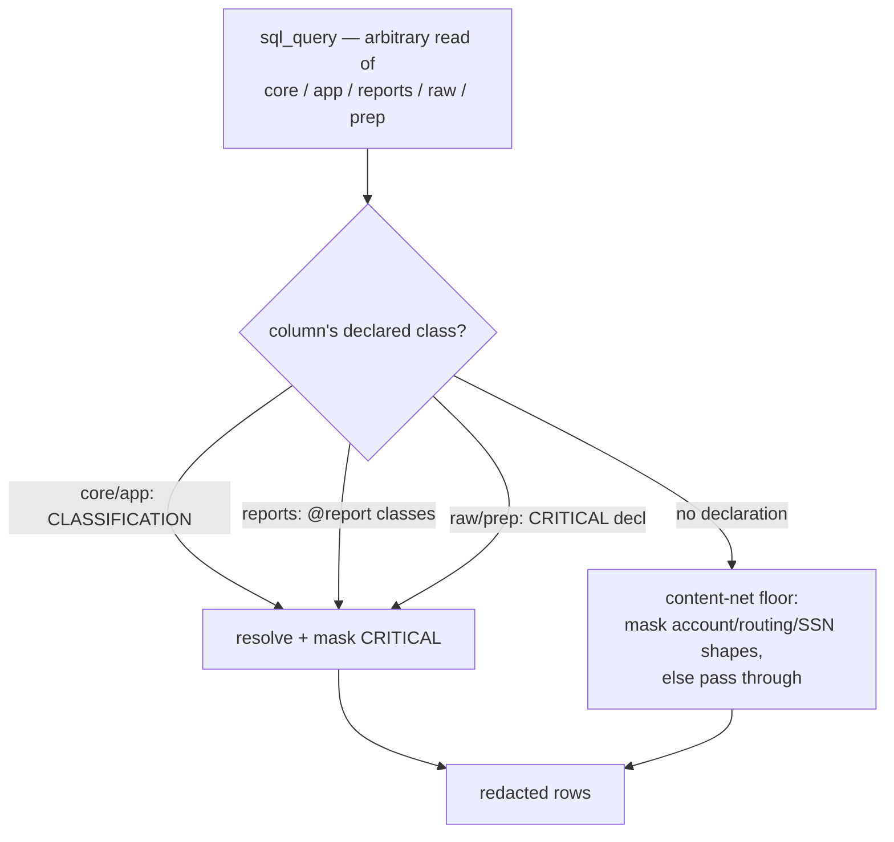

# Feature: Queryable Internal Schemas

## Status
in-progress

## Milestone
M2O. Phase 1 (`reports.*`) implemented; Phase 2 (`raw`/`prep` + content-net
floor) designed.

## Type
Feature — extends the `sql_query` surface. Builds on the declared-class
pattern established by [ADR-013](../decisions/013-report-classification-declared.md)
and the `CLASSIFICATION` registry from `privacy-data-classification.md`.

## Goal
Let `sql_query` (and its CLI twin `moneybin sql query`) read `reports`,
`raw`, and `prep` — not just `core`/`app` — **without weakening the
account-number masking guarantee**. The tool becomes the power tool it's
meant to be: agents query curated report views, inspect seed data, and
debug the ingestion pipeline through the same privacy-safe surface, with
strong guidance to prefer `core`/`app` for everything else.

Masking stays sound because every queryable column resolves to a
`DataClass` by a **declared** source — the `CLASSIFICATION` registry
(`core`/`app`), each report's `@report(classes=…)` map (`reports`), or a
short CRITICAL-column declaration for `raw`/`prep` — with a **content-net
floor** masking account/routing/SSN-shaped values in any column no
declaration covers.

> **Design correction (why not lineage-derivation).** An earlier draft of
> this spec proposed *deriving* internal-schema classes automatically via
> the `sql_lineage` graph, "self-maintaining, no hand-authored registry."
> [ADR-013](../decisions/013-report-classification-declared.md) already
> rejected exactly that, verified against all eight real report views:
> SQLMesh deploys every `kind VIEW` model as `SELECT * FROM
> <internal physical table>`, so runtime lineage classifies the pointer,
> not the logic, and CRITICAL columns **leak in the clear**; and lineage
> answers "where from," not "how sensitive," so it over-classifies derived
> columns anyway. `prep` is 100% `kind VIEW` and several `core` models are
> too, so derivation is defeated across the internal schemas. The sound,
> already-shipped answer is **declared** classes; lineage stays what
> ADR-013 scoped it to — propagating declared `core`/`app` base classes
> through an arbitrary query that reads those schemas directly.

## Background & Motivation

### The current fence
`sql_query` refuses any schema outside `core`/`app`
(`_ALLOWED_QUERY_SCHEMAS` in `privacy/sql_query.py`). The reason is
sound: CRITICAL columns (account/routing numbers) are masked by
resolving each output column's `DataClass`, and only `core`/`app` are in
the `CLASSIFICATION` registry. An unclassified-schema query hits
`_conservative_floor`'s `AGGREGATE` default (unmasked) and would return
account numbers in the clear — the module docstring flags this.

### Two problems the fence creates

1. **A broken contract on seed data.** The gsheet and PDF importers ship
   a `seed` adapter whose purpose is a "catch-all escape hatch → JSON
   storage + auto-generated typed views **queryable via SQL/MCP**"
   (`connect-gsheet.md`; the PDF seed path in `smart-import-pdf.md` reuses
   it). Seed data is **terminal at `raw` by design** — reference data (a
   manual budget, a lookup table), not transactions, so it correctly
   never flows to `core`. The schema catalog already advertises these
   views (`_gsheet_seed_views` / `_pdf_seed_views` in
   `schema_catalog.py`) plus the `beyond_the_interface` pointer — but
   `sql_query` then refuses to serve them. Today the only way to query a
   seed view is the unmasked operator CLI (`moneybin db query`), not the
   agent surface the adapter was built for.

   > Seed data staying in `raw` is **correct**, not a pipeline bug. Only
   > the `transactions` adapter reaches `core`; the `seed` adapter is
   > terminal by design. A *transactions* sheet that failed to land in
   > `core` would be a separate defect — out of scope here.

2. **Recurring debugging friction.** Diagnosing an import or transform
   issue means inspecting `raw`/`prep`, which the agent surface can't do
   (only `DESCRIBE`), forcing a drop to the operator CLI.

### Curated reports aren't queryable either
`reports.*` views already carry declared privacy classes (ADR-013) and
back the `reports_*` tools, but `sql_query` still refuses the `reports`
schema — so an agent can't join a report against `core` or filter it
ad hoc.

## Design

### Classification, by declared source

| Data | How its columns get a `DataClass` |
|---|---|
| `core` / `app` | The `CLASSIFICATION` registry (unchanged source of truth) |
| `reports.*` | Each report's **declared** `@report(classes=…)` map (ADR-013), reused as-is |
| `raw` / `prep` fixed tables | A **short CRITICAL-column declaration** (account/routing numbers); all else → floor |
| Seed views (`raw.gsheet_<alias>`, `raw.pdf_<alias>`) | No per-column declaration in v1 → **content-net floor** |
| Anything else unclassified | **Content-net floor** — pass through, mask only account/routing/SSN-shaped values |

The uniform mechanism is **declaration**, not derivation. Where a
declaration exists it is authoritative; the content-net floor is the
fail-safe beneath it.

### Detailed design

**D1 — Widen the queryable-schema gate.** `_ALLOWED_QUERY_SCHEMAS` grows
from `{core, app}` to `{core, app, reports, raw, prep}`. `meta` and
`seeds` stay fenced (no consumer need surfaced).

**D2 — Widen the lineage snapshot.** `get_current_schema_snapshot`
currently queries `duckdb_columns() WHERE schema_name IN ('core','app')`.
Extend to include `reports`, `raw`, `prep` so sqlglot can qualify and
star-expand queries against them. (For `reports`/`prep` views this reads
the *pointer* columns, which is all we need — classification comes from
the declared maps, not from expanding the view body.)

**D3 — Resolve `reports.*` columns via declared report classes.** When a
column resolves to a `reports.*` table, look its class up in that
report's declared `classes` map (via
`moneybin.reports._framework.registry` / `ReportSpec.classes`) instead of
the `CLASSIFICATION` registry. The report completeness contract (ADR-013,
enforced by `tests/scenarios/test_reports_classification.py`) guarantees
every deployed report column is declared, so no `reports` column reaches
the floor at runtime.

**D4 — Declare CRITICAL columns for fixed `raw`/`prep` tables.** Add the
account/routing-bearing columns of the known, loader/model-defined
`raw`/`prep` tables to a declaration (extending `CLASSIFICATION`, or a
sibling `raw`/`prep` map). This is a short, high-value list — not a full
per-column registry — chosen because the only property `sql_query`
protects is CRITICAL masking. Everything else in `raw`/`prep` rides the
floor (D5).

**D5 — Content-net floor.** For any queryable column with no declared
class, redaction **passes the value through unless it matches an
account / routing / SSN shape**, in which case it is masked `****<last4>`.
Reuse the pattern detectors already in `SanitizedLogFormatter`
(`log_sanitizer.py`). This keeps seed sheets and un-declared columns
readable by default while holding the account-number line as a backstop.
The floor is a new redaction behavior distinct from `AGGREGATE`
passthrough — an unclassified *internal-schema* column gets the floor;
`core`/`app` retain their current fail-closed-to-max-tier fallback.

**D6 — Steer toward `core`/`app`.** Update the `sql_query` tool
description, the `beyond_the_interface` note, and `actions[]` hints:
prefer `core`/`app`; reach into `reports`/`raw`/`prep` for report joins,
seed inspection, and pipeline debugging. Positioning only — the full
surface stays queryable.

### Out of scope (this spec)
- **Full per-column `raw`/`prep` declaration**, **per-seed detect-time
  class declaration via `import_confirm`**, and **ADR-013's build-time
  "lineage-as-recommendation" engine** — deferred to a dedicated privacy
  pass. v1 relies on CRITICAL declarations + the content-net floor.
- `meta` and `seeds` schemas — stay fenced.
- **Extension/package-contributed report classes.** `reports_class_map`
  covers the in-tree `ALL_REPORTS` runners plus the transitional bridge. The
  framework's `discover_reports()` scanner (for package `@report` runners) is
  not wired into the live server yet; when it is (M2M), it MUST feed
  `reports_class_map` so package reports' declared classes are covered —
  otherwise a package report with an undeclared CRITICAL column would leak via
  the unmasked fallback. The deployed-view completeness test is the backstop
  until then.
- Write access to internal schemas — never; `sql_query` stays read-only.
- The read-only / file-access safety gate (`validate_read_only_query`) is
  unchanged — this spec touches *which schemas* are queryable, never
  *what statements* are allowed.
- Fixing a *transactions*-adapter sheet that fails to reach `core`.

## Phased build

1. **Phase 1 — `reports.*` exposure.** D1 (reports), D2 (reports), D3.
   Reuses ADR-013's declared classes; the lowest-risk schema and the
   proof of the gate + declared-resolution path. Ships report
   queryability (join reports against `core`, ad-hoc filters).
2. **Phase 2 — `raw`/`prep` exposure.** D1 (raw/prep), D2 (raw/prep), D4
   (CRITICAL declarations), D5 (content-net floor), D6 (steering).
   Delivers pipeline-debugging inspection, and seed-view queryability
   falls out for free — seed views are `raw.*`, so opening `raw` with the
   floor makes them queryable and safe without per-column declaration.

Each phase is independently shippable and testable.

## Privacy posture (one-way-door analysis)

Changing `sql_query`'s queryable schemas is a one-way door. It is handled
by **preserving** the account-number property, not trading it:

- `reports` columns are fully declared (ADR-013) — masking is as sound as
  the typed report tools today.
- `raw`/`prep` CRITICAL columns are declared (D4); everything else is
  held by the content-net floor (D5). The floor is a *weaker* guarantee
  than a declaration for those columns (a non-standard-format account
  number could slip) — an accepted trade for keeping data readable,
  recorded here so a future contributor can argue with it, and tightened
  in the deferred privacy pass.
- Pre-launch posture: iterate freely on the exact declarations and floor
  patterns; lock at the launch trigger.

## Amendments to existing specs
- **`privacy-data-classification.md`** — its scope note ("the registry
  covers every column in `core.*` and `app.*`") is unchanged for
  `core`/`app`, but the *queryable* surface now also includes `reports`
  (declared per ADR-013), `raw`/`prep` (CRITICAL-declared + floored), with
  the content-net floor as the fail-safe. The `core`/`app` completeness
  test is untouched.
- No ADR needed: this **applies** the ADR-013 declared-class pattern to a
  new surface rather than establishing a new one.

## Testing
- `sql_query` against `reports.*` masks CRITICAL exactly as the typed
  report tools do; a query that reads `account_id` from a report returns
  it masked.
- `sql_query` against `raw`/`prep` masks declared CRITICAL columns; a
  seeded account-number value in an un-declared seed-view column is masked
  by the content-net floor; a normal seed column (category, note) returns
  readable.
- Gate: `meta`/`seeds` still refused; write statements still refused.
- Steering: tool description / `beyond_the_interface` / `actions[]` assert
  the prefer-`core`/`app` guidance.
- Scenario coverage (`make test-scenarios`) for the widened surface, since
  it's a data-shape/privacy change.

## Open questions
- **Floor representation** — a new sentinel `DataClass` (e.g. `FLOORED`)
  vs. a per-column "apply content-net" flag threaded to `redact_records`.
  Leaning a sentinel that `redact_records` maps to the content-net
  transform.
- **`raw`/`prep` CRITICAL list source** — extend the `CLASSIFICATION`
  dict with `raw`/`prep` CRITICAL rows, vs. a sibling map. Extending
  `CLASSIFICATION` is more coherent but pulls those tables into its
  completeness test; a sibling map avoids that. Resolve at `draft →
  ready`.
- **Exact address (M2O)** — reconcile with the roadmap taxonomy.
