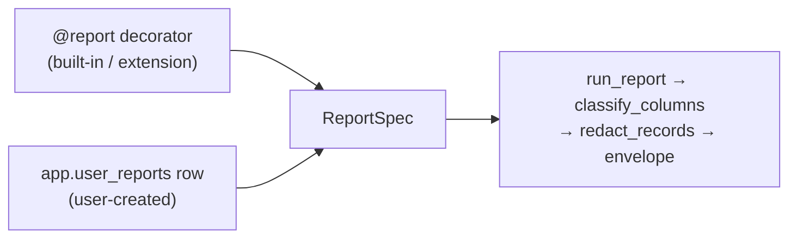

# Dynamic Reports — The Ask→Save→Verify Loop

> Child spec of [`reports-overview.md`](reports-overview.md) (milestone **M2P.2**).
> Status: draft
> Type: Feature
> Last updated: 2026-07-19 — initial spec.
> Companions: [`reports-foundation.md`](reports-foundation.md) (M2P.1, the
> contract this builds on), [`app-integrity-invariant.md`](app-integrity-invariant.md)
> (Invariant 10), [`queryable-internal-schemas.md`](queryable-internal-schemas.md)
> (the `sql_query` surface this is built over),
> [`privacy-data-classification.md`](privacy-data-classification.md),
> [ADR-013](../decisions/013-report-classification-declared.md).

## Goal

Let a question become a durable report without leaving the conversation. Ask
something, get an answer, save it — and the saved thing is a report in every
sense that a shipped report is one: same envelope, same privacy path, same
provenance.

M2P.1 made the `reports.*` surface honest; this spec makes the report primitive
reachable at runtime. Roadmap item **M2I** ("show me the SQL" report lineage)
lands here as R6.

## Non-goals

- **Precomputation.** A dynamic report is evaluated at query time, always. It
  is not in the SQLMesh graph and cannot be `kind FULL`. Promotion is M2P.3.
- **Sharing or installing** a saved report. Also M2P.3.
- **Parameter inference.** Parameters are declared, never guessed from SQL.
  See [R8](#r8--parameters-bind-by-name) for how they bind.
- **Opening `raw`/`prep`.** See [R2](#r2--save-time-classification-is-invisible).

## The one architectural claim

`ReportSpec` is already the sole contract. `run_report`
(`_framework/execute.py:186`), `build_cli_command`
(`_framework/cli_register.py:62`), and the catalog projections
`catalog_to_payload` / `result_to_payload` (`_framework/catalog.py:247,254`)
consume the frozen dataclass and never touch the `@report` decorator — verified
against the current code. There is no per-report tool factory to name here: the
MCP path is one generic dispatcher (`register_generic_reports_tool`,
`_framework/registry.py:85`) registering the single `reports` tool, which is
what makes [R5](#r5--one-access-path-three-tiers-behind-it)'s tier parity fall
out for free. So dynamic reports need **a second constructor, not a second
pattern**:

Everything downstream of `ReportSpec` is shared by all three tiers, and R7 makes
that a test rather than an intention.

One field needs widening. `ReportSpec.view: TableRef` is required, and a dynamic
report has no `reports.*` view backing it, so `view` becomes `TableRef | None`
with `None` meaning "not graph-backed." The one reader of the field,
`reports_class_map()`, keys on `(spec.view.schema, spec.view.name)` and must
skip `None`. It iterates the static `ALL_REPORTS` today, so nothing breaks —
but the skip is required before any code path feeds it a synthesized spec.

### Why `@report` still exists

Recorded because "collapse both modes into `app.user_reports`" is a reasonable
thing for a future contributor to propose. A decorated runner buys four things
a stored row structurally cannot:

1. **Distribution.** A runner is a file: it ships via pip, gets reviewed, diffs
   in git. A row lives in one local DuckDB and cannot be installed by anyone.
2. **Conditional SQL assembly.** `large_transactions` validates `anomaly`
   against `LARGE_TXN_ANOMALIES` and appends `WHERE` clauses conditionally.
   Expressing that as data requires a template language — code, reinvented.
3. **CI-verifiable classes.** M2P.1 checks each declared map against SQLMesh
   model source in CI. A stored row has no repo artifact to verify against.
4. **Graph membership.** `view=TableRef` is what makes a report eligible to
   become `kind FULL` and to participate in scheduled refresh.

The inverse collapse is a non-starter: a decorator needs a module import and a
SQLMesh view at build time, so it cannot express runtime creation.

## Requirements

### R1 — `app.user_reports` and its repo

New protected `app.*` table, paired per convention across
`src/moneybin/sql/schema/app_user_reports.sql` and
`src/moneybin/sql/migrations/V041__create_app_user_reports.py` (`V039` and
`V040` are taken on `main`), registered as
`USER_REPORTS = TableRef("app", "user_reports", audience="interface")`.

| Column | Type | Notes |
|---|---|---|
| `report_id` | `VARCHAR PRIMARY KEY` | `user:r<uuid4().hex[:12]>` — identifiers.md strategy 3, namespaced and letter-led to satisfy `ReportSpec` (below) |
| `name` | `VARCHAR NOT NULL UNIQUE` | Slug; resolved to `report_id` at the service boundary |
| `description` | `VARCHAR` | Agent-visible summary |
| `query_sql` | `VARCHAR NOT NULL` | Stored SQL with `$name` placeholders (R8) |
| `params` | `JSON NOT NULL DEFAULT '[]'` | Declared `ParamSpec` list, bound by name; each carries a `DataClass` derived at save, absent = `UNRESOLVED` (R9) |
| `classes` | `JSON NOT NULL` | Derived map, keyed by DuckDB result column name |
| `semantics` | `JSON NOT NULL` | `ReportSemantics` fields, explicitly-unknown for a user query (below) |
| `class_downgrades` | `JSON NOT NULL DEFAULT '{}'` | D5 downgrades, `{column: {from, to, reason}}` — `from` is the derived class the downgrade was approved against (R4) |
| `class_fingerprint` | `VARCHAR NOT NULL` | Drift key over the derivation inputs (R4) |
| `is_active` | `BOOLEAN NOT NULL DEFAULT true` | False = archived; hidden from the default catalog |
| `created_at` / `updated_at` | `TIMESTAMP NOT NULL DEFAULT CURRENT_TIMESTAMP` | House convention |

Under [Invariant 10](app-integrity-invariant.md), all mutation routes through
`UserReportsRepo(BaseRepo)` in `src/moneybin/repositories/` — `create`, `set`,
`delete`, each capturing the **full** pre-mutation row in `before_value` per
Req 4, each returning an `AuditEvent`. Services compose the repo; no service
issues raw DML against this table. `doctor_service` `_run_app_integrity` gains
one `_run_app_audit_coverage(USER_REPORTS, "report_id")` call.

`name` is the handle every tool in R5 takes; the service layer resolves it to
`report_id` before touching the repo, per identifiers.md Guard 2. `report_id` is
the audit target and the stable identity across renames.

#### `report_id` is namespaced, and the namespace is not decoration

`ReportSpec.__post_init__` rejects any `report_id` that does not match
`[a-z][a-z0-9_-]*:[a-z][a-z0-9_-]*` (`_framework/contract.py:25`), so a bare
`uuid4().hex[:12]` cannot construct a spec at all — the second constructor
would raise on its first row. Every shipped report already carries the
namespace (`core:spending`, `core:networth`), and `user:` extends the same
scheme to this tier, which is also what keeps a user report from colliding with
a built-in in the id space even when R5's name check is what users actually see.

The `r` prefix on the hex is load-bearing, not styling: **both** segments must
begin with `[a-z]`, and `uuid4().hex` starts with a digit roughly 62% of the
time. `user:3f9c2d81b4e0` fails the pattern; `user:r3f9c2d81b4e` passes. A mint
helper owns this so no call site re-derives it, and its test asserts the
letter-led property directly rather than sampling a few generated ids.

#### `columns` and `semantics` are required fields, and only one of them is free

`ReportSpec` declares `columns: tuple[OutputColumn, ...]` and
`semantics: ReportSemantics` with **no defaults**
(`_framework/contract.py`), so the second constructor must produce both or it
cannot build a spec at all. They are not equally hard.

`columns` is free. `__post_init__` compares `columns` against `classes` on name
and `data_class` only — `OutputColumn.description` is unconstrained — so the
constructor synthesizes one `OutputColumn` per entry in the derived class map
and carries the result column name as its own description. Nothing is asked of
the user and nothing is invented.

`semantics` is not free, which is why it gets a stored column rather than a
synthesized constant. Its 11 fields (`unit`, `sign`, `kind`, `valuation_basis`,
`fx_basis`, `time_basis`, `denominator`, `comparison_window`, `exclusions`,
`provenance`, `currency`) are financial *interpretation*, and MoneyBin cannot
derive them from an arbitrary `SELECT`. Defaulting them to plausible-looking
values would publish a claim about a user's query that nobody made — an agent
reading `sign: "natural"` on a report whose author flipped the sign gets a
confidently wrong answer, which is worse than getting none.

So a user report stores **explicitly unknown** semantics, and the catalog
renders it as unknown rather than omitting the field. This requires
`ReportSemantics` to be able to *say* unknown: `kind` is currently
`Literal["position", "flow", "ratio", "count"]` with no fifth option, and
`unit`, `sign`, and `time_basis` are non-optional `str`. Widening `kind` to
include `"unknown"` and letting those three admit `None` is the smallest change
that keeps the type honest for this tier.

That widening touches a contract every shipped report already satisfies, so it
belongs in the implementing PR with its own review, not asserted here as
settled — see [Open questions](#open-questions). The alternative, keeping
`ReportSemantics` closed and requiring the user to supply 11 fields at save,
contradicts R2's rule that saving requires a name and a query and nothing else.

#### These columns must be classified

`app` is inside `_ALLOWED_QUERY_SCHEMAS`, so `sql_query` — and a dynamic report
— can `SELECT query_sql FROM app.user_reports`. V039 therefore lands with
`CLASSIFICATION` entries or it fails
`tests/privacy/test_classification_completeness.py` on the first run. A spec
whose thesis is that classification is never skipped cannot skip its own table.

Classes follow the conventions the sibling `app` tables already set, not fresh
judgment — `app.categorization_rules` and `app.gsheet_connections` are the
references:

| Column | Class | Precedent |
|---|---|---|
| `query_sql` | `USER_NOTE` | User-authored free text; may embed literals from their own data |
| `description` | `USER_NOTE` | `categorization_rules.name` |
| `name` | `USER_NOTE` | `categorization_rules.name` — user-authored, despite also being the handle |
| `report_id` | `RECORD_ID` | `gsheet_connections.alias` — minted opaque handle |
| `classes`, `class_downgrades`, `params` | `DESCRIPTION` | `gsheet_connections.column_mapping` — structural JSON map |
| `class_fingerprint` | `RECORD_ID` | `checksum` / `content_hash` (`taxonomy.py`) — the existing class for a hash |
| `is_active` | `TXN_TYPE` | `categorization_rules.is_active` |
| `created_at`, `updated_at` | `TIMESTAMP_OBSERVABILITY` | Universal across `app` tables |

`query_sql`'s `USER_NOTE` (MEDIUM) is a **deliberate accepted risk, not an
oversight**, and it has one hole worth naming so an implementer doesn't
rediscover it. R9 keeps a CRITICAL *bound* parameter out of the provenance view,
but a user who writes the value straight into the SQL — `WHERE routing_number =
'021000021'` instead of `= $acct` — puts it in a MEDIUM column that
`_TRANSFORMS` passes through unmasked today, so it reaches an agent through both
`sql_query` over `app.user_reports` and `reports_explain`'s `sql_template`.

Accepted because the alternatives are worse: masking inside user-authored SQL
means either redacting text the user must be able to read back and edit, or
classifying string literals by pattern-matching — a guess that would corrupt
legitimate queries (an account-shaped literal is indistinguishable from an
invoice number) while a determined author routes around it with string
concatenation. The exposure also requires working against the grain of R8/R9,
which exist precisely so the natural way to write a filter is a parameter.

The cheap mitigation belongs to the save pipeline, which has already parsed the
SQL and resolved every column by step 5: a literal compared against a CRITICAL
column is detectable there, and that is where to surface a confirm rather than
store it silently — the "magic stays visible" rule in `design-principles.md`,
targeted at the moment the inference could be wrong. Deferred to implementation,
not v1 scope; the accepted risk above is what holds until it lands.

#### Archive is domain state; `deleted_at` is not the mechanism

`is_active` follows the lifecycle-flag pattern used by `app.categories` and
`app.categorization_rules`. Archiving is `reports_set(name, is_active=False)`.
`surface-design.md` sanctions **both** shapes here — `_set` with a typed field
(its stated resolution for `_toggle`) and `_archive` as a domain verb — and this
spec takes `_set` because archiving carries no domain meaning the typed field
erases, and it adds no tool. Archived reports stay runnable by name; archiving
suppresses catalog noise, it does not revoke access.

There is deliberately **no `deleted_at`**. Soft delete as a *recoverability*
mechanism would be a second, weaker implementation of a job Invariant 10 already
does: full-row `before_value` capture plus the generic `undo_event` restore a
deleted report exactly. The archive flag is unrelated to recovery — it is user
intent about visibility. Nor does it need an `archived_at` companion: the
archiving mutation's own `app.audit_log` row carries its timestamp, so a
dedicated column would duplicate audit state and could drift from it.

Because `name` is `UNIQUE` and archived rows stay in the table, an archived name
stays taken. A save onto a colliding archived name must say so and name both
exits — restore it with `reports_set(name, is_active=True)`, or free the name
with `reports_set(name, state="absent")`. Reporting a bare "name already exists"
for a report the default catalog hides is the failure this clause exists to
prevent.

### R2 — Save-time classification is invisible

**Classification must never be something the user does, and never something
that blocks a save.** Saving requires a name and a row-returning read-only
SELECT over permitted schemas. Nothing else. The class map is derived and
stored; the user never sees it unless they ask.

Save pipeline:

1. `validate_read_only_query` — existing gate, unchanged. It refuses
   multi-statement input as of #346, which this pipeline depends on: each
   statement in `SELECT 1; SELECT routing_number FROM core.dim_accounts` is
   individually a legal read, but DuckDB returns the *last* statement's rows
   while steps 3–6 classify the first. Step 6 would then bridge
   `routing_number` onto statement 1's `AGGREGATE` class positionally and
   persist that pairing — baking the mismatch into a durable artifact rather
   than one response. The same PR removed the whitespace normalization that let
   a `--` comment hide a second statement from the parser, so the statement
   count is taken from the text DuckDB executes. A saved report inherits both
   properties by calling the gate; it adds no statement check of its own.
2. `is_data_query` — reject anything that is not a row-returning SELECT.
   `validate_read_only_query` also admits `DESCRIBE`, `SHOW`, `PRAGMA`, and
   `EXPLAIN` (`privacy/sql_query.py`), but step 5 below raises
   `SqlSchemaError("Query has no SELECT projection")` on all four. Without this
   gate, "valid read-only SQL always saves" is false for statements the sole
   documented gate accepts — they would fail midway through the pipeline. The
   primitive already exists (`privacy/sql_lineage.py`) and `sql_query` already
   uses it to skip classification for metadata reads; a report is a durable
   classified artifact, so it rejects rather than skips.
3. Parse, then `get_current_schema_snapshot(db)`. This is the **live** snapshot,
   not the connectionless CLASSIFICATION one, because it includes `reports.*` —
   which `sql_query` permits reading and the build-time snapshot deliberately
   excludes to stay non-self-referential.
4. `expand_star`, then `tables_outside_schemas` against `{core, app, reports}`.
   Report creation is restricted to fully-classified schemas. `raw`/`prep` are
   not reachable through `sql_query` today; when M2O.2 opens them behind a
   content-net floor, whether a *durable* artifact may be built over floored
   columns is decided there, not assumed here.
5. `resolve_output_classes(..., strict=False)`. **Not strict.** An unresolvable
   projection must not fail the save. The same resolved columns also class each
   declared parameter, by the comparison it appears in (R9) — a parameter is an
   input to the same schema this step has already resolved, so classifying it
   here costs no additional parse and keeps the user out of a classification
   decision. An unresolvable parameter lands on `UNRESOLVED`, exactly as an
   unresolvable projection does.
6. `DESCRIBE <query_sql>` **with every declared parameter bound to NULL**, to
   read real DuckDB result column names, then bridge through
   `_classes_by_result_column` and persist the reconciled map **keyed by DuckDB
   column names**. **Duplicate result column names are rejected here**, with an
   error naming the repeated name.

Step 6 is load-bearing, not an optimization. `resolve_output_classes` returns
names from sqlglot projections; `classify_columns` looks them up by DuckDB
result name. Persisting the unbridged map would mask `COUNT(*)` — sqlglot `*`,
DuckDB `count_star()` — to `'*****'` on every run of every report containing
one. That is the over-redaction bug class M2P.1 shipped and had to fix in
review; `DESCRIBE` closes it structurally rather than by vigilance.

Rejecting duplicate names is what keeps that map addressable. DuckDB permits
`SELECT 0 AS x, routing_number AS x` and returns two columns both named `x`,
but `classes` is a JSON object keyed by name and `redact_records` masks
`row.items()` by that same key — so one entry survives, holding whichever class
resolved last, and it governs whichever value survives. The mask stops
corresponding to the value it is supposed to cover, and
`reports_reclassify(x, …)` would then mutate one entry for a name that means two
things. A duplicate name carries no meaning in a durable report that anything
downstream can address by name, so this refuses at save rather than becoming a
named risk: the alternative is masking that is correct only by the accident of
projection order.

Two verified properties of step 6, both required for it to work:

- DuckDB raises `InvalidInputException` on `DESCRIBE` of a query with unbound
  parameters, for both `$name` and `?` styles. Binding NULL is sufficient and
  safe: a SELECT list's column names derive from projection *structure*, not
  parameter *values*, so NULL-bound and value-bound `DESCRIBE` return identical
  names.
- `DESCRIBE` returns one row per output column — that is the point of the step —
  and executes no user rows. Its **type** column is not trustworthy under NULL
  binding (`SELECT amount * $f` describes as `INTEGER`, not `DECIMAL`), so
  nothing may read it. Only the name column is used.

#### Every SQL or parameter change re-runs this pipeline

The pipeline is not the *save* path; it is the path any mutation of `query_sql`
or `params` takes. `reports_set` is a partial update (R5), so a call that
touches either field must re-run steps 1–6 and persist the new SQL, class map,
parameter classes, and fingerprint in a **single** repo write. Parameter classes
are derived from the comparison each placeholder appears in (step 5), so
rewriting the SQL can move a parameter from `AGGREGATE` to `ROUTING_NUMBER`
exactly as it can a projection — a stale parameter class renders a CRITICAL
literal into the provenance view under the old, weaker class. Skipping it re-creates the exact bug
this spec exists to prevent: re-aliasing an `AGGREGATE` projection `x` to
`routing_number AS x` would serve a routing number under the stale LOW class,
because `run_report` treats the stored map as authoritative. A `set` that
touches neither field (`description`, `is_active`) skips derivation entirely.

`class_downgrades` does not survive a `query_sql` change. A downgrade is a human
judgment about one column of one query (D5), and carrying it onto rewritten SQL
is the same stale-authority failure one level down. The mutation clears the map
and its response names the cleared columns; re-apply with `reports_reclassify`.

#### Not every savable report is graduation-eligible

`sql_query` permits reading `reports.*` and permits `SELECT *`; the M2P.3
graduation path permits neither, because `report_class_derivation` hard-rejects
both (`_assert_acyclic` on any `reports.*` read, `_assert_no_star` on a star in
any `SELECT`, including a CTE). A report doing either saves and runs correctly
but can never be materialized.

This spec keeps the wider save-time allowlist — composing on top of a built-in
report is real value, and the umbrella's graduation promise is explicitly
conditional ("if it proves its worth"). The obligation is honesty, not
restriction: `reports_explain` reports graduation eligibility and the specific
reason it is unavailable. Narrowing the allowlist to `{core, app}` remains the
alternative if ineligible reports prove confusing in practice.

### R3 — Magic stays visible, calibrated to certainty

Per `design-principles.md`, every increment of automatic behavior owes a visible
confirm **targeted at the moment the inference could be wrong** — and silence
everywhere else.

- **Resolved columns are silent.** No note, no confirm, no output. Pass-through
  columns from `core`/`app` resolve exactly, which covers every projection that
  names a table column directly.
- **Unresolvable columns produce one non-blocking note** on the save response,
  naming the columns and the fix. Not a gate. The report saves.
- **Masked output self-explains.** Any run that masks at least one column
  carries an `actions[]` hint pointing at `reports_explain`. A `'*****'` with no
  explanation becomes a two-call fix.

The residual honesty: *over*-classification cannot be detected automatically —
that is why D5 leaves the downgrade judgment to a human. A z-score correctly
derives as `TXN_AMOUNT` (HIGH) and masks. The `actions[]` hint plus
`reports_reclassify` is a mitigation, not a fix.

### R4 — Drift detection keys on the class map, not the migration counter

A saved report freezes a class map. If the map's inputs change, the frozen copy
goes stale — and the dangerous direction is a column **reclassified upward**,
where a stale copy keeps serving a now-sensitive column at its old weaker class.
That is the #330 shape persisted in a durable artifact.

The drift key must therefore cover what derivation actually reads:

- `core.*` / `app.*` classes come from `CLASSIFICATION`, a Python dict.
- `reports.*` classes come from `reports_class_map()`, built in-process from
  `@report` declarations plus the generated module.

`reports_class_map()` covers the in-tree `ALL_REPORTS` runners and the
generated module — **not** package-contributed reports. Its own docstring
(`privacy/sql_lineage.py`) states the consequence and the obligation: package
discovery is not wired into the live server today, and when it is (M2M) it
"MUST feed this map too — otherwise a package report with an undeclared
CRITICAL column resolves to the unmasked `AGGREGATE` fallback."

That is a live constraint on this spec, not a note about someone else's
milestone. A user report may `SELECT` from a package-contributed `reports.*`
view the moment both features exist, and R2 step 5 would resolve its columns
against a map that has never heard of it — producing `AGGREGATE`, unmasked,
for a column the package declared CRITICAL. So M2P.2 does not ship against a
live package-report surface until `discover_reports()` feeds
`reports_class_map()`; whichever of the two lands second owns the wiring, and
the `test_reports_classification.py` deployed-view backstop is what makes the
omission fail loudly rather than silently.

None of these bump a migration version, and `core.*` / `reports.*` are
SQLMesh-built, so a column added or retyped there runs no migration either.
`SchemaSnapshot.version` reads `MAX(version) FROM app.schema_migrations` and is
consequently blind to every input above — it must not be used as the drift key.

Instead, `class_fingerprint` is a hash over two things: the sorted
`(schema, table, column, DataClass)` tuples for **the tables this query reads**,
and a **`DERIVATION_VERSION`** constant bumped whenever **any function the
persisted map depends on** changes how it classifies — `resolve_output_classes`
*and* the `_classes_by_result_column` bridging step 6 calls load-bearing. The
scope is the pipeline, not one function: a change to how sqlglot projection
names reconcile against DuckDB result names moves no tuple and touches no
classifier, so scoping the constant to `resolve_output_classes` alone would
leave every saved report on the `Match` branch serving output under the old
bridging behaviour. That is the same stale-authority failure one function to
the left — and step 6 is where M2P.1's over-redaction bug actually lived.

The version term is not ceremony. The tuples describe derivation's *inputs*; a
change to the classifier itself moves no tuple, so a fix that raises a computed
column from LOW to HIGH would leave every saved report on the `Match` branch,
serving the old class indefinitely — the same stale-authority failure, arriving
through the algorithm instead of the data. Bumping the constant invalidates
every stored fingerprint at once and forces re-resolution on the next run of
each report. The bump is a source change, so CI is where it is enforced: the
classifier's tests own the reminder, the same way M2P.1's derivation check does.

On each run the fingerprint is recomputed and compared:

- **Match** → `classify_columns` against the stored map, byte-identical to how a
  built-in runs. No lineage work; the comparison is dictionary lookups, no DB.
- **Mismatch** → re-resolve, reapply the report's approved `class_downgrades` to
  the freshly derived map, then compare. An equal map serves the run normally. A
  changed map fails closed for the affected columns and marks the response
  degraded (see below).

Reapplying downgrades before the comparison is what keeps a legitimately
downgraded report from degrading forever. A z-score column downgraded
`TXN_AMOUNT` → `AGGREGATE` differs from the derived map *by design*, so
comparing raw derivation against the stored map reports a change on every run —
and since reads never refresh the fingerprint, the report stays degraded from
the first unrelated classification change onward. The downgrade is part of the
approved map; the comparison has to be against the same thing that was approved.

**A downgrade is reapplied only where the derived class still matches the one it
was approved against.** A downgrade approved for `TXN_AMOUNT → AGGREGATE` on
column `z` is an assertion about `TXN_AMOUNT` on that column, not a standing
exemption for `z`. If re-derivation now yields `ROUTING_NUMBER` there, the
premise is gone: the stored entry is dropped, the column reports as changed, and
it fails closed. Reapplying by column name alone would let an approval collected
against a weak class silently suppress a stronger one — the inverse of what the
downgrade was reviewed for.

**Re-resolution covers the stored parameter classes, not just the output
columns.** A dynamic report's parameter classes are derived at save (R2 step 5)
from the columns its filters compare against, so they go stale by exactly the
mechanism this section exists to catch — and one level deeper than the rows do.
If `dim_accounts.external_ref` is reclassified upward, the *result columns*
correctly fail closed on the next run, while `reports_explain` would keep
rendering `WHERE external_ref = $ref` with the value inline under the class
stored months earlier. The rows would be masked and the filter that selected
them printed in the clear. So the Mismatch branch re-derives parameter classes
in the same pass, compares them the same way, and a parameter whose class
changed reverts to its placeholder and marks the response degraded.

This is the same fingerprint and the same pass — parameters are classified from
the columns the fingerprint already covers, so a class that can move moves the
fingerprint with it. Leaving them out would reopen, for the provenance surface,
precisely the stale-authority hole R4 closes for the data surface.

The fingerprint is a cache key, not authority: re-resolution is what decides the
run, so a stale fingerprint costs work, never correctness. That matters because
the read path has no writable connection — both adapters call `run_report`
inside `get_database(read_only=True)` (`mcp/tools/reports.py:58`,
`_framework/cli_register.py:82`), and R1 routes every
`app.user_reports` mutation through the audited repo, which would emit an audit
row per *read*. So a run never persists a refreshed fingerprint.

**Only a write that re-runs the derivation pipeline may store a fingerprint**,
and it stores the map and the fingerprint together. A metadata-only write — a
`description` edit, an archive — must leave `class_fingerprint` untouched, even
though it is a write and the current value is trivially available. Storing a
current fingerprint beside a stale map is worse than storing a stale one: it
puts the next run on the `Match` branch and serves the weaker class with no
re-resolution to catch it. A stale fingerprint only ever costs a re-resolution;
a fresh fingerprint over a stale map is the leak itself.

The cost is honest and unbounded in time: until the report's SQL or parameters
next change, every run re-resolves — one live schema snapshot plus one sqlglot
parse, the same work the save did, on a single-user embedded database. Buying
that back with a write-during-read would put an unaudited mutation on the read
path, which Invariant 10 does not permit.

A newly *added* upstream column needs no coverage here: `classify_columns`
already fails closed on any result column absent from the stored map.

Because `degraded` is documented on the envelope as a no-consent signal, its
docstring widens to cover stale classification, and `degraded_reason` must name
which of the two applies. Two meanings on one flag with no way to tell them
apart is not acceptable; two meanings with a mandatory discriminator is.

### R5 — One access path, three tiers behind it

Reading a report — catalog or execution — adds **no MCP tool**. The shipped
`reports(report_id, parameters, limit)` contract is already the universal path,
and a user report resolves through it exactly as a built-in does. This spec
extends that tool's resolution to span all three tiers; it does not sit a second
dispatcher beside it.

| Operation | MCP | CLI |
|---|---|---|
| Catalog, all tiers | `reports` (omit `report_id`) | `moneybin reports list` |
| Run any report | `reports(report_id, parameters)` | `moneybin reports run` |
| Save / update / rename / archive / delete | `reports_set` | `moneybin reports create`, `set`, `delete` |
| Inspect | `reports_explain` | `moneybin reports explain` |
| Downgrade a class | `reports_reclassify` | `moneybin reports reclassify` |

**The write surface is three new tools, not six, and the constraint is the
registry budget.** `mcp-tool-surface-scaling.md` operates one bounded registry
of 45 standard tools against a hard maximum of 50 (ADR-016), with a
carrying-weight review required of every tool above 40. Six new `reports_*`
identities would land at 51 — over the hard maximum — so the earlier shape was
not merely unfashionable under the consolidated surface, it was unbuildable
without superseding an ADR. Three lands at 48, and each of the three owes the
seven-question admission record in its implementing PR.

The collapse follows `surface-design.md` rather than the count. `reports_set` is
shape 1b: create, update, rename, archive, and delete share intent,
authorization, sensitivity, and audit contract, so they belong in one typed
target-state mutation (`state="absent"` for the hard delete, which advertises
maximum static risk and confirms only that branch). The rule reserves a strict
`_create` and a paired `_delete` for cases where those contracts *materially*
differ, which is not this one — the collision guard that motivated a strict
create is a property of the registry and runs on every path that sets a name,
so it does not need a tool of its own.

`reports_explain` stays separate because its trust contract genuinely differs:
[R9](#r9--provenance-renders-identically-across-tiers) has it render a
parameter value verbatim that the same report's results mask, so folding it into
`reports` behind a flag would put two sensitivity contracts under one identity —
and its output family (SQL, lineage, class map) is not the row union `reports`
returns, which fails the shared-output test for acceptable polymorphism.
`_reclassify` is a domain verb because it carries D5's mandatory `reason`, which
a generic field-set erases, and because its elicitation and audit contracts are
unlike any other write in the domain.

The catalog read is the **noun** `reports`, because `_list` is on the rule's
explicit drop list and no shipped MCP tool carries the suffix. The CLI keeps
`reports list`, matching 18 existing `list` subcommands, and keeps `create` /
`set` / `delete` as separate subcommands — CLI discoverability is cheap
(`--help` navigation costs no context window), so the surfaces map to the same
capability through the same service without requiring name equality, which is
the parity `.claude/rules/cli.md` asks for.

The catalog excludes archived reports by default; `include_archived` (CLI
`--archived`) widens it. Each entry carries a `tier` field.

**Names are unique across the whole registry, not just against built-ins.**
`reports` resolves one `report_id` across three tiers, so two reports sharing a
name make the catalog and its runner ambiguous. The check runs in both
directions: `reports_set` rejects a name already held by a built-in *or* an
installed extension, and installing an extension whose report name collides with
an existing user report fails with both names rather than silently shadowing
one. Defining a precedence order instead would mean a user's saved report can
change meaning when an unrelated package is installed — a rule nobody can see
from the catalog.

**Both of those are mutation-time checks, and a collision can arrive without a
mutation.** Upgrading MoneyBin can add a built-in whose name a user already
took; upgrading an installed package can rename one of its reports onto the
same ground. Neither path calls `reports_set` or the install check, so a
registry validated at every write can still be ambiguous at the next startup —
and the tier that loses is always the user's, since the colliding name was
theirs first.

So catalog construction validates the assembled registry rather than trusting
that every entry was checked on the way in, and a collision found there is
surfaced, never silently resolved: the affected reports are listed by name and
tier, and the user report stays runnable by `report_id` while its name is
contested. Resolving it silently in either direction is the failure — shadowing
the user's report hides their work behind an upgrade they did not ask for, and
shadowing the built-in makes a shipped report vanish for one user with no
visible cause.

**`reports_reclassify` requires human confirmation and cannot be self-accepted
by the agent that calls it.** A downgrade permanently lowers the masking floor
for a column across every future run and every surface — `reports`,
`sql_query`, `reports_explain` — on the strength of a `reason` string the caller
supplies about its own request. `design-principles.md` is explicit that an
inference this consequential "is never eligible for agent self-accept, regardless
of confidence score," and the cost of a wrong one is exactly the kind it names as
raising the bar: silent, durable, and invisible in the result.

The mechanism already exists and the precedent is unambiguous. `import_confirm`
is agent-callable and still cannot be answered by the agent —
`confirm_or_raise` raises when the client cannot elicit, so nothing loads
(`mcp/tools/import_tools.py`). `reports_reclassify` takes the same shape: the
tool presents the column, its derived class, the proposed class, and the
`reason`, and the downgrade persists only on human confirmation through
elicitation. A client that cannot elicit gets a refusal, not a default-accept.
The generic MCP consent ladder does not cover this — it gates what leaves the
machine on one request, not a durable change to what is masked on all future
ones.

**A downgrade must lower the tier, and an equal-tier weakening is refused
outright.** `reports_reclassify` applies the rule `.claude/rules/reports.md`
already states for materialized reports — not a second rule beside it:
`tier(to)` must be strictly below `tier(from)`, and `mask_strength(to)` may not
rise. A reason cannot waive the equal-tier case.

The equal-tier prohibition is the part a pair-ordering test misses, and it is
the dangerous one. `ROUTING_NUMBER → ACCOUNT_IDENTIFIER` holds tier at CRITICAL
and drops mask strength from `WHOLE` to `PARTIAL`, so "neither component rises
and at least one falls" would admit it — and every future run of that report
would render the real last four digits where every row previously showed
`'*****'`. `reports.md` names exactly this: the downgrade mechanism exists
because derivation over-classifies *computed* columns, and that argument is
unavailable when both classes agree on the tier and differ only in transform.
There, a waiver would not correct an over-classification; it would elect to
publish part of a value everyone agrees is CRITICAL.

Requiring the tier to fall is what carries that. This spec's worked example is
unaffected — `TXN_AMOUNT → AGGREGATE` moves HIGH → LOW — while the equal-tier
weakening is refused with no reason able to excuse it. Holding
`mask_strength` flat-or-falling on top keeps a tier drop from strengthening one
axis while weakening the other.

Materialized reports get this at CI time (`reports-foundation.md` R3); a dynamic
report has no repo artifact and no CI step, so the tool is the only place it can
run. The two surfaces must enforce the *same* rule: the agent-reachable,
runtime, un-reviewed-by-CI path is the last one that should get the weaker of
two guards.

**Renames go through the same collision check as creation.** `reports_set` is
how a report is renamed (R1), so a rename into a name already held by a built-in
or an installed extension would satisfy the table's `UNIQUE` constraint — which
only spans `app.user_reports` — and still leave `reports` ambiguous across
tiers. The check is a property of the registry, not of any one branch of
`reports_set`; every path that can set a name runs it.

**Parameters cross the wire as a mapping, not `**kwargs`.** Both registrars
synthesize an explicit signature from `spec.params`, and FastMCP and Typer
derive their schemas from it — so a variadic tool would advertise no parameters
at all and an agent could not discover or pass any. `reports` already takes a
typed `parameters: dict[str, JsonValue] | None` for exactly this reason, and a
user report binds through it unchanged; the CLI twin takes repeated
`--param key=value`. Validating names against the report's declared list is the
binder's job, which is where R8's "an unknown name raises" is enforced.

The binder also **coerces each value to its `ParamSpec.annotation`** before
either surface invokes the report, raising a validation error naming the
parameter and the expected type when it cannot. `--param top=5` arrives as the
string `"5"`, and a runner declaring `top: int` would otherwise receive it raw
and fail somewhere inside its own body — an error about the report's internals
for what is a boundary mistake. Coercing at the binder keeps the two surfaces
behaving identically: the MCP path gets typed values from the synthesized
signature, and the CLI path reaches the same place instead of failing later and
worse.

Both surfaces are peers per `.claude/rules/cli.md` — same envelope, same
redaction, same audit actor threading.

#### Where parity is real and where it is not

The umbrella requires user reports to reach "the same tool surface, envelope,
privacy path, and provenance" as a shipped report. All four now hold exactly,
and the fourth arrived from outside this spec.

Tool surface used to be the concession: a user report could not get a generated
`reports_<name>` tool, because registration happens at startup and the MCP tool
list cannot mutate mid-session without clients that refresh. The surface
consolidation removed generated per-report tools from every tier — a report
"registers behind the single read-only `reports` catalog/runner and never adds
an MCP tool" (`.claude/rules/mcp.md`) — so a built-in no longer has the shortcut
a user report was measured against. Every tier is now reached identically, by
`report_id` through one tool.

This is parity by deletion rather than by construction, and it holds only while
that rule does. If per-report tools ever return, they return for built-ins first
and the gap reopens against the tier that cannot have them — so a proposal to
reintroduce them has to answer for user reports in the same change. What
M2P.3's graduation path buys is no longer discoverability; it is the automation
and distribution a repo artifact gets and a database row does not.

### R6 — The verify surface (absorbs M2I)

`reports_explain(name, params=None)` returns, for any tier:

- the SQL in both forms defined by [R9](#r9--provenance-renders-identically-across-tiers);
- the resolved class map, per column, with provenance — which upstream column it
  descends from, or that it is computed or unresolved;
- the upstream tables lineage resolved;
- freshness: `class_fingerprint`, whether drift was detected, `updated_at`;
- graduation eligibility, with the disqualifying reason when it is unavailable
  (R2).

It accepts `params` because R9's executed form needs values to render. Omitted
params fall back to declared defaults; what happens when a required parameter
has no default depends on where the SQL comes from, and the two tiers cannot be
made uniform here:

- **User-created** — the SQL is a stored template. A missing required value
  renders as its `$name` placeholder in `sql_template`, the executed `sql` form
  is omitted, and the response names the parameters that suppressed it.
- **Built-in and extension backed by a `runner`** — there is no template. The
  only way to obtain the query is `spec.runner(db, **params)`
  (`_framework/execute.py:194`), which raises on a missing keyword argument
  before a query exists, and a placeholder sentinel would fail the runner's own
  validation or ID resolution instead. So `reports_explain` requires every
  `required` parameter for these tiers and returns a validation error naming
  the missing ones.
- **Service-backed (`ServiceReportSpec`)** — there is no query to return at
  all. This kind carries an `executor` returning a finished
  `CatalogReportResult` (`_framework/catalog.py`), not a `runner` returning a
  `ReportQuery`, so no SQL string exists anywhere in the path. `core:networth`
  and `core:networth_history` are the shipped instances.

The third kind is why R9's "provenance renders identically across tiers" is
bounded rather than absolute, and the bound is worth stating plainly: a
service-backed report cannot feed the brass SQL chip a query, because it has
none. `reports_explain` returns its declared `semantics.provenance` — the
`reports.*` view names the service reads (`("reports.net_worth",)` for
`core:networth`) — and an explicit `sql_unavailable` reason naming the
service-backed kind. A chip that renders "derived by `NetworthService` from
`reports.net_worth`" tells the truth; one that fabricates a plausible `SELECT`
to fill the slot does not, and the whole point of the provenance chip is that
it can be checked.

Everything else `reports_explain` returns — class map, lineage, freshness,
graduation eligibility — is parameter-independent and available for all three.

This is the *verify* half of "create and verify", and R5's dispatcher makes it
uniform across tiers.

### R7 — Parity is enforced by test, not by intention

A test asserts that a user-created report and a built-in report execute through
the same `run_report` call path and produce structurally identical envelopes. A
change that forks the execution path fails CI rather than passing review.

Per the fail-closed lesson from M2P.1, classification tests carry **benign**
fixtures in the same PR as the guards: unaliased `COUNT(*)`, unaliased
`MIN(amount)`, and a wrapped scalar subquery must each return a real value, not
`'*****'`. No privacy test fails on over-masking, so the over-masking test must
be written deliberately.

Drift needs its own test at the level R4 describes: reclassify a column upward
in `CLASSIFICATION`, then assert a saved report over it fails closed rather than
serving the stale class.

Repository tests follow the house pattern: row mutation, paired `app.audit_log`
entry, `app_mutation_audit_emitted_total` increment, and rollback when audit
raises.

### R8 — Parameters bind by name

Stored SQL uses DuckDB's **named** parameter syntax (`$month`), and declared
parameters bind by name. Positional `?` binding is not used.

The deciding argument is silent failure, not ergonomics. Both surfaces are
keyword-based, so positional storage needs a name→position mapping maintained
alongside the SQL — and editing that SQL to add a `WHERE` clause shifts every
subsequent position. That mis-binds arguments silently, producing wrong numbers
rather than an error. Named binding cannot express that failure: an unknown or
missing name raises.

Concrete consequence for the implementer: `ReportQuery.params` widens from
`Sequence[object]` to `Sequence[object] | Mapping[str, object]`, and
`run_report`'s `db.execute(rq.sql, list(rq.params))` must stop calling `list()`
— `list()` on a mapping yields its *keys*, which would bind parameter names as
values. Both are internal abstractions behind a stable contract, so this is a
two-way door; built-in runners keep working unchanged and may adopt named
binding if it reads better.

### R9 — Provenance renders identically across tiers

`WidgetCard`'s contract states that "every widget that shows a number must pass
`sql` — a widget that can't state its query doesn't ship." All three tiers
satisfy it from one source: `reports_explain` returns the query, so the brass SQL
chip is fed identically whether the report came from a decorator or a row. (The
prop is typed optional; the requirement is the component's stated convention.)

`reports_explain` returns two forms, because the provenance ladder's bottom rung
opens the query in the SQL console for direct editing, where a template with
unbound `$month` would fail:

- `sql` — the executed form with parameters rendered as literals via sqlglot
  literal construction, so DATE, DECIMAL, BOOLEAN, and NULL render with their
  types intact rather than as naive quoted strings. **Display only.** MoneyBin
  never executes this string; it exists so a user can paste it into the console,
  where it re-enters through `validate_read_only_query` and normal
  parameterization.
- `sql_template` — the stored form with named placeholders intact.

**A parameter classed above LOW keeps its placeholder in `sql`.** Rendering is
not execution, so it never passes through `run_report`'s `classify_columns` /
`redact_records` — a report filtered by account or routing number would return
that value verbatim from `reports_explain` while the same value is masked in
every row of the result it explains. Every bound parameter therefore carries a
`DataClass`; the renderer emits a literal only for LOW-classed bindings and
leaves the rest as `$name`.

Masking the value instead (`'****1234'`) would be worse on both counts: it is
not valid SQL for the column it filters, and it invites the reader to believe
the string is the query that ran. A retained placeholder is honest about what
was withheld and stays pasteable — the user re-supplies the sensitive value in
the console, which is where a CRITICAL literal belongs anyway. This keeps the
provenance surface inside the same classification pipeline as the data surface
rather than beside it; a value that is *rendered* rather than *bound* is outside
every guard that reads the bound form.

The class reaches `ParamSpec` the same way each tier's parameters already
arrive, and **an unclassified parameter is never LOW.** Defaulting to
`AGGREGATE` would invert this spec's own column rule: R2 step 5 runs
`resolve_output_classes(strict=False)`, and a projection it cannot resolve
lands on `DataClass.UNRESOLVED` — CRITICAL, masked whole. A parameter is the
same question asked of an input, so it fails closed the same way. Defaulting to
the weakest class in the enum would build the placeholder-retention mechanism
above and then hand every author a way to switch it off by omission.

**The class attaches to the binding, not to the signature.** A runner's
signature describes what the *user* passes; the bound value can be something
else entirely. `balance_drift` binds
`AccountService(db).resolve_strict(account)` — the parameter is declared
`account: str`, free text a user typed, which classifies as the account name it
is (`INSTITUTION`, or `USER_NOTE` for a nickname at MEDIUM). The value that
reaches the query is a resolved `account_id`: `RECORD_ID`, LOW, because
`.claude/rules/reports.md` is explicit that an `account_id` is a minted opaque
surrogate and not an account number. An annotation on the signature classifies
the input and would render the transformed value under it.

Here that errs toward over-masking — a LOW opaque id displayed under the
MEDIUM class of the text it was resolved from — and the direction is the point:
signature and binding are not a stricter and a looser view of one value, they
are classes of two different values. Whichever way the mismatch falls, the
class rendered is not the class of the thing rendered. The
[fail-closed section](#r9--provenance-renders-identically-across-tiers) treats
over-masking as its own failure, so "it errs safe" does not rescue it.

Positional inference fails for the same reason one step earlier. R8 keeps
`ReportQuery.params` a positional `Sequence[object]`, and `balance_drift`
appends conditionally (`if account:`, `if status != "all":`), so binding *N* is
not a fixed offset into the signature — the correspondence between the two lists
is data-dependent. Recovering a class by counting positions is the same failure
this spec keeps finding elsewhere: two structures whose alignment is assumed
rather than carried, silently desyncing when one of them changes.

So a binding carries its own class:

- **Built-in and extension runners** classify at the append site, which is the
  only place that knows what the value became. A bare value binds as
  `UNRESOLVED` — existing runners keep working and fail closed rather than
  breaking — and a completeness test requires every binding site to declare one,
  the same shape as the `CLASSIFICATION` test that already requires a class for
  every `core`/`app` column. The fail-closed default keeps the migration safe;
  the test is what finishes it. Named binding stays optional (R8): with the class
  on the binding, nothing downstream needs to map a value back to a parameter
  name.
- **Dynamic reports derive it**, because R2's premise is that classification is
  never something the user does — asking a report author to declare a parameter
  class would contradict the invariant this spec exists to establish. The save
  pipeline already parses the SQL and resolves its columns, so a parameter takes
  the class of the column it is compared against: `WHERE routing_number =
  $acct` classes `$acct` as `ROUTING_NUMBER`. A parameter whose comparison
  cannot be resolved to exactly one classified column — a bare `LIMIT $n`, a
  comparison against an expression, a placeholder used in two places with
  different classes — resolves to `UNRESOLVED` and keeps its placeholder.

One mechanism serves all three tiers, which is the parity R5 asks for:
`reports_explain` reads the class off the binding it is about to render and
never reconstructs it from anything else.

`UNRESOLVED` is derived, never stored: `taxonomy.py` notes that *declaring* a
column unresolved defeats the completeness tests that exist to find gaps, and
the same reasoning holds for a parameter. An absent class in stored `params`
means unresolved; it is not a value an author can write.

The cost is that an unresolvable parameter renders as `$name` in the provenance
view rather than its value. That is the correct direction to be wrong in, and
it is bounded: the common parameters — a month, a limit, a category — either
resolve against a classified column or are genuinely unresolvable and are the
cheapest possible thing to withhold.

### R10 — Surfaces this change falsifies

`.claude/rules/reports.md` opens by defining a complete report as three required
parts: a SQLMesh model, an `@report`-decorated runner, and a declared `classes`
map. A dynamic report has none of the first two. That sentence becomes false the
moment this ships, and under design-principles.md coherence the introducing
change owns the fix — the rule is rewritten to define the contract in terms of
`ReportSpec`, with the three-part form named as what a *materialized* report
requires.

Implementation also updates `docs/specs/moneybin-mcp.md` and
`docs/specs/moneybin-cli.md` for the four MCP tools (three of them new) and
seven CLI subcommands in R5, **and `docs/specs/moneybin-capabilities.md`** —
mcp.md's surface-change
discipline requires two specs per change, the surface-specific one and the
cross-surface capability map, with a row added or updated per capability.

## Observability

| Metric | Type | Labels |
|---|---|---|
| `moneybin_user_report_saves_total` | Counter | `outcome` (`saved`, `rejected`) |
| `moneybin_user_report_runs_total` | Counter | `tier`, `outcome` |
| `moneybin_user_report_unresolved_columns_total` | Counter | — |
| `moneybin_user_report_drift_detected_total` | Counter | `resolution` (`equal`, `failed_closed`) |
| `moneybin_user_report_reclassify_total` | Counter | `outcome` (`confirmed`, `declined`, `refused_not_weaker`, `no_elicitation`) |

The unresolved-columns and drift counters carry the load: together they say
whether the invisible classification is invisible in practice, or whether users
are quietly accumulating masked columns.

The reclassify counter is the one to watch for abuse rather than health. It is
the only path that durably lowers a masking floor, so a rising `confirmed` rate
against a flat `declined` rate is the signal that the confirm has become a
formality people click through — the failure mode `design-principles.md` warns
about when a confirm is not targeted at genuine uncertainty. `no_elicitation`
separates clients that cannot confirm from humans who said no; conflating them
would hide a surface that is refusing every downgrade for mechanical reasons.

## Open questions

- **Does `ReportSemantics` widen, or does the catalog carry the unknown?** R1
  needs a user report to say its financial semantics are unknown, and the
  dataclass currently cannot: `kind` is a closed `Literal` of four values and
  `unit` / `sign` / `time_basis` are non-optional. Widening it is the smaller
  change and keeps one type across tiers, but it touches a contract every
  shipped report satisfies and every catalog consumer reads. The alternative —
  leaving `ReportSemantics` closed and letting the catalog payload represent an
  absent-semantics report — keeps the built-in contract frozen at the cost of
  two shapes for one concept, which is the two-patterns rot `design-principles.md`
  names as the largest source of decay. Decide with the implementing PR, which
  is where the consumer list can actually be enumerated.
- **Does `reports_set` earn a registry slot at 48 of 50?** The three write tools
  fit `surface-design.md`'s shapes, but fitting a shape is not the admission
  test — the seven-question record in `.claude/rules/mcp.md` also demands the
  serialized byte delta and evaluation evidence, and neither exists until the
  tools do. If the carrying-weight review rejects one, the fallback is folding
  the write path into an existing coarse mutation rather than superseding
  ADR-016's hard maximum. Settle this in the implementing PR, with numbers.
