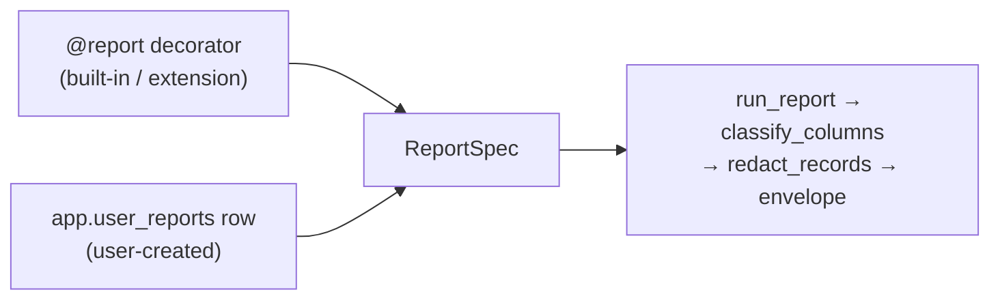

# Dynamic Reports — The Ask→Save→Verify Loop

> Child spec of [`reports-overview.md`](reports-overview.md) (milestone **M2P.2**).
> Status: in-progress
> Type: Feature
> Last updated: 2026-07-19 — initial spec.
> Companions: [`reports-foundation.md`](reports-foundation.md) (M2P.1, the
> contract this builds on), [`app-integrity-invariant.md`](app-integrity-invariant.md)
> (Invariant 10), [`queryable-internal-schemas.md`](queryable-internal-schemas.md)
> (the `sql_query` surface this is built over),
> [`privacy-data-classification.md`](privacy-data-classification.md),
> [ADR-013](../decisions/013-report-classification-declared.md).

## Goal

Let a question become a durable report without leaving the conversation. Ask
something, get an answer, save it — and the saved thing is a report in every
sense that a shipped report is one: same envelope, same privacy path, same
provenance, same tool surface.

This is the headline capability of the reports umbrella. M2P.1 made the
`reports.*` surface honest; this spec makes the surface *reachable at runtime*.
Roadmap item **M2I** ("show me the SQL" report lineage) lands here as R6.

## Non-goals

- **Precomputation.** A dynamic report is evaluated at query time, always. It
  is not in the SQLMesh graph and cannot be `kind FULL`. Promotion is M2P.3.
- **Sharing or installing** a saved report. Also M2P.3.
- **Parameter inference.** Parameters are declared, never guessed from SQL.
  See [R8](#r8--parameters-bind-by-name) for how they bind.
- **Opening `raw`/`prep`.** See [R2](#r2--save-time-classification-is-invisible).

## The one architectural claim

`ReportSpec` is already the sole contract. `run_report`, `make_tool_fn`, and
`build_cli_command` consume the frozen dataclass and never touch the `@report`
decorator. So dynamic reports need **a second constructor, not a second
pattern**:

Everything downstream of `ReportSpec` is shared by all three tiers. This is the
three-tier parity promise falling out of existing structure rather than being
engineered, and R7 makes it a test rather than an intention.

### Why `@report` still exists

Recorded because "collapse both modes into `app.user_reports`" is a reasonable
thing for a future contributor to propose. A decorated runner buys four things
a stored row structurally cannot:

1. **Distribution.** A runner is a file: it ships via pip, gets reviewed, diffs
   in git. A row lives in one local DuckDB and cannot be installed by anyone.
2. **Conditional SQL assembly.** `large_transactions` validates `anomaly`
   against an allowlist and appends `WHERE` clauses conditionally. Expressing
   that as data requires a template language — code, reinvented badly.
3. **CI-verifiable classes.** M2P.1 checks each declared map against SQLMesh
   model source in CI. A stored row has no repo artifact to verify against.
4. **Graph membership.** `view=TableRef` is what makes a report eligible to
   become `kind FULL` and to participate in scheduled refresh.

The inverse collapse is a non-starter: a decorator needs a module import and a
SQLMesh view at build time, so it cannot express runtime creation.

## Requirements

### R1 — `app.user_reports` and its repo

New protected `app.*` table, paired per convention across
`src/moneybin/sql/schema/app_user_reports.sql` and
`src/moneybin/sql/migrations/V039__create_app_user_reports.py`, registered as
`USER_REPORTS = TableRef("app", "user_reports", audience="interface")`.

| Column | Type | Notes |
|---|---|---|
| `report_id` | `VARCHAR PRIMARY KEY` | `uuid4().hex[:12]`, identifiers.md strategy 3 |
| `name` | `VARCHAR NOT NULL UNIQUE` | Slug; the handle `reports_run` takes |
| `description` | `VARCHAR` | Agent-visible summary |
| `query_sql` | `VARCHAR NOT NULL` | Stored SQL, `?` placeholders for params |
| `params` | `JSON NOT NULL DEFAULT '[]'` | Declared `ParamSpec` list, positional |
| `classes` | `JSON NOT NULL` | Derived map, keyed by DuckDB result column name |
| `class_downgrades` | `JSON NOT NULL DEFAULT '{}'` | D5 downgrades, `{column: reason}` |
| `snapshot_version` | `BIGINT NOT NULL` | Schema version classes were derived against |
| `is_active` | `BOOLEAN NOT NULL DEFAULT true` | False = archived; hidden from the default catalog |
| `created_at` / `updated_at` | `TIMESTAMP NOT NULL DEFAULT CURRENT_TIMESTAMP` | House convention |

Under [Invariant 10](app-integrity-invariant.md), all mutation routes through
`UserReportsRepo(BaseRepo)` in `src/moneybin/repositories/` — `create`, `set`,
`delete`, each capturing the **full** pre-mutation row in `before_value` per
Req 4, each returning an `AuditEvent`. Services compose the repo; no service
issues raw DML against this table. `doctor_service` `_run_app_integrity` gains
one `_run_app_audit_coverage(USER_REPORTS, "report_id")` call.

#### Archive is domain state; `deleted_at` is not the mechanism

`is_active` follows the lifecycle-flag pattern already used by
`app.categories` and `app.categorization_rules`, and archiving is expressed as
`reports_set(name, is_active=False)` — the resolution `surface-design.md`
prescribes for exactly this shape ("`_toggle` — too narrow. Use `_set` with a
typed field"). Archived reports stay runnable by name; archiving suppresses
catalog noise, it does not revoke access.

There is deliberately **no `deleted_at`**. Soft delete as a *recoverability*
mechanism would be a second, weaker implementation of a job Invariant 10
already does: full-row `before_value` capture plus the generic `undo_event`
restore a deleted report exactly. The archive flag is unrelated to recovery —
it is user intent about visibility. Nor does the flag need an `archived_at`
companion: the archiving mutation's own `app.audit_log` row carries its
timestamp, so a dedicated column would duplicate audit state and could drift
from it.

### R2 — Save-time classification is invisible

**Classification must never be something the user does, and never something
that blocks a save.** Saving requires valid read-only SQL over permitted
schemas and a name. Nothing else. The class map is derived and stored; the user
never sees it unless they ask.

Save pipeline:

1. `validate_read_only_query` — existing gate, unchanged.
2. Parse, then `get_current_schema_snapshot(db)`. This is the **live** snapshot,
   not the connectionless CLASSIFICATION one, because it includes `reports.*` —
   which `sql_query` permits reading and the build-time snapshot deliberately
   excludes to stay non-self-referential.
3. `expand_star`, then `tables_outside_schemas` against `{core, app, reports}`.
   Report creation is restricted to fully-classified schemas. `raw`/`prep` are
   not reachable through `sql_query` today; when M2O.2 opens them behind a
   content-net floor, whether a *durable* artifact may be built over floored
   columns is decided there, not assumed here.
4. `resolve_output_classes(..., strict=False)`. **Not strict.** An unresolvable
   projection must not fail the save.
5. `DESCRIBE <query_sql>` **with every declared parameter bound to NULL**, for
   real DuckDB result column names — metadata only, executes nothing, returns
   no rows — then bridge through `_classes_by_result_column` and persist the
   reconciled map **keyed by DuckDB column names**.

The NULL binding in step 5 is required, not incidental: DuckDB raises
`InvalidInputException` on `DESCRIBE` of a query with unbound parameters, for
both `$name` and `?` styles. Binding NULL is sufficient and safe — a SELECT
list's column names derive from projection *structure*, not parameter *values*,
so NULL-bound and value-bound `DESCRIBE` return identical names.

Step 5 is load-bearing, not an optimization. `resolve_output_classes` returns
names from sqlglot projections; `classify_columns` looks them up by DuckDB
result name. Persisting the unbridged map would mask `COUNT(*)` — sqlglot `*`,
DuckDB `count_star()` — to `'*****'` on every run of every report containing
one. That is the over-redaction bug class M2P.1 shipped and had to fix in
review; `DESCRIBE` closes it structurally rather than by vigilance.

### R3 — Magic stays visible, calibrated to certainty

Per `design-principles.md`, every increment of automatic behavior owes a
visible confirm **targeted at the moment the inference could be wrong** — and
silence everywhere else.

- **Resolved columns are silent.** No note, no confirm, no output. Pass-through
  columns from `core`/`app` resolve exactly, so this is the overwhelming
  majority of every real report.
- **Unresolvable columns produce one non-blocking note** on the save response,
  naming the columns and the fix. Not a gate. The report saves.
- **Masked output self-explains.** Any run that masks at least one column
  carries an `actions[]` hint pointing at `reports_explain`. A mysterious
  `'*****'` becomes a two-call fix instead of a dead end.

The residual honesty: *over*-classification cannot be detected automatically —
that is exactly why D5 leaves the downgrade judgment to a human. A z-score
correctly derives as `TXN_AMOUNT` (HIGH) and masks. The `actions[]` hint plus
`reports_reclassify` is the mitigation, and it is a mitigation, not a fix.

### R4 — Run-time drift detection

Persisted `snapshot_version` is compared against the current schema version on
each run.

- **Unchanged** → `classify_columns` against the stored map, byte-identical to
  how a built-in report runs. No lineage work.
- **Changed** → re-resolve and compare. A match refreshes `snapshot_version`.
  A mismatch fails closed for the drifted columns and sets `degraded` with a
  `degraded_reason` naming them.

A schema change under a saved report is therefore caught, never silently
mis-masked. This is the runtime counterpart of M2P.1's CI verification: the
declaration stays the runtime authority (ADR-013), and an independent
derivation checks it.

### R5 — One access path, typed shortcuts over it

`reports_run(name, **params)` resolves a name across **all three tiers** and is
the universal path an agent can always take. The generated `reports_<name>`
tools remain as typed, discoverable shortcuts over the same execution — a
strict specialization, not a parallel pattern. A user report is never
second-class, and the MCP tool list never mutates mid-session.

| Operation | MCP | CLI |
|---|---|---|
| Run any report | `reports_run` | `moneybin reports run` |
| List all tiers | `reports_list` | `moneybin reports list` |
| Save | `reports_create` | `moneybin reports create` |
| Update / archive | `reports_set` | `moneybin reports set` |
| Delete | `reports_delete` | `moneybin reports delete` |
| Inspect | `reports_explain` | `moneybin reports explain` |
| Downgrade a class | `reports_reclassify` | `moneybin reports reclassify` |

Verb choices follow `surface-design.md`: `_create` is a strict create so a name
collision errors rather than silently overwriting someone's report, and `_set`
is the paired idempotent partial update — which is why archiving needs no tool
of its own. `_edit` and `_update` are not used; they are synonyms of `_set`.
`_reclassify` stays a distinct domain verb because it carries D5's mandatory
`reason` argument, which a generic field-set would erase.

`reports_list` returns built-in, extension, and user reports in one catalog with
a `tier` field, **excluding archived reports by default**; `include_archived`
(CLI `--archived`) widens it. A saved name that collides with a built-in is
rejected at save time rather than shadowing it.

Both surfaces are peers per `.claude/rules/cli.md` — same envelope, same
redaction, same audit actor threading.

### R6 — The verify surface (absorbs M2I)

`reports_explain(name)` returns, for any tier:

- the SQL the report runs, in both forms defined by [R9](#r9--provenance-renders-identically-across-tiers)
  (`sql` executed-with-literals, `sql_template` with named placeholders);
- the resolved class map, per column, with provenance — which upstream column
  it descends from, or that it is computed or unresolved;
- the upstream tables lineage resolved;
- freshness: `snapshot_version`, whether drift was detected, `updated_at`.

This is the *verify* half of "create and verify", and the dispatcher decision in
R5 makes it uniform across tiers for free.

### R7 — Parity is enforced by test, not by intention

A test asserts that a user-created report and a built-in report execute through
the same `run_report` call path and produce structurally identical envelopes.
A future change that forks the execution path fails CI rather than passing
review.

Per the fail-closed lesson from M2P.1, classification tests carry **benign**
fixtures in the same PR as the guards: unaliased `COUNT(*)`, unaliased
`MIN(amount)`, and a wrapped scalar subquery must each return a real value, not
`'*****'`. No privacy test ever fails on over-masking, so the over-masking test
must be written deliberately.

Repository tests follow the house pattern: row mutation, paired `app.audit_log`
entry, `app_mutation_audit_emitted_total` increment, and rollback when audit
raises.

### R8 — Parameters bind by name

Stored SQL uses DuckDB's **named** parameter syntax (`$month`), and declared
parameters bind by name. Positional `?` binding is not used.

The deciding argument is not ergonomics but silent failure. `reports_run(name,
**params)` is keyword-based at both surfaces, so positional storage would need
a name→position mapping maintained alongside the SQL — and editing stored SQL
to add a `WHERE` clause shifts every subsequent position. That mis-binds
arguments **silently**, producing wrong numbers rather than an error. Named
binding cannot express that failure: an unknown or missing name raises.

Concrete consequence for the implementer: `ReportQuery.params` widens from
`Sequence[object]` to `Sequence[object] | Mapping[str, object]`, and
`run_report`'s `db.execute(rq.sql, list(rq.params))` must stop calling `list()`
— `list()` on a mapping yields its *keys*, which would bind parameter names as
values. Both are internal abstractions behind a stable contract, so this is a
two-way door; built-in runners keep working unchanged and may adopt named
binding if it reads better.

### R9 — Provenance renders identically across tiers

`WidgetCard` requires every widget showing a number to pass `sql` — "a widget
that can't state its query doesn't ship." All three tiers satisfy this from one
source: `reports_explain` returns the query, so the brass SQL chip is fed
identically whether the report came from a decorator or a row.

`reports_explain` returns two forms, because the provenance ladder's bottom
rung opens the query in the SQL console for direct editing and a template with
unbound `$month` placeholders would fail there:

- `sql` — the executed form with parameters rendered as quoted literals.
  **Display only.** MoneyBin never executes this string; it exists so a user
  can paste it into the console, where it re-enters through
  `validate_read_only_query` and normal parameterization.
- `sql_template` — the stored form with named placeholders intact.

## Observability

| Metric | Type | Labels |
|---|---|---|
| `moneybin_user_report_saves_total` | Counter | `outcome` (`saved`, `rejected`) |
| `moneybin_user_report_runs_total` | Counter | `tier`, `outcome` |
| `moneybin_user_report_unresolved_columns_total` | Counter | — |
| `moneybin_user_report_drift_detected_total` | Counter | `resolution` (`refreshed`, `failed_closed`) |

The unresolved-columns and drift counters are the ones that matter: together
they say whether the invisible classification is actually invisible in practice,
or whether users are quietly accumulating masked columns.

## Open questions

None. The two carried at drafting are resolved as R8 (parameters bind by name)
and R9 (provenance renders identically across tiers). The umbrella's
floored-columns question is resolved in R2 by deferring it to M2O.2, where it
first becomes live.
