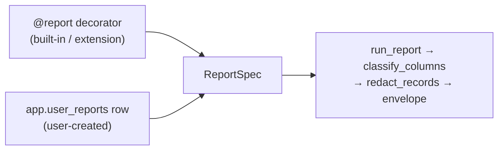

# Dynamic Reports — The Ask→Save→Verify Loop

> Child spec of [`reports-overview.md`](reports-overview.md) (milestone **M2P.2**).
> Status: draft
> Type: Feature
> Last updated: 2026-07-19 — initial spec.
> Companions: [`reports-foundation.md`](reports-foundation.md) (M2P.1, the
> contract this builds on), [`app-integrity-invariant.md`](app-integrity-invariant.md)
> (Invariant 10), [`queryable-internal-schemas.md`](queryable-internal-schemas.md)
> (the `sql_query` surface this is built over),
> [`privacy-data-classification.md`](privacy-data-classification.md),
> [ADR-013](../decisions/013-report-classification-declared.md).

## Goal

Let a question become a durable report without leaving the conversation. Ask
something, get an answer, save it — and the saved thing is a report in every
sense that a shipped report is one: same envelope, same privacy path, same
provenance.

M2P.1 made the `reports.*` surface honest; this spec makes the report primitive
reachable at runtime. Roadmap item **M2I** ("show me the SQL" report lineage)
lands here as R6.

## Non-goals

- **Precomputation.** A dynamic report is evaluated at query time, always. It
  is not in the SQLMesh graph and cannot be `kind FULL`. Promotion is M2P.3.
- **Sharing or installing** a saved report. Also M2P.3.
- **Parameter inference.** Parameters are declared, never guessed from SQL.
  See [R8](#r8--parameters-bind-by-name) for how they bind.
- **Opening `raw`/`prep`.** See [R2](#r2--save-time-classification-is-invisible).

## The one architectural claim

`ReportSpec` is already the sole contract. `run_report`, `make_tool_fn`, and
`build_cli_command` consume the frozen dataclass and never touch the `@report`
decorator — verified against the current code. So dynamic reports need **a
second constructor, not a second pattern**:

Everything downstream of `ReportSpec` is shared by all three tiers, and R7 makes
that a test rather than an intention.

One field needs widening. `ReportSpec.view: TableRef` is required, and a dynamic
report has no `reports.*` view backing it, so `view` becomes `TableRef | None`
with `None` meaning "not graph-backed." The one reader of the field,
`reports_class_map()`, keys on `(spec.view.schema, spec.view.name)` and must
skip `None`. It iterates the static `ALL_REPORTS` today, so nothing breaks —
but the skip is required before any code path feeds it a synthesized spec.

### Why `@report` still exists

Recorded because "collapse both modes into `app.user_reports`" is a reasonable
thing for a future contributor to propose. A decorated runner buys four things
a stored row structurally cannot:

1. **Distribution.** A runner is a file: it ships via pip, gets reviewed, diffs
   in git. A row lives in one local DuckDB and cannot be installed by anyone.
2. **Conditional SQL assembly.** `large_transactions` validates `anomaly`
   against `LARGE_TXN_ANOMALIES` and appends `WHERE` clauses conditionally.
   Expressing that as data requires a template language — code, reinvented.
3. **CI-verifiable classes.** M2P.1 checks each declared map against SQLMesh
   model source in CI. A stored row has no repo artifact to verify against.
4. **Graph membership.** `view=TableRef` is what makes a report eligible to
   become `kind FULL` and to participate in scheduled refresh.

The inverse collapse is a non-starter: a decorator needs a module import and a
SQLMesh view at build time, so it cannot express runtime creation.

## Requirements

### R1 — `app.user_reports` and its repo

New protected `app.*` table, paired per convention across
`src/moneybin/sql/schema/app_user_reports.sql` and
`src/moneybin/sql/migrations/V039__create_app_user_reports.py`, registered as
`USER_REPORTS = TableRef("app", "user_reports", audience="interface")`.

| Column | Type | Notes |
|---|---|---|
| `report_id` | `VARCHAR PRIMARY KEY` | `uuid4().hex[:12]`, identifiers.md strategy 3 |
| `name` | `VARCHAR NOT NULL UNIQUE` | Slug; resolved to `report_id` at the service boundary |
| `description` | `VARCHAR` | Agent-visible summary |
| `query_sql` | `VARCHAR NOT NULL` | Stored SQL with `$name` placeholders (R8) |
| `params` | `JSON NOT NULL DEFAULT '[]'` | Declared `ParamSpec` list, bound by name |
| `classes` | `JSON NOT NULL` | Derived map, keyed by DuckDB result column name |
| `class_downgrades` | `JSON NOT NULL DEFAULT '{}'` | D5 downgrades, `{column: reason}` |
| `class_fingerprint` | `VARCHAR NOT NULL` | Drift key over the derivation inputs (R4) |
| `is_active` | `BOOLEAN NOT NULL DEFAULT true` | False = archived; hidden from the default catalog |
| `created_at` / `updated_at` | `TIMESTAMP NOT NULL DEFAULT CURRENT_TIMESTAMP` | House convention |

Under [Invariant 10](app-integrity-invariant.md), all mutation routes through
`UserReportsRepo(BaseRepo)` in `src/moneybin/repositories/` — `create`, `set`,
`delete`, each capturing the **full** pre-mutation row in `before_value` per
Req 4, each returning an `AuditEvent`. Services compose the repo; no service
issues raw DML against this table. `doctor_service` `_run_app_integrity` gains
one `_run_app_audit_coverage(USER_REPORTS, "report_id")` call.

`name` is the handle every tool in R5 takes; the service layer resolves it to
`report_id` before touching the repo, per identifiers.md Guard 2. `report_id` is
the audit target and the stable identity across renames.

#### These columns must be classified

`app` is inside `_ALLOWED_QUERY_SCHEMAS`, so `sql_query` — and a dynamic report
— can `SELECT query_sql FROM app.user_reports`. V039 therefore lands with
`CLASSIFICATION` entries or it fails
`tests/privacy/test_classification_completeness.py` on the first run. A spec
whose thesis is that classification is never skipped cannot skip its own table.

Classes follow the conventions the sibling `app` tables already set, not fresh
judgment — `app.categorization_rules` and `app.gsheet_connections` are the
references:

| Column | Class | Precedent |
|---|---|---|
| `query_sql` | `USER_NOTE` | User-authored free text; may embed literals from their own data |
| `description` | `USER_NOTE` | `categorization_rules.name` |
| `name` | `USER_NOTE` | `categorization_rules.name` — user-authored, despite also being the handle |
| `report_id` | `RECORD_ID` | `gsheet_connections.alias` — minted opaque handle |
| `classes`, `class_downgrades`, `params` | `DESCRIPTION` | `gsheet_connections.column_mapping` — structural JSON map |
| `class_fingerprint` | `AGGREGATE` | A hash, carrying no row values |
| `is_active` | `TXN_TYPE` | `categorization_rules.is_active` |
| `created_at`, `updated_at` | `TIMESTAMP_OBSERVABILITY` | Universal across `app` tables |

#### Archive is domain state; `deleted_at` is not the mechanism

`is_active` follows the lifecycle-flag pattern used by `app.categories` and
`app.categorization_rules`. Archiving is `reports_set(name, is_active=False)`.
`surface-design.md` sanctions **both** shapes here — `_set` with a typed field
(its stated resolution for `_toggle`) and `_archive` as a domain verb — and this
spec takes `_set` because archiving carries no domain meaning the typed field
erases, and it adds no tool. Archived reports stay runnable by name; archiving
suppresses catalog noise, it does not revoke access.

There is deliberately **no `deleted_at`**. Soft delete as a *recoverability*
mechanism would be a second, weaker implementation of a job Invariant 10 already
does: full-row `before_value` capture plus the generic `undo_event` restore a
deleted report exactly. The archive flag is unrelated to recovery — it is user
intent about visibility. Nor does it need an `archived_at` companion: the
archiving mutation's own `app.audit_log` row carries its timestamp, so a
dedicated column would duplicate audit state and could drift from it.

Because `name` is `UNIQUE` and archived rows stay in the table, an archived name
stays taken. `reports_create` on a colliding archived name must say so and name
both exits — restore it with `reports_set(name, is_active=True)`, or free the
name with `reports_delete`. Reporting a bare "name already exists" for a report
the default catalog hides is the failure this clause exists to prevent.

### R2 — Save-time classification is invisible

**Classification must never be something the user does, and never something
that blocks a save.** Saving requires valid read-only SQL over permitted schemas
and a name. Nothing else. The class map is derived and stored; the user never
sees it unless they ask.

Save pipeline:

1. `validate_read_only_query` — existing gate, unchanged.
2. Parse, then `get_current_schema_snapshot(db)`. This is the **live** snapshot,
   not the connectionless CLASSIFICATION one, because it includes `reports.*` —
   which `sql_query` permits reading and the build-time snapshot deliberately
   excludes to stay non-self-referential.
3. `expand_star`, then `tables_outside_schemas` against `{core, app, reports}`.
   Report creation is restricted to fully-classified schemas. `raw`/`prep` are
   not reachable through `sql_query` today; when M2O.2 opens them behind a
   content-net floor, whether a *durable* artifact may be built over floored
   columns is decided there, not assumed here.
4. `resolve_output_classes(..., strict=False)`. **Not strict.** An unresolvable
   projection must not fail the save.
5. `DESCRIBE <query_sql>` **with every declared parameter bound to NULL**, to
   read real DuckDB result column names, then bridge through
   `_classes_by_result_column` and persist the reconciled map **keyed by DuckDB
   column names**.

Step 5 is load-bearing, not an optimization. `resolve_output_classes` returns
names from sqlglot projections; `classify_columns` looks them up by DuckDB
result name. Persisting the unbridged map would mask `COUNT(*)` — sqlglot `*`,
DuckDB `count_star()` — to `'*****'` on every run of every report containing
one. That is the over-redaction bug class M2P.1 shipped and had to fix in
review; `DESCRIBE` closes it structurally rather than by vigilance.

Two verified properties of step 5, both required for it to work:

- DuckDB raises `InvalidInputException` on `DESCRIBE` of a query with unbound
  parameters, for both `$name` and `?` styles. Binding NULL is sufficient and
  safe: a SELECT list's column names derive from projection *structure*, not
  parameter *values*, so NULL-bound and value-bound `DESCRIBE` return identical
  names.
- `DESCRIBE` returns one row per output column — that is the point of the step —
  and executes no user rows. Its **type** column is not trustworthy under NULL
  binding (`SELECT amount * $f` describes as `INTEGER`, not `DECIMAL`), so
  nothing may read it. Only the name column is used.

#### Not every savable report is graduation-eligible

`sql_query` permits reading `reports.*` and permits `SELECT *`; the M2P.3
graduation path permits neither, because `report_class_derivation` hard-rejects
both (`_assert_acyclic` on any `reports.*` read, `_assert_no_star` on a star in
any `SELECT`, including a CTE). A report doing either saves and runs correctly
but can never be materialized.

This spec keeps the wider save-time allowlist — composing on top of a built-in
report is real value, and the umbrella's graduation promise is explicitly
conditional ("if it proves its worth"). The obligation is honesty, not
restriction: `reports_explain` reports graduation eligibility and the specific
reason it is unavailable. Narrowing the allowlist to `{core, app}` remains the
alternative if ineligible reports prove confusing in practice.

### R3 — Magic stays visible, calibrated to certainty

Per `design-principles.md`, every increment of automatic behavior owes a visible
confirm **targeted at the moment the inference could be wrong** — and silence
everywhere else.

- **Resolved columns are silent.** No note, no confirm, no output. Pass-through
  columns from `core`/`app` resolve exactly, which covers every projection that
  names a table column directly.
- **Unresolvable columns produce one non-blocking note** on the save response,
  naming the columns and the fix. Not a gate. The report saves.
- **Masked output self-explains.** Any run that masks at least one column
  carries an `actions[]` hint pointing at `reports_explain`. A `'*****'` with no
  explanation becomes a two-call fix.

The residual honesty: *over*-classification cannot be detected automatically —
that is why D5 leaves the downgrade judgment to a human. A z-score correctly
derives as `TXN_AMOUNT` (HIGH) and masks. The `actions[]` hint plus
`reports_reclassify` is a mitigation, not a fix.

### R4 — Drift detection keys on the class map, not the migration counter

A saved report freezes a class map. If the map's inputs change, the frozen copy
goes stale — and the dangerous direction is a column **reclassified upward**,
where a stale copy keeps serving a now-sensitive column at its old weaker class.
That is the #330 shape persisted in a durable artifact.

The drift key must therefore cover what derivation actually reads:

- `core.*` / `app.*` classes come from `CLASSIFICATION`, a Python dict.
- `reports.*` classes come from `reports_class_map()`, built in-process from
  `@report` declarations plus the generated module.

None of these bump a migration version, and `core.*` / `reports.*` are
SQLMesh-built, so a column added or retyped there runs no migration either.
`SchemaSnapshot.version` reads `MAX(version) FROM app.schema_migrations` and is
consequently blind to every input above — it must not be used as the drift key.

Instead, `class_fingerprint` is a hash over the sorted
`(schema, table, column, DataClass)` tuples for **the tables this query reads**.
On each run the fingerprint is recomputed and compared:

- **Match** → `classify_columns` against the stored map, byte-identical to how a
  built-in runs. No lineage work; the comparison is dictionary lookups, no DB.
- **Mismatch** → re-resolve. An equal map refreshes the fingerprint silently. A
  changed map fails closed for the affected columns and marks the response
  degraded (see below).

A newly *added* upstream column needs no coverage here: `classify_columns`
already fails closed on any result column absent from the stored map.

Because `degraded` is documented on the envelope as a no-consent signal, its
docstring widens to cover stale classification, and `degraded_reason` must name
which of the two applies. Two meanings on one flag with no way to tell them
apart is not acceptable; two meanings with a mandatory discriminator is.

### R5 — One access path, typed shortcuts over it

`reports_run(name, params)` resolves a name across **all three tiers** and is the
universal path an agent can always take. The generated `reports_<name>` tools
remain as typed, discoverable shortcuts over the same execution.

| Operation | MCP | CLI |
|---|---|---|
| Run any report | `reports_run` | `moneybin reports run` |
| Catalog, all tiers | `reports` | `moneybin reports list` |
| Save | `reports_create` | `moneybin reports create` |
| Update / archive | `reports_set` | `moneybin reports set` |
| Delete | `reports_delete` | `moneybin reports delete` |
| Inspect | `reports_explain` | `moneybin reports explain` |
| Downgrade a class | `reports_reclassify` | `moneybin reports reclassify` |

Verb choices per `surface-design.md`: `_create` is a strict create so a name
collision errors rather than silently overwriting someone's report; `_set` is
the paired idempotent partial update; `_update` is banned as its synonym. The
catalog read is the **noun** `reports`, because `_list` is on the rule's explicit
drop list and no shipped MCP tool carries the suffix. The CLI keeps `reports
list`, matching 18 existing `list` subcommands. `_reclassify` is a domain verb
because it carries D5's mandatory `reason`, which a generic field-set erases.

The catalog excludes archived reports by default; `include_archived` (CLI
`--archived`) widens it. Each entry carries a `tier` field. A saved name that
collides with a built-in is rejected at save rather than shadowing it.

**Parameters cross the wire as a mapping, not `**kwargs`.** Both registrars
synthesize an explicit signature from `spec.params`, and FastMCP and Typer
derive their schemas from it — so a variadic tool would advertise no parameters
at all and an agent could not discover or pass any. `reports_run` therefore takes
a typed `params: dict[str, Any] | None`; the CLI twin takes repeated
`--param key=value`. Validating names against the report's declared list is the
binder's job, which is where R8's "an unknown name raises" is enforced.

Both surfaces are peers per `.claude/rules/cli.md` — same envelope, same
redaction, same audit actor threading.

#### Where parity is real and where it is not

The umbrella requires user reports to reach "the same tool surface, envelope,
privacy path, and provenance" as a shipped report. Three of those four hold
exactly: identical envelope, identical privacy path, identical provenance, all
because R7's shared `run_report` path guarantees it.

Tool surface is the concession. A user report does **not** get a generated
`reports_<name>` tool, because registration happens at startup and the MCP tool
list cannot mutate mid-session without clients that refresh. A user report is
reachable, discoverable, and equal in output — but reached through `reports_run`
rather than a tool of its own. M2P.3's graduation path is what closes the
remaining gap, and stating it plainly is better than claiming a parity the
architecture does not deliver.

### R6 — The verify surface (absorbs M2I)

`reports_explain(name, params=None)` returns, for any tier:

- the SQL in both forms defined by [R9](#r9--provenance-renders-identically-across-tiers);
- the resolved class map, per column, with provenance — which upstream column it
  descends from, or that it is computed or unresolved;
- the upstream tables lineage resolved;
- freshness: `class_fingerprint`, whether drift was detected, `updated_at`;
- graduation eligibility, with the disqualifying reason when it is unavailable
  (R2).

It accepts `params` because R9's executed form needs values to render. Omitted
params fall back to declared defaults; a required parameter with no default
renders as its placeholder, and the response says which columns are unresolved
for that reason.

This is the *verify* half of "create and verify", and R5's dispatcher makes it
uniform across tiers.

### R7 — Parity is enforced by test, not by intention

A test asserts that a user-created report and a built-in report execute through
the same `run_report` call path and produce structurally identical envelopes. A
change that forks the execution path fails CI rather than passing review.

Per the fail-closed lesson from M2P.1, classification tests carry **benign**
fixtures in the same PR as the guards: unaliased `COUNT(*)`, unaliased
`MIN(amount)`, and a wrapped scalar subquery must each return a real value, not
`'*****'`. No privacy test fails on over-masking, so the over-masking test must
be written deliberately.

Drift needs its own test at the level R4 describes: reclassify a column upward
in `CLASSIFICATION`, then assert a saved report over it fails closed rather than
serving the stale class.

Repository tests follow the house pattern: row mutation, paired `app.audit_log`
entry, `app_mutation_audit_emitted_total` increment, and rollback when audit
raises.

### R8 — Parameters bind by name

Stored SQL uses DuckDB's **named** parameter syntax (`$month`), and declared
parameters bind by name. Positional `?` binding is not used.

The deciding argument is silent failure, not ergonomics. Both surfaces are
keyword-based, so positional storage needs a name→position mapping maintained
alongside the SQL — and editing that SQL to add a `WHERE` clause shifts every
subsequent position. That mis-binds arguments silently, producing wrong numbers
rather than an error. Named binding cannot express that failure: an unknown or
missing name raises.

Concrete consequence for the implementer: `ReportQuery.params` widens from
`Sequence[object]` to `Sequence[object] | Mapping[str, object]`, and
`run_report`'s `db.execute(rq.sql, list(rq.params))` must stop calling `list()`
— `list()` on a mapping yields its *keys*, which would bind parameter names as
values. Both are internal abstractions behind a stable contract, so this is a
two-way door; built-in runners keep working unchanged and may adopt named
binding if it reads better.

### R9 — Provenance renders identically across tiers

`WidgetCard`'s contract states that "every widget that shows a number must pass
`sql` — a widget that can't state its query doesn't ship." All three tiers
satisfy it from one source: `reports_explain` returns the query, so the brass SQL
chip is fed identically whether the report came from a decorator or a row. (The
prop is typed optional; the requirement is the component's stated convention.)

`reports_explain` returns two forms, because the provenance ladder's bottom rung
opens the query in the SQL console for direct editing, where a template with
unbound `$month` would fail:

- `sql` — the executed form with parameters rendered as literals via sqlglot
  literal construction, per `security.md`, so DATE, DECIMAL, BOOLEAN, and NULL
  render correctly rather than as naive quoted strings. **Display only.**
  MoneyBin never executes this string; it exists so a user can paste it into the
  console, where it re-enters through `validate_read_only_query` and normal
  parameterization.
- `sql_template` — the stored form with named placeholders intact.

### R10 — Surfaces this change falsifies

`.claude/rules/reports.md` opens by defining a complete report as three required
parts: a SQLMesh model, an `@report`-decorated runner, and a declared `classes`
map. A dynamic report has none of the first two. That sentence becomes false the
moment this ships, and under design-principles.md coherence the introducing
change owns the fix — the rule is rewritten to define the contract in terms of
`ReportSpec`, with the three-part form named as what a *materialized* report
requires.

Implementation also updates `docs/specs/moneybin-mcp.md` and
`docs/specs/moneybin-cli.md` for the seven MCP tools and seven CLI commands in
R5, per mcp.md's surface-change discipline.

## Observability

| Metric | Type | Labels |
|---|---|---|
| `moneybin_user_report_saves_total` | Counter | `outcome` (`saved`, `rejected`) |
| `moneybin_user_report_runs_total` | Counter | `tier`, `outcome` |
| `moneybin_user_report_unresolved_columns_total` | Counter | — |
| `moneybin_user_report_drift_detected_total` | Counter | `resolution` (`refreshed`, `failed_closed`) |

The unresolved-columns and drift counters carry the load: together they say
whether the invisible classification is invisible in practice, or whether users
are quietly accumulating masked columns.

## Open questions

- **Does `reports_run` fit the `_run` verb?** `surface-design.md` defines `_run`
  as "execute a discrete batch/pipeline operation," and all five shipped `_run`
  tools mutate state (`refresh_run`, `transactions_categorize_run`,
  `transactions_matches_run`, `accounts_links_run`, `merchants_links_run`).
  `reports_run` is a read-only projection dispatcher, so it either extends the
  verb to cover read dispatch or needs a different name. MCP tool names are a
  public contract under design-principles.md, so this is settled before
  implementation, not during.
