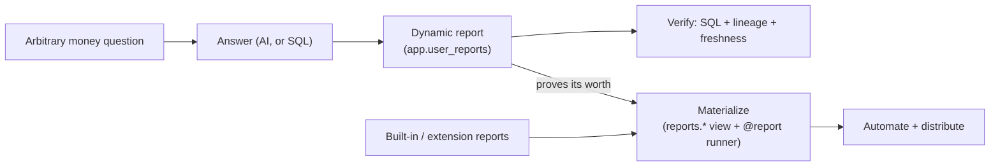

# Reports — Overview

> Umbrella doc for the reports-surface initiative (milestone **M2P**). Child
> specs listed in [The three sub-projects](#the-three-sub-projects) are written
> separately.
> Status: draft
> Type: Umbrella
> Last updated: 2026-07-18 — initial umbrella. Captures the design decisions
> from the post-#330 reports-surface brainstorm.
> Companions: [`reports-recipe-library.md`](reports-recipe-library.md) (the eight
> shipped built-in views), [`reports-net-worth.md`](reports-net-worth.md)
> (`NetworthService`-backed exception), [`extension-contracts.md`](extension-contracts.md)
> (report contract, Quality Scale, `/moneybin-create-report`),
> [`queryable-internal-schemas.md`](queryable-internal-schemas.md) (the `sql_query`
> surface dynamic reports are built on), [`privacy-data-classification.md`](privacy-data-classification.md)
> and [ADR-013](../decisions/013-report-classification-declared.md) (declared
> column classes).

## Purpose

Reports are the load-bearing surface of MoneyBin and its primary
differentiator. The goal is not a fixed set of dashboards — it is a loop:

> **Ask an arbitrary question about your money → answer it (AI primarily, SQL as
> the alternative) → crystallize that answer into a durable, verifiable report.**

Repeat, and the library compounds into **a BI tool for your money**.

MoneyBin is deliberately **not** an opinionated app about how you should budget,
invest, or manage money. It is the personal financial data platform that lets
you *inform* every one of those decisions. Opinionated workflows belong to the
later extensibility framework, not the core engine.

### The differentiating spine

Four properties matter; two are the spine and two are non-negotiable support:

| Priority | Property | What it means here |
|---|---|---|
| **Spine** | **Agent-native composability** | Reports are built for an LLM to select, parameterize, join against `core`, and render — not fixed dashboards. |
| **Spine** | **Extensibility** | A report is a first-class contributable unit. A person *or an agent* can add one correctly the first time, and the library compounds. |
| Support | **Privacy by construction** | Every report column carries a known `DataClass`, so the whole surface is safe to hand to an AI by default. |
| Support | **Provenance / verifiability** | Every number is traceable to the rows that produced it. This is the *verify* half of "create and verify". |

### The three-tier parity promise

Three origins must feel **equally first-class**:

1. **Built-in** — ships with MoneyBin.
2. **Extension** — contributed by a package or a standalone report extension.
3. **User-created** — born at runtime from a question someone just asked.

Parity is the hard constraint that shapes the architecture below. It is not
enough for user reports to be "saved queries"; they must reach the same tool
surface, envelope, privacy path, and provenance as a shipped report.

## Core architecture: one contract, two materialization modes

A **report** is a *named, parameterized, privacy-classed, verifiable query*.
Whether it is precomputed is an implementation concern, not part of the
definition. That single contract is what makes the three tiers uniform.

| Mode | Backed by | Lives in | Buys you |
|---|---|---|---|
| **Dynamic** | a query | `app.*` (user state) | Instant creation from a question; full runtime CRUD |
| **Materialized** | a SQLMesh `reports.*` view + `@report` runner | the repo / an installed package | **Distribution** (a shareable, installable artifact) and **eligibility for automation** (see below) |

> **What "materialized" does and does not mean today.** All eight shipped
> `reports.*` models are `kind VIEW` — evaluated at query time, precomputing
> nothing. Materialization's concrete benefit *today* is distribution: the
> report becomes a versioned artifact that ships with the repo or a package.
> What it additionally buys is **eligibility**: only a model in the transform
> graph can later become `kind FULL`/`INCREMENTAL_BY_TIME_RANGE` and gain real
> precomputation, and only a model in the graph participates in scheduled
> refresh. A dynamic report can never be promoted to a materialized kind
> because it is not in the graph at all. Child specs must not claim
> precomputation for a `kind VIEW` report.

Built-ins and extensions simply ship already-materialized. A user report starts
dynamic and may **graduate**: *ask → answer → save as a dynamic report → if it
proves its worth, materialize it → now it is shareable, and eligible for
scheduled refresh and precomputation.* That
graduation path is how a user-created report earns the same status as an
extension report rather than merely being declared equal to one.

## Design decisions

These six decisions are settled and constrain the child specs.

**D1 — Storage is hybrid.** `app.*` is the live source of truth for dynamic
reports — exactly the `app` layer's definition: user state, mutable, not
derivable from raw. Encryption and backup follow from that placement (they are
properties of the database file). **Audit does not.** Under
[Invariant 10](app-integrity-invariant.md), audit coverage comes from routing
every protected `app.*` write through a `*Repo` in `src/moneybin/repositories/`,
not from the table's schema. So M2P.2 owes `app.user_reports` a `UserReportRepo`
— a service issuing raw `INSERT`/`UPDATE`/`DELETE` against it is a contract
violation, and dynamic reports are precisely the kind of user-authored,
agent-mutated state that needs recoverability. An export/graduate path emits the
materialized file form.

**D2 — A report is defined by its query, not its view.** A `reports.*` view is
an optional backing optimization, not part of the contract. This keeps user
reports free of any transform run and keeps user SQL out of the pipeline.

**D3 — `reports.*` *is* the user-facing report surface.** *In `reports.*` ⟹ is a
report ⟹ carries a declared class map* is a **definition**, not a convention.
This matches AGENTS.md's own layer definition ("Curated presentation models, one
per CLI/MCP report"). Service-internal views move to `core`/`prep`.

**D4 — Column classes are derived, then verified.** The declaration remains the
**runtime authority** (SQLMesh deploys a `kind VIEW` model as
`SELECT * FROM <internal table>`, so runtime introspection of the deployed view
sees only a pointer — ADR-013). But the declaration is a **derived, verifiable
artifact**, not a hand-authored assertion: derive it from the **model source** at
build time, where lineage is complete, and have CI verify it still matches.

> **Framing correction worth preserving.** Materialization does *not* destroy
> lineage — it destroys *runtime* lineage through the deployed pointer view. The
> model source has complete, static, reviewable lineage in version control.
> Materialization is therefore the moment we have the *most* reliable lineage
> information, not the least. ADR-013 rejected *runtime* lineage on the
> *deployed* view and explicitly left the door open to build-time lineage; this
> decision walks through that door and strengthens it from "recommendation" to
> "derived + CI-verified", with the declaration still authoritative at runtime.

**D5 — Provenance ≠ sensitivity, so derivation sets a floor the author may
lower with a reason.** Lineage says `amount_zscore_account` descends from
`amount`, so pure derivation would classify it `TXN_AMOUNT` (HIGH) — but a
z-score leaks nothing and is correctly `AGGREGATE` (LOW). Derivation is right for
pass-through columns and systematically *over*-classifies computed ones, and
over-masking a BI surface is its own failure. So: derivation sets the floor;
an author may downgrade a computed column with an explicit inline reason; CI
fails unless every column is **either** derivation-matched **or** carries an
explicit downgrade. Both failure modes — a *missing* declaration and a *silently
wrong* one — are mechanically caught, while the judgment that genuinely needs a
human stays with the human.

**D6 — Materialization mechanically carries the classes forward.** The tool that
materializes a dynamic report already knows that report's resolved classes, so
it writes the `classes=` map itself. **You cannot materialize without declaring,
because the thing that materializes derives the declaration.** This is the
structural fix for the [#330 failure mode](#origin) — the authoring rule stops
being documentation a contributor might skip and becomes a step they cannot.

## The three sub-projects

Each is independently shippable. Dependencies run A → B → C.

### A — Foundation: one contract, coherent surface (M2P.1)

Define the contract both modes satisfy, and make today's surface honest.
Implements D3, D4, D5. Fixes the fail-open/fail-closed asymmetry that was #330's
mechanism-level root cause; builds class derivation + CI verification; deletes
the #330 transitional bridge (derivation subsumes it); moves
`uncategorized_queue` out of `reports.*`; writes the report-authoring rule
(`.claude/rules/reports.md`). Specified in
[`reports-foundation.md`](reports-foundation.md).

### B — Dynamic reports: the ask→save→verify loop (M2P.2)

The headline capability. `app.user_reports`; create/run/list/edit/delete across
MCP **and** CLI with the same envelope and privacy path as built-ins; classes
resolved by construction via `resolve_output_classes`; and the verification
surface — "show me the SQL", lineage to source rows, freshness. Roadmap item
**M2I** ("Show me the SQL" report lineage) lands here.

### C — Materialization & distribution (M2P.3)

The promotion path (dynamic → materialized, with D6's mechanical class capture),
the `/moneybin-create-report` skill already specified in
[`extension-contracts.md`](extension-contracts.md), and sharing/installing a
report. Contributor UX is milestoned **M3I** there — reconcile addressing when
scheduling.

## Relationship to `queryable-internal-schemas`

**Not subsumed.** [`queryable-internal-schemas.md`](queryable-internal-schemas.md)
widens the ad-hoc `sql_query` surface to internal schemas for
debugging/inspection; its Phase 2 (M2O.2) is what finally makes gsheet/PDF
**seed views** queryable. This umbrella is about the report *primitive*.

They meet in one place that B must decide: once Phase 2 opens `raw`/`prep`
behind a content-net floor, may a dynamic report be built over **floored**
(undeclared) columns, or is report creation restricted to fully-classified
schemas? A report is a durable, re-runnable, shareable artifact, so the bar
should plausibly be higher than for a one-off query — resolve it in B.

## Origin

This umbrella exists because of a concrete failure. PR #330 opened `sql_query`
to the whole `reports` schema while the declared-class safety net covered only
6 of 8 deployed views (`net_worth` and `uncategorized_queue` were uncovered).
The uncovered columns fell through to `AGGREGATE` (LOW) — five genuinely
HIGH-tier financial columns (`net_worth`/`total_assets`/`total_liabilities` on
`net_worth`; `amount`/`priority_score` on `uncategorized_queue`) served at LOW.
`uncategorized_queue.account_id` also came back unmasked, but that part was
never the leak: `account_id` is a deliberately opaque minted surrogate
classified `RECORD_ID` (LOW) everywhere in `CLASSIFICATION`, so passing it
through unmasked is correct. The root cause was not the missing declaration —
it was that `reports.*` had **two producer patterns and only one of them
declared privacy classes**, with no rule stating what a complete report
requires. The review lesson generalizes: a coverage guard that enumerates the
*declared* set can never reveal what you failed to declare — it must
enumerate the *exposed* set.

## Open questions

- **Should service-backed reports remain a distinct registration path?**
  `net_worth` is user-facing, so under D3 it stays in `reports.*` and must be
  classified — but D4's derivation classifies it like any other view, so this
  stopped being a privacy question. Its `NetworthService`-backed catalog entry
  already runs through `reports(report_id="core:networth", parameters={...})`.
  The remaining question is whether runtime-created reports can satisfy the
  same catalog metadata and classification contract. **Resolve in C**, alongside
  the `extension-contracts.md` M3I addressing reconciliation.
- **When does a dynamic report earn materialization?** Cost/latency judgment, or
  an explicit user/agent action? Resolve in C.
- **Dynamic reports over floored columns** — see the section above. Resolve in B.
- **Milestone reconciliation.** This umbrella claims **M2P**; `extension-contracts.md`
  milestones contributor UX at M3I. Reconcile at `draft → ready`.
