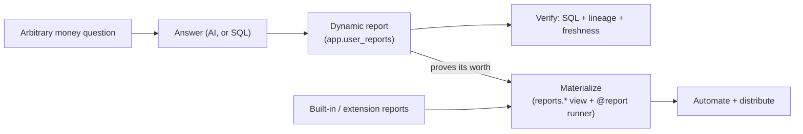

# Reports — Overview

> Umbrella doc for the reports-surface initiative (milestone **M2P**). Child
> specs listed in [The three sub-projects](#the-three-sub-projects) are written
> separately.
> Status: in-progress
> Type: Umbrella
> Last updated: 2026-07-26 — reconciled against the two shipped children
> (M2P.1, M2P.2) and promoted out of draft. D4 now states where each mode
> derives its classes, D1 names the repo that landed, and the milestone
> question is closed. Written 2026-07-18 from the post-#330 reports-surface
> brainstorm.
> Companions: [`reports-recipe-library.md`](reports-recipe-library.md) (the seven
> shipped built-in views), [`reports-net-worth.md`](reports-net-worth.md)
> (`NetworthService`-backed exception), [`extension-contracts.md`](extension-contracts.md)
> (report contract, Quality Scale, `/moneybin-create-report`),
> [`queryable-internal-schemas.md`](queryable-internal-schemas.md) (the `sql_query`
> surface dynamic reports are built on), [`privacy-data-classification.md`](privacy-data-classification.md)
> and [ADR-013](../decisions/013-report-classification-declared.md) (declared
> column classes).

## Purpose

Reports are the load-bearing surface of MoneyBin and its primary
differentiator. The goal is not a fixed set of dashboards — it is a loop:

> **Ask an arbitrary question about your money → answer it (AI primarily, SQL as
> the alternative) → crystallize that answer into a durable, verifiable report.**

Repeat, and the library compounds into **a BI tool for your money**.

MoneyBin is deliberately **not** an opinionated app about how you should budget,
invest, or manage money. It is the personal financial data platform that lets
you *inform* every one of those decisions. Opinionated workflows belong to the
later extensibility framework, not the core engine.

### The differentiating spine

Four properties matter; two are the spine and two are non-negotiable support:

| Priority | Property | What it means here |
|---|---|---|
| **Spine** | **Agent-native composability** | Reports are built for an LLM to select, parameterize, join against `core`, and render — not fixed dashboards. |
| **Spine** | **Extensibility** | A report is a first-class contributable unit. A person *or an agent* can add one correctly the first time, and the library compounds. |
| Support | **Privacy by construction** | Every report column carries a known `DataClass`, so the whole surface is safe to hand to an AI by default. |
| Support | **Provenance / verifiability** | Every number is traceable to the rows that produced it. This is the *verify* half of "create and verify". |

### The three-tier parity promise

Three origins must feel **equally first-class**:

1. **Built-in** — ships with MoneyBin.
2. **Extension** — contributed by a package or a standalone report extension.
3. **User-created** — born at runtime from a question someone just asked.

Parity is the hard constraint that shapes the architecture below. It is not
enough for user reports to be "saved queries"; they must reach the same tool
surface, envelope, privacy path, and provenance as a shipped report.

## Core architecture: one contract, two materialization modes

A **report** is a *named, parameterized, privacy-classed, verifiable query*.
Whether it is precomputed is an implementation concern, not part of the
definition. That single contract is what makes the three tiers uniform.

| Mode | Backed by | Lives in | Buys you |
|---|---|---|---|
| **Dynamic** | a query | `app.*` (user state) | Instant creation from a question; full runtime CRUD |
| **Materialized** | a SQLMesh `reports.*` view + `@report` runner | the repo / an installed package | **Distribution** (a shareable, installable artifact) and **eligibility for automation** (see below) |

> **What "materialized" does and does not mean today.** All seven shipped
> `reports.*` models are `kind VIEW` — evaluated at query time, precomputing
> nothing. Materialization's concrete benefit *today* is distribution: the
> report becomes a versioned artifact that ships with the repo or a package.
> What it additionally buys is **eligibility**: only a model in the transform
> graph can later become `kind FULL`/`INCREMENTAL_BY_TIME_RANGE` and gain real
> precomputation, and only a model in the graph participates in scheduled
> refresh. A dynamic report can never be promoted to a materialized kind
> because it is not in the graph at all. Child specs must not claim
> precomputation for a `kind VIEW` report.

Built-ins and extensions simply ship already-materialized. A user report starts
dynamic and may **graduate**: *ask → answer → save as a dynamic report → if it
proves its worth, materialize it → now it is shareable, and eligible for
scheduled refresh and precomputation.* That
graduation path is how a user-created report earns the same status as an
extension report rather than merely being declared equal to one.

```mermaid
flowchart LR
    Q["Arbitrary money question"] --> A["Answer (AI, or SQL)"]
    A --> D["Dynamic report<br/>(app.user_reports)"]
    D --> V["Verify: SQL + lineage + freshness"]
    D -->|proves its worth| M["Materialize<br/>(reports.* view + @report runner)"]
    M --> S["Automate + distribute"]
    B["Built-in / extension reports"] --> M
```

## Design decisions

These six decisions are settled and constrain the child specs.

**D1 — Storage is hybrid.** `app.*` is the live source of truth for dynamic
reports — exactly the `app` layer's definition: user state, mutable, not
derivable from raw. Encryption and backup follow from that placement (they are
properties of the database file). **Audit does not.** Under
[Invariant 10](app-integrity-invariant.md), audit coverage comes from routing
every protected `app.*` write through a `*Repo` in `src/moneybin/repositories/`,
not from the table's schema. So `app.user_reports` needs a repo of its own — a
service issuing raw `INSERT`/`UPDATE`/`DELETE` against it is a contract
violation, and dynamic reports are precisely the kind of user-authored,
agent-mutated state that needs recoverability. An export/graduate path emits the
materialized file form.

M2P.2 landed this as `UserReportsRepo`, and `reports delete` is undoable through
`system audit undo` because of it.

**D2 — A report is defined by its query, not its view.** A `reports.*` view is
an optional backing optimization, not part of the contract. This keeps user
reports free of any transform run and keeps user SQL out of the pipeline.

**D3 — `reports.*` *is* the user-facing report surface.** *In `reports.*` ⟹ is a
report ⟹ carries a declared class map* is a **definition**, not a convention.
This matches AGENTS.md's own layer definition ("Curated presentation models, one
per CLI/MCP report"). Service-internal views move to `core`/`prep`.

**D4 — Column classes are derived, then verified.** No report carries a
hand-authored class assertion: the class map is a **derived, verifiable
artifact** in both modes. What differs is *when* derivation runs and what checks
it afterwards, because the two modes have different authoring moments.

| Mode | Derived | Authority at runtime | Verified by |
|---|---|---|---|
| **Materialized** | From the **model source** at build time, where lineage is complete | The stored declaration (ADR-013) | CI, on every change |
| **Dynamic** | From the user's SQL at **save time** | The stored class map | A `class_fingerprint` over the map's inputs, checked on every run |

For the materialized mode the declaration remains the runtime authority because
SQLMesh deploys a `kind VIEW` model as `SELECT * FROM <internal table>`, so
runtime introspection of the deployed view sees only a pointer — ADR-013. Build
time is where lineage is reviewable, so that is where derivation belongs, and CI
holds it there.

A dynamic report has no model source and no build step, so save time is its only
authoring moment — and nothing stops the *upstream* classification from moving
afterwards. Hence the fingerprint: it keys on the class map's inputs rather than
a schema-migration counter, which is blind to edits in `CLASSIFICATION` or a
`@report` declaration. On a mismatch the report re-derives and fails closed
rather than serving the stale, weaker class, and says so through
`summary.degraded`.

Both modes call the **same classifier** — one `resolve_output_classes`, two call
sites. That is what makes this one decision rather than two parallel ones, and
it is the coherence property the three-tier parity promise rests on.

> **Framing correction worth preserving.** Materialization does *not* destroy
> lineage — it destroys *runtime* lineage through the deployed pointer view. The
> model source has complete, static, reviewable lineage in version control.
> Materialization is therefore the moment we have the *most* reliable lineage
> information, not the least. ADR-013 rejected *runtime* lineage on the
> *deployed* view and explicitly left the door open to build-time lineage; this
> decision walks through that door and strengthens it from "recommendation" to
> "derived + CI-verified", with the declaration still authoritative at runtime.

**D5 — Provenance ≠ sensitivity, so derivation sets a floor the author may
lower with a reason.** Lineage says `amount_zscore_account` descends from
`amount`, so pure derivation would classify it `TXN_AMOUNT` (HIGH) — but a
z-score leaks nothing and is correctly `AGGREGATE` (LOW). Derivation is right for
pass-through columns and systematically *over*-classifies computed ones, and
over-masking a BI surface is its own failure. So: derivation sets the floor;
an author may downgrade a computed column with an explicit inline reason; CI
fails unless every column is **either** derivation-matched **or** carries an
explicit downgrade. Both failure modes — a *missing* declaration and a *silently
wrong* one — are mechanically caught, while the judgment that genuinely needs a
human stays with the human.

The dynamic mode needs the same escape hatch without a code review to hold it, so
M2P.2 made it a verb: `moneybin reports reclassify HANDLE --column --to --reason`.
Three guards stand in for CI. The downgrade must **drop the sensitivity tier** —
a same-tier weakening is refused whatever the reason, because "this computed
column reveals less" is unavailable when both classes agree on the tier and
differ only in transform. It requires an **explicit confirmation** that an agent
must not supply on the user's behalf, and the audit row records which path
supplied it. And a downgrade is **cleared** when the report's SQL or parameters
change, since it was a judgment about one column of one query. This is the only
path that durably lowers a masking floor, on either mode.

**D6 — Materialization mechanically carries the classes forward.** The tool that
materializes a dynamic report already knows that report's resolved classes, so
it writes the `classes=` map itself. **You cannot materialize without declaring,
because the thing that materializes derives the declaration.** This is the
structural fix for the [#330 failure mode](#origin) — the authoring rule stops
being documentation a contributor might skip and becomes a step they cannot.

## The three sub-projects

Each is independently shippable. Dependencies run A → B → C. A and B have
shipped; C is not started, which is why this umbrella is `in-progress` rather
than `implemented`.

| Sub-project | Milestone | Status | Spec |
|---|---|---|---|
| A — Foundation | M2P.1 | implemented | [`reports-foundation.md`](reports-foundation.md) |
| B — Dynamic reports | M2P.2 | implemented | [`reports-dynamic.md`](reports-dynamic.md) |
| C — Materialization & distribution | M2P.3 | not started | — |

### A — Foundation: one contract, coherent surface (M2P.1)

Define the contract both modes satisfy, and make today's surface honest.
Implements D3, D4, D5. Fixes the fail-open/fail-closed asymmetry that was #330's
mechanism-level root cause; builds class derivation + CI verification; deletes
the #330 transitional bridge (derivation subsumes it); moves
`uncategorized_queue` out of `reports.*`; writes the report-authoring rule
(`.claude/rules/reports.md`). Specified in
[`reports-foundation.md`](reports-foundation.md).

### B — Dynamic reports: the ask→save→verify loop (M2P.2)

The headline capability. `app.user_reports`; classes resolved by construction via
`resolve_output_classes`; and the verification surface — "show me the SQL",
lineage to source rows, freshness. Roadmap item **M2I** ("Show me the SQL"
report lineage) landed here as `moneybin reports explain`. Specified in
[`reports-dynamic.md`](reports-dynamic.md).

**Reading and running** a saved report adds no MCP tool: the shipped
`reports(report_id=…, parameters=…)` catalog/runner resolves all three tiers, so
a user report reaches the same envelope and privacy path as a built-in through
the same identity. **The other verbs are CLI-only** — `create`, `set` (which
carries rename and `--archive`), `delete`, `explain`, and `reclassify`, alongside
the tier-spanning `list` and `run` — because ADR-016's bounded registry admits no
new MCP identity without a passed admission record. Seven verbs, zero new MCP
tools; the registry count is unchanged by this milestone. This section
originally promised the lifecycle "across MCP **and** CLI"; #344's bounded
registry and `reports-dynamic.md` R5 superseded that, and R5 is authoritative.

### C — Materialization & distribution (M2P.3)

The promotion path (dynamic → materialized, with D6's mechanical class capture),
the `/moneybin-create-report` skill already specified in
[`extension-contracts.md`](extension-contracts.md), and sharing/installing a
report. That skill's contributor-facing authoring UX is milestoned **M3I** in
`extension-contracts.md`; C owns the graduation path itself.

## Relationship to `queryable-internal-schemas`

**Not subsumed.** [`queryable-internal-schemas.md`](queryable-internal-schemas.md)
widens the ad-hoc `sql_query` surface to internal schemas for
debugging/inspection; its Phase 2 (M2O.2) is what finally makes gsheet/PDF
**seed views** queryable. This umbrella is about the report *primitive*.

They met in one place, and B decided it, then M2O.2 revisited it: **report
creation tracks `sql_query`'s gate exactly** — `{core, app, reports, raw, prep}`.
A report is a durable, re-runnable, shareable artifact, so its bar is higher than
a one-off query's; what carries the higher bar is graduation, not creation. A
report over **floored** (undeclared) columns runs and serves rows — redaction
re-scans live values at every execution, so a stored `FLOORED` class is an
instruction, not a cached verdict — while `report_materialization.DERIVABLE_UPSTREAM_SCHEMAS`
still refuses to materialize it. See [`reports-dynamic.md`](reports-dynamic.md) R2.

## Origin

This umbrella exists because of a concrete failure. PR #330 opened `sql_query`
to the whole `reports` schema while the declared-class safety net covered only
6 of 7 deployed report views (`net_worth` was uncovered); the uncategorized
queue is an internal `core.*` model, not a report.
The uncovered columns fell through to `AGGREGATE` (LOW) — five genuinely
HIGH-tier financial columns (`net_worth`/`total_assets`/`total_liabilities` on
`net_worth`; `amount`/`priority_score` on `uncategorized_queue`) served at LOW.
`uncategorized_queue.account_id` also came back unmasked, but that part was
never the leak: `account_id` is a deliberately opaque minted surrogate
classified `RECORD_ID` (LOW) everywhere in `CLASSIFICATION`, so passing it
through unmasked is correct. The root cause was not the missing declaration —
it was that `reports.*` had **two producer patterns and only one of them
declared privacy classes**, with no rule stating what a complete report
requires. The review lesson generalizes: a coverage guard that enumerates the
*declared* set can never reveal what you failed to declare — it must
enumerate the *exposed* set.

## Open questions

- ~~**Is a bespoke-tool report a permanent sanctioned category, or a migration
  state?**~~ — **migration state; the migration landed in the MCP surface
  consolidation.** The decorator no longer couples declaring a contract with
  generating a tool: every report is reached by `report_id` through the single
  `reports` catalog/runner and consumes no tool slot. `net_worth` is a
  `ServiceReportSpec` — an `executor` over `NetworthService`, not a `ReportSpec`
  with a SQL `runner` (`reports-dynamic.md` R6 keeps the two kinds distinct, and
  `reports_explain` returns declared provenance for the service-backed one since
  it has no query). That backing survives; what disappeared is its hand-written
  tool identity, and with it the collision that made the category look
  permanent. Generation-required was indeed the dominant population — M2P.2 and
  M2P.3 now inherit the same access path as the built-in rather than a second
  one.
- **When does a dynamic report earn materialization?** Cost/latency judgment, or
  an explicit user/agent action? Resolve in C.
- **Does a report's envelope sensitivity count its parameters?** Today it does
  not: `ReportResult.classes_returned` is `sorted({c.value for c in
  self.output_classes.values()})` and `tier` follows the report's declared tier,
  both derived from output columns alone. A report that *filters* on an above-LOW
  parameter therefore echoes that parameter's value in the payload under an
  envelope that never names its class. Measured, not assumed: only CRITICAL
  classes mask — `txn_date`/MEDIUM and `txn_amount`/HIGH both measure
  PASSTHROUGH — so the value is returned verbatim. It reaches the shipped
  catalog, not only saved reports: 5 of 8 built-ins already declare an above-LOW
  parameter, and `core:balance_drift` is the sharpest case, since its CRITICAL
  `account` value *is* masked while its class is still missing from the audit
  row. Two remedies, both changing the `reports` response envelope for most of
  the catalog — a public contract, so a one-way door: **(A)** fold effective
  parameter classes into `tier`/`classes_returned`, at the cost of
  `core:spending` reporting `medium` on every windowed call; **(B)** stop echoing
  above-LOW parameter values, which has a coherence argument A lacks —
  `_redact_and_freeze_parameter` already reduces a MEDIUM+ *dict* parameter to
  `{entry_count, redacted}` while leaving scalars passthrough, and `reports
  explain` already withholds above-LOW parameter values — at the cost of an agent
  no longer being able to confirm which window it queried. Lean toward A. That
  `explain` withholds while `run` echoes is a separate disagreement that outlives
  whichever remedy wins. **Resolve before consent enforcement makes the label
  load-bearing**: while enforcement is deferred this is an audit-label accuracy
  gap, not a live access-control bypass.
- ~~**Dynamic reports over floored columns**~~ — **scoped out in B, decided in
  M2O.2: yes, with graduation withheld.** `SAVE_SCHEMAS` tracks `sql_query`'s
  gate at `{core, app, reports, raw, prep}`, so a durable report may read
  floored columns and re-scans their values at every execution;
  `report_materialization.DERIVABLE_UPSTREAM_SCHEMAS` (`{core, app}`) still
  refuses to materialize it, and `reports explain` names the blocker. See
  [`reports-dynamic.md`](reports-dynamic.md) R2.
- ~~**Milestone reconciliation.**~~ — **no conflict; the two addresses cover
  different work.** M2P.3 owns the report primitive's graduation path —
  dynamic → materialized, with D6's mechanical class capture, plus
  sharing/installing one report. M3I owns extension *contributor tooling*
  (scaffolders, validator, plugin bundle), which is where
  `/moneybin-create-report`'s authoring UX lands. [`docs/roadmap.md`](../roadmap.md)
  already lists them separately and states the split. C keeps M2P.3.
