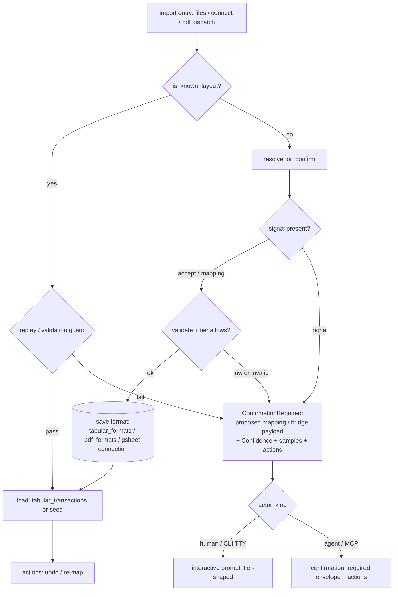

# Feature: Smart Import — Confirmation & Confidence Contract

> Last updated: 2026-05-24 — initial draft from brainstorm.
> Companions: [`smart-import-overview.md`](smart-import-overview.md) (umbrella; this spec realizes the deferred `import_confirm` tool and the "no silent failure" success criterion), [`smart-import-tabular.md`](smart-import-tabular.md) (column-mapping engine `map_columns`; this spec adds the confirm gate the tabular Goal already promised), [`smart-import-pdf.md`](smart-import-pdf.md) (PDF extraction + bridge; **consumes this spec's contract** instead of re-deriving `import_confirm`), [`connect-gsheet.md`](connect-gsheet.md) (gsheet connect/reconnect confidence gates; aligned to the shared bands here), [`surface-design.md`](../../.claude/rules/surface-design.md) (operation-shape taxonomy; the `_confirm` verb), [`moneybin-mcp.md`](moneybin-mcp.md) / [`moneybin-cli.md`](moneybin-cli.md) (surface specs), [`moneybin-capabilities.md`](moneybin-capabilities.md) (capability map), [`data-recovery-contract.md`](data-recovery-contract.md) (audit-log undo, the recovery counterweight).

## Status
<!-- draft | ready | in-progress | implemented -->
draft

## Goal

Make "confirm the columns before they land" a single, coherent trust step shared by
every smart-import channel — tabular (CSV/TSV/Excel/Parquet), Google Sheets, and PDF.
Today each channel detects a column mapping with the same engine but treats the result
differently: tabular waves a medium-confidence guess through with a log warning, gsheet
blocks medium until `--yes`, and PDF (landing separately) carries a third, continuous
confidence model inherited from the cut W-2 extractor. This spec replaces those three
divergent behaviors with **one confidence contract and one confirm flow**, so a user or
agent gets the same trust guarantee regardless of where the file came from:

> **Nothing lands unconfirmed on first contact; a confirmed layout is reused silently;
> recovery from a wrong guess is one obvious step away.**

This spec is the **source of truth** for the shared confirm contract: the confidence
representation, the `import_confirm` tool signature, and the channel-agnostic
`resolve_or_confirm` service primitive. `smart-import-pdf.md` is amended to reference it
(see [Cross-spec amendments](#cross-spec-amendments)); the PDF extractor still ships
first, implementing this shared shape rather than a PDF-only one.

## Background

- [`smart-import-overview.md`](smart-import-overview.md) — the umbrella already named
  an `import_confirm` MCP tool and a propose→review→confirm wizard as v1 surface
  (Resolved questions, "MCP Apps wizard timing"), and lists "No silent failures" /
  "Graceful degradation" as success criteria. Both were deferred when the magic-first
  flow shipped. This spec realizes them.
- [`smart-import-tabular.md`](smart-import-tabular.md) — its Goal states the engine
  "presents it for confirmation, and saves the result for next time." The save-format
  half shipped (`app.tabular_formats`); the **present-for-confirmation half did not** —
  only an opt-in, read-only `moneybin import preview` exists. This spec closes that
  spec-vs-code drift and reuses `map_columns` unchanged underneath the new contract.
- [`smart-import-pdf.md`](smart-import-pdf.md) — `ready`, ships first. It assumes
  `import_preview` → `import_confirm` and "matching the tabular confirm flow," and its
  **bridge rung** has the driving agent hand back a recipe + extracted rows — a genuine
  data-carrying confirmation that cannot collapse into a flag. That requirement is what
  makes `import_confirm` (a `_confirm`-shaped tool) the right cross-channel primitive,
  not a tabular-only convenience.
- [`connect-gsheet.md`](connect-gsheet.md) — already the most evolved confirm story:
  `connect` detects, gates on confidence (`--yes` / `--column-mapping`), pins a
  per-connection mapping, and refuses on drift. It keeps its `connect`/`reconnect`
  lifecycle verbs; only its confidence policy aligns to the shared bands here.
- [`surface-design.md`](../../.claude/rules/surface-design.md) — the `_confirm` verb
  (added in #221) is defined for "accept or override an interactively-presented proposal
  (terminal step of a propose→review→confirm workflow)," with `import_confirm` as its
  example. Distinct from `_commit` (finalize externally-decided proposals, e.g.
  `transactions_categorize_commit`): with `_confirm`, MoneyBin proposes the mapping and
  the caller accepts or overrides it — we propose, they ratify.
- [`data-recovery-contract.md`](data-recovery-contract.md) — the audit-log undo
  consumer (`system_audit_undo` / `history` / `get`) makes every audited `app.*`
  mutation reversible. Format saves and PDF recipe versions route through it; this is
  the recovery counterweight that lets agent autonomy be generous.

### Design rationale (decisions made during brainstorm)

| Decision | Reason |
|---|---|
| **The format is the unit of trust, not the file** | Confirmation attaches to a *layout* (header signature / layout fingerprint + mapping + conventions), confirmed once and reused silently. Confirm count scales with distinct layouts, not files — honors the umbrella's "tenth import is easier" mastery curve. gsheet (per-connection pin) and tabular/PDF (saved format) already work this way. |
| **First encounter of a new layout always confirms** | Upholds the umbrella's "never imported but wrong." Confidence decides *who* satisfies the confirm and *how cheap* the prompt is — never *whether* a confirm step exists. |
| **Confidence shapes ergonomics, not whether-to-confirm** | `high` → one-step accept; `medium` → flagged fields to eyeball; `low` → must supply the missing required fields. The engine already computes this signal; wasting it (advisory-only) was rejected. |
| **One confidence contract across all three channels** | The headline coherence fix. Categorical `high/med/low` (tabular/gsheet) and continuous `0.7·required + 0.3·important` (PDF, ex-W-2) are unified into a normalized `score ∈ [0,1]` + derived `tier`. The score drives gating math; the tier drives ergonomics + autonomy. |
| **Gate (`import_files`) and confirm (`import_confirm`) compose** | `import_files` stays the entry/fast-path and *detects* the gate; `import_confirm` is the data-carrying confirm step. Not either/or — the gated-establish ergonomics and the propose→confirm pair are the same workflow with two tools. Revives the originally-specced `import_confirm`. |
| **gsheet keeps `connect`/`reconnect`** | They are `_connect`-family lifecycle verbs (establish a live binding), distinct from `import_*` (one-shot file). Coherence is the shared confidence contract + `resolve_or_confirm` primitive underneath, not identical tool names (functional parity, per project convention). |
| **Generous autonomy paid for by visible recovery** | Tiered agent autonomy (self-accept `high`) is the target, but ships **gated behind calibration** — we don't trust "high = auto-accept" until measured. The counterweight is recovery made obvious: every confirmed new-format import surfaces undo + re-map as `actions[]`. |
| **`medium` gates on every channel** | Tabular's current "wave through with a log warning" is the odd one out and becomes a gate, matching gsheet. A behavior change to a shipped surface, justified by coherence. |
| **Override is partial-merge, not whole-map** | A correction supplies only the fields it changes, merged over the detected mapping. Unifies tabular's per-field `--override` with gsheet's whole-map `--column-mapping` (coherence fix for gsheet). |

## Requirements

### Confidence contract

1. **Uniform `Confidence` value.** Every detection — column mapping (tabular/gsheet) or
   extraction (PDF) — emits a `Confidence`: a normalized `score: float ∈ [0,1]`, a
   derived `tier: "high" | "medium" | "low"`, `flagged: list[str]` (fields matched
   weakly / needing a human glance), and `missing_required: list[str]` (required
   destination fields not resolved). The *inputs* differ per channel; the *output
   contract* and everything built on it are identical.
2. **Tier derived from score via shared bands.** `tier = high if score ≥ T_high; medium
   if score ≥ T_med; else low`. Defaults `T_high = 0.90`, `T_med = 0.70` (PDF's
   inherited `0.70` threshold becomes `T_med`). Bands are config
   (`settings.import.confidence.t_high` / `t_med`), not hardcoded, and are
   calibration-validated (Requirement 12).
3. **Channel scorers feed the contract.**
   - **tabular/gsheet** — `map_columns` today returns a bare tier; it is refactored to
     compute a `score` (header-alias matches weigh full, content-fallback matches weigh
     partial, missing required fields drive toward 0) and band it. Existing tier
     consumers keep working.
   - **PDF** — the `0.7·required_completeness + 0.3·important_completeness` formula
     already yields `[0,1]`; it slots in as the `score` directly.
4. **`low` is unresolvable without explicit input.** A `low` result can never be
   auto-accepted by anyone (human or agent); it requires an explicit mapping/recipe
   that fills `missing_required`.

### Confirm flow (shared across channels)

5. **First encounter always confirms.** When a layout is not recognized (no
   header-signature / fingerprint / connection match), the import does **not** load
   data. `import_files` returns `status="confirmation_required"` carrying the proposed
   mapping (or PDF bridge payload), the `Confidence`, sample values, and `actions[]`
   pointing at `import_confirm`.
6. **Known layouts reuse silently.** A recognized layout loads with no prompt
   (subject to the replay/validation guard, Requirement 9).
7. **`import_confirm` is the confirm step.** It accepts the channel-appropriate payload —
   `mapping={…}` / `accept=true` for tabular/gsheet, `recipe={…}, rows=[…]` for the PDF
   bridge — validates it, saves the format, and loads. It is the terminal `_confirm` step
   of the propose→review→confirm workflow.
8. **Override is partial-merge.** A supplied `mapping` overrides only the named
   destination fields; unspecified fields fall back to the detected mapping. Validation
   (reusing gsheet's `_validate_*_column_mapping`, generalized) rejects a mapping missing
   a required destination field or naming a source column absent from the file, with a
   message that names the offending field.
9. **A known format can still fail validation and re-surface.** Reuse, not just first
   contact, is guarded: tabular's running-balance / sign checks and PDF's balance
   reconciliation can fail on a recognized layout. On failure the import does not load
   silently — it re-enters the confirm flow (PDF: re-escalates to the bridge per its
   spec; tabular: surfaces `confirmation_required` with the failing signal).

### Agent autonomy & recovery

10. **Tiered autonomy, calibration-gated.** Target behavior: via MCP, an agent MAY
    self-accept a `high`-tier first encounter; `medium`/`low` MUST be surfaced to the
    human. This is **disabled until calibration** (Requirement 12) proves the `high`
    band earns it; until then the agent surfaces every tier to the human. The CLI human
    path always shows a prompt on first encounter regardless of tier (the prompt is just
    one keystroke at `high`). "Always confirm" means a confirm *step* always exists; the
    tier + calibration decide who satisfies it.
11. **Recovery is a first-class, surfaced step.** Every confirmed new-format import
    returns `actions[]` with the concrete recovery paths: undo the data load
    (`import_revert <import_id>`), undo the format save / PDF recipe-version bump
    (`system_audit_undo <operation_id>` per `data-recovery-contract.md`), and **re-map**
    (re-call `import_confirm` with a corrected `mapping`). On a detection/transform
    error, "re-run with an explicit mapping" is offered as the next action, never a dead
    end (umbrella "graceful degradation").

### Calibration

12. **Ship gate on `high` precision.** Build a fixture corpus (YAML per project
    convention) of real-world layouts per channel with known-correct mappings — the
    existing migration formats (Tiller/Mint/YNAB/Maybe), a spread of bank CSVs, and the
    PDF spec's fixture statements. Measure **per-tier field-exact precision**: of
    mappings the engine calls `high`, what fraction match ground truth exactly. The
    `high` band (`T_high`) is set so its precision clears a bar (proposal: ≥ 0.99
    field-exact on the corpus; the number is tuned to the data). Tiered agent
    self-accept (Requirement 10) flips on only when that bar is met and locked by a
    test; until then it stays off.

## Confidence contract (detail)

```python
# moneybin/extractors/confidence.py  (new, channel-agnostic)
Tier = Literal["high", "medium", "low"]

@dataclass(frozen=True)
class Confidence:
    score: float                  # normalized [0, 1]
    tier: Tier                    # derived via shared bands
    flagged: list[str]            # weakly-matched fields (eyeball these)
    missing_required: list[str]   # required dest fields not resolved

def tier_for(score: float, *, t_high: float, t_med: float) -> Tier: ...
```

The seam is deliberate: a channel produces `score` from whatever signal it has, then
`tier_for` bands it once, centrally. Nothing downstream — gating, prompt ergonomics,
agent autonomy — branches on a channel; it branches on the `Confidence` contract. This
is what "coherent confidence story" means concretely.

## Architecture

The reason the three channels diverged is duplicated gate logic:
`import_service._import_tabular` and `connection_service.connect` each hand-rolled their
confidence handling. The fix is one channel-agnostic resolver both call (and PDF dispatch
calls), sitting above the shared `map_columns` / PDF extractor.

```python
# moneybin/services/import_confirmation.py  (new)
def resolve_or_confirm(
    *,
    confidence: Confidence,
    proposed: ProposedMapping | BridgePayload,
    is_known_layout: bool,         # channel does its own signature/fingerprint/connection lookup
    signal: Accept | Override | None,
    self_accept_enabled: bool,     # calibration gate (Req 12)
    actor_kind: Literal["human", "agent"],
) -> Resolved | ConfirmationRequired: ...
```



- `is_known_layout` is computed per channel (tabular: header-signature match against
  saved formats; PDF: `app.pdf_formats` fingerprint; gsheet: an existing connection),
  keeping the primitive channel-agnostic.
- `Resolved` carries the final mapping + saved-format reference; `ConfirmationRequired`
  carries the proposed mapping/bridge payload, `Confidence`, and samples.

## Surface Design

Per [`surface-design.md`](../../.claude/rules/surface-design.md): **no new operation
shapes or verbs.** The confirm flow is the existing `import_*` family plus the revived
`import_confirm`.

| Tool / command | Shape | Role |
|---|---|---|
| `import_files(paths, …)` | Shape 3 (discrete event) | Entry + fast-path. Known layout → load. Unknown → `confirmation_required` (no data loaded) with `actions[]` → `import_confirm`. |
| `import_preview(file)` | Shape 5 (read-projection) | Read-only inspect: proposed mapping, `Confidence`, samples, unmapped columns. For PDF, also emits the bridge payload (IR / page image + extraction request). |
| `import_confirm(file, mapping?/accept?/recipe?/rows?, save_format=true)` | Shape 3, `_confirm` | Accept or override the proposed mapping/recipe: validate → save format → load. The single net-new surface element is the channel-varying payload. |
| `import_formats(type?)` | Shape 5 | List learned formats (tabular + pdf). |
| `gsheet_connect` / `gsheet_reconnect` | `_connect` lifecycle | Keep their inline `--yes` / `--column-mapping`; share the confidence bands + `resolve_or_confirm` primitive underneath. |

**CLI (human, TTY).** `import files X` on a new layout prints the mapping + sample rows +
flagged fields and prompts `[Y / edit / n]` (tier shapes the default: `high` → `[Y/n]`,
`low` → must `edit`). `edit` corrects individual fields (partial-merge). Non-TTY or
`--output json` returns the `confirmation_required` envelope; the caller re-runs with
`--confirm` / `--mapping field=col,…` (non-interactive parity per `cli.md`).

**MCP (agent).** `import_files` returns the `confirmation_required` envelope; the agent
inspects (optionally `import_preview`), then calls `import_confirm`. After confirming,
`actions[]` carries the undo + re-map hints (Requirement 11). Sensitivity tiers and
envelope shape per `mcp.md` — the proposed mapping and samples are row-shaped
(`medium`), counts/tiers are `low`.

## Observability

Per `observability.md` and `src/moneybin/metrics/registry.py` (counts / IDs / status
only — no PII):

| Metric | Type | Purpose |
|---|---|---|
| `import_confirmations_total{channel,tier,outcome}` | counter | First-encounter confirms by channel, tier, and `outcome` (`accepted`/`overridden`/`declined`). |
| `import_detection_score` | histogram | Distribution of the normalized confidence score; the primary calibration-tuning signal. |
| `import_self_accept_total{channel}` | counter | Agent self-accepts at `high` (zero until the calibration gate opens). |
| `import_override_total{channel}` | counter | Confirms that supplied a mapping override — high values flag weak detection on a layout. |
| `import_known_format_reuse_total{channel}` | counter | Silent reuses of a confirmed layout. The mastery-curve KPI. |
| `import_revalidation_failure_total{channel}` | counter | Known layout that failed the replay/validation guard and re-surfaced (Req 9). |

(PDF's own extraction metrics — `pdf_recipe_hit_total`, `pdf_bridge_escalation_total`,
etc. — stay in `smart-import-pdf.md`; the table above is the cross-channel confirm layer.)

## Data Model

Mostly reuse — the confidence contract is a code-level type, not a table.

- **No new tables.** Confirmation state lives in the existing learned-format stores:
  `app.tabular_formats`, `app.pdf_formats` (created by the PDF spec), and the gsheet
  connection row.
- **Possible additive column (deferred):** persisting the confidence score at save time
  on `app.tabular_formats` / `app.pdf_formats` (`detected_confidence DECIMAL`) would let
  `import_formats` show how a saved format was originally vetted. Out of scope for v1
  unless calibration shows it's needed; called out so a future additive migration has a
  home.
- **Config:** `settings.import.confidence.t_high` / `t_med` (band thresholds);
  `settings.import.self_accept_high` (calibration gate, default `false`).

## Implementation Plan

Sequencing note: PDF ships first and **implements this contract** — so the shared pieces
(`Confidence`, `resolve_or_confirm`, `import_confirm`) land with or before the PDF
extractor, and tabular/gsheet adopt them in this spec's work.

### Files to create
- `src/moneybin/extractors/confidence.py` — `Confidence`, `Tier`, `tier_for`.
- `src/moneybin/services/import_confirmation.py` — `resolve_or_confirm`, `Resolved` /
  `ConfirmationRequired`, generalized mapping validation (lifted from gsheet's
  `_validate_transactions_column_mapping`).
- `tests/moneybin/test_import_confirmation/` — primitive unit tests + the calibration
  harness + fixture corpus (YAML).

### Files to modify
- `src/moneybin/extractors/tabular/column_mapper.py` — `map_columns` computes a `score`
  and returns a `Confidence` (keep `confidence` tier for back-compat consumers).
- `src/moneybin/services/import_service.py` — `_import_tabular` routes through
  `resolve_or_confirm`; **`medium` now gates** (remove the wave-through warning);
  partial-merge override; emit `confirmation_required` from `import_file(s)`.
- `src/moneybin/connectors/gsheet/connection_service.py` — `connect`/`reconnect` adopt
  the shared bands + `resolve_or_confirm`; keep inline `--yes`/`--column-mapping`.
- `src/moneybin/mcp/tools/import_tools.py` — add `import_confirm`; `import_files` returns
  the `confirmation_required` state; `actions[]` recovery hints.
- `src/moneybin/cli/commands/import_cmd.py` — interactive first-encounter prompt + flag
  parity (`--confirm`, partial `--mapping`); `import confirm` subcommand.
- `src/moneybin/config.py` — confidence band + self-accept settings.
- `src/moneybin/metrics/registry.py` — the metrics above.

### Cross-spec amendments
- **`smart-import-pdf.md` (#221)** — replace its self-contained `import_confirm` /
  confidence prose with a reference to this spec as the contract owner; its bridge
  payload remains PDF-specific.
- **`smart-import-overview.md`** — mark the deferred `import_confirm` / "no silent
  failure" items as owned here.
- **`smart-import-tabular.md`** — note the present-for-confirmation half is realized
  here; `medium` now gates.
- **`connect-gsheet.md`** — note the confidence policy is aligned to the shared bands.
- **`moneybin-mcp.md` + `moneybin-cli.md` + `moneybin-capabilities.md`** — register
  `import_confirm` and the `import_files` confirmation-required state (per the
  surface-change-discipline rule).
- **`.claude/rules/surface-design.md`** — the `_confirm` verb is already in place (#221);
  record the gated-establish (`import_files`) + `_confirm` (`import_confirm`) pairing as
  the canonical confirm shape, and resolve the standing `confirm`-vs-`_commit` overlap
  in favor of `_confirm` for system-proposed-then-ratified flows.

## Testing Strategy

- **Unit:** `tier_for` banding; `resolve_or_confirm` across the matrix (known/unknown ×
  tier × signal × actor_kind × self_accept_enabled); partial-merge validation
  (missing-required, unknown-source rejections).
- **Calibration harness:** per-tier field-exact precision over the YAML corpus; a test
  asserts the chosen `T_high` meets the precision bar and that `self_accept_high`
  defaults off until it does.
- **Channel integration:** tabular `medium` now gates (regression — was a wave-through);
  gsheet medium/low behavior unchanged under the shared bands; PDF bridge confirm via
  `import_confirm` persists the format and loads (faked agent response, no real LLM).
- **Recovery:** confirmed import → `import_revert` removes rows; `system_audit_undo`
  reverses the format save; re-map via second `import_confirm` re-pins cleanly.
- **CLI/MCP parity:** the `confirmation_required` envelope is identical shape on both
  surfaces; `--confirm` / `--mapping` reproduce the interactive accept/override.

## Out of Scope

- **Interactive MCP wizard (MCP Apps).** Phase 2 per the overview; v1 is the tool-level
  propose→confirm exchange.
- **Per-field confidence in the contract.** v1 confidence is per-detection (one score +
  flagged-field list), not a score per column. Revisit if calibration needs it.
- **Persisting confidence at save time** — deferred additive column (see Data Model).
- **PDF extraction internals** (IR, recipe executor, bridge, reconciliation) — owned by
  `smart-import-pdf.md`; this spec owns only the confirm/confidence seam it plugs into.
- **A "trust this source forever" mode** — first encounter always confirms; no global
  auto-accept toggle in v1 (consistent with the privacy spec's posture).

## Open Questions

1. **`T_high` / `T_med` defaults** — `0.90` / `0.70` are proposals; the corpus sets the
   real `T_high` against the precision bar (Requirement 12). Resolve during calibration.
2. **Score formula for `map_columns`** — how to weight header-alias vs content-fallback
   matches and missing-required penalties so the resulting score bands sensibly against
   the same thresholds PDF uses. Resolve against the fixture corpus; does not block
   `draft → ready`.
3. **gsheet `reconnect` re-confirm cadence** — a medium-confidence remap already
   requires `--yes`; confirm that aligning to shared bands doesn't loosen its current
   strict-drift refusal. Verify against `connect-gsheet.md` drift requirements.
