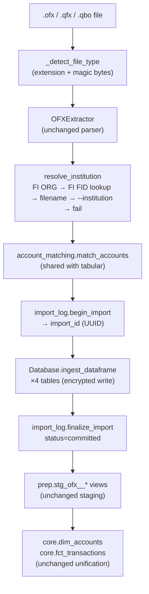

# Feature: Smart Financial-Format Import (OFX/QFX/QBO Parity)

> Companions: [`smart-import-tabular.md`](smart-import-tabular.md) (architectural sibling), [`smart-import-overview.md`](smart-import-overview.md) (umbrella), [`matching-overview.md`](matching-overview.md) (provenance contract), [`identifiers.md`](../../.claude/rules/identifiers.md) (FITID = source-provided ID), [`data-extraction.md`](../../.claude/rules/data-extraction.md) (parameter design), [`database-migration.md`](database-migration.md) (schema migration system), [`observability.md`](observability.md) (metrics).
>
> Supersedes [`archived/ofx-import.md`](archived/ofx-import.md) (the original 2024-vintage spec, now archived as superseded).

## Status
<!-- draft | ready | in-progress | implemented -->
implemented

## Goal

Bring the OFX/QFX/QBO import path to the same maturity as `smart-import-tabular.md`: shared import-batch infrastructure, reversible imports, unified account matching, encrypted writes through `ingest_dataframe()`, confidence-tiered UX, comprehensive scenario coverage, and formalized QBO support. After this spec ships, every supported file format participates in the same import contract — there is no second-class lineage.

## Background

OFX was MoneyBin's first import format and predates the smart-import architecture. The shipped extractor (`src/moneybin/extractors/ofx_extractor.py`, 441 lines) parses correctly and the staging models already register `source_type='ofx'` so OFX rows participate in dedup and the matching engine. But the loader (`src/moneybin/loaders/ofx_loader.py`, 175 lines) bypasses the contracts that tabular adopted later: it doesn't go through `Database.ingest_dataframe()`, doesn't write to `raw.import_log`, can't be reverted, and resolves accounts via its own `_extract_accounts` path instead of `account_matching.py`. The original OFX spec (101 lines, archived) reflects that early scope and is well below the depth of `smart-import-tabular.md` (1807 lines).

This spec closes the gap. It does **not** unify the raw schema — `raw.ofx_*` legitimately carries structure that `raw.tabular_*` does not (statement balances, institution metadata, multi-account-per-file). Instead, it lifts the cross-cutting capabilities into a shared import-log primitive that both lineages call.

### Reference material

- `archived/ofx-import.md` — the spec this replaces; historical reference only.
- `smart-import-tabular.md` §"Import batches", §"`ingest_dataframe()`", §"Account matching" — the patterns this spec adopts for OFX.
- `matching-overview.md` — defines `source_type` taxonomy and cross-source dedup; OFX already participates but reverting and import-batch identity were missing.
- `.claude/rules/identifiers.md` — FITID is the canonical Priority-1 source-provided ID example. The current extractor stores it as `source_transaction_id` correctly.
- `.claude/rules/data-extraction.md` — parameter design rule that makes the current `institution_name` override non-conformant; this spec corrects it.
- `database-migration.md` — schema migration system used to add the new columns to `raw.ofx_*`.

### Why not unify into a single raw lineage?

OFX files carry four entity types in one document (institutions, accounts, balances, transactions) with statement-level metadata that tabular files do not. Collapsing into `raw.tabular_*` would either drop information (balances, institution FIDs) or require sidecar tables that re-introduce a second lineage in all but name. Keeping `raw.ofx_*` and lifting only the *contract* is the smaller, more honest change.

---

## Requirements

1. Import OFX, QFX, and QBO files through a single extractor pipeline. QBO is OFX 1.x SGML; no separate parser.
2. Auto-detect file format from extension and from magic-byte content sniffing (`OFXHEADER:` or `<?xml...><OFX>`). Misnamed files route correctly.
3. Resolve institution name from the file (`<FI><ORG>` → `<FI><FID>` lookup → filename heuristic) before falling back to user input.
4. In non-interactive mode, fail fast with an actionable error when institution cannot be derived; surface `--institution <name>` as the override flag.
5. Resolve accounts via `account_matching.py` against `core.dim_accounts`. New accounts are auto-created only when matching fails *and* file confidence is high (file has both `<FI><FID>` and account number).
6. Every import creates a `raw.import_log` row with a UUID `import_id` and lifecycle status (`pending` → `committed` | `reverted` | `failed`).
7. Re-importing an already-committed file is rejected with an actionable error unless `--force` is passed. Today's silent overwrite behavior is replaced with explicit duplicate detection.
8. `import revert <id>` deletes all rows from `raw.ofx_*` tables tagged with the given `import_id` and updates the log row's status.
9. All raw writes go through `Database.ingest_dataframe()` — the encrypted single write path. The bespoke `OFXLoader.load_data()` is removed.
10. The `--institution` parameter follows override-when-missing semantics: consulted only when steps 1–3 of the resolution chain yield nothing. If the file provides institution metadata, the file wins and the flag is logged as ignored.
11. OFX imports emit Prometheus metrics for batch counts, durations, and row counts, paralleling the tabular metrics in `metrics/registry.py`.
12. Extracted data preserves the existing `source_transaction_id` semantics (FITID), and the matching engine continues to use it for cross-source dedup against tabular and Plaid.
13. Scenario test coverage exists for: single-account, multi-account, QBO from Intuit, QBO from a bank, re-import idempotency, missing-institution-metadata fallback, and cross-source dedup against tabular.
14. The synthetic data generator emits OFX *and* QBO variants for scenario fixtures.
15. The CLI and MCP `import_file` surfaces gain no new flags beyond `--institution`. Detection, resolution, and the import-log lifecycle happen automatically.

---

## Architecture

### Pipeline shape after the change



### Import contract (shared between OFX and tabular)

| Capability | Provided by | Consumed by |
|---|---|---|
| Batch lifecycle (`begin`, `finalize`, `revert`, `history`) | `loaders/import_log.py` (new module) | `_import_ofx`, `_import_tabular` |
| Encrypted raw write | `Database.ingest_dataframe()` (existing) | both pipelines |
| Account resolution | `extractors/tabular/account_matching.py` (existing; renamed/relocated as needed) | both pipelines |
| Source-provided ID semantics | per-format extractor (FITID for OFX; institution ID or content hash for tabular) | matching engine |
| `source_type` registration | per-format staging view | matching engine, dedup, transfer detection |
| Metrics | `metrics/registry.py` (existing pattern) | observability |

OFX retains `raw.ofx_*` as its raw schema; tabular retains `raw.tabular_*`. Both schemas now carry `import_id`, `source_type`, and `source_origin`.

---

## Data Model

### `raw.ofx_transactions` — column additions

```sql
ALTER TABLE raw.ofx_transactions ADD COLUMN import_id VARCHAR;
ALTER TABLE raw.ofx_transactions ADD COLUMN source_type VARCHAR DEFAULT 'ofx';
ALTER TABLE raw.ofx_transactions ADD COLUMN source_origin VARCHAR;
-- existing: source_transaction_id (FITID), account_id, amount, date_posted, payee, memo, ...
```

`transaction_id` for downstream identity is computed as `f"{account_id}:{source_transaction_id}"` per `identifiers.md` Priority-1. This is already how the staging view materializes downstream IDs; no change to that logic.

### `raw.ofx_accounts`, `raw.ofx_balances`, `raw.ofx_institutions` — column additions

```sql
ALTER TABLE raw.ofx_accounts ADD COLUMN import_id VARCHAR;
ALTER TABLE raw.ofx_accounts ADD COLUMN source_type VARCHAR DEFAULT 'ofx';

ALTER TABLE raw.ofx_balances ADD COLUMN import_id VARCHAR;
ALTER TABLE raw.ofx_balances ADD COLUMN source_type VARCHAR DEFAULT 'ofx';

ALTER TABLE raw.ofx_institutions ADD COLUMN import_id VARCHAR;
ALTER TABLE raw.ofx_institutions ADD COLUMN source_type VARCHAR DEFAULT 'ofx';
```

Balances and institutions don't need `source_origin` — institution itself is the origin and balances inherit from their account.

### `raw.import_log` — no schema change

The existing tabular `import_log` table is already format-agnostic. OFX simply starts writing rows with `source_type='ofx'`. The columns (`import_id`, `source_file`, `source_type`, `source_origin`, `status`, `started_at`, `finalized_at`, `row_counts`) cover OFX needs without change.

### Staging view updates

`prep.stg_ofx__transactions`, `prep.stg_ofx__accounts`, `prep.stg_ofx__balances`, `prep.stg_ofx__institutions` — each gains `import_id`, `source_type`, and (where applicable) `source_origin` in the projection. No semantic changes to existing columns.

### Backfill policy

Legacy rows imported before this change have `import_id = NULL`. They appear in `import history` as "pre-batch-tracking" entries (matching how tabular handled the same transition). They cannot be reverted via `import revert`; users delete them by truncating or by import_log-aware migration if needed. No automatic backfill — manufacturing fake batch IDs would obscure history.

---

## Implementation Plan

### File-level changes

**Modify:**
- `src/moneybin/sql/schema/raw_ofx_*.sql` — add new columns to DDL.
- `src/moneybin/extractors/ofx_extractor.py` — populate new columns in extracted DataFrames; remove `institution_name` parameter (replaced by resolution chain).
- `src/moneybin/services/import_service.py` — `_import_ofx` orchestrates resolve → batch → write → finalize; `_detect_file_type` adds `.qbo` and magic-byte sniffing.
- `src/moneybin/utils/file.py` — `copy_to_raw()` accepts `qbo` (lands in `data/raw/ofx/`).
- `src/moneybin/loaders/tabular_loader.py` — call sites for batch lifecycle migrate to `import_log` module; tabular-specific code stays.
- `src/moneybin/cli/commands/import_cmd.py` — `--institution` flag changes contract (override-when-missing); `import revert` learns OFX dispatch.
- `src/moneybin/mcp/tools/import_tools.py` — `import_file` MCP tool reflects new `institution` semantics.
- `src/moneybin/metrics/registry.py` — add `moneybin_ofx_import_*` metric counterparts.
- `src/moneybin/testing/synthetic/models.py` — extend `source_type` literal as needed for QBO scenarios.
- `src/moneybin/testing/synthetic/writer.py` — emit `.qbo` variants when scenarios request them.
- `sqlmesh/models/prep/stg_ofx__*.sql` — surface new columns in staging views.
- `docs/specs/INDEX.md` — register this spec; mark `archived/ofx-import.md` as superseded.
- `README.md` — "What Works Today" section gains QBO + revert support per `shipping.md`.

**Create:**
- `src/moneybin/loaders/import_log.py` — module with `begin_import`, `finalize_import`, `revert_import`, `get_import_history` functions. Source-type-to-tables dispatch hard-coded inside `revert_import`.
- `src/moneybin/sql/migrations/V0XX__ofx_import_batch_columns.py` — schema migration adding the new columns and backfilling `source_type='ofx'` literal on existing rows.
- `tests/scenarios/ofx_single_account_checking/` — and the other six scenarios listed in Testing Strategy.
- `tests/fixtures/ofx/qbo_intuit_*.qbo`, `tests/fixtures/ofx/qbo_bank_*.qbo` — sanitized fixtures.

**Delete:**
- `src/moneybin/loaders/ofx_loader.py` — replaced by `_import_ofx` orchestration over `ingest_dataframe()` + `import_log` module.

### `import_log` module surface

```python
# src/moneybin/loaders/import_log.py


def begin_import(
    db: Database,
    *,
    source_file: str,
    source_type: Literal["tabular", "ofx"],
    source_origin: str,
) -> str:
    """Create an import_log row in 'pending' state. Returns the new import_id (UUID)."""


def finalize_import(
    db: Database,
    import_id: str,
    *,
    status: Literal["committed", "failed"],
    row_counts: dict[str, int],
) -> None:
    """Mark an import as finalized with row counts per raw table."""


def revert_import(db: Database, import_id: str) -> dict[str, str | int]:
    """Delete all rows tagged with import_id from raw tables matching the import's source_type.
    Updates log row to status='reverted'. Returns {'status': ..., 'rows_deleted': N}."""


def get_import_history(
    db: Database,
    *,
    limit: int = 50,
    import_id: str | None = None,
) -> list[dict[str, Any]]:
    """List import_log entries (optionally filtered to a single import_id) with row counts."""
```

`revert_import` uses an explicit `source_type → tables` mapping:

```python
_REVERT_TABLES = {
    "tabular": ["raw.tabular_transactions", "raw.tabular_accounts"],
    "ofx": [
        "raw.ofx_transactions",
        "raw.ofx_accounts",
        "raw.ofx_balances",
        "raw.ofx_institutions",
    ],
}
```

This is an allowlist (per `.claude/rules/security.md` — table identifiers must be validated against a known set before SQL interpolation). Adding a future format (PDF, etc.) requires extending this mapping deliberately.

### Institution resolution chain

Implemented as a small function in `ofx_extractor.py` or a new `extractors/institution_resolution.py`:

```python
def resolve_institution(
    parsed_ofx: Any,
    file_path: Path,
    cli_override: str | None,
    *,
    interactive: bool,
) -> str:
    """Resolve institution slug via:
    1. parsed_ofx.fi.org
    2. parsed_ofx.fi.fid → lookup table (small static dict of known FID → slug)
    3. filename heuristic (regex against known patterns)
    4. cli_override (only consulted if 1-3 yield nothing)
    5. interactive prompt (only if interactive=True)
    Raises InstitutionResolutionError if all chains fail in non-interactive mode."""
```

The static FID lookup starts small (5–10 well-known institutions) and grows via PR contributions. Unknown FIDs fall through to the next step.

### Magic-byte detection

In `_detect_file_type`:

```python
def _sniff_ofx(content: bytes) -> bool:
    head = content[:512].lstrip()
    return head.startswith(b"OFXHEADER:") or (
        head.startswith(b"<?xml") and b"<OFX>" in content[:1024]
    )
```

Routes any file (regardless of extension) to the OFX pipeline if the signature matches. Extension is consulted first as a fast path.

### Key decisions

- **Keep `raw.ofx_*` as a distinct schema.** Don't collapse into `raw.tabular_*`. Rationale in Background.
- **Module-level functions, not a service class, for import-log.** Three functions over one table is a primitive, not a domain. Matches `account_matching.py` organization.
- **Hard-coded `source_type → tables` mapping in `revert_import`.** Allowlist over runtime catalog query: simpler, explicit, and adding new formats is rare and deliberate.
- **No automatic backfill of `import_id` for legacy rows.** Synthesizing batch IDs for un-tracked imports would obscure history; leave them as `NULL` and surface as pre-batch-tracking entries.
- **Re-import behavior change is a breaking change worth flagging.** Today's silent overwrite becomes explicit duplicate rejection (with `--force` opt-out). Documented in CHANGELOG and release notes.
- **`--institution` semantics flip from default-provider to override-when-missing.** Aligns with `data-extraction.md` "don't expose options for extractor-derivable fields" while preserving a non-interactive escape hatch.

---

## CLI Interface

No new commands. Behavior changes only:

```bash
# Basic import — no --institution needed; resolved from file
moneybin import ~/Downloads/wells_fargo_2025.qfx

# QBO works through the same command
moneybin import ~/Downloads/intuit_export.qbo

# Override only when the file lacks <FI><ORG> and FID lookup fails
moneybin import ~/Downloads/anonymous.ofx --institution "Local Credit Union"

# Re-importing the same file is rejected
moneybin import ~/Downloads/wells_fargo_2025.qfx
# → Error: file already imported (import_id abc12345...). Use --force to re-import.

# Force re-import (creates a new batch; previous batch stays unless reverted)
moneybin import ~/Downloads/wells_fargo_2025.qfx --force

# History and revert work for OFX batches
moneybin import history --limit 10
moneybin import revert abc12345-...
```

Removed: `moneybin data extract ofx ...` (the legacy command path). Replaced by the unified `moneybin import` golden path per `cli-restructure.md`. The legacy command is already aliased; this spec finalizes its removal.

## MCP Interface

`import_file` tool — existing tool gains:
- Optional `institution: str | None` parameter (override-when-missing semantics).
- Returns `import_id` in the response so AI conversations can reference and revert.
- Errors surface "institution could not be derived" with structured fields the prompt template can use to ask the user.

`import_history` and `import_revert` tools — already exist for tabular; gain OFX support automatically via the shared `import_log` module.

No new tools.

---

## Testing Strategy

### Unit tests
- `OFXExtractor` parsing: existing tests stay; add fixtures for QBO (Intuit + bank exports).
- Magic-byte detection: round-trip tests for renamed/extension-less files.
- Institution resolution chain: each fallback step in isolation; non-interactive failure path.
- `import_log` module: each function against an in-memory DuckDB.

### Integration tests
- `_import_ofx` end-to-end: import → assert rows in all four `raw.ofx_*` tables with `import_id` populated → assert `core.fct_transactions` row count matches → revert → assert rows gone and `import_log.status='reverted'`.
- Re-import rejection: same file twice without `--force` raises; with `--force` creates a second batch.
- Cross-source dedup: same transactions imported via OFX and tabular yield one merged record in `core.fct_transactions` (validates `source_type='ofx'` participation in dedup).

### Scenario tests (`tests/scenarios/`)
- `ofx_single_account_checking` — golden path for one-account QFX.
- `ofx_multi_account_statement` — checking + savings + credit in one file.
- `ofx_qbo_intuit_export` — `.qbo` from QuickBooks export.
- `ofx_qbo_bank_export` — `.qbo` from a bank's "Quicken Web Connect" download.
- `ofx_reimport_idempotent` — same file twice; second import refused without `--force`.
- `ofx_missing_institution_metadata` — file with no `<FI><ORG>`; non-interactive run fails with actionable error; `--institution` override succeeds.
- `ofx_cross_source_dedup` — OFX + tabular variants of the same transactions; matching engine merges them.

Each scenario follows `testing-scenario-comprehensive.md`'s five-tier assertion taxonomy with independent expectations files.

### E2E smoke tests
Existing OFX golden-path test (`e2e-testing.md`) extended to also exercise `import revert` for an OFX batch.

### Fixtures
QBO samples from at least 2 institutions live in `tests/fixtures/ofx/`. Sanitization is hand-done for v1; future runs migrate to `testing-anonymized-data.md` once that ships. YAML expectation files alongside per project convention.

---

## Synthetic Data Requirements

The synthetic generator (`testing-synthetic-data.md`) already emits OFX. Extensions:

- The writer needs a way to emit `.qbo`-extension output (OFX 1.x SGML content). Today `synthetic/models.py` has a `source_type: Literal["ofx", "csv"]` field that doubles as file-format marker for the writer. Note that QBO and OFX share `source_type='ofx'` in the matching taxonomy — they are the same format. The synthetic-layer field is a *file-format* marker, not a taxonomy marker. Implementation can either (a) introduce a separate `file_format` field distinct from taxonomy `source_type`, or (b) extend the existing literal to include `"qbo"` and have the writer treat it as an OFX content variant. Choice deferred to implementation; either is acceptable as long as the matching-taxonomy `source_type` for the resulting rows remains `'ofx'`.
- Scenario fixtures for `ofx_qbo_*` use synthetic data so they remain deterministic and PII-free.

---

## Dependencies

- **Existing**: `ofxparse`, `polars`, `pydantic`, `duckdb`, the encrypted `Database` class, `account_matching.py`, the `import_log` infrastructure currently inside `tabular_loader.py`.
- **No new external dependencies.** QBO is OFX 1.x; the existing parser handles it after extension routing and SGML preprocessing.
- **Coordination**: this spec depends on `2026-04-29-import-service-class.md` (in-flight `ImportService` class refactor). Phase 3 work happens after that plan lands or rebases onto it.

---

## Phasing

Two PRs, sequential, both off branch `feat/smart-import-financial`:

### PR 1 — "Infra parity"

**Scope:**
- Schema migration: add `import_id`, `source_type`, `source_origin` to all four `raw.ofx_*` tables; update staging views.
- Extract `import_log` module from `tabular_loader.py`; migrate tabular call sites to it (pure refactor for tabular).
- Rewrite `ImportService._import_ofx` to use `import_log` + `ingest_dataframe()` + `account_matching.py`. Delete `OFXLoader`.
- Reinstate `--institution` with override-when-missing semantics. Add magic-byte detection.
- Integration tests for the new OFX path; preserve all existing tabular test coverage.

**Verification:** `make check test` passes; existing tabular scenarios pass unchanged; new OFX integration tests pass.

### PR 2 — "Format coverage + ship"

**Scope:**
- `.qbo` extension routing in `_detect_file_type` and `copy_to_raw()`.
- QBO fixtures from 2+ institutions in `tests/fixtures/ofx/`.
- Seven new OFX/QBO scenario tests in `tests/scenarios/`.
- Synthetic data generator emits QBO variants.
- `INDEX.md` updates: this spec → `implemented`; `archived/ofx-import.md` gains a superseded note.
- README "What Works Today" expanded with QBO support and `import revert` for OFX per `shipping.md`.

**Verification:** `make check test test-scenarios` passes; manual `make` run of all seven new scenarios; README accurately reflects shipped capability.

### Why not 1 PR?

PR 2's scenario tests assert behavior that PR 1 introduces (import batches, revert, deterministic re-import). Stacking everything makes any flaky scenario block the entire infra refactor. The split keeps the infra change reviewable on its own and lets format/test work parallelize.

### Why not 3+ PRs?

The original phase 1 (schema) and phase 2 (`import_log` extraction) are ~1 file of changes each and have no standalone value until the OFX rewrite consumes them. Bundling is correct.

---

## Out of Scope

- **QIF support** — legacy Quicken text format. User-confirmed: modern formats only in v1. Defer until requested.
- **IIF support** — QuickBooks Desktop interchange. Tabular-shaped, would route through tabular pipeline if added; not in v1.
- **Investment-account OFX** (`<INVSTMTRS>`) — current extractor handles bank/credit only; investment OFX gates on `investment-tracking.md` and is its own spec.
- **PDF statement import** — covered by `smart-import-pdf.md`.
- **AI-assisted parsing fallback** — covered by `smart-import-ai-parsing.md`.
- **Unifying `raw.ofx_*` and `raw.tabular_*` into a single schema** — explicitly rejected. See Background.
- **Automatic backfill of `import_id` for legacy OFX rows** — explicitly rejected. See Data Model § Backfill policy.
- **Plaid/SimpleFIN sync** — those are sync providers, not file imports; covered by `sync-overview.md`.
