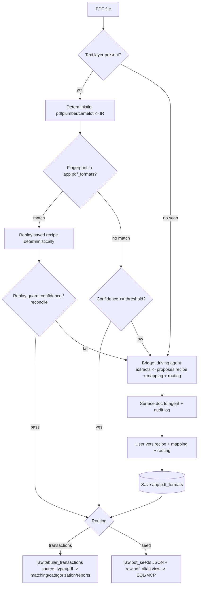

# Feature: Smart Import — PDF (Generic PDF Import)

> Companions: [`smart-import-overview.md`](smart-import-overview.md) (umbrella; this spec fuses Pillar C + the PDF slice of F), [`smart-import-tabular.md`](smart-import-tabular.md) (the pipeline reused once a PDF becomes rows), [`connect-gsheet.md`](connect-gsheet.md) (the seed-adapter pattern reused for the catch-all), [`categorization-cold-start.md`](categorization-cold-start.md) (the **export/apply bridge** pattern reused for LLM extraction), [`privacy-and-ai-trust.md`](privacy-and-ai-trust.md) (AI data-flow tiers — **this spec amends its parsing posture**), [`privacy-data-classification.md`](privacy-data-classification.md) (DataClass + redaction engine), [`matching-overview.md`](matching-overview.md) (`source_type` taxonomy), [`categorization-overview.md`](categorization-overview.md), [`app-integrity-invariant.md`](app-integrity-invariant.md) (audit-paired `app.*` mutations), [`identifiers.md`](../../.claude/rules/identifiers.md), [`surface-design.md`](../../.claude/rules/surface-design.md), [`observability.md`](observability.md), [`moneybin-cli.md`](moneybin-cli.md), [`moneybin-mcp.md`](moneybin-mcp.md).

Successor to the cut W-2 extractor (PR #186), whose removal note named this design directly: *"PDF parsing may be the wrong primitive given LLM PDF parsing capability."* This spec makes PDF a *generic ingestion primitive*, not a per-document bespoke parser.

## Status
<!-- draft | ready | in-progress | implemented -->
ready

## Goal

Turn an arbitrary PDF into one of two outcomes, reusing existing machinery for both:

- **Transaction-shaped → core.** Rows that look like a ledger route through `raw.tabular_transactions` (`source_type='pdf'`) and the full matching / categorization / reporting pipeline — exactly as a CSV would.
- **Everything else → seed.** A document we can't (or shouldn't) map to a financial schema lands in `raw.pdf_seeds` as queryable JSON with an auto-generated typed view per source, available via `sql_query` MCP and `moneybin://schema`. The catch-all escape hatch — "any PDF works to some level." Domain packages (`us_tax`) interpret seeds later.

The only genuinely new code is **PDF → rows extraction + the routing decision.** Extraction is a two-rung ladder: a free, local **deterministic** rung (`pdfplumber`) handles native-text PDFs, and when that can't crack a layout it escalates to the **bridge** — the AI agent the user is *already* driving MoneyBin with (Claude Code, an MCP host) does the extraction and hands structured rows back, the same export/apply pattern cold-start categorization uses. A newly-seen layout is *learned once* into a reusable, deterministic recipe so the next statement from the same issuer replays for free.

## Background

- [`smart-import-overview.md`](smart-import-overview.md) — umbrella. Pillar C (native-text PDF) and Pillar F (AI-assisted parsing) were planned as separate child specs; this spec **fuses them for the PDF case** (one user-facing feature, one import command). Pillar F's separate spec, if written, covers only non-PDF file types.
- [`smart-import-tabular.md`](smart-import-tabular.md) — the five-stage tabular pipeline. Once a PDF is extracted to a DataFrame, the transaction-shaped path is *ordinary tabular import* — detection (where applicable), transform, and load (`ingest_dataframe`) are reused unchanged. New code lives upstream (PDF → rows) and in routing.
- [`connect-gsheet.md`](connect-gsheet.md) — the `seed` adapter (`raw.gsheet_seeds` JSON + auto-generated `raw.gsheet_<alias>` views, schema-discoverable, excluded from curated reports). The PDF seed path is the same pattern over `raw.pdf_seeds`. Its `generate_seed_view_sql` view-builder is **lifted to a shared module** so PDF reuses it without depending on the gsheet connector. **Note its line-54 decision: seeds use plain DuckDB views, NOT SQLMesh `SEED` models** — that holds here too (see Key Decisions).
- [`categorization-cold-start.md`](categorization-cold-start.md) — the **export/apply bridge**: MoneyBin emits a payload for the driving agent to process and applies the agent's structured result back via a CLI/MCP call, with **no in-process LLM call**. PDF's LLM rung *is* this pattern. (This is why no `AIBackend` abstraction is needed in v1 — see Key Decisions.)
- [`privacy-and-ai-trust.md`](privacy-and-ai-trust.md) — defines `smart-import-parsing` flows. This spec **resolves its deferred line-167 question** for PDF extraction and **replaces the parsing "redacted preview" promise** with an honest model: in v1 the only egress is to the agent the user is already using (the bridge), logged and transparent (see Privacy Posture).
- W-2 extractor (archived `w2-extraction.md`, cut in #186) — prior art. Carries forward: **confidence scoring** (`0.7·required + 0.3·important`, threshold 0.7) and **cross-method agreement**; **typed-spine + JSON-tail** storage for variable fields. Discards: bespoke per-form positional parsing, local OCR/pytesseract.
- [`identifiers.md`](../../.claude/rules/identifiers.md) — seed row identity is a content hash (`pdf_` prefix, strategy 2); `app.pdf_formats.name` is a semantic slug (strategy 4).
- [`matching-overview.md`](matching-overview.md) / `.claude/rules/database.md` — `source_type` is the canonical provenance column; add value `'pdf'`. Reconciliation confirms it is an **unconstrained `VARCHAR`** (no CHECK/enum), so adding `'pdf'` needs no migration — exactly how gsheet added `'gsheet'`. Matching/categorization are source-agnostic and pick up PDF transactions with zero changes.

### Design rationale (decisions made during brainstorm)

| Decision | Reason |
|---|---|
| **Deterministic-first; the bridge is the escalation** | Native-text PDFs (~70%+ of bank statements; the dominant self-download case) extract locally and free via `pdfplumber`. The bridge handles only what the deterministic rung can't crack. Matches the umbrella's posture: the local path is free + offline. |
| **LLM is a one-time *recipe generator*, not a per-import parser** | The reusable artifact is a deterministic extraction *recipe* (declarative IR→rows rules), authored via the bridge once and user-vetted, then replayed for free. Without this, every recurring statement re-pays bridge cost and there is no "adaptation." |
| **One normalized intermediate representation (IR)** | `pdfplumber` (text), `camelot` (tables), and the bridge (text or page image) all normalize to a common IR (text spans + table cells + positions). The recipe operates on the IR, not the mechanism — so a saved format is front-end-agnostic and the "two mechanisms can't share a config" problem dissolves. |
| **Bridge-only LLM in v1; no separate `AIBackend`, in-process keys, or `ollama`** | The agent the user is already driving MoneyBin with *is* the LLM. It reads text and scans (vision) natively and returns rows — zero new infrastructure, reusing the cold-start export/apply pattern. A separate `AIBackend` (MoneyBin holding its own keys / making its own outbound calls) is too much surface for this stage. In-process cloud backends and a local-first `ollama` rung are clean additive follow-ups on the same recipe/routing machinery. |
| **Honest egress, not fake redaction** | You cannot reliably redact a document you haven't parsed, and for *extraction* the sensitive values ARE the payload (unlike categorization, which redacts amounts and keeps description shape). So the lever is *controlling where the raw document goes*. In v1 it goes nowhere (deterministic) or to the agent the user already chose (bridge) — never a MoneyBin-initiated third-party send. Replaces the spec's unbacked "redacted preview" for parsing. |
| **Vision in v1 via the bridge; no `pytesseract`** | Scans (~≤30%, upper bound) are read by the driving agent's vision in one step (image→rows). `pytesseract`+`poppler` (the deps #186 deleted) would add system-install friction for a noisier, two-step path serving the smallest slice. A fully-offline-zero-key scan path is a clean additive follow-up. |
| **Reuse `raw.tabular_transactions` (`source_type='pdf'`)** | Coherence: a PDF's transaction rows ARE tabular data. Matching, categorization, and reports pick them up unchanged. `source_type` is unconstrained, so no migration. |
| **Seeds use plain DuckDB views, not SQLMesh `SEED` models** | Inherited from `connect-gsheet.md` line 54: SQLMesh `SEED` is for static git-versioned CSV; per-import apply overhead and the replace-on-load contract fight a mutable, re-importable seed store. (Directly answers the brainstorm's "treat as custom SQLMesh seeds?" — no.) |
| **One unified spec** | The deterministic + bridge + routing ladder is a single user-facing feature with one import command. Splitting C and F across two docs would force a reader to hold both to follow one escalation path. |

## Requirements

### Extraction ladder

1. **Deterministic rung (default, zero egress).** Native-text PDFs are extracted with `pdfplumber` (and optionally `camelot` for ruled tables) into the IR, then to rows. No network, no LLM, no notice.
2. **Confidence-gated escalation.** Every extraction yields a confidence score (`0.7·required_field_completeness + 0.3·important_field_completeness`, carried forward from W-2). Below threshold (default 0.7) the rung escalates to the bridge; above, it proceeds. Thresholds are config, not hardcoded.
3. **Bridge rung (escalation).** When the deterministic rung can't crack a layout — or the PDF is a scan with no text layer — MoneyBin emits the document (extracted text and/or page image) plus an extraction request for the **driving agent** to fulfill, and applies the agent's returned recipe + rows back. No MoneyBin-initiated LLM call; the agent is the model. Surfaced to the user and audit-logged (Requirement 14).
4. **Scanned/image PDFs (vision via the bridge).** A PDF with no extractable text layer skips the deterministic rung and goes straight to the bridge, whose agent reads the page image (vision). No `pytesseract`, no vision backend in MoneyBin.
5. **No-agent degradation.** When no bridge is present (a bare CLI invocation with no driving agent), the deterministic rung still serves native-text PDFs; anything it can't crack is offered as a raw-text **seed** rather than failing. Cloud/local in-process backends that would close this gap are deferred (Out of Scope).

### Recognition & learning

6. **Layout fingerprint match.** On import, compute a layout fingerprint and look it up in `app.pdf_formats`. A match replays the saved recipe deterministically — **no bridge** — regardless of which rung originally authored it.
7. **Recipe authoring on first contact.** For an unseen layout, the bridge proposes (a) a declarative extraction recipe (anchors, row delimiters, field order, date format, sign convention), (b) a field mapping, and (c) a routing decision (`transactions` | `seed`). The recipe is human-readable text-structural rules, not pixel geometry.
7a. **Statement-metadata capture.** The recipe also captures statement metadata distinct from the transaction rows — the account identifier, statement period, and opening/closing balances (from the header/summary box). These are signal, not noise: they drive account resolution (Requirement 10a) and supply the balances reconciliation checks against (Requirement 9). Captured values are per-import and transient (used for resolution and reconciliation, not persisted as new state); surfacing closing balances as balance assertions is a future extension (Out of Scope).
8. **User vetting before persistence.** The proposed recipe + mapping + routing are surfaced for confirmation (CLI interactive / MCP `import_confirm`). On confirm, persist to `app.pdf_formats`. Auto-save by default; `--no-save-format` to skip.
9. **Replay guard — reconciliation is the primary validator.** Before a replayed extraction loads, it must pass **balance reconciliation**: the extracted rows tie to the statement's stated opening/closing balance and totals (`sum(credits) − sum(debits) == closing − opening`) — the strongest correctness signal a financial document offers, and the backstop for signal/noise separation (see *Signal vs. noise* under Architecture). Secondary checks: confidence score, row-count sanity, sign-convention. Any failure — typically a subtotal counted as a transaction or a dropped row — re-escalates to the bridge and refreshes the recipe; unbalanced data never loads silently. Documents that expose no stated totals fall back to confidence + row-count and are flagged `unreconciled`.

9a. **Recipe versioning.** A recipe refresh — triggered by the replay guard (Requirement 9) or a manual edit — creates a new **version**, never a silent overwrite. `app.pdf_formats.version` increments; the change is audited via `PdfFormatsRepo` (Invariant 10) and is reversible to a prior version through the audit-log undo (Invariant 11, per `data-recovery-contract.md`). Undo of a bad refresh restores the previous recipe version. History lives in the audit log — no separate version table.

9b. **Bounded recipe execution (security).** The recipe executor runs bridge-authored patterns against untrusted document text, so a pathological or hostile pattern — catastrophic-backtracking regex, or a crafted PDF that triggers ReDoS on a benign one — must not hang import. Bound execution: per-pattern timeout + complexity cap, reject recipes exceeding limits, and prefer simple anchor/delimiter patterns over arbitrary regex. Finance + AI = zero trust budget (`AGENTS.md`).

### Routing — the two outcomes

10. **Transaction-shaped → core.** Rows the format routes as `transactions` are written to `raw.tabular_transactions` with `source_type='pdf'` and flow through the existing matching / categorization / reporting pipeline. v1 core targets: transactions and balances.
10a. **Account resolution.** The account identifier captured per Requirement 7a resolves to a `dim_accounts` row through the **existing** account-matching that tabular import already uses (`extractors/tabular/account_matching.py`); an unresolved identifier follows the same fallback tabular does. PDF transactions never land account-less.
11. **Catch-all → seed.** Non-transaction documents are stored in `raw.pdf_seeds` as JSON, with an auto-generated `raw.pdf_<alias>` view projecting inferred typed columns. Seeds require an `--alias` (kebab/slug; default derived from issuer + document type, refused on collision).
12. **Seed access boundary.** Seeds do not participate in matching, categorization, or curated `reports.*`. They ARE queryable via `sql_query` MCP, the REPL, and user SQL joining to `fct_transactions`, and appear in `moneybin://schema` with a `pdf-seed` origin marker. Documented at import time.
13. **Investments deferral.** Brokerage *positions/holdings* PDFs route to seed until an investments core schema lands (M3B). No positions core table is invented here.

### Privacy & egress

14. **Bridge transparency + audit.** In v1 the only document egress is to the agent the user is *already* driving MoneyBin with. MoneyBin states plainly that extraction will surface the document's content to that agent, and writes a privacy audit-log row (`smart_import_parse` actor) for every bridge hand-off. No silent send; no MoneyBin-initiated third-party call. There is no "redacted preview" claim — the values are the payload (see rationale).
15. **Local-first guarantee.** A user can import every native-text PDF on the deterministic rung with zero network calls and no bridge. Verifiable from the audit log — a grep for `smart_import_parse` returns nothing for a deterministic-only session.
16. **Best-effort minimization (deferred lever).** Masking standalone identifiers (SSN, full account numbers) before egress is a defense-in-depth option that becomes meaningful when the in-process cloud rung lands (Out of Scope). It is never presented as redaction. The v1 bridge surfaces to the user's own already-trusted agent, so no masking is applied by default.

### Operational

17. **Reversible imports.** PDF imports are logged to `raw.import_log` (each import gets an `import_id`) and are undoable, identical to tabular and OFX imports.
18. **Inbox support.** PDFs dropped in the watched inbox folder import via the existing inbox flow; success/failure routing and YAML error sidecars are reused. (The inbox already references PDF in its messaging.) A PDF needing the bridge in a non-interactive inbox drain is routed to `failed/` with a "needs extraction" sidecar rather than blocking.
19. **No silent failure.** Every import produces a visible outcome — loaded (to core or seed), pending-vetting, or declined — never "imported but wrong."

## Data Model

### New table: `raw.pdf_seeds` (catch-all storage)

Pure-JSON storage (we don't know the schema); the auto-generated per-alias view supplies the typed projection. Mirrors `raw.gsheet_seeds`, minus live-mirror soft-delete (PDFs are one-shot files, not a live connection — re-imports dedup by content hash).

```sql
/* Row-level storage for the PDF seed (catch-all) path. JSON column holds the
   extracted row verbatim; per-alias auto-generated views in raw.pdf_<alias>
   project JSON paths into typed columns for ergonomic SQL. Identity is a
   content hash so re-importing the same statement is a no-op (idempotent). */
CREATE TABLE IF NOT EXISTS raw.pdf_seeds (
    alias VARCHAR NOT NULL,        -- Logical seed source; becomes view name raw.pdf_<alias>
    row_hash VARCHAR NOT NULL,     -- Content hash of the row (pdf_ prefix); stable identity for dedup
    data JSON NOT NULL,            -- Extracted row as a JSON object: field-name -> value
    source_file VARCHAR NOT NULL,  -- Original filename (informational; basename only, no path)
    page INTEGER,                  -- Source page number (informational)
    import_id VARCHAR NOT NULL,    -- Import that wrote this row (FK to raw.import_log; reversibility)
    loaded_at TIMESTAMP NOT NULL DEFAULT CURRENT_TIMESTAMP, -- First observed; does not change on re-import
    PRIMARY KEY (alias, row_hash)
);
```

### New table: `app.pdf_formats` (learned layouts)

Parallels `app.tabular_formats`; shares the field-mapping / sign / date / number concepts, adds the PDF-specific fingerprint, front-end, recipe, and routing.

```sql
/* Learned PDF layouts. On first contact the bridge proposes a recipe + mapping +
   routing; the user vets it; it is saved here. Future PDFs whose fingerprint
   matches replay the recipe deterministically with no bridge. Parallels
   app.tabular_formats. */
CREATE TABLE IF NOT EXISTS app.pdf_formats (
    name VARCHAR PRIMARY KEY,            -- Machine identifier (e.g. "chase_checking_pdf")
    institution_name VARCHAR NOT NULL,   -- Human-readable issuer (e.g. "Chase")
    document_kind VARCHAR NOT NULL,      -- Free slug for the document type (e.g. "checking_statement", "1099b")
    layout_fingerprint JSON NOT NULL,    -- Text/structural signature used to recognize this layout on future imports
    front_end VARCHAR NOT NULL,          -- IR producer for replay: text (pdfplumber), table (camelot), or vision (re-run via bridge; not cheap-replay)
    extraction_recipe JSON NOT NULL,     -- Declarative rules: metadata-capture anchors (account id, period, balances) + IR->rows rules (region anchors, row delimiters, field order, type/sign)
    routing VARCHAR NOT NULL CHECK (routing IN ('transactions', 'seed')), -- Outcome this format produces
    field_mapping JSON,                  -- Destination field -> extracted field (transactions routing); NULL for seed
    seed_alias VARCHAR,                  -- View alias for routing='seed' (raw.pdf_<seed_alias>); NULL for transactions
    sign_convention VARCHAR,             -- negative_is_expense | negative_is_income | split_debit_credit (transactions)
    date_format VARCHAR,                 -- strftime format for date parsing
    number_format VARCHAR NOT NULL DEFAULT 'us', -- us | european | swiss_french | zero_decimal
    source VARCHAR NOT NULL DEFAULT 'detected', -- detected (bridge-proposed + vetted) | manual
    version INTEGER NOT NULL DEFAULT 1,         -- Bumped on each recipe refresh; prior versions recoverable via app.audit_log (Invariant 11); undo restores a previous version
    times_used INTEGER NOT NULL DEFAULT 0,      -- Successful imports using this format
    last_used_at TIMESTAMP,                     -- Most recent successful use
    created_at TIMESTAMP DEFAULT CURRENT_TIMESTAMP,
    updated_at TIMESTAMP DEFAULT CURRENT_TIMESTAMP
);
```

### Reused

- `raw.tabular_transactions` — transaction-shaped rows land here with `source_type='pdf'`. **No migration needed**: `source_type` is an unconstrained `VARCHAR`; only the value-list comments in `raw_import_log.sql` and `.claude/rules/database.md` get `'pdf'` appended.
- `raw.import_log` — reversibility (each import gets an `import_id`).
- `app.audit_log` — `app.pdf_formats` mutations route through a `PdfFormatsRepo` emitting a paired audit row (Invariant 10); also holds recipe-version history for undo (Req 9a / Invariant 11).
- `moneybin://schema` — `raw.pdf_<alias>` seed views surface here with a `pdf-seed` origin marker.
- *Deferred:* `app.ai_consent_grants` is **not** used in v1 (the bridge needs no per-backend consent grant); it attaches to the future in-process cloud rung.

### `tables.py` constants

`PDF_SEEDS = TableRef("raw", "pdf_seeds")`, `PDF_FORMATS = TableRef("app", "pdf_formats")`.

## Architecture



**Intermediate representation (IR).** A front-end-neutral structure: ordered text spans with positions, plus any table cells (`row`, `col`, `bbox`, `text`). `pdfplumber`, `camelot`, and the bridge all emit it; the recipe consumes it. This is the seam that lets one saved format survive a change of rung.

**Recipe (the reusable artifact).** Declarative, human-vettable rules over the IR — e.g. *anchor on a line matching `Date\s+Description\s+Amount`; rows until `Total`; split on 2+ spaces; fields = [date, description, amount]; date `%m/%d/%Y`; parenthesized = negative.* Executes as regex + split + cast (deterministic, no model). The field-mapping half reuses the `app.tabular_formats` concept; the IR-extraction half is new.

**The bridge.** When escalation is needed, MoneyBin returns the IR (or page image) plus a structured extraction request from `import_preview`; the driving agent fills it and calls `import_confirm` with the proposed recipe + rows. This is the cold-start export/apply pattern — MoneyBin makes no LLM call of its own.

**Signal vs. noise — three categories, not two.** A statement isn't "table + noise." It's three things: the **transaction rows**; the **statement metadata** (account number, statement period, opening/closing balances) that lives in the header/summary box; and genuine **noise** (logo, marketing, legal disclaimers, page numbers). The first two are *both* signal — and crucially, the summary box is where reconciliation gets the balances it checks against, so it is *captured*, not dropped. The recipe separates the three in layers:

1. **Metadata capture** pulls the account identifier, statement period, and opening/closing balances from the header/summary via labelled anchors (the value after `Account Number:`, after `Beginning Balance`, …). These feed account resolution (Requirement 10a) and supply reconciliation's expected totals.
2. **Region anchors** carve the transaction-table region by *text boundary*, not page coordinates — start after the line matching `Date\s+Description\s+Amount`, stop at `Total` / a `Member FDIC` footer line. A text anchor survives the region shifting a few lines month to month (a pixel bbox would not).
3. **Row filters** drop the junk that interleaves *within* the region — section headers, subtotals, running-balance lines, `^Page \d+ of`, blanks — via skip-patterns in the recipe.
4. **Reconciliation** proves the split was correct: surviving rows must tie to the captured balances (`sum(credits) − sum(debits) == closing − opening`). A summary line mistaken for a transaction (double-count) or a dropped row breaks the identity and re-escalates (Requirement 9).

The hard semantic call — "this is the table, that's the summary, that's boilerplate" — is made once by the bridge on first contact (LLMs are reliable at it) and frozen into the anchors + captures. Replay needs no intelligence, only the reconciliation backstop.

## Observability

Per `observability.md` and `src/moneybin/metrics/registry.py`, instrument the import path with `@tracked` / `track_duration`. New metrics (counts/IDs/status only — no PII per `.claude/rules/security.md`):

| Metric | Type | Purpose |
|---|---|---|
| `pdf_import_total{outcome,rung}` | counter | Imports by `outcome` (`core`/`seed`/`declined`) and `rung` (`deterministic`/`bridge`). |
| `pdf_extraction_confidence` | histogram | Confidence-score distribution; surfaces threshold tuning needs. |
| `pdf_recipe_hit_total` | counter | Fingerprint matched → deterministic replay (no bridge). The "adaptation" KPI. |
| `pdf_bridge_escalation_total` | counter | Imports that needed the bridge. Ratio to `recipe_hit_total` tracks learning payoff. |
| `pdf_replay_guard_failure_total` | counter | Saved recipe drifted and re-escalated. Rising values flag fingerprint or recipe brittleness. |
| `pdf_seed_rows_total{alias}` | counter | Rows landed in `raw.pdf_seeds` per alias. |
| `pdf_bridge_egress_total` | counter | Documents surfaced to the bridge — the observable companion to the `smart_import_parse` audit rows. |

## Surface Design

Per `.claude/rules/surface-design.md`, PDF import introduces **no new operation shapes or verbs** — it extends the existing `import_*` family (already classified in the taxonomy). The propose → vet → commit exchange maps onto the existing `import_preview` → `import_confirm` (preview-then-commit) shape; seed querying is the existing `sql_query` read shape; learned-format listing is the existing `import_formats` shape. The single net-new surface element is the **bridge payload** carried inside `import_preview`'s response and `import_confirm`'s input — a data-shape addition within an existing tool, not a new operation. This coherence (no parallel import surface) is a primary reason PDF is fused into the `import` family rather than given its own command group.

## Implementation Plan

### Files to Create

- `src/moneybin/extractors/pdf/__init__.py` — `PDFExtractor` (rung dispatch: deterministic vs. bridge).
- `src/moneybin/extractors/pdf/ir.py` — IR dataclasses + normalization.
- `src/moneybin/extractors/pdf/frontends/text.py` — `pdfplumber`/`camelot` → IR.
- `src/moneybin/extractors/pdf/recipe.py` — recipe schema, deterministic executor (bounded: per-pattern timeout + complexity cap, Req 9b), confidence scorer, replay guard.
- `src/moneybin/extractors/pdf/routing.py` — known/seed routing + fingerprinting.
- `src/moneybin/extractors/pdf/bridge.py` — build the bridge extraction request (IR / page image) and parse the agent's returned recipe + rows. (No `AIBackend`; this is the export/apply seam.)
- `src/moneybin/repositories/pdf_formats_repo.py` — audited `app.pdf_formats` mutations (Invariant 10) + recipe versioning (bump `version`, history via audit log, Req 9a).
- `src/moneybin/sql/seed_view.py` (or similar shared home) — `generate_seed_view_sql` **lifted** from `connectors/gsheet/view_generator.py` so both gsheet and PDF use one implementation.
- `src/moneybin/sql/schema/raw_pdf_seeds.sql`, `src/moneybin/sql/schema/app_pdf_formats.sql` — DDL.
- The next sequential migration (`V0NN__add_pdf_tables`, number assigned at implementation; latest is V020) — additive table creation for existing DBs. Fresh DBs get the schema files above via `init_schemas`.
- Tests under `tests/moneybin/test_extractors/test_pdf/` (+ fixtures) and a scenario.

### Files to Modify

- `src/moneybin/tables.py` — add `PDF_SEEDS`, `PDF_FORMATS`.
- `src/moneybin/connectors/gsheet/view_generator.py` — re-export / import the lifted `generate_seed_view_sql` from the shared module (no behavior change for gsheet).
- `src/moneybin/services/import_service.py` — dispatch `.pdf` to `PDFExtractor`; wire routing → tabular load or seed store; resolve the captured account id via the existing account-matching (Req 10a).
- `src/moneybin/services/inbox_service.py` — accept `.pdf`; non-interactive drains that need the bridge route to `failed/` with a "needs extraction" sidecar.
- `src/moneybin/mcp/tools/import_tools.py` — `import_preview`/`import_confirm` carry the PDF bridge payload (request out, vetted recipe + rows in).
- `moneybin://schema` provider — surface `raw.pdf_<alias>` views with a `pdf-seed` marker.
- `src/moneybin/sql/schema/raw_import_log.sql` + `.claude/rules/database.md` — append `pdf` to the `source_type` value-list comments.
- `docs/specs/privacy-and-ai-trust.md` — resolve line-167 for PDF; replace the parsing "redacted preview" with the bridge-transparency model (Requirements 14–16).

### Key Decisions

Captured in the Design Rationale table. The load-bearing ones: **bridge-only LLM** (no `AIBackend`, no in-process keys, no `ollama` in v1); LLM-as-recipe-generator (not per-import parser); one IR with the recipe above the rung; honest egress (no fake redaction; v1 egress is the user's own agent); vision via the bridge, no `pytesseract`; seeds as DuckDB views, not SQLMesh seeds; `source_type` reuse needs no migration.

## CLI Interface

PDF is just another type to the existing `import` group — no new top-level command.

```bash
moneybin import ~/Downloads/chase_checking_may.pdf      # auto: deterministic -> (match? replay : escalate to bridge)
moneybin import statement.pdf --adapter=seed --alias=fidelity-positions  # force the catch-all
moneybin import statement.pdf --no-save-format          # extract but don't persist the learned recipe
moneybin import formats --type=pdf                      # list learned PDF layouts
```

Vetting is interactive on a TTY (show the proposed recipe + sample rows + routing; confirm/edit/abort), matching the tabular confirm flow. When the bridge is needed, MoneyBin states that the document will be surfaced to the driving agent before doing so.

## MCP Interface

Reuses the existing import tools (`import_files`, `import_preview`, `import_confirm`, `import_formats`) — no new tool names:

- `import_preview` on a PDF returns the extraction outcome and, when escalation is needed, the **bridge payload**: the IR (or page image) + a structured request for the agent to propose recipe / mapping / routing.
- `import_confirm` accepts the vetted recipe + rows → saves `app.pdf_formats` → loads (to core or seed).
- Seed views are discoverable through `moneybin://schema`; query via `sql_query`.

Sensitivity tiers, response envelope, and error shapes follow `mcp.md` / `moneybin-mcp.md` unchanged.

## Testing Strategy

- **Fixture PDFs + expected YAML** (per `testing-normalize-description-fixtures.md` convention): a small corpus of native-text statement layouts with ground-truth rows. Contributor-friendly.
- **Unit:** IR normalization; recipe executor (regex/split/cast); confidence scorer; replay guard (reconciliation pass/fail); fingerprint match; routing decision.
- **Seed path:** `raw.pdf_seeds` write + `raw.pdf_<alias>` view generation (shared `generate_seed_view_sql`) + `moneybin://schema` surfacing.
- **Reversibility:** import → undo restores prior state (core and seed).
- **Scenario:** empty DB → import fixture PDF → assert core rows / seed view contents against ground truth.
- **E2E:** subprocess `moneybin import <fixture.pdf>` golden path (deterministic rung — no bridge needed).
- **Bridge:** faked — feed a canned agent response (recipe + rows) into `import_confirm` and assert it persists the format and loads correctly. No real agent/LLM in tests. (Per `.claude/rules/agent-experience.md`, harness-driven tests need no AX report.)

## Synthetic Data Requirements

Generate native-text PDF fixtures from existing synthetic personas: a checking statement, a credit-card statement, and one non-transaction document (e.g. a positions summary) to exercise the seed path. Each ships with ground-truth rows for assertion. Scanned-PDF fixtures are deferred with the vision/bridge work.

## Dependencies

- **`pdfplumber`** (re-added; pure Python, `uv`-installable, no system binary) — deterministic native-text + table extraction. The only required new dependency.
- **`camelot`** — optional, ruled-table extraction; prefer its `stream` flavor to avoid the `ghostscript` system dep. Optional extra.
- **No LLM SDK, no `ollama`, no `AIBackend`** in v1 — the bridge is the driving agent, reached through the existing MCP/CLI export-apply seam.
- **No `pytesseract` / `poppler` / `pdf2image`** in v1 (the deps #186 removed stay removed).
- **Prerequisites (all shipped):** `raw.import_log`, the tabular pipeline + `ingest_dataframe`, the `app.audit_log` repo pattern, the `import_*` tool family, the gsheet `generate_seed_view_sql` (to be lifted).

## Out of Scope

- **Separate `AIBackend` abstraction / in-process cloud backends** (MoneyBin holding its own keys and making its own outbound LLM calls) — deferred. Lands on the same recipe/routing machinery when justified; would add the per-file consent flow + `app.ai_consent_grants` usage and `moneybin[anthropic]`-style optional SDKs.
- **Local-first `ollama` rung** — a future zero-egress LLM option for users without a bridge; added as a local-first approach when prioritized.
- **Local OCR (`pytesseract`) zero-key offline scan path** — additive follow-up if real users need offline scans without an agent.
- **Multi-account / combined statements** (checking + savings + card in one PDF) — the PDF face of the multi-account problem; deferred to the future multi-tab / multi-account tabular-format work and solved there once, not as a PDF-specific path. (Single-account statements with a captured account id per Requirement 10a are in scope.)
- **Document semantics** — W-2/1099 → tax, positions → investments. These belong to packages (`us_tax`) / future core (investments, M3B), consuming seeds. The importer stays generic.
- **Receipts** — different doc shape (one transaction per doc); separate feature per the umbrella.
- **Password-protected PDFs** — user unlocks before import (umbrella scope line).
- **Write-back / annotation of source PDFs** — read-only.

## Open Questions

1. **Fingerprint robustness** — what signal best identifies "same layout, next month" without false-matching a different document from the same issuer? Candidate: a hash of structural anchors + column headers, tolerant of row-count and date changes. Resolve during implementation against the fixture corpus.
2. **Recipe expressiveness ceiling** — some layouts defeat declarative text-structural rules: a multi-section statement with interleaved running-balance lines, an account-summary box that is *itself* table-shaped (double-count risk), a transaction description that contains an anchor keyword (e.g. the literal word "Total"), or a table that breaks mid-row across a page boundary. Define "not recipe-able" operationally — no stable anchor set survives reconciliation across sample statements — and pin such layouts to per-import bridge, or drop to a raw-text seed, rather than persist a brittle recipe. Does not block `ready`: these degrade gracefully (per-import bridge → seed), never a silent mis-parse or dead end.
3. **Vision recipe replay** — bridge-vision IR is noisier than native text; quantify how often vision layouts re-escalate, and whether a `front_end='vision'` format is worth persisting at all or should always re-run through the bridge. Decide after the fixture work.
