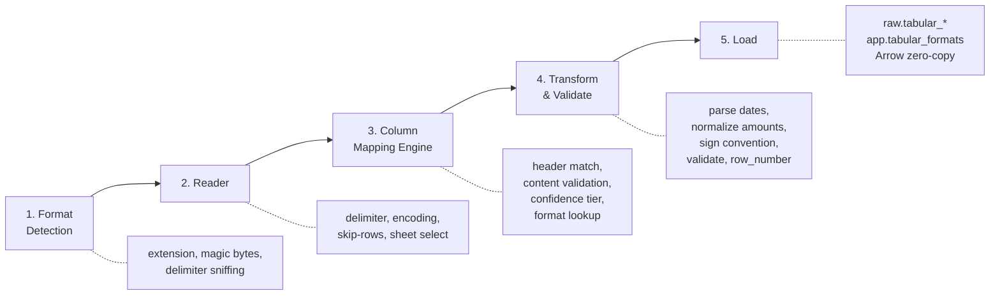
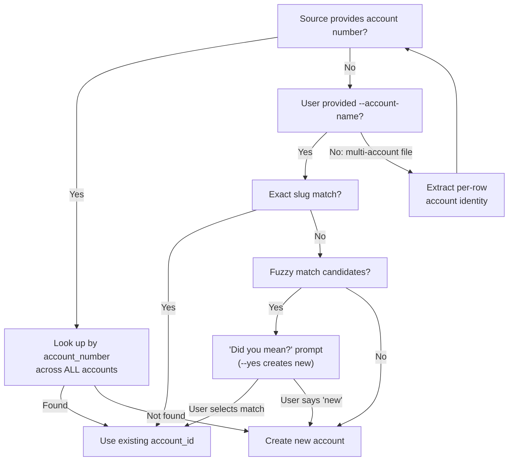

# Feature: Smart Tabular Import

> Last updated: 2026-04-22 — added open-source learnings: import batch tracking/reverting, DD/MM disambiguation, running balance validation, size guardrails, regex skip patterns, named number formats, Maybe migration format, design rationale section. Fixtures: 73 → 96.
> Companions: [`smart-import-overview.md`](smart-import-overview.md) (umbrella), [`matching-overview.md`](matching-overview.md) (provenance contract), [`matching-same-record-dedup.md`](matching-same-record-dedup.md) (downstream dedup), [`categorization-overview.md`](categorization-overview.md) (category bootstrap), [`privacy-data-protection.md`](privacy-data-protection.md) (encryption), [`database-migration.md`](database-migration.md) (schema migration), [`mcp-architecture.md`](mcp-architecture.md) (CLI/MCP symmetry)

## Status
<!-- draft | ready | in-progress | implemented -->
implemented

## Goal

Build the definitive tabular data importer for personal finance: any CSV, TSV, Excel,
Parquet, or delimited text file goes in, correctly mapped and normalized
transactions come out. When a built-in or saved format matches, import is instant. When
no format matches, a heuristic detection engine infers the column mapping, presents it
for confirmation, and saves the result for next time. Multi-account files (Tiller, Mint,
Monarch) are handled natively. The system learns from every import and turns competitor
data into a bootstrap accelerator for MoneyBin's categorization engine.

This spec supersedes [`csv-import.md`](archived/csv-import.md) (the shipped
format-based system) and absorbs Pillar B (Excel import) from
[`smart-import-overview.md`](smart-import-overview.md).

## Background

- [`smart-import-overview.md`](smart-import-overview.md) — umbrella spec; this
  implements Pillars A + B and establishes the format-agnostic architecture that
  Pillars C and F will reuse.
- [`csv-import.md`](archived/csv-import.md) — the existing format-based CSV
  system this replaces. Historical reference for what's already shipped.
- [`matching-overview.md`](matching-overview.md) — defines the provenance
  contract (`source_type` taxonomy) and cross-source dedup that operates downstream
  of this importer.
- [`matching-same-record-dedup.md`](matching-same-record-dedup.md) — consumes `source_transaction_id`
  and `source_type` from raw records this spec produces.
- [`categorization-overview.md`](categorization-overview.md) — migration-imported
  categories seed the auto-rule engine (Pillar E).
- [`privacy-data-protection.md`](privacy-data-protection.md) — encryption at rest; all writes go
  through the encrypted `Database` class. `ingest_dataframe()` added by this spec
  is part of that contract.
- [`database-migration.md`](database-migration.md) — schema migration from
  `raw.csv_*` → `raw.tabular_*` uses this system.
- `CLAUDE.md` "Architecture: Data Layers" — raw/prep/core layering this spec conforms to.
- `.claude/rules/cli.md` — non-interactive parity requirement (every interactive
  prompt has a flag equivalent).
- `private/specs/strategic-analysis.md` §6 — data portability and migration strategy
  that motivates the built-in formats and category migration flow.

### Competitive context

No open-source personal finance tool treats migration as a first-class feature. Switching
tools typically means: export transactions, re-import, re-categorize from scratch —
discarding years of categorization work. MoneyBin's smart tabular importer preserves
imported categories and uses them to seed the auto-rule engine, giving users a
fully-categorized MoneyBin on day one. See `private/specs/strategic-analysis.md` §6 for
the full migration path matrix.

---

## Requirements

1. Import tabular data from CSV, TSV, pipe-delimited, semicolon-delimited, Excel
   (.xlsx), Parquet, and Feather/Arrow IPC files.
2. Auto-detect file format from extension, magic bytes, and content sniffing.
3. Auto-detect column delimiter for text-based formats.
4. Auto-detect file encoding for non-UTF-8 text files.
5. Auto-detect the header row by skipping non-header preamble (bank summaries, export
   metadata, blank lines).
6. Match source column headers to destination schema fields using a curated alias table
   with aggressive normalization (case, whitespace, underscores, hyphens).
7. Validate header-matched columns against content (dates parse as dates, amounts parse
   as numeric) and use content analysis as a fallback for unmatched columns.
8. Assign a confidence tier (high / medium / low) to every detection result.
9. Present detected mappings for user confirmation before importing. High confidence
   with `--yes` auto-confirms. Low confidence refuses with actionable guidance.
10. Auto-save successful detections as formats in `app.tabular_formats` for reuse.
11. Support format override and update via `--override` + `--save-format` in a single
    invocation — no separate "edit format" step required.
12. Match imported formats against built-in YAML formats (shipped with releases) and
    user-saved DB formats. User formats always override built-ins of the same name.
13. Handle multi-account files (Tiller, Mint, Monarch) by detecting account-identifying
    columns and matching/creating accounts per row.
14. Handle single-account files by requiring `--account-name` and generating a
    deterministic `account_id`. <!-- NOTE: account_id should be the source system's identifier, not a slug of account_name. To be resolved during implementation. See testing-synthetic-data.md "Schema design choices" for the corrected semantics. -->
15. Match accounts across source types using account number (strongest), account name
    with fuzzy matching ("did you mean?"), or explicit `--account-id` bypass.
16. Preserve `source_transaction_id` when the source provides an institution-assigned
    unique transaction identifier; use it as the primary `transaction_id` in raw.
17. Generate deterministic hash-based `transaction_id` as fallback:
    `SHA-256(date|amount|description|account_id|row_number)`.
18. Preserve `original_amount` and `original_date_str` for audit trail.
19. Normalize amounts to MoneyBin convention (negative = expense, positive = income)
    regardless of source sign convention.
20. Infer sign convention from data: negative-is-expense, negative-is-income,
    split-debit/credit, all-positive (flagged for confirmation).
21. Record `source_type` (csv, tsv, excel, parquet, feather, pipe) on every
    raw record. Same column name and values from raw through core — no layer-specific
    aliases. The value `excel` (not `xlsx`) is resolved at write time.
22. Record `source_origin` on every raw record — the institution, connection, or format
    that produced the data. For tabular imports: the format name (e.g., `chase_credit`,
    `tiller`). For OFX: the institution from the file. For Plaid: the `item_id`. Scopes
    within-source dedup (Tier 2b) so that files from the same bank merge while files
    from different banks don't.
23. Record `row_number` (1-based source file line/row) on every raw record.
24. Provide `ingest_dataframe()` on the `Database` class as the standard write path:
    Polars → Arrow zero-copy → DuckDB. All loaders use this method.
25. Ship built-in formats for Tiller, Mint, YNAB, Chase, and Citi.
26. Every interactive CLI prompt has a non-interactive flag equivalent for AI agents and
    scripts (non-interactive parity).
27. CLI and MCP surfaces share the same service layer — neither contains business logic.
28. Track every import as a batch with a unique `import_id`. Provide `import history`
    and `import revert` commands to inspect and undo imports. Reverting deletes all
    rows from that batch and restores the previous state.
29. Disambiguate DD/MM vs MM/DD date formats using positional value analysis and date
    range reasonableness scoring. Flag truly ambiguous files for user confirmation.
30. When a running balance column is present, use sequential balance deltas to validate
    amount parsing and sign convention. Balance consistency is a high-confidence signal.
31. Enforce import size guardrails: warn at 10,000 rows, refuse at 50,000 rows unless
    overridden with `--no-row-limit`. File size limits: 25 MB for text formats, 100 MB
    for binary formats, overridden with `--no-size-limit`.
32. Support regex-based skip patterns in format definitions for trailing junk rows
    (totals, footers, export metadata). Auto-detection uses a default pattern set;
    saved formats store institution-specific patterns.
33. Detect and normalize four named number format conventions: US (`1,234.56`),
    European (`1.234,56`), Swiss/French (`1 234,56`), and zero-decimal (`1,234` for
    JPY, KRW, etc.). Record the detected convention in saved formats.
34. Ship a built-in format for Maybe/Sure CSV export alongside the existing migration
    formats, capturing the Maybe diaspora migration path.

---

## Architecture

### Pipeline Overview

The smart tabular importer is a five-stage pipeline. Every supported format enters at
Stage 1 and exits Stage 5 as rows in `raw.tabular_transactions`.



**Key principle:** Stages 1–2 are format-specific (different code paths for CSV vs
Excel vs Parquet). Stages 3–5 are format-agnostic (identical logic regardless of source
format). The boundary between them is a Polars DataFrame with string column names and
raw values. Everything downstream of that boundary doesn't know or care whether the data
came from a CSV, Excel file, or Parquet export.

### Stage 1: Format Detection

Determines the file format and basic parameters before reading.

| Signal | Method | Priority |
|---|---|---|
| Extension | `.csv` → CSV, `.tsv`/`.tab` → TSV, `.xlsx` → Excel, `.xls` → legacy Excel, `.parquet`/`.pq` → Parquet, `.feather`/`.arrow`/`.ipc` → Feather, `.txt`/`.dat` → sniff | First check |
| Magic bytes | Excel ZIP signature (xlsx), BIFF signature (xls), `PAR1` (Parquet), Arrow IPC magic | Confirms extension, catches misnamed files |
| Delimiter sniffing | For text files: sample first 20 lines, try `,` `\t` `\|` `;` — pick the delimiter that produces the most consistent non-zero column count across sample rows | Text formats only |
| Encoding detection | `charset-normalizer` for non-UTF-8 text files; detect BOM markers | Text formats only |

**Override flags:** `--format=csv|tsv|xlsx|parquet|feather|pipe|auto`,
`--delimiter=X`, `--encoding=X`.

### Stage 2: Reader

Converts the file into a format-agnostic Polars DataFrame.

**Text reader (CSV/TSV/pipe/semicolon):**

- Header row detection: scan for first row where values look like column names — multiple
  short strings, low numeric ratio, high uniqueness. Skip preceding rows (bank summaries,
  export timestamps, blank lines). Record the detected `skip_rows` count for the format.
- Handle trailing summary/total rows via a two-tier approach:
  1. **Format-specific regex patterns** — saved formats can declare
     `skip_trailing_patterns` (list of regexes). When a format matches, these patterns
     are applied before data processing. Example: Chase CSVs end with `,,Total,1234.56`
     → pattern `^,{2,}Total`.
  2. **Default heuristic patterns** — when no format matches, apply a default set of
     trailing-row regexes compiled from real-world bank exports (hledger community rules,
     Firefly III importer, and direct testing):
     ```python
     DEFAULT_TRAILING_PATTERNS: list[str] = [
         r"^(Total|Grand Total|Sum|Totals)\b",  # aggregate labels
         r"^(Export(ed)?|Generated|Downloaded|Report) (Date|On|At)\b",  # export metadata
         r"^(Record Count|Row Count|Number of)",  # row counts
         r"^(Opening|Closing|Beginning|Ending) Balance\b",  # balance summaries
         r"^,{3,}$",  # empty rows with only delimiters
         r"^\s*$",  # blank rows at end of file
     ]
     ```
     Scan from the last row upward. Stop removing when a row doesn't match any pattern.
     Record removed row count for diagnostics.
- Handle repeated header rows mid-file (copy-paste from paginated web views).
- Handle BOM markers transparently.
- **Size guardrails** (applied before reading the full file):
  - Text formats: reject files >25 MB unless `--no-size-limit`.
  - Binary formats (Parquet, Feather, Excel): reject files >100 MB unless
    `--no-size-limit`.
  - After reading: warn if row count >10,000; refuse if >50,000 unless
    `--no-row-limit`. Most personal finance files are <5,000 rows. A 50,000-row file
    is almost certainly a mistake (wrong export, duplicate data, or enterprise data).
    The limits are advisory safeguards, not performance constraints — DuckDB and Polars
    handle millions of rows fine. The concern is financial data correctness: importing
    the wrong 50k-row file silently is worse than rejecting it loudly.
- Use `polars.read_csv()` with detected delimiter, encoding, skip_rows.

**Excel reader (.xlsx):**

- Sheet selection: if `--sheet` specified, use it. Otherwise list sheets with row counts,
  pick the one with the most data rows. If ambiguous (multiple sheets with similar row
  counts), surface as a confirmation prompt with non-interactive `--sheet` flag.
- Header row detection: same logic as text reader, plus handle merged cells (unmerge and
  propagate values down/right) and formatted-but-empty rows.
- Cell values: use the raw/computed value, not the display format. A date stored as an
  Excel serial number gets converted to a date. Currency-formatted cells yield the
  numeric value. Formula cells yield the computed result.
- Use `polars.read_excel()` (delegates to `openpyxl`).
- Legacy `.xls` support deferred — note as future enhancement.

**Parquet reader:**

- `polars.read_parquet()` — schema is embedded in the file (column names and types).
- Content validation in Stage 3 is mostly a no-op since types are already known.
- Partitioned datasets (directory of files) deferred to future enhancement. Single-file
  Parquet only in v1.

**Feather/Arrow IPC reader:**

- `polars.read_ipc()` — Arrow-native, zero-copy, typed.
- Same treatment as Parquet: minimal detection needed.

**Output:** All readers produce a Polars DataFrame with string-typed column names. This
is the format-agnostic boundary.

### Stage 3: Column Mapping Engine

The core of the "smart" part. Takes a DataFrame (headers + sample rows), produces a
field mapping with a confidence tier.

#### Step 1 — Format lookup

Check `app.tabular_formats` (DB) then built-in YAML files (package). If a format's
`header_signature` is a case-insensitive subset of the file's headers, use that
format's `field_mapping` directly. Skip to Stage 4.

User DB formats override built-in YAML formats of the same name. This allows users to
customize their way out of a built-in format that doesn't work for their variant.
The system guides toward editing over shadowing — prompts to update the existing format
rather than creating a near-duplicate.

#### Step 2 — Header-to-destination matching

For each source column header, normalize aggressively (lowercase, strip whitespace,
collapse multiple spaces, strip quotes, replace underscores and hyphens with spaces),
then check against the destination field alias table. Each destination field has a ranked
alias list — exact match beats substring.

Track which columns are claimed so no column maps to two fields.

**Destination field alias table:**

```python
FIELD_ALIASES: dict[str, list[str]] = {
    # Required fields (must find all three or detection fails)
    "transaction_date": [
        "transaction date",
        "trans date",
        "date",
        "effective date",
        "trade date",
        "txn date",
    ],
    "amount": [
        "amount",
        "transaction amount",
        "trans amount",
        "net amount",
    ],
    "description": [
        "description",
        "payee",
        "merchant",
        "narrative",
        "transaction description",
        "details",
        "name",
    ],
    # Amount variants (detected as amount if no single amount column)
    "debit_amount": [
        "debit",
        "debit amount",
        "withdrawals",
        "withdrawal",
        "money out",
        "debit amt",
        "outflow",
    ],
    "credit_amount": [
        "credit",
        "credit amount",
        "deposits",
        "deposit",
        "money in",
        "credit amt",
        "inflow",
    ],
    # Optional transaction fields
    "post_date": [
        "post date",
        "posting date",
        "settlement date",
        "posted date",
        "settle date",
    ],
    "memo": [
        "memo",
        "notes",
        "additional info",
        "extended description",
        "full description",
    ],
    "category": ["category", "transaction category"],
    "subcategory": ["subcategory", "sub category"],
    "transaction_type": [
        "type",
        "transaction type",
        "trans type",
        "tran type",
    ],
    "status": ["status", "state", "transaction status", "cleared"],
    "check_number": [
        "check number",
        "check no",
        "check #",
        "cheque number",
        "check",
    ],
    "source_transaction_id": [
        "transaction id",
        "trans id",
        "txn id",
        "transaction #",
        "fitid",
        "id",
        "unique id",
    ],
    "reference_number": [
        "reference",
        "ref",
        "confirmation",
        "conf number",
        "reference number",
        "ref number",
        "receipt",
    ],
    "balance": [
        "balance",
        "running balance",
        "available balance",
        "ledger balance",
    ],
    "currency": ["currency", "currency code", "ccy", "cur"],
    "member_name": [
        "member name",
        "account holder",
        "cardholder",
        "card member",
    ],
    # Account-identifying fields (trigger multi-account mode)
    "account_name": [
        "account",
        "account name",
        "acct name",
        "acct",
    ],
    "account_number": [
        "account #",
        "account number",
        "acct #",
        "acct number",
        "account no",
    ],
    "institution_name": [
        "institution",
        "bank",
        "bank name",
        "financial institution",
    ],
    "account_type": [
        "account type",
        "acct type",
        "class",
    ],
}
```

This table grows over time as users encounter new header conventions. Aliases are curated
— not auto-generated or fuzzy-matched. Aggressive normalization before matching (case,
whitespace, separators) covers most variation without fuzzy logic.

**Future: Investment field aliases (deferred to Level 2):**

When the detection engine finds matches against investment aliases (ticker, shares,
price, action, commission), it routes to investment raw tables. The routing hook is
designed here; the investment schema is implemented in Level 2.

```python
# Deferred — investment transaction detection
INVESTMENT_FIELD_ALIASES: dict[str, list[str]] = {
    "ticker": ["ticker", "symbol", "stock symbol", "security"],
    "shares": ["shares", "quantity", "qty", "units"],
    "price": ["price", "price per share", "unit price"],
    "action": ["action", "activity", "buy/sell", "side"],
    "commission": ["commission", "fee", "fees", "trading fee"],
}
```

#### Step 3 — Content validation

For every header-matched field, validate that sample values (first 20 non-empty rows)
conform to the expected type:

- **Date fields:** Try a ranked list of common date formats against sampled values:
  `%m/%d/%Y`, `%Y-%m-%d`, `%m/%d/%y`, `%m-%d-%Y`, `%d/%m/%Y`, `%Y/%m/%d`,
  `%d-%b-%Y`, `%d-%B-%Y`, `%b %d, %Y`. Score each candidate format on two axes:
  1. **Parse rate** — fraction of non-empty samples that parse successfully.
     Threshold: ≥90%.
  2. **Date range reasonableness** — fraction of parsed dates that fall within
     1970-01-01 to today + 1 year. Penalize formats where parsed dates land outside
     this window (e.g., a format that interprets `01/13/2024` as January 2013 in a
     `DD/MM/YYYY` interpretation).

  **DD/MM vs MM/DD disambiguation algorithm:**
  When both `%m/%d/Y` and `%d/%m/Y` pass the parse rate threshold, disambiguate:
  1. Scan *all* date values (not just the 20-row sample) for values where the first
     or second numeric component exceeds 12.
  2. If position 1 has values >12 (e.g., `15/02/2024`) → DD/MM. Those rows cannot
     be months.
  3. If position 2 has values >12 (e.g., `02/15/2024`) → MM/DD.
  4. If both positions have values >12 → data has mixed formats; flag as low
     confidence with guidance.
  5. If neither position ever exceeds 12 (rare in practice — a full month of data
     almost always includes dates past the 12th) → check date range reasonableness
     of both interpretations against the file's apparent time range (min/max dates
     should span a plausible statement period, not jump between months erratically).
  6. If still ambiguous → medium confidence; surface both interpretations in the
     confirmation prompt with `--date-format` override.

  Record the winning format. If multiple columns qualify as dates, prefer the one
  with more distinct values (transaction date varies more than post date within a
  single statement period).

- **Amount fields:** Detect the number format convention, then parse. The four named
  conventions (sourced from Maybe/Sure's international handling and hledger's decimal
  mark support):

  | Convention | Example | Thousands sep | Decimal sep | Detection signal |
  |---|---|---|---|---|
  | `us` | `1,234.56` | `,` | `.` | Period appears after last comma; two decimal digits after period |
  | `european` | `1.234,56` | `.` | `,` | Comma appears after last period; two digits after comma |
  | `swiss_french` | `1 234,56` | ` ` (space) | `,` | Space-separated groups; comma before final digits |
  | `zero_decimal` | `1,234` | `,` | (none) | No decimal separator; amounts are whole numbers (JPY, KRW, VND) |

  **Detection algorithm:** Sample non-empty amount values. For each value, check which
  conventions produce valid parses. The convention that parses the most values wins. If
  tied, prefer `us` (most common in English-language exports). Record the winning
  convention in the saved format as `number_format`.

  After convention detection, parse amounts: strip currency symbols (`$`, `€`, `£`,
  `¥`, `₩`, `kr`, `CHF`, `R$` — the 15 most common currency markers from ISO 4217
  usage rankings), apply convention-specific thousands/decimal handling, handle
  parentheses-as-negative (`(42.50)` → `-42.50`), handle "DR"/"CR" suffixes. Threshold:
  ≥95% of non-empty samples parse as numeric.

- **Text fields:** Columns where <50% of values parse as numeric or date.

If validation fails for a header-matched field, demote the match and flag it.

For Parquet and Feather, content validation is a lightweight check — types
are already known from the file schema.

#### Step 4 — Fallback discovery (unclaimed columns)

For columns with no header match, use content-type analysis to propose candidates for
unmapped required fields. Rank candidates by:

1. Content type match (dates, amounts, text)
2. Cardinality (descriptions have higher cardinality than status/category columns)
3. Average string length (descriptions are longer than reference codes)
4. Column position (earlier columns preferred as tiebreaker)

#### Step 5 — Sign convention inference

- If single amount column with negatives present → `negative_is_expense`
- If single amount column all positive → flag for confirmation (could be absolute values
  needing sign context)
- If two numeric columns where one is null/zero when the other has a value →
  `split_debit_credit`
- If single amount column where negatives are income (e.g., credit card statement
  convention) → `negative_is_income` (detected if header contains "credit" or if
  the context suggests credit card)

#### Step 6 — Multi-account detection

If the mapping engine matched any account-identifying fields (`account_name`,
`account_number`, `institution_name`), the file is multi-account. The import flow
switches to per-row account extraction:

- Extract unique accounts from the data.
- For each unique account, match against the full account registry (all existing
  accounts, regardless of source type) by account number first, then by name.
- Present the match results for confirmation: matched accounts, new accounts to create.
- Non-interactive: `--yes` auto-creates new accounts.

When no account-identifying columns are detected, `--account-name` is required.

#### Step 7 — Conflict resolution & confidence tier

| Condition | Confidence | Behavior |
|---|---|---|
| All three required fields (date, amount, description) matched unambiguously by header name, validated by content. No conflicts. | **High** | Auto-confirm with `--yes`. Present mapping for confirmation without `--yes`. |
| All required fields have candidates, but ambiguity exists: multiple text columns, generic header names, content-only matches for some fields. | **Medium** | Present mapping with flagged `(?)` fields. Never auto-confirm. |
| Can't find a plausible candidate for at least one required field. | **Low** | Refuse with actionable guidance: suggest `--override` flags, `import preview` command. |

### Stage 4: Transform & Validate

Applies the confirmed mapping to produce the canonical raw schema shape.

- **Date parsing:** Parse dates using the detected or specified format via Polars
  `str.strptime`. Preserve `original_date_str` (raw string before parsing).
- **Amount normalization:** Apply sign convention (invert if `negative_is_income`,
  merge debit/credit if `split_debit_credit`). Strip currency symbols, commas,
  parentheses. Convert to `Decimal(18,2)`. Preserve `original_amount` (raw string
  before normalization).
- **Transaction ID generation:**
  - If `source_transaction_id` is present: `transaction_id = f"{account_id}:{source_transaction_id}"`
  - Else: `transaction_id = SHA-256(date|amount|description|account_id|row_number)`
  - The `row_number` in the fallback hash prevents same-day, same-amount collisions
    (two coffees at Starbucks). This means row-order changes in re-exports produce
    different IDs — an acceptable tradeoff since the dedup layer handles it.
  - **Overlapping statements:** When a user imports overlapping files from the same
    source origin and type (e.g., `chase-march.csv` and `chase-q1.csv`, both
    `source_origin = 'chase_credit'`), hash-based IDs differ across files even for the
    same real-world transaction. This is handled by Tier 2b in
    [`matching-same-record-dedup.md`](matching-same-record-dedup.md) — a within-origin fuzzy matcher
    scoped to `(account_id, source_origin, source_type)` that runs before cross-source
    matching. Only high-confidence matches are auto-merged; ambiguous cases (same-day,
    same-amount but different descriptions) are left as distinct records.
- **Account ID generation:** Deterministic slug from account name:
  `"Chase Checking"` → `"chase-checking"`. Normalized: lowercase, non-alphanumeric
  replaced with hyphens, stripped.
- **Row number assignment:** 1-based source file line/row number.
- **Running balance validation** (when `balance` column is mapped):
  Balance columns are a powerful free validation signal that most importers ignore.
  When present, verify internal consistency by checking sequential balance deltas:
  `balance[n] - balance[n-1]` should equal `amount[n]` (within a rounding tolerance
  based on the detected number format: ±0.01 for 2-decimal currencies, ±0.001 for
  3-decimal currencies like KWD/BHD, ±1 for zero-decimal currencies like JPY/KRW).
  1. If ≥90% of consecutive pairs pass → strong confirmation of correct amount parsing
     and sign convention. Boost confidence tier (medium → high if all other required
     fields are solid).
  2. If <90% pass but ≥90% pass after inverting the sign convention → the sign
     convention was wrong. Auto-correct and log the correction.
  3. If neither direction passes → balance column may represent a different time
     window than the transactions (e.g., running balance from an older period, or
     balances include transactions not in this export). Warn but don't block import.
     Record `balance_validated: false` in the import log.

  This validation runs after amount normalization and sign convention application.
  It catches the most insidious class of import bugs — amounts that parse correctly
  as numbers but have the wrong sign, turning expenses into income or vice versa.

- **Structural validation:**
  - Null density: warn if required columns are >10% null.
  - Amount range sanity: flag if values look like dates (e.g., `20260315`) or if all
    amounts are implausibly large/small.
  - Date range: flag if parsed dates fall outside 1990–today+1 year.
  - Row consistency: warn if rows have inconsistent column counts (ragged CSV).
- **Malformed row handling:** Reject rows that fail validation with clear error messages
  including row number and reason. Partial imports are allowed — valid rows proceed,
  rejected rows are reported.

### Stage 5: Load

- **Create import batch** — generate a UUID `import_id` and write a record to
  `raw.import_log` before inserting any transaction rows. This is the anchor for
  import history, reverting, and diagnostics.
- Write to `raw.tabular_transactions` and `raw.tabular_accounts` via the `Database`
  class's new `ingest_dataframe()` method (Polars → Arrow zero-copy → DuckDB).
  Every row carries the `import_id` from this batch.
- Dedup via primary key (`INSERT OR REPLACE`).
- Update format usage metadata (`times_used`, `last_used_at`) in `app.tabular_formats`.
- **Finalize import batch** — update `raw.import_log` with final row counts, status
  (`complete` or `partial` if some rows were rejected), and any diagnostic flags
  (balance validation result, rows rejected, trailing rows skipped).
- Auto-save detected format if `save_format=True` (default). The format `name` is
  derived from the `--account-name` slug (single-account files) or the detected
  institution slug (multi-account files). Example: `--account-name "First National
  Checking"` → format name `first_national`. If a format with that name already
  exists, prompt to update it (or auto-update with `--yes`).
- Trigger SQLMesh transforms unless `--skip-transform` is specified.
- Apply deterministic categorization post-transform (merchant lookups + rules).

**Import reverting:** `moneybin import revert <import-id>` deletes all
`raw.tabular_transactions` and `raw.tabular_accounts` rows matching that
`import_id`, marks the import log record as `reverted`, and triggers a SQLMesh
re-run to propagate the removal through staging and core. This is critical for
user confidence during early adoption — importing the wrong file or with the
wrong column mapping should be trivially recoverable, not a "wipe the database
and start over" event. The revert operation is idempotent (reverting an already-
reverted import is a no-op with a warning).

---

## Data Model

### Raw tables

```sql
CREATE TABLE raw.tabular_transactions (
    /* Imported financial transactions from tabular file sources (CSV, TSV, Excel,
       Parquet, Feather). Each row represents a single transaction as extracted from the
       source file with minimal transformation — amounts are sign-normalized but all
       original values are preserved for audit. */
    transaction_id VARCHAR NOT NULL,            -- Deterministic identifier: source_transaction_id when available, else SHA-256 hash of date|amount|description|account_id|row_number
    account_id VARCHAR NOT NULL,                -- Source-system account identifier; for multi-account files extracted from per-row account column, for single-account files provided or generated <!-- NOTE: should not be a slug of account_name. See testing-synthetic-data.md for corrected semantics. -->
    transaction_date DATE NOT NULL,             -- Primary transaction date parsed from source using detected or specified date format
    post_date DATE,                             -- Settlement or posting date when distinct from transaction date; NULL if source provides only one date
    amount DECIMAL(18, 2) NOT NULL,             -- Normalized amount: negative = expense, positive = income regardless of source sign convention
    original_amount VARCHAR,                    -- Raw amount string exactly as it appeared in the source file before sign normalization and parsing
    original_date_str VARCHAR,                  -- Raw date string exactly as it appeared in the source file before format parsing
    description VARCHAR,                        -- Primary transaction description, payee, or merchant name from source
    memo VARCHAR,                               -- Supplementary transaction details, extended description, or notes from source
    category VARCHAR,                           -- Source-provided transaction category if present; preserved as-is for migration bootstrap, not MoneyBin categorization
    subcategory VARCHAR,                        -- Source-provided transaction subcategory if present; preserved as-is
    transaction_type VARCHAR,                   -- Source-provided transaction type (e.g. Sale, Return, Payment, Dividend, Fee, Transfer)
    status VARCHAR,                             -- Source-provided transaction status (e.g. Cleared, Pending, Posted, Reconciled)
    check_number VARCHAR,                       -- Check or cheque number for check-based transactions
    source_transaction_id VARCHAR,              -- Institution-assigned unique transaction identifier if present; strongest dedup signal for same-source re-imports
    reference_number VARCHAR,                   -- Institution-assigned reference, confirmation, or receipt number; not guaranteed unique across transactions
    balance DECIMAL(18, 2),                     -- Running account balance after this transaction if provided by source
    currency VARCHAR,                           -- ISO 4217 currency code if present in source (e.g. USD, EUR); captured now, multi-currency processing deferred
    member_name VARCHAR,                        -- Account holder, cardholder, or member name if present in source
    source_file VARCHAR NOT NULL,               -- Absolute path to the imported file at time of extraction
    source_type VARCHAR NOT NULL,               -- Import pathway that produced this record: csv, tsv, excel, parquet, feather, pipe
    source_origin VARCHAR NOT NULL,             -- Institution/connection/format that produced this data (e.g. "chase_credit", "tiller", Plaid item_id); scopes Tier 2b dedup
    import_id VARCHAR NOT NULL,                 -- UUID linking this row to its import batch in raw.import_log; enables import reverting and history
    row_number INTEGER,                         -- 1-based row/line number in the source file; invaluable for debugging import issues and deterministic hash generation
    extracted_at TIMESTAMP DEFAULT CURRENT_TIMESTAMP, -- Timestamp when the extraction pipeline processed this record
    loaded_at TIMESTAMP DEFAULT CURRENT_TIMESTAMP,    -- Timestamp when this record was written to the raw table
    PRIMARY KEY (transaction_id, account_id, source_file)
);

CREATE TABLE raw.tabular_accounts (
    /* Accounts discovered during tabular file imports. For single-account files, one
       record is created from the --account-name flag. For multi-account files (Tiller,
       Mint), one record per unique account found in the data. Account numbers are stored
       here (not per-transaction) and masked at the application layer for display. */
    account_id VARCHAR NOT NULL,                -- Source-system account identifier; not derived from account_name <!-- NOTE: should not be a slug. See testing-synthetic-data.md for corrected semantics. -->
    account_name VARCHAR NOT NULL,              -- Human-readable account label provided by user or extracted from multi-account file
    account_number VARCHAR,                     -- Full account number if available in source; stored encrypted at rest, masked at application layer for all output
    account_number_masked VARCHAR,              -- Last 4 digits for display (e.g. "...4521"); derived from account_number or extracted directly if source only provides masked
    account_type VARCHAR,                       -- Account type if known (e.g. checking, savings, credit, brokerage, investment)
    institution_name VARCHAR,                   -- Financial institution name from format metadata, source file content, or user input
    currency VARCHAR,                           -- Default currency for this account if known (ISO 4217 code)
    source_file VARCHAR NOT NULL,               -- Absolute path to the imported file that created or updated this account record
    source_type VARCHAR NOT NULL,               -- Import pathway that produced this record: csv, tsv, excel, parquet, feather, pipe
    source_origin VARCHAR NOT NULL,             -- Institution/connection/format that produced this data; matches the format name for tabular imports
    import_id VARCHAR NOT NULL,                 -- UUID linking this row to its import batch in raw.import_log; enables import reverting and history
    extracted_at TIMESTAMP DEFAULT CURRENT_TIMESTAMP, -- Timestamp when the extraction pipeline processed this record
    loaded_at TIMESTAMP DEFAULT CURRENT_TIMESTAMP,    -- Timestamp when this record was written to the raw table
    PRIMARY KEY (account_id, source_file)
);
```

### Import log table

```sql
CREATE TABLE raw.import_log (
    /* Audit log of every tabular file import. Each import batch gets a UUID that is
       stamped on every raw row it produces, enabling import history, reverting, and
       diagnostics. Inspired by Maybe/Sure's import lifecycle tracking — reverting a
       bad import should be trivial, not catastrophic. */
    import_id VARCHAR PRIMARY KEY,              -- UUID generated at the start of each import batch
    source_file VARCHAR NOT NULL,               -- Absolute path to the imported file
    source_type VARCHAR NOT NULL,               -- File format: csv, tsv, excel, parquet, feather, pipe
    source_origin VARCHAR NOT NULL,             -- Format/institution that produced this data
    format_name VARCHAR,                        -- Name of the matched or saved format (NULL if no format matched)
    format_source VARCHAR,                      -- How the format was resolved: "built-in", "saved", "detected", "override"
    account_names JSON NOT NULL,                -- List of account names affected by this import
    status VARCHAR NOT NULL DEFAULT 'importing' CHECK (status IN ('importing', 'complete', 'partial', 'failed', 'reverted')), -- Lifecycle: importing → complete | partial | failed | reverted
    rows_total INTEGER,                         -- Total rows in source file (before filtering)
    rows_imported INTEGER,                      -- Rows successfully written to raw tables
    rows_rejected INTEGER DEFAULT 0,            -- Rows that failed validation (with reasons in rejection_details)
    rows_skipped_trailing INTEGER DEFAULT 0,    -- Trailing junk rows removed by skip patterns
    rejection_details JSON,                     -- Per-rejected-row: [{row_number, reason}]
    detection_confidence VARCHAR,               -- Confidence tier of the column mapping: high, medium, low (NULL if format matched)
    number_format VARCHAR,                      -- Detected number convention: us, european, swiss_french, zero_decimal
    date_format VARCHAR,                        -- Date format string used for parsing
    sign_convention VARCHAR,                    -- Sign convention applied: negative_is_expense, negative_is_income, split_debit_credit
    balance_validated BOOLEAN,                  -- Whether running balance validation passed (NULL if no balance column)
    started_at TIMESTAMP DEFAULT CURRENT_TIMESTAMP, -- When the import batch began
    completed_at TIMESTAMP,                     -- When the import batch finished (NULL if still running or failed)
    reverted_at TIMESTAMP                       -- When the import was reverted (NULL if not reverted)
);
```

### Format table

```sql
CREATE TABLE app.tabular_formats (
    /* Saved column mappings for known tabular file formats. Built-in formats (Chase,
       Citi, Tiller, Mint, YNAB) are seeded from YAML files on db init. User formats
       are auto-saved after successful heuristic detection or created via --override +
       --save-format. User formats override built-ins of the same name. */
    name VARCHAR PRIMARY KEY,                   -- Machine identifier for this format (e.g. "chase_credit", "tiller", "mint")
    institution_name VARCHAR NOT NULL,          -- Human-readable institution or tool name (e.g. "Chase", "Tiller", "Mint")
    file_type VARCHAR NOT NULL DEFAULT 'auto',  -- Expected file type: csv, tsv, xlsx, parquet, feather, pipe, or "auto" for any type
    delimiter VARCHAR,                          -- Explicit delimiter character for text formats; NULL means auto-detected at import time
    encoding VARCHAR NOT NULL DEFAULT 'utf-8',  -- Character encoding for text formats (e.g. utf-8, latin-1, windows-1252)
    skip_rows INTEGER NOT NULL DEFAULT 0,       -- Number of non-data rows to skip before the header row in the source file
    sheet VARCHAR,                              -- Excel sheet name to read; NULL means auto-select the sheet with the most data rows
    header_signature JSON NOT NULL,             -- Ordered list of column names that uniquely fingerprint this format for auto-detection (case-insensitive subset matching)
    field_mapping JSON NOT NULL,                -- Mapping of destination field names to source column names (e.g. {"transaction_date": "Trans Date", "amount": "Amount"})
    sign_convention VARCHAR NOT NULL,           -- How amounts are represented in the source: negative_is_expense, negative_is_income, split_debit_credit
    date_format VARCHAR NOT NULL,               -- strftime format string for parsing date values (e.g. "%m/%d/%Y", "%Y-%m-%d")
    number_format VARCHAR NOT NULL DEFAULT 'us', -- Number convention: us (1,234.56), european (1.234,56), swiss_french (1 234,56), zero_decimal (1,234)
    skip_trailing_patterns JSON, -- Regex patterns for trailing non-data rows: NULL = use default patterns, [] = no patterns (explicit opt-out), ["^Total", ...] = institution-specific patterns only
    multi_account BOOLEAN NOT NULL DEFAULT FALSE, -- Whether this format expects per-row account identification (Tiller, Mint, Monarch)
    source VARCHAR NOT NULL DEFAULT 'detected', -- How this format was created: "detected" (auto-saved), "manual" (user-created), "built-in-override" (customized built-in)
    times_used INTEGER NOT NULL DEFAULT 0,      -- Number of successful imports completed using this format
    last_used_at TIMESTAMP,                     -- Timestamp of the most recent successful import using this format
    created_at TIMESTAMP DEFAULT CURRENT_TIMESTAMP, -- Timestamp when this format was first created
    updated_at TIMESTAMP DEFAULT CURRENT_TIMESTAMP  -- Timestamp when this format was last modified (override, re-detection, or manual edit)
);
```

### Core transaction identity

Each data layer has its own identity space:

| Layer | `transaction_id` | Derived from | Stable across |
|---|---|---|---|
| **Raw** | `account_id:source_transaction_id` when institution ID present, else `SHA-256(date\|amount\|description\|account_id\|row_number)` | Source file content | Re-imports of the same file |
| **Core** | `SHA-256(account_id\|transaction_date\|amount\|normalized_description)` + deterministic sequence suffix for collisions | Core-layer canonical attributes | SQLMesh re-runs, source changes |

The core `transaction_id` is independent of any single source. Two source records that
merge into one golden record produce the same core ID. The sequence suffix handles
same-day, same-amount collisions:

```sql
SHA256(account_id || '|' || transaction_date || '|' || amount || '|' || description)
  || '-' || ROW_NUMBER() OVER (
    PARTITION BY account_id, transaction_date, amount, description
    ORDER BY source_transaction_id, source_file, row_number
  )
```

### Staging views (SQLMesh)

Rename from `stg_csv__*` to `stg_tabular__*`:

- `prep.stg_tabular__accounts` — standardize column names, derive
  `account_number_masked` from `account_number` when only full number is available.
- `prep.stg_tabular__transactions` — normalize amounts (redundant with raw but
  defensive), standardize dates. `source_type` and `source_origin` pass through
  unchanged from raw.

### Core integration

Update `dim_accounts.sql` and `fct_transactions.sql`:

- Replace the `csv` CTE with a `tabular` CTE reading from `stg_tabular__*`.
- `source_type` and `source_origin` carry through from raw: `csv`, `tsv`, `excel`,
  `parquet`, `feather`, `pipe`.
- `UNION ALL` into the existing multi-source CTEs alongside `ofx` and future `plaid`.

### Column rename: `source_system` → `source_type`

Existing core SQLMesh models (`dim_accounts.sql`, `fct_transactions.sql`) synthesize a
`source_system` column with hardcoded literals (`'csv'`, `'ofx'`). The raw CSV tables
don't have this column — it exists only in core. This spec introduces `source_type` as
the canonical name at every layer — neutral enough for both file formats (`csv`, `excel`)
and API/sync sources (`plaid`, `ofx`). All specs already use `source_type` consistently.

**Migration path:** The new `raw.tabular_*` tables are created with `source_type` from
the start. The core SQLMesh models are rewritten as part of this spec (replacing `csv`
CTEs with `tabular` CTEs), so `source_system` → `source_type` is a rename in the
`SELECT` alias — no column rename migration needed for raw tables. The `dim_accounts`
and `fct_transactions` models drop the old `source_system` column and emit `source_type`
instead. A database migration via [`database-migration.md`](database-migration.md)
handles renaming `source_system` → `source_type` in `core.dim_accounts` and
`core.fct_transactions` for existing databases.

### source_type taxonomy

| source_type | Raw tables | Import pathway |
|---|---|---|
| `csv` | `raw.tabular_*` | Smart tabular importer |
| `tsv` | `raw.tabular_*` | Smart tabular importer |
| `excel` | `raw.tabular_*` | Smart tabular importer |
| `parquet` | `raw.tabular_*` | Smart tabular importer |
| `feather` | `raw.tabular_*` | Smart tabular importer |
| `pipe` | `raw.tabular_*` | Smart tabular importer |
| `ofx` | `raw.ofx_*` | OFX importer (existing) |
| `plaid` | `raw.plaid_*` | Plaid connector (future) |
| `pdf_w2` | `raw.w2_*` | W-2 extractor (existing) |

The raw tables are shared across all tabular formats (`raw.tabular_*`) because the data
shape is identical once read. The `source_type` column distinguishes the original import
pathway. The same column name and values flow from raw through staging to core — one
concept, one name, per the column consistency rule.

### source_origin

`source_origin` identifies the institution, connection, or format that produced data.
Where `source_type` answers "how did this data arrive?" (CSV, Excel, Plaid API),
`source_origin` answers "where did it come from?" (Chase credit card, Tiller export,
Plaid Item `item_abc123`).

| Source | `source_origin` value |
|---|---|
| Tabular import with format | Format name (e.g., `chase_credit`, `tiller`, `mint`) |
| Tabular import without format | Derived from `--account-name` slug (e.g., `first-national`) |
| OFX import | Institution identifier from OFX file data |
| Plaid sync | Plaid `item_id` |

`source_origin` scopes Tier 2b dedup blocking: overlapping statements merge only when
they share the same `(account_id, source_origin, source_type)`. Two CSVs from different
banks (`source_origin = 'chase_credit'` vs `source_origin = 'citi_checking'`) never
match in Tier 2b — they go to Tier 3 (cross-source). Same column name from raw through
core.

### Database class addition

```python
def ingest_dataframe(
    self,
    table: str,
    df: pl.DataFrame,
    on_conflict: str = "replace",
) -> int:
    """Load a Polars DataFrame into a table via Arrow zero-copy.

    Args:
        table: Qualified table name (e.g. "raw.tabular_transactions").
            Validated against the database catalog before use.
        df: Source DataFrame to load.
        on_conflict: Conflict handling for primary key collisions:
            "replace" (INSERT OR REPLACE), "ignore" (INSERT OR IGNORE),
            "error" (raise on collision).

    Returns:
        Number of rows inserted.

    Raises:
        ValueError: If table name is not in the database catalog.
    """
```

The method validates the table name against `duckdb_tables()` (catalog lookup, per
`.claude/rules/security.md`), converts the DataFrame to Arrow (`df.to_arrow()` — zero-
copy since Polars stores data in Arrow format internally), and executes the appropriate
INSERT statement. All writes go through the `Database` class's encrypted connection.

---

## Account Matching

Account matching operates across the **full account registry** — all existing accounts
regardless of how they were originally created (tabular import, OFX, Plaid, manual).
This ensures that a Chase account imported via CSV and later connected via Plaid
links automatically when the account number matches.

### Matching flow



### Non-interactive parity

| Interactive prompt | Flag equivalent |
|---|---|
| "Did you mean [1] Chase Checking [2] Chase Credit [3] New?" | `--account-id acct-abc123` (bypass matching) |
| Multi-account confirmation table | `--yes` (auto-create new accounts) |

### Cross-source linking

| Source | Identifier provided | Matching signal |
|---|---|---|
| Tabular (single-account) | `--account-name` | Slug match → fuzzy match → create |
| Tabular (multi-account) | Account column + optional account number | Account number (strongest) → name match → create |
| OFX | Bank-assigned account ID + account number | Account number match |
| Plaid (future) | Plaid account ID + masked account number | Account number masked match |

---

## CLI Interface

### Primary import command

The primary command is `moneybin import file` — format-agnostic, handles all tabular
formats through the same entry point.

```bash
# Happy path — format matches or detection succeeds
moneybin import file statement.csv --account-name "Chase Checking"

# Explicit format
moneybin import file statement.csv --account-name "Chase Checking" --format chase_credit

# Multi-account file (no --account-name needed)
moneybin import file tiller-export.csv

# Non-interactive with overrides (AI agents and scripts)
moneybin import file statement.csv --account-name "Chase Checking" \
  --override date="Post Date" \
  --override amount="Debit" \
  --yes --save-format

# Skip confirmation, don't save format
moneybin import file statement.csv --account-name "Chase Checking" --yes --no-save-format

# Format/delimiter override for edge cases
moneybin import file data.txt --account-name "Acme Checking" --delimiter="|" --encoding=latin-1

# Excel with sheet selection
moneybin import file workbook.xlsx --account-name "Savings" --sheet="Transactions"

# Direct account ID (bypass name matching)
moneybin import file statement.csv --account-id chase-checking

# Skip SQLMesh transforms
moneybin import file statement.csv --account-name "Checking" --skip-transform
```

### Interactive flow examples

**High confidence detection:**

```
$ moneybin import file first-national-march-2026.csv --account-name "FN Checking"

⚙️  No matching format found. Analyzing columns...

Detected mapping for first-national-march-2026.csv (confidence: high):
┌───────────────────────┬─────────────────┬───────────────────────────┐
│ Destination           │ Source Column    │ Sample Values             │
├───────────────────────┼─────────────────┼───────────────────────────┤
│ transaction_date      │ Transaction Date│ 03/15/2026, 03/14/2026    │
│ amount                │ Amount          │ -42.50, 1250.00, -8.99    │
│ description           │ Description     │ KROGER #1234, DIRECT DEP  │
│ post_date             │ Post Date       │ 03/16/2026, 03/15/2026    │
│ balance               │ Balance         │ 3,241.07, 3,283.57        │
│ check_number          │ Check Number    │ , , 1042                  │
│ source_transaction_id │ Ref ID          │ TXN90812, TXN90813        │
│ sign_convention       │ negative=expense│                           │
│ (unmapped)            │ Account Type    │ Checking, Checking        │
└───────────────────────┴─────────────────┴───────────────────────────┘

3 of 347 rows shown. Accept this mapping? [Y/edit/skip]
> y

✅ Imported 347 transactions from first-national-march-2026.csv
   Format "first_national" saved for future imports.
```

**Medium confidence (flagged fields):**

```
Detected mapping for unknown-export.csv (confidence: medium):
┌───────────────────────┬─────────────────┬───────────────────────────┐
│ Destination           │ Source Column    │ Sample Values             │
├───────────────────────┼─────────────────┼───────────────────────────┤
│ transaction_date      │ Col1            │ 03/15/2026, 03/14/2026    │
│ amount                │ Col4            │ -42.50, 1250.00           │
│ description (?)       │ Col2            │ KROGER #1234, WAL-MART    │
│ memo (?)              │ Col3            │ Purchase, Purchase        │
│ sign_convention       │ negative=expense│                           │
└───────────────────────┴─────────────────┴───────────────────────────┘

(?) = detected from content analysis, not header name.
Accept this mapping? [Y/edit/skip]
```

**Low confidence:**

```
⚠️  Could not reliably detect column mapping for pivot-report.csv.
   No column parsed as dates (tried 8 formats on 6 columns).

💡 Try specifying columns manually:
   moneybin import file pivot-report.csv --account-name "Checking" \
     --override date="Column Name" --override amount="Column Name" \
     --override description="Column Name"

   Or preview the file structure:
   moneybin import preview pivot-report.csv
```

**Multi-account file:**

```
$ moneybin import file tiller-export.csv

⚙️  Detected Tiller format (built-in).
   Multi-account file: 4 accounts found.

┌──────────────────────┬────────────────┬────────────┬──────┬──────────────────────────┐
│ Account              │ Institution    │ Account #  │ Rows │ Status                   │
├──────────────────────┼────────────────┼────────────┼──────┼──────────────────────────┤
│ Chase Checking       │ Chase          │ ...4521    │  247 │ ✓ Matched → chase-checking│
│ Chase Credit Card    │ Chase          │ ...8832    │  189 │ ✓ Matched → chase-credit  │
│ Ally Savings         │ Ally Bank      │ ...1100    │   34 │ New account              │
│ Fidelity Brokerage   │ Fidelity       │ ...7744    │  112 │ New account              │
└──────────────────────┴────────────────┴────────────┴──────┴──────────────────────────┘

Create 2 new accounts and import 582 transactions? [Y/edit/skip]
> y

✅ Imported 582 transactions across 4 accounts from tiller-export.csv
```

**Account fuzzy matching:**

```
$ moneybin import file statement.csv --account-name "Chase Check"

⚠️  No exact account match for "Chase Check". Did you mean:
  [1] Chase Checking (last import: 2026-04-01, 1,247 transactions)
  [2] Chase Checking Joint (last import: 2026-03-15, 892 transactions)
  [3] Create new account "Chase Check"
> 1

✅ Imported 347 transactions to account "Chase Checking"
```

### Import history and reverting

```bash
# List recent imports with batch details
moneybin import history
moneybin import history --limit 20

# Show details of a specific import batch
moneybin import history --import-id abc12345

# Revert an import (delete all rows from that batch, re-run transforms)
moneybin import revert abc12345

# Revert with confirmation skip (scripts/AI agents)
moneybin import revert abc12345 --yes
```

**History output:**

```
$ moneybin import history

┌────────────┬──────────────────────┬──────────────┬──────┬──────────┬─────────────────────┐
│ Import ID  │ File                 │ Format       │ Rows │ Status   │ Date                │
├────────────┼──────────────────────┼──────────────┼──────┼──────────┼─────────────────────┤
│ abc12345   │ chase-march.csv      │ chase_credit │  347 │ complete │ 2026-04-22 14:30:00 │
│ def67890   │ tiller-export.csv    │ tiller       │  582 │ complete │ 2026-04-20 09:15:00 │
│ ghi11111   │ unknown-bank.csv     │ (detected)   │   89 │ partial  │ 2026-04-19 16:45:00 │
│ jkl22222   │ wrong-file.csv       │ (detected)   │  201 │ reverted │ 2026-04-18 11:00:00 │
└────────────┴──────────────────────┴──────────────┴──────┴──────────┴─────────────────────┘
```

### Format management subcommands

```bash
# Preview file structure without importing
moneybin import preview statement.csv

# List all formats (built-in + user-saved)
moneybin import list-formats

# Show format details
moneybin import show-format chase_credit

# Delete a user format
moneybin import delete-format my_bank

# Diff user format against built-in (when user overrode a built-in)
moneybin import diff-format chase_credit
```

### Non-interactive parity summary

| Interactive prompt | Flag equivalent |
|---|---|
| "Accept this mapping? [Y/edit/skip]" | `--yes` (accept), `--skip` (decline) |
| "edit → Which field?" | `--override date="Col Name"` (per-field) |
| "Save as format?" | `--save-format` / `--no-save-format` |
| "Did you mean [1]...[2]...[3] new?" | `--account-id acct-id` (bypass) |
| "Create N new accounts?" | `--yes` (auto-create) |
| Sheet selection | `--sheet="Sheet Name"` |
| Sign convention confirmation | `--sign=negative-is-expense` |
| Date format ambiguity (DD/MM vs MM/DD) | `--date-format="%d/%m/%Y"` |
| Number format confirmation | `--number-format=european` |
| Row limit warning | `--no-row-limit` |
| File size warning | `--no-size-limit` |
| "Revert import? This will delete N rows." | `--yes` (auto-confirm revert) |

**`--override` implementation:** Typer's `list[str]` option type accepts repeated flags
natively. Each `--override` value is parsed as `field=Column Name` (split on first `=`).
Valid field names are the keys of `FIELD_ALIASES` plus `sign_convention` and
`date_format`.

---

## MCP Interface

MCP tools mirror CLI capabilities through the shared service layer.

### `import_file` — primary import tool

```python
def import_file(
    file_path: str,
    account_name: str | None = None,
    account_id: str | None = None,
    format_name: str | None = None,
    overrides: dict[str, str] | None = None,
    save_format: bool = True,
    auto_confirm: bool = False,
    sheet: str | None = None,
    delimiter: str | None = None,
    skip_transform: bool = False,
) -> ImportResult:
```

Returns one of:
- `{"status": "success", "rows_imported": 347, "format_used": "chase_credit", "accounts": [...]}`
- `{"status": "confirmation_required", "confidence": "high|medium", "detection": {...}, "accounts": [...], "token": "..."}`
- `{"status": "failed", "confidence": "low", "reason": "...", "suggestions": [...]}`

### `import_confirm` — confirm or override a pending detection

```python
def import_confirm(
    token: str,
    accept: bool = True,
    overrides: dict[str, str] | None = None,
    save_format: bool = True,
    account_selections: dict[str, str] | None = None,
) -> ImportResult:
```

### `import_preview` — preview file structure

```python
def import_preview(file_path: str) -> PreviewResult:
    # Returns: headers, sample_rows, detected_format, delimiter, encoding,
    #          sheet_names (Excel), row_count_estimate
```

### `import_history` — list past imports

```python
def import_history(
    limit: int = 20,
    import_id: str | None = None,
) -> list[ImportLogEntry]:
    # Returns: import_id, source_file, format_name, rows_imported, status,
    #          started_at, accounts, detection_confidence
```

### `import_revert` — undo an import batch

```python
def import_revert(
    import_id: str,
    auto_confirm: bool = False,
) -> RevertResult:
    # Returns: {"status": "reverted", "rows_deleted": 347, "accounts_affected": [...]}
    # or: {"status": "already_reverted", "reverted_at": "..."}
    # or: {"status": "not_found", "reason": "No import with ID ..."}
```

### `list_formats` — list available formats

```python
def list_formats() -> list[FormatSummary]:
    # Returns: name, institution_name, file_type, times_used, last_used_at, source
```

### Renamed/replaced MCP tools

| Current tool | New tool | Notes |
|---|---|---|
| `csv_list_profiles` | `list_formats` | Format-neutral |
| `csv_save_profile` | Absorbed into `import_file` via `save_format` flag | No standalone save — formats are saved as part of import |
| `csv_preview_file` | `import_preview` | Format-neutral |

---

## Built-In Formats

### v1 formats

| Format | Institution/Tool | File type | Multi-account | Key features |
|---|---|---|---|---|
| `chase_credit` | Chase | CSV | No | Single Amount column, negative=expense, includes Category and Type |
| `citi_credit` | Citi | CSV | No | Split debit/credit columns, includes Status and Member Name |
| `tiller` | Tiller (Google Sheets) | CSV | **Yes** | Transaction ID, Account, Account #, Institution, Category, Full Description |
| `mint` | Mint (legacy) | CSV | **Yes** | Account Name, Original Description, Labels, Notes, Tags |
| `ynab` | YNAB | CSV | No (per-account export) | Outflow/Inflow (split), Payee, Category Group/Category, Cleared |
| `maybe` | Maybe / Sure | CSV | **Yes** | Multi-account, category, tags, currency, ISO date format |

Built-in formats ship as YAML files in `src/moneybin/data/tabular_formats/` and are
seeded into `app.tabular_formats` on `moneybin db init`. They serve as fallback when
the database doesn't have a format — built-in YAML files are always available even
before `db init` runs.

### Format YAML structure

```yaml
name: tiller
institution_name: Tiller
format: csv
multi_account: true
header_signature:
  - Date
  - Description
  - Category
  - Amount
  - Account
  - Account #
  - Institution
  - Transaction ID
field_mapping:
  transaction_date: Date
  description: Description
  category: Category
  amount: Amount
  account_name: Account
  account_number: "Account #"
  institution_name: Institution
  source_transaction_id: Transaction ID
  memo: Full Description
sign_convention: negative_is_expense
date_format: "%m/%d/%Y"
number_format: us                              # us | european | swiss_french | zero_decimal
skip_trailing_patterns: null                   # null = use default patterns; [] = no patterns; ["^Total"] = custom only
```

**Maybe/Sure migration format** (new built-in):

```yaml
name: maybe
institution_name: Maybe / Sure
format: csv
multi_account: true
header_signature:
  - date
  - name
  - amount
  - currency
  - account
  - category
  - tags
  - note
field_mapping:
  transaction_date: date
  description: name
  amount: amount
  currency: currency
  account_name: account
  category: category
  memo: note
sign_convention: negative_is_expense
date_format: "%Y-%m-%d"
number_format: us
skip_trailing_patterns: null
```

---

## Technology

| Stage | Library | Rationale |
|---|---|---|
| Delimiter sniffing | `csv.Sniffer` (stdlib) | Built for exactly this; no dependency needed |
| Encoding detection | `charset-normalizer` | Standard (used by `requests`); better than `chardet` |
| CSV/TSV/pipe reading | `polars.read_csv()` | Already a project dependency; handles delimiter, encoding, skip_rows |
| Excel reading | `polars.read_excel()` → `openpyxl` | Polars delegates to openpyxl for .xlsx; one API surface |
| Parquet reading | `polars.read_parquet()` | Native, zero-copy, Arrow-backed |
| Feather/IPC reading | `polars.read_ipc()` | Arrow-native, zero-copy |
| Date parsing | `polars.Expr.str.strptime()` | Vectorized; no row-by-row Python datetime parsing |
| Amount parsing | Polars string expressions | `str.replace` chains + `cast(Decimal)` |
| Transaction ID hash | `hashlib.sha256` (stdlib) | Deterministic; via `map_elements` or pre-computed expression |
| Arrow bridge | `df.to_arrow()` → DuckDB | Zero-copy (Polars stores data in Arrow format internally) |
| Format seed files | `pyyaml` | Already a dependency; YAML for human-readable format definitions |
| Format storage | DuckDB `app.tabular_formats` | Encrypted with the rest of the database |
| Account fuzzy match | Levenshtein on slugs (stdlib or `difflib.SequenceMatcher`) | Small candidate set; no library needed |

**No Pandas anywhere.** The entire pipeline is Polars for DataFrames and DuckDB for
storage. The format-agnostic boundary is a Polars DataFrame.

### New dependencies

| Package | Purpose | Notes |
|---|---|---|
| `openpyxl` | Excel (.xlsx) reading via Polars | Required for Excel support |

`charset-normalizer` is likely already a transitive dependency via `requests`. `xlrd`
(legacy `.xls`) deferred.

---

## Testing Strategy

### Unit tests

**Format detection (Stage 1):**
- Extension-based detection for each supported format
- Magic bytes detection catches misnamed files
- Delimiter sniffing: comma, tab, pipe, semicolon
- Mixed-delimiter rejection
- Encoding detection for non-UTF-8 files
- BOM marker handling

**Reader (Stage 2):**
- Header row detection: skip preamble, blank lines, metadata
- Trailing summary/total row exclusion
- Repeated header row mid-file detection
- Excel sheet selection (largest, explicit, ambiguous)
- Excel cell value extraction (serial dates, formatted numbers, formulas)
- Parquet schema preservation
- Feather/IPC reading and schema preservation

**Column mapping engine (Stage 3):**
- Header-to-destination matching against alias table for every destination field
- Normalization: case, whitespace, underscores, hyphens, quotes
- Content validation: dates, amounts, text classification
- Date format disambiguation: DD/MM vs MM/DD via positional value >12 analysis
- Date format disambiguation: range reasonableness scoring when positional analysis is inconclusive
- Date format disambiguation: truly ambiguous files flagged as medium confidence
- Fallback discovery: correct field identified from content when headers are generic
- Sign convention inference: negative-is-expense, split debit/credit, all-positive
- Multi-account detection: account columns trigger per-row extraction
- Confidence tier assignment for known high/medium/low scenarios
- Confidence boost from running balance validation (medium → high when balance validates)
- `source_transaction_id` vs `reference_number` disambiguation
- Conflict resolution: multiple date candidates, multiple text candidates
- Format lookup: DB match, built-in YAML fallback, user overrides built-in

**Transform & validate (Stage 4):**
- Date parsing for all supported format strings
- Four number format conventions: US, European, Swiss/French, zero-decimal
- Number format auto-detection from sample values
- Amount normalization: currency symbols (15 common markers), commas, parentheses-as-negative
- Debit/credit column merge
- "DR"/"CR" suffix handling
- Amounts with spaces as thousands separator (Swiss/French convention)
- Zero-decimal currency handling (JPY, KRW — no decimal point)
- `original_amount` and `original_date_str` preservation
- Transaction ID generation: source_transaction_id path and hash fallback path
- Hash collision handling with `row_number`
- Account ID slug generation and idempotency
- Running balance validation: sequential delta check confirms amounts and sign convention
- Running balance sign correction: auto-invert sign when balance deltas match inverted amounts
- Running balance mismatch: warn-but-proceed when balance column is inconsistent
- Structural validation: null density, amount range, date range
- Malformed row rejection with row number and reason

**Format system:**
- Format save and load round-trip (DB)
- Built-in YAML seeding on db init
- User format overrides built-in of same name
- Format update via overrides
- Usage tracking (times_used, last_used_at)
- Multi-account format flag
- `number_format` and `skip_trailing_patterns` round-trip through YAML and DB

**Import batch tracking:**
- Import creates `raw.import_log` record with correct metadata
- `import_id` stamped on every raw transaction and account row
- Import history returns batches in reverse chronological order
- Import revert deletes all rows with matching `import_id`
- Import revert marks log record as `reverted` with timestamp
- Revert of already-reverted import is idempotent (no-op with warning)
- Revert of nonexistent import returns clear error
- Partial import (some rows rejected) records correct counts in log
- Re-import after revert produces new `import_id` (no collision)

**Size guardrails:**
- File >25 MB text / >100 MB binary rejected with guidance (unless `--no-size-limit`)
- Row count >10,000 warns; >50,000 refuses (unless `--no-row-limit`)
- Override flags allow large files through

**Account matching:**
- Exact name match across all source types
- Fuzzy "did you mean?" candidates
- Account number match across source types (tabular ↔ OFX ↔ future Plaid)
- `--account-id` bypass
- Multi-account file: match some, create some
- Idempotent account creation (same name → same slug)

### Integration tests

- End-to-end import: file → detection → extract → load → verify raw rows
- Format round-trip: unknown file → auto-saved format → re-import → format match
- Override round-trip: import with `--override` + `--save-format` → re-import uses
  saved overrides
- Re-import idempotency: same file twice → same row count, no duplicates
- Multi-format consistency: same data as CSV, TSV, and Excel → identical raw records
  (modulo `source_type`)
- Multi-account import: Tiller file → accounts matched/created → transactions linked
- Cross-source account matching: CSV import creates account → OFX import for same
  account number → accounts link
- `ingest_dataframe` (Database class): Polars → Arrow → DuckDB, all conflict modes
- SQLMesh staging: `stg_tabular__*` produce correct output
- Core integration: `fct_transactions` includes tabular sources with correct
  `source_type` values
- Category preservation: Mint import → source categories in raw → available for
  auto-rule seeding

### Fixture library

Curated test files organized by category. Each fixture is small (5–20 rows) unless
testing performance. Fixtures prioritize breadth of real-world edge cases over depth —
a bulletproof importer matters more than shipping early.

#### Core format coverage (7 fixtures)

| # | Fixture | Tests |
|---|---|---|
| 1 | Standard CSV (comma-delimited) | Baseline format detection and reading |
| 2 | TSV (tab-delimited) | Tab delimiter sniffing |
| 3 | Pipe-delimited text | Pipe delimiter sniffing |
| 4 | Semicolon-delimited CSV (European convention) | Semicolon delimiter sniffing |
| 5 | Excel (.xlsx) single sheet | Basic Excel reading via openpyxl |
| 6 | Parquet with typed columns | Schema preservation, minimal detection |
| 7 | Feather/Arrow IPC with typed columns | Arrow-native reading, schema preservation |

#### Built-in format fixtures (6 fixtures)

| # | Fixture | Tests |
|---|---|---|
| 8 | Chase credit card CSV | Built-in format match, negative-is-expense, Category/Type |
| 9 | Citi credit card CSV | Built-in format match, split debit/credit, Status |
| 10 | Tiller transactions export | Multi-account detection, Transaction ID, built-in format |
| 11 | Mint transactions export | Multi-account, Original Description, Labels/Tags |
| 12 | YNAB transactions export | Per-account, Outflow/Inflow split, Category Group/Category |
| 13 | Maybe/Sure transactions export | Multi-account, ISO dates, currency column, tags, category migration |

#### Detection confidence fixtures (5 fixtures)

| # | Fixture | Tests |
|---|---|---|
| 14 | CSV with clear standard headers | High confidence — all fields matched by header |
| 15 | CSV with generic headers (Col1, Col2, Col3) | Medium confidence — content-based detection |
| 16 | CSV with no detectable date column | Low confidence — graceful failure with guidance |
| 17 | Parquet with financial column names | High confidence — typed + named |
| 18 | CSV with running balance column that validates | High confidence boost — balance deltas confirm amounts |

#### Header and format edge cases (15 fixtures)

| # | Fixture | Tests |
|---|---|---|
| 19 | CSV with junk rows before header (bank summary, export date) | Header row detection, skip_rows |
| 20 | CSV with trailing summary/total row | Default regex pattern match, row exclusion |
| 21 | CSV with trailing metadata (export date, record count) | Default regex pattern match |
| 22 | CSV with BOM marker (UTF-8-BOM) | BOM transparency |
| 23 | CSV with Latin-1 encoding | Encoding detection |
| 24 | CSV with Windows-1252 encoding (smart quotes in descriptions) | Encoding edge case |
| 25 | CSV with CRLF line endings | Cross-platform line ending |
| 26 | CSV with trailing commas on every row | Extra empty column handling |
| 27 | CSV with quoted fields containing commas | CSV parsing correctness |
| 28 | CSV with inconsistent quoting | Parser robustness |
| 29 | CSV with empty lines interspersed between data rows | Sparse row handling |
| 30 | CSV with repeated header row mid-file (paginated web copy) | Duplicate header detection |
| 31 | CSV with no header row (purely numeric data) | Content-only detection, low confidence |
| 32 | CSV with duplicate column names | Column disambiguation |
| 33 | .txt file that is actually tab-separated | Extension/content mismatch handling |

#### Amount parsing edge cases (13 fixtures)

| # | Fixture | Tests |
|---|---|---|
| 34 | Amounts with European decimals (1.234,56) | `european` number format detection |
| 35 | Amounts with currency symbols ($42.50, €15.00, £8.99) | Symbol stripping (common markers) |
| 36 | Amounts with parentheses-as-negative ((42.50)) | Alternative negative representation |
| 37 | All-positive amounts (ambiguous sign convention) | Sign convention flagging |
| 38 | Split debit/credit columns (one null when other has value) | Debit/credit merge |
| 39 | Amounts with three decimal places (international bank) | Precision handling |
| 40 | Amounts with spaces as thousands separator (1 234,56) | `swiss_french` number format detection |
| 41 | Amounts with "DR"/"CR" suffix | Suffix-based sign detection |
| 42 | Amounts with mixed formats in same column ($1,234 and 1234.00) | Robustness |
| 43 | Credit card CSV where negative = payment/credit (inverted) | negative_is_income detection |
| 44 | Zero-decimal currency amounts (¥1,234 / ₩50,000) | `zero_decimal` number format detection, no decimal point |
| 45 | Amounts with less common currency markers (kr, CHF, R$) | Extended symbol stripping |
| 46 | Number format auto-detection when US and European are both plausible | Convention scoring tiebreak |

#### Date parsing edge cases (11 fixtures)

| # | Fixture | Tests |
|---|---|---|
| 47 | Dates as MM/DD/YYYY | Standard US format |
| 48 | Dates as DD/MM/YYYY with days >12 present | Positional disambiguation → DD/MM |
| 49 | Dates as DD/MM/YYYY with no days >12 (all ≤12) | Range reasonableness scoring; medium confidence if ambiguous |
| 50 | Dates as YYYY-MM-DD (ISO 8601) | ISO format |
| 51 | Dates as MM/DD/YY (two-digit year) | Century inference |
| 52 | Dates as DD-Mon-YYYY (15-Mar-2026) | Named month parsing |
| 53 | Dates as "Mon DD, YYYY" (Mar 15, 2026) | Long month name format |
| 54 | Mixed date formats in same file (transaction vs post date) | Per-column format detection |
| 55 | Excel dates as serial numbers (45372) | Serial → date conversion |
| 56 | Dates with values >12 in position 2 only | Positional disambiguation → MM/DD |
| 57 | Dates that parse as both DD/MM and MM/DD with different range plausibility | Range scoring disambiguates |

#### Running balance validation fixtures (5 fixtures)

| # | Fixture | Tests |
|---|---|---|
| 58 | CSV with consistent running balance column | Balance validation passes → confidence boost |
| 59 | CSV with balance that validates only after sign inversion | Auto-correct sign convention via balance |
| 60 | CSV with inconsistent balance (different period than transactions) | Warn but proceed, `balance_validated: false` |
| 61 | CSV with balance column and split debit/credit amounts | Balance validates merged debit/credit |
| 62 | CSV with balance off by rounding (±0.01 tolerance) | Rounding tolerance in delta check |

#### Multi-account fixtures (7 fixtures)

| # | Fixture | Tests |
|---|---|---|
| 63 | Tiller multi-institution (5+ accounts) | Per-row account extraction, cross-institution |
| 64 | Mint multi-account export | Different column layout from Tiller, account name matching |
| 65 | Maybe/Sure multi-account export | ISO dates, currency column, tags preservation |
| 66 | Generic multi-account CSV | Account column detection without built-in format |
| 67 | Multi-account with fuzzy account names | "Did you mean?" flow for near-matches |
| 68 | Multi-account with account numbers | Account number matching across source types |
| 69 | Multi-account with mixed known/unknown accounts | Some matched, some new — partial match flow |

#### Excel-specific fixtures (6 fixtures)

| # | Fixture | Tests |
|---|---|---|
| 70 | Excel with multiple sheets (transactions on second sheet) | Sheet selection (pick largest) |
| 71 | Excel with non-row-1 header (title row, then header) | Header row detection in Excel |
| 72 | Excel with merged header cells | Unmerge and propagate |
| 73 | Excel with formulas in amount cells | Use computed values |
| 74 | Excel with date cells (serial number storage) | Native date handling |
| 75 | Excel with currency-formatted cells | Raw value extraction |

#### Migration-specific fixtures (5 fixtures)

| # | Fixture | Tests |
|---|---|---|
| 76 | Mint export with custom categories | Category preservation for auto-rule seeding |
| 77 | YNAB export with split transactions | Partial import (splits noted, not split) |
| 78 | Import from two tools with overlapping date ranges | Dedup across migration sources |
| 79 | Tiller with balance history sheet (different schema) | Wrong-schema sheet rejection |
| 80 | Maybe/Sure export with categories + tags | Category + tag preservation for auto-rule seeding |

#### Import batch and revert fixtures (5 fixtures)

| # | Fixture | Tests |
|---|---|---|
| 81 | Import, verify import_log entry, verify import_id on rows | Batch tracking end-to-end |
| 82 | Import, then revert → rows deleted, log marked reverted | Revert lifecycle |
| 83 | Import, revert, re-import → new import_id, no collision | Revert + re-import idempotency |
| 84 | Partial import (some rows rejected) → log records correct counts | Partial status and rejection_details |
| 85 | Import history listing with multiple batches | History ordering and filtering |

#### Size guardrail fixtures (3 fixtures)

| # | Fixture | Tests |
|---|---|---|
| 86 | CSV with 15,000 rows (above warn threshold) | Warning issued, import proceeds |
| 87 | CSV with 55,000 rows (above refuse threshold) | Refused without `--no-row-limit`; succeeds with flag |
| 88 | Large text file near 25 MB boundary | Size limit enforcement and `--no-size-limit` override |

#### Performance and stress fixtures (4 fixtures)

| # | Fixture | Tests |
|---|---|---|
| 89 | Very large CSV (10k+ rows) | Performance baseline, memory usage |
| 90 | Very wide CSV (50+ columns, mostly unmapped) | Many unmapped columns handled gracefully |
| 91 | Single-row file (header + 1 transaction) | Minimum viable file |
| 92 | File with 1000+ rows of same-day same-amount transactions | Hash collision handling at scale |

#### Error and edge case fixtures (4 fixtures)

| # | Fixture | Tests |
|---|---|---|
| 93 | Empty file (0 bytes) | Graceful error message |
| 94 | Header-only file (no data rows) | Graceful "no transactions found" message |
| 95 | Completely unstructured text | Low confidence with actionable guidance |
| 96 | Binary file misnamed as .csv | Magic bytes detection, clear error |

**Total: 96 fixtures.**

The fixture library is designed for comprehensive coverage, not speed. Each fixture is
small (5–20 rows) and tests a specific edge case. The cost of creating and maintaining
96 small fixtures is low; the cost of a bug in the importer that corrupts financial data
is catastrophic. Fixtures are the primary defense against regression.

---

## Dependencies

### Required

| Package | Purpose |
|---|---|
| `polars` | DataFrame operations, all file readers (existing dependency) |
| `openpyxl` | Excel .xlsx reading via `polars.read_excel()` (**new dependency**) |
| `pyyaml` | Built-in format YAML files (existing dependency) |
| `duckdb` | Database storage and queries (existing dependency) |
| `pydantic` | `TabularFormat` model, validation (existing dependency) |

### Likely already transitive

| Package | Purpose |
|---|---|
| `charset-normalizer` | Encoding detection (transitive via `requests`) |

### Deferred

| Package | Purpose | When |
|---|---|---|
| `xlrd` | Legacy Excel .xls reading | If .xls demand materializes |

---

## Implementation Plan

### Files to create

| File | Purpose |
|---|---|
| `src/moneybin/extractors/tabular_extractor.py` | Format detection, reading, column mapping engine (Stages 1–3) |
| `src/moneybin/extractors/tabular_formats.py` | `TabularFormat` Pydantic model, format DB operations, built-in YAML loading |
| `src/moneybin/extractors/field_aliases.py` | `FIELD_ALIASES` constant and header normalization utilities |
| `src/moneybin/loaders/tabular_loader.py` | Transform, validate, and load (Stages 4–5) |
| `src/moneybin/sql/schema/raw_tabular_transactions.sql` | DDL for `raw.tabular_transactions` |
| `src/moneybin/sql/schema/raw_tabular_accounts.sql` | DDL for `raw.tabular_accounts` |
| `src/moneybin/sql/schema/app_tabular_formats.sql` | DDL for `app.tabular_formats` |
| `src/moneybin/sql/schema/raw_import_log.sql` | DDL for `raw.import_log` |
| `src/moneybin/data/tabular_formats/chase_credit.yaml` | Built-in Chase credit format (migrated from `csv_profiles/`) |
| `src/moneybin/data/tabular_formats/citi_credit.yaml` | Built-in Citi credit format (migrated from `csv_profiles/`) |
| `src/moneybin/data/tabular_formats/tiller.yaml` | Built-in Tiller format |
| `src/moneybin/data/tabular_formats/mint.yaml` | Built-in Mint format |
| `src/moneybin/data/tabular_formats/ynab.yaml` | Built-in YNAB format |
| `src/moneybin/data/tabular_formats/maybe.yaml` | Built-in Maybe/Sure migration format |
| `sqlmesh/models/prep/stg_tabular__accounts.sql` | Staging view replacing `stg_csv__accounts` |
| `sqlmesh/models/prep/stg_tabular__transactions.sql` | Staging view replacing `stg_csv__transactions` |
| `tests/moneybin/test_extractors/test_tabular_extractor.py` | Unit tests for detection engine |
| `tests/moneybin/test_extractors/test_tabular_formats.py` | Unit tests for format system |
| `tests/moneybin/test_loaders/test_tabular_loader.py` | Unit tests for transform and load |
| `tests/fixtures/tabular/` | 96 fixture files organized by category |

### Files to modify

| File | Change |
|---|---|
| `src/moneybin/database.py` | Add `ingest_dataframe()` method |
| `src/moneybin/services/import_service.py` | Replace CSV-specific import with tabular import pipeline |
| `src/moneybin/cli/commands/import_cmd.py` | Update flags, add format management subcommands |
| `src/moneybin/mcp/write_tools.py` | Replace `csv_*` tools with format-neutral tools |
| `sqlmesh/models/core/dim_accounts.sql` | Replace `csv` CTE with `tabular` |
| `sqlmesh/models/core/fct_transactions.sql` | Replace `csv` CTE with `tabular` |

### Files to remove/archive

| File | Action |
|---|---|
| `src/moneybin/extractors/csv_extractor.py` | Remove (replaced by `tabular_extractor.py`) |
| `src/moneybin/extractors/csv_profiles.py` | Remove (replaced by `tabular_formats.py`) |
| `src/moneybin/loaders/csv_loader.py` | Remove (replaced by `tabular_loader.py`) |
| `src/moneybin/data/csv_profiles/` | Remove directory (replaced by `tabular_formats/`) |
| `src/moneybin/sql/schema/raw_csv_transactions.sql` | Remove (replaced by `raw_tabular_transactions.sql`) |
| `src/moneybin/sql/schema/raw_csv_accounts.sql` | Remove (replaced by `raw_tabular_accounts.sql`) |
| `sqlmesh/models/prep/stg_csv__accounts.sql` | Remove (replaced by `stg_tabular__accounts.sql`) |
| `sqlmesh/models/prep/stg_csv__transactions.sql` | Remove (replaced by `stg_tabular__transactions.sql`) |

### Key decisions

| Decision | Choice | Rationale |
|---|---|---|
| Format storage | Database (`app.tabular_formats`) with YAML seed files | Formats are user data; DB gives encryption, usage tracking, queryability |
| Detection approach | Header alias table + content validation (rules-based) | Deterministic, debuggable, extensible; ML deferred to v2 if needed |
| Format-agnostic boundary | Polars DataFrame after Stage 2 | Single representation for all formats; Stages 3–5 are format-unaware |
| Write path | `Database.ingest_dataframe()` via Arrow zero-copy | Centralized, encrypted, validated; all loaders benefit |
| Account matching | Cross-source registry; number > name > fuzzy | Accounts are global entities, not per-source-type |
| Transaction ID | Deterministic hash per layer; different identity spaces | Raw: idempotent re-import. Core: independent of source. |
| Sign normalization | At extract time (Stage 4) | Downstream code always sees negative=expense |
| Multi-account | Auto-detected from account columns in data | Handles Tiller, Mint, Monarch natively |
| Import batch tracking | UUID `import_id` on every row + `raw.import_log` table | Enables import reverting (critical for user confidence), history, and diagnostics. Learned from Maybe/Sure's import lifecycle — reverting a bad import must be trivial. |
| Date disambiguation | Positional value >12 analysis + range reasonableness scoring | Deterministic, explains its reasoning. Learned from Sure's date format scoring (parse rate + reasonable range). Covers the DD/MM vs MM/DD problem that trips up every CSV importer. |
| Number format detection | Four named conventions (US, European, Swiss/French, zero-decimal) | Covers all major international conventions. Learned from Maybe/Sure's four-format handling and hledger's decimal mark support. |
| Running balance validation | Sequential delta check on balance column when present | Free validation signal that catches sign convention errors. No competitor uses balance columns for validation — they just store them. |
| Trailing row removal | Regex patterns (format-specific + default set) | More robust than keyword matching alone. Default patterns compiled from hledger community rules and real-world bank exports. Saved formats store institution-specific patterns. |
| Size guardrails | Soft warn + hard refuse with override flags | Prevents accidental import of wrong files. Learned from Maybe's 10k row limit. Override flags preserve power-user escape hatch. |

---

## Design Rationale: Learnings from Open-Source Import Systems

This spec incorporates patterns and lessons from every major open-source personal
finance project's import system. The goal is best-in-class import correctness — no
open-source tool treats import as seriously as MoneyBin does.

### Competitive landscape (import capabilities)

| Project | Approach | Strengths | Gaps MoneyBin fills |
|---|---|---|---|
| **hledger** | Declarative `.rules` files per bank; user writes regex-based field mapping and conditional categorization | Most mature CSV rules system; `amount-in`/`amount-out` dual-field; regex conditionals; `include` for shared rules; community-contributed bank rules | No auto-detection (user must write rules); no confidence tiers; no multi-format support (CSV only); no migration story |
| **Maybe/Sure** | User selects column labels in web UI; template reuse for repeat imports; date format scoring; four number format conventions | Date range reasonableness scoring; international number formats; import reverting; encoding auto-detection | No format auto-detection (manual column selection); no heuristic engine; no built-in bank profiles; no non-interactive/AI-agent path |
| **Firefly III** | Separate Data Importer app; user assigns "roles" to columns via web UI; JSON config files saved per bank | Role-based column mapping; broad community; CAMT.052/053 support | No auto-detection; no confidence tiers; manual role assignment; no migration profiles |
| **Actual Budget** | Dedicated importers per competitor (YNAB4, YNAB5); basic CSV with manual mapping | Good YNAB migration path; auto-rules from payee patterns (post-import) | No general CSV auto-detection; no format heuristics; no multi-format; limited to specific competitor migrations |
| **Beancount `smart_importer`** | ML (SVM via scikit-learn) wrapping existing importers; predicts posting accounts and payees from historical data | Trains on your own ledger; improves over time; local-only processing | ML for categorization only, not format detection; requires existing labeled data; no standalone import capability |

### What MoneyBin does that none of them do

1. **Fully automatic detection with confidence** — no rules files to write, no columns to
   manually assign. The heuristic engine detects format, delimiter, encoding, header row,
   column mapping, sign convention, number format, and date format — then tells you how
   confident it is and lets you override. Nobody else does this.
2. **Non-interactive parity** — every interactive prompt has a flag equivalent. AI agents
   (Claude Code, Codex) and shell scripts can import files without navigating interactive
   prompts. No competitor offers this.
3. **Migration as a first-class feature** — imported categories seed the auto-rule engine.
   No competitor preserves categorization work across tool migrations.
4. **Running balance validation** — when a balance column is present, use it to validate
   amounts and sign convention. No competitor exploits this free signal.
5. **Import reverting** — full undo of any import batch with one command. Maybe/Sure have
   this; hledger, Firefly III, and Actual do not.

### Patterns adopted from competitors

| Pattern | Source | How adopted |
|---|---|---|
| Date format scoring by parse rate + range reasonableness | Maybe/Sure | Stage 3 Step 3 — score candidates on both axes |
| Four named number format conventions (US, European, Swiss/French, zero-decimal) | Maybe/Sure | Stage 3 Step 3 — auto-detect and record in saved format |
| Regex-based trailing row exclusion | hledger (`skip /pattern/`) | Stage 2 — default pattern set + format-specific patterns in YAML |
| `amount-in` / `amount-out` dual-field handling | hledger | Stage 3 Step 5 — `split_debit_credit` sign convention |
| Import batch lifecycle tracking | Maybe/Sure | Stage 5 — `raw.import_log` with UUID `import_id` on every row |
| Encoding auto-detection with fallback chain | Maybe/Sure (rchardet) | Stage 1 — `charset-normalizer` (better library, same concept) |
| Template/format reuse across imports | Maybe/Sure, Firefly III | `app.tabular_formats` — auto-saved detected formats |
| ML for categorization, not format detection | Beancount `smart_importer` | Out-of-scope confirmation — rules-based detection is the right approach for format detection; ML value is in categorization (separate spec) |

---

## Out of Scope

| Item | Rationale |
|---|---|
| Scanned/image PDFs | Requires OCR + vision model; different trust profile. See `smart-import-pdf.md` (Pillar C). |
| AI-assisted parsing (Pillar F) | Consent-gated cloud dependency; separate spec. See `smart-import-ai-parsing.md`. |
| ML-powered format detection | Rules-based heuristics cover the 80% case. Validated by hledger (rules files), Firefly III (role-based mapping), and Sure (template reuse) — all ship without ML for format detection. Beancount's `smart_importer` proves ML is valuable for *categorization* (post-import), not format detection (pre-import). Add ML if heuristics hit a ceiling in practice. |
| JSON / JSONL import | JSON's nested data types (objects, arrays) map better to DuckDB's native STRUCT/LIST/MAP types than to a flattened tabular DataFrame. A future JSON importer should leverage `duckdb.read_json_auto()` for native type inference rather than squeezing through the tabular pipeline. Separate spec when needed. |
| Investment transaction routing | Architecture supports it (field alias table, routing hook). Implementation deferred to Level 2. |
| Partitioned Parquet datasets | Single-file Parquet in v1. `polars.read_parquet()` accepts globs — minimal lift when needed. |
| Legacy Excel (.xls) | `.xlsx` is universal for modern exports. Add `xlrd` if demand materializes. |
| Compressed files (.csv.gz, .zip) | Polars can read gzipped CSV natively. ZIP requires extraction logic. Defer and add incrementally. |
| Fixed-width text files | Different detection approach (column positions, not delimiters). Niche — legacy mainframe exports. |
| Password-protected files | User unlocks before import. Per `smart-import-overview.md` out-of-scope. |
| YNAB API connector | Different feature (migration connector, not file import). Worth building but separate spec. |
| Beancount/GnuCash native parsers | Users can export to CSV. Native parsers would preserve more metadata but are post-MVP. |
| Category mapping UI | Categories are preserved as-is in raw. Mapping to MoneyBin categories is a `categorization-overview.md` concern. |
| Numbers.app (.numbers) format | Apple proprietary format; users can export to CSV from Numbers. |

---

## Future Enhancements

Noted for future specs or incremental improvements, not part of v1.

- **JSON / JSONL import** — separate extractor using `duckdb.read_json_auto()` for native nested type support (STRUCT, LIST, MAP). Should handle both flat array-of-objects and nested API response shapes ergonomically rather than forcing through tabular flattening
- **Partitioned Parquet support** — directory-of-files with `year=`/`month=` partitions
- **Compressed file support** — `.csv.gz` (Polars native), `.zip` (extraction + routing)
- **Legacy .xls** — add `xlrd` dependency
- **Google Sheets API** — direct import without export step (connector, not file import)
- **YNAB API connector** — full migration including budgets and category hierarchy
- **Beancount native parser** — `.beancount` file parsing preserving lots, prices, metadata
- **GnuCash SQLite reader** — DuckDB can attach SQLite natively
- **Category mapping wizard** — interactive mapping from source categories to MoneyBin
- **ML-enhanced detection** — when heuristic alias table hits a ceiling on real-world files
- **Fuzzy header matching** — Levenshtein/embedding similarity for truly novel column names
- **Investment routing** — detect investment-shaped data, route to `raw.investment_*` tables
- **Batch folder import** — point at a directory, process all files with per-file consent
