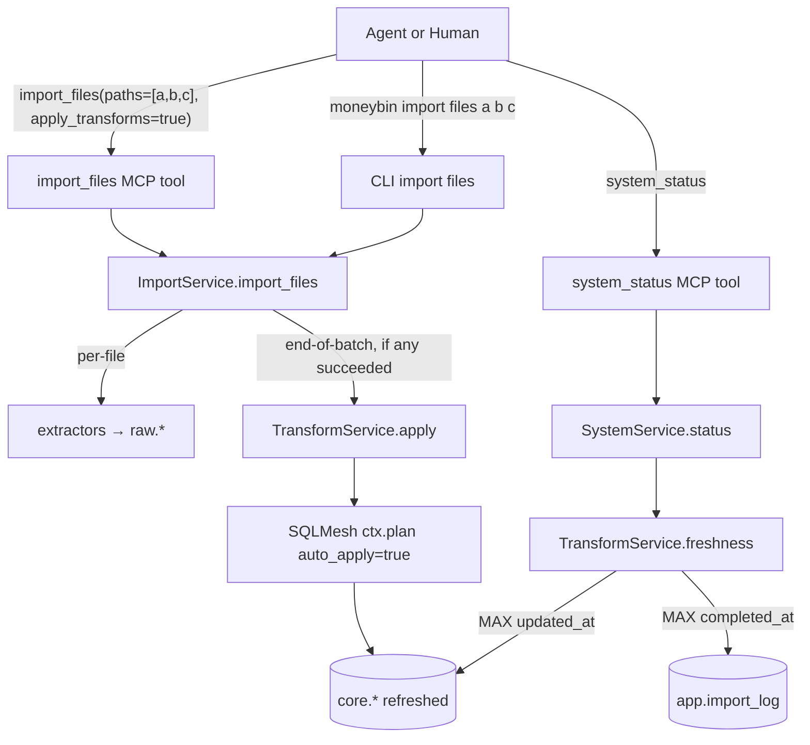

# Feature: Smart Import — Transform Handoff

## Status

draft

## Goal

Close the agent-driven ingest loop. An agent (Claude Code, Codex CLI, MCP client) that imports files today cannot complete the pipeline that makes the data queryable via dim-joined reports: `transform_*` MCP tools are stubs, `import_file` is single-shot, and `system_status` provides no signal that derived tables are stale. This spec ships (a) the five MCP `transform_*` tools the surface spec already documents as planned, (b) a batch-shaped `import_files` tool/CLI that applies transforms once at end-of-batch, and (c) a `transforms` block on `system_status` so staleness is observable without a separate call.

## Background

- **Originating finding:** After importing 5 OFX accounts, `core.dim_accounts` showed only 3 of the 5 — the materialized FULL dim hadn't been refreshed since the most recent imports. `core.fct_transactions` (a view) correctly showed all 5. No surface warning; the FK audit only runs on `sqlmesh run`.
- **MCP-tool-surface spec §1530:** All five transform tools (`status`, `plan`, `validate`, `audit`, `apply`) are already documented as planned MCP exposure. `transform_restate` stays CLI-only per existing operator-territory policy. Today every transform_* tool returns `not_implemented_envelope`.
- **Stub's stated blocker (incorrect):** `src/moneybin/mcp/tools/transform.py` claims "SQLMesh prints to stdout rather than returning structured data; capturing that for MCP envelope shape requires a service layer that's out of scope here." This was pessimistic — SQLMesh's Python API exposes `Plan` objects with `directly_modified`/`indirectly_modified`/`added`/`removed` model sets, plus structured audit results. The service layer is reasonable scope; stdout capture is not required.
- **Existing primitive:** `core.dim_accounts.updated_at` is already set to `CURRENT_TIMESTAMP` at SQLMesh refresh time. Because the table is materialized FULL, every `transform_apply` rewrites every row, so `MAX(updated_at)` ≈ "last transform apply finished at." Comparing that to `MAX(app.import_log.completed_at)` is the staleness heuristic — no SQLMesh-internal coupling required.
- **Related rules:** `.claude/rules/mcp-server.md` (thin tools over services, response envelope, sensitivity tiers), `.claude/rules/cli.md` (CLI is a first-class agent surface; `--output json` parity; non-interactive flag parity), `AGENTS.md` (`run_transforms()` lives in `ImportService` today; moves to the new `TransformService`).

## Requirements

1. Five MCP `transform_*` tools (`status`, `plan`, `validate`, `audit`, `apply`) return structured response envelopes per `mcp-server.md`. `transform_restate` stays CLI-only.
2. `import_file` MCP tool is renamed to `import_files` and accepts `paths: list[str]`. The legacy singular name is removed (pre-1.0; surface-change discipline applied via CHANGELOG and `mcp-tool-surface.md` updates).
3. `import_files` runs `transform_apply` once at end-of-batch by default. Caller opts out by passing `apply_transforms=False`.
4. Per-file failures inside an `import_files` call do not abort the batch. The transform apply runs if at least one file succeeded; skipped if zero succeeded.
5. If `transform_apply` itself fails after successful imports, raw rows stay durable; the envelope reports `transforms_applied=false` with a generic `transforms_error` message and an action hint to retry.
6. `import_inbox_sync` internally builds the discovered-file list and calls the same batch path. New `apply_transforms` parameter on the MCP tool and `--no-apply-transforms` flag on the CLI.
7. CLI command renamed to `moneybin import files PATHS...` (variadic). `--output json` parity for all transform commands and the renamed import command per `cli.md`.
8. `system_status` adds a `transforms` block: `{"pending": bool, "last_apply_at": iso|None}`. Pending heuristic: `MAX(app.import_log.completed_at WHERE status='complete') > MAX(core.dim_accounts.updated_at)`. When pending, `actions` includes a hint to run `transform_apply`. No SQLMesh Context init on the `system_status` hot path.
9. A new `TransformService` owns SQLMesh interaction. `ImportService.run_transforms()` moves here as `TransformService.apply()`; the source-priority seeding and `refresh_views` calls migrate with it. `ImportService` calls `TransformService(db).apply()` at end-of-batch.
10. A scenario test imports multiple files and asserts `MAX(dim_accounts.updated_at)` advances and all imported accounts appear in `accounts_list` — regression guard for the originating finding.
11. Metrics: a new `IMPORT_BATCH_SIZE` histogram per `AGENTS.md` observability requirement. The existing `SQLMESH_RUN_DURATION_SECONDS` is reused; no per-pending gauge (derived signal, not state to scrape).
12. **Schema drift detection** — a wider failure mode than transforms-pending. `core.dim_accounts` (and other FULL-materialized core tables) can have a snapshot built at an older model revision; queries that SELECT columns added in the newer revision fail with binder errors, surfacing as opaque MCP tool failures. Detection runs at FastMCP startup via a single `duckdb_columns()` catalog query and compares observed columns to a static `EXPECTED_CORE_COLUMNS` constant. On mismatch, the server raises `SchemaDriftError`, mapped through `handle_cli_errors()` to a user-facing "run `moneybin transform apply` to rebuild stale models" message. The check is fail-fast at boot for local-first deployments; multi-tenant degraded-mode is a TODO comment, not built now.
13. `system_status` envelope adds a `schema_drift` block: `{"tables": [{name, missing_columns}], "remediation": "moneybin transform apply"}` when the boot-time check finds drift but the server is configured to start anyway, or when re-run on demand. Agents see the problem without invoking a failing tool first.
14. Test coverage for schema drift:
    - Unit test in `tests/moneybin/test_database.py` for the check function (correct/missing-column cases) plus a perf assertion (warm < 2 ms, cold < 5 ms).
    - Fixture-parity test in `tests/moneybin/test_db_helpers_parity.py` asserting `EXPECTED_CORE_COLUMNS == { name: set(columns_from_CORE_*_DDL) }` so the boot guard and test fixtures never silently diverge.
    - Integration test in `tests/integration/test_schema_drift.py` that builds a profile DB, runs the current SQLMesh setup, then `ALTER` drops a column from `core.dim_accounts` (simulates a stale snapshot), starts the server, and asserts `SchemaDriftError` is raised naming the table and column.

## Data Model

No schema changes. The spec leans on three existing columns/tables:

- `core.dim_accounts.updated_at` — already `CURRENT_TIMESTAMP` at SQLMesh refresh.
- `app.import_log.completed_at` (with `status='complete'` filter) — already populated per import.
- SQLMesh state tables — read by `transform_status` only, via SQLMesh's Python API (Context), never on the `system_status` hot path.

## Implementation Plan

### Files to Create

- `src/moneybin/services/transform_service.py` — `TransformService` with `freshness()`, `status()`, `plan()`, `validate()`, `audit()`, `apply()` methods. Owns SQLMesh Context lifecycle for the four state-reading methods; `freshness()` deliberately bypasses Context to keep it cheap.
- `tests/moneybin/test_services/test_transform_service.py` — unit + integration tests for the new service.
- `tests/moneybin/test_mcp/test_transform_tools.py` — envelope-shape and error-path tests for the five MCP tools.
- `tests/moneybin/test_mcp/test_import_files.py` — list-shape, per-file results, transforms_applied flag.
- `tests/moneybin/test_mcp/test_system_status_transforms.py` — pending/last_apply_at semantics.
- `tests/moneybin/test_cli/test_import_files_cli.py` — variadic, `--no-apply-transforms`, `--output json` parity.
- `tests/moneybin/test_cli/test_transform_json_output.py` — `--output json` parity for the five transform commands.
- `tests/scenarios/test_scenario_import_dim_freshness.py` — regression test for the originating finding.
- `tests/integration/test_schema_drift.py` — upgrade-path test: build SQLMesh-applied DB, drop a column, start server, assert `SchemaDriftError`.
- `tests/moneybin/test_db_helpers_parity.py` — fixture-parity test: `EXPECTED_CORE_COLUMNS` matches `CORE_*_DDL` strings in `tests/moneybin/db_helpers.py`.

### Files to Modify

- `src/moneybin/mcp/tools/transform.py` — replace all five stubs with thin wrappers over `TransformService`.
- `src/moneybin/mcp/tools/import_tools.py` — rename `import_file` → `import_files`, take `paths: list[str]`, add `apply_transforms: bool = True`, return per-file rows.
- `src/moneybin/mcp/tools/system.py` — extend `system_status` envelope with the `transforms` block; add the pending-state action hint.
- `src/moneybin/mcp/server.py` — instructions text edits if it names `import_file` directly (per `mcp-server.md` Server Instructions Field rule).
- `src/moneybin/services/import_service.py` — split `import_file()` into `_import_one()` (private) and `import_files()` (public batch). Remove `run_transforms()`; call `TransformService(self._db).apply()` instead.
- `src/moneybin/services/system_service.py` — `SystemStatus` gains `transforms_pending: bool` and `transforms_last_apply_at: datetime | None`. `status()` calls `TransformService(self._db).freshness()`. Also surfaces `schema_drift` info (queried via the boot-time check's cached state or re-run on demand).
- `src/moneybin/database.py` — add `SchemaDriftError`, `EXPECTED_CORE_COLUMNS: dict[str, frozenset[str]]` constant, and a `check_core_schema_drift(db) -> dict[str, list[str]]` function that returns a mapping of `table_name -> list of missing columns` (empty dict means no drift). Constant is the source of truth for each FULL-materialized `core.*` table's expected column set, captured manually from the final SELECT of `sqlmesh/models/core/*.sql`; NOT parsed at runtime.
- `src/moneybin/mcp/server.py` — invoke `check_core_schema_drift()` at FastMCP startup; raise `SchemaDriftError` on mismatch (fail-fast for local-first deployments). Leave a `# TODO multi-tenant:` comment noting degraded-mode is the alternative if we ever go multi-tenant.
- `src/moneybin/cli/_errors.py` (or equivalent error-mapping module) — map `SchemaDriftError` to the user-facing remediation message ("Run `moneybin transform apply` to rebuild stale models. Tables: …").
- `src/moneybin/cli/commands/transform.py` — switch from inline `sqlmesh_context` blocks to `TransformService` calls; add `--output json` to each command using the standard envelope.
- `src/moneybin/cli/commands/import_cmd.py` — rename leaf command, accept variadic paths, add `--no-apply-transforms`.
- `src/moneybin/metrics/registry.py` — add `IMPORT_BATCH_SIZE` histogram.
- `docs/specs/mcp-tool-surface.md` — §1530 status update (transform_* shipped); §import_* renamed entry.
- `docs/specs/INDEX.md` — new row under MCP section, status `draft` → `ready` → `in-progress` → `implemented` across the lifecycle.
- `docs/roadmap.md` — entry under the current milestone.
- `docs/features.md` — MCP tools list + CLI list.
- `CHANGELOG.md` — Added (transform_* tools, system_status transforms block), Changed (`import_file` → `import_files` rename).

### Key Decisions

| Decision | Why |
|---|---|
| Rename MCP `import_file` → `import_files` and CLI `import file` → `import files` | Contract change is real (batch + auto-apply). Agents reading two names get a footgun if surfaces diverge. Pre-1.0 cost of rename is bounded. |
| Auto-apply transforms at end-of-batch by default | Honors "data immediately query-ready" without paying latency per-file. Matches the finding's intent: the agent's mental model is the batch, not the file. |
| Batch boundary = the list passed in one call | Multi-file batches pay one transform cost. Single-file calls still pay it (one-element list). Agents that want to defer pass `apply_transforms=False`. |
| Continue past per-file failures; apply for what succeeded | Matches existing inbox-sync tolerance. One corrupt statement shouldn't block 49 good ones. |
| Use `core.dim_accounts.updated_at` for last-apply timestamp, not SQLMesh `_environments` | No SQLMesh-internal coupling; uses MoneyBin's own data; survives SQLMesh version changes; proves the apply happened rather than asserting a state record. |
| Direct DuckDB query in `freshness()`, no SQLMesh Context init | `system_status` is `read_only=True` and called often for orientation. A Context init has side effects (writes state tables on first init) and multi-second latency. The freshness check is two cheap MAX queries. |
| Move `run_transforms()` from `ImportService` to `TransformService` | Logical home; keeps service boundaries clean. `ImportService` orchestrates; `TransformService` executes the SQLMesh-coupled work. |
| Single PR, not three | PR2 (batch import) and PR3 (system_status signal) are only useful after PR1 (TransformService) lands. Splitting fragments review. Regression test verifies the integrated behavior. |

## CLI Interface

```
moneybin import files PATHS...
  PATHS                              One or more files to import
  --no-apply-transforms              Skip end-of-batch transform apply
  --interactive                      Prompt for ambiguous account mappings
  -o, --output {text,json}           Output format (json mirrors MCP envelope)
  -q, --quiet                        Suppress informational output

moneybin import inbox sync
  --no-apply-transforms              Skip end-of-batch transform apply
  ... (existing flags unchanged)

moneybin transform {status,plan,validate,audit,apply}
  -o, --output {text,json}           Added across all five
  ... (existing flags unchanged)

moneybin transform restate           (unchanged; remains operator-territory)
```

## MCP Interface

```python
@mcp_tool(sensitivity="medium", read_only=False)
def import_files(
    paths: list[str],
    apply_transforms: bool = True,
    interactive: bool = False,
) -> ResponseEnvelope:
    """Import one or more files. Applies transforms once at end of batch by default."""


@mcp_tool(sensitivity="low")
def transform_status() -> ResponseEnvelope: ...


# data: {environment, initialized, last_apply_at, pending, latest_import_at}


@mcp_tool(sensitivity="low")
def transform_plan() -> ResponseEnvelope: ...


# data: {has_changes, directly_modified[], indirectly_modified[], added[], removed[]}


@mcp_tool(sensitivity="low")
def transform_validate() -> ResponseEnvelope: ...


# data: {valid, errors[{model, message}]}


@mcp_tool(sensitivity="low")
def transform_audit(start: str, end: str) -> ResponseEnvelope: ...


# data: {passed, failed, audits[{name, status, detail}]}


@mcp_tool(sensitivity="low", read_only=False)
def transform_apply() -> ResponseEnvelope: ...


# data: {applied, duration_seconds, models_refreshed}
```

`import_inbox_sync` gains the same `apply_transforms: bool = True` parameter for symmetry. No other shape changes to that tool.

`system_status` envelope adds two new blocks (`transforms` always; `schema_drift` only when drift is detected):

```json
{
  "data": {
    "transforms": {"pending": true, "last_apply_at": "2026-05-13T18:24:00Z"},
    "schema_drift": {
      "tables": [{"name": "core.dim_accounts", "missing_columns": ["display_name", "last_four"]}],
      "remediation": "moneybin transform apply"
    }
  },
  "actions": [
    "Run transform_apply to refresh derived tables (raw imports newer than last refresh)",
    "Run transform_apply to rebuild stale models — core.dim_accounts is missing 2 expected columns"
  ]
}
```

The `transforms` action appears only when `pending=true`. The `schema_drift` action appears only when drift is detected.

**Failure mode of schema drift.** When the materialized snapshot of a core table lacks columns that current service code SELECTs (e.g., `AccountService.list_accounts()` references `display_name`/`last_four`/`archived` after a model revision), DuckDB raises a binder error and `accounts_list` / `reports_networth_get` / `accounts_resolve` all fail with opaque "Error calling tool …" envelopes. Drift detection makes the problem loud and actionable at boot rather than surfacing as one-off tool failures.

## Data Flow



## Testing Strategy

| Layer | Test file | Verifies |
|---|---|---|
| Unit | `test_services/test_transform_service.py` | `freshness()` returns correct pending/last_apply_at under controlled `dim_accounts.updated_at` and `import_log.completed_at`. Includes "dim_accounts schema missing" edge case. |
| Integration | `test_services/test_transform_service.py` | `apply()`, `plan()`, `validate()`, `audit()` against a real SQLMesh context. `apply()` increments `MAX(dim_accounts.updated_at)`. |
| Service | `test_services/test_import_service.py` (extended) | `import_files([good, bad, good])` returns 2 imported + 1 failed, transforms ran once, partial failures don't block apply. `apply_transforms=False` skips. Empty-success skips. Transform-fails-after-import path. |
| CLI | `test_cli/test_import_files_cli.py` | Variadic `import files a b c`, `--no-apply-transforms`, `--output json` envelope matches MCP. |
| CLI | `test_cli/test_transform_json_output.py` | `--output json` parity for the five transform commands. |
| MCP | `test_mcp/test_transform_tools.py` | All five `transform_*` envelope shapes, sensitivities, error paths. |
| MCP | `test_mcp/test_import_files.py` | List-shaped `paths`, per-file result rows, `transforms_applied` summary flag. |
| MCP | `test_mcp/test_system_status_transforms.py` | Pending=true when raw is newer; pending=false after apply; action hint appears only when pending. |
| Scenario | `tests/scenarios/test_scenario_import_dim_freshness.py` | **Regression guard for the finding.** Import N files, verify `MAX(dim_accounts.updated_at)` advances and all N accounts appear in `accounts_list`. |
| Unit | `tests/moneybin/test_database.py` (extended) | `check_core_schema_drift()` returns empty for healthy schema, returns missing-columns map when a column is dropped. Perf assertion: warm < 2 ms, cold < 5 ms. |
| Unit | `tests/moneybin/test_db_helpers_parity.py` | `EXPECTED_CORE_COLUMNS == { name: set(columns_from_CORE_*_DDL) }` — guards against the boot guard and test fixtures diverging. |
| Integration | `tests/integration/test_schema_drift.py` | Upgrade-path test: build SQLMesh-applied DB, `ALTER` drops a column, start server, assert `SchemaDriftError` raised naming table + missing column. |

## Dependencies

- SQLMesh Python API (already a dependency): `Context.plan_builder()`, `Plan` object, `Context.audit()`.
- No new packages.

## Out of Scope

- `prep.stg_plaid__accounts` errors when the Plaid raw schema is empty/absent. Tracked separately as a staging-view-resilience follow-up.
- Adding `updated_at` row metadata to `fct_transactions`, `dim_categories`, `dim_merchants` for consistency with `dim_accounts`. Tracked separately; not needed by this spec (only `dim_accounts.updated_at` is read).
- `transform_restate` MCP exposure — remains CLI-only per existing operator-territory policy in `mcp-tool-surface.md`.
- Scheduled/cron-style transform reruns — not needed once batch-boundary auto-apply works.
- Capturing SQLMesh stdout. The Python API provides structured objects; stdout capture is neither attempted nor required.
- Auto-running transforms on schema-drift detection. The `transform_apply` MCP/CLI surface this spec ships is the remediation path; drift detection only makes the problem loud and actionable.
- Parsing SQLMesh model SQL at runtime to derive `EXPECTED_CORE_COLUMNS`. The constant is captured manually from the final SELECT of each `sqlmesh/models/core/*.sql`; the fixture-parity test guards against drift between the constant and the test DDL.
- Drift detection on `raw.*`, `prep.*`, or `app.*` schemas. Only `core.*` is checked — `raw`/`prep` aren't read by services, and `app.*` schema changes flow through the migrations subsystem.
- Multi-tenant degraded-mode (per-request `schema_drift` error envelopes instead of refusing to boot). Leave a `# TODO multi-tenant:` comment; don't build it.
