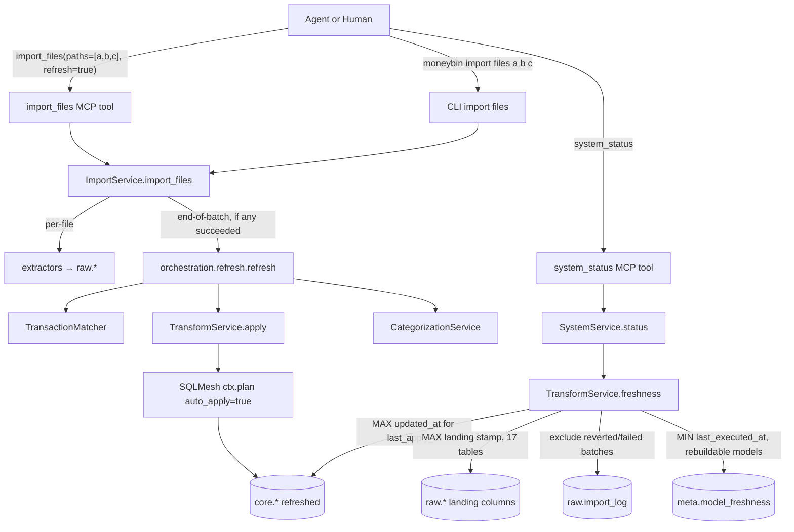

# Feature: Smart Import — Transform Handoff

## Status

implemented

## Goal

Close the agent-driven ingest loop. An agent (Claude Code, Codex CLI, MCP client) imports files through the batch-shaped `import_files` entry, which runs the refresh pipeline once at end-of-batch. `system_status` reports whether derived tables are stale, and `refresh_run(steps=["transform"])` is the MCP path for an explicit SQLMesh apply.

## Background

- **Originating finding:** After importing 5 OFX accounts, `core.dim_accounts` showed only 3 of the 5 — the materialized FULL dim hadn't been refreshed since the most recent imports. `core.fct_transactions` (a view) correctly showed all 5. No surface warning; the FK audit only runs on `sqlmesh run`.
- **Existing primitive:** every raw table already carries a landing stamp (`loaded_at`, `created_at`, or `extracted_at`), and SQLMesh already records, per model, the intervals it actually backfilled. Comparing the newest landing stamp against the *least recently built* model is the staleness heuristic. The original form compared `MAX(raw.import_log.completed_at)` against `MAX(core.dim_accounts.updated_at)`; PR #366 replaced it, because a dim-derived signal is blind to every source that does not write `dim_accounts` — manual entry among them. PR #366's own form read `sqlmesh._environments.finalized_ts`, which SQLMesh advances on *any* promotion of `prod`: restating one unrelated model reported the whole warehouse fresh. The apply side is now per-model, so a model nobody rebuilt keeps its true age.
- **Related rules:** `.claude/rules/mcp.md` (thin tools over services, response envelope, sensitivity tiers), `.claude/rules/cli.md` (CLI is a first-class agent surface; `--output json` parity; non-interactive flag parity), `AGENTS.md` (`run_transforms()` lives in `ImportService` today; moves to the new `TransformService`).

## Requirements

1. `refresh_run(steps=["transform"])` returns the standard response envelope for an explicit SQLMesh apply. The CLI keeps `moneybin transform apply` as an operator entry point.
2. `import_files` accepts `paths: list[str]`.
3. `import_files` runs the full `gsheet → match → transform → categorize → identity` refresh pipeline once at end-of-batch by default via `orchestration/refresh.py`. Caller opts out by passing `refresh=False`.
4. Per-file failures inside an `import_files` call do not abort the batch. The refresh runs if at least one file succeeded; skipped if zero succeeded.
5. If the refresh itself fails after successful imports, raw rows stay durable; the envelope reports `transforms_applied=false` with a generic error message and an action hint to retry.
6. `import_inbox_sync` internally builds the discovered-file list and calls the same batch path. New `refresh` parameter on the MCP tool and `--no-refresh` flag on the CLI.
7. CLI command renamed to `moneybin import files PATHS...` (variadic). `--output json` parity for all transform commands and the renamed import command per `cli.md`.
8. `system_status` adds a `transforms` block: `{"pending": bool, "last_apply_at": iso|None}`. Pending heuristic: the newest landing stamp across all 17 raw tables a SQLMesh model reads (`_RAW_LANDING_COLUMNS`, guarded set-equal against `raw_tables_read_by_models()`) is newer than `MIN(last_executed_at)` over the rows of `meta.model_freshness` a refresh actually rebuilds (`_UNREBUILT_MODEL_KINDS` excludes the symbolic kinds plus `VIEW` and `SEED`) — the oldest model execution, so an untouched model holds the comparison down. Rows belonging to a reverted or failed `raw.import_log` batch are excluded. When pending, `actions` includes a hint to run `refresh_run`. No SQLMesh Context init on the `system_status` hot path.
9. A new `TransformService` owns SQLMesh interaction. `TransformService.apply()` replaces the prior inline transform call; source-priority seeding and `refresh_views` calls migrate with it. `ImportService` invokes the full refresh pipeline via `orchestration.refresh.refresh(db)` at end-of-batch (PR #151), which calls `TransformService(db).apply()` along with matching and categorization steps. `ImportService.run_transforms()` is retained as a thin compatibility shim.
10. A scenario test imports multiple files and asserts `MAX(dim_accounts.updated_at)` advances and all imported accounts appear in `accounts` — regression guard for the originating finding.
11. Metrics: a new `IMPORT_BATCH_SIZE` histogram per `AGENTS.md` observability requirement. The existing `SQLMESH_RUN_DURATION_SECONDS` is reused; no per-pending gauge (derived signal, not state to scrape).
12. **Schema drift detection with self-heal** — a wider failure mode than transforms-pending. `core.dim_accounts` (and other FULL-materialized core tables) can have a snapshot built at an older model revision; queries that SELECT columns added in the newer revision fail with binder errors, surfacing as opaque MCP tool failures. Detection runs at FastMCP startup via a single `duckdb_columns()` catalog query and compares observed columns to a static `EXPECTED_CORE_COLUMNS` constant. On mismatch, the server runs one synchronous `TransformService.apply()` self-heal attempt, then re-verifies on a fresh read-only connection — closing the chicken-and-egg where the recovery path lives inside a server that won't boot. Extended in PR #146/#156 to also self-heal SQLMesh drift and stuck migrations at MCP boot. Plain apply is used deliberately: SQLMesh's restatement mode explicitly ignores local file changes (per `Context.plan_builder` docstring), so it would no-op against the very fingerprint-change drift the heal needs to fix. Persistent drift after the heal raises `SchemaDriftError("Stale materialized snapshots persist after auto-heal: ...")`; a soft-failed apply raises `SchemaDriftError("Auto-heal failed: ...")` carrying the SQLMesh error type name. Both branches route through `classify_user_error()`'s `schema_drift` hint pointing at `moneybin transform apply`, so users get a clean message rather than a stack trace. Single-tenant policy; multi-tenant degraded-mode is a TODO comment, not built now.
13. `system_status` envelope adds a `schema_drift` block: `{"tables": [{name, missing_columns}], "remediation": "moneybin transform apply"}` when the boot-time check finds drift but the server is configured to start anyway, or when re-run on demand. Agents see the problem without invoking a failing tool first.
14. Test coverage for schema drift:
    - Unit test in `tests/moneybin/test_database.py` for the check function (correct/missing-column cases) plus a perf assertion (warm < 2 ms, cold < 5 ms).
    - Fixture-parity test in `tests/moneybin/test_db_helpers_parity.py` asserting `EXPECTED_CORE_COLUMNS == { name: set(columns_from_CORE_*_DDL) }` so the boot guard and test fixtures never silently diverge.
    - Integration test in `tests/integration/test_schema_drift.py` that builds a profile DB, runs the current SQLMesh setup, simulates live-view drift, starts the server, asserts the self-heal `apply()` runs under a real SQLMesh context, and asserts `SchemaDriftError("...persist after auto-heal")` when the simulation cannot be resolved (tampered-view scenarios are detect-and-escalate by design; real fingerprint-change drift heals fully via the unit-test mocked-apply path).

## Data Model

No schema changes. The spec leans on three existing columns/tables:

- Raw landing stamps — `loaded_at`, `created_at`, or `extracted_at`, one per raw table, already populated by each loader.
- `raw.import_log` — `completed_at` (with `status='complete'`) drives `latest_import_at`; `status IN ('reverted','failed')` excludes abandoned batches from the landing scan.
- `meta.model_freshness.last_executed_at` — per-model backfill time, sourced from `sqlmesh._intervals`; read by a direct `SELECT` on the `system_status` hot path. Context init stays off that path; it costs seconds and opens a second state connection.

## Implementation Plan

### Files to Create

- `src/moneybin/services/transform_service.py` — `TransformService` with `freshness()` and `apply()` methods. Owns SQLMesh Context lifecycle for apply; `freshness()` deliberately bypasses Context to keep it cheap.
- `src/moneybin/orchestration/refresh.py` — `refresh()` umbrella that runs `gsheet → match → transform → categorize → identity` in canonical order. Re-exposed at the MCP layer as `refresh_run` with optional `steps=` scoping.
- `src/moneybin/mcp/tools/refresh.py` — `refresh_run` MCP tool wrapping the refresh umbrella (PR #165/#173).
- `tests/moneybin/test_services/test_transform_service.py` — unit + integration tests for the new service.
- `tests/moneybin/test_mcp/test_transform_tools.py` — envelope-shape and error-path tests for the refresh-backed MCP path.
- `tests/moneybin/test_mcp/test_import_files.py` — list-shape, per-file results, transforms_applied flag.
- `tests/moneybin/test_mcp/test_system_status_transforms.py` — pending/last_apply_at semantics.
- `tests/moneybin/test_cli/test_import_files_cli.py` — variadic, `--no-refresh`, `--output json` parity.
- `tests/moneybin/test_cli/test_transform_json_output.py` — `--output json` parity for the transform CLI commands.
- `tests/scenarios/test_scenario_import_dim_freshness.py` — regression test for the originating finding.
- `tests/integration/test_schema_drift.py` — upgrade-path test: build SQLMesh-applied DB, drop a column, start server, assert `SchemaDriftError`.
- `tests/moneybin/test_db_helpers_parity.py` — fixture-parity test: `EXPECTED_CORE_COLUMNS` matches `CORE_*_DDL` strings in `tests/moneybin/db_helpers.py`.

### Files to Modify

- `src/moneybin/mcp/tools/refresh.py` — expose the refresh umbrella as `refresh_run(steps=["transform"])` for SQLMesh-only runs.
- `src/moneybin/mcp/tools/import_tools.py` — expose `import_files` with `paths: list[str]`, `refresh: bool = True`, and per-file rows.
- `src/moneybin/mcp/tools/system.py` — extend `system_status` envelope with the `transforms` block; add the pending-state action hint.
- `src/moneybin/mcp/server.py` — keep server instructions aligned with the batch import entry (per `mcp.md` Server Instructions Field rule).
- `src/moneybin/services/import_service.py` — end-of-batch refresh routes through `orchestration.refresh.refresh(self._db)`, which invokes `TransformService.apply()` along with matching and categorization.
- `src/moneybin/services/system_service.py` — `SystemStatus` gains `transforms_pending: bool` and `transforms_last_apply_at: datetime | None`. `status()` calls `TransformService(self._db).freshness()`. Also surfaces `schema_drift` info (queried via the boot-time check's cached state or re-run on demand).
- `src/moneybin/database.py` — add `SchemaDriftError`, `EXPECTED_CORE_COLUMNS: dict[str, frozenset[str]]` constant, and a `check_core_schema_drift(db) -> dict[str, list[str]]` function that returns a mapping of `table_name -> list of missing columns` (empty dict means no drift). Constant is the source of truth for each FULL-materialized `core.*` table's expected column set, captured manually from the final SELECT of `src/moneybin/sqlmesh/models/core/*.sql`; NOT parsed at runtime.
- `src/moneybin/mcp/server.py` — invoke `check_core_schema_drift()` at FastMCP startup; on mismatch, run one `TransformService.apply()` self-heal, then re-verify and raise `SchemaDriftError` only if drift persists. Leave a `# TODO multi-tenant:` comment noting degraded-mode is the alternative if we ever go multi-tenant.
- `src/moneybin/cli/_errors.py` (or equivalent error-mapping module) — map `SchemaDriftError` to the user-facing remediation message ("Run `moneybin transform apply` to rebuild stale models. Tables: …").
- `src/moneybin/cli/commands/transform.py` — switch from inline `sqlmesh_context` blocks to `TransformService` calls; add `--output json` to each command using the standard envelope.
- `src/moneybin/cli/commands/import_cmd.py` — rename leaf command, accept variadic paths, add `--no-refresh`.
- `src/moneybin/metrics/registry.py` — add `IMPORT_BATCH_SIZE` histogram.
- `docs/specs/moneybin-mcp.md` — status update for the refresh-backed transform workflow and batch import entry.
- `docs/specs/INDEX.md` — new row under MCP section, status `draft` → `ready` → `in-progress` → `implemented` across the lifecycle.
- `docs/roadmap.md` — entry under the current milestone.
- `docs/features.md` — MCP tools list + CLI list.
- `CHANGELOG.md` — record the batch import entry and `system_status` transforms block.

### Key Decisions

| Decision | Why |
|---|---|
| Batch-shaped MCP and CLI import | The list-shaped contract runs one refresh at the batch boundary and keeps both surfaces aligned. |
| Auto-apply transforms at end-of-batch by default | Honors "data immediately query-ready" without paying latency per-file. Matches the finding's intent: the agent's mental model is the batch, not the file. |
| Batch boundary = the list passed in one call | Multi-file batches pay one transform cost. Single-file calls still pay it (one-element list). Agents that want to defer pass `refresh=False`. |
| Continue past per-file failures; apply for what succeeded | Matches existing inbox-sync tolerance. One corrupt statement shouldn't block 49 good ones. |
| Use `core.dim_accounts.updated_at` for the `last_apply_at` field | Avoids SQLMesh-internal coupling on a display value and proves an apply rewrote rows rather than asserting a state record. Applies to that field only: PR #366 moved the `pending` comparison off the dim, because a FULL-materialized dim advances only when accounts change, so it under-reports staleness for sources that touch no account. The two fields now read different clocks. |
| Compare against the *oldest* model execution, not the newest promotion | SQLMesh finalizes the environment on every promotion of `prod`, so `_environments.finalized_ts` advances when a selective plan rebuilds one model and nothing else — `transform restate --model` made the whole warehouse read fresh. `MIN(last_executed_at)` is the age of the least-recently-built model, which no selective plan can raise on its own. Cost: one never-backfilled model pins `pending` true until it builds, which is the correct reading of a half-built warehouse. |
| Take that minimum only over the kinds a refresh rebuilds | Two kinds of frozen stamp would otherwise pin `pending` true forever. EXTERNAL and EMBEDDED are symbolic — SQLMesh never executes them, so `last_executed_at` is permanently NULL, and every table `external_models.yaml` declares is EXTERNAL. VIEW and SEED do execute, but only on the *first* apply: `apply()` restates the FULL models and SQLMesh re-runs nothing whose interval is already complete, so a view's stamp freezes at the first build. Neither is a real staleness signal — a view is recomputed at query time, and a seed reads no `raw.*` table. The filter is on the kind, not on a `raw.%` name test, so it stays right if a source moves schemas. |
| Direct DuckDB query in `freshness()`, no SQLMesh Context init | `system_status` is `read_only=True` and called often for orientation. A Context init has side effects (writes state tables on first init) and multi-second latency. The freshness check is one 17-arm `UNION ALL` over raw landing columns plus one `SELECT` against `meta.model_freshness` — index-free `MAX`/`MIN` scans on columns the loaders and SQLMesh already write. |
| Move `run_transforms()` from `ImportService` to `TransformService` | Logical home; keeps service boundaries clean. `ImportService` orchestrates; `TransformService` executes the SQLMesh-coupled work. |
| Single PR, not three | PR2 (batch import) and PR3 (system_status signal) are only useful after PR1 (TransformService) lands. Splitting fragments review. Regression test verifies the integrated behavior. |

## CLI Interface

```
moneybin import files PATHS...
  PATHS                              One or more files to import
  --no-refresh              Skip end-of-batch transform apply
  -o, --output {text,json}           Output format (json mirrors MCP envelope)
  -q, --quiet                        Suppress informational output

moneybin import inbox
  (sync is the default callback; refresh runs unconditionally — no --no-refresh flag)
  ... (existing flags unchanged)

moneybin transform {status,plan,validate,audit,apply}
  -o, --output {text,json}           Added across all five
  ... (existing flags unchanged)

moneybin transform restate           (unchanged; remains operator-territory)
```

## MCP Interface

```python
@mcp_tool(read_only=False, idempotent=False)
def import_files(
    paths: list[str],
    refresh: bool = True,
    force: bool = False,
) -> ResponseEnvelope:
    """Import one or more files. Applies refresh once at the batch boundary."""


@mcp_tool(read_only=False)
def refresh_run(steps: list[str] | None = None) -> ResponseEnvelope: ...


# steps=["transform"] limits the refresh umbrella to SQLMesh apply.
```

`import_inbox_sync` gains the same `refresh: bool = True` parameter for symmetry. No other shape changes to that tool.

`system_status` envelope adds two new blocks (`transforms` always; `schema_drift` only when drift is detected):

```json
{
  "data": {
    "transforms": {"pending": true, "last_apply_at": "2026-05-13T18:24:00Z"},
    "schema_drift": {
      "tables": [{"name": "core.dim_accounts", "missing_columns": ["display_name", "last_four"]}],
      "remediation": "moneybin transform apply"
    }
  },
  "actions": [
    "Run refresh_run to refresh derived tables (raw imports newer than last refresh)",
    "Run refresh_run (or moneybin transform apply) to rebuild stale models — core.dim_accounts is missing 2 expected columns"
  ]
}
```

The `transforms` action appears only when `pending=true`. The `schema_drift` action appears only when drift is detected.

**Failure mode of schema drift.** When the materialized snapshot of a core table lacks columns that current service code selects (for example, an account projection needs `display_name`, `last_four`, and `archived` after a model revision), DuckDB raises a binder error and user-facing reads fail with opaque envelopes. Drift detection makes the problem loud and actionable at boot rather than surfacing as one-off tool failures.

## Data Flow


```mermaid
flowchart TD
    Agent[Agent or Human]

    Agent -->|"import_files(paths=[a,b,c], refresh=true)"| MCP_IF[import_files MCP tool]
    Agent -->|"moneybin import files a b c"| CLI_IF[CLI import files]
    MCP_IF --> IS[ImportService.import_files]
    CLI_IF --> IS
    IS -->|per-file| EX[extractors → raw.*]
    IS -->|"end-of-batch, if any succeeded"| RF[orchestration.refresh.refresh]
    RF --> Match[TransactionMatcher]
    RF --> TS_A[TransformService.apply]
    RF --> Cat[CategorizationService]
    TS_A --> SQLM[SQLMesh ctx.plan auto_apply=true]
    SQLM --> Core[(core.* refreshed)]

    Agent -->|system_status| SS[system_status MCP tool]
    SS --> SSvc[SystemService.status]
    SSvc --> TSF[TransformService.freshness]
    TSF -->|MAX updated_at for last_apply_at| Core
    TSF -->|MAX landing stamp, 17 tables| RawL[(raw.* landing columns)]
    TSF -->|exclude reverted/failed batches| ImpLog[(raw.import_log)]
    TSF -->|MIN last_executed_at, rebuildable models| SMState[(meta.model_freshness)]
```

## Testing Strategy

| Layer | Test file | Verifies |
|---|---|---|
| Unit | `test_services/test_transform_service.py` | `freshness()` returns correct pending/last_apply_at under controlled raw landing stamps and `meta.model_freshness.last_executed_at`. Covers a missing raw table, a missing `import_log`, an unreadable freshness view, a never-backfilled model, symbolic kinds that never execute, VIEW/SEED kinds a refresh never rebuilds, and set-equality of `_RAW_LANDING_COLUMNS` against `raw_tables_read_by_models()`. |
| Integration | `test_scenario_selective_plan_freshness.py` | A real `restate` plan on one unrelated model leaves `pending` true while other models still hold pre-import data; a real second import+refresh clears it (the fail-closed half). |
| Integration | `test_services/test_transform_service.py` | SQLMesh apply against a real context increments `MAX(dim_accounts.updated_at)`. |
| Service | `test_services/test_import_service.py` (extended) | `import_files([good, bad, good])` returns 2 imported + 1 failed, transforms ran once, partial failures don't block apply. `refresh=False` skips. Empty-success skips. Transform-fails-after-import path. |
| CLI | `test_cli/test_import_files_cli.py` | Variadic `import files a b c`, `--no-refresh`, `--output json` envelope matches MCP. |
| CLI | `test_cli/test_transform_json_output.py` | `--output json` parity for the transform CLI commands. |
| MCP | `test_mcp/test_transform_tools.py` | `refresh_run(steps=["transform"])` returns the refresh-backed apply envelope and error paths. |
| MCP | `test_mcp/test_import_files.py` | List-shaped `paths`, per-file result rows, `transforms_applied` summary flag. |
| MCP | `test_mcp/test_system_status_transforms.py` | Pending=true when raw is newer; pending=false after apply; action hint appears only when pending. |
| Scenario | `tests/scenarios/test_scenario_import_dim_freshness.py` | **Regression guard for the finding.** Import N files, verify `MAX(dim_accounts.updated_at)` advances and all N accounts appear in `accounts`. |
| Unit | `tests/moneybin/test_database.py` (extended) | `check_core_schema_drift()` returns empty for healthy schema, returns missing-columns map when a column is dropped. Perf assertion: warm < 2 ms, cold < 5 ms. |
| Unit | `tests/moneybin/test_db_helpers_parity.py` | `EXPECTED_CORE_COLUMNS == { name: set(columns_from_CORE_*_DDL) }` — guards against the boot guard and test fixtures diverging. |
| Integration | `tests/integration/test_schema_drift.py` | Upgrade-path test: build SQLMesh-applied DB, `ALTER` drops a column, start server, assert `SchemaDriftError` raised naming table + missing column. |

## Dependencies

- SQLMesh Python API (already a dependency): `Context.plan_builder()`, `Plan` object, `Context.audit()`.
- No new packages.

## Out of Scope

- `prep.stg_plaid__accounts` errors when the Plaid raw schema is empty/absent. Tracked separately as a staging-view-resilience follow-up.
- Adding `updated_at` row metadata to `fct_transactions`, `dim_categories`, `dim_merchants` for consistency with `dim_accounts`. Tracked separately; not needed by this spec (only `dim_accounts.updated_at` is read).
- Separate transform MCP identities. The user-intent path is `refresh_run` (full cascade) or `refresh_run(steps=["transform"])` (SQLMesh apply only); the operator-territory path is `moneybin transform apply` CLI.
- Scheduled/cron-style transform reruns — not needed once batch-boundary auto-apply works.
- Capturing SQLMesh stdout. The Python API provides structured objects; stdout capture is neither attempted nor required.
- Auto-running transforms on schema-drift detection. The refresh MCP path and `moneybin transform apply` CLI command are the remediation paths; drift detection only makes the problem loud and actionable.
- Parsing SQLMesh model SQL at runtime to derive `EXPECTED_CORE_COLUMNS`. The constant is captured manually from the final SELECT of each `src/moneybin/sqlmesh/models/core/*.sql`; the fixture-parity test guards against drift between the constant and the test DDL.
- Drift detection on `raw.*`, `prep.*`, or `app.*` schemas. Only `core.*` is checked — `raw`/`prep` aren't read by services, and `app.*` schema changes flow through the migrations subsystem.
- Multi-tenant degraded-mode (per-request `schema_drift` error envelopes instead of refusing to boot). Leave a `# TODO multi-tenant:` comment; don't build it.
