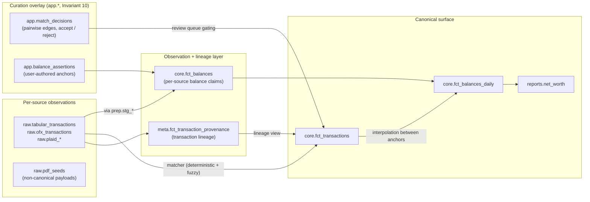

# Architecture: Source Observations

## Status

- **Type:** Architecture
- **Status:** draft
- **Address:** M1M (per [`docs/roadmap.md`](../roadmap.md))
- **Authority:** Positioning doc. **This spec introduces no new primitives.** It names where MoneyBin's source-observation primitives already live so that future agents and the Web UI do not re-derive them as a parallel `core.*` layer, a parallel `app.*` curation overlay, or in-memory client state. The schema and behaviors it points at are owned by other specs ([`architecture-shared-primitives.md`](architecture-shared-primitives.md), [`matching-overview.md`](matching-overview.md), [`reports-net-worth.md`](reports-net-worth.md), [`app-integrity-invariant.md`](app-integrity-invariant.md), [`data-recovery-contract.md`](data-recovery-contract.md)).

## Goal

Make the existing source-observation surface discoverable under a single name. Define what a "source observation" is in MoneyBin, point at the canonical home of each kind, and forbid parallel layers. The Web UI surfaced in `web-ui-prototype.md` (planned, not yet drafted) will render a two-ledger reconcile view ("what each source said" next to "what MoneyBin canonically records"); without this doc, that work is at material risk of inventing an `app.observations` table or a `core.fct_source_observations` parallel to primitives that already exist. That would be the "two patterns for the same job" failure mode flagged as the largest source of codebase rot in [`.claude/rules/design-principles.md`](../../.claude/rules/design-principles.md).

## Background

The roadmap row at M1M originally read as a planned data-model spec ("statement observations, balance anchors, bank-only rows — warehouse-native, not Web-UI-only state"). Implementation status across the cited specs shows the data model is already shipped under different names:

- Transaction-grain observations + lineage live in `raw.*` tables (one row per source claim) plus `meta.fct_transaction_provenance` (one row per canonical-transaction ↔ contributing-raw-row pair). Defined in [`matching-overview.md`](matching-overview.md) and [`matching-same-record-dedup.md`](matching-same-record-dedup.md); shipped via PRs #43/#46.
- Balance-grain observations live in `core.fct_balances` (per-observation, normalized across OFX statement balances, tabular running balances, and user assertions) plus `core.fct_balances_daily` (daily carry-forward with `reconciliation_delta`). Defined in [`reports-net-worth.md`](reports-net-worth.md) §Data Model; shipped.
- The M:N curation overlay between source-observed rows and canonical records lives in `app.match_decisions` (pairwise edges with `match_status ∈ {pending, accepted, rejected}`, auto-merge ≥0.95, review queue 0.70–0.95, drop <0.70). Defined in [`matching-overview.md`](matching-overview.md) §"Default automation posture"; shipped, with N-way collapse extended in [`matching-nway-dedup.md`](matching-nway-dedup.md).
- The user-authored anchor curation overlay for balances lives in `app.balance_assertions`. Defined in [`reports-net-worth.md`](reports-net-worth.md) §Data Model; shipped.
- The review surface for ambiguous matcher decisions lives in `transactions_matches_pending` / `transactions_matches_set` MCP tools and `moneybin transactions review --type matches` CLI. Framed in [`matching-overview.md`](matching-overview.md) §"Match review UX"; the current MCP API (consolidated to `_pending` / `_set`) is specified in [`matching-nway-dedup.md`](matching-nway-dedup.md) Requirements 11–12.
- The balance-drift surface lives in `core.fct_balances_daily.reconciliation_delta` plus the `accounts_balance_reconcile` MCP tool and `moneybin accounts balance reconcile` CLI. Defined in [`reports-net-worth.md`](reports-net-worth.md) §CLI Interface and §MCP Interface.
- Audit and reversibility on every mutation to `app.match_decisions` and `app.balance_assertions` are covered by Invariant 10 (mutation routing through `*Repo` classes that emit paired `app.audit_log` rows in the same DuckDB transaction) per [`app-integrity-invariant.md`](app-integrity-invariant.md), and Invariant 11 (recoverability of mutations via `system_audit_undo`) introduced in [`data-recovery-contract.md`](data-recovery-contract.md) (in-progress; M1L).

A new `core.fct_source_observations` table would shadow `meta.fct_transaction_provenance` plus the `raw.*` layer. A new `core.bridge_transaction_observations` table would shadow `app.match_decisions`. A new `app.observations` curation overlay would shadow both `app.match_decisions` and `app.balance_assertions`. None of these adds expressiveness; each subtracts coherence and forces every consumer query to handle two sources for the same fact.

This doc therefore takes a different shape than a feature spec: it carries no Requirements, no Data Model DDL, no Implementation Plan. Its job is to name primitives that already exist, give consumers a read map, and lock the boundary.

## What an "observation" is in MoneyBin

A **source observation** is a per-source factual claim that MoneyBin records and later reconciles against a canonical record. Three kinds exist today:

1. **Transaction observations** — "the bank, aggregator, or import file said this transaction occurred on this date for this amount on this account." Grain: one row per raw extractor output. Carries `source_type`, `source_origin`, `source_transaction_id` per the taxonomy defined in [`matching-overview.md`](matching-overview.md).
2. **Balance observations** — "the bank, aggregator, import file, or user said this account had this balance on this date." Grain: one row per per-source balance claim. Carries `(account_id, balance_date, source_type, source_ref)` per [`reports-net-worth.md`](reports-net-worth.md) §`core.fct_balances`.
3. **Non-canonical payloads** — semi-structured content from a source that does not fit transaction or balance shape (e.g., a PDF end-of-statement summary block, a W-2 field set, a freeform sheet snapshot). Grain: one row per source extraction; stored in `raw.pdf_seeds` (JSON) with auto-generated typed views per the seed pattern in [`connect-gsheet.md`](connect-gsheet.md). Used by [`smart-import-pdf.md`](smart-import-pdf.md).

Observations are raw-row-level claims plus their lineage. They are *not* the canonical record. The canonical record is computed from observations by matching, merging, and interpolation. The point of two-ledger reconciliation is that observations and canonical records coexist as queryable layers; consumers reading `core.fct_transactions` or `core.fct_balances_daily` get the canonical view, and consumers reading `meta.fct_transaction_provenance` or `core.fct_balances` get the per-source view, and the two are reconcilable row-by-row.

## Canonical homes

The table below is the load-bearing artifact of this doc. Future agents grepping for "source observations", "bank-only rows", "balance anchors", or "two-ledger" must land here and follow the pointers to existing specs rather than designing new tables.

| Observation kind | Per-source claim lives in | Lineage / observation layer | User-authored curation overlay | Canonical surface (consumer reads) |
|---|---|---|---|---|
| **Transaction** (transaction-grain claim) | `raw.tabular_transactions`, `raw.ofx_transactions`, `raw.plaid_*` — every row carries `source_type`, `source_origin`, `source_transaction_id` | `meta.fct_transaction_provenance` — one row per (canonical_txn, contributing_raw_row); rebuilt deterministically by SQLMesh from `app.match_decisions` joined to the contributing `raw.*` rows | `app.match_decisions` — pairwise edges with `match_status ∈ {pending, accepted, rejected}` plus `reversed_at`; auto-merge ≥0.95, review queue 0.70–0.95, drop <0.70; mutations routed through `MatchDecisionsRepo` per Invariant 10 | `core.fct_transactions` (canonical row per real-world transaction, with `canonical_source_type`, `source_count`, `match_confidence`, `is_transfer`, `transfer_pair_id`). Review surface: `transactions_matches_pending` / `_set` MCP, `moneybin transactions review --type matches` CLI |
| **Balance** (point-in-time balance claim) | `prep.stg_ofx__balances` (institution statement balances) and `prep.stg_tabular__transactions.balance` (CSV/TSV/Excel/Parquet running-balance columns). Plaid balance snapshots are a tracked extension (see [Genuine gaps](#genuine-gaps-tracked-as-followups)) | `core.fct_balances` (VIEW) unions all per-source claims plus `app.balance_assertions` from the curation column into a normalized shape `(account_id, balance_date, balance, source_type, source_ref)`; precedence within a day: user assertion > institution snapshot > tabular running balance | `app.balance_assertions` — user-authored anchors; mutations routed through `BalanceAssertionsRepo` per Invariant 10 | `core.fct_balances_daily` (TABLE; daily carry-forward with `is_observed`, `observation_source`, `reconciliation_delta`); `reports.net_worth` (cross-account aggregate). Drift surface: `accounts_balance_reconcile` MCP, `moneybin accounts balance reconcile` CLI |
| **Non-canonical payload** (PDF summary block, freeform sheet, etc.) | `raw.pdf_seeds` (JSON) plus auto-generated typed views per [`connect-gsheet.md`](connect-gsheet.md) seed pattern; lineage via `(alias, row_hash, source_file, import_id, loaded_at)` carried on the raw row, with `import_id` foreign-keying to `raw.import_log` | No separate lineage layer — the raw row is the observation, queried directly via the generated view or `sql_query` MCP tool | None today (read-only payload; no curation surface needed until a consumer requires one) | Queryable via the generated typed view or the `sql_query` tool. Not pivoted into a canonical `core.*` fact unless and until a consumer requires it |

### Mermaid view of the layering

## Things this doc explicitly forbids

Any of these would shadow a primitive that already exists. Reviewers should reject changes that introduce them:

- **No `core.fct_source_observations`** — its job (per-source transaction claims plus lineage) is covered by `raw.*` for the per-source claim and `meta.fct_transaction_provenance` for the lineage view.
- **No `core.fct_balance_anchors`** — balance observations live in `core.fct_balances` (institution/file-derived per-source claims) and user-authored anchors live in `app.balance_assertions` (Invariant 10-routed curation). Both layers already exist as named primitives; a new `core.fct_balance_anchors` would shadow one or both.
- **No `core.bridge_transaction_observations`** — its job (M:N between source-observed rows and canonical transactions) is `app.match_decisions` for the curation-bearing edges and `meta.fct_transaction_provenance` for the derived view.
- **No `app.transaction_observation_links`** or `app.observations` curation overlay — review state, accept/reject lifecycle, audit, and reversibility already exist in `app.match_decisions` and `app.balance_assertions`. A second mutable observation overlay would force every reviewer to choose which one is authoritative.
- **No per-transaction "accept this row" review queue.** Per the matching-overview default automation posture, high-confidence claims auto-merge; only matcher-ambiguous claims and balance-anchor drift surface for human review. The review queue is the matcher's escape hatch, not a confirmation gate on every imported row.
- **No app-state-only observation store in the Web UI.** The Web UI must read from the primitives above. Inventing a client-side `observations` model that diverges from the warehouse layer breaks the doctor checks, the audit log, and `system_audit_undo`.

## Review semantics — where ambiguity goes, where it does not

The review queue is narrow and well-defined. It carries:

1. **Matcher-pending edges** (0.70 ≤ confidence < 0.95) — fuzzy same-record-dedup pairs and every transfer-detection candidate. Surfaced via `transactions_matches_pending` MCP and `moneybin transactions review --type matches` CLI.
2. **Balance reconciliation drift** — per-day deltas where transactions do not account for the change between consecutive anchors. Surfaced via `accounts_balance_reconcile` MCP and `moneybin accounts balance reconcile` CLI. Per [Genuine gaps](#genuine-gaps-tracked-as-followups), the interval-level "anchor-to-anchor drift = net transactions" audit is a tracked extension to [`moneybin-doctor.md`](moneybin-doctor.md).

What does **not** enter the review queue:

- **High-confidence cross-source duplicates** (≥0.95) — resolved deterministically by [`matching-nway-dedup.md`](matching-nway-dedup.md) via union-find spanning forest. One real transaction observed in OFX + CSV + Plaid at high confidence collapses to a single `core.fct_transactions` row, no human in the loop. Medium-confidence cross-source pairs (0.70–0.95) flow through the review queue as matcher-pending edges per the first bullet above; they are not auto-collapsed.
- **Within-source duplicates** — resolved by Tier 2b of [`matching-same-record-dedup.md`](matching-same-record-dedup.md). Overlapping statements from the same bank collapse automatically.
- **Auto-promoted bank-only rows** — a Plaid (or OFX, or CSV) transaction that the matcher does not collapse into an existing canonical row survives into `core.fct_transactions` as its own canonical row with `source_count = 1`. This is the correct outcome; the row is a real transaction the user has not previously recorded.

## Audit and reversibility — observations inherit the standing contract

Every mutation to `app.match_decisions` and `app.balance_assertions` already routes through a repository (`MatchDecisionsRepo`, `BalanceAssertionsRepo` per [`app-integrity-invariant.md`](app-integrity-invariant.md) Phase 1) and emits a paired `app.audit_log` row inside the same DuckDB transaction. This satisfies Invariant 10 (`app.*` mutation routing) declared in [`architecture-shared-primitives.md`](architecture-shared-primitives.md) §Architecture Invariants.

Per Invariant 11 (recoverability of mutations) introduced in [`data-recovery-contract.md`](data-recovery-contract.md) (in-progress, M1L): the universal `recovery_actions` envelope on every error, and the `system_audit_undo` / `system_audit_history` / `system_audit_get` MCP tools, cover these tables. Accepting, rejecting, or reversing a match decision is an auditable, reversible operation. Inserting or deleting a balance assertion is an auditable, reversible operation.

**Future observation-curation work uses this infrastructure. There is no separate audit log, no separate undo surface, and no new repository for observations.**

## Web UI guidance

The Web UI surfaced in `web-ui-prototype.md` is expected to render a two-ledger reconcile view: what each source said happened next to what MoneyBin canonically records. The reads it needs are these:

| UI need | Source query |
|---|---|
| Per-source transaction rows visible to the user (the "bank ledger" pane) | `raw.tabular_transactions` / `raw.plaid_transactions` filtered by `account_id` + `transaction_date`; `raw.ofx_transactions` filtered by `account_id` + `date_posted` (OFX's `DTPOSTED` element, mapped to `transaction_date` in `core`). Use `source_type` for source attribution. For tabular and gsheet sources only, soft-deleted upstream rows carry `deleted_from_source_at` (per [`connect-gsheet.md`](connect-gsheet.md)) — exclude or surface depending on the view; OFX and Plaid raw tables do not have this column. |
| "What did this canonical transaction come from?" (lineage drilldown) | `core.fct_transactions` joined to `meta.fct_transaction_provenance` by `transaction_id`. Lists every contributing raw row across every source. |
| Pending review items (matcher couldn't decide) | `transactions_matches_pending` MCP tool or `moneybin transactions review --type matches --output json` CLI. Same `ResponseEnvelope` shape per [`architecture-shared-primitives.md`](architecture-shared-primitives.md). |
| Bank-only rows (matcher saw nothing to collapse into; survived as their own canonical) | `core.fct_transactions WHERE source_count = 1`, optionally filtered by `source_type` (the public column on `core.fct_transactions`, aliased from `canonical_source_type` in the underlying SQLMesh model). |
| Per-source balance observations | `core.fct_balances` filtered by `account_id`, ordered by `balance_date`. Source attribution via `source_type` and `source_ref`. |
| Reconciliation drift (anchor vs. derived running balance) | `accounts_balance_reconcile` MCP or `moneybin accounts balance reconcile` CLI. Underlying view is `core.fct_balances_daily.reconciliation_delta`. |
| Current cross-account net worth (point-in-time) | `reports_networth` MCP or `moneybin reports networth` CLI. |
| Cross-account net worth over time | `reports_networth_history` MCP or `moneybin reports networth-history` CLI. |

Writes (accepting a match, rejecting a match, asserting a balance) MUST go through the existing MCP write tools (`transactions_matches_set`, `accounts_balance_assert`, `accounts_balance_assertion_delete`), which route through Repos and emit audit rows per Invariant 10. The Web UI does not write directly to `app.*` tables.

The Web UI must NOT introduce a separate observation store (in React state, in a service-worker cache, in a sidecar SQLite file, or in any other form) that the warehouse is not the source of truth for. Caching read results for latency is fine; treating cached results as authoritative state is not.

## Genuine gaps tracked as followups

Three gaps exist in the current observation surface. None requires a new layer; each is an extension to an existing spec and is tracked in `private/followups.md`:

1. **Wire Plaid balance observations into `core.fct_balances`.** The `prep.stg_plaid__balances` staging view and the raw Plaid balance loader (`src/moneybin/extractors/plaid/extractor.py`) already exist; the gap is that `core.fct_balances` still unions only OFX, tabular, and user assertions. Amend [`sync-plaid.md`](sync-plaid.md) to extend the `UNION ALL` in `sqlmesh/models/core/fct_balances.sql` with the existing Plaid staging view. Listed as a future extension in [`reports-net-worth.md`](reports-net-worth.md) Req 1. Cost-of-delay is moderate — the user can already assert balances manually — but landing it removes the largest blind spot in automated balance drift detection.
2. **Anchor-to-anchor interval drift as a named doctor audit.** Today's `reconciliation_delta` is per-day; it surfaces the snapshot drift but not the interval-level "between these two consecutive anchors, does the net of `fct_transactions` over the interval equal the anchor delta?" check. Implement as a SQLMesh named audit plus an entry in the doctor recipe registry per [`data-recovery-contract.md`](data-recovery-contract.md). Amend [`moneybin-doctor.md`](moneybin-doctor.md). Small spec amendment; ships independently.
3. **PDF balance-summary observation handling.** [`smart-import-pdf.md`](smart-import-pdf.md) is in-progress and handles transaction-shaped PDF content. End-of-statement balance summaries (a common PDF section) should land in `core.fct_balances` as `source_type='pdf'` rows. Amend `smart-import-pdf.md` to add a balance-extraction outcome alongside the existing transaction and seed-payload paths.

## Relationship to data-pipeline reconciliation

This doc and [`data-reconciliation.md`](data-reconciliation.md) cover different concerns and should not be conflated:

- **Pipeline reconciliation** (`data-reconciliation.md`) — raw → prep → core integrity. Row accounting (every raw row is in core, deduped, or explicitly excluded), amount-sum preservation, orphan detection, temporal coverage gaps. The data-engineering question of "did the ETL preserve data integrity?"
- **Source observations** (this doc) — vocabulary and layout of per-source factual claims. Where they live, how they relate to canonical records, what the Web UI reads. The data-modeling question of "what each source said versus what MoneyBin records."

A row that survives pipeline reconciliation (correctly counted, correctly preserved) is an observation. A row that fails pipeline reconciliation (lost between layers) is a data-integrity bug. The two surfaces share no schema and have no overlap in CLI / MCP tools.

## References

### Specs cited as canonical homes

- [`architecture-shared-primitives.md`](architecture-shared-primitives.md) — Data Layer table; Invariant 8 (derivations live in SQLMesh); Invariant 10 (`app.*` mutation routing).
- [`matching-overview.md`](matching-overview.md) — provenance schema; three-tier confidence model; review surface; `source_type` taxonomy.
- [`matching-same-record-dedup.md`](matching-same-record-dedup.md) — within-source plus cross-source dedup; the engine that collapses observations into canonical rows.
- [`matching-nway-dedup.md`](matching-nway-dedup.md) — 3+-copy collapse via union-find spanning forest; eliminates cross-source duplicates from the review queue.
- [`matching-transfer-detection.md`](matching-transfer-detection.md) — Tier 4 transfer pair detection; always-review v1.
- [`reports-net-worth.md`](reports-net-worth.md) — `core.fct_balances`, `core.fct_balances_daily`, `app.balance_assertions`, balance reconciliation surface.
- [`app-integrity-invariant.md`](app-integrity-invariant.md) — Invariant 10 enforcement: `*Repo` classes, `app.audit_log` routing, doctor invariants.
- [`data-recovery-contract.md`](data-recovery-contract.md) — Invariant 11 (recoverability); `system_audit_undo` / `_history` / `_get`; `recovery_actions` envelope; doctor recipe registry.
- [`moneybin-doctor.md`](moneybin-doctor.md) — named invariant audits; the target home for the anchor-to-anchor interval drift recipe.
- [`sync-plaid.md`](sync-plaid.md) — Plaid transaction sync; the target home for the Plaid balance sync extension.
- [`smart-import-pdf.md`](smart-import-pdf.md) — PDF import primitive; the target home for PDF balance-summary observation extension.
- [`connect-gsheet.md`](connect-gsheet.md) — the seed-payload pattern reused for `raw.pdf_seeds`.

### Specs explicitly distinguished from this one

- [`data-reconciliation.md`](data-reconciliation.md) — pipeline integrity, not source-observation modeling. See [Relationship to data-pipeline reconciliation](#relationship-to-data-pipeline-reconciliation).
- `web-ui-prototype.md` — the consumer this doc protects from re-deriving observations as app-state.
