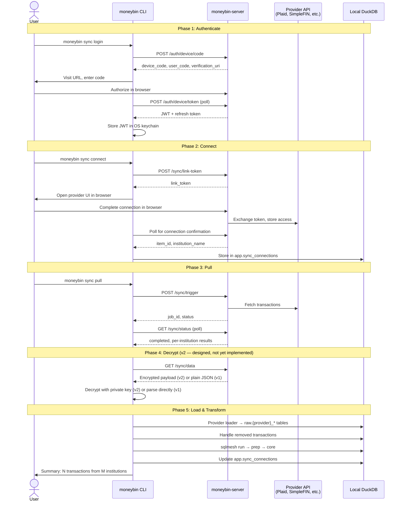
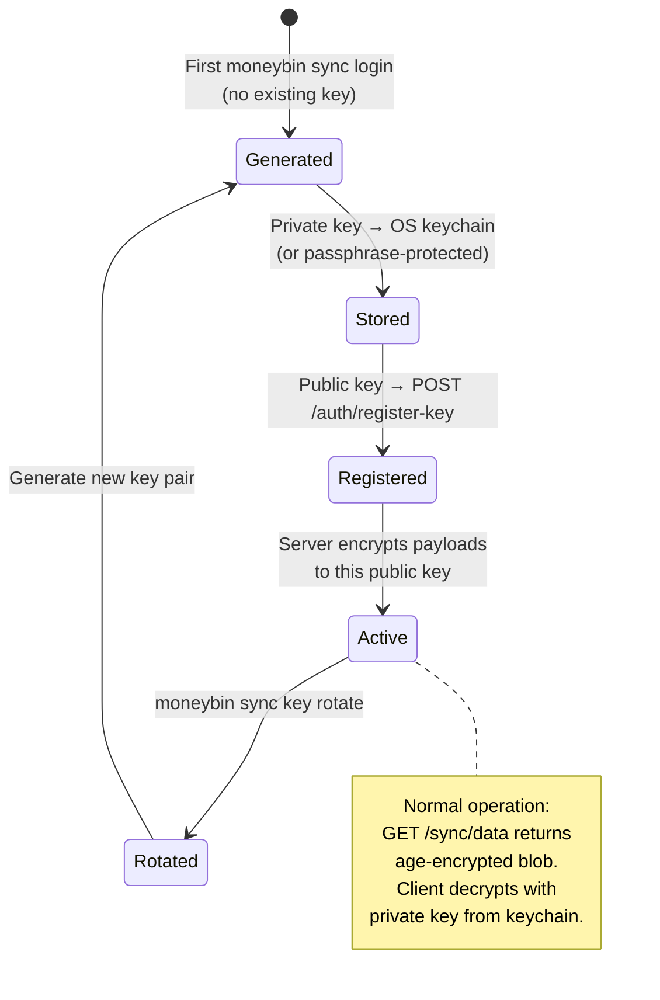

# Sync — Overview

> Last updated: 2026-04-19
> Status: Draft — umbrella doc for the sync initiative. The child spec for the first provider is [`sync-plaid.md`](sync-plaid.md).
> Companions: [`privacy-and-ai-trust.md`](privacy-and-ai-trust.md) (AI data flow governance, consent model), [`matching-overview.md`](matching-overview.md) (peer initiative, dedup of synced data), [`mcp-tool-surface.md`](mcp-tool-surface.md) (MCP tool conventions), `CLAUDE.md` "Architecture: Data Layers"
> Server docs: [`../moneybin-server/docs/architecture/api-contract.md`](../../moneybin-server/docs/architecture/api-contract.md) (authoritative API surface), [`../moneybin-server/docs/architecture/system-overview.md`](../../moneybin-server/docs/architecture/system-overview.md) (ecosystem architecture)
> Replaces: `plaid-integration.md` and `sync-client-integration.md` (moved to `archived/`)

## Purpose

Sync is MoneyBin's framework for pulling financial data from external providers (banks, brokerages, aggregators) through moneybin-server. This doc is the umbrella: it defines the client-side interaction model, infrastructure, CLI/MCP surface, E2E encryption design, error handling, and the contract for plugging in new providers. Provider-specific design and implementation details live in the child specs it points to.

## Vision

> **Connect your bank, pull your data, keep it local. The server is a conduit — it never stores your financial data, and with E2E encryption, it can never read it either.**

Three commitments, in order:

1. **Provider-agnostic framework.** The client speaks a single protocol: authenticate with moneybin-server, connect an institution, pull data, load into DuckDB. The server handles provider-specific API calls (Plaid, SimpleFIN, MX). The client never knows which aggregator backs a connection — that's a server implementation detail.
2. **Provider-specific raw schemas.** Each provider gets its own raw tables that preserve the provider's native data shape. No generic "sync schema" that forces every provider into a least-common-denominator format. The data warehouse layers (prep → core) handle homogenization through staging views and `UNION ALL`.
3. **Financial-grade security.** E2E encryption is designed into the protocol from day one. v1 ships with TLS + encrypted-at-rest (acceptable baseline). v2 adds full zero-knowledge encryption where the server cannot read financial data, even under subpoena. The `EncryptionBackend` abstraction supports algorithm upgrades (X25519 → hybrid post-quantum) without protocol changes.

## Target users

Sync is the bridge between MoneyBin's power-user core and mainstream usability:

- **Trackers** (broadest appeal) — "just connect my bank" is the expected onboarding for anyone coming from Mint, YNAB, or Monarch. Sync eliminates the file-export friction that limits adoption.
- **Power users** — CLI-driven sync with scheduling, per-institution control, and `--output json` for scripting.
- **Budgeters** — automated nightly sync means budget tracking always has current data without manual imports.
- **Wealth managers** — Plaid Investments (future child spec) will sync holdings, positions, and investment transactions alongside cash transactions.

## Scope boundary

### What this spec defines (client-side)

- The provider-agnostic interaction model (authenticate → connect → pull → decrypt → load → transform)
- Client infrastructure: `SyncClient`, connection health tracking, provider loaders
- CLI namespace (`moneybin sync *`) and MCP tools
- E2E encryption design with `EncryptionBackend` abstraction
- Error handling and recovery patterns
- The contract new providers must satisfy to plug into the framework
- Schedule management for automated sync

### What this spec does NOT define (server-side)

- How the server talks to Plaid, SimpleFIN, MX, or any other aggregator
- Server-side token encryption, job orchestration, TTL stores
- Auth0 configuration details (server proxies auth; client calls `/auth/*`)
- Plaid Link implementation, webhook handling, cursor management

Server behavior is documented in `../moneybin-server/docs/specs/` and `../moneybin-server/docs/architecture/api-contract.md`. The client treats the server as opaque — it consumes the API contract, nothing more.

### What this spec does NOT define (provider-specific)

- Raw table schemas for individual providers
- Provider-specific error codes and re-auth flows
- Staging views and core model integration per provider
- Provider-specific testing strategies (e.g., Plaid Sandbox)

These live in provider child specs: [`sync-plaid.md`](sync-plaid.md) (first provider), future `sync-simplefin.md`, `sync-mx.md`, etc.

---

## Interaction model

The sync lifecycle has five phases. Every provider follows the same sequence — provider-specific behavior is encapsulated behind the server's API.



### Phase 1: Authenticate

- Client calls `POST /auth/device/code`, displays verification URL and user code.
- Client polls `POST /auth/device/token` until authorized, respecting `slow_down` backoff per RFC 8628 §3.5.
- JWT stored in OS keychain (`keyring`). Falls back to `~/.moneybin/.token` with `0600` permissions if keychain unavailable.
- Automatic refresh via Auth0 refresh token when JWT expires.
- One-time setup; subsequent commands use the stored token silently.

### Phase 2: Connect

- Client calls `POST /sync/link-token` to get a provider connection token.
- Server opens provider's connection UI in the user's browser (e.g., Plaid Link).
- After the user completes the connection flow, the provider redirects to a server callback endpoint. The server stores the access token and confirms the connection.
- Client polls the server until the connection is confirmed, then receives `item_id` and institution metadata.
- Connection metadata stored locally in `app.sync_connections` for health tracking.

### Phase 3: Pull

- Client calls `POST /sync/trigger`, optionally scoped to a single institution via `item_id`.
- `--force` flag passes `reset_cursor: true` for full re-fetch of all available history.
- Client polls `GET /sync/status` until job completes.
- Per-institution results returned — some may succeed while others fail. The client handles partial success (see [Error handling](#error-handling--recovery)).

### Phase 4: Decrypt

Designed as a first-class part of the protocol. v1 ships without encryption; v2 activates when the server implements its Phase 5.

- **v1 (current):** Server returns plain JSON over HTTPS. TLS protects data in transit. DuckDB encryption at rest protects data once loaded. Server has read access to plaintext financial data — an accepted and documented risk (see [E2E encryption design](#e2e-encryption-design) for mitigation).
- **v2 (designed, implementation phased):** Server encrypts the sync payload to the client's registered public key. Client decrypts locally. The JSON shape inside the encrypted blob is identical to the unencrypted format — everything downstream (loaders, staging, core) is unchanged.

The client auto-negotiates: if the server returns `Content-Type: application/json`, parse directly. If the server returns `Content-Type: application/age`, decrypt first. No client-side configuration needed — a v2 client works against both v1 and v2 servers.

### Phase 5: Load & Transform

- Client downloads JSON via `GET /sync/data`.
- Provider-specific loader parses JSON into provider-specific raw tables (e.g., `raw.plaid_*` for Plaid).
- Loader handles provider-specific semantics (e.g., Plaid's `removed_transactions` — deletes from raw).
- Runs `sqlmesh run` to propagate through staging → core.
- Updates `app.sync_connections` with last sync time, transaction count, and status.

---

## Client infrastructure

### SyncClient

`src/moneybin/connectors/sync_client.py` — the single HTTP client for all server communication. Provider-agnostic: it speaks the server's API contract, not any provider's API.

**Methods** (map 1:1 to the interaction model phases):

| Method | API call | Purpose |
|---|---|---|
| `login()` | `POST /auth/device/code`, `POST /auth/device/token` | Device Authorization Flow |
| `logout()` | Local only | Clear stored credentials |
| `connect()` | `POST /sync/link-token`, poll for confirmation | Get connection token, wait for completion |
| `disconnect(institution_id)` | `DELETE /institutions/:id` | Remove an institution |
| `trigger_sync(item_id, force)` | `POST /sync/trigger` | Start sync job |
| `get_status(job_id)` | `GET /sync/status` | Poll job status |
| `download_data(job_id)` | `GET /sync/data` | Fetch sync payload |
| `list_institutions()` | `GET /institutions` | Connected institutions and health |
| `register_key(public_key)` | `POST /auth/register-key` | Register encryption public key (v2) |

**Auth handling:**

- JWT stored in OS keychain via `keyring` (macOS Keychain, Linux Secret Service, Windows Credential Locker).
- Falls back to `~/.moneybin/.token` with `0600` permissions if keychain unavailable.
- `Authorization: Bearer {token}` header on all authenticated requests.
- Automatic refresh via refresh token when JWT expires (transparent to callers).
- Same storage pattern as the DB encryption key (`privacy-data-protection.md`).

**Configuration:**

- `SyncConfig` in `src/moneybin/config.py` (already exists): `server_url`, request timeouts, polling intervals.
- Env vars: `MONEYBIN_SYNC__SERVER_URL`, `MONEYBIN_SYNC__TIMEOUT`, etc. (`MONEYBIN_` prefix with `__` nesting per `CLAUDE.md`).

**Response models** (Pydantic):

All server responses are typed with Pydantic models: `AuthToken`, `LinkTokenResponse`, `SyncJobResponse`, `SyncStatusResponse`, `SyncDataResponse`, `ConnectedInstitution`. Field constraints enforce validation at the system boundary per `.claude/rules/security.md`. Exact field definitions are in the child spec (`sync-plaid.md`) since the response shape may vary slightly per provider.

### Connection health tracking

Local `app.sync_connections` table tracks connection state across syncs:

```sql
/* Connected institutions and their sync health; one row per provider connection */
CREATE TABLE IF NOT EXISTS app.sync_connections (
    item_id VARCHAR NOT NULL,        -- Provider connection identifier (e.g., Plaid item_id)
    provider VARCHAR NOT NULL,       -- Provider name: plaid, simplefin, mx
    institution_name VARCHAR,        -- Human-readable institution name
    status VARCHAR NOT NULL          -- Connection health: active, error, disconnected
        DEFAULT 'active',
    last_sync_at TIMESTAMP,          -- When the last successful sync completed
    last_sync_txn_count INTEGER,     -- Transactions returned in the last sync
    last_error VARCHAR,              -- Most recent error message (NULL when healthy)
    last_error_code VARCHAR,         -- Provider error code for programmatic handling
    created_at TIMESTAMP             -- When this institution was first connected
        DEFAULT CURRENT_TIMESTAMP,
    PRIMARY KEY (item_id)
);
```

Updated after every sync from the server's per-institution results. `moneybin sync status` reads from this table and maps error codes to actionable guidance.

### Provider-specific loaders

Each provider gets a loader class that owns the translation from server JSON to raw DuckDB tables:

| Responsibility | Where it lives |
|---|---|
| Raw table DDL | `src/moneybin/sql/schema/raw_{provider}_*.sql` |
| JSON → raw table loading | `src/moneybin/loaders/{provider}_loader.py` |
| Provider-specific semantics | Loader class (sign conventions, removed records, etc.) |
| Staging views | `sqlmesh/models/prep/stg_{provider}__*.sql` |
| Core integration | New CTEs + `UNION ALL` in `sqlmesh/models/core/` |

The `SyncClient` doesn't know about raw tables or DuckDB. The loader doesn't know about HTTP. Clean separation — each component is testable independently.

**Loading pattern:** Provider loaders use `Database.ingest_dataframe()` for bulk inserts (Polars → Arrow → DuckDB, zero-copy) or DuckDB's `read_json()` for direct JSON ingestion. The choice is per-loader based on data shape. Both paths go through the encrypted `Database` connection.

---

## CLI surface

All sync commands live under the `moneybin sync` subgroup. This namespace maps to the paid sync tier — users without a server subscription never see or need these commands.

### Core workflow commands

| Command | Description |
|---|---|
| `moneybin sync login` | Authenticate with moneybin-server via Device Authorization Flow |
| `moneybin sync logout` | Clear stored JWT from keychain/file |
| `moneybin sync connect` | Connect a bank account — opens provider UI in browser, polls for completion |
| `moneybin sync disconnect --institution NAME` | Remove an institution (resolves name → id via `GET /institutions`) |
| `moneybin sync pull [--force] [--institution NAME]` | Pull bank data: trigger sync, poll, download, load, transform |
| `moneybin sync status` | Show connected institutions, last sync times, health, errors with actionable guidance |

### Schedule management

| Command | Description |
|---|---|
| `moneybin sync schedule set --time HH:MM` | Install launchd plist (macOS) or cron entry (Linux) for daily sync |
| `moneybin sync schedule show` | Display current schedule: time, next run, mechanism (launchd/cron) |
| `moneybin sync schedule remove` | Uninstall the scheduled job |

Schedule commands are thin wrappers around OS scheduling primitives — no MoneyBin daemon. The generated job runs `moneybin sync pull` with the user's current config. Logs go to MoneyBin's standard log location.

### Non-interactive parity

Per `.claude/rules/cli.md`, every interactive behavior has a flag equivalent for AI agents and scripts:

| Interactive behavior | Flag equivalent |
|---|---|
| Browser opens for login | `--no-browser` (prints URL only — for headless/SSH) |
| Browser opens for connect | `--no-browser` |
| Confirmation before disconnect | `--yes` / `-y` |
| Institution selection when ambiguous | `--institution NAME` |

All commands support `--output json` for AI agent consumption per `mcp-architecture.md` §7.

### CLI output examples

```
$ moneybin sync login
To sign in, visit: https://api.moneybin.app/auth/activate
Enter code: ABCD-EFGH
Waiting for authorization...
✅ Logged in as user@example.com

$ moneybin sync connect
⚙️  Opening bank connection...
Visit: https://api.moneybin.app/link/abc123
Waiting for connection...
✅ Connected Chase (****1234, ****5678)

$ moneybin sync pull
⚙️  Starting sync for all connected institutions...
Waiting for sync job abc-123... completed
Loading accounts... 2 accounts
Loading transactions... 142 transactions
Loading balances... 2 balance snapshots
Running SQLMesh plan...
✅ Synced 142 transactions from 1 institution

$ moneybin sync status
Chase (connected 2026-03-15, via plaid)
  Accounts: ****1234 (checking), ****5678 (savings)
  Last sync: 2026-04-07 14:30 UTC (142 transactions)
  Status: active

Schwab (connected 2026-03-20, via plaid)
  Last sync: 2026-04-07 14:30 UTC
  Status: ❌ error — ITEM_LOGIN_REQUIRED
  💡 Run 'moneybin sync connect' to re-authenticate Schwab

$ moneybin sync schedule set --time 02:00
✅ Scheduled daily sync at 02:00 via launchd
   Next run: 2026-04-20 02:00

$ moneybin sync schedule show
Daily sync at 02:00 via launchd (com.moneybin.sync)
  Next run: 2026-04-20 02:00
  Log: ~/.moneybin/logs/sync.log

$ moneybin sync schedule remove
✅ Removed daily sync schedule
```

---

## MCP surface

MCP tools mirror the CLI under a `sync` namespace. Designed for AI agents (Claude, ChatGPT, Claude Code, Codex) to manage sync on behalf of the user.

### Tools

| Tool | Description | Parameters |
|---|---|---|
| `sync.pull` | Trigger a bank data sync, wait for completion, load results | `institution_name: str \| None`, `force: bool` |
| `sync.status` | Show connected institutions and health | None |
| `sync.connect` | Start bank connection flow | None; returns URL for user to visit |
| `sync.disconnect` | Remove a bank connection | `institution_name: str` |
| `sync.schedule` | Manage automated sync schedule | `action: Literal['set', 'show', 'remove']`, `time: str \| None` (HH:MM, required for `set`) |

### Not exposed as MCP tools

- **`login` / `logout`** — Requires browser interaction and credential handling. CLI-only. If not authenticated, MCP tools return an error directing the user to run `moneybin sync login`.
- Provider-specific operations — all abstracted behind the provider-agnostic tools above.

### Prompt

| Prompt | Purpose |
|---|---|
| `sync_review` | "Review my sync status and suggest actions" — checks connection health, reports stale institutions, suggests re-auth or first-time connect, recommends scheduling if not configured |

### How synced data surfaces

No sync-specific read tools needed. Once data is pulled and transformed, it flows through the existing core tables. All existing MCP tools (`transactions_list`, `spending_by_category`, `accounts_list`, etc.) automatically include synced data via `source_type = '{provider}'` — the data warehouse doing its job.

---

## E2E encryption design

### Threat model

| Layer | Protects against | Limitation |
|---|---|---|
| **TLS (v1 baseline)** | Network observers, MITM | Server can read plaintext |
| **Server TTL store** | Persistent server-side storage | Data exists in-memory for 30 minutes |
| **DuckDB encryption at rest** | Stolen laptop, cloud sync exposure | Only protects the local database file |
| **E2E encryption (v2)** | Compromised server, subpoena, rogue employee, data breach | Requires key management on client |

v1 provides defense-in-depth: TLS in transit, ephemeral server storage (30-minute TTL, no persistent plaintext), and AES-256-GCM encryption at rest once data reaches DuckDB. This is an acceptable baseline for a beta product with a single-digit user count.

v2 achieves full zero-knowledge: the server never sees plaintext financial data. This is the target state, designed now and implemented when the server completes its Phase 5.

### Key lifecycle



1. **Generation.** Client generates an asymmetric key pair on first `moneybin sync login` if no key exists. v1 uses age/X25519 (see [Cryptographic algorithm selection](#cryptographic-algorithm-selection)). Future versions swap to hybrid post-quantum via the `EncryptionBackend` abstraction.
2. **Storage.** Private key stored in OS keychain (`keyring`), same storage path as the DB encryption key (`privacy-data-protection.md`). Never written to disk in plaintext. If the user opts for passphrase-based storage, the private key is encrypted with an Argon2id-derived key from the passphrase — same pattern as DB passphrase mode (ADR-009).
3. **Registration.** Client sends public key to server via `POST /auth/register-key`. Server stores it alongside the user record. The server uses this key to encrypt all sync payloads before returning them.
4. **Encryption.** Server encrypts sync payloads to the client's registered public key before returning from `GET /sync/data`. Response body is an encrypted blob instead of raw JSON.
5. **Decryption.** Client decrypts with its private key. The JSON inside is identical to the unencrypted format — loaders, staging views, and core models are all unchanged.
6. **Rotation.** `moneybin sync key rotate` generates a new key pair, registers the new public key with the server. Old key retained briefly for in-flight payloads during the transition window.

### Key protection

Two storage paths for the private key, mirroring the DB encryption key design:

```
Path A (default, zero friction):
  OS keychain → age private key → decrypts sync payload

Path B (passphrase, shared-machine protection):
  User passphrase → [Argon2id] → derived key → unlocks age private key → decrypts sync payload
```

Both paths are implemented by the `keyring` library. Path B adds protection when the OS keychain itself isn't trustworthy (shared machines, compromised user accounts).

### Multi-device

Each device has its own key pair. Server encrypts to the requesting device's registered public key. No key sharing between devices — each device registers independently after `moneybin sync login`. This avoids the complexity of key distribution and ensures a compromised device's key doesn't affect other devices.

### Auto-negotiation

The client detects the server's encryption state from the response:

| `Content-Type` | Behavior |
|---|---|
| `application/json` | Parse JSON directly (v1 server) |
| `application/age` | Decrypt with private key, then parse JSON (v2 server) |

No client-side flag or configuration needed. A v2 client works seamlessly against both v1 and v2 servers.

### Cryptographic algorithm selection

**v1: age/X25519 (Curve25519)**

Selected for simplicity, auditability, and mature library support. X25519 is the same elliptic curve used by Signal, WireGuard, and SSH. The age encryption format is opinionated and minimal, reducing implementation surface area.

**Known limitations:**

- **Not quantum-resistant.** X25519 is vulnerable to Shor's algorithm on a sufficiently powerful quantum computer. The threat to personal financial data is not imminent, but the design must not preclude an upgrade.
- **Not FIPS 140-3 compliant.** X25519 is not a NIST-approved curve. FIPS requires P-256, P-384, or P-521 for ECC. Argon2id (used for passphrase-based key protection) is also not FIPS-approved (FIPS requires PBKDF2 or HKDF). If MoneyBin ever pursues SOC 2 certification or serves regulated entities, these algorithms would need to be swapped.

**Upgrade path: hybrid X25519 + ML-KEM (CRYSTALS-Kyber)**

NIST finalized the post-quantum standard ML-KEM (FIPS 203) in 2024. The industry is moving to hybrid schemes — classical + post-quantum together — as Signal (PQXDH), Apple (iMessage PQ3), and Chrome (TLS) have already shipped.

MoneyBin's upgrade path:

1. The `EncryptionBackend` abstraction (see below) encapsulates key generation, encryption, and decryption behind a swappable interface.
2. v1 ships the `AgeX25519Backend`.
3. When a mature hybrid library emerges, a `HybridPQBackend` (X25519 + ML-KEM) replaces it without changing the protocol, the CLI, or the server API.

### `EncryptionBackend` abstraction

```python
class EncryptionBackend(Protocol):
    """Swappable encryption backend for sync payload protection."""

    def generate_keypair(self) -> tuple[bytes, bytes]:
        """Generate a (public_key, private_key) pair."""
        ...

    def encrypt(self, plaintext: bytes, public_key: bytes) -> bytes:
        """Encrypt plaintext to a public key."""
        ...

    def decrypt(self, ciphertext: bytes, private_key: bytes) -> bytes:
        """Decrypt ciphertext with a private key."""
        ...

    @property
    def algorithm_id(self) -> str:
        """Identifier sent to server during key registration (e.g., 'age-x25519', 'hybrid-x25519-mlkem')."""
        ...
```

The server stores `algorithm_id` alongside the registered public key, allowing per-device algorithm selection during the transition period. A device on v1 (age) and a device on v2 (hybrid) can coexist.

---

## Error handling & recovery

Sync errors fall into three categories with distinct recovery paths.

### Authentication errors

| Error | Cause | Client behavior |
|---|---|---|
| `401 Unauthorized` | JWT expired or invalid | Attempt automatic refresh via refresh token. If refresh fails, prompt user to run `moneybin sync login`. |
| `403 Forbidden` | User denied authorization during device flow | Log error, exit cleanly with guidance. |
| Token not found | No stored credential | Direct user to `moneybin sync login`. |

### Connection errors

Provider-specific error codes are surfaced through the server's per-institution results. The client maps them to actionable messages without needing to know which aggregator generated them.

| Error code | Cause | Client behavior |
|---|---|---|
| `ITEM_LOGIN_REQUIRED` | Bank requires re-authentication | Update `app.sync_connections.status = 'error'`. Display: "Chase needs re-authentication — run `moneybin sync connect`." |
| `ITEM_NOT_FOUND` | Connection revoked or expired | Update status to `disconnected`. Display guidance to reconnect. |
| `NO_ACCOUNTS` | Institution returned no accounts | Warn user, suggest reconnecting with different credentials. |
| `INSTITUTION_DOWN` | Bank's system unavailable | Log warning, skip institution, continue with others. Suggest retry later. |
| Unknown error code | Unmapped provider error | Log raw error code and message. Display: "Unexpected error from {institution} — check `moneybin sync status` for details." |

The error code vocabulary is owned by the server. As providers are added, new error codes may appear. The client handles unknown codes gracefully — log and display the raw message rather than crash.

### Infrastructure errors

| Error | Cause | Client behavior |
|---|---|---|
| Server unreachable | Network or server down | Retry with exponential backoff (3 attempts). Clear error: "Cannot reach moneybin-server at {url}." |
| Sync job timeout | Polling exceeded max wait | Log `job_id` for manual recovery. "Sync job {id} timed out — run `moneybin sync status` to check." |
| Load failure | DuckDB write error during load | Roll back partial load (transaction). No raw data corruption. |
| Transform failure | `sqlmesh run` error after load | Raw data is safely loaded. User can re-run `moneybin data transform apply` independently. |

### Partial success handling

The server syncs all institutions in parallel via `Promise.allSettled`. Some may succeed while others fail. The client:

1. Loads data from all successful institutions.
2. Updates `app.sync_connections` for each institution (success and failure).
3. Reports per-institution results to the user.
4. Exits with code 0 if any institution succeeded, code 1 if all failed.

```
$ moneybin sync pull
⚙️  Starting sync for all connected institutions...
Chase: ✅ 142 transactions
Schwab: ❌ ITEM_LOGIN_REQUIRED
💡 Run 'moneybin sync connect' to re-authenticate Schwab
✅ Synced 142 transactions from 1 of 2 institutions
```

---

## Data flow & provider contract

### How provider data flows through the warehouse

```
Server JSON → Provider Loader → raw.{provider}_* → prep.stg_{provider}__* → core.dim/fct_*
```

Each layer has a clear owner and responsibility:

| Layer | Owner | Responsibility |
|---|---|---|
| JSON response | Server (`api-contract.md`) | Provider-shaped data in server's native format |
| Raw tables | Provider loader (e.g., `PlaidLoader`) | Faithful storage of provider data — no transformations, no sign flips |
| Staging views | SQLMesh models in `prep` | Light cleaning, type casting, sign convention normalization, column renaming to core-compatible names |
| Core tables | SQLMesh models in `core` | `UNION ALL` from all sources with `source_type` discriminator |

### Provider contract

Adding a new provider requires these artifacts. Nothing else changes — the framework, CLI, MCP tools, and error handling work for all providers automatically.

**1. Raw table DDL** — `src/moneybin/sql/schema/raw_{provider}_*.sql`

Tables preserve the provider's native shape. Column comments follow database conventions (`.claude/rules/database.md`). No generic "sync transactions" table — each provider defines its own columns, types, and primary keys.

**2. Loader class** — `src/moneybin/loaders/{provider}_loader.py`

Parses provider-shaped JSON from `SyncClient.download_data()` and loads into raw tables via `Database.ingest_dataframe()` or `read_json()`. Handles provider-specific semantics:

- Sign convention (e.g., Plaid: positive = expense; the loader preserves this — the flip happens in staging)
- Removed/deleted records (e.g., Plaid's `removed_transactions`)
- Dedup on re-load (primary key constraints, `INSERT OR REPLACE`)
- Client-side metadata generation (`source_file = 'sync_{job_id}'`, `extracted_at = metadata.synced_at`, `loaded_at = CURRENT_TIMESTAMP`)

**3. Staging views** — `sqlmesh/models/prep/stg_{provider}__*.sql`

Normalize column names and types to be core-compatible. Apply sign convention flips. Output schema must match what the core models expect for `UNION ALL`. Per database conventions, `stg_` views get no column comments (internal layer).

**4. Core model additions** — new CTE + `UNION ALL` in the relevant core models

Add `{provider}_transactions` CTE in `fct_transactions.sql`, `{provider}_accounts` CTE in `dim_accounts.sql`, etc. Set `source_type = '{provider}'`.

**What providers do NOT need to touch:**

- `SyncClient` — provider-agnostic, speaks server API only
- CLI commands — `sync pull`, `sync connect`, etc. work for all providers
- MCP tools — same tools, provider-unaware
- `app.sync_connections` — `provider` column discriminates; schema is shared
- `EncryptionBackend` — encryption is at the transport layer, not the provider layer

### `source_type` and `source_origin`

Per `.claude/rules/database.md` column name consistency rules:

- `source_type = '{provider}'` (e.g., `'plaid'`, `'simplefin'`, `'mx'`) — identifies the data provider. Same column name from raw through core.
- `source_origin = item_id` — the specific institution connection. For Plaid: the `item_id`. Scopes dedup to the connection level, same pattern as tabular import's format-scoped dedup (`smart-import-tabular.md`).

### Legacy cleanup note

The legacy `raw.csv_transactions` table and its staging views should be removed in a future implementation pass. The tabular import pipeline (`raw.tabular_transactions` per `smart-import-tabular.md`) supersedes it. External-facing docs may still refer to "CSV import" for user familiarity, but internal schemas should not carry both.

---

## Testing strategy

### Tests with no server dependency

All unit tests and SQL tests run against mocked HTTP responses and in-memory DuckDB. No moneybin-server instance required.

| Area | What's tested |
|---|---|
| `SyncClient` methods | Mocked httpx responses: success, auth errors, server errors, timeouts, polling logic (including `slow_down` backoff) |
| Provider loaders | JSON parsing, raw table loading, dedup on re-load, removed-record handling |
| Auth flow | Device Authorization polling (success, timeout, denied, slow_down), token storage/retrieval (keychain mock + file fallback), refresh logic |
| Connection health | `app.sync_connections` updates from server responses, error-code-to-guidance mapping |
| Schedule management | Plist/cron generation and parsing, idempotent install/remove |
| Staging views (SQL) | Sign convention flip, column mapping to core-compatible schema |
| Core integration (SQL) | Provider data appears with correct `source_type`, `UNION ALL` produces no duplicates |
| Dedup (SQL) | Same JSON loaded twice → no duplicate rows in raw tables |
| E2E encryption (v2) | Encrypt/decrypt round-trip, key generation, `EncryptionBackend` interface compliance |

### Tests requiring a running server

Integration tests require a coordinated test environment: a running moneybin-server instance configured with provider sandbox credentials (e.g., Plaid Sandbox), a test user in Auth0, and at least one linked sandbox institution.

| Scenario | What's tested |
|---|---|
| Full flow | Login → connect → pull → verify data in DuckDB core tables |
| Incremental sync | First pull loads N transactions, second pull loads only new ones |
| Partial failure | One institution fails, others succeed — data loads, errors reported |
| Re-auth flow | Simulate `ITEM_LOGIN_REQUIRED`, verify error guidance |

**Integration test environment** is a separate concern that will get its own spec. Server-side test environment setup is documented in moneybin-server, not here. Integration tests are:

- Marked `@pytest.mark.integration`
- Skipped by default in `uv run pytest tests/`
- Gated by `MONEYBIN_SYNC__TEST_SERVER_URL` env var
- Documented setup instructions reference moneybin-server's test environment docs

### Synthetic data interaction

The [`testing-and-validation-overview.md`](testing-and-validation-overview.md) umbrella spec deferred Plaid Sandbox testing to this spec. The testing strategy here completes that contract: golden-file payloads captured from sandbox for offline unit tests, live sandbox for integration tests.

---

## Build order & phasing

### Phase 1: Core sync flow (MVP — Level 2 deliverable)

- `SyncClient` with login, logout, connect, disconnect, pull, status
- `PlaidLoader` with raw table DDL, JSON loading, `removed_transactions`
- Plaid staging views and core model integration (see `sync-plaid.md`)
- `app.sync_connections` table and health tracking
- CLI commands: `login`, `logout`, `connect`, `disconnect`, `pull`, `status`
- MCP tools: `sync.pull`, `sync.status`, `sync.connect`, `sync.disconnect`
- MCP prompt: `sync_review`
- Error handling with actionable guidance
- Unit tests and SQL tests (no server dependency)

### Phase 2: Automation

- `moneybin sync schedule set/show/remove` CLI commands
- `sync.schedule` MCP tool
- launchd (macOS) and cron (Linux) job generation
- Logging configuration for unattended runs (rotate, size limit)
- Schedule lifecycle management (idempotent set, clean remove)

### Phase 3: E2E encryption

- `EncryptionBackend` protocol and `AgeX25519Backend` implementation
- Key generation, OS keychain storage, passphrase-protected storage
- `POST /auth/register-key` integration
- Auto-negotiation (`application/json` vs `application/age`)
- `moneybin sync key rotate` command
- Blocked on moneybin-server Phase 5

### Phase 4: Post-quantum upgrade

- `HybridPQBackend` (X25519 + ML-KEM) behind the same `EncryptionBackend` protocol
- Algorithm negotiation via `algorithm_id` during key registration
- Swap without protocol, CLI, or server API changes
- Timing: when the hybrid library ecosystem matures (Signal PQXDH and Apple PQ3 shipped in 2024; Rust/Python libraries are emerging)

### Relationship to roadmap

Phase 1 of this spec maps to **M3A — Plaid Transactions sync** in [`docs/roadmap.md`](../roadmap.md). Phases 2–4 are post-launch enhancements. The build order here refines the internal phasing within the M3A deliverable — it does not change the roadmap sequencing.

---

## Provider child specs

| Provider | Child spec | Status | Notes |
|---|---|---|---|
| Plaid | [`sync-plaid.md`](sync-plaid.md) | Draft | First provider. Transactions product only (v1). Investments/Liabilities are future child specs gated on `investment-tracking.md`. |
| SimpleFIN | `sync-simplefin.md` | Planned | Alternative aggregator used by Actual Budget. Lower coverage but no per-institution fees. |
| MX | `sync-mx.md` | Planned | Enterprise-grade aggregator. Potential alternative to Plaid for hosted tier. |

Adding a provider = writing a child spec + implementing the four artifacts from the [provider contract](#provider-contract). The framework, CLI, MCP tools, encryption, error handling, and schedule management are shared.

---

## Adjacent initiatives

### Smart Import — `smart-import-overview.md`

Peer initiative. Smart Import handles files the user has (CSV, Excel, PDF). Sync handles live connections to banks. No overlap — they produce different raw tables, go through different staging views, and meet in core via `UNION ALL`. A user can use one, the other, or both.

### Transaction Matching — `matching-overview.md`

Peer initiative. Sync produces raw rows that may duplicate records already loaded from files (e.g., the same transaction in an OFX export and a Plaid sync). Transaction matching deduplicates them in core. Sync's `source_type` and `source_origin` columns feed the matching engine's blocking and scoring pipeline.

### Privacy & AI Trust — `privacy-and-ai-trust.md`

Framework spec. Sync operates in the "Encrypted Sync" data flow tier (ADR-002). The E2E encryption design in this spec implements that tier's contract. The consent model does not apply to sync (no AI involvement) — sync is a direct data pipeline, not an AI-assisted feature.

### Data Protection — `privacy-data-protection.md`

Infrastructure spec. The `Database` class that sync loaders write through handles encryption at rest, schema initialization, and migrations. Sync does not interact with encryption directly — it uses `get_database()` like every other component.

---

## Future directions

Not designed here. Architectural constraints noted so the current design does not preclude them.

1. **`sync push`** — multi-device sync. Push encrypted DuckDB state (or deltas) to the server so another device can pull it. Would add `moneybin sync push` command and bidirectional protocol extensions.
2. **Plaid Investments** — sync holdings, securities, and investment transactions. Gated on `investment-tracking.md` spec (MVP Level 2). New child spec: `sync-plaid-investments.md`.
3. **Plaid Liabilities** — sync loan, mortgage, and credit card debt details. Separate child spec.
4. **Webhook-based sync** — server pushes notifications when new data is available, eliminating polling. Requires a client-side listener or notification mechanism.
5. **Integration test environment** — coordinated setup for running server-dependent tests. Separate spec covering docker-compose, Auth0 test tenant, sandbox credential management.
6. **Compliance gap analysis** — assessment of MoneyBin's security posture against SOC 2, FIPS 140-3, and other certifications. Tracked separately.

## Success criteria

- **Time-to-first-sync.** A user goes from `moneybin sync login` to seeing bank transactions in `core.fct_transactions` in under 5 minutes. The flow is: login (30s) → connect (2 min, mostly bank UI) → pull (30s) → done.
- **Incremental reliability.** Nightly scheduled syncs complete without intervention for 30+ consecutive days. Failures produce actionable error messages, not silent gaps in data.
- **Provider-agnostic framework.** Adding a second provider (SimpleFIN or MX) requires only a child spec and the four provider contract artifacts — no framework changes.
- **Encryption readiness.** When the server implements Phase 5, the client activates E2E encryption with a key generation step and zero changes to the loading pipeline.
- **No plaintext leakage.** Sync payloads are never written to disk in plaintext. In v1, they exist only in process memory during load. In v2, they're decrypted in memory only. The `SanitizedLogFormatter` prevents PII from appearing in logs.

## Open questions

- **Connection token flow.** The exact polling mechanism for Phase 2 (connect) depends on the server's implementation of the provider callback. The spec defines the contract (client polls, server confirms) but the endpoint name and response shape are TBD in `api-contract.md`.
- **Schedule persistence across upgrades.** If MoneyBin is upgraded and the schedule mechanism changes (e.g., cron → systemd timer), should `moneybin sync schedule set` detect and migrate the old schedule?
- **Multi-provider institution.** If the same bank is connectable through both Plaid and SimpleFIN, how does the client prevent duplicate data? Likely a matching-engine concern (same institution, different `source_type`), but worth noting.
- **Rate limiting.** Should the client enforce any rate limiting on `sync pull` calls, or is this purely a server-side concern?
