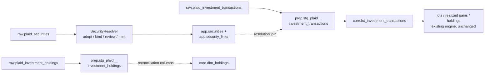

# Sync: Plaid Investments Provider

## Status
<!-- draft | ready | in-progress | implemented -->
ready

## Goal

Second Plaid product child: Plaid Investments. Pull securities, investment
transactions, and holdings snapshots for connected brokerage/retirement accounts
through moneybin-sync, land them in provider-specific raw tables, resolve
security identity to the canonical catalog, and flow investment events into
`core.fct_investment_transactions` — where the shipped cost-basis engine derives
lots, realized gains, and holdings with **no engine changes**. Once Plaid rows
reach the ledger, everything downstream is existing machinery.

## Background

- [`sync-overview.md`](sync-overview.md) — umbrella spec: interaction model,
  `SyncClient`, CLI/MCP surface, provider contract. This spec adds no new
  commands or tools; investments ride the existing surface.
- [`sync-plaid.md`](sync-plaid.md) — sibling: Plaid Transactions (M1G Phase 1,
  shipped). This spec mirrors its raw/staging/core pattern, its metadata-column
  conventions, and its `sync pull` job flow.
- [`investments-data-model.md`](investments-data-model.md) — the M1J.1
  foundation child (shipped PR #300). Its **Plaid Investments Readiness**
  section pressure-tested every contract this spec builds on against
  `plaid/plaid-openapi` `2020-09-14.yml` @ `6abd747c` (2026-07-04); the
  taxonomy mapping below is restated from there verbatim.
- [`investments-overview.md`](investments-overview.md) — the M1J umbrella; this
  spec is the first "already-carved child" to land.
- [`merchant-entity-resolution.md`](merchant-entity-resolution.md) (M1T) — the
  provider-id binding + review-queue pattern security identity mirrors, per
  `investments-data-model.md` Requirement 3's explicit anticipation.
- [`account-identity-resolution.md`](account-identity-resolution.md) (M1S) —
  the `app.account_links` resolution staging views join through.
- [ADR-007: JSON over Parquet](../decisions/007-json-over-parquet-for-sync.md).
- Addresses: **M1G.4** (Plaid product breadth) in service of **M1J**
  (investments milestone; gated child). Sequenced before M1X (account subtype
  detail + Plaid Liabilities) per the post-release wave in
  [`roadmap.md`](../roadmap.md).

## Requirements

1. **Unified pull.** Investments data arrives through the existing
   `moneybin sync pull` job — no new CLI command, MCP tool, or job type. The
   `/sync/data` response is extended with three optional arrays (below); a
   payload without them loads exactly as today. Plaid-side mechanics (holdings
   are always a full snapshot; investment transactions are date-range queries
   with a server-owned watermark; there is no cursor) are server-internal per
   the "sync server is opaque" design principle.
2. **Max-capture raw.** Four new tables — `raw.plaid_securities`,
   `raw.plaid_investment_transactions`, `raw.plaid_investment_holdings`, and
   `raw.plaid_investment_holding_lots` (the per-lot `tax_lots[]` detail) —
   preserve Plaid's native shape faithfully, keyed for idempotent re-load
   (`INSERT OR REPLACE`). The **transactional** pair (`raw.plaid_securities`,
   `raw.plaid_investment_transactions`) keys like the shipped cash tables —
   provider id scoped by `source_origin`, **not** by `source_file` — so a later
   sync job that re-delivers the same row **replaces** it rather than
   duplicating it (overlapping date-range pulls are Plaid's normal investments
   behavior), with `source_file = sync_{job_id}` kept only as lineage. The
   **snapshot** pair (`raw.plaid_investment_holdings`,
   `raw.plaid_investment_holding_lots`) still scopes by `source_origin` (like all
   Plaid raw tables) **and** additionally makes `source_file` *part of the PK*:
   each sync writes a distinct point-in-time snapshot that is deliberately
   retained, not replaced (see the snapshot-identity note under those tables).
   No data loss, no duplicate rows on re-sync, and two items that share a
   provider-local `(account_id, security_id)` never collide.
3. **Sign faithfulness.** Plaid investment `amount` is **positive = cash out**
   — the exact opposite of the ledger convention (negative = cash out). Raw
   preserves Plaid's convention; the flip happens exclusively in
   `prep.stg_plaid__investment_transactions`. Plaid `quantity` already matches
   the ledger convention (signed: + acquire, − dispose) and is not flipped.
4. **Taxonomy mapping in staging.** Plaid's 6 types × 48 subtypes map onto the
   closed 14-value ledger `type` (+ `subtype` refinement) per the table locked
   in `investments-data-model.md` — restated below. Lifecycle rows (`cancel`,
   `cash/pending credit`, `cash/pending debit`, `transfer/request`) are
   captured in raw but excluded at staging.
5. **Provider fidelity to core.** Plaid's original type/subtype strings are
   preserved end-to-end as two new nullable columns on
   `core.fct_investment_transactions`: `provider_type`, `provider_subtype` —
   the same promotion `original_description` received on
   `core.fct_transactions`. NULL for manual entry; the future OFX child
   populates them from `<INVTRANLIST>` types. This is an additive column
   migration and supersedes the foundation spec's "no core migration" note.
6. **Security identity mirrors M1T.** Two new tables — `app.security_links`
   (provider-ref → canonical `security_id` binding) +
   `app.security_link_decisions` (fuzzy-match review queue) — with a
   `SecurityResolver` running adopt-or-mint before transforms: adopt bound →
   auto-bind strong identifier → **provisional-mint + propose merge** on a
   fuzzy match → mint into `app.securities` with `created_by = 'plaid'`.
   Every rung ends with an accepted binding, so **every security-bearing row
   reaches the ledger on the sync that delivered it** — the cost-basis engine
   skips NULL-`security_id` events, so a held-out-pending-review row would
   silently understate lots and gains. `core.dim_securities` **remains a
   catalog view** (the merchant precedent); the foundation model's "Future:
   UNION ALL from staging" comment is superseded by this spec.
7. **Holdings are store-don't-trust for *valuation*.** Broker-reported holdings
   land as dated snapshots and surface as clearly-labeled, non-authoritative
   `provider_reported_*` reconciliation columns on `core.dim_holdings`; those
   columns never overwrite ledger-derived numbers. **The one authoritative use
   of holdings is the opening-lot bootstrap** (Requirement 13): a position held
   before Plaid's transaction window has no acquiring transaction, so its
   holdings row is the *only* evidence the lot exists — used to seed the ledger,
   not to value it.
8. **Deterministic event grouping.** Two-row economic events (reinvest pairs,
   corporate-action legs) are linked by an `event_group_id` synthesized in
   staging as a **content hash** of the pairing key — never a random UUID,
   which would churn on every SQLMesh rebuild. Pairing is enrichment, not a
   correctness gate: an unpaired reinvest row still opens its lot and the
   income row still counts as income; only the linkage is absent.
9. **Derived models untouched.** `core.fct_investment_lots`,
   `core.fct_realized_gains`, and `core.dim_holdings`'s ledger-derived columns
   need no changes — they rebuild from the unioned ledger automatically. After
   a successful load, `SyncService.pull()` runs the standard post-load refresh
   (same semantics, soft-fail behavior, and opt-outs as `sync-plaid.md`
   Requirement 10).
10. **Connection status.** `app.sync_connections` reflects investments in its
    per-institution counts and error details, same envelope as cash sync.
    Investments-specific Plaid error codes map to actionable guidance (below).
11. **No PII or financial data in logs.** Record counts, institution names,
    and masked identifiers only — no tickers-with-quantities, no amounts.
12. **Registration.** Provider-owned raw DDL lands in
    `src/moneybin/extractors/plaid/schema/` where `src/moneybin/schema.py`
    **auto-discovers** it by glob over `_PROVIDER_SCHEMA_DIRS` (no manual
    registration — that is the "provider owns its schema dir" invariant);
    cross-cutting `app.security_link*` DDL is added to
    `_NON_PROVIDER_SCHEMA_FILES` in the same module. `app.*` tables and the
    additive core columns are delivered via `database-migration.md`'s dual-path
    pattern.
13. **Opening-lot bootstrap.** A position held before Plaid's ≤24-month
    transaction window has no acquiring transaction; on first sync, the
    holdings snapshot's unexplained quantity is seeded into the ledger as
    synthetic `opening_bootstrap` `transfer_in`s — per-lot basis and
    acquisition date drawn from the pre-window `Holding.tax_lots[]` (relative to
    the server-supplied `transactions_window_start`), else `basis_incomplete`.
    The holdings snapshot stays authoritative for the held position; realized
    gains on shares bought pre-window and sold in-window are best-effort and
    flagged. Without this, a long-held position never opens a lot and a later
    Plaid sale realizes an oversold zero-basis phantom gain. See
    [Opening-lot bootstrap](#opening-lot-bootstrap).

---

## Server contract

Restated inline per project convention (public MoneyBin docs never link
sibling-repo paths). This is the contract moneybin-sync must implement; the
client treats everything Plaid-side as opaque.

`GET /sync/data` gains three **optional** top-level arrays alongside the
existing `accounts` / `transactions` / `balances` / `removed_transactions`:

```json
{
  "securities": [
    {
      "security_id": "kqzLDp...",
      "provider_item_id": "item_9Bd...",
      "institution_security_id": null,
      "institution_id": null,
      "ticker_symbol": "AAPL",
      "market_identifier_code": "XNAS",
      "name": "Apple Inc.",
      "type": "equity",
      "close_price": 214.55,
      "close_price_as_of": "2026-07-08",
      "iso_currency_code": "USD",
      "unofficial_currency_code": null,
      "cusip": null,
      "isin": null,
      "is_cash_equivalent": false
    }
  ],
  "investment_transactions": [
    {
      "investment_transaction_id": "vNzRqk...",
      "account_id": "eJbKw3...",
      "provider_item_id": "item_9Bd...",
      "security_id": "kqzLDp...",
      "date": "2026-07-06",
      "transaction_datetime": "2026-07-05T14:30:00Z",
      "name": "BUY AAPL",
      "quantity": 10.0,
      "amount": 2145.50,
      "price": 214.55,
      "fees": 0.0,
      "iso_currency_code": "USD",
      "unofficial_currency_code": null,
      "type": "buy",
      "subtype": "buy"
    }
  ],
  "investment_holdings": [
    {
      "account_id": "eJbKw3...",
      "provider_item_id": "item_9Bd...",
      "security_id": "kqzLDp...",
      "institution_price": 214.55,
      "institution_price_as_of": "2026-07-08",
      "institution_value": 2145.50,
      "cost_basis": 1980.00,
      "quantity": 10.0,
      "iso_currency_code": "USD",
      "unofficial_currency_code": null,
      "vested_quantity": null,
      "vested_value": null,
      "tax_lots": [
        {
          "institution_lot_id": "lot_7f...",
          "original_purchase_datetime": "2021-03-11T00:00:00Z",
          "quantity": 6.0,
          "purchase_price": 121.00,
          "cost_basis": 726.00,
          "current_value": 1287.30,
          "position_type": "long"
        }
      ]
    }
  ]
}
```

`tax_lots` is Plaid's `Holding.tax_lots[]` (`HoldingTaxLot`), passed through
verbatim. It is an **empty array** when the institution provides no lot-level
data; the server must forward it as-is (empty, not omitted) so the client can
distinguish "no lots reported" from "lots not requested." It is the sole wire
source for `raw.plaid_investment_holding_lots` and the per-lot opening-lot
bootstrap — see the SDK-floor note under that table.

Field names and semantics track Plaid's Investments objects one-to-one
(`Security`, `InvestmentTransaction`, `Holding`); the server passes them
through without reshaping. `metadata`'s **per-institution results** gain one
field: `transactions_window_start` — the ISO date the server used as the
`/investments/transactions/get` start boundary **for that item** (its watermark,
or the first-sync floor). Watermarks are per-`item_id` state, so this is
**per-item, not a single top-level value**: an unscoped sync can return several
items with different windows, and a bootstrap that classified one item's lots
against another item's window would drop or duplicate basis. The server owns the
watermark, so the client cannot derive it; the opening-lot bootstrap needs it to
tell pre-window lots from in-window ones, and it must be present even for an item
whose securities returned zero in-window transactions. The client stamps each
item's value onto that item's `raw.plaid_investment_holdings` rows, matched by
`source_origin` (= `provider_item_id`) (§ that table).

**Every investment object carries item scope.** The server calls Plaid **per
item**, so it stamps each `securities`, `investment_transactions`, and
`investment_holdings` object with the `provider_item_id` it came from (nested
`tax_lots` inherit their parent holding's). That id lands as `source_origin` on
every raw Plaid table. This is what makes an **unscoped multi-item pull**
correct: the wire objects are otherwise flat (`account_id`/`security_id` only),
so without a per-row item id the client could not tell which item a holding
belongs to — it could not populate the `source_origin` PK column, could not stamp
that item's `transactions_window_start`, and two items sharing a provider-local
`(account_id, security_id)` would be indistinguishable and collide. With it,
each item's securities/transactions/holdings stay distinct, the resolver binds
under the right connection, and the opening-lot bootstrap classifies each item's
lots against **that item's** window.

### No removals or cancels in v1 (documented limitation)

Plaid Investments has no cursor/removed-list mechanism analogous to
`/transactions/sync`: holdings are always a full snapshot, and investment
transactions are date-range queries the server re-runs each sync. Consequence:
there is **no `removed_investment_transactions` array**, and a transaction
Plaid retracts after delivery is not detected as a removal — only as absence
from future date-range windows.

Plaid's `type='cancel'` rows are the same class of signal: a cancel reverses a
previously-delivered (usually pending) buy/sell. Staging **excludes** cancel
rows from the ledger (per the taxonomy table), but v1 does **not** reverse the
referenced original transaction — so a canceled trade's lot/proceeds can
persist until the original also drops out of the date-range window. This is the
disposal-side twin of the no-removals gap, called out explicitly so the
exclusion isn't mistaken for full cancellation handling. Both are the known,
accepted v1 boundary (the cash pipeline's `removed_transactions` handling does
not extend here); revisit together if Plaid ships a sync-style investments
endpoint (its update webhook already reports canceled investment transactions),
or if real drift shows up in reconciliation.

---

## Data model

### Raw tables

Column comments follow `.claude/rules/database.md`. Metadata columns
(`source_file`, `source_type`, `source_origin`, `extracted_at`, `loaded_at`)
are client-generated exactly as in `sync-plaid.md` (§ Client-side metadata
generation): `source_file = f"sync_{job_id}"`, `source_origin` = Plaid
`item_id`, `extracted_at` = `metadata.synced_at`.

#### `raw.plaid_securities`

```sql
/* Securities referenced by Plaid holdings/investment transactions; one record per security per sync payload */
CREATE TABLE IF NOT EXISTS raw.plaid_securities (
    security_id VARCHAR NOT NULL,             -- Plaid security_id; adopt-quality (churns on corporate actions), not immutable
    institution_security_id VARCHAR,          -- Institution's own identifier; unique only per institution; often NULL
    institution_id VARCHAR,                   -- Plaid institution_id; scopes institution_security_id
    ticker_symbol VARCHAR,                    -- Ticker as reported; may carry exchange suffix
    market_identifier_code VARCHAR,           -- ISO-10383 MIC of the listing exchange/market; the exchange signal for ticker+exchange resolution
    security_name VARCHAR,                    -- Plaid name
    security_type VARCHAR,                    -- Plaid Security.type; prose enum, not schema-enforced — staging maps defensively
    close_price DECIMAL(28, 10),              -- Plaid close_price; point-in-time convenience, NOT the Pillar C price history
    close_price_as_of DATE,                   -- Date of close_price
    iso_currency_code VARCHAR,                -- ISO 4217; mutually exclusive with unofficial_currency_code
    unofficial_currency_code VARCHAR,         -- Non-ISO (crypto) currency; staging COALESCEs the pair
    cusip VARCHAR,                            -- License-gated; NULL in practice since 2024-03
    isin VARCHAR,                             -- License-gated; NULL in practice
    is_cash_equivalent BOOLEAN,               -- Pairs with security_type = 'cash' (money-market/sweep)
    source_file VARCHAR NOT NULL,             -- Logical identifier: sync_{job_id}
    source_type VARCHAR NOT NULL              -- Always 'plaid' for this table
        DEFAULT 'plaid',
    source_origin VARCHAR NOT NULL,           -- Plaid item_id; scopes dedup to the institution connection; part of the PK
    extracted_at TIMESTAMP                    -- When the server fetched this data from Plaid (metadata.synced_at)
        DEFAULT CURRENT_TIMESTAMP,
    loaded_at TIMESTAMP                       -- When this record was inserted into the local database
        DEFAULT CURRENT_TIMESTAMP,
    PRIMARY KEY (security_id, source_origin)
);
```

#### `raw.plaid_investment_transactions`

```sql
/* Investment ledger events from Plaid investments/transactions/get; one record per transaction per sync payload */
CREATE TABLE IF NOT EXISTS raw.plaid_investment_transactions (
    investment_transaction_id VARCHAR NOT NULL, -- Plaid investment_transaction_id; stable unique identifier
    account_id VARCHAR NOT NULL,                -- Plaid account_id; foreign key to raw.plaid_accounts
    security_id VARCHAR,                        -- Plaid security_id; NULL for cash-only events (deposit, withdrawal, account fee)
    transaction_date DATE NOT NULL,             -- Plaid date; POSTING date ("typically the settlement date" per Plaid docs) — NOT the trade date; staging derives trade_date
    transaction_datetime TIMESTAMP,             -- Plaid transaction_datetime; trade-initiation timestamp (select institutions only); preferred trade-date source
    transaction_name VARCHAR,                   -- Plaid name; broker's description of the event
    quantity DECIMAL(28, 10),                   -- Plaid quantity; already signed per ledger convention (+ acquire, − dispose)
    amount DECIMAL(18, 2) NOT NULL,             -- Plaid amount (required field → NOT NULL faithful); CAUTION: positive = cash out (opposite of ledger); staging flips sign and maps basis-unknown transfers (amount 0) to a NULL ledger amount
    price DECIMAL(28, 10),                      -- Per-unit price
    fees DECIMAL(18, 2),                        -- Fee/commission component
    iso_currency_code VARCHAR,                  -- ISO 4217; mutually exclusive with unofficial_currency_code
    unofficial_currency_code VARCHAR,           -- Non-ISO (crypto) currency
    investment_transaction_type VARCHAR,        -- Plaid type (6-value: buy, sell, cash, fee, transfer, cancel)
    investment_transaction_subtype VARCHAR,     -- Plaid subtype (48-value); preserved to core as provider_subtype
    source_file VARCHAR NOT NULL,               -- Logical identifier: sync_{job_id}
    source_type VARCHAR NOT NULL                -- Always 'plaid' for this table
        DEFAULT 'plaid',
    source_origin VARCHAR NOT NULL,             -- Plaid item_id; part of the PK
    extracted_at TIMESTAMP                      -- When the server fetched this data from Plaid
        DEFAULT CURRENT_TIMESTAMP,
    loaded_at TIMESTAMP                         -- When this record was inserted into the local database
        DEFAULT CURRENT_TIMESTAMP,
    PRIMARY KEY (investment_transaction_id, source_origin)
);
```

#### `raw.plaid_investment_holdings`

```sql
/* Broker-reported holdings, one row per (position, snapshot) — store-don't-trust reconciliation reference, never authoritative.
   Each pull is a full snapshot keyed by source_file (the snapshot identity), NOT by date: two pulls on the same UTC day
   are distinct snapshots, so a position dropped from the newer full snapshot is correctly absent from it (not masked by a
   same-day survivor). Idempotent — re-loading the same job replaces its own rows. */
CREATE TABLE IF NOT EXISTS raw.plaid_investment_holdings (
    account_id VARCHAR NOT NULL,              -- Plaid account_id
    security_id VARCHAR NOT NULL,             -- Plaid security_id
    holdings_date DATE,                       -- Snapshot calendar date = extracted_at::DATE; informational (Plaid holdings carry no as-of date of their own)
    institution_price DECIMAL(28, 10),        -- Broker-reported price
    institution_price_as_of DATE,             -- Date of institution_price
    institution_value DECIMAL(18, 2),         -- Broker-reported market value
    cost_basis DECIMAL(18, 2),                -- Broker-reported cost basis; reconciliation reference ONLY — never overwrites ledger-derived basis
    quantity DECIMAL(28, 10),                 -- Broker-reported open quantity
    iso_currency_code VARCHAR,                -- ISO 4217; mutually exclusive with unofficial_currency_code
    unofficial_currency_code VARCHAR,         -- Non-ISO (crypto) currency
    vested_quantity DECIMAL(28, 10),          -- Vested units (equity compensation); NULL otherwise
    vested_value DECIMAL(18, 2),              -- Vested value (equity compensation); NULL otherwise
    transactions_window_start DATE NOT NULL,  -- Per-item metadata.transactions_window_start; this item's /investments/transactions/get start boundary; opening-lot bootstrap's pre-window/in-window discriminant; constant per source_origin within a snapshot
    source_file VARCHAR NOT NULL,             -- Logical identifier: sync_{job_id}; the SNAPSHOT identity (part of the PK)
    source_type VARCHAR NOT NULL              -- Always 'plaid' for this table
        DEFAULT 'plaid',
    source_origin VARCHAR NOT NULL,           -- Plaid item_id; scopes the snapshot to the institution connection; part of the PK
    extracted_at TIMESTAMP                    -- When the server fetched this snapshot from Plaid; orders snapshots for the newest-snapshot join
        DEFAULT CURRENT_TIMESTAMP,
    loaded_at TIMESTAMP                       -- When this record was inserted into the local database
        DEFAULT CURRENT_TIMESTAMP,
    PRIMARY KEY (account_id, security_id, source_origin, source_file)
);
```

#### `raw.plaid_investment_holding_lots`

Plaid's `Holding.tax_lots[]` is a per-lot array — one `HoldingTaxLot` entry per
broker-tracked lot within a position, carrying `institution_lot_id`,
`original_purchase_datetime`, `quantity`, `purchase_price`, `cost_basis`,
`current_value`, and `position_type`. It is captured as a normalized child of
the holdings snapshot (not a JSON blob) because it is the **basis +
acquisition-date source for the opening-lot bootstrap** (below), not just
reconciliation reference. Plaid returns an **empty array** when the institution
supplies no lot-level data, so the bootstrap's position-level fallback (below)
is the common case, not the exception.

> **SDK floor.** `Holding.tax_lots[]` shipped in `plaid-python` **40.0.0**
> (released 2026-06-10) and is absent from the currently-locked 39.2.0. The
> project dependency floor (`plaid-python>=36.0.0`) already permits it, but
> implementation must raise the floor to `>=40.0.0` so a fresh resolve cannot
> select a `tax_lots`-less build. Correctness never depends on the upgrade: the
> position-level fallback uses only `Holding.cost_basis`/`quantity` (present
> long before 40.0.0); only the per-lot basis/date refinement does.

```sql
/* Per-lot detail within a Plaid holdings snapshot (Holding.tax_lots[], HoldingTaxLot); basis/acquisition-date source for opening-lot bootstrap. One row per broker lot per snapshot. */
CREATE TABLE IF NOT EXISTS raw.plaid_investment_holding_lots (
    account_id VARCHAR NOT NULL,              -- Plaid account_id
    security_id VARCHAR NOT NULL,             -- Plaid security_id
    lot_index INTEGER NOT NULL,               -- Loader-assigned position within Holding.tax_lots[]; PK disambiguator (institution_lot_id is nullable)
    institution_lot_id VARCHAR,               -- Broker's lot identifier; NULL where the institution does not provide one
    original_purchase_datetime TIMESTAMP,     -- HoldingTaxLot.original_purchase_datetime; acquisition timestamp, NULL where absent
    quantity DECIMAL(28, 10),                 -- Units in this lot
    purchase_price DECIMAL(28, 10),           -- Per-unit acquisition price for this lot (matches the schema-wide price precision)
    cost_basis DECIMAL(18, 2),                -- Broker-reported total cost basis of this lot (Plaid documents it fee-inclusive)
    current_value DECIMAL(18, 2),             -- Broker-reported current market value of this lot
    position_type VARCHAR,                    -- HoldingTaxLotPositionType (e.g. 'long' / 'short')
    source_file VARCHAR NOT NULL,             -- Snapshot identity (part of the PK), same as the parent holdings table
    source_type VARCHAR NOT NULL DEFAULT 'plaid',
    source_origin VARCHAR NOT NULL,           -- Plaid item_id; part of the PK
    extracted_at TIMESTAMP DEFAULT CURRENT_TIMESTAMP,
    loaded_at TIMESTAMP DEFAULT CURRENT_TIMESTAMP,
    PRIMARY KEY (account_id, security_id, source_origin, lot_index, source_file)
);
```

---

## Security identity resolution

Mirrors M1T (`merchant-entity-resolution.md`) structurally — binding table +
review queue + adopt-or-mint resolver — as `investments-data-model.md`
Requirement 3 anticipates. Mint-into-catalog follows the shipped merchant
precedent (`core.dim_merchants` is a thin view over `app.user_merchants`;
minted rows carry `created_by='plaid'`).

### `app.security_links` — provider-ref → canonical-security binding

```sql
-- app.security_links
link_id      TEXT     PRIMARY KEY,   -- uuid4[:12]
security_id  TEXT     NOT NULL,      -- canonical app.securities entry this provider ref maps to
ref_kind     TEXT     NOT NULL,      -- CHECK (ref_kind IN ('plaid_security_id', 'institution_security_id'))  [closed, extensible]
ref_value    TEXT     NOT NULL,      -- the provider ref (see ref_kind semantics below)
source_type  TEXT     NOT NULL,      -- issuing provider: plaid (future: ofx institutions, ...)
status       TEXT     NOT NULL,      -- CHECK (status IN ('accepted', 'reversed'))
decided_by   TEXT     NOT NULL,      -- CHECK (decided_by IN ('auto', 'user', 'system'))
decided_at   TIMESTAMP NOT NULL,
reversed_at  TIMESTAMP,
reversed_by  TEXT
```

**`ref_kind` semantics:**

- `plaid_security_id` — the primary strong rung. Plaid's `security_id` is
  always present and globally unique per provider, but **adopt-quality**: it
  can churn on corporate actions. Churn is absorbed by the binding model — a
  new provider id simply resolves through the chain and binds to the *same*
  canonical security (N:1 is allowed, exactly as merchant variant ids are).
- `institution_security_id` — secondary; unique only per institution, so
  `ref_value` stores the composite `{institution_id}:{institution_security_id}`.
  Frequently NULL in Plaid data; used when present.

Contracts mirror `merchant_links` (repo-enforced guards): one
`(source_type, ref_kind, ref_value)` → one canonical security among `accepted`
rows; no uniqueness on `security_id` (one security holds many provider refs).

### `app.security_link_decisions` — fuzzy-match review queue

```sql
-- app.security_link_decisions
decision_id            TEXT  PRIMARY KEY,  -- uuid4[:12]
ref_kind               TEXT  NOT NULL,
ref_value              TEXT  NOT NULL,     -- the unbound provider ref under review
source_type            TEXT  NOT NULL,
provider_ticker        TEXT,               -- Plaid ticker_symbol (reviewer display + match basis)
provider_name          TEXT,               -- Plaid security name
candidate_security_id  TEXT  NOT NULL,     -- existing app.securities entry proposed as the binding target
confidence_score       DECIMAL(5, 4),
match_signals          TEXT,               -- JSON: which signal fired + value (match_decisions convention)
status                 TEXT  NOT NULL,     -- CHECK (status IN ('pending', 'accepted', 'rejected', 'reversed'))
decided_by             TEXT  NOT NULL,     -- CHECK (decided_by IN ('auto', 'user'))
match_reason           TEXT,
decided_at             TIMESTAMP NOT NULL,
reversed_at            TIMESTAMP,
reversed_by            TEXT
```

Decision resolution follows `merchant_link_decisions` Decision 6 in shape,
with **merge semantics** (the provisional security already exists by the time
the decision is reviewed — see ladder rung 3): **accept** rebinds the provider
ref's `security_links` row to `candidate_security_id` and deletes the
provisional `created_by='plaid'` catalog row through the repo (audited,
undoable per Invariant 10/11); core rebuilds deterministically, so lots and
gains re-key onto the surviving security on the next transform. **Reject**
keeps the minted security — the reviewer is asserting it genuinely is a
distinct instrument — and records the declined pairing so the resolver never
re-proposes it. **Undo** reverses. Sibling decisions for the same ref
auto-reject on accept. Pending decisions surface through the domain-neutral
`review` sweep as `security_links_pending`, mirroring `merchant_links_pending`.

**Accept must migrate specific-ID lot selections.** `app.lot_selections`
references lots by `lot_id`, a content hash that **includes `security_id`**
(`cost_basis.py`). Changing a disposal's resolved `security_id` on merge
therefore re-hashes every affected `lot_id`, and the engine silently drops a
selection whose `lot_id` no longer resolves — turning a deliberate specific-ID
sale into FIFO on the next rebuild, unnoticed. So merge-accept, in the same
audited repo transaction that rebinds and deletes the provisional security,
**re-points `app.lot_selections` rows from the provisional `security_id` to the
survivor** (recomputing `lot_id`); if any affected selection can't be
deterministically remapped, the merge is **blocked** and surfaced for review
rather than silently downgrading the election. This is the security twin of the
account/merchant merge's app-state cascade.

### `SecurityResolver` — adopt-or-mint ladder

Python service, mirroring the merchant resolver's blocking → score →
accept/review/mint. Runs in `SyncService.pull()` **after raw load, before
transforms** — bindings must exist before the staging views' resolution joins
are materialized into core. Ladder, per incoming raw security:

| Rung | Condition | Action | Visibility |
|---|---|---|---|
| 1 | provider ref already in `security_links` (`accepted`) | **adopt** that `security_id` | silent — near-certain |
| 2 | unbound; **strong identifier** matches exactly one catalog entry: CUSIP or ISIN equality (when present) auto-binds outright — exchange is irrelevant at this rung. Absent CUSIP/ISIN, an exact ticker match (foundation resolution chain, incl. the `BRK.B`-first / suffix-strip-second rule) auto-binds only with **exchange agreement on normalized MIC** (see below). A ticker match whose normalized exchanges *contradict* (both resolve to different MICs) → **falls to rung 3** rather than silently binding a possibly-wrong `security_id` | **auto-bind** (`decided_by='auto'`) | silent, reversible |
| 3 | unbound; name-fuzzy match to one-or-more candidates (no contradicting strong identifier — Guard 2) | **provisional-mint + propose merge**: mint into `app.securities` (`created_by='plaid'`) and bind — then file a pending `security_link_decisions` row proposing a **merge** of the minted security into the best fuzzy candidate | **surfaced** for review |
| 4 | no candidate | **mint** into `app.securities` (`created_by='plaid'`, defensive type mapping below) + bind | silent; visible via `created_by` |

**Exchange agreement is on normalized MIC, never raw strings.** `app.securities.exchange`
is free-text (its DDL example is `"NASDAQ"`), while Plaid's
`market_identifier_code` is an ISO-10383 MIC (`"XNAS"`). Comparing the raw
strings would read every real match as a contradiction (`'NASDAQ' != 'XNAS'`)
and wrongly route it to review. So both sides are first **normalized to a
canonical MIC** through a small seeded MIC↔common-name registry (a `seeds`
table, ~the few dozen exchanges a personal portfolio touches, extensible — the
one shape a surveyed field of shipped brokerage-sync implementations settled on;
most don't model exchange at all, and the lone one that normalizes uses the same
static-registry approach, never fuzzy name matching). One deliberate divergence
from that reference implementation: it normalizes to a MIC **at write time**,
storing a canonical MIC column on the security; this spec normalizes **at
resolver compare-time** and leaves `app.securities.exchange` free-text.
Functionally equivalent for the resolver (same registry, no fuzzy matching), and
compare-time avoids forcing a normalized value onto every user-authored row —
at the cost of not exposing a queryable canonical exchange. Promoting exchange
to a stored normalized MIC column on `app.securities` is a clean future
refinement if a queryable canonical exchange is wanted; the resolver contract is
unchanged either way. Comparison rules on the normalized value:
- both normalize to the **same MIC** → agreement → auto-bind;
- both **absent** (bare catalog ticker vs Plaid security with no MIC) → no
  exchange signal → auto-bind on the unique ticker (the common manual case);
- one side **unnormalizable** (a free-text exchange not in the registry) →
  treated as *absent on that side*, **not** a contradiction → auto-bind on the
  unique ticker rather than punishing an incomplete seed with review noise;
- both present and normalize to **different MICs** → genuine contradiction →
  rung 3.
This is the whole fix for the round-4/round-5 exchange tension: the signal is
compared in one vocabulary, so real matches agree and only true cross-listing
ambiguity falls to review.

Rung 3 mints *before* review (the account-identity precedent: mint-now,
merge-later) because holding rows out of the ledger until review is a silent
correctness bug — the cost-basis engine skips events with NULL `security_id`,
so a pending-review buy/sell would load into core yet never open or consume a
lot, understating holdings and gains with no visible signal. The cost is a
possible temporary duplicate security (minted + fuzzy candidate) — visible in
the review queue, cheap to merge, and exactly the never-auto-merge-on-fuzzy
posture the account and merchant ladders already take.

**Attribute refresh:** on subsequent syncs the resolver may update catalog
rows it minted (`created_by='plaid'`) with fresher name/ticker/type from
Plaid; it never modifies user-authored rows (`created_by='user'`). Same
posture as merchant minting.

### Modified table: `app.securities` — add `created_by`

Additive migration: `created_by VARCHAR NOT NULL DEFAULT 'user'`
(`CHECK (created_by IN ('user', 'plaid'))` — extensible for `ofx`), mirroring
`app.user_merchants.created_by`. Distinguishes minted from user-authored
entries; gates the resolver's attribute-refresh rule.

---

## Staging views

SQLMesh views in `prep`. All three resolve Plaid-native identifiers to
canonical ids at the staging boundary, so core never sees a provider id.

### `prep.stg_plaid__securities`

Thin resolution + normalization view (the resolver's enrichment input, **not**
a `dim_securities` union branch — see Key Decisions):

- Canonical `security_id` via `app.security_links` (`ref_kind =
  'plaid_security_id'`, `status = 'accepted'`), keeping the Plaid id as
  `source_security_key` for audit.
- `COALESCE(iso_currency_code, unofficial_currency_code) AS currency_code`
  (mutually exclusive by Plaid contract — lossless).
- `market_identifier_code AS exchange` — Plaid delivers the exchange already as
  an ISO-10383 MIC, so it needs no normalization here; the resolver normalizes
  the *catalog* side (free-text `app.securities.exchange`) to a MIC through the
  seeded registry before comparing (see the ladder's exchange-agreement rule).
- Defensive `security_type` mapping (Plaid's type is a prose enum, not
  schema-enforced): `fixed income` → `bond`, `cash` → `cash`, `cryptocurrency`
  → `crypto`, `derivative`/`loan` → `other`, `equity`/`etf`/`mutual fund` →
  their obvious counterparts, unrecognized → `other`.

### `prep.stg_plaid__investment_transactions`

The heaviest view in this spec. In order:

1. **Resolve** canonical `security_id` via `security_links` (NULL passthrough
   for cash-only events) and canonical `account_id` via `app.account_links`
   (same accepted/source_native join as `stg_plaid__balances`). Because the
   resolver binds on every rung (adopt / auto-bind / provisional-mint / mint),
   every security-bearing row resolves — NULL reaches core only for cash-only
   events, which is exactly the set the cost-basis engine is designed to skip.
2. **Exclude** lifecycle rows: `cancel` (any subtype), `cash/pending credit`,
   `cash/pending debit`, `transfer/request`. (`cancel_transaction_id` is a
   deprecated dead field — never build on it.)
3. **Map taxonomy** (restated from `investments-data-model.md`
   § Plaid Investments Readiness — with one addition, `stock distribution`,
   that the foundation's "48 subtypes, no residue" enumeration missed;
   see the foundation amendment. Implemented as an explicit `CASE` over
   `(investment_transaction_type, investment_transaction_subtype)`):

   | Plaid (type/subtype) | → `type` | → `subtype` / notes |
   |---|---|---|
   | buy/{buy, contribution} | `buy` | |
   | buy/{dividend, interest, LT/ST capital gain} reinvestment | `reinvest` | subtype records funding source (`dividend`/`interest`/`capital_gain`); the paired Plaid income row maps to its own income type, linked by `event_group_id` |
   | buy/assignment, sell/exercise, transfer/{assignment, exercise, expire} | `other` | options out of scope |
   | sell/sell | `sell` | |
   | buy/buy to cover, sell/sell short | `other` | **short-position legs.** The engine models only long lots, so mapping these to `buy`/`sell` would open a spurious long lot / realize an oversold phantom gain. Routed to `other` (recorded, kept out of the lot engine) until short accounting is modeled (margin/short is future work); `system doctor` surfaces the unmodeled short activity. This is a *deliberate* route to `other`, not the accidental security-bearing default the guard below forbids |
   | sell/distribution | `transfer_out` | in-kind outflow from tax-advantaged account |
   | transfer/stock distribution | `transfer_in` | in-kind **inflow** of shares (stock dividend / distribution) — opens a lot carrying supplied basis, or a `basis_incomplete` lot when none is given. **Must not fall to `other`**: `other` is not an acquisition type, so the engine would skip it and the shares would never enter holdings |
   | cash-or-fee/{account, legal, management, transfer, trust, fund, miscellaneous} fee, margin expense | `fee` | |
   | cash-or-fee/{tax, tax withheld, non-resident tax} | `fee` | subtype `tax_withheld` |
   | cash-or-fee/{dividend, qualified dividend, non-qualified dividend} | `dividend` | subtype `qualified`/`non_qualified` |
   | cash-or-fee/{interest, interest receivable} | `interest` | |
   | cash-or-fee/{LT/ST capital gain, unqualified gain} | `capital_gain_distribution` | subtype `long_term`/`short_term` |
   | fee/return of principal | `return_of_capital` | |
   | cash/{contribution, deposit} | `deposit` | NULL security |
   | cash/withdrawal | `withdrawal` | NULL security |
   | transfer/{transfer, send} | `transfer_in`/`transfer_out` | direction by sign |
   | transfer/split | `split` | **quantity must be converted to a multiplier** — see the split-normalization note below; a raw passthrough corrupts every lot |
   | transfer/{merger, spin off, trade} | decomposed leg pairs | Plaid delivers each leg as its own row; `event_group_id` **links** them (same mechanism as reinvest pairs, below) — staging never fabricates a leg |
   | transfer/{adjustment}, fee/adjustment, loan payment, rebalance | `other` | |

   **Unlisted-subtype guard.** Plaid may add subtype enum values over time.
   A subtype with no explicit branch defaults to `other` **only when it is
   cash-only or non-position-affecting**; any **security-bearing** row
   (`security_id` present, nonzero `quantity`) that hits no branch is routed
   to a review state (a `security_link_decisions`-style pending row or a
   staging reject surfaced by `system doctor`), never silently mapped to
   `other` — because `other` is not an acquisition/disposal type, so the
   engine skips it and the shares would vanish from holdings. This is the
   generalized form of the `stock distribution` fix.

   **Split-quantity normalization.** The two systems encode a split
   differently: the cost-basis engine reads a `split` event's `quantity` as the
   **multiplier** `M` (`2` for 2:1, `0.5` for a 1:2 reverse — `cost_basis.py`
   `_apply_split` scales every open lot by it), whereas Plaid's
   `transfer/split` `quantity` is a **share delta** (units added/removed).
   Passing Plaid's value straight through would multiply every open lot by a
   raw share count and destroy basis. Staging must convert: `M = (pre_split_qty
   + delta) / pre_split_qty`, where `pre_split_qty` is the security's open
   quantity immediately before the ex-date (derivable from the running
   ledger position, since splits apply at the ex-date before same-day trades
   per the foundation's same-day ordering). **When the pre-split quantity
   can't be reconstructed** (e.g. the split predates the transaction window —
   see Opening-lot bootstrap), the split row is **routed to review**, never
   silently applied — a wrong multiplier is worse than a surfaced gap. This is
   itself an open question for Sandbox-golden validation: confirm whether Plaid
   reports split as a single delta row or a decomposed pair, which decides
   whether `M` is derivable at all from the row alone.

4. **Map dates:** `trade_date = COALESCE(transaction_datetime::DATE,
   transaction_date)`; `settlement_date = transaction_date`. Plaid's `date`
   is the **posting date** ("typically the settlement date"), not the trade
   date; `transaction_datetime` (trade-initiation timestamp, returned by
   select institutions) is preferred when present. Field names verified against
   the Plaid Python SDK's generated `InvestmentTransaction` model (`date`,
   `transaction_datetime`) 2026-07-10 — note current Plaid web docs render the
   trade-initiation field as `datetime`; the server reads whichever the pinned
   SDK version exposes, so implementation pins the exact wire name then, not the
   spec. Where only the posting date exists it proxies the trade
   date — a buy or sell near the one-year holding boundary can misclassify
   ST/LT by the settlement lag. Named limitation; the real-broker 1099-B
   tie-out (the M1J close gate) is the corrective that catches it on affected
   accounts.

   **No original-acquisition-date on the transaction (named limitation + the
   differentiation lever).** Plaid's `InvestmentTransaction` carries no
   original-acquisition-date field (SDK-confirmed 2026-07-10: its only date
   fields are `date` and `transaction_datetime`). So a Plaid `transfer_in` —
   including the new `stock distribution` row — sets
   `original_acquisition_date = NULL`, and the lot's
   `COALESCE(original_acquisition_date, trade_date)` falls back to the transfer
   date, **resetting the holding-period clock** and potentially misclassifying
   a long-held transferred position as short-term. Manual entry avoids this via
   `--acquired DATE`; a transaction-only Plaid feed cannot. **This is the one
   case the whole competitive field gets wrong**: a survey of shipped
   brokerage-sync implementations found every one resets the acquisition date
   on an external (ACATS) transfer-in — because the source lots aren't in their
   database. But the per-lot acquisition date *is* available from Plaid, on the
   **holdings** side: `Holding.tax_lots[]` exposes a per-lot
   `original_purchase_datetime`, nullable where the institution doesn't
   provide it —
   and **no surveyed competitor consumes it**. v1 **does** capture it (§
   `raw.plaid_investment_holding_lots`) and the Opening-lot bootstrap uses it,
   so bootstrap-seeded lots for pre-window positions carry the *correct*
   original acquisition date where the institution supplies it — the concrete
   correctness edge over the field. The residual gap is narrower: an in-window
   `transfer_in` *transaction* still has no acquisition date on the
   transaction itself, so unless a matching `tax_lots[]` entry exists it falls
   back to `trade_date`. Accepted, documented, and again caught by the 1099-B
   tie-out on affected accounts.
5. **Flip sign, normalize fee inclusion:** `-1 * amount AS amount` (Plaid
   positive = cash out → ledger negative = cash out); `quantity` passes
   through unflipped. The ledger contract requires `amount` fee-**inclusive**
   (foundation Requirement 6: a buy's basis is `|amount|`, a sell's net
   proceeds is `amount`) — but Plaid does not document whether its
   investment `amount` includes `fees` (verified against the API reference
   2026-07-10; no worked sample either). The convention is **validated
   against Sandbox golden payloads before implementation** (Open Questions):
   if goldens show fee-exclusive amounts, staging maps
   `-(amount + fees) AS amount` for every fee-bearing row (fees always
   increase cash out / reduce cash in, so one expression covers buys and
   sells); if fee-inclusive, the plain flip stands. Either way a drift guard
   flags rows where `|amount|` reconciles against `quantity × price ± fees`
   under neither convention (log + metric, never a load failure).

   **Basis-unknown transfers map to `amount = NULL`, never `0`.** The
   cost-basis engine flags an acquisition `basis_incomplete` on exactly one
   condition — `event.amount is None` (`cost_basis.py`). A `transfer_in` /
   `stock distribution` that Plaid reports with **`amount = 0`** — an in-kind
   share movement with no cash consideration (Plaid's `amount` is a *required*
   field, never absent, so the raw column is faithfully `NOT NULL`) — must
   therefore emit `amount = NULL`, not the literal `-1 * 0 = 0` — otherwise it
   opens a *false* zero-basis lot that looks complete, and a later sale realizes
   a fully-taxed phantom gain with no `basis_incomplete` warning. Staging does
   **not** borrow a basis from `Holding.tax_lots[]` for this in-window transfer
   row: the snapshot's lots describe the *whole current position*, and Plaid
   exposes no link from a lot to the transaction that created it, so pinning a
   lot's `cost_basis` onto a specific transfer would attribute unrelated basis
   the engine then treats as authoritative. Per-lot basis from `tax_lots[]` is
   consumed **only** by the opening-lot bootstrap (§ below), which reconciles it
   against the position-level pre-window quantity gap — never against an
   individual transaction. This is the acquisition-side twin of the foundation's
   oversold-disposal rule.
6. **Preserve provider strings:** `investment_transaction_type AS
   provider_type`, `investment_transaction_subtype AS provider_subtype`.
7. **Synthesize `event_group_id`** for two-row events as a content hash of the
   pairing key (identifiers.md content-hash pattern — deterministic across
   rebuilds, unlike a minted UUID, which would churn on every SQLMesh run):
   - **Reinvest pairs:** a `reinvest` acquisition row and its funding income
     row (Plaid delivers them as two `InvestmentTransaction` rows with no
     shared identifier). Candidate key: `(account_id, security_id, date,
     |amount| correlation)` — **exact key to be validated against Sandbox
     golden payloads before implementation** (Open Questions).
   - **Corporate-action legs:** `transfer/{merger, spin off, trade}` pairs.
     Same validation caveat.
   - **Degradation is safe:** if pairing fails, `event_group_id` stays NULL —
     the acquisition still opens its lot, income still counts once (reinvest
     rows carry the acquisition leg only, per foundation Requirement 6), and
     unmatched `transfer_in` legs open `basis_incomplete` lots per the
     established oversold/incomplete machinery. Linkage is audit enrichment.

### `prep.stg_plaid__investment_holdings`

Resolves **both** canonical ids — `account_id` via `app.account_links` and
`security_id` via `app.security_links` — plus the currency `COALESCE`. Without
both resolutions the `dim_holdings` reconciliation join silently matches
nothing (Plaid-native ids never equal canonical ids).

---

## Opening-lot bootstrap

**The problem.** Plaid's `/investments/transactions/get` returns at most ~24
months of history, but `/investments/holdings/get` returns the *current*
position regardless of when it was opened. A share lot bought five years ago
therefore appears in the holdings snapshot with a real quantity but has **no
acquiring transaction** in the window. With only the transaction pipeline
feeding the ledger, that position never opens a lot — and a later Plaid *sale*
of it is processed by the engine as an **oversold disposal**: zero cost basis,
fully-taxed phantom gain, term forced short. This is not an edge case; it is
the normal state of any established brokerage account on first connect, and
every surveyed competitor gets it wrong (they reset or zero the basis).

**The fix — seed opening lots; the snapshot is authoritative for what's held.**
Plaid's `tax_lots[]` describe the *shares still held*, so for anything currently
held, per-lot cost basis and acquisition date are available regardless of a
lot's age (subject to institution support). What the snapshot cannot recover is
the basis of shares **bought before the window and sold inside it**: that lot is
gone from the snapshot, and Plaid's sell `InvestmentTransaction` carries only
proceeds, no cost basis. So bootstrap's job is twofold — (1) open pre-window
lots so the *held* position carries correct basis and term, and (2) give
in-window disposals of pre-window shares *something* to consume — a flagged
`basis_incomplete` lot ("unknown basis") — instead of an oversold zero-basis
phantom gain. Everything held is exact; realized gains on the pre-window-sold
sliver are best-effort by construction (see "Snapshot is authoritative" below).

**Inputs — anchored to first connect.** The bootstrap reconstructs the
pre-window state *as observed at first connect*, so it reads exclusively from the
**first successful investments sync** for the `(account, source_origin)`: that
sync's holdings snapshot (`H` and `tax_lots[]`), the transactions in its window,
and its **transaction-window start** `W` (`transactions_window_start`, the
date-range start the server queried from, delivered on the response and
persisted on `raw.plaid_investment_holdings`; § Server contract). Because
`raw.plaid_investment_holdings` retains **every** snapshot (its `source_file` is
part of the PK), that first snapshot stays available forever, so the bootstrap
is deterministically recomputable and **stable**: a later sale that drops a lot
from the *newest* snapshot never retroactively rewrites a pre-window lot whose
basis was known at connect. (The `dim_holdings` reconciliation join, by
contrast, reads the *newest* snapshot — current position and connect-time
reconstruction are deliberately different anchors.) `W` is always known, even
for a security with zero transactions in that first window.

**Algorithm.** On an account's first successful investments sync, for each
`(account, security)` the synthetic rows are **opening `transfer_in`**s in
`core.fct_investment_transactions` (`source_type='plaid'`,
`subtype='opening_bootstrap'`, never confused with a real ACATS transfer):

1. **Guards** (route to `system doctor` review, synthesize nothing):
   `position_type='short'` or `H ≤ 0` — the engine models only long lots, so a
   buy-to-cover would open a long lot that never reconciles to a short `H`; or
   the security has any in-window `split` (see below).
2. **Gap** `G = H − (in-window net signed transaction quantity)`, with `split`
   rows **excluded** from the sum (their `quantity` is a multiplier, not shares).
   Bootstrap fires only when `G > 0`.
3. **Eligible pre-window lots** = `tax_lots[]` with `original_purchase_datetime
   < W` (strict; the transaction window is inclusive `≥ W`, so a lot dated
   exactly on `W` belongs to the window, not the bootstrap). Zero-quantity lots
   are skipped.
4. **Draw `G` oldest-first** across eligible lots. A fully-drawn lot →
   `amount = cost_basis`; the boundary lot (cumulative draw crosses `G`) →
   `amount = cost_basis × drawn_qty / lot_qty`, so `amount` never claims more
   basis than the quantity it opens. **Two dates, deliberately different** — the
   engine keys lot-*opening* order on `trade_date` but holding-period **term**
   and FIFO consumption on `acquisition_date`: set `original_acquisition_date =
   the lot's original_purchase_datetime` (correct term) and the row's **trade
   date to just before `W`** (so the opening lot is processed *before* every
   in-window disposal; otherwise an in-window sell runs first and goes oversold).
5. **Known basis, unknown date.** A lot with a real `cost_basis` but NULL
   `original_purchase_datetime` still opens with that basis (dated at `W`, term
   flagged) — its basis is never discarded to the residual.
6. **Residual (`amount = NULL`).** Any part of `G` the eligible lots cannot
   cover — the pre-window-sold sliver, or an institution reporting no lot for
   part of the position — opens as a single `basis_incomplete` row, **dated
   oldest of all** (before every drawn lot). Under the engine's default FIFO this
   makes in-window disposals consume the *unknown-basis* shares first, leaving
   the known `tax_lots` intact as the held position.
7. **Empty `tax_lots[]`.** One `transfer_in` for the whole `G`:
   `amount = Holding.cost_basis` **only when `G = H`** (no in-window activity, so
   the whole-position basis belongs entirely to the gap); when `G < H`,
   position-level data can't isolate the gap's basis → `amount = NULL`
   (`basis_incomplete`). Same before-`W` dating as the residual.

**In-window splits route to review.** The gap is measured against the *current*
(post-split) holdings snapshot, but a synthetic opening `transfer_in` is dated
*before* the window — so the engine re-applies any in-window `split` multiplier
to it, double-scaling the opened quantity (open 200 post-split shares and a
later in-window 2:1 split lifts them to 400). Reconstructing the pre-split
opening quantity in staging would duplicate the engine's event-ordered split
handling and is error-prone, so v1 does **not** auto-bootstrap a position whose
security has an in-window `split`: that `(account, security)` is routed to
`system doctor` review instead of synthesizing a row. A documented, visible v1
limitation — like the cancel/removal boundary above — not silent corruption.

**Determinism & idempotence.** Each synthetic row carries a
`plaid_opening_`-prefixed content-hash `investment_transaction_id` (the
source-specific prefix `identifiers.md` requires, matching `lot_`/`manual_`
elsewhere) over `(account_id, security_id, lot_key,
original_acquisition_date, cost_basis, 'opening_bootstrap')`, where `lot_key` is
the lot's `institution_lot_id` when the broker supplies one, else its position
**within the frozen first snapshot** (§ Inputs); the residual uses a reserved
sentinel. Because the bootstrap reads only that immutable first snapshot, even
the positional fallback is stable across syncs though Plaid may reorder
`tax_lots[]` later — so the synthetic `investment_transaction_id`, the engine
`lot_id` hashed from it, and any `app.lot_selections` pointing at those lots
never churn on a re-sync. Because the rows live in the ledger, lots/gains/
holdings derive from them through the unchanged engine — no special-casing
downstream.

**Snapshot is authoritative; the ledger is reconciled to it.** `tax_lots[]` are
the *survivors* of any in-window disposal, and the engine elects its own
lot-relief method (default FIFO, which may differ from the broker's), so
replaying in-window sells against bootstrapped lots **cannot** perfectly
reproduce the broker's realized gains when a pre-window lot was partially sold
in-window. Two consequences, both handled visibly:

- **Held position:** `dim_holdings` carries the snapshot's
  `provider_reported_quantity`/`provider_reported_cost_basis` (§ Core
  integration) as the authoritative held figures; `system doctor` **warns**
  whenever the engine-derived held lots diverge from the snapshot. The
  residual-first FIFO dating (step 6) keeps them aligned in the common case, but
  a HIFO/average/specific-ID election or a broker relief-method mismatch can
  still diverge — the warning makes that visible rather than silently wrong.
- **Realized gains** on the pre-window-sold sliver carry the `basis_incomplete`
  flag downstream and are never presented as authoritative.

**Reconciliation, not fabrication.** Bootstrap fires only on a *positive*
holdings-vs-ledger quantity gap — never when in-window transactions already
account for `H` (no gap → no synthetic row). A *negative* gap (ledger shows more
than held — a disposal Plaid dropped from the window) is a `system doctor`
warning, not a silent adjustment. The whole step is visible: bootstrap rows are
queryable by `subtype='opening_bootstrap'` and counted in the sync envelope.

**Reconciliation cases.** Every case reconciles held quantity to `H`; basis is
exact for held shares and flagged only where genuinely unrecoverable.

| Case | Scenario | Bootstrap emits | Outcome |
|---|---|---|---|
| A | Pre-window buy, untouched | draw all pre-window lots @ real basis | held exact ✓ |
| B | Pre-window + in-window buy, both held | in-window lot dated `≥ W` → excluded; draw the pre-window portion | held exact; in-window buy not double-counted ✓ |
| C | Pre-window buy, in-window partial sell | draw surviving pre-window lots; shortfall → `basis_incomplete` (dated oldest) | held exact; sell consumes the incomplete shares first ✓ |
| D | Sell-then-rebuy (pre-window lot closed, in-window replacement held) | replacement lot dated `≥ W` → excluded; residual `basis_incomplete` before `W` | held = replacement @ real basis; sold sliver flagged, **not** wrong-lot basis ✓ |
| E | In-window split of pre-window shares | — | routed to `system doctor` review |
| F | Empty `tax_lots[]` | `G=H` → `Holding.cost_basis`; `G<H` → `basis_incomplete` | held reconciles; basis exact only with no in-window activity |
| G | Lot with NULL acquisition date | open @ real `cost_basis`, dated `W`, term flagged | basis kept, term uncertain |
| H | Multiple pre-window lots, non-uniform basis, in-window sell | draw surviving lots; shortfall → `basis_incomplete` first; **doctor warns** if derived ≠ snapshot | held anchored to snapshot; realized best-effort |

---

## Core integration

| Core model | Change |
|---|---|
| `core.dim_securities` | **None** (stays a catalog view over `app.securities`). The v1 model's `-- Future: UNION ALL resolved securities from prep.stg_plaid__securities` comment is superseded — minting puts every synced security *in* the catalog, so a union would double-count. Update the comment in place. |
| `core.fct_investment_transactions` | Add **two** Plaid CTEs — `plaid_investment_transactions` (from `prep.stg_plaid__investment_transactions`) **and** `plaid_opening_lots` (from `prep.stg_plaid__opening_lots`, the Requirement 13 bootstrap `transfer_in`s) — both `UNION ALL`'d with the manual staging model (the extension point foundation Requirement 7 reserved). Without the `plaid_opening_lots` branch the bootstrap model is built but never reaches the ledger, so pre-window sells still take the oversold zero-basis path. **New nullable columns** `provider_type VARCHAR`, `provider_subtype VARCHAR` (NULL for manual rows). Plaid transaction rows use Plaid's `investment_transaction_id` as the canonical id; bootstrap rows use their content-hash id (both source-provided, per the column contract). |
| `core.dim_holdings` | **New nullable reconciliation columns** — `provider_reported_quantity`, `provider_reported_cost_basis`, `provider_reported_value`, `provider_reported_as_of` (= the joined snapshot's `extracted_at`) — LEFT JOINed from `prep.stg_plaid__investment_holdings` **bounded to each item's newest *snapshot*** (the `source_file` with `MAX(extracted_at)` per `source_origin`), never "latest row per position" or "latest holdings_date". Because the join scopes to one whole snapshot, a position present in an earlier snapshot but omitted from the newest full snapshot — even one pulled the same UTC day — has no row in it and correctly shows NULL `provider_reported_*` (itself the reconciliation signal against a nonzero ledger position), instead of a stale survivor masquerading as current. Column comments mark all four explicitly non-authoritative. |
| `core.fct_investment_lots` / `core.fct_realized_gains` | **No changes.** Derived from the unioned ledger; Plaid rows flow through the existing four-method engine automatically. |

**Cross-source dedup is out of scope here (deferred, with a guard).** The
`UNION ALL` above places manual and Plaid rows side by side. If a user recorded
buys/sells manually and *later* connects Plaid on the same account, both copies
reach the ledger and the engine double-counts lots and gains — there is no
investment same-record dedup yet (`matching-overview.md` reserves investment
dedup + transfer detection for a matching-initiative child, exactly as cash
dedup is a separate concern). This spec does **not** solve it — that would
duplicate a whole matching surface — but it must not let the double-count land
silently: on a sync into an account that already carries manual investment
rows, `SyncService` raises a **review-surfaced warning** (and `system doctor`
flags the overlap) recommending the user pick one source per account until the
investment-matching child ships. The interim posture is *visible collision*,
not silent corruption.

Data flow:



---

## Amount sign convention

Worth restating loudly, as the cash spec does. For **investment** rows:

| System | Cash out (buy) | Cash in (sell, dividend) |
|---|---|---|
| **Plaid Investments** (server delivers this) | Positive (`2145.50`) | Negative (`-500.00`) |
| **MoneyBin ledger convention** | Negative (`-2145.50`) | Positive (`500.00`) |

The flip happens **exclusively** in `prep.stg_plaid__investment_transactions`
via `-1 * amount`. `quantity` is **not** flipped — Plaid already signs it the
ledger's way (+ acquire, − dispose). No other code path touches either sign.

---

## Investments-specific error codes

Extends the `sync-plaid.md` error table (all codes there still apply):

| Plaid error code | Meaning | Client message |
|---|---|---|
| `PRODUCT_NOT_READY` | Plaid hasn't finished the initial investments pull | "{institution} is still processing investment data. Try again in a few minutes." |
| `PRODUCTS_NOT_SUPPORTED` | Institution/account doesn't support the investments product | "{institution} doesn't provide investment data through Plaid. Cash accounts still sync normally." |
| `INVALID_PRODUCT` | Item lacks investments consent (linked before consent expansion) | "{institution} was linked before investment access — run `moneybin sync link` to re-consent." |

A partial failure (investments errored, cash succeeded) is recorded
per-product in the institution's `app.sync_connections` error details; cash
data still loads.

---

## Testing strategy

### Unit tests (no server required)

| Test area | What's tested |
|---|---|
| `PlaidInvestmentsLoader.load()` | Golden-file JSON → in-memory DuckDB: row counts, column values, metadata generation for all three tables. Empty arrays load cleanly. Re-load dedup: same payload twice AND the same provider row re-delivered under a **different** `job_id` both replace, never duplicate (PK scoped by `source_origin`). |
| `PlaidInvestmentsLoader.load()` — multi-item scoping | A **two-item** golden payload: (1) each item's own `transactions_window_start` (from its per-institution `metadata` result) is stamped onto **that item's** holdings rows, matched by `source_origin` — never one item's window flattened onto another's; (2) two items that share a provider-local `(account_id, security_id)` produce **distinct, non-colliding** `raw.plaid_investment_holdings` and `raw.plaid_investment_holding_lots` rows (PK includes `source_origin`), so neither newest-snapshot reconciliation nor the opening-lot bootstrap conflates them. |
| `SecurityResolver` | Each ladder rung: adopt existing binding; CUSIP/ISIN exact → auto-bind (exchange irrelevant); ticker match with MIC normalization (`"NASDAQ"`↔`"XNAS"` normalize equal → bind; both-absent → bind on unique ticker; unnormalizable free-text exchange → treated as absent, binds not reviews; both-present-different-MIC → rung 3); fuzzy → provisional mint + bind + pending **merge** decision; mint with `created_by='plaid'`; merge-accept rebinds and removes the provisional row (audited); merge-reject keeps it; Guard-2 rejection (contradicting strong identifier); attribute refresh touches minted rows only; institution-scoped composite `ref_value`. |
| Taxonomy mapping | Parametrized over the full mapping table — every Plaid (type, subtype) pair → expected (`type`, `subtype`), including every excluded-at-staging row. |

### SQL tests (no server required)

| Test area | What's tested |
|---|---|
| `stg_plaid__investment_transactions` | Sign flip (`2145.50` → `-2145.50`; quantity untouched); fee-convention handling per the validated branch (+ drift-guard fires on a row reconciling under neither); `trade_date` prefers `transaction_datetime`, falls back to posting date; lifecycle exclusion; provider string passthrough; canonical id resolution; deterministic `event_group_id` (identical across two rebuilds). |
| `stg_plaid__securities` / `__investment_holdings` | Currency `COALESCE`; MIC → `exchange`; defensive type mapping; both-id resolution on holdings. |
| Core union | Plaid rows in `fct_investment_transactions` with correct sign + provider columns; manual rows carry NULL provider columns; Plaid buys/sells produce lots and realized gains through the **unmodified** engine; `dim_holdings` reconciliation columns join only each account's newest snapshot — a position absent from it (sold elsewhere, broker stopped reporting) shows NULL `provider_reported_*`, and manual-only positions stay NULL throughout. |
| Reinvest pairing | Golden fixture (captured from Sandbox): reinvest pair shares one `event_group_id`; unpairable row degrades to NULL group with lot/income effects intact. |
| Basis-unknown transfer | An in-window `transfer_in`/`stock distribution` with Plaid `amount = 0` maps to `amount = NULL` (not 0) → the engine opens a `basis_incomplete` lot. Staging does **not** borrow basis from `Holding.tax_lots[]` for an individual in-window transfer (those lots describe the whole position and carry no transaction link) — per-lot basis is exercised only by the opening-lot bootstrap row below. |
| Split normalization | A `transfer/split` share-delta converts to the multiplier `M` from the pre-split running position; every open lot scales by `M`, `cost_basis_total` preserved; an underivable pre-split position routes the split to review, not a corrupted lot. |
| Opening-lot bootstrap | The eight reconciliation cases (A–H in § Opening-lot bootstrap) each drive a golden fixture: pre-window lots dated `< transactions_window_start` open with real basis+date; in-window and sold-then-rebought lots are excluded; the residual `basis_incomplete` row is dated before `W` and consumed first (a later sell never realizes oversold zero-basis); split/short positions route to review; empty `tax_lots[]` uses `Holding.cost_basis` only when `G=H`; rebuild is idempotent on `institution_lot_id`; no gap → no row; negative gap and engine-derived-≠-snapshot both raise a doctor warning, never a silent write. |
| Merge migrates lot selections | Accepting a provisional-security merge re-points `app.lot_selections` to the survivor (recomputed `lot_id`); a specific-ID sale stays specific-ID across the rebuild; an unremappable selection blocks the merge. |

### Integration tests (server required)

Same gate as `sync-plaid.md`: `@pytest.mark.integration`, skipped by default,
enabled via `MONEYBIN_SYNC__TEST_SERVER_URL`. Blocked until moneybin-sync
implements the contract above. Plaid Sandbox provides investment-account test
fixtures (`user_good` includes investment accounts with holdings and
transactions), which also seed the golden files.

---

## Implementation plan

### Files to create

| File | Purpose |
|---|---|
| `src/moneybin/loaders/plaid_investments_loader.py` | `PlaidInvestmentsLoader`: JSON arrays → the four raw tables |
| `src/moneybin/services/security_resolver.py` | `SecurityResolver` adopt-or-mint ladder |
| `src/moneybin/repositories/security_links_repo.py` | Binding + decision writes (Invariant 10; audit-emitting); merge-accept also migrates `app.lot_selections` |
| `src/moneybin/extractors/plaid/schema/raw_plaid_securities.sql` | DDL — provider-owned raw, in the Plaid extractor's schema dir (auto-discovered) |
| `src/moneybin/extractors/plaid/schema/raw_plaid_investment_transactions.sql` | DDL — provider-owned raw |
| `src/moneybin/extractors/plaid/schema/raw_plaid_investment_holdings.sql` | DDL — provider-owned raw |
| `src/moneybin/extractors/plaid/schema/raw_plaid_investment_holding_lots.sql` | DDL — provider-owned raw (per-lot `tax_lots[]` — basis/acquisition source for bootstrap) |
| `src/moneybin/sql/schema/app_security_links.sql` | DDL — cross-cutting `app.*`, registered in `_NON_PROVIDER_SCHEMA_FILES` |
| `src/moneybin/sql/schema/app_security_link_decisions.sql` | DDL — cross-cutting `app.*` |
| `sqlmesh/models/prep/stg_plaid__securities.sql` | Staging view |
| `sqlmesh/models/prep/stg_plaid__investment_transactions.sql` | Staging view (incl. split-multiplier conversion, basis→NULL) |
| `sqlmesh/models/prep/stg_plaid__investment_holdings.sql` | Staging view |
| `sqlmesh/models/prep/stg_plaid__opening_lots.sql` | Opening-lot bootstrap anchored to the **first** snapshot per `(account, source_origin)` (`MIN(extracted_at)`): draw the gap `G` from pre-window `tax_lots[]` (dated `< transactions_window_start`) oldest-first, residual `basis_incomplete` dated before `W`, dual-date (trade before `W`, real acquisition date), guards for short/split → synthetic `opening_bootstrap` `transfer_in`s into the ledger union |
| `seeds/exchange_mic_map.csv` (+ SQLMesh seed model) | MIC↔common-name registry for exchange normalization; the few dozen exchanges a personal portfolio touches, extensible |
| Migration (next free `V0xx`) | `app.securities.created_by`; new app tables; core column additions |
| `tests/fixtures/plaid_investments_sync_response.json` | Golden file (captured from Sandbox) |
| Unit/SQL test modules | Per the testing strategy |

### Files to modify

| File | Change |
|---|---|
| `sqlmesh/models/core/fct_investment_transactions.sql` | Plaid transaction CTE **and** `stg_plaid__opening_lots` CTE, both `UNION ALL`'d; `provider_type`/`provider_subtype` columns |
| `sqlmesh/models/core/dim_holdings.sql` | Reconciliation columns (LEFT JOIN latest snapshot) |
| `sqlmesh/models/core/dim_securities.sql` | Supersede the union comment (no structural change) |
| `src/moneybin/repositories/securities_repo.py` | Add `created_by` to the repo's column list so mint/refresh writes go through `SecuritiesRepo` (Invariant 10 — the only `app.securities` write path); the resolver's "never touch `created_by='user'` rows" rule is enforced here, not in the service |
| `src/moneybin/schema.py` | Add the two `app.security_link*` files to `_NON_PROVIDER_SCHEMA_FILES` (the four raw DDL files auto-discover from the Plaid extractor's schema dir — no edit needed) |
| `src/moneybin/services/sync_service.py` | Invoke `PlaidInvestmentsLoader` + `SecurityResolver` in `pull()` (load → resolve → refresh) |
| `src/moneybin/services/doctor_service.py` | Bootstrap reconciliation checks: negative holdings-vs-ledger gap, `(account, security)` routed to review (short/`H≤0`/in-window split), engine-derived held lots diverging from the `tax_lots` snapshot, and **short-leg activity** (`buy to cover`/`sell short` mapped to `other`) surfaced as unmodeled |
| `src/moneybin/loaders/plaid_loader.py` or shared response model | Extend `SyncDataResponse` with the three optional arrays |
| Review sweep (CLI `review` / MCP) | Add `security_links_pending` count |

Server-side work (moneybin-sync: consent already requested at link time;
endpoints to fetch/assemble the three arrays) is tracked in that repo — the
contract above is its specification.

---

## Out of scope

| Exclusion | Reason |
|---|---|
| Plaid Liabilities product | Separate M1X child, sequenced after this spec — no shared plumbing (2026-07-09 roadmap decision) |
| Holdings-reconciliation report/CLI surface | The `dim_holdings` columns expose the data; a dedicated drift report is a natural Pillar C companion |
| Cross-source investment dedup (manual + Plaid on one account) | Owned by the investment-matching child (`matching-overview.md`), as cash dedup is; this spec ships a *visible-collision* warning, not a resolver (§ Core integration) |
| Removal / cancel reversal (`removed_investment_transactions`, `cancel` rows) | No Plaid removal mechanism for investments; no removed-array, `cancel` rows excluded and the referenced original not reversed — documented v1 limitation (§ Server contract) |
| Options, margin/short positions | Out of scope per `investments-data-model.md`; mapped to `other` |
| Multi-currency FX conversion | M1K; `currency_code` lands losslessly via the COALESCE |
| Multi-provider holdings tiebreak on `dim_holdings` | Single provider in v1; adopt the `fct_balances_daily` precedence pattern when a second holdings source lands |
| Webhook-based sync, offline queue | Same exclusions as `sync-plaid.md` |
| Price feeds (`close_price` as history) | `raw.plaid_securities.close_price` is a point-in-time convenience; the append-only price history is Pillar C (`investments-price-feeds.md`) |

## Key decisions

- **Unified `sync pull` job, additive contract.** One command syncs everything
  the item consents to; zero new client surface. Plaid's mechanically different
  investments endpoints (snapshot holdings, date-range transactions, no cursor)
  stay server-internal.
- **Mint-into-catalog, not union-into-dim.** Follows the shipped merchant
  precedent; doing both (the foundation model's inline union comment *and*
  minting) would double-count every synced security. The comment is superseded;
  `dim_securities` remains a catalog view.
- **`provider_type`/`provider_subtype` promoted to core.** The
  `original_description` precedent: provider fidelity that consumers can query
  without raw access. Corrects the foundation's "no core migration" note
  (additive nullable columns; no reshape).
- **Per-snapshot holdings keying + labeled reconciliation columns.** Each pull
  is a full snapshot keyed by `source_file` (not by date), so prior snapshots
  survive as history *and* a full snapshot's omission of a position is
  faithfully represented — the newest-snapshot join then shows the broker's
  claim beside ledger-derived numbers on `dim_holdings`, NULL where the broker
  dropped the position, never blended into the ledger figures. This matches the
  best-in-class pattern from a survey of shipped brokerage-sync tools (dated
  immutable snapshots); the alternative some ship — overwrite-in-place +
  hard-delete of absent positions — forces fragile "did the broker sell it or
  did the feed glitch?" heuristics we avoid entirely.
- **Exchange compared as normalized MIC, never raw strings.** The catalog's
  free-text `exchange` (`"NASDAQ"`) and Plaid's ISO-10383 MIC (`"XNAS"`) are
  different vocabularies; a raw compare reads every real match as a
  contradiction. Both sides normalize to a canonical MIC through a small seeded
  registry before comparison, and an unnormalizable value is treated as absent
  (not a contradiction) so an incomplete seed never manufactures review noise.
  This applies the static-registry approach of the one surveyed implementation
  that solves exchange identity (which normalizes at write time into a stored
  MIC column; we normalize at compare-time — equivalent for the resolver, see
  the ladder's exchange-agreement note; most tools don't model exchange at all)
  — and it resolves the precision/recall
  tension the review surfaced across two rounds: strong ids (CUSIP/ISIN) bypass
  exchange, both-absent binds on the unique ticker, only a genuine cross-listing
  contradiction falls to review.
- **Content-hash `event_group_id` in staging.** A minted UUID would churn on
  every SQLMesh rebuild; the content hash is stable and deterministic
  (identifiers.md pattern). Manual entry keeps its minted-at-entry UUID —
  persisted in raw, so determinism is unaffected there.
- **Taxonomy as an explicit staging `CASE`.** Versioned with the model, exact,
  and testable row-by-row; no seed-table indirection for a mapping that changes
  only when Plaid's enum does.
- **Provisional mint on fuzzy — never hold rows out of the ledger.** The
  cost-basis engine skips NULL-`security_id` events by design (cash-only), so
  parking security-bearing rows behind a review gate would silently understate
  lots/gains until the human acts. Rung 3 therefore mints immediately and turns
  the review decision into a visible, reversible merge proposal — the
  account-identity mint-now/merge-later precedent. (Surfaced by external
  review on this spec's PR; the original propose-without-mint shape was a
  correctness bug.)
- **Raw keys scoped by `source_origin`, not `source_file`.** Matches the
  shipped cash tables (the `sync-plaid.md` doc had drifted from the
  implementation — corrected alongside this spec): overlapping date-range
  pulls re-deliver the same provider rows, and origin-scoped keys make
  re-delivery a replace instead of a duplicate that would double-count lots.

## Open questions

- **Reinvest / corporate-action pairing key.** Plaid exposes no explicit
  pairing identifier; the candidate heuristic `(account_id, security_id, date,
  |amount| correlation)` must be validated against real Sandbox golden payloads
  (dividend-reinvestment pair; merger/spin-off if reproducible) **before**
  implementing the synthesis. Until validated, shipping with pairing disabled
  (`event_group_id` NULL) loses no correctness — only linkage (§ staging,
  degradation note).
- **Fee inclusion in Plaid `amount`.** Plaid's API reference does not state
  whether `InvestmentTransaction.amount` includes `fees`, and ships no worked
  sample (verified 2026-07-10). The same Sandbox golden capture that settles
  the pairing key must assert `|amount|` against `quantity × price ± fees`
  and settle the convention; staging § step 5 specifies both branches, so the
  answer selects a branch rather than reopening design. Institution-level
  variance, if the goldens reveal it, escalates this from a constant to a
  per-row reconciliation rule — surface to review if so.
- **Plaid `security_id` churn rate in practice.** The binding model absorbs
  churn, but if corporate actions produce frequent re-mints (rung 4 firing for
  a security that should have re-bound at rung 2/3), the resolver's strong-rung
  ordering may need tuning. Watch during the first real-account cycles.
