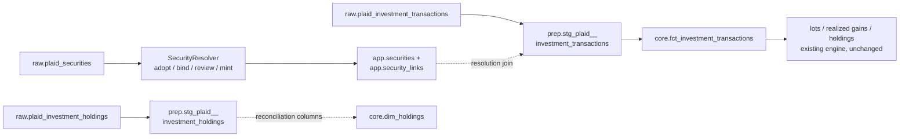

# Sync: Plaid Investments Provider

## Status
<!-- draft | ready | in-progress | implemented -->
ready

## Goal

Second Plaid product child: Plaid Investments. Pull securities, investment
transactions, and holdings snapshots for connected brokerage/retirement accounts
through moneybin-sync, land them in provider-specific raw tables, resolve
security identity to the canonical catalog, and flow investment events into
`core.fct_investment_transactions` — where the shipped cost-basis engine derives
lots, realized gains, and holdings with **no engine changes**. Once Plaid rows
reach the ledger, everything downstream is existing machinery.

## Background

- [`sync-overview.md`](sync-overview.md) — umbrella spec: interaction model,
  `SyncClient`, CLI/MCP surface, provider contract. This spec adds no new
  commands or tools; investments ride the existing surface.
- [`sync-plaid.md`](sync-plaid.md) — sibling: Plaid Transactions (M1G Phase 1,
  shipped). This spec mirrors its raw/staging/core pattern, its metadata-column
  conventions, and its `sync pull` job flow.
- [`investments-data-model.md`](investments-data-model.md) — the M1J.1
  foundation child (shipped PR #300). Its **Plaid Investments Readiness**
  section pressure-tested every contract this spec builds on against
  `plaid/plaid-openapi` `2020-09-14.yml` @ `6abd747c` (2026-07-04); the
  taxonomy mapping below is restated from there verbatim.
- [`investments-overview.md`](investments-overview.md) — the M1J umbrella; this
  spec is the first "already-carved child" to land.
- [`merchant-entity-resolution.md`](merchant-entity-resolution.md) (M1T) — the
  provider-id binding + review-queue pattern security identity mirrors, per
  `investments-data-model.md` Requirement 3's explicit anticipation.
- [`account-identity-resolution.md`](account-identity-resolution.md) (M1S) —
  the `app.account_links` resolution staging views join through.
- [ADR-007: JSON over Parquet](../decisions/007-json-over-parquet-for-sync.md).
- Addresses: **M1G.4** (Plaid product breadth) in service of **M1J**
  (investments milestone; gated child). Sequenced before M1X (account subtype
  detail + Plaid Liabilities) per the post-release wave in
  [`roadmap.md`](../roadmap.md).

## Requirements

1. **Unified pull.** Investments data arrives through the existing
   `moneybin sync pull` job — no new CLI command, MCP tool, or job type. The
   `/sync/data` response is extended with three optional arrays (below); a
   payload without them loads exactly as today. Plaid-side mechanics (holdings
   are always a full snapshot; investment transactions are date-range queries
   with a server-owned watermark; there is no cursor) are server-internal per
   the "sync server is opaque" design principle.
2. **Max-capture raw.** Three new tables — `raw.plaid_securities`,
   `raw.plaid_investment_transactions`, `raw.plaid_investment_holdings` —
   preserve Plaid's native shape faithfully, keyed for idempotent re-load
   (`INSERT OR REPLACE`). Keys follow the **shipped** cash tables — provider
   id scoped by `source_origin`, not by `source_file` — so a later sync job
   that re-delivers the same row **replaces** it rather than duplicating it
   (overlapping date-range pulls are Plaid's normal investments behavior).
   `source_file = sync_{job_id}` stays as lineage metadata recording which job
   last wrote the row. No data loss, no duplicate rows on re-sync.
3. **Sign faithfulness.** Plaid investment `amount` is **positive = cash out**
   — the exact opposite of the ledger convention (negative = cash out). Raw
   preserves Plaid's convention; the flip happens exclusively in
   `prep.stg_plaid__investment_transactions`. Plaid `quantity` already matches
   the ledger convention (signed: + acquire, − dispose) and is not flipped.
4. **Taxonomy mapping in staging.** Plaid's 6 types × 48 subtypes map onto the
   closed 14-value ledger `type` (+ `subtype` refinement) per the table locked
   in `investments-data-model.md` — restated below. Lifecycle rows (`cancel`,
   `cash/pending credit`, `cash/pending debit`, `transfer/request`) are
   captured in raw but excluded at staging.
5. **Provider fidelity to core.** Plaid's original type/subtype strings are
   preserved end-to-end as two new nullable columns on
   `core.fct_investment_transactions`: `provider_type`, `provider_subtype` —
   the same promotion `original_description` received on
   `core.fct_transactions`. NULL for manual entry; the future OFX child
   populates them from `<INVTRANLIST>` types. This is an additive column
   migration and supersedes the foundation spec's "no core migration" note.
6. **Security identity mirrors M1T.** Two new tables — `app.security_links`
   (provider-ref → canonical `security_id` binding) +
   `app.security_link_decisions` (fuzzy-match review queue) — with a
   `SecurityResolver` running adopt-or-mint before transforms: adopt bound →
   auto-bind strong identifier → **provisional-mint + propose merge** on a
   fuzzy match → mint into `app.securities` with `created_by = 'plaid'`.
   Every rung ends with an accepted binding, so **every security-bearing row
   reaches the ledger on the sync that delivered it** — the cost-basis engine
   skips NULL-`security_id` events, so a held-out-pending-review row would
   silently understate lots and gains. `core.dim_securities` **remains a
   catalog view** (the merchant precedent); the foundation model's "Future:
   UNION ALL from staging" comment is superseded by this spec.
7. **Holdings are store-don't-trust.** Broker-reported holdings land as dated
   snapshots (mirroring `raw.plaid_balances`) and surface as clearly-labeled,
   non-authoritative `provider_reported_*` reconciliation columns on
   `core.dim_holdings`. They never feed the cost-basis engine and never
   overwrite ledger-derived numbers.
8. **Deterministic event grouping.** Two-row economic events (reinvest pairs,
   corporate-action legs) are linked by an `event_group_id` synthesized in
   staging as a **content hash** of the pairing key — never a random UUID,
   which would churn on every SQLMesh rebuild. Pairing is enrichment, not a
   correctness gate: an unpaired reinvest row still opens its lot and the
   income row still counts as income; only the linkage is absent.
9. **Derived models untouched.** `core.fct_investment_lots`,
   `core.fct_realized_gains`, and `core.dim_holdings`'s ledger-derived columns
   need no changes — they rebuild from the unioned ledger automatically. After
   a successful load, `SyncService.pull()` runs the standard post-load refresh
   (same semantics, soft-fail behavior, and opt-outs as `sync-plaid.md`
   Requirement 10).
10. **Connection status.** `app.sync_connections` reflects investments in its
    per-institution counts and error details, same envelope as cash sync.
    Investments-specific Plaid error codes map to actionable guidance (below).
11. **No PII or financial data in logs.** Record counts, institution names,
    and masked identifiers only — no tickers-with-quantities, no amounts.
12. **Registration.** New raw/app DDL registered in
    `src/moneybin/sql/schema/schema.py`; `app.*` tables and the additive core
    columns delivered via `database-migration.md`'s dual-path pattern.

---

## Server contract

Restated inline per project convention (public MoneyBin docs never link
sibling-repo paths). This is the contract moneybin-sync must implement; the
client treats everything Plaid-side as opaque.

`GET /sync/data` gains three **optional** top-level arrays alongside the
existing `accounts` / `transactions` / `balances` / `removed_transactions`:

```json
{
  "securities": [
    {
      "security_id": "kqzLDp...",
      "institution_security_id": null,
      "institution_id": null,
      "ticker_symbol": "AAPL",
      "market_identifier_code": "XNAS",
      "name": "Apple Inc.",
      "type": "equity",
      "close_price": 214.55,
      "close_price_as_of": "2026-07-08",
      "iso_currency_code": "USD",
      "unofficial_currency_code": null,
      "cusip": null,
      "isin": null,
      "is_cash_equivalent": false
    }
  ],
  "investment_transactions": [
    {
      "investment_transaction_id": "vNzRqk...",
      "account_id": "eJbKw3...",
      "security_id": "kqzLDp...",
      "date": "2026-07-06",
      "order_datetime": "2026-07-05T14:30:00Z",
      "name": "BUY AAPL",
      "quantity": 10.0,
      "amount": 2145.50,
      "price": 214.55,
      "fees": 0.0,
      "iso_currency_code": "USD",
      "unofficial_currency_code": null,
      "type": "buy",
      "subtype": "buy"
    }
  ],
  "investment_holdings": [
    {
      "account_id": "eJbKw3...",
      "security_id": "kqzLDp...",
      "institution_price": 214.55,
      "institution_price_as_of": "2026-07-08",
      "institution_value": 2145.50,
      "cost_basis": 1980.00,
      "quantity": 10.0,
      "iso_currency_code": "USD",
      "unofficial_currency_code": null,
      "vested_quantity": null,
      "vested_value": null
    }
  ]
}
```

Field names and semantics track Plaid's Investments objects one-to-one
(`Security`, `InvestmentTransaction`, `Holding`); the server passes them
through without reshaping. `metadata` (job id, `synced_at`, per-institution
results) is unchanged.

### No removals in v1 (documented limitation)

Plaid Investments has no cursor/removed-list mechanism analogous to
`/transactions/sync`: holdings are always a full snapshot, and investment
transactions are date-range queries the server re-runs each sync. Consequence:
there is **no `removed_investment_transactions` array**, and a transaction
Plaid retracts after delivery is not detected as a removal — only as absence
from future date-range windows. This is a known, accepted v1 gap (the cash
pipeline's removal handling does not extend here); revisit if Plaid ships a
sync-style investments endpoint or real drift shows up in reconciliation.

---

## Data model

### Raw tables

Column comments follow `.claude/rules/database.md`. Metadata columns
(`source_file`, `source_type`, `source_origin`, `extracted_at`, `loaded_at`)
are client-generated exactly as in `sync-plaid.md` (§ Client-side metadata
generation): `source_file = f"sync_{job_id}"`, `source_origin` = Plaid
`item_id`, `extracted_at` = `metadata.synced_at`.

#### `raw.plaid_securities`

```sql
/* Securities referenced by Plaid holdings/investment transactions; one record per security per sync payload */
CREATE TABLE IF NOT EXISTS raw.plaid_securities (
    security_id VARCHAR NOT NULL,             -- Plaid security_id; adopt-quality (churns on corporate actions), not immutable
    institution_security_id VARCHAR,          -- Institution's own identifier; unique only per institution; often NULL
    institution_id VARCHAR,                   -- Plaid institution_id; scopes institution_security_id
    ticker_symbol VARCHAR,                    -- Ticker as reported; may carry exchange suffix
    market_identifier_code VARCHAR,           -- ISO-10383 MIC of the listing exchange/market; the exchange signal for ticker+exchange resolution
    security_name VARCHAR,                    -- Plaid name
    security_type VARCHAR,                    -- Plaid Security.type; prose enum, not schema-enforced — staging maps defensively
    close_price DECIMAL(28, 10),              -- Plaid close_price; point-in-time convenience, NOT the Pillar C price history
    close_price_as_of DATE,                   -- Date of close_price
    iso_currency_code VARCHAR,                -- ISO 4217; mutually exclusive with unofficial_currency_code
    unofficial_currency_code VARCHAR,         -- Non-ISO (crypto) currency; staging COALESCEs the pair
    cusip VARCHAR,                            -- License-gated; NULL in practice since 2024-03
    isin VARCHAR,                             -- License-gated; NULL in practice
    is_cash_equivalent BOOLEAN,               -- Pairs with security_type = 'cash' (money-market/sweep)
    source_file VARCHAR NOT NULL,             -- Logical identifier: sync_{job_id}
    source_type VARCHAR NOT NULL              -- Always 'plaid' for this table
        DEFAULT 'plaid',
    source_origin VARCHAR NOT NULL,           -- Plaid item_id; scopes dedup to the institution connection; part of the PK
    extracted_at TIMESTAMP                    -- When the server fetched this data from Plaid (metadata.synced_at)
        DEFAULT CURRENT_TIMESTAMP,
    loaded_at TIMESTAMP                       -- When this record was inserted into the local database
        DEFAULT CURRENT_TIMESTAMP,
    PRIMARY KEY (security_id, source_origin)
);
```

#### `raw.plaid_investment_transactions`

```sql
/* Investment ledger events from Plaid investments/transactions/get; one record per transaction per sync payload */
CREATE TABLE IF NOT EXISTS raw.plaid_investment_transactions (
    investment_transaction_id VARCHAR NOT NULL, -- Plaid investment_transaction_id; stable unique identifier
    account_id VARCHAR NOT NULL,              -- Plaid account_id; foreign key to raw.plaid_accounts
    security_id VARCHAR,                      -- Plaid security_id; NULL for cash-only events (deposit, withdrawal, account fee)
    transaction_date DATE NOT NULL,           -- Plaid date; POSTING date ("typically the settlement date" per Plaid docs) — NOT the trade date; staging derives trade_date
    order_datetime TIMESTAMP,                 -- Plaid order_datetime; trade-initiation timestamp (select institutions only); preferred trade-date source
    transaction_name VARCHAR,                 -- Plaid name; broker's description of the event
    quantity DECIMAL(28, 10),                 -- Plaid quantity; already signed per ledger convention (+ acquire, − dispose)
    amount DECIMAL(18, 2) NOT NULL,           -- Plaid amount; CAUTION: positive = cash out (opposite of ledger convention); flip happens in staging
    price DECIMAL(28, 10),                    -- Per-unit price
    fees DECIMAL(18, 2),                      -- Fee/commission component
    iso_currency_code VARCHAR,                -- ISO 4217; mutually exclusive with unofficial_currency_code
    unofficial_currency_code VARCHAR,         -- Non-ISO (crypto) currency
    investment_transaction_type VARCHAR,      -- Plaid type (6-value: buy, sell, cash, fee, transfer, cancel)
    investment_transaction_subtype VARCHAR,   -- Plaid subtype (48-value); preserved to core as provider_subtype
    source_file VARCHAR NOT NULL,             -- Logical identifier: sync_{job_id}
    source_type VARCHAR NOT NULL              -- Always 'plaid' for this table
        DEFAULT 'plaid',
    source_origin VARCHAR NOT NULL,           -- Plaid item_id; part of the PK
    extracted_at TIMESTAMP                    -- When the server fetched this data from Plaid
        DEFAULT CURRENT_TIMESTAMP,
    loaded_at TIMESTAMP                       -- When this record was inserted into the local database
        DEFAULT CURRENT_TIMESTAMP,
    PRIMARY KEY (investment_transaction_id, source_origin)
);
```

#### `raw.plaid_investment_holdings`

```sql
/* Broker-reported holdings snapshot; dated, mirrors raw.plaid_balances — store-don't-trust reconciliation reference, never authoritative */
CREATE TABLE IF NOT EXISTS raw.plaid_investment_holdings (
    account_id VARCHAR NOT NULL,              -- Plaid account_id
    security_id VARCHAR NOT NULL,             -- Plaid security_id
    holdings_date DATE NOT NULL,              -- Snapshot date = extracted_at::DATE; Plaid holdings carry no as-of date of their own
    institution_price DECIMAL(28, 10),        -- Broker-reported price
    institution_price_as_of DATE,             -- Date of institution_price
    institution_value DECIMAL(18, 2),         -- Broker-reported market value
    cost_basis DECIMAL(18, 2),                -- Broker-reported cost basis; reconciliation reference ONLY — never overwrites ledger-derived basis
    quantity DECIMAL(28, 10),                 -- Broker-reported open quantity
    iso_currency_code VARCHAR,                -- ISO 4217; mutually exclusive with unofficial_currency_code
    unofficial_currency_code VARCHAR,         -- Non-ISO (crypto) currency
    vested_quantity DECIMAL(28, 10),          -- Vested units (equity compensation); NULL otherwise
    vested_value DECIMAL(18, 2),              -- Vested value (equity compensation); NULL otherwise
    source_file VARCHAR NOT NULL,             -- Logical identifier: sync_{job_id}
    source_type VARCHAR NOT NULL              -- Always 'plaid' for this table
        DEFAULT 'plaid',
    source_origin VARCHAR NOT NULL,           -- Plaid item_id; scopes dedup to the institution connection
    extracted_at TIMESTAMP                    -- When the server fetched this data from Plaid
        DEFAULT CURRENT_TIMESTAMP,
    loaded_at TIMESTAMP                       -- When this record was inserted into the local database
        DEFAULT CURRENT_TIMESTAMP,
    PRIMARY KEY (account_id, security_id, holdings_date, source_origin)
);
```

`Holding.tax_lots[]` (per-lot broker data, present only where the institution
supplies it) is **not** captured in v1 — no consumer exists; the position-level
`cost_basis` covers the reconciliation need. Revisit alongside a
lot-level-reconciliation surface if drift investigation demands it.

---

## Security identity resolution

Mirrors M1T (`merchant-entity-resolution.md`) structurally — binding table +
review queue + adopt-or-mint resolver — as `investments-data-model.md`
Requirement 3 anticipates. Mint-into-catalog follows the shipped merchant
precedent (`core.dim_merchants` is a thin view over `app.user_merchants`;
minted rows carry `created_by='plaid'`).

### `app.security_links` — provider-ref → canonical-security binding

```sql
-- app.security_links
link_id      TEXT     PRIMARY KEY,   -- uuid4[:12]
security_id  TEXT     NOT NULL,      -- canonical app.securities entry this provider ref maps to
ref_kind     TEXT     NOT NULL,      -- CHECK (ref_kind IN ('plaid_security_id', 'institution_security_id'))  [closed, extensible]
ref_value    TEXT     NOT NULL,      -- the provider ref (see ref_kind semantics below)
source_type  TEXT     NOT NULL,      -- issuing provider: plaid (future: ofx institutions, ...)
status       TEXT     NOT NULL,      -- CHECK (status IN ('accepted', 'reversed'))
decided_by   TEXT     NOT NULL,      -- CHECK (decided_by IN ('auto', 'user', 'system'))
decided_at   TIMESTAMP NOT NULL,
reversed_at  TIMESTAMP,
reversed_by  TEXT
```

**`ref_kind` semantics:**

- `plaid_security_id` — the primary strong rung. Plaid's `security_id` is
  always present and globally unique per provider, but **adopt-quality**: it
  can churn on corporate actions. Churn is absorbed by the binding model — a
  new provider id simply resolves through the chain and binds to the *same*
  canonical security (N:1 is allowed, exactly as merchant variant ids are).
- `institution_security_id` — secondary; unique only per institution, so
  `ref_value` stores the composite `{institution_id}:{institution_security_id}`.
  Frequently NULL in Plaid data; used when present.

Contracts mirror `merchant_links` (repo-enforced guards): one
`(source_type, ref_kind, ref_value)` → one canonical security among `accepted`
rows; no uniqueness on `security_id` (one security holds many provider refs).

### `app.security_link_decisions` — fuzzy-match review queue

```sql
-- app.security_link_decisions
decision_id            TEXT  PRIMARY KEY,  -- uuid4[:12]
ref_kind               TEXT  NOT NULL,
ref_value              TEXT  NOT NULL,     -- the unbound provider ref under review
source_type            TEXT  NOT NULL,
provider_ticker        TEXT,               -- Plaid ticker_symbol (reviewer display + match basis)
provider_name          TEXT,               -- Plaid security name
candidate_security_id  TEXT  NOT NULL,     -- existing app.securities entry proposed as the binding target
confidence_score       DECIMAL(5, 4),
match_signals          TEXT,               -- JSON: which signal fired + value (match_decisions convention)
status                 TEXT  NOT NULL,     -- CHECK (status IN ('pending', 'accepted', 'rejected', 'reversed'))
decided_by             TEXT  NOT NULL,     -- CHECK (decided_by IN ('auto', 'user'))
match_reason           TEXT,
decided_at             TIMESTAMP NOT NULL,
reversed_at            TIMESTAMP,
reversed_by            TEXT
```

Decision resolution follows `merchant_link_decisions` Decision 6 in shape,
with **merge semantics** (the provisional security already exists by the time
the decision is reviewed — see ladder rung 3): **accept** rebinds the provider
ref's `security_links` row to `candidate_security_id` and deletes the
provisional `created_by='plaid'` catalog row through the repo (audited,
undoable per Invariant 10/11); core rebuilds deterministically, so lots and
gains re-key onto the surviving security on the next transform. **Reject**
keeps the minted security — the reviewer is asserting it genuinely is a
distinct instrument — and records the declined pairing so the resolver never
re-proposes it. **Undo** reverses. Sibling decisions for the same ref
auto-reject on accept. Pending decisions surface through the domain-neutral
`review` sweep as `security_links_pending`, mirroring `merchant_links_pending`.

### `SecurityResolver` — adopt-or-mint ladder

Python service, mirroring the merchant resolver's blocking → score →
accept/review/mint. Runs in `SyncService.pull()` **after raw load, before
transforms** — bindings must exist before the staging views' resolution joins
are materialized into core. Ladder, per incoming raw security:

| Rung | Condition | Action | Visibility |
|---|---|---|---|
| 1 | provider ref already in `security_links` (`accepted`) | **adopt** that `security_id` | silent — near-certain |
| 2 | unbound; strong identifier matches exactly one catalog entry (CUSIP/ISIN if present → ticker+exchange, per the foundation's resolution chain incl. the `BRK.B`-first / suffix-strip-second rule). The exchange signal is the captured `market_identifier_code`: a **contradicting** exchange on both sides disqualifies the match (falls to rung 3); absence on either side does not block an otherwise-unique exact-ticker match — else every Plaid security whose ticker already exists as a manual catalog entry (typically saved without an exchange) would provisional-mint a duplicate, and Plaid sells would stop consuming the manual lots until review | **auto-bind** (`decided_by='auto'`) | silent, reversible |
| 3 | unbound; name-fuzzy match to one-or-more candidates (no contradicting strong identifier — Guard 2) | **provisional-mint + propose merge**: mint into `app.securities` (`created_by='plaid'`) and bind — then file a pending `security_link_decisions` row proposing a **merge** of the minted security into the best fuzzy candidate | **surfaced** for review |
| 4 | no candidate | **mint** into `app.securities` (`created_by='plaid'`, defensive type mapping below) + bind | silent; visible via `created_by` |

Rung 3 mints *before* review (the account-identity precedent: mint-now,
merge-later) because holding rows out of the ledger until review is a silent
correctness bug — the cost-basis engine skips events with NULL `security_id`,
so a pending-review buy/sell would load into core yet never open or consume a
lot, understating holdings and gains with no visible signal. The cost is a
possible temporary duplicate security (minted + fuzzy candidate) — visible in
the review queue, cheap to merge, and exactly the never-auto-merge-on-fuzzy
posture the account and merchant ladders already take.

**Attribute refresh:** on subsequent syncs the resolver may update catalog
rows it minted (`created_by='plaid'`) with fresher name/ticker/type from
Plaid; it never modifies user-authored rows (`created_by='user'`). Same
posture as merchant minting.

### Modified table: `app.securities` — add `created_by`

Additive migration: `created_by VARCHAR NOT NULL DEFAULT 'user'`
(`CHECK (created_by IN ('user', 'plaid'))` — extensible for `ofx`), mirroring
`app.user_merchants.created_by`. Distinguishes minted from user-authored
entries; gates the resolver's attribute-refresh rule.

---

## Staging views

SQLMesh views in `prep`. All three resolve Plaid-native identifiers to
canonical ids at the staging boundary, so core never sees a provider id.

### `prep.stg_plaid__securities`

Thin resolution + normalization view (the resolver's enrichment input, **not**
a `dim_securities` union branch — see Key Decisions):

- Canonical `security_id` via `app.security_links` (`ref_kind =
  'plaid_security_id'`, `status = 'accepted'`), keeping the Plaid id as
  `source_security_key` for audit.
- `COALESCE(iso_currency_code, unofficial_currency_code) AS currency_code`
  (mutually exclusive by Plaid contract — lossless).
- `market_identifier_code AS exchange` — the ISO-10383 MIC is the exchange
  attribute the resolver's ticker+exchange rung matches on.
- Defensive `security_type` mapping (Plaid's type is a prose enum, not
  schema-enforced): `fixed income` → `bond`, `cash` → `cash`, `cryptocurrency`
  → `crypto`, `derivative`/`loan` → `other`, `equity`/`etf`/`mutual fund` →
  their obvious counterparts, unrecognized → `other`.

### `prep.stg_plaid__investment_transactions`

The heaviest view in this spec. In order:

1. **Resolve** canonical `security_id` via `security_links` (NULL passthrough
   for cash-only events) and canonical `account_id` via `app.account_links`
   (same accepted/source_native join as `stg_plaid__balances`). Because the
   resolver binds on every rung (adopt / auto-bind / provisional-mint / mint),
   every security-bearing row resolves — NULL reaches core only for cash-only
   events, which is exactly the set the cost-basis engine is designed to skip.
2. **Exclude** lifecycle rows: `cancel` (any subtype), `cash/pending credit`,
   `cash/pending debit`, `transfer/request`. (`cancel_transaction_id` is a
   deprecated dead field — never build on it.)
3. **Map taxonomy** (restated verbatim from `investments-data-model.md`
   § Plaid Investments Readiness; implemented as an explicit `CASE` over
   `(investment_transaction_type, investment_transaction_subtype)`):

   | Plaid (type/subtype) | → `type` | → `subtype` / notes |
   |---|---|---|
   | buy/{buy, buy to cover, contribution} | `buy` | shorts collapse (out of scope) |
   | buy/{dividend, interest, LT/ST capital gain} reinvestment | `reinvest` | subtype records funding source (`dividend`/`interest`/`capital_gain`); the paired Plaid income row maps to its own income type, linked by `event_group_id` |
   | buy/assignment, sell/exercise, transfer/{assignment, exercise, expire} | `other` | options out of scope |
   | sell/{sell, sell short} | `sell` | |
   | sell/distribution | `transfer_out` | in-kind outflow from tax-advantaged account |
   | cash-or-fee/{account, legal, management, transfer, trust, fund, miscellaneous} fee, margin expense | `fee` | |
   | cash-or-fee/{tax, tax withheld, non-resident tax} | `fee` | subtype `tax_withheld` |
   | cash-or-fee/{dividend, qualified dividend, non-qualified dividend} | `dividend` | subtype `qualified`/`non_qualified` |
   | cash-or-fee/{interest, interest receivable} | `interest` | |
   | cash-or-fee/{LT/ST capital gain, unqualified gain} | `capital_gain_distribution` | subtype `long_term`/`short_term` |
   | fee/return of principal | `return_of_capital` | |
   | cash/{contribution, deposit} | `deposit` | NULL security |
   | cash/withdrawal | `withdrawal` | NULL security |
   | transfer/{transfer, send} | `transfer_in`/`transfer_out` | direction by sign |
   | transfer/split | `split` | |
   | transfer/{merger, spin off, trade} | decomposed leg pairs | staging synthesizes legs; `event_group_id` links |
   | transfer/{adjustment}, fee/adjustment, loan payment, rebalance | `other` | |

4. **Map dates:** `trade_date = COALESCE(order_datetime::DATE,
   transaction_date)`; `settlement_date = transaction_date`. Plaid's `date`
   is the **posting date** ("typically the settlement date" per the API
   reference — verified 2026-07-10), not the trade date; `order_datetime`
   (trade initiation, returned by select institutions) is preferred when
   present. Where only the posting date exists it proxies the trade date —
   a buy or sell near the one-year holding boundary can misclassify ST/LT by
   the settlement lag. Named limitation; the real-broker 1099-B tie-out (the
   M1J close gate) is the corrective that catches it on affected accounts.
5. **Flip sign, normalize fee inclusion:** `-1 * amount AS amount` (Plaid
   positive = cash out → ledger negative = cash out); `quantity` passes
   through unflipped. The ledger contract requires `amount` fee-**inclusive**
   (foundation Requirement 6: a buy's basis is `|amount|`, a sell's net
   proceeds is `amount`) — but Plaid does not document whether its
   investment `amount` includes `fees` (verified against the API reference
   2026-07-10; no worked sample either). The convention is **validated
   against Sandbox golden payloads before implementation** (Open Questions):
   if goldens show fee-exclusive amounts, staging maps
   `-(amount + fees) AS amount` for every fee-bearing row (fees always
   increase cash out / reduce cash in, so one expression covers buys and
   sells); if fee-inclusive, the plain flip stands. Either way a drift guard
   flags rows where `|amount|` reconciles against `quantity × price ± fees`
   under neither convention (log + metric, never a load failure).
6. **Preserve provider strings:** `investment_transaction_type AS
   provider_type`, `investment_transaction_subtype AS provider_subtype`.
7. **Synthesize `event_group_id`** for two-row events as a content hash of the
   pairing key (identifiers.md content-hash pattern — deterministic across
   rebuilds, unlike a minted UUID, which would churn on every SQLMesh run):
   - **Reinvest pairs:** a `reinvest` acquisition row and its funding income
     row (Plaid delivers them as two `InvestmentTransaction` rows with no
     shared identifier). Candidate key: `(account_id, security_id, date,
     |amount| correlation)` — **exact key to be validated against Sandbox
     golden payloads before implementation** (Open Questions).
   - **Corporate-action legs:** `transfer/{merger, spin off, trade}` pairs.
     Same validation caveat.
   - **Degradation is safe:** if pairing fails, `event_group_id` stays NULL —
     the acquisition still opens its lot, income still counts once (reinvest
     rows carry the acquisition leg only, per foundation Requirement 6), and
     unmatched `transfer_in` legs open `basis_incomplete` lots per the
     established oversold/incomplete machinery. Linkage is audit enrichment.

### `prep.stg_plaid__investment_holdings`

Resolves **both** canonical ids — `account_id` via `app.account_links` and
`security_id` via `app.security_links` — plus the currency `COALESCE`. Without
both resolutions the `dim_holdings` reconciliation join silently matches
nothing (Plaid-native ids never equal canonical ids).

---

## Core integration

| Core model | Change |
|---|---|
| `core.dim_securities` | **None** (stays a catalog view over `app.securities`). The v1 model's `-- Future: UNION ALL resolved securities from prep.stg_plaid__securities` comment is superseded — minting puts every synced security *in* the catalog, so a union would double-count. Update the comment in place. |
| `core.fct_investment_transactions` | Add `plaid_investment_transactions` CTE selecting from `prep.stg_plaid__investment_transactions`, `UNION ALL` with the manual staging model (the extension point foundation Requirement 7 reserved). **New nullable columns** `provider_type VARCHAR`, `provider_subtype VARCHAR` (NULL for manual rows). Plaid rows use Plaid's `investment_transaction_id` as the canonical id (source-provided, per the column contract). |
| `core.dim_holdings` | **New nullable reconciliation columns** — `provider_reported_quantity`, `provider_reported_cost_basis`, `provider_reported_value`, `provider_reported_as_of` (= the joined snapshot's `holdings_date`) — LEFT JOINed from `prep.stg_plaid__investment_holdings` **bounded to each account's newest snapshot date** (`holdings_date = MAX(holdings_date)` per account/`source_origin`), never "latest row per position". Plaid holdings are full snapshots: a position absent from the newest snapshot means the broker no longer reports it, so it must show NULLs (itself a reconciliation signal against a nonzero ledger position) rather than carrying an older snapshot's row forward as if current. Column comments mark all four explicitly non-authoritative. |
| `core.fct_investment_lots` / `core.fct_realized_gains` | **No changes.** Derived from the unioned ledger; Plaid rows flow through the existing four-method engine automatically. |

Data flow:



---

## Amount sign convention

Worth restating loudly, as the cash spec does. For **investment** rows:

| System | Cash out (buy) | Cash in (sell, dividend) |
|---|---|---|
| **Plaid Investments** (server delivers this) | Positive (`2145.50`) | Negative (`-500.00`) |
| **MoneyBin ledger convention** | Negative (`-2145.50`) | Positive (`500.00`) |

The flip happens **exclusively** in `prep.stg_plaid__investment_transactions`
via `-1 * amount`. `quantity` is **not** flipped — Plaid already signs it the
ledger's way (+ acquire, − dispose). No other code path touches either sign.

---

## Investments-specific error codes

Extends the `sync-plaid.md` error table (all codes there still apply):

| Plaid error code | Meaning | Client message |
|---|---|---|
| `PRODUCT_NOT_READY` | Plaid hasn't finished the initial investments pull | "{institution} is still processing investment data. Try again in a few minutes." |
| `PRODUCTS_NOT_SUPPORTED` | Institution/account doesn't support the investments product | "{institution} doesn't provide investment data through Plaid. Cash accounts still sync normally." |
| `INVALID_PRODUCT` | Item lacks investments consent (linked before consent expansion) | "{institution} was linked before investment access — run `moneybin sync link` to re-consent." |

A partial failure (investments errored, cash succeeded) is recorded
per-product in the institution's `app.sync_connections` error details; cash
data still loads.

---

## Testing strategy

### Unit tests (no server required)

| Test area | What's tested |
|---|---|
| `PlaidInvestmentsLoader.load()` | Golden-file JSON → in-memory DuckDB: row counts, column values, metadata generation for all three tables. Empty arrays load cleanly. Re-load dedup: same payload twice AND the same provider row re-delivered under a **different** `job_id` both replace, never duplicate (PK scoped by `source_origin`). |
| `SecurityResolver` | Each ladder rung: adopt existing binding; auto-bind on ticker+exchange; fuzzy → provisional mint + bind + pending **merge** decision; mint with `created_by='plaid'`; merge-accept rebinds and removes the provisional row (audited); merge-reject keeps it; Guard-2 rejection (contradicting strong identifier); attribute refresh touches minted rows only; institution-scoped composite `ref_value`. |
| Taxonomy mapping | Parametrized over the full mapping table — every Plaid (type, subtype) pair → expected (`type`, `subtype`), including every excluded-at-staging row. |

### SQL tests (no server required)

| Test area | What's tested |
|---|---|
| `stg_plaid__investment_transactions` | Sign flip (`2145.50` → `-2145.50`; quantity untouched); fee-convention handling per the validated branch (+ drift-guard fires on a row reconciling under neither); `trade_date` prefers `order_datetime`, falls back to posting date; lifecycle exclusion; provider string passthrough; canonical id resolution; deterministic `event_group_id` (identical across two rebuilds). |
| `stg_plaid__securities` / `__investment_holdings` | Currency `COALESCE`; MIC → `exchange`; defensive type mapping; both-id resolution on holdings. |
| Core union | Plaid rows in `fct_investment_transactions` with correct sign + provider columns; manual rows carry NULL provider columns; Plaid buys/sells produce lots and realized gains through the **unmodified** engine; `dim_holdings` reconciliation columns join only each account's newest snapshot — a position absent from it (sold elsewhere, broker stopped reporting) shows NULL `provider_reported_*`, and manual-only positions stay NULL throughout. |
| Reinvest pairing | Golden fixture (captured from Sandbox): reinvest pair shares one `event_group_id`; unpairable row degrades to NULL group with lot/income effects intact. |

### Integration tests (server required)

Same gate as `sync-plaid.md`: `@pytest.mark.integration`, skipped by default,
enabled via `MONEYBIN_SYNC__TEST_SERVER_URL`. Blocked until moneybin-sync
implements the contract above. Plaid Sandbox provides investment-account test
fixtures (`user_good` includes investment accounts with holdings and
transactions), which also seed the golden files.

---

## Implementation plan

### Files to create

| File | Purpose |
|---|---|
| `src/moneybin/loaders/plaid_investments_loader.py` | `PlaidInvestmentsLoader`: JSON arrays → the three raw tables |
| `src/moneybin/services/security_resolver.py` | `SecurityResolver` adopt-or-mint ladder |
| `src/moneybin/repositories/security_links_repo.py` | Binding + decision writes (Invariant 10; audit-emitting) |
| `src/moneybin/sql/schema/raw_plaid_securities.sql` | DDL |
| `src/moneybin/sql/schema/raw_plaid_investment_transactions.sql` | DDL |
| `src/moneybin/sql/schema/raw_plaid_investment_holdings.sql` | DDL |
| `src/moneybin/sql/schema/app_security_links.sql` | DDL |
| `src/moneybin/sql/schema/app_security_link_decisions.sql` | DDL |
| `sqlmesh/models/prep/stg_plaid__securities.sql` | Staging view |
| `sqlmesh/models/prep/stg_plaid__investment_transactions.sql` | Staging view |
| `sqlmesh/models/prep/stg_plaid__investment_holdings.sql` | Staging view |
| Migration (next free `V0xx`) | `app.securities.created_by`; new app tables; core column additions |
| `tests/fixtures/plaid_investments_sync_response.json` | Golden file (captured from Sandbox) |
| Unit/SQL test modules | Per the testing strategy |

### Files to modify

| File | Change |
|---|---|
| `sqlmesh/models/core/fct_investment_transactions.sql` | Plaid CTE + `UNION ALL`; `provider_type`/`provider_subtype` columns |
| `sqlmesh/models/core/dim_holdings.sql` | Reconciliation columns (LEFT JOIN latest snapshot) |
| `sqlmesh/models/core/dim_securities.sql` | Supersede the union comment (no structural change) |
| `src/moneybin/repositories/securities_repo.py` | Add `created_by` to the repo's column list so mint/refresh writes go through `SecuritiesRepo` (Invariant 10 — the only `app.securities` write path); the resolver's "never touch `created_by='user'` rows" rule is enforced here, not in the service |
| `src/moneybin/sql/schema/schema.py` | Register new DDL files |
| `src/moneybin/services/sync_service.py` | Invoke `PlaidInvestmentsLoader` + `SecurityResolver` in `pull()` (load → resolve → refresh) |
| `src/moneybin/loaders/plaid_loader.py` or shared response model | Extend `SyncDataResponse` with the three optional arrays |
| Review sweep (CLI `review` / MCP) | Add `security_links_pending` count |

Server-side work (moneybin-sync: consent already requested at link time;
endpoints to fetch/assemble the three arrays) is tracked in that repo — the
contract above is its specification.

---

## Out of scope

| Exclusion | Reason |
|---|---|
| Plaid Liabilities product | Separate M1X child, sequenced after this spec — no shared plumbing (2026-07-09 roadmap decision) |
| Holdings-reconciliation report/CLI surface | The `dim_holdings` columns expose the data; a dedicated drift report is a natural Pillar C companion |
| `Holding.tax_lots[]` capture | No consumer; position-level `cost_basis` covers reconciliation. Revisit on real drift evidence |
| Options, margin/short positions | Out of scope per `investments-data-model.md`; mapped to `other` |
| Multi-currency FX conversion | M1K; `currency_code` lands losslessly via the COALESCE |
| `removed_investment_transactions` | No Plaid mechanism exists; documented v1 limitation (§ Server contract) |
| Multi-provider holdings tiebreak on `dim_holdings` | Single provider in v1; adopt the `fct_balances_daily` precedence pattern when a second holdings source lands |
| Webhook-based sync, offline queue | Same exclusions as `sync-plaid.md` |
| Price feeds (`close_price` as history) | `raw.plaid_securities.close_price` is a point-in-time convenience; the append-only price history is Pillar C (`investments-price-feeds.md`) |

## Key decisions

- **Unified `sync pull` job, additive contract.** One command syncs everything
  the item consents to; zero new client surface. Plaid's mechanically different
  investments endpoints (snapshot holdings, date-range transactions, no cursor)
  stay server-internal.
- **Mint-into-catalog, not union-into-dim.** Follows the shipped merchant
  precedent; doing both (the foundation model's inline union comment *and*
  minting) would double-count every synced security. The comment is superseded;
  `dim_securities` remains a catalog view.
- **`provider_type`/`provider_subtype` promoted to core.** The
  `original_description` precedent: provider fidelity that consumers can query
  without raw access. Corrects the foundation's "no core migration" note
  (additive nullable columns; no reshape).
- **Dated holdings snapshots + labeled reconciliation columns.** History for
  free (mirrors `raw.plaid_balances`); the broker's claim visible beside
  ledger-derived numbers on `dim_holdings`, never blended into them.
- **Content-hash `event_group_id` in staging.** A minted UUID would churn on
  every SQLMesh rebuild; the content hash is stable and deterministic
  (identifiers.md pattern). Manual entry keeps its minted-at-entry UUID —
  persisted in raw, so determinism is unaffected there.
- **Taxonomy as an explicit staging `CASE`.** Versioned with the model, exact,
  and testable row-by-row; no seed-table indirection for a mapping that changes
  only when Plaid's enum does.
- **Provisional mint on fuzzy — never hold rows out of the ledger.** The
  cost-basis engine skips NULL-`security_id` events by design (cash-only), so
  parking security-bearing rows behind a review gate would silently understate
  lots/gains until the human acts. Rung 3 therefore mints immediately and turns
  the review decision into a visible, reversible merge proposal — the
  account-identity mint-now/merge-later precedent. (Surfaced by external
  review on this spec's PR; the original propose-without-mint shape was a
  correctness bug.)
- **Raw keys scoped by `source_origin`, not `source_file`.** Matches the
  shipped cash tables (the `sync-plaid.md` doc had drifted from the
  implementation — corrected alongside this spec): overlapping date-range
  pulls re-deliver the same provider rows, and origin-scoped keys make
  re-delivery a replace instead of a duplicate that would double-count lots.

## Open questions

- **Reinvest / corporate-action pairing key.** Plaid exposes no explicit
  pairing identifier; the candidate heuristic `(account_id, security_id, date,
  |amount| correlation)` must be validated against real Sandbox golden payloads
  (dividend-reinvestment pair; merger/spin-off if reproducible) **before**
  implementing the synthesis. Until validated, shipping with pairing disabled
  (`event_group_id` NULL) loses no correctness — only linkage (§ staging,
  degradation note).
- **Fee inclusion in Plaid `amount`.** Plaid's API reference does not state
  whether `InvestmentTransaction.amount` includes `fees`, and ships no worked
  sample (verified 2026-07-10). The same Sandbox golden capture that settles
  the pairing key must assert `|amount|` against `quantity × price ± fees`
  and settle the convention; staging § step 5 specifies both branches, so the
  answer selects a branch rather than reopening design. Institution-level
  variance, if the goldens reveal it, escalates this from a constant to a
  per-row reconciliation rule — surface to review if so.
- **Plaid `security_id` churn rate in practice.** The binding model absorbs
  churn, but if corporate actions produce frequent re-mints (rung 4 firing for
  a security that should have re-bound at rung 2/3), the resolver's strong-rung
  ordering may need tuning. Watch during the first real-account cycles.
