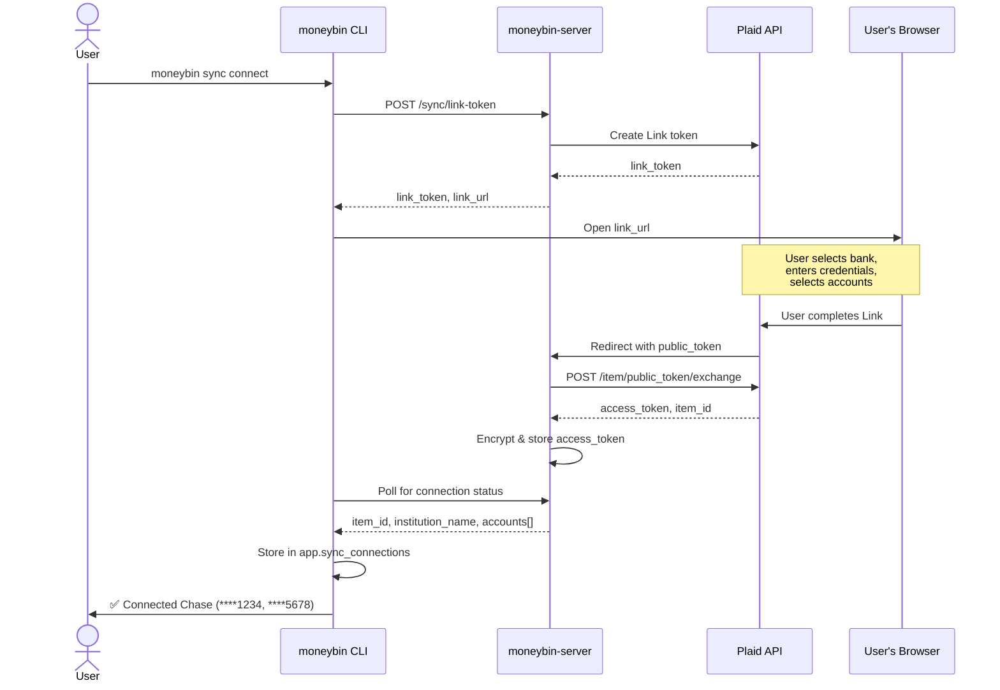

# Sync: Plaid Provider

## Status
<!-- draft | ready | in-progress | implemented -->
implemented

## Goal
Implement the first sync provider for MoneyBin: Plaid Transactions. Pull checking, savings, and credit card transactions from connected banks through moneybin-server, load into provider-specific raw tables, and flow through the data warehouse into core alongside OFX, CSV, and tabular-imported data.

## Background
- [`sync-overview.md`](sync-overview.md) — umbrella spec defining the interaction model, client infrastructure, CLI/MCP surface, encryption design, and provider contract this spec implements.
- [`../moneybin-server/docs/architecture/api-contract.md`](../../moneybin-server/docs/architecture/api-contract.md) — authoritative server API surface including sync endpoints, data format, and error responses.
- [`../moneybin-server/docs/specs/phase-2-plaid-sync.md`](../../moneybin-server/docs/specs/phase-2-plaid-sync.md) — server-side Plaid integration (cursor management, access token storage, job orchestration). The client does not depend on these details.
- [`../moneybin-server/docs/architecture/system-overview.md`](../../moneybin-server/docs/architecture/system-overview.md) — ecosystem architecture and data flow.
- [ADR-007: JSON over Parquet](../decisions/007-json-over-parquet-for-sync.md) — why sync uses JSON instead of Parquet.
- [`privacy-data-protection.md`](privacy-data-protection.md) — `Database` connection factory, encryption at rest. All writes go through `get_database()`.
- [`matching-overview.md`](matching-overview.md) — transaction matching consumes Plaid data alongside OFX/CSV. `source_type = 'plaid'` feeds the matching engine's blocking and scoring pipeline.
- Existing connector stub: `src/moneybin/connectors/plaid_sync.py` (to be replaced).

## Requirements

1. Client can connect bank accounts via Plaid Link through the server-hosted callback flow (Phase 2 of the interaction model).
2. Client can trigger a sync job and poll for completion. Incremental sync uses Plaid's cursor-based pagination (server-managed). `--force` resets the cursor for full history re-fetch.
3. Client downloads JSON payload and loads into `raw.plaid_*` DuckDB tables with no data loss and no duplicate rows on re-sync.
4. Sign convention is preserved faithfully in raw (Plaid: positive = expense). The flip to MoneyBin convention (negative = expense) happens exclusively in staging views.
5. Plaid's `removed_transactions` are deleted from `raw.plaid_transactions` on each sync.
6. SQLMesh staging views standardize Plaid data for core consumption. Core models include Plaid data via `UNION ALL` with `source_type = 'plaid'`.
7. `app.sync_connections` is updated after every sync with per-institution status, transaction counts, and error details.
8. Plaid-specific error codes are mapped to actionable user guidance per `sync-overview.md` error handling patterns.
9. No PII or financial data in logs. Transaction counts, institution names, and masked account numbers only.

---

## Plaid Link flow

The connect flow uses a server-hosted callback pattern. The client never communicates with Plaid directly — the server proxies everything.



**Key design decisions:**

- **Server-hosted callback (Option C from design discussion).** Plaid redirects to a server endpoint after the user completes Link. The client polls the server for confirmation. No local HTTP listener needed on the client side. Works for both CLI and future web clients.
- **`--no-browser` flag.** For headless/SSH environments, prints the link URL instead of opening a browser. The user visits the URL on any device. The client still polls for completion.
- **Re-authentication.** When `ITEM_LOGIN_REQUIRED` is reported, the same `moneybin sync connect` command initiates a re-auth Link session for the affected institution. The server creates a Link token in update mode using the existing `item_id`.

---

## Data model

### Raw tables

Three tables in the `raw` schema, preserving Plaid's native data shape. Column comments follow `.claude/rules/database.md` conventions.

#### `raw.plaid_accounts`

```sql
/* Bank accounts connected via Plaid Link; one record per account per sync payload */
CREATE TABLE IF NOT EXISTS raw.plaid_accounts (
    account_id VARCHAR NOT NULL,       -- Plaid account_id; stable identifier across syncs
    account_type VARCHAR,              -- Plaid account type: depository, credit, loan, investment, other
    account_subtype VARCHAR,           -- Plaid account subtype: checking, savings, credit card, mortgage, etc.
    institution_name VARCHAR,          -- Human-readable institution name from Plaid
    official_name VARCHAR,             -- Official account name from the institution
    mask VARCHAR,                      -- Last 4 digits of the account number
    source_file VARCHAR NOT NULL,      -- Logical identifier: sync_{job_id}
    source_type VARCHAR NOT NULL       -- Always 'plaid' for this table
        DEFAULT 'plaid',
    source_origin VARCHAR,             -- Plaid item_id; scopes dedup to the institution connection
    extracted_at TIMESTAMP             -- When the server fetched this data from Plaid (from metadata.synced_at)
        DEFAULT CURRENT_TIMESTAMP,
    loaded_at TIMESTAMP                -- When this record was inserted into the local database
        DEFAULT CURRENT_TIMESTAMP,
    PRIMARY KEY (account_id, source_file)
);
```

#### `raw.plaid_transactions`

```sql
/* Transaction records fetched from Plaid transactions/sync endpoint; one record per transaction per sync payload */
CREATE TABLE IF NOT EXISTS raw.plaid_transactions (
    transaction_id VARCHAR NOT NULL,   -- Plaid transaction_id; stable unique identifier
    account_id VARCHAR NOT NULL,       -- Plaid account_id; foreign key to raw.plaid_accounts
    transaction_date DATE NOT NULL,    -- Date the transaction posted; from Plaid date field
    amount DECIMAL(18, 2) NOT NULL,    -- Plaid amount; CAUTION: Plaid convention is positive = expense; sign flip happens in staging
    description VARCHAR,               -- Plaid name field; merchant or payee description
    merchant_name VARCHAR,             -- Plaid merchant_name; normalized merchant name; NULL when Plaid cannot identify
    category VARCHAR,                  -- Plaid personal_finance_category.primary; broad spending category
    pending BOOLEAN                    -- True if transaction has not yet settled
        DEFAULT false,
    source_file VARCHAR NOT NULL,      -- Logical identifier: sync_{job_id}
    source_type VARCHAR NOT NULL       -- Always 'plaid' for this table
        DEFAULT 'plaid',
    source_origin VARCHAR,             -- Plaid item_id; scopes dedup to the institution connection
    extracted_at TIMESTAMP             -- When the server fetched this data from Plaid (from metadata.synced_at)
        DEFAULT CURRENT_TIMESTAMP,
    loaded_at TIMESTAMP                -- When this record was inserted into the local database
        DEFAULT CURRENT_TIMESTAMP,
    PRIMARY KEY (transaction_id, source_file)
);
```

#### `raw.plaid_balances`

```sql
/* Account balance snapshots from Plaid; one record per account per balance date per sync payload */
CREATE TABLE IF NOT EXISTS raw.plaid_balances (
    account_id VARCHAR NOT NULL,       -- Plaid account_id; foreign key to raw.plaid_accounts
    balance_date DATE NOT NULL,        -- Date the balance was reported
    current_balance DECIMAL(18, 2),    -- Current balance including pending transactions
    available_balance DECIMAL(18, 2),  -- Available balance (current minus holds); NULL for credit accounts
    source_file VARCHAR NOT NULL,      -- Logical identifier: sync_{job_id}
    source_type VARCHAR NOT NULL       -- Always 'plaid' for this table
        DEFAULT 'plaid',
    source_origin VARCHAR,             -- Plaid item_id; scopes dedup to the institution connection
    extracted_at TIMESTAMP             -- When the server fetched this data from Plaid (from metadata.synced_at)
        DEFAULT CURRENT_TIMESTAMP,
    loaded_at TIMESTAMP                -- When this record was inserted into the local database
        DEFAULT CURRENT_TIMESTAMP,
    PRIMARY KEY (account_id, balance_date, source_file)
);
```

### Client-side metadata generation

The JSON response from the server does not include `source_file`, `source_type`, `source_origin`, `extracted_at`, or `loaded_at`. The `PlaidLoader` generates these:

| Field | Generated from |
|---|---|
| `source_file` | `f"sync_{job_id}"` — logical identifier for this sync payload |
| `source_type` | `'plaid'` (hardcoded per provider) |
| `source_origin` | `item_id` from the sync metadata — identifies which institution connection produced this data |
| `extracted_at` | `metadata.synced_at` from the JSON response |
| `loaded_at` | `CURRENT_TIMESTAMP` at DuckDB insertion time |

---

## Staging views

SQLMesh views in the `prep` schema. Each normalizes Plaid's data shape for core consumption.

### `prep.stg_plaid__accounts`

```sql
MODEL (
  name prep.stg_plaid__accounts,
  kind VIEW
);

SELECT
  account_id,
  NULL::VARCHAR AS routing_number,
  account_type,
  institution_name,
  NULL::VARCHAR AS institution_fid,
  official_name,
  mask,
  account_subtype,
  source_file,
  source_type,
  source_origin,
  extracted_at,
  loaded_at
FROM raw.plaid_accounts
```

### `prep.stg_plaid__transactions`

```sql
MODEL (
  name prep.stg_plaid__transactions,
  kind VIEW
);

SELECT
  transaction_id,
  account_id,
  transaction_date AS posted_date,
  -1 * amount AS amount,              -- Flip Plaid convention (positive = expense) to MoneyBin convention (negative = expense)
  TRIM(description) AS description,
  TRIM(merchant_name) AS merchant_name,
  category,
  pending AS is_pending,
  source_file,
  source_type,
  source_origin,
  extracted_at,
  loaded_at
FROM raw.plaid_transactions
```

The `-1 * amount` flip is the single most important transformation in the staging layer. Plaid: positive = expense, negative = income. MoneyBin: negative = expense, positive = income. Raw preserves Plaid's convention faithfully; the flip happens here and only here.

### `prep.stg_plaid__balances`

```sql
MODEL (
  name prep.stg_plaid__balances,
  kind VIEW
);

SELECT
  account_id,
  balance_date,
  current_balance,
  available_balance,
  source_file,
  source_type,
  source_origin,
  extracted_at,
  loaded_at
FROM raw.plaid_balances
```

### Core model integration

Add CTEs + `UNION ALL` to the relevant core models:

| Core model | Change |
|---|---|
| `core.dim_accounts` | Add `plaid_accounts` CTE selecting from `prep.stg_plaid__accounts` with `source_type = 'plaid'`, `UNION ALL` into `all_accounts` |
| `core.fct_transactions` | Add `plaid_transactions` CTE selecting from `prep.stg_plaid__transactions` with `source_type = 'plaid'`, `UNION ALL` into `all_transactions` |

No changes to core's dedup logic — cross-source dedup between Plaid and OFX/CSV is handled by the transaction matching pipeline (`matching-overview.md`).

---

## Implementation plan

### Files to create

| File | Purpose |
|---|---|
| `src/moneybin/loaders/plaid_loader.py` | `PlaidLoader` class: JSON → raw tables |
| `src/moneybin/sql/schema/raw_plaid_accounts.sql` | DDL for `raw.plaid_accounts` |
| `src/moneybin/sql/schema/raw_plaid_transactions.sql` | DDL for `raw.plaid_transactions` |
| `src/moneybin/sql/schema/raw_plaid_balances.sql` | DDL for `raw.plaid_balances` |
| `sqlmesh/models/prep/stg_plaid__accounts.sql` | Staging view |
| `sqlmesh/models/prep/stg_plaid__transactions.sql` | Staging view |
| `sqlmesh/models/prep/stg_plaid__balances.sql` | Staging view |
| `tests/test_plaid_loader.py` | Unit tests for PlaidLoader |
| `tests/test_stg_plaid.py` | SQL tests for staging views |
| `tests/fixtures/plaid_sync_response.json` | Golden-file test fixture |

### Files to modify

| File | Change |
|---|---|
| `sqlmesh/models/core/dim_accounts.sql` | Add `plaid_accounts` CTE + `UNION ALL` |
| `sqlmesh/models/core/fct_transactions.sql` | Add `plaid_transactions` CTE + `UNION ALL` |
| `src/moneybin/connectors/plaid_sync.py` | Replace stub with `SyncClient` usage (or remove if `SyncClient` fully replaces it) |
| `src/moneybin/sql/schema/schema.py` | Register new raw table DDL files |

### Files created by the umbrella spec (shared infrastructure)

These are defined in `sync-overview.md` and shared across all providers:

| File | Purpose |
|---|---|
| `src/moneybin/connectors/sync_client.py` | `SyncClient` HTTP client |
| `src/moneybin/cli/commands/sync.py` | CLI commands (login, connect, pull, status, etc.) |
| `src/moneybin/mcp/sync_tools.py` | MCP tools (sync.pull, sync.status, etc.) |
| `src/moneybin/sql/schema/app_sync_connections.sql` | DDL for `app.sync_connections` |

### Key decisions

- **`INSERT OR REPLACE` for dedup.** Same pattern as OFXLoader. Primary keys on (`transaction_id`, `source_file`) prevent duplicate records when the same sync payload is loaded twice. The matcher handles cross-source dedup.
- **Amount sign flip in staging only.** Raw tables preserve Plaid's original convention. The `-1 * amount` flip happens in `stg_plaid__transactions` so raw data is always faithful to the source. This is a hard rule — no consumer should ever read raw and assume MoneyBin sign convention.
- **`source_file` as logical key.** Without physical files, `source_file` is a logical identifier generated by the client: `sync_{job_id}`. This preserves the dedup semantics established by OFX and CSV loaders and enables re-load of a specific sync without duplicates.
- **JSON as transfer format.** DuckDB reads JSON via `read_json()`. No intermediate Parquet conversion. See ADR-007.
- **Pending transactions.** Loaded with `pending = true`. Plaid may later confirm, modify, or remove them. Confirmed transactions arrive in subsequent syncs with `pending = false` and the same `transaction_id` — `INSERT OR REPLACE` handles the update. Removed transactions are handled via `removed_transactions`.

---

## PlaidLoader

`src/moneybin/loaders/plaid_loader.py` — follows the pattern established by `OFXLoader`.

### Class interface

```python
class PlaidLoader:
    """Load Plaid sync data from JSON into raw.plaid_* DuckDB tables."""

    def __init__(self, database: Database) -> None:
        """Initialize with an active Database instance."""
        ...

    def load(self, sync_data: SyncDataResponse, job_id: str) -> LoadResult:
        """Load all data from a sync response into raw tables.

        Args:
            sync_data: Parsed JSON response from GET /sync/data.
            job_id: Sync job identifier, used to generate source_file.

        Returns:
            LoadResult with per-table row counts.
        """
        ...

    def handle_removed_transactions(self, removed_ids: list[str]) -> int:
        """Delete transactions that Plaid has removed.

        Args:
            removed_ids: List of transaction_id values to remove.

        Returns:
            Number of rows deleted.
        """
        ...
```

### Loading pattern

```python
# Write JSON arrays to temp files, then use DuckDB read_json()
# Temp files inherit the Database's temp directory (encrypted by DuckDB)

source_file = f"sync_{job_id}"
extracted_at = sync_data.metadata["synced_at"]
source_origin = item_id  # from sync metadata

with tempfile.NamedTemporaryFile(
    mode="w", suffix=".json", delete=False, dir=self.database.temp_dir
) as f:
    json.dump(sync_data.transactions, f)
    temp_path = f.name

self.database.execute(
    """
    INSERT OR REPLACE INTO raw.plaid_transactions
    SELECT
        transaction_id,
        account_id,
        transaction_date::DATE,
        amount,
        description,
        merchant_name,
        category,
        pending,
        ? AS source_file,
        'plaid' AS source_type,
        ? AS source_origin,
        ?::TIMESTAMP AS extracted_at,
        CURRENT_TIMESTAMP AS loaded_at
    FROM read_json(?, columns = {
        transaction_id: 'VARCHAR',
        account_id: 'VARCHAR',
        transaction_date: 'VARCHAR',
        amount: 'DECIMAL(18,2)',
        description: 'VARCHAR',
        merchant_name: 'VARCHAR',
        category: 'VARCHAR',
        pending: 'BOOLEAN'
    })
    """,
    [source_file, source_origin, extracted_at, temp_path],
)
```

### Removed transactions handling

```python
def handle_removed_transactions(self, removed_ids: list[str]) -> int:
    if not removed_ids:
        return 0
    # Parameterized delete — one ? per ID
    placeholders = ", ".join("?" for _ in removed_ids)
    result = self.database.execute(
        f"DELETE FROM raw.plaid_transactions WHERE transaction_id IN ({placeholders})",
        removed_ids,
    )
    return result.fetchone()[0] if result else 0
```

---

## Plaid-specific error codes

The server surfaces Plaid error codes in the per-institution results of the sync response. The client maps these to actionable guidance:

| Plaid error code | Meaning | Client message |
|---|---|---|
| `ITEM_LOGIN_REQUIRED` | Bank requires re-authentication (password changed, MFA expired) | "{institution} needs re-authentication — run `moneybin sync connect` to update your credentials." |
| `ITEM_NOT_FOUND` | Access token revoked or item deleted | "{institution} connection was revoked. Run `moneybin sync connect` to reconnect." |
| `INSTITUTION_NOT_RESPONDING` | Bank's systems are temporarily unavailable | "{institution} is temporarily unavailable. Try again later." |
| `INSTITUTION_DOWN` | Bank's systems are down for maintenance | "{institution} is down for maintenance. Try again later." |
| `TRANSACTIONS_SYNC_MUTATION_DURING_PAGINATION` | Data changed during cursor pagination | "Data changed during sync for {institution}. Re-running automatically..." (client retries once) |
| `RATE_LIMIT_EXCEEDED` | Too many API calls | "Rate limit reached. Sync will resume automatically." (client backs off and retries) |
| `PRODUCTS_NOT_READY` | Plaid hasn't finished initial data pull | "{institution} is still processing initial data. Try again in a few minutes." |

Unknown error codes are logged with the raw error message and displayed with generic guidance: "Unexpected error from {institution} — check `moneybin sync status` for details."

---

## Amount sign convention

This is critical and worth restating. Plaid and MoneyBin use opposite sign conventions:

| System | Expense | Income |
|---|---|---|
| **Plaid** (server delivers this) | Positive (`42.50`) | Negative (`-1500.00`) |
| **MoneyBin core convention** | Negative (`-42.50`) | Positive (`1500.00`) |

The sign flip happens **exclusively** in `prep.stg_plaid__transactions` via `-1 * amount`. The rule:

- `raw.plaid_transactions.amount` = Plaid convention (positive = expense). Always.
- `prep.stg_plaid__transactions.amount` = MoneyBin convention (negative = expense). Always.
- `core.fct_transactions.amount` = MoneyBin convention. Always.

No other code path should ever flip the sign. If a test or query reads from raw, it must account for Plaid's convention.

---

## Plaid categories

Plaid provides a `personal_finance_category.primary` value (e.g., `FOOD_AND_DRINK`, `TRANSFER`, `INCOME`). These are preserved in `raw.plaid_transactions.category` and flow through staging to core.

In the categorization priority hierarchy (`categorization-overview.md`), Plaid categories sit at priority 5 — below user, rules, auto-rules, and ML, but above LLM batch categorization. They serve as a bootstrap signal: useful for new users before they've built up rules and ML training data, but overridable by every other categorization source.

The category mapping from Plaid's PFCv2 taxonomy to MoneyBin's category system uses the existing `app.categories.plaid_detailed` column. If a second provider is integrated in the future, this should be extracted to a generic `app.category_mappings` table (see `categorization-overview.md` future directions §3).

---

## Testing strategy

### Unit tests (no server required)

| Test area | What's tested |
|---|---|
| `PlaidLoader.load()` | Golden-file JSON → in-memory DuckDB. Verify row counts, column values, `source_file`/`source_type`/`source_origin` generation. |
| `PlaidLoader.handle_removed_transactions()` | Delete by transaction_id list. Verify rows removed, other rows untouched. |
| Dedup on re-load | Load same JSON twice. Verify no duplicate rows (PK constraint via `INSERT OR REPLACE`). |
| Pending → confirmed | Load pending transaction, then load same `transaction_id` with `pending = false`. Verify update. |
| Empty arrays | Load JSON with empty `transactions[]`, `accounts[]`, `balances[]`. No errors, zero row counts. |

### SQL tests (no server required)

| Test area | What's tested |
|---|---|
| `stg_plaid__transactions` | Amount sign flip: raw `42.50` → staging `-42.50`. Raw `-1500.00` → staging `1500.00`. |
| `stg_plaid__accounts` | Column mapping: `account_type` preserved, NULL columns filled correctly. |
| `dim_accounts` | Plaid accounts appear with `source_type = 'plaid'` after `UNION ALL`. |
| `fct_transactions` | Plaid transactions appear with correct sign convention and `source_type = 'plaid'`. |

### Integration tests (server required)

See `sync-overview.md` testing strategy. These tests are marked `@pytest.mark.integration`, skipped by default, and gated by `MONEYBIN_SYNC__TEST_SERVER_URL`.

**Plaid Sandbox specifics:**

- Server configured with `PLAID_ENV=sandbox`, sandbox `client_id` and `secret` (free, separate from production).
- Sandbox test credentials: `user_good` / `pass_good` (Plaid-documented constants, not secrets).
- Golden-file payloads captured from sandbox responses and stored in `tests/fixtures/plaid_sync_response.json` for offline unit tests.
- Sandbox supports error simulation: `user_bad` triggers login failures, specific metadata forces `ITEM_LOGIN_REQUIRED`, etc.

---

## Synthetic data requirements

The synthetic data generator (`testing-and-validation-overview.md`) should produce data that exercises the Plaid sync pipeline:

- **Golden-file sync responses.** Representative JSON payloads matching the `api-contract.md` format, including accounts, transactions, balances, removed_transactions, and metadata. Used for offline PlaidLoader unit tests.
- **Sign convention edge cases.** Transactions with zero amount, very large amounts, and negative amounts (income) in Plaid convention.
- **Pending → confirmed transitions.** Pairs of payloads where a transaction appears as `pending = true` in the first and `pending = false` in the second.
- **Removed transactions.** Payloads with non-empty `removed_transactions[]` arrays.
- **Multi-institution syncs.** Payloads with per-institution results including partial failures.
- **Error simulation.** Payloads with `ITEM_LOGIN_REQUIRED` and other error codes in the metadata results.

These fixtures should be generated deterministically (seeded) and stored as golden files. They complement (not replace) live Plaid Sandbox testing.

---

## Dependencies

### Python packages (add via `uv add`)

| Package | Purpose |
|---|---|
| `httpx >= 0.27.0` | HTTP client for `SyncClient` (async-capable, modern API) |
| `keyring >= 25.0.0` | OS-native credential storage for JWT tokens |

### Existing packages (already in moneybin)

| Package | Used for |
|---|---|
| `duckdb` | Database engine, `read_json()` for loading |
| `polars` | DataFrame operations (if using `ingest_dataframe()` path) |
| `typer` | CLI framework |
| `pydantic` | Response models, config |
| `fastmcp` | MCP server |

### External requirements

| Requirement | Notes |
|---|---|
| Running moneybin-server | Phases 1–2 complete (auth + sync endpoints) |
| Auth0 tenant | Configured with Device Authorization Flow enabled |
| Plaid Sandbox credentials | For testing (free, separate from production) |
| Plaid Production approval | For real bank data (requires security review by Plaid) |

---

## Out of scope

| Exclusion | Reason |
|---|---|
| Plaid Investments product | Gated on `investment-tracking.md` spec. Future child spec: `sync-plaid-investments.md`. |
| Plaid Liabilities product | Future child spec. |
| E2E encryption of sync payloads | Designed in `sync-overview.md`. Implementation gated on moneybin-server Phase 5. |
| Webhook-based real-time sync | Polling is sufficient for MVP. Server would need webhook receiver infrastructure. |
| Offline queue for sync commands | If server is unreachable, fail with clear error. No local queue. |
| MCP App UI for Plaid Link | Phase 2 MCP Apps initiative. Current flow uses browser. |
| Cross-currency transaction handling | Single-currency only in v1. Multi-currency transactions deferred to `multi-currency.md`. |
| Server-side Plaid behavior | Token encryption, cursor management, webhook handling — all in `../moneybin-server/docs/specs/`. |
