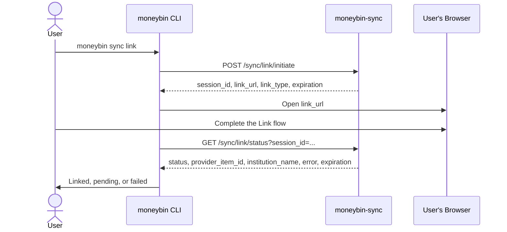

# Sync: Plaid Provider

## Status
<!-- draft | ready | in-progress | implemented -->
implemented

## Goal
Implement the first sync provider for MoneyBin: Plaid Transactions. Pull checking, savings, and credit card transactions from connected banks through moneybin-sync, load into provider-specific raw tables, and flow through the data warehouse into core alongside OFX, CSV, and tabular-imported data.

## Background
- [`sync-overview.md`](sync-overview.md) — umbrella spec defining the interaction model, client infrastructure, CLI/MCP surface, encryption design, and provider contract this spec implements.
- Server contract (the moneybin-sync HTTP API for `/sync/*` endpoints, data format, and error responses) is the authoritative integration surface; endpoint shapes are restated inline below where the client depends on them.
- [ADR-007: JSON over Parquet](../decisions/007-json-over-parquet-for-sync.md) — why sync uses JSON instead of Parquet.
- [`privacy-data-protection.md`](privacy-data-protection.md) — `Database` connection factory, encryption at rest. All writes go through `get_database()`.
- [`matching-overview.md`](matching-overview.md) — transaction matching consumes Plaid data alongside OFX/CSV. `source_type = 'plaid'` feeds the matching engine's blocking and scoring pipeline.
- Implementation: `src/moneybin/extractors/plaid/extractor.py`, `src/moneybin/connectors/sync_client.py`, `src/moneybin/services/sync_service.py`, `src/moneybin/cli/commands/sync.py`, `src/moneybin/mcp/tools/sync.py`.

## Requirements

1. Client can connect bank accounts through moneybin-sync's Plaid Link session API (Phase 2 of the interaction model).
2. Client can trigger a server-completed sync job. Incremental sync uses Plaid's cursor-based pagination (server-managed). `--force` resets the cursor for full history re-fetch.
3. Client downloads JSON payload and loads into `raw.plaid_*` DuckDB tables with no data loss and no duplicate rows on re-sync.
4. Sign convention is preserved faithfully in raw (Plaid: positive = expense). The flip to MoneyBin convention (negative = expense) happens exclusively in staging views.
5. Plaid's `removed_transactions` are deleted from `raw.plaid_transactions` on each sync.
6. SQLMesh staging views standardize Plaid data for core consumption. Core models include Plaid data via `UNION ALL` with `source_type = 'plaid'`.
7. Connection health is read from moneybin-sync's `GET /institutions` response, with per-institution status and error codes mapped to actionable guidance.
8. Plaid-specific error codes are mapped to actionable user guidance per `sync-overview.md` error handling patterns.
9. No PII or financial data in logs. Transaction counts, institution names, and masked account numbers only.
10. After a successful sync that changes raw state (loads new rows or processes removals), `SyncService.pull()` runs the post-load refresh pipeline (`moneybin.orchestration.refresh.refresh`) once before returning. Refresh is a top-level MoneyBin domain concept — "update everything based on the latest new data" — covering the canonical gsheet, matching, SQLMesh apply, categorization, and identity stages on the current database state. After refresh, derived `core.*` models (notably `core.dim_accounts`) reflect the new data; Plaid transactions cross-match against same-day OFX/CSV rows per [`matching-overview.md`](matching-overview.md); user-defined categorization rules fire immediately with source-precedence enforcement against Plaid hints. The MCP `sync_pull` contract always uses that default; the CLI offers `--no-refresh` for explicit operator batching. SQLMesh failures soft-fail: raw rows remain durable; the result envelope reports `transforms_applied=false` with a `transforms_error` string and the CLI exits non-zero so agents and scripts detect that core tables are stale. Matching, categorization, and identity are best-effort. No-op syncs (no loads, no removals) skip refresh entirely. **Performance:** refresh is dominated by SQLMesh apply (typically 5–30s; `sqlmesh.Context` init alone is 2–5s). Internal service callers that deliberately batch scheduled or webhook-driven pulls may pass `refresh=False` and run one refresh afterward.

---

## Plaid Link flow

The client communicates only with moneybin-sync. It starts a Link session,
surfaces the returned URL, and reads that session's state; how the server
integrates with Plaid remains behind the server API.

```mermaid
sequenceDiagram
    actor User
    participant CLI as moneybin CLI
    participant Server as moneybin-sync
    participant Browser as User's Browser

    User->>CLI: moneybin sync link
    CLI->>Server: POST /sync/link/initiate
    Server-->>CLI: session_id, link_url, link_type, expiration

    CLI->>Browser: Open link_url
    User->>Browser: Complete the Link flow
    CLI->>Server: GET /sync/link/status?session_id=...
    Server-->>CLI: status, provider_item_id, institution_name, error, expiration
    CLI->>User: Linked, pending, or failed
```

The initiate request sends `provider` (currently `"plaid"`) and may include
`provider_item_id` for re-authentication or `return_to` for a future web
surface. The response is a `LinkInitiateResponse` with `session_id`,
`link_url`, `link_type`, and `expiration`. This client supports
`link_type="widget_flow"`.

`LinkStatusResponse` is the session-status contract: `pending`, `linked`, or
`failed`; a linked response carries `provider_item_id` and may carry
`institution_name`, while a failed response carries `error`. Text-mode CLI may
wait through `SyncClient.poll_link_status()`. MCP and JSON CLI flows are
event-driven: they return the session immediately, then use a later single-shot
`sync_link_status(session_id=...)` / `moneybin sync link-status` call.

For headless environments, `--no-browser` prints `link_url` for the user to
open on another device. A re-authentication selects the affected connection and
passes its `provider_item_id` to the same initiate endpoint.

---

## Data model

### Raw tables

The shipped DDL is colocated with the extractor:

- [`raw_plaid_accounts.sql`](../../src/moneybin/extractors/plaid/schema/raw_plaid_accounts.sql)
- [`raw_plaid_transactions.sql`](../../src/moneybin/extractors/plaid/schema/raw_plaid_transactions.sql)
- [`raw_plaid_balances.sql`](../../src/moneybin/extractors/plaid/schema/raw_plaid_balances.sql)

The three tables preserve Plaid's native values and pair their source-native
key with required `source_origin` for connection-scoped deduplication. An
account's `account_id` is the source-native key and can change on relink;
`persistent_account_id`, when Plaid provides it, is the cross-relink identity
reference. Transaction rows retain source-provided conversion legs
(`to_amount`, `to_currency`) when present. Balance rows retain both the gross
current balance and `margin_loan_amount`, which the core balance model nets.

### Client-side metadata generation

The JSON response from the server does not include `source_file`, `source_type`, `source_origin`, `extracted_at`, or `loaded_at`. The `PlaidExtractor` generates these:

| Field | Generated from |
|---|---|
| `source_file` | `f"sync_{job_id}"` — logical identifier for this sync payload |
| `source_type` | `'plaid'` (hardcoded per provider) |
| `source_origin` | `item_id` from the sync metadata — identifies which institution connection produced this data |
| `extracted_at` | `metadata.synced_at` from the JSON response |
| `loaded_at` | `CURRENT_TIMESTAMP` at DuckDB insertion time |

---

## Staging views

SQLMesh views in the `prep` schema. Each normalizes Plaid's data shape for core consumption.

### `prep.stg_plaid__accounts`

The shipped view is
[`stg_plaid__accounts.sql`](../../src/moneybin/sqlmesh/models/prep/stg_plaid__accounts.sql).
It resolves an accepted source-native `app.account_links` reference with
`COALESCE(links.account_id, a.account_id)`, retains the original Plaid key as
`source_account_key`, maps `account_type` through `seeds.account_type_map`, and
projects the institution's `name` as `account_label`.

### `prep.stg_plaid__transactions`

The shipped view is
[`stg_plaid__transactions.sql`](../../src/moneybin/sqlmesh/models/prep/stg_plaid__transactions.sql).
It resolves the same accepted source-native account link, retains
`source_account_key`, and carries the transaction's source fields into the
warehouse projection.

The `-1 * amount` flip is the single most important transformation in the staging layer. Plaid: positive = expense, negative = income. MoneyBin: negative = expense, positive = income. Raw preserves Plaid's convention faithfully; the flip happens here and only here.

### `prep.stg_plaid__balances`

The shipped view is
[`stg_plaid__balances.sql`](../../src/moneybin/sqlmesh/models/prep/stg_plaid__balances.sql).
It resolves the same accepted source-native account link and retains the Plaid
account key as `source_account_key`.

Like every other source's balance/account staging view, this resolves the
canonical `account_id` from `app.account_links` so balances key on the same id
as `core.dim_accounts` (else Plaid balances orphan on the join).

### Core model integration

Add CTEs + `UNION ALL` to the relevant core models:

| Core model | Change |
|---|---|
| `core.dim_accounts` | Add `plaid_accounts` CTE selecting from `prep.stg_plaid__accounts` with `source_type = 'plaid'`, `UNION ALL` into `all_accounts`; carries Plaid `official_name`/`account_subtype` through the merge as the base layer under the `app.account_settings` override |
| `core.fct_transactions` | Add `plaid_transactions` CTE selecting from `prep.stg_plaid__transactions` with `source_type = 'plaid'`, `UNION ALL` into `all_transactions` |
| `core.fct_balances` | Add `plaid_balances` CTE selecting from `prep.stg_plaid__balances` with `current_balance - COALESCE(margin_loan_amount, 0)` → `balance`, `source_type = 'plaid'`, `source_origin` (Plaid item id) → `source_ref`, `loaded_at` → `updated_at`, `UNION ALL` into the balance union. The subtraction is the surprising one: Plaid reports an investment account's `current_balance` as the gross value of *assets* and the funds borrowed against them separately, so without it a margin account contributes the broker's money to net worth as if it were the holder's. The `COALESCE` is load-bearing — `margin_loan_amount` is NULL on every non-investment account, and a bare subtraction would null the whole balance and drop the account out of net worth. `available_balance` has no column in `fct_balances` (dropped for every source, as OFX's is) |

No changes to core's dedup logic — cross-source dedup between Plaid and OFX/CSV is handled by the transaction matching pipeline (`matching-overview.md`). For balances, same-date observations from different sources (e.g. OFX + Plaid, both institution snapshots at equal precedence) are reduced to one deterministic winner in `core.fct_balances_daily` — highest precedence, then freshest `updated_at`, then `source_type` ascending.

---

## Implementation plan

### Files to create

| File | Purpose |
|---|---|
| `src/moneybin/extractors/plaid/extractor.py` | `PlaidExtractor`: typed sync response → raw tables |
| `src/moneybin/extractors/plaid/schema/raw_plaid_accounts.sql` | DDL for `raw.plaid_accounts` |
| `src/moneybin/extractors/plaid/schema/raw_plaid_transactions.sql` | DDL for `raw.plaid_transactions` |
| `src/moneybin/extractors/plaid/schema/raw_plaid_balances.sql` | DDL for `raw.plaid_balances` |
| `src/moneybin/sqlmesh/models/prep/stg_plaid__accounts.sql` | Staging view |
| `src/moneybin/sqlmesh/models/prep/stg_plaid__transactions.sql` | Staging view |
| `src/moneybin/sqlmesh/models/prep/stg_plaid__balances.sql` | Staging view |
| `tests/moneybin/test_extractors/test_plaid_extractor.py` | Unit tests for PlaidExtractor |
| `tests/test_stg_plaid.py` | SQL tests for staging views |
| `tests/moneybin/test_extractors/fixtures/plaid_sync_response.yaml` | Golden-file test fixture |

### Files to modify

| File | Change |
|---|---|
| `src/moneybin/sqlmesh/models/core/dim_accounts.sql` | Add `plaid_accounts` CTE + `UNION ALL` |
| `src/moneybin/sqlmesh/models/core/fct_transactions.sql` | Add `plaid_transactions` CTE + `UNION ALL` |
| `src/moneybin/sql/schema/schema.py` | Register new raw table DDL files |

### Files created by the umbrella spec (shared infrastructure)

These are defined in `sync-overview.md` and shared across all providers:

| File | Purpose |
|---|---|
| `src/moneybin/connectors/sync_client.py` | `SyncClient` HTTP client |
| `src/moneybin/cli/commands/sync.py` | CLI commands (login, link, link-status, pull, status, etc.) |
| `src/moneybin/mcp/tools/sync.py` | MCP tools (`sync_pull`, `sync_status`, etc.) |
| `src/moneybin/services/sync_service.py` | `SyncService` — business logic for pull/link/status, called by both CLI and MCP |

### Key decisions

- **`INSERT OR REPLACE` for dedup.** Same pattern as OFXLoader. Primary keys on (`transaction_id`, `source_origin`) prevent duplicate records whether the same payload re-loads or a later sync job re-delivers the same transaction. The matcher handles cross-source dedup. *(Doc corrected 2026-07-10: earlier revisions of this spec showed `source_file` in the keys; the shipped DDL has always keyed by `source_origin` — see `src/moneybin/extractors/plaid/schema/`.)*
- **Amount sign flip in staging only.** Raw tables preserve Plaid's original convention. The `-1 * amount` flip happens in `stg_plaid__transactions` so raw data is always faithful to the source. This is a hard rule — no consumer should ever read raw and assume MoneyBin sign convention.
- **`source_file` as lineage metadata.** Without physical files, `source_file` is a logical identifier generated by the client: `sync_{job_id}`. It records which sync job last wrote each row (mirroring the file-based loaders' provenance column); it is not part of the dedup key.
- **JSON as transfer format.** moneybin-sync supplies JSON, which the client
  validates into Pydantic models before `PlaidExtractor` builds typed Polars
  DataFrames for `Database.ingest_dataframe()`. No intermediate Parquet or
  plaintext temporary file is created. See ADR-007.
- **Pending transactions.** Loaded with `pending = true`. Plaid may later confirm, modify, or remove them. Confirmed transactions arrive in subsequent syncs with `pending = false` and the same `transaction_id` — `INSERT OR REPLACE` handles the update. Removed transactions are handled via `removed_transactions`.

---

## PlaidExtractor

`src/moneybin/extractors/plaid/extractor.py` loads typed sync responses into
`raw.plaid_*` tables and returns per-table counts. `SyncService.pull()` calls
`handle_removed_transactions()` separately before it invokes `load()`.

### Loading pattern

`PlaidExtractor.load()` derives `source_file`, extraction time, and account-to-
institution lineage from the typed sync response before it writes raw tables.
Each table-specific extractor method builds a typed Polars DataFrame, adds its lineage
columns, and sends it through `Database.ingest_dataframe()` with that table's
conflict behavior. Sync payloads stay in memory; the implementation does not
write plaintext temporary files.

### Removed transactions handling

`PlaidExtractor.handle_removed_transactions()` returns zero for an empty list.
Otherwise, under the database write lock, it counts the matching transaction
rows and then deletes them with parameterized values. The pre-count reports
the rows actually removed because the database API does not expose a DELETE
affected-row count; already-absent ids therefore do not inflate the result.

---

## Plaid-specific error codes

The server surfaces Plaid error codes in `GET /sync/data` at
`metadata.institutions`. `moneybin sync pull` reports those raw per-institution
codes and does not retry them. `moneybin sync status` reads `GET /institutions`
and maps its known connection-health codes to actionable guidance:

| Plaid error code | Meaning | `sync status` guidance |
|---|---|---|
| `ITEM_LOGIN_REQUIRED` | Bank requires re-authentication (password changed, MFA expired) | "{institution} needs re-authentication — run `moneybin sync link` to update your credentials." |
| `ITEM_NOT_FOUND` | Access token revoked or item deleted | "{institution} connection was revoked. Run `moneybin sync link` to reconnect." |
| `INSTITUTION_NOT_RESPONDING` | Bank's systems are temporarily unavailable | "{institution} is temporarily unavailable. Try again later." |
| `INSTITUTION_DOWN` | Bank's systems are down for maintenance | "{institution} is down for maintenance. Try again later." |
| `TRANSACTIONS_SYNC_MUTATION_DURING_PAGINATION` | Data changed during cursor pagination | Pull reports the raw error code; no client retry is implemented. |
| `RATE_LIMIT_EXCEEDED` | Too many API calls | "Rate limit reached. Sync will resume on the next scheduled run." |
| `PRODUCTS_NOT_READY` | Plaid hasn't finished initial data pull | "{institution} is still processing initial data. Try again in a few minutes." |

Unknown codes remain raw in pull results. For an error-state connection with an
unknown code, `sync status` supplies generic re-authentication guidance.

---

## Amount sign convention

This is critical and worth restating. Plaid and MoneyBin use opposite sign conventions:

| System | Expense | Income |
|---|---|---|
| **Plaid** (server delivers this) | Positive (`42.50`) | Negative (`-1500.00`) |
| **MoneyBin core convention** | Negative (`-42.50`) | Positive (`1500.00`) |

The sign flip happens **exclusively** in `prep.stg_plaid__transactions` via `-1 * amount`. The rule:

- `raw.plaid_transactions.amount` = Plaid convention (positive = expense). Always.
- `prep.stg_plaid__transactions.amount` = MoneyBin convention (negative = expense). Always.
- `core.fct_transactions.amount` = MoneyBin convention. Always.

No other code path should ever flip the sign. If a test or query reads from raw, it must account for Plaid's convention.

---

## Plaid categories

Plaid provides a `personal_finance_category.primary` value (e.g., `FOOD_AND_DRINK`, `TRANSFER`, `INCOME`). These are preserved in `raw.plaid_transactions.category` and flow through staging as **`plaid_category`**, the column the categorizer reads. They do not reach `core` under any name — no `core` model projects `plaid_category`.

> **Corrected 2026-09-03 (PR #515).** This paragraph read "flow through staging to core" without naming the column, which was true of `raw` but had become false of the destination: the PFC code was also aliased into `category`, the column that carries a *MoneyBin* category. One rendered column then held two vocabularies, and `core.uncategorized_queue` — which selects `WHERE category IS NULL` — excluded every Plaid row from curation. The plaid branch of `prep.int_transactions__unioned` now contributes `NULL::TEXT AS category`; the code itself is unchanged and still flows `int_transactions__unioned` → `__matched` → `__merged`, which is as far as it ever went. `prep.int_transactions__merged.plaid_category` is where `apply_plaid_categories` reads it and where `moneybin sql query` can inspect it; a `core` consumer never could. See [`categorization-source-model.md`](categorization-source-model.md) § "Old primary-as-text passthrough" for the full decision.

In the categorization priority hierarchy (`categorization-overview.md`), Plaid categories sit at priority 5 — below user, rules, auto-rules, and ML, but above LLM batch categorization. They serve as a bootstrap signal: useful for new users before they've built up rules and ML training data, but overridable by every other categorization source.

The category mapping from Plaid's PFCv2 taxonomy to MoneyBin's category system uses the existing `app.categories.plaid_detailed` column. If a second provider is integrated in the future, this should be extracted to a generic `app.category_mappings` table (see `categorization-overview.md` future directions §3). This has since shipped as `core.bridge_category_source_map` / `app.category_source_map` (see `category-source-map.md`), superseding `plaid_detailed`.

---

## Testing strategy

### Unit tests (no server required)

| Test area | What's tested |
|---|---|
| `PlaidExtractor.load()` | Golden-file JSON → in-memory DuckDB. Verify row counts, column values, `source_file`/`source_type`/`source_origin` generation. |
| `PlaidExtractor.handle_removed_transactions()` | Delete by transaction_id list. Verify rows removed, other rows untouched. |
| Dedup on re-load | Load same JSON twice. Verify no duplicate rows (PK constraint via `INSERT OR REPLACE`). |
| Pending → confirmed | Load pending transaction, then load same `transaction_id` with `pending = false`. Verify update. |
| Empty arrays | Load JSON with empty `transactions[]`, `accounts[]`, `balances[]`. No errors, zero row counts. |

### SQL tests (no server required)

| Test area | What's tested |
|---|---|
| `stg_plaid__transactions` | Amount sign flip: raw `42.50` → staging `-42.50`. Raw `-1500.00` → staging `1500.00`. |
| `stg_plaid__accounts` | Column mapping: `account_type` preserved, NULL columns filled correctly. |
| `dim_accounts` | Plaid accounts appear with `source_type = 'plaid'` after `UNION ALL`. |
| `fct_transactions` | Plaid transactions appear with correct sign convention and `source_type = 'plaid'`. |

### Integration tests (server required)

See `sync-overview.md` testing strategy. These tests are marked `@pytest.mark.integration`, skipped by default, and gated by `MONEYBIN_SYNC__TEST_SERVER_URL`.

**Plaid Sandbox specifics:**

- Server configured with `PLAID_ENV=sandbox`, sandbox `client_id` and `secret` (free, separate from production).
- Sandbox test credentials: `user_good` / `pass_good` (Plaid-documented constants, not secrets).
- Golden-file payloads captured from sandbox responses and stored in `tests/fixtures/plaid_sync_response.json` for offline unit tests.
- Sandbox supports error simulation: `user_bad` triggers login failures, specific metadata forces `ITEM_LOGIN_REQUIRED`, etc.

---

## Synthetic data requirements

The synthetic data generator (`testing-synthetic-data.md`) should produce data that exercises the Plaid sync pipeline:

- **Golden-file sync responses.** Representative JSON payloads matching the [server API contract](../reference/server-api-contract.md) format, including accounts, transactions, balances, removed_transactions, and metadata. Used for offline PlaidExtractor unit tests.
- **Sign convention edge cases.** Transactions with zero amount, very large amounts, and negative amounts (income) in Plaid convention.
- **Pending → confirmed transitions.** Pairs of payloads where a transaction appears as `pending = true` in the first and `pending = false` in the second.
- **Removed transactions.** Payloads with non-empty `removed_transactions[]` arrays.
- **Multi-institution syncs.** Payloads whose `metadata.institutions` list
  includes partial failures.
- **Error simulation.** Payloads with `ITEM_LOGIN_REQUIRED` and other error codes in the metadata results.

These fixtures should be generated deterministically (seeded) and stored as golden files. They complement (not replace) live Plaid Sandbox testing.

---

## Dependencies

### Python packages (add via `uv add`)

| Package | Purpose |
|---|---|
| `httpx >= 0.27.0` | HTTP client for `SyncClient` (async-capable, modern API) |
| `keyring >= 25.0.0` | OS-native credential storage for JWT tokens |

### Existing packages (already in moneybin)

| Package | Used for |
|---|---|
| `duckdb` | Database engine and DataFrame ingestion target |
| `polars` | Typed DataFrame construction for `ingest_dataframe()` |
| `typer` | CLI framework |
| `pydantic` | Response models, config |
| `fastmcp` | MCP server |

### External requirements

| Requirement | Notes |
|---|---|
| Running moneybin-sync | Phases 1–2 complete (auth + sync endpoints) |
| Auth0 tenant | Configured with Device Authorization Flow enabled |
| Plaid Sandbox credentials | For testing (free, separate from production) |
| Plaid Production approval | For real bank data (requires security review by Plaid) |

---

## Out of scope

| Exclusion | Reason |
|---|---|
| Plaid Investments product | Implemented by the separate [`sync-plaid-investments.md`](sync-plaid-investments.md) child, which owns securities, holdings, and investment transactions. |
| Plaid Liabilities product | Future child spec. |
| E2E encryption of sync payloads | Designed in `sync-overview.md`. Implementation gated on moneybin-sync Phase 5. |
| Webhook-based real-time sync | Polling is sufficient for MVP. Server would need webhook receiver infrastructure. |
| Offline queue for sync commands | If server is unreachable, fail with clear error. No local queue. |
| MCP App UI for Plaid Link | Phase 2 MCP Apps initiative. Current flow uses browser. |
| Cross-currency transaction handling | Single-currency only in v1. Multi-currency transactions deferred to `multi-currency.md`. |
| Server-side Plaid behavior | Token encryption, cursor management, webhook handling — owned by the moneybin-sync project; client treats the server as opaque per `sync-overview.md` scope boundary. |
