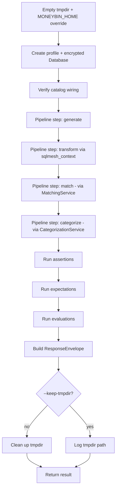

# Feature: Testing Scenario Runner

> Last updated: 2026-04-26
> Status: implemented
> Type: Feature
> Parent: [`testing-overview.md`](testing-overview.md)
> Companions: [`testing-synthetic-data.md`](testing-synthetic-data.md) (consumed for personas + ground truth), [`e2e-testing.md`](e2e-testing.md) (peer test layer), [`mcp-architecture.md`](mcp-architecture.md) §4 (`ResponseEnvelope` shape), [`database-migration.md`](database-migration.md), [`privacy-data-protection.md`](privacy-data-protection.md), `CLAUDE.md` "Architecture: Data Layers"

## Status

implemented (shipped 2026-04-26)

## Goal

Whole-pipeline correctness with real data assertions. The scenario runner goes from an empty encrypted DuckDB through `generate → transform → match → categorize` and asserts that the resulting rows in `core.fct_transactions` and downstream tables are what the caller expected — using ground-truth labels for AI/ML scoring and hand-labeled fixture expectations for matching and categorization correctness. Output is a structured pass/fail/score envelope suitable for both human review and autonomous agent verification.

### Non-goals

- **Not a replacement for unit tests.** Unit tests cover function-level logic. The runner runs over tens of seconds; unit tests must stay fast.
- **Not a replacement for E2E subprocess tests.** [`e2e-testing.md`](e2e-testing.md) verifies CLI boot, command registration, schema init, and subprocess wiring. Scenarios verify that the data the pipeline produces is correct, not that the CLI surface starts.
- **Not a load test or performance benchmark.** Scenario size is personal-finance scale (years of one persona's data). Performance assertions exist but are not the focus.
- **Not a Plaid Sandbox harness.** Live-provider testing is owned by [`sync-overview.md`](sync-overview.md).
- **No separate scenarios for CLI vs MCP.** Both surfaces are thin wrappers over the service layer; surface wiring is covered elsewhere. The runner tests the service layer behind both.

## Background

Today's three test layers each cover their slice in isolation:

| Layer | What it catches | What it misses |
|---|---|---|
| Unit (`tests/moneybin/`) | Logic bugs, edge cases | Cross-subsystem wiring |
| Integration (`tests/integration/`) | Cross-subsystem wiring with real DB, in-process | Subprocess and full-pipeline data correctness |
| E2E (`tests/e2e/`) | Boot, schema init, command registration, subprocess wiring | Whether pipeline output is correct |

A class of bugs slips through every layer: **pipeline runs end-to-end, every layer's tests pass, but the rows in `core.fct_transactions` are silently wrong**. The motivating incident: SQLMesh transformations ran against a different DuckDB catalog than the rest of MoneyBin. Every layer passed because each tested its slice; nothing verified "starting from an empty database, after the full pipeline against known inputs, do the resulting rows match?"

The runner is the missing layer. It complements existing tests rather than replacing them.

### Relevant prior art

- [`testing-overview.md`](testing-overview.md) — umbrella; sketched the scenario format inline. This spec extracts and extends.
- [`testing-synthetic-data.md`](testing-synthetic-data.md) — shipped generator. Personas, deterministic seeding, `synthetic.ground_truth`. The runner consumes this.
- [`e2e-testing.md`](e2e-testing.md) — shipped subprocess tests. Different concern (boot/wiring); peer layer.
- [`matching-same-record-dedup.md`](matching-same-record-dedup.md) §"Testing Strategy" — synthetic data contract for dedup correctness.
- [`matching-transfer-detection.md`](matching-transfer-detection.md) §"Synthetic Data Contract" — happy path, recurring, false-positive, and edge-case scenarios.

## Concrete failure modes the runner must catch

Six representative bug classes that have either occurred or are highly likely. Each maps to one or more v1 scenarios in §"Representative scenarios."

| # | Failure mode | Why existing layers miss it | Caught by |
|---|---|---|---|
| 1 | SQLMesh transformations target a different DuckDB catalog than the rest of MoneyBin (the original incident) | Each layer's tests use mocked/local connections; nothing asserts the catalog SQLMesh's adapter binds to matches `Database.path` | `assert_sqlmesh_catalog_matches` + any full-pipeline scenario fails when row counts collapse |
| 2 | Dedup silently drops rows from one source after a merge-rule edit | Unit tests check the rule; integration tests use small fixtures; row-count drops in real-shaped data are invisible | `dedup-cross-source` scenario asserts expected gold-record count from labeled overlap fixture |
| 3 | Transfer detection counts both legs as spending after a `bridge_transfers` regression | Unit tests verify the scoring function; integration tests verify a single pair; aggregate spending miscalculation needs whole-pipeline check | `transfer-detection-cross-account` evaluates F1 against `transfer_pair_id` ground truth + asserts spending totals exclude transfer legs |
| 4 | Migration applies DDL to the wrong schema (e.g., `app` vs `core`), leaving orphaned columns | Migration runner unit tests check version tracking; nothing verifies post-migration data integrity | `migration-roundtrip` scenario populates DB, runs migration, asserts no orphaned FKs and no NULL-ed previously-populated fields |
| 5 | Encryption key not propagated to subprocess transforms; subprocess opens unencrypted DB and writes nothing | Subprocess tests check exit codes; nothing checks that subprocess output actually materialized into the same database | `assert_encryption_key_propagated_to_subprocess` shells out to `uv run moneybin transform apply` then asserts row counts increased in the same encrypted file |
| 6 | Categorization auto-rule silently overwrites user-categorized rows after a priority-hierarchy bug | Unit tests check rule evaluation; integration tests check single-rule application; priority inversion needs a full pipeline pass with ground truth | `categorization-priority-hierarchy` scenario asserts no `categorized_by='user'` rows are downgraded after auto-rule promotion |

The SQLMesh-catalog bug is one symptom, not the thesis. The runner exists for the whole class of "every layer green, data wrong" failures.

## Requirements

### Scenario format

1. Scenarios are YAML files shipped with the package under `src/moneybin/testing/scenarios/data/`.
2. Each scenario declares: `setup` (persona + seed + years + optional fixture overlays), `pipeline` (ordered list of step names), `assertions` (list of named primitives with args), `evaluations` (list of named scorers with thresholds), and `gates` (which assertions and evaluations are required for pass).
3. Pydantic models in `src/moneybin/testing/scenarios/loader.py` validate every scenario at load time. Invalid YAML fails fast with field-level errors.
4. Fixture paths declared in `setup.fixtures[].path` must resolve under the repository's `tests/fixtures/` tree. Path traversal outside the tree is rejected per `.claude/rules/security.md`.

### Orchestration

5. Each scenario run uses a fresh encrypted DuckDB in a temp directory. The user's profiles are never touched.
6. Pipeline steps execute in declared order. Each step is responsible for leaving core in a consistent materialized state when it completes.
7. The default pipeline is `generate → transform → match → categorize`. Scenarios may override the sequence — e.g., `migration-roundtrip` inserts `migrate` between `transform` and `match`.
8. Steps execute in-process via the service layer (e.g., `CategorizationService.bulk_categorize()`, `MatchingService.run()`, `sqlmesh_context()`), not as subprocesses. The runner imports and calls service classes directly against the temp `Database` — the same entrypoints the CLI and MCP tools use.
9. Specific assertions may shell out to subprocesses when verifying cross-process invariants (e.g., encryption key propagation). This is per-assertion, not per-scenario.
10. Assertions run after the pipeline completes. Each assertion returns a structured `AssertionResult(name, passed, details)` — never a bare bool.
11. Evaluations run after assertions. Each evaluation returns an `EvaluationResult(name, metric, value, threshold, passed)`. Threshold gating is per-scenario.
12. The final result is a `ResponseEnvelope` (reusing the MCP envelope shape from `src/moneybin/mcp/envelope.py`) with `data` containing the per-assertion and per-evaluation breakdown.

### Database isolation

13. Each run creates a fresh `tempfile.mkdtemp()` directory, sets `MONEYBIN_HOME` to that path, creates a profile, and initializes an encrypted `Database` with a generated passphrase.
14. All pipeline steps go through `get_database()` and `sqlmesh_context()` — the same primitives the CLI and MCP use. The runner never calls `duckdb.connect()` directly and never instantiates raw `sqlmesh.Context()`.
15. The temp directory is cleaned up at run end unless `--keep-tmpdir` is set, in which case the path is logged for post-mortem.
16. Subprocess assertions inherit `MONEYBIN_HOME` and the secret-store env vars so the child process sees the same profile.

### Surfaces

17. CLI subcommands extend the existing `moneybin synthetic verify` command. JSON output via `--output=json` produces the envelope verbatim for agent consumption.
18. No MCP surface in v1. Rationale documented under §"MCP surface."

### Validation primitive scope

19. The assertion library (`src/moneybin/validation/assertions/`) operates on any DuckDB connection — applicable to synthetic test data and live user data. The same primitives back `moneybin data verify` against a real profile.
20. The evaluation library (`src/moneybin/validation/evaluations/`) requires `synthetic.ground_truth` to exist. Evaluations raise a typed exception when called without ground truth, which `moneybin data verify` translates into a "no ground truth available — skipping evaluations" line.

## Scenario file format

Three fully worked examples follow. Each lives in `src/moneybin/testing/scenarios/data/`.

### Example 1 — `family-full-pipeline.yaml`

End-to-end correctness against the family persona. Validates the whole pipeline produces internally consistent data with passing assertions and acceptable evaluation scores.

```yaml
scenario: family-full-pipeline
description: "End-to-end correctness for the family persona"

setup:
  persona: family
  seed: 42
  years: 3
  fixtures: []

pipeline:
  - generate
  - transform
  - match
  - categorize

assertions:
  - name: catalog_wired_correctly
    fn: assert_sqlmesh_catalog_matches
  - name: fk_account_id
    fn: assert_valid_foreign_keys
    args:
      child: core.fct_transactions
      column: account_id
      parent: core.dim_accounts
      parent_column: account_id
  - name: sign_convention
    fn: assert_sign_convention
  - name: no_duplicate_gold_records
    fn: assert_no_duplicates
    args:
      table: core.fct_transactions
      columns: [transaction_id]
  - name: row_count_within_tolerance
    fn: assert_row_count_delta
    args:
      table: core.fct_transactions
      expected: 4500
      tolerance_pct: 10
  - name: transfers_balance_to_zero
    fn: assert_balanced_transfers

evaluations:
  - name: categorization_accuracy
    fn: score_categorization
    threshold:
      metric: accuracy
      min: 0.80
  - name: transfer_f1
    fn: score_transfer_detection
    threshold:
      metric: f1
      min: 0.85

gates:
  required_assertions: all
  required_evaluations: all
```

### Example 2 — `dedup-cross-source.yaml`

Loads the synthetic family persona (OFX checking + tabular credit card) plus a hand-labeled fixture that deliberately overlaps three transactions across the two sources. Asserts the deduper collapses them into single gold records with the expected source priority.

```yaml
scenario: dedup-cross-source
description: "Cross-source dedup: 3 known overlaps must collapse to 3 gold records"

setup:
  persona: family
  seed: 42
  years: 1
  fixtures:
    - path: tests/fixtures/dedup/chase_amazon_overlap.csv
      account: amazon-card
      source_type: csv

pipeline:
  - generate
  - load_fixtures
  - transform
  - match

assertions:
  - name: catalog_wired_correctly
    fn: assert_sqlmesh_catalog_matches
  - name: no_duplicate_gold_records
    fn: assert_no_duplicates
    args:
      table: core.fct_transactions
      columns: [transaction_id]
  - name: provenance_complete
    fn: assert_no_orphans
    args:
      parent: core.fct_transactions
      parent_column: transaction_id
      child: meta.fct_transaction_provenance
      child_column: transaction_id

expectations:
  - kind: match_decision
    description: "Chase OFX 2024-03-15 $47.99 == Amazon CSV 2024-03-15 $47.99"
    transactions:
      - source_transaction_id: SYN20240315001
        source_type: ofx
      - source_transaction_id: TBL_2024-03-15_AMZN_47.99
        source_type: csv
    expected: matched
    expected_match_type: same_record
    expected_confidence_min: 0.9
  - kind: gold_record_count
    description: "Three labeled overlaps should produce three gold records, not six"
    base_count: from_fixture_metadata
    expected_collapsed_count: 3

gates:
  required_assertions: all
  required_expectations: all
```

`expectations:` is a sibling of `assertions:` and `evaluations:`. Expectations check specific facts about specific transactions, drawing from hand-labeled fixture metadata. They give the strongest signal that matching/categorization actually does what we expect — assertions catch invariants, evaluations score aggregate quality, expectations pin down exact behavior on known inputs.

### Example 3 — `encryption-key-propagation.yaml`

Spins up an encrypted profile, runs `moneybin transform apply` as a subprocess, and asserts that core tables materialized in the same encrypted file. Catches subprocess key propagation regressions.

```yaml
scenario: encryption-key-propagation
description: "Subprocess transforms must propagate encryption key and write to the same DB"

setup:
  persona: basic
  seed: 42
  years: 1
  fixtures: []

pipeline:
  - generate
  - transform_via_subprocess

assertions:
  - name: catalog_wired_correctly
    fn: assert_sqlmesh_catalog_matches
  - name: subprocess_wrote_to_encrypted_db
    fn: assert_encryption_key_propagated_to_subprocess
    args:
      command: ["uv", "run", "moneybin", "transform", "apply"]
      expected_min_rows:
        core.fct_transactions: 100
        core.dim_accounts: 2
  - name: no_unencrypted_artifacts
    fn: assert_no_unencrypted_db_files
    args:
      tmpdir: from_runtime

gates:
  required_assertions: all
```

## Orchestration model



### Pipeline step registry

Step names map to in-process callables registered in `src/moneybin/testing/scenarios/steps.py`:

| Step | Implementation |
|---|---|
| `generate` | `GeneratorEngine(persona, seed, years).run()` writing into the temp `Database` |
| `load_fixtures` | Reads each `setup.fixtures[]` entry; calls the appropriate extractor; writes via `Database.ingest_dataframe()` |
| `transform` | `with sqlmesh_context() as ctx: ctx.run()` against the temp DB |
| `match` | `MatchingService(db, settings).run()` — runs same-record dedup (Tier 2b/3) and transfer detection (Tier 4) in one pass; thin wrapper around the existing `TransactionMatcher` primitive in `src/moneybin/matching/`. See §"Service-layer prerequisites." |
| `categorize` | `CategorizationService(db).bulk_categorize_uncategorized()`; followed by `apply_pending_auto_rules()` once `categorization-auto-rules.md` ships. The categorization service class is introduced as part of `categorization-auto-rules.md` implementation. |
| `migrate` | `MigrationRunner(db).run()` against an explicitly-set target version |
| `transform_via_subprocess` | Shells out to `uv run moneybin transform apply` with the temp profile env |

Adding a new step means registering a callable in `steps.py`. The Pydantic model rejects unknown step names at scenario load time.

### Result envelope

The runner returns a `ResponseEnvelope` (reused from `src/moneybin/mcp/envelope.py`):

```json
{
  "summary": {
    "total_count": 12,
    "returned_count": 12,
    "has_more": false,
    "sensitivity": "low",
    "display_currency": "USD"
  },
  "data": {
    "scenario": "family-full-pipeline",
    "passed": false,
    "duration_seconds": 41.2,
    "tmpdir": "/var/folders/.../scenario-family-full-pipeline-abc123",
    "assertions": [
      {"name": "catalog_wired_correctly", "passed": true, "details": {}},
      {"name": "fk_account_id", "passed": true, "details": {"checked_rows": 4520}},
      {"name": "row_count_within_tolerance", "passed": false,
       "details": {"expected": 4500, "actual": 3210, "delta_pct": -28.7, "tolerance_pct": 10}}
    ],
    "expectations": [],
    "evaluations": [
      {"name": "categorization_accuracy", "metric": "accuracy",
       "value": 0.82, "threshold": 0.80, "passed": true,
       "breakdown": {"per_category": {"Groceries": {"precision": 0.95, "recall": 0.88, "support": 142}}}}
    ],
    "gates": {
      "all_assertions_passed": false,
      "all_expectations_passed": true,
      "all_evaluations_passed": true
    }
  },
  "actions": [
    "Inspect failing assertion: row_count_within_tolerance (actual=3210, expected=4500±10%)",
    "Tmpdir preserved at /var/folders/.../scenario-family-full-pipeline-abc123 — inspect with `duckdb` after unlocking"
  ]
}
```

The envelope is closed for new top-level fields, but the `data` payload is free-form per the MCP architecture spec. Sensitivity is always `low` because scenarios run on synthetic data (no real PII).

## Assertion library API

Location: `src/moneybin/validation/assertions/`. Why `validation` and not `testing`: assertions apply to real data via `moneybin data verify` against a live profile, not just synthetic test runs. The package name should reflect the broader applicability.

```python
from dataclasses import dataclass
from typing import Any
from duckdb import DuckDBPyConnection


@dataclass(frozen=True, slots=True)
class AssertionResult:
    name: str
    passed: bool
    details: dict[str, Any]
    error: str | None = (
        None  # populated when the assertion couldn't run, distinct from passed=False
    )


def assert_valid_foreign_keys(
    conn: DuckDBPyConnection,
    *,
    child: str,
    column: str,
    parent: str,
    parent_column: str,
) -> AssertionResult: ...
```

Every primitive returns `AssertionResult` — no bare bools, no exceptions on assertion failure (only on infrastructure errors like missing tables, which set `error`).

### v1 catalog

| Category | Function | Notes |
|---|---|---|
| Row counts | `assert_row_count_exact(conn, table, expected)` | Strict equality |
| Row counts | `assert_row_count_delta(conn, table, expected, tolerance_pct)` | Within ±N% |
| Schema | `assert_columns_exist(conn, table, columns)` | DDL drift detector |
| Schema | `assert_column_types(conn, table, types)` | Type drift detector |
| Schema | `assert_no_nulls(conn, table, columns)` | Required columns populated |
| Referential | `assert_valid_foreign_keys(conn, child, column, parent, parent_column)` | Every child value exists in parent |
| Referential | `assert_no_orphans(conn, parent, parent_column, child, child_column)` | Every parent has a child |
| Referential | `assert_no_duplicates(conn, table, columns)` | No duplicate rows for column set |
| Business rules | `assert_sign_convention(conn)` | Expenses negative, income positive |
| Business rules | `assert_balanced_transfers(conn)` | Confirmed transfer pairs net to zero |
| Business rules | `assert_date_continuity(conn, table, date_col, account_col)` | No month-gaps per account |
| Distributional | `assert_distribution_within_bounds(conn, table, col, min, max, mean_range)` | Column statistics within ranges |
| Distributional | `assert_unique_value_count(conn, table, col, expected, tolerance_pct)` | Cardinality check |
| Infrastructure | `assert_sqlmesh_catalog_matches(db)` | SQLMesh's adapter is bound to `db.path` |
| Infrastructure | `assert_encryption_key_propagated_to_subprocess(db, command, expected_min_rows)` | Subprocess writes land in the same encrypted DB |
| Infrastructure | `assert_no_unencrypted_db_files(tmpdir)` | No bare `.duckdb` files in tmpdir other than the encrypted one |
| Infrastructure | `assert_migrations_at_head(db)` | `app.versions` head matches the latest migration on disk |

The catalog grows organically per the umbrella spec — new specs that need a check that doesn't exist add an assertion.

### Coverage honesty

- **Assertions are not contrived.** FK integrity, sign convention, no-orphans, no-duplicates — these hold for any data, real or synthetic. They catch structural correctness regressions.
- **Distributional assertions are weakly contrived.** Bounds chosen by the scenario author. Useful as smoke checks; not the primary signal.
- **Infrastructure assertions are not contrived.** They verify wiring invariants that have nothing to do with data shape.

## Evaluation library

Location: `src/moneybin/validation/evaluations/`. Each evaluation returns an `EvaluationResult`.

```python
@dataclass(frozen=True, slots=True)
class EvaluationResult:
    name: str
    metric: str
    value: float
    threshold: float
    passed: bool
    breakdown: dict[str, Any]  # per-category, per-pair, etc.
```

### v1 evaluators

| Function | Compares | Returns |
|---|---|---|
| `score_categorization(db, threshold)` | `core.fct_transactions.category` vs `synthetic.ground_truth.expected_category` | `accuracy`, per-category `precision`/`recall`/`support` |
| `score_transfer_detection(db, threshold)` | `core.bridge_transfers` pairs vs `synthetic.ground_truth.transfer_pair_id` groupings | `precision`, `recall`, `f1`, `true_pairs`, `predicted_pairs` |
| `score_dedup(db, threshold)` | Gold record count vs expected collapsed count from labeled overlap fixtures | `precision`, `recall`, `f1` (only meaningful when fixtures provide expected gold records) |

### Threshold gating

Thresholds are per-scenario, not global. Rationale: a categorization threshold appropriate for `family-full-pipeline` (with 3 years of training data) differs from one for `categorization-cold-start` (zero training data). Per-scenario thresholds preserve the local meaning of "passed."

### Coverage honesty

Evaluations against synthetic ground truth are **bounded in value**: the generator emits `transfer_pair_id`; the detector finds pairs. There is some circularity — both use heuristics about timing and amounts. Evaluations are still useful as regression detection (a refactor that drops F1 from 0.95 to 0.60 is real signal) but should not be the only check on matching/categorization quality. **Hand-labeled fixture expectations** (next section) provide the strongest signal.

## Fixture expectations

Scenarios may declare `expectations:` — a list of facts about specific transactions that should hold after the pipeline runs. Expectations differ from assertions and evaluations:

| Surface | Granularity | Source of truth |
|---|---|---|
| Assertions | Aggregate (table-level invariants) | The data must be self-consistent |
| Evaluations | Aggregate (precision/recall/F1) | Compared to `synthetic.ground_truth` (generator-emitted) |
| Expectations | Specific (per-transaction or per-pair) | Hand-labeled in fixture files |

### Expectation kinds (v1)

| Kind | Asserts | Used by |
|---|---|---|
| `match_decision` | A specific pair of transactions is matched (or not), with confidence ≥ a floor | `dedup-cross-source`, `transfer-detection-cross-account` |
| `gold_record_count` | After dedup, the total gold record count matches an expected collapsed count derived from fixture metadata | `dedup-cross-source` |
| `category_for_transaction` | A specific transaction was categorized to a specific category by a specific source (rule, auto_rule, ml) | `categorization-priority-hierarchy` |
| `provenance_for_transaction` | A specific gold record's provenance lists exactly the expected source rows | `dedup-cross-source`, `migration-roundtrip` |

### Fixture file format

Fixture files live under `tests/fixtures/` per `testing-csv-fixtures.md` (planned). Each fixture row that participates in an expectation has a stable `source_transaction_id` so the scenario YAML can reference it.

Fixture-side metadata (e.g., "this CSV contains 3 rows that overlap 3 OFX rows") lives in a sibling **`<fixture>.expectations.yaml`** file. This spec owns the schema; `testing-csv-fixtures.md` owns fixture content and curation. YAML over JSON because these files are hand-authored, support inline comments, match the existing `testing/synthetic/personas/*.yaml` convention, and are the planned contribution unit for community-submitted bug-report fixtures (anonymized export + expected behavior in a reviewable format).

#### Minimum viable `.expectations.yaml` schema (v1)

```yaml
# Fixture-level metadata. The scenario YAML pulls from this file when an
# expectation references a value derived from the fixture rather than declared
# inline (e.g., `base_count: from_fixture_metadata`).
fixture: chase_amazon_overlap.csv
description: "Three Amazon-card rows that intentionally duplicate Chase OFX entries"

# Total row count in the fixture file. Used by gold_record_count expectations
# to compute expected post-dedup counts.
row_count: 47

# Rows in this fixture that are deliberate overlaps with synthetic-generated
# data. Each entry pins down the expected matching behavior.
labeled_overlaps:
  - source_transaction_id: TBL_2024-03-15_AMZN_47.99
    overlaps_with:
      - source_transaction_id: SYN20240315001
        source_type: ofx
    expected_match_type: same_record
    expected_confidence_min: 0.9
```

The Pydantic model lives in `src/moneybin/testing/scenarios/loader.py` alongside the scenario models. Loader rejects unknown top-level keys so future fields fail loudly rather than silently being ignored.

## Database isolation

Each scenario run is fully isolated:

```python
def run_scenario(scenario: Scenario) -> ScenarioResult:
    with tempfile.TemporaryDirectory(prefix=f"scenario-{scenario.name}-") as tmpdir:
        env = {**os.environ, "MONEYBIN_HOME": tmpdir, "MONEYBIN_PROFILE": "scenario"}
        with monkey_patch_env(env):
            create_profile("scenario")
            db = Database(
                path=Path(tmpdir) / "profiles/scenario/data/moneybin.duckdb",
                secret_store=GeneratedPassphraseSecretStore(),
            )
            assert_sqlmesh_catalog_matches(db).raise_if_failed()
            for step in scenario.pipeline:
                run_step(step, scenario.setup, db, env)
            return collect_results(db, scenario)
```

Key properties:

- `MONEYBIN_HOME` is overridden to the tempdir so any code path reading `~/.moneybin/` lands in the isolated location.
- The `Database` class is the same one the CLI uses — encryption, secret store, schema init, migrations all run as in production.
- `sqlmesh_context()` is the only path to SQLMesh, ensuring the encrypted adapter injection happens.
- A pre-flight `assert_sqlmesh_catalog_matches` runs before any pipeline step. If catalog wiring is broken (the original incident), the scenario halts before generating data — failure is loud and immediate.
- `--keep-tmpdir` preserves the directory and logs the path so the user can attach the encrypted DB and inspect post-mortem.
- Subprocess steps and assertions inherit the env, so child processes see the same profile and key.

This isolation composes with `Database`/`get_database()` cleanly: no special test mode, no mocking, no parallel code path.

## CLI Interface

The runner extends the existing `moneybin synthetic verify` command (already named in `testing-overview.md`).

```
moneybin synthetic verify --list [--output=json]
moneybin synthetic verify --scenario=NAME [--output=json] [--keep-tmpdir]
moneybin synthetic verify --all [--output=json] [--keep-tmpdir] [--fail-fast]
```

| Flag | Purpose |
|---|---|
| `--list` | Print shipped scenarios with descriptions; no execution |
| `--scenario=NAME` | Run one scenario; exit non-zero on failure |
| `--all` | Run every shipped scenario sequentially; exit non-zero if any fail |
| `--fail-fast` | Stop at the first failing scenario when used with `--all` |
| `--keep-tmpdir` | Preserve the temp DB on completion for post-mortem |
| `--output=json` | Emit the `ResponseEnvelope` as JSON instead of human-formatted text |

### Examples

```bash
$ moneybin synthetic verify --list
family-full-pipeline    End-to-end correctness for family persona
basic-full-pipeline     Core pipeline correctness for basic persona
dedup-cross-source      Cross-source dedup with labeled overlap fixture
...

$ moneybin synthetic verify --scenario=family-full-pipeline
⚙️  Running scenario: family-full-pipeline
   Persona: family, seed: 42, years: 3
   ...
✅ family-full-pipeline passed (41.2s)
   12/12 assertions, 2/2 evaluations
   categorization_accuracy: 0.82 (>= 0.80)
   transfer_f1: 0.91 (>= 0.85)

$ moneybin synthetic verify --all --output=json | jq '.data | {scenario, passed}'
{"scenario": "basic-full-pipeline", "passed": true}
{"scenario": "family-full-pipeline", "passed": true}
{"scenario": "dedup-cross-source", "passed": true}
{"scenario": "transfer-detection-cross-account", "passed": false}
...
```

### Non-interactive parity

Per `.claude/rules/cli.md`, every flag is sufficient on its own. No interactive prompts. JSON output mode produces the envelope verbatim for agent and CI consumption.

## MCP Interface

**Deferred for v1.** Rationale:

- Scenarios run for tens of seconds and write to a tempdir outside the user's profile. They are an agent-development tool, not an end-user feature.
- Wrapping in MCP would require path-validation policy (which fixture trees may an MCP client reference?), execution sandboxing (a malicious scenario could run arbitrary subprocess steps), and authorization design — significant attack surface for no end-user benefit.
- CLI with `--output=json` already serves agent consumption. An agent that needs to verify its work can shell out to `moneybin synthetic verify` like a human would.
- If demand emerges later, the MCP tool wraps the same orchestrator with a constrained scenario allowlist; the design is forward-compatible.

## Representative scenarios for v1

Six scenarios ship with the runner. Each maps to one or more failure modes from §"Concrete failure modes." (`categorization-priority-hierarchy` is deferred — see `docs/followups.md`.)

| # | Scenario | Persona | Seed | Catches | Mode |
|---|---|---|---|---|---|
| 1 | `basic-full-pipeline` | basic | 42 | Core pipeline correctness, smoke test | assertions + evaluations |
| 2 | `family-full-pipeline` | family | 42 | Multi-account, transfers, categorization end-to-end | assertions + evaluations |
| 3 | `dedup-cross-source` | family | 42 + overlap fixture | Dedup silently dropping or duplicating rows (failure mode #2) | assertions + expectations |
| 4 | `transfer-detection-cross-account` | family | 42 | Both legs counted, missed pairs (failure mode #3) | assertions + expectations + evaluations |
| 5 | `migration-roundtrip` | basic | 42 | Migration applies to wrong schema, data loss (failure mode #4) | assertions |
| 6 | `encryption-key-propagation` | basic | 42 | Subprocess transforms hit unencrypted DB (failure mode #5) | infrastructure assertions |
| 7 | `categorization-priority-hierarchy` | family | 42 + override fixture | Auto-rule overwrites user-categorized rows (failure mode #6) | assertions + expectations |

Scenarios for `sqlmesh-catalog-wiring` are unnecessary as a standalone — the `assert_sqlmesh_catalog_matches` pre-flight runs in every scenario, so the original incident is caught the first time anyone runs `--all`.

### Scenario coverage audit (already-implemented specs)

The runner is being designed after several features have already shipped. Rather than retroactively editing each implemented spec, this table tracks scenario debt against the existing surface. As v1 scenarios land, columns flip from "gap" to the scenario name. New gaps surfaced during implementation are appended here.

| Implemented spec | Coverage in v1 | Gap |
|---|---|---|
| [`smart-import-tabular.md`](smart-import-tabular.md) | `basic-full-pipeline`, `family-full-pipeline` exercise tabular ingest | Format-specific scenarios (Tiller, Mint, YNAB, Maybe migration formats) deferred — likely owned by `testing-csv-fixtures.md` |
| [`privacy-data-protection.md`](privacy-data-protection.md) | `encryption-key-propagation` covers subprocess key propagation; every scenario boots an encrypted `Database` | No scenario asserts secret-store rotation; gap tracked, not blocking |
| [`database-migration.md`](database-migration.md) | `migration-roundtrip` | Down-migration / rollback scenarios deferred until rollback is itself a feature |
| [`observability.md`](observability.md) | None in v1 | Future: `assert_metrics_emitted(metric_name, min_count)` primitive once metric assertions are needed; defer until first observability regression |
| [`testing-synthetic-data.md`](testing-synthetic-data.md) | Every scenario consumes the generator; `*-full-pipeline` doubles as the generator's regression test | None — generator is the runner's input, not its target |
| [`e2e-testing.md`](e2e-testing.md) | Peer layer, not a target | None — the runner complements E2E rather than covering it |
| [`cli-restructure.md`](cli-restructure.md) | E2E layer covers command tree | None — CLI surface wiring stays in E2E |
| [`matching-same-record-dedup.md`](matching-same-record-dedup.md) (in-progress) | `dedup-cross-source` | Pillar A+C scenarios complete on landing |
| [`matching-transfer-detection.md`](matching-transfer-detection.md) (in-progress) | `transfer-detection-cross-account` | Edge cases (FX legs, three-leg sweeps) deferred |

Specs in `draft` or `ready` (categorization-auto-rules, net-worth, asset-tracking, budget-tracking, sync-overview, data-reconciliation) author their own scenarios as part of implementation — those don't carry retrofit debt.

### Scenario-to-spec coverage

| Spec | Scenarios that exercise it |
|---|---|
| `matching-same-record-dedup.md` | 3 (`dedup-cross-source`), 2 (`family-full-pipeline` aggregate) |
| `matching-transfer-detection.md` | 4 (`transfer-detection-cross-account`), 2 (`family-full-pipeline` aggregate) |
| `categorization-overview.md` + `categorization-auto-rules.md` | 7 (`categorization-priority-hierarchy`), 2 (`family-full-pipeline`) |
| `database-migration.md` | 5 (`migration-roundtrip`) |
| `privacy-data-protection.md` | 6 (`encryption-key-propagation`) |
| `testing-synthetic-data.md` | 1, 2 (consumer of generator output) |

## Testing the runner itself

Meta-testing — what's the test plan for the test runner.

### Unit tests (`tests/moneybin/test_validation/`)

- **YAML loader:** malformed scenarios fail at load with field-level errors. Unknown step names rejected. Threshold types validated.
- **Each assertion primitive:** known-good and known-bad input data, structured `AssertionResult` shape, `error` set on infrastructure failure (e.g., missing table).
- **Each evaluation primitive:** known-good ground truth, known-bad ground truth, missing-ground-truth raises typed exception.
- **Step registry:** every step name in shipped scenarios resolves to a callable.
- **Path validation:** fixture paths outside `tests/fixtures/` are rejected.

### Integration tests (`tests/integration/test_scenario_runner.py`)

- **Tiny in-memory scenario:** scenario YAML with one assertion against an in-process `Database` populated with 3 rows. Asserts the runner returns the expected envelope shape.
- **Negative test scenario:** a scenario that deliberately fails one assertion and one evaluation; runner correctly reports failure and does not crash.
- **Tmpdir cleanup:** without `--keep-tmpdir`, the directory is removed; with the flag, it persists.
- **Subprocess assertion:** `assert_encryption_key_propagated_to_subprocess` against a known-good and known-bad subprocess.
- **Catalog assertion:** `assert_sqlmesh_catalog_matches` against a deliberately misconfigured `Database` returns `passed=false` with details.

### E2E tests (`tests/e2e/test_e2e_synthetic_verify.py`)

Per `e2e-testing.md`, every CLI command needs an E2E test. The new `--list`, `--scenario`, and `--all` flags get parametrized E2E entries. `--scenario=basic-full-pipeline` is included in the E2E suite because it doubles as a smoke test for the entire pipeline.

### CI gating

The full scenario suite (`moneybin synthetic verify --all`) runs on PRs and main as a **separate GitHub Actions workflow** (`.github/workflows/scenarios.yml`), distinct from `ci.yml` (lint/type-check/unit/integration/E2E). The two workflows run in parallel: total PR feedback time is `max(ci, scenarios)`, not `ci + scenarios`.

- Branch protection requires both `ci` and `scenarios` checks to pass before merge.
- A failing scenario is a blocking signal — the diff broke whole-pipeline correctness in a way that other layers missed.
- `scenarios.yml` uses `concurrency` with `cancel-in-progress: true` so superseded runs on the same branch don't pile up.
- Skip conditions: a `paths-ignore` filter for docs-only changes (`docs/**`, `*.md`) keeps the scenario suite from running on doc PRs. Spec changes still trigger a run because spec files inform scenario authoring.

#### Runtime budget

`--all` against seven scenarios on the family persona at 3 years is estimated at 2–5 min wall-clock. This is acceptable for v1 PR gating because it overlaps with `ci.yml`. The runner does not enforce a hard timeout in v1; instead, `--all` prints a per-scenario duration summary at the end of the run so drift is visible. The summary uses `data.duration_seconds` from each scenario's `ResponseEnvelope`. Promote to a hard gate (`assert_completes_within` on `--all`) when the suite grows past the budget.

## Data Model

No new schemas. The runner reads from existing tables:

- `synthetic.ground_truth` — ground-truth labels for evaluations
- `core.fct_transactions`, `core.dim_accounts`, `core.bridge_transfers` — pipeline output for assertions
- `meta.fct_transaction_provenance` — provenance assertions
- `app.match_decisions`, `app.transaction_categories` — match and categorization state
- `app.versions` — migration head check

## Service-layer prerequisites

The runner orchestrates scenarios through the service layer at `src/moneybin/services/`. Two service classes need to exist for the pipeline step registry to be uniform:

### `MatchingService` (introduced by this spec)

A thin wrapper at `src/moneybin/services/matching_service.py`:

```python
class MatchingService:
    def __init__(self, db: Database, settings: MatchingSettings | None = None) -> None:
        self._db = db
        self._settings = settings or get_settings().matching

    def run(self) -> MatchResult:
        """Run same-record dedup (Tier 2b/3) and transfer detection (Tier 4)."""
        return TransactionMatcher(self._db, self._settings).run()
```

The wrapper exists so:
- The scenario runner step registry references service classes uniformly with `CategorizationService`, `TransactionService`, etc.
- Future MCP matching tools (when `mcp-tool-surface.md` adds them) call the service rather than the raw primitive.
- The CLI (`cli/commands/matches.py`) migrates to `MatchingService(db).run()` at the same time, eliminating direct `TransactionMatcher` imports outside the service layer.

This is in scope for the scenario-runner implementation plan.

### `CategorizationService` (introduced by `categorization-auto-rules.md`)

The categorization auto-rules implementation plan promotes the existing module-level functions in `src/moneybin/services/categorization_service.py` to a `CategorizationService` class with at minimum `bulk_categorize_uncategorized()` and `apply_pending_auto_rules()` methods. The scenario runner consumes the resulting class; this spec does not own its design.

If the categorization plan ships first, the runner uses the class from day one. If the runner ships first, the `categorize` step temporarily calls `bulk_categorize(db, ...)` directly and migrates to the class when it lands. Either ordering works; the scenario YAML format does not change.

## Implementation Plan

### Files to Create

| File | Purpose |
|---|---|
| `src/moneybin/validation/__init__.py` | Package init |
| `src/moneybin/validation/result.py` | `AssertionResult`, `EvaluationResult` dataclasses |
| `src/moneybin/validation/assertions/__init__.py` | Re-exports |
| `src/moneybin/validation/assertions/relational.py` | FK, orphan, duplicate primitives |
| `src/moneybin/validation/assertions/business.py` | Sign convention, balanced transfers, date continuity |
| `src/moneybin/validation/assertions/distributional.py` | Distribution and cardinality checks |
| `src/moneybin/validation/assertions/infrastructure.py` | Catalog, subprocess, migrations primitives |
| `src/moneybin/validation/evaluations/__init__.py` | Re-exports |
| `src/moneybin/validation/evaluations/categorization.py` | `score_categorization` |
| `src/moneybin/validation/evaluations/matching.py` | `score_transfer_detection`, `score_dedup` |
| `src/moneybin/services/matching_service.py` | `MatchingService` thin wrapper class — see §"Service-layer prerequisites" |
| `tests/moneybin/test_services/test_matching_service.py` | Unit tests for the new service wrapper |
| `src/moneybin/testing/scenarios/__init__.py` | Package init |
| `src/moneybin/testing/scenarios/loader.py` | Pydantic models, YAML loader |
| `src/moneybin/testing/scenarios/runner.py` | Orchestrator |
| `src/moneybin/testing/scenarios/steps.py` | Pipeline step registry |
| `src/moneybin/testing/scenarios/expectations.py` | Expectation kinds and verifiers |
| `src/moneybin/testing/scenarios/data/*.yaml` | Six shipped scenarios |
| `tests/fixtures/dedup/chase_amazon_overlap.csv` | Hand-labeled overlap fixture |
| `tests/fixtures/dedup/chase_amazon_overlap.expectations.yaml` | Fixture metadata (schema defined in this spec; see §"Fixture file format") |
| `.github/workflows/scenarios.yml` | Parallel CI workflow running `moneybin synthetic verify --all` |
| `tests/moneybin/test_validation/test_assertions_*.py` | Unit tests per assertion category |
| `tests/moneybin/test_validation/test_evaluations.py` | Unit tests for evaluations |
| `tests/integration/test_scenario_runner.py` | Integration tests for the runner |
| `tests/e2e/test_e2e_synthetic_verify.py` | E2E tests for CLI extensions |

### Files to Modify

| File | Change |
|---|---|
| `src/moneybin/cli/synthetic.py` | Extend `verify` with `--list`, `--scenario`, `--all`, `--keep-tmpdir`, `--fail-fast`, `--output=json` |
| `docs/specs/testing-overview.md` | Trim §"Scenario Format" + §"Representative Scenarios" to a summary referencing this spec |
| `.claude/rules/testing.md` | Add scenario layer to "Test Coverage by Layer" table |

### Key Decisions

| Decision | Choice | Rationale |
|---|---|---|
| Assertion package name | `validation`, not `testing` | Assertions apply to live data via `moneybin data verify`, not just tests |
| Pipeline default order | `generate → transform → match → categorize` | Match and categorize need core materialized first; both refresh dependent models on completion |
| Step execution model | In-process via service layer | Fast, debuggable, sees real exceptions; subprocess assertions cover cross-process invariants |
| Result shape | Reuse `ResponseEnvelope` | One verification interface across MCP, CLI, scenarios |
| MCP surface | Deferred | Attack surface vs end-user value; CLI JSON output is sufficient for agents |
| Threshold scope | Per-scenario | Different scenarios have different "good enough" levels |
| Parallelism | Sequential v1 | Simpler; revisit when scenario count or runtime warrants |
| Fixture expectations | First-class in v1 | Strongest signal for matching/categorization correctness; mitigates evaluation circularity |

## Dependencies

| Dependency | Status | Notes |
|---|---|---|
| Synthetic data generator (`testing-synthetic-data.md`) | ✅ Shipped | Personas, deterministic seeding, `synthetic.ground_truth` |
| `Database` / `sqlmesh_context()` | ✅ Shipped | Encryption, schema init, encrypted SQLMesh adapter |
| `ResponseEnvelope` (`mcp/envelope.py`) | ✅ Shipped | Result shape |
| `MatchingService` | Created as part of this spec | Thin wrapper at `src/moneybin/services/matching_service.py` over the existing `TransactionMatcher` primitive. See §"Service-layer prerequisites." |
| `CategorizationService` | Created in `categorization-auto-rules.md` | Class wrapper around the existing `bulk_categorize` function in `src/moneybin/services/categorization_service.py`. The categorization plan owns its introduction; the scenario runner consumes it. |
| `MigrationRunner` | ✅ Shipped | Migration step in `migration-roundtrip` scenario |
| Fixture library (`testing-csv-fixtures.md`) | Planned | Owns fixture files; this spec owns the expectation contract |
| Anonymized data generator (`testing-anonymized-data.md`) | Planned | Optional consumer — scenarios could use anonymized real data instead of generated personas |

## Out of Scope

- **Performance benchmarking** — `assert_completes_within` exists but is not the focus. Dedicated perf testing is a separate initiative.
- **Plaid Sandbox scenarios** — owned by `sync-overview.md`. Scenarios may declare a future `sync_provider:` setup once that spec lands.
- **CSV fixture file authoring** — owned by `testing-csv-fixtures.md`. This spec consumes fixtures; it does not curate them.
- **Anonymized real-data scenarios** — gated on `testing-anonymized-data.md`. The scenario format already accepts `setup.persona: from-db` as a future extension.
- **Mutation testing** — separate initiative if pursued.
- **MCP surface** — deferred per §"MCP Interface."
- **Parallel scenario execution** — v1 is sequential; future enhancement.

## Future Enhancements

| Enhancement | Trigger | Notes |
|---|---|---|
| Parallel scenario execution | When `--all` runtime exceeds ~5 min | Each scenario already isolated to its tempdir; parallel-safe by construction |
| MCP tool surface | If autonomous-agent demand emerges | Wrap orchestrator with a constrained scenario allowlist |
| Scenario inheritance / overlays | When duplication appears across scenarios | YAML `extends:` to share setup blocks |
| `data verify --against-scenario` | When users want to validate live data against a scenario's invariants | Runs assertions only (skips evaluations and expectations) |
| Snapshot mode | When stable scenarios warrant Tier 1 regression coverage | Deterministic byte-equality on a curated query set |
| Performance assertions as gates | When CI duration regression matters | `assert_completes_within` graduated from soft check to gate |

## Resolved Design Questions

The five questions raised in the draft were resolved during the 2026-04-26 ready-promotion review:

1. **Existing assertion location** — Greenfield confirmed. Verified `src/moneybin/testing/assertions/` does not exist; no `def assert_*` helpers anywhere in `src/moneybin/`; no SQLMesh audit definitions to migrate. Implementation creates the package fresh under `src/moneybin/validation/`. The umbrella spec's `src/moneybin/testing/assertions/` reference is corrected as part of this spec's "Files to Modify" pass on `testing-overview.md`.
2. **`expectations:` block placement** — Kept as a sibling of `assertions:` and `evaluations:`. The three-way framing (aggregate invariants / aggregate quality / pinned facts) is a load-bearing conceptual model. Folding expectations into assertions would require a polymorphic `AssertionResult` and lose the distinction between "this table has no orphans" and "transaction X matched transaction Y."
3. **Fixture expectation file format** — This spec owns the contract. Format is **YAML** (`.expectations.yaml`), with a minimum-viable schema defined in §"Fixture file format." Rationale: hand-authored, comments useful, matches existing `testing/synthetic/personas/*.yaml` convention, and these files are the planned contribution unit for community-submitted bug-report fixtures (anonymized export + expected behavior in a reviewable PR-friendly format). `testing-csv-fixtures.md` owns fixture content/curation; this spec owns the metadata schema.
4. **CI runtime budget** — Accepted at 2–5 min for v1. Scenarios run as a separate parallel `.github/workflows/scenarios.yml` workflow alongside `ci.yml`, so total PR feedback time is `max(ci, scenarios)` rather than additive. `--all` prints per-scenario duration summary at the end so drift is visible without enforcement. Promote to a hard gate when the suite outgrows the budget. See §"CI gating."
5. **Scenario authoring discoverability** — Deferred. `--list` is sufficient for v1's six scenarios. Revisit past ~30 scenarios.
