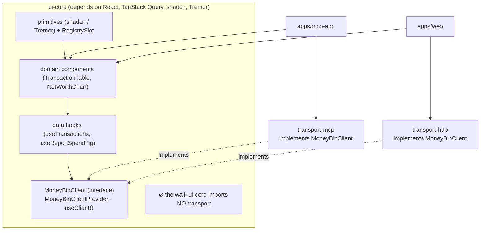
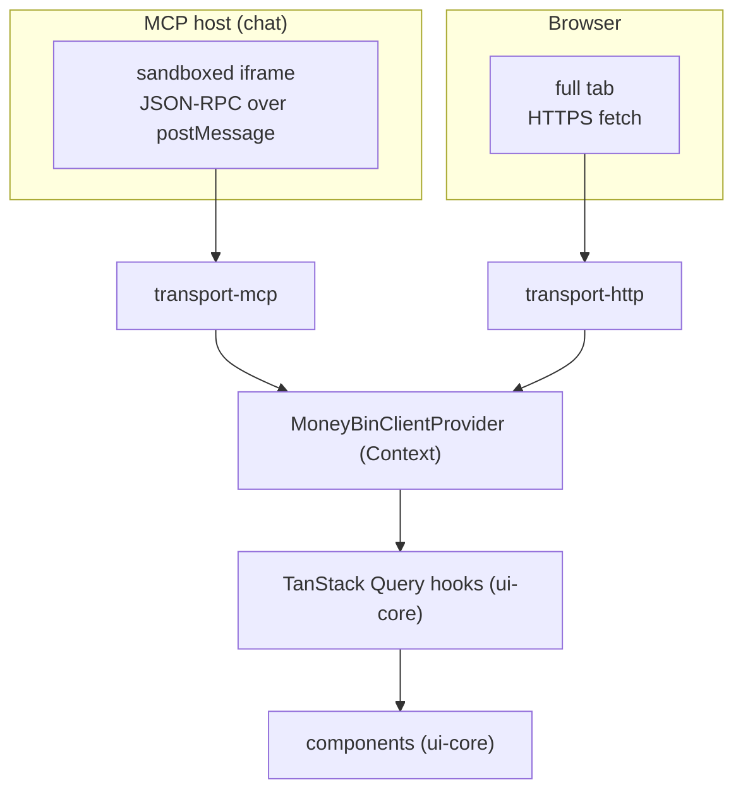
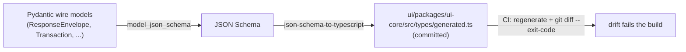

# Architecture: Shared UI Layer (MCP App + Web UI)

## Status

- **Type:** Architecture
- **Status:** draft
- **Address:** M3L — foundation for M3A/M3C and the M3M MCP App surface; registered in [`docs/roadmap.md`](../roadmap.md). The *broader* public-positioning propagation (features/comparison copy) remains tracked as separate follow-up work. Shell sequencing was resolved 2026-06-12 by the spike verdict in [Open questions](#open-questions--risks) #1: **web shell first; M3M paused on an upstream host-rendering fix.**
- **Authority:** Establishes the pattern every MoneyBin visual surface inherits. This spec defines the **shared frontend architecture** — package layout, framework, component library, type-sharing, and the transport-agnostic data layer — that both the MCP App (`apps/mcp-app`) and the Web UI (`apps/web`) build on. It does **not** design any specific dashboard or screen; those are consumer specs (`web-ui-prototype.md`, `spending-dashboard-mcp-app.md`, `portfolio-dashboard-mcp-app.md` — all planned, not yet written). The pattern-establishing decisions are recorded in [ADR-014](../decisions/014-shared-ui-architecture.md).

## Goal

MoneyBin will ship two visual surfaces — an **MCP App** (interactive UI rendered inside an MCP host such as Claude Desktop or ChatGPT) and a **Web UI** (browser app served locally by `moneybin ui` and by the hosted tier). Build them as **two thin shells over one shared component-and-data core**, so a dashboard component written once renders on both surfaces, and adding a third render target later (e.g. an in-app agent panel) reuses the same core.

The single load-bearing requirement: **transport-specific code (MCP postMessage vs. HTTP fetch) must never leak into shared components.** This spec makes that requirement *structural* — impossible to violate by construction — rather than a convention enforced by review.

## Background

### Why now

Two facts make a shared UI architecture the right foundation today:

1. **MCP Apps is a ratified standard.** As of the `2026-01-26` dated specification (SEP-1865, co-authored by Anthropic, OpenAI, and the mcp-ui maintainers; maintained under the Linux Foundation), interactive UI inside MCP hosts is an official MCP extension with shipped client support across Claude, Claude Desktop, ChatGPT, VS Code GitHub Copilot, Goose, Postman, and others. The earlier "client support is too thin" posture that deferred MCP Apps post-launch no longer holds.
   > **Correction (2026-06-12):** "official support" ≠ "working rendering." A walking-skeleton spike proved MoneyBin's server side end-to-end, but shipping Claude Desktop / claude.ai do not render MCP Apps today due to open host bugs ([ext-apps #671](https://github.com/modelcontextprotocol/ext-apps/issues/671), [claude-ai-mcp #165](https://github.com/anthropics/claude-ai-mcp/issues/165)). See [Open questions](#open-questions--risks) #1 for the full verdict. The shared-core architecture is unaffected; shell sequencing changed to web-first.
2. **Both surfaces consume the same data through the same service layer.** MoneyBin's architecture already separates data (DuckDB) from presentation via a service layer. Every visual surface is a thin layer over those services. Building the MCP App and Web UI as one codebase with two shells is therefore the coherent choice, not a forced merger.

### The reuse thesis

Competitors treat their UI as the product and MCP as a bolt-on. MoneyBin is the inverse: a mature MCP contract (response envelope, sensitivity tiers, action hints, audit/undo) is the primary surface. That makes MoneyBin structurally able to ship an MCP App as a *coherent extension* of its primary surface — and to render the same components in a browser. This spec exists so that capability is built once, cleanly, instead of as two parallel frontends that drift.

## Non-Goals

This spec is the foundation only. Out of scope:

- **Specific dashboards / screens.** Owned by consumer specs (`web-ui-prototype.md`, the two `*-dashboard-mcp-app.md` stubs).
- **Authentication.** Hosted identity (Auth0/OIDC) is owned by M3D / M3H. The Web shell exposes an auth-chrome slot; it does not implement auth.
- **Extension-package UI-slot loading.** Only the `<RegistrySlot>` primitive and slot type contract are stubbed. The registration/loading mechanism stays deferred per [`extension-contracts.md`](extension-contracts.md) ("no arbitrary UI plugins in 1.0").
- **In-app AI agent.** See [Forward compatibility](#forward-compatibility-in-app-ai). Out of scope here; the architecture is designed not to foreclose it.
- **Surface sequencing and strategy reversal.** When the MCP App ships relative to the Web UI, which dashboard ships first, and the corresponding roadmap/strategy-doc updates are separate work.
- **SSR / Next.js, i18n, mobile, theming beyond light/dark.** Not required by the launch surface.

## Decisions

| Decision | Choice | Rationale (full reasoning in [ADR-014](../decisions/014-shared-ui-architecture.md)) |
|---|---|---|
| Framework | **React** | The MCP Apps client ecosystem (`@mcp-ui/client`, `@modelcontextprotocol/ext-apps`) is React-first; largest library catalog for tables/charts/forms; safest multi-year bet. |
| Component library | **shadcn/ui + Tailwind + Tremor** | Copy-paste components (owned in-repo, no version lock-in, agent-editable); Tremor for analytics/dashboard widgets; Radix primitives give accessibility by default. |
| Repo placement | **`ui/` at repo root** (source); built bundle embedded in the Python package | Standard Python+JS hybrid layout (Streamlit, Gradio, Superset). Keeps JS toolchain out of `src/moneybin/` while shipping the bundle in the wheel. |
| Workspace | **pnpm workspaces + Vite + TypeScript** | Boring, standard. pnpm workspaces give the package boundaries that enforce the discipline contract. |
| Type sharing | **Codegen from Pydantic JSON Schema** | Python stays the single source of truth; generated TS is committed and CI-gated against drift. |
| Transport adapter | **Typed `MoneyBinClient` interface + TanStack Query hooks** | Components consume injected client via hooks; transports implement the interface; full type safety, swappable transport. |
| Extension UI slots | **Stub the contract, defer the mechanism** | `<RegistrySlot>` + slot types exist; loading deferred. Preserves optionality without overbuilding. |
| In-app AI | **Non-goal; forward-compatible** | Documented as a future MCP-host render target; never bundled keys. |

## Package architecture

Five packages: one shared core, two transports, two shells. The shared core depends on **neither** transport — that is the structural wall.

```
moneybin/                          (repo root)
├── src/moneybin/
│   └── ui/dist/                   built bundles (gitignored; shipped in wheel)
│       ├── mcp-app/
│       └── web/
├── ui/                            frontend SOURCE (top-level)
│   ├── packages/
│   │   ├── ui-core/               tokens, primitives, components, hooks, generated
│   │   │                          types, MoneyBinClient interface, MoneyBinClient-
│   │   │                          Provider, useClient(), <RegistrySlot>
│   │   ├── transport-mcp/         implements MoneyBinClient over the MCP Apps
│   │   │                          postMessage/JSON-RPC bridge
│   │   └── transport-http/        implements MoneyBinClient over fetch → FastAPI
│   ├── apps/
│   │   ├── mcp-app/               MCP App shell (compact layouts, host integration)
│   │   └── web/                   Web UI shell (router, auth-chrome slot, full nav)
│   ├── package.json
│   ├── pnpm-workspace.yaml
│   └── tsconfig.base.json
└── pyproject.toml                 force-include src/moneybin/ui/dist → wheel
```

### The discipline contract



Three enforcement layers, strongest first:

1. **Package boundaries (structural).** `ui-core/package.json` lists neither `transport-mcp` nor `transport-http`. A component importing a transport fails module resolution — the failure mode is *impossible*, not merely discouraged.
2. **`dependency-cruiser` in CI.** Validates the dependency graph: no shell→shell, no transport→transport, no transport→shell. Fails the build on violation.
3. **ESLint `no-restricted-imports`.** Intra-`ui-core` rules: hooks don't import components, primitives don't import hooks, nothing imports a shell.

### Dependency injection

Each shell instantiates its transport once and provides it at the root. Components and hooks reach the client only through `useClient()`; they never know which transport backs them.

```tsx
// apps/web/main.tsx
<MoneyBinClientProvider client={httpClient}><App /></MoneyBinClientProvider>

// apps/mcp-app/main.tsx
<MoneyBinClientProvider client={mcpClient}><App /></MoneyBinClientProvider>
```

## Data flow

A component calling `useReportSpending()` is byte-identical on both surfaces. Only the injected client differs.



### MCP App runtime model (per the ratified spec)

1. A MoneyBin MCP tool declares `_meta.ui.resourceUri: "ui://moneybin/<view>"` in its description; `_meta.ui.csp` constrains allowed origins.
2. The host fetches that `ui://` resource — MoneyBin's **self-contained** HTML+JS+CSS bundle — and renders it in a **sandboxed iframe**.
3. The initial tool result is **pushed** to the app (`ui/initialize` handshake).
4. The app **pulls** additional data by issuing `tools/call` over the postMessage/JSON-RPC bridge. The host enforces user consent for UI-initiated tool calls and controls which tools the app may call.

`transport-mcp` wraps this protocol (via `@modelcontextprotocol/ext-apps`' `App` helper, or the raw postMessage protocol) and implements `MoneyBinClient`: a `client.listTransactions(params)` call becomes a `tools/call` for the corresponding MCP tool, resolving when the host posts the result back. It handles both the pushed initial result and on-demand pulls.

**Privacy property worth preserving:** the MCP App makes **zero external network calls** — sandbox + CSP + self-contained bundle mean all data flows through the local MCP server via the host bridge. This makes "encrypted, local, nothing leaves your machine" literally true at the UI layer.

### Web UI runtime model

`transport-http` issues same-origin `fetch` calls to a **new, thin FastAPI surface** over the *existing service layer* — no business logic in the routes. Locally this is `moneybin ui`; hosted, a MoneyBin app server serves the same bundle and routes.

## Type generation

Python remains the single source of truth. Pydantic wire models export JSON Schema, which generates committed TypeScript types; CI fails on drift.



A `make ui-types` target regenerates the types. A manifest enumerates which Pydantic models are wire types (the set the generator walks).

## Build and distribution

The React bundle is **built once at release time and embedded in the Python package**. Users never see Node/npm; the frontend toolchain is build-time machinery.

- `pnpm build` (run from `ui/`) builds both shells via Vite:
  - `apps/mcp-app` → one self-contained, iframe-able HTML bundle → `src/moneybin/ui/dist/mcp-app/`.
  - `apps/web` → static asset set → `src/moneybin/ui/dist/web/`.
- `pyproject.toml` `force-include`s `src/moneybin/ui/dist` into the wheel. A build hook runs `pnpm install && pnpm build` before the Python build. (Exact hook integration depends on the build backend; resolved in the implementation plan.)
- Runtime: the MCP server reads the `mcp-app` bundle via `importlib.resources` and serves it as the `ui://` resource; FastAPI serves the `web` bundle as static files.
- sdist also pre-builds the bundle, so sdist installs do not require Node.
- **Hosted:** a MoneyBin app server consumes the same `src/moneybin/ui/dist/` bundle (via the `moneybin` dependency), serving the identical Web UI. One bundle, both deployments — preserving the "same MoneyBin, your choice of deployment" property.

Contributor impact: Python-only contributors need no Node. Frontend contributors need Node 20+ and pnpm. New `make` targets: `ui-dev`, `ui-build`, `ui-types`, `ui-test`.

## The two shells

| | `apps/mcp-app` | `apps/web` |
|---|---|---|
| Render context | Sandboxed iframe in chat | Full browser tab |
| Transport | `transport-mcp` | `transport-http` |
| Routing | None / minimal hash | React Router (full nav) |
| Auth | Host owns identity | Local: none; Hosted: Auth0 (slot) |
| Layout | Compact, single-purpose views | Full app shell + sidebar |
| Network | Zero external calls (via host bridge) | Same-origin API only |
| Bundle output | One self-contained HTML | Static asset set |

## Testing strategy

Per the project's test-driven workflow, tests precede implementation.

| Layer | Tooling | Proves |
|---|---|---|
| Component / hook units | Vitest + Testing Library | Components render correctly given data; hooks manage query state |
| **Transport contract suite** | Vitest + shared harness | **Both transports pass one shared suite against `MoneyBinClient`** — guarantees the same call returns the same shape over MCP and HTTP (functional parity, enforced in CI) |
| Web E2E | Playwright | `apps/web` flows against running FastAPI + test DB |
| MCP App harness | Vitest + mock host | `apps/mcp-app` against a `ui/initialize` + `tools/call` postMessage mock; full host E2E deferred |
| Type drift | CI gate | `make ui-types` regen + `git diff --exit-code` |
| Python side | pytest | FastAPI routes + `ui://` resource serving + `_meta.ui` tool declaration |
| Boundary enforcement | `dependency-cruiser` + ESLint in CI | The discipline contract holds |

The **transport contract suite** is the keystone: it mechanically enforces "same user outcomes reachable on both surfaces" rather than relying on review.

## Forward compatibility: in-app AI

In-app AI (an agent chat panel inside the Web UI) is **out of scope** for this architecture. The design is deliberately built not to foreclose it:

- `ui-core` components are render-target-agnostic. A future in-app agent panel would be an **MCP host** embedded in `apps/web`; it would render the **same `ui-core` components** through the **same `MoneyBinClient`** — one `<SpendingDashboard/>` rendering in Claude, in ChatGPT, and in MoneyBin's own web chat.
- The agent loop + provider management + chat UX would be net-new work in `apps/web`, reusing 100% of the component and transport layers.
- **If MoneyBin ever runs an agent loop, it will be BYOK or local-model only — never bundled keys** — preserving the no-bundled-keys, deterministic-compute / LLM-prose, and no-PII-egress invariants. This note exists so a future contributor does not bolt on a keys-included chat panel that breaks the privacy posture, nor build a parallel component tree for the web chat.

## Relationship to existing specs

- `web-ui-prototype.md` (planned, M3A/M3C; not yet written) — becomes a **consumer** of this architecture; its "FastAPI + React" surface now has a defined foundation. Cross-reference added when that spec is written.
- `spending-dashboard-mcp-app.md` / `portfolio-dashboard-mcp-app.md` (planned stubs; not yet written) — consumers; their components land in `ui-core`.
- [`extension-contracts.md`](extension-contracts.md) (in-progress) — its "typed UI/MCP App component slots wait until the Web UI and hosted runtime mature" line stays true: this spec **stubs** the slot, it does not ship loading. No contradiction.
- [`mcp-architecture.md`](mcp-architecture.md) / [`moneybin-mcp.md`](moneybin-mcp.md) — gain the `_meta.ui.resourceUri` declaration and `ui://` resource-serving requirement (see [Open questions](#open-questions--risks)).
- [`source-observations.md`](source-observations.md) — already constrains the Web UI not to introduce a parallel observation store in React state; this architecture honors that (caching reads is fine; the warehouse stays source of truth).

## Open questions / risks

1. **FastMCP `_meta.ui` + resource serving.** ~~Verify FastMCP supports tool-level `_meta` and `ui://` resource serving before committing the MCP App shell.~~ **Resolved 2026-06-12 by a throwaway walking-skeleton spike — split verdict:**
   - **Server side: verified, first-class.** FastMCP 3.3.1 ships typed MCP Apps support (`fastmcp.apps.AppConfig`): `@mcp.tool(app=AppConfig(resourceUri="ui://..."))` emits spec-correct `_meta.ui.resourceUri` (plus `visibility: ["app"]` for iframe-only tools), and `@mcp.resource(uri, mime_type=UI_MIME_TYPE)` serves `ui://` HTML as `text/html;profile=mcp-app`. A fully self-contained (zero-external-network) vanilla-JS bundle riding MoneyBin's real server passed an in-memory client check 10/10, and the spec explicitly blesses SDK-free views.
   - **Host side: blocked upstream.** Shipping Claude Desktop (confirmed live on 1.12603.1, 2026-06-12) and claude.ai complete capability negotiation and `resources/read`, inject the "rendered an interactive widget" placeholder, but never answer the iframe's `ui/initialize` — nothing paints. Known open bugs: [ext-apps #671](https://github.com/modelcontextprotocol/ext-apps/issues/671), [claude-ai-mcp #165](https://github.com/anthropics/claude-ai-mcp/issues/165). No documented flag or tier fixes it.
   - **Consequence:** don't bet near-term distribution on MCP App rendering (same lesson as "MCP resources aren't universal," extended to MCP Apps). The `apps/web` shell ships first; `apps/mcp-app` (M3M) is paused pending the upstream fix and a re-run of the render test. The Web UI path was never dependent on this question.
2. **Build-hook integration** depends on the Python build backend; confirm the `force-include` + pre-build hook mechanism at plan time.
3. **MCP Apps SDK choice** — `@modelcontextprotocol/ext-apps` (official) vs. `@mcp-ui/client` for the app side. Both target React; pick at plan time based on maturity.

## References

- [ADR-014: Shared UI Architecture](../decisions/014-shared-ui-architecture.md)
- [MCP Apps overview](https://modelcontextprotocol.io/extensions/apps/overview) · [spec announcement (2026-01-26)](https://blog.modelcontextprotocol.io/posts/2026-01-26-mcp-apps/) · [`modelcontextprotocol/ext-apps`](https://github.com/modelcontextprotocol/ext-apps/) · [`mcp-ui`](https://github.com/MCP-UI-Org/mcp-ui)
- [`architecture-shared-primitives.md`](architecture-shared-primitives.md) — the primitives the data layer reads from
