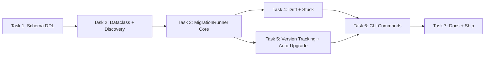

# Database Migration System Implementation Plan

> **For agentic workers:** REQUIRED SUB-SKILL: Use superpowers:subagent-driven-development (recommended) or superpowers:executing-plans to implement this plan task-by-task. Steps use checkbox (`- [ ]`) syntax for tracking.

**Goal:** Provide automatic, transparent schema migration so users never run manual migration commands — upgrades happen on first invocation after a package update.

**Architecture:** Dual-path (Rails-style) — fresh installs use `init_schemas()` for baseline DDL, upgrades use `MigrationRunner` for versioned changes. The auto-upgrade sequence runs inside `Database.__init__()` so every entry point (CLI, MCP) gets it transparently. MigrationRunner is encryption-unaware — it receives an open connection.

**Tech Stack:** Python 3.12, DuckDB, hashlib (SHA-256), importlib.metadata (version detection), Typer (CLI), pytest

**Spec:** `docs/specs/database-migration.md`

---

## Design Notes

**CLI path:** The spec says `moneybin data migrate` but the existing stubs (implemented in the CLI restructure PR #30) register it as `moneybin db migrate`. This plan follows the existing stubs — `db migrate` is the more natural home since these are database schema migrations, not data operations. The spec's `data.py` reference is moot since that file doesn't exist; the stubs are already wired into `db.app`.

**Circular imports:** `migrations.py` imports `Database`, and `database.py` needs `MigrationRunner`. All migration imports in `database.py` are lazy (inside `__init__()`) to break the cycle.

**Rebaseline:** The spec marks rebaseline as manual and deliberate (reqs 17-20). Since this is a fresh system with no existing migrations to absorb, rebaseline support is deferred — the infrastructure supports it (baseline migration stamps old versions) but no rebaseline tooling is built in this plan.

---

## File Structure

### Files to Create

| File | Responsibility |
|------|---------------|
| `src/moneybin/sql/schema/app_schema_migrations.sql` | DDL for `app.schema_migrations` tracking table |
| `src/moneybin/sql/schema/app_versions.sql` | DDL for `app.versions` component version table |
| `src/moneybin/sql/schema/analytics_schema.sql` | `CREATE SCHEMA IF NOT EXISTS analytics` |
| `src/moneybin/sql/migrations/` | Directory for `V###__description.{sql,py}` files |
| `src/moneybin/sql/migrations/README.md` | Authoring conventions for migration authors |
| `src/moneybin/migrations.py` | `Migration` dataclass + `MigrationRunner` class |
| `src/moneybin/cli/commands/migrate.py` | `db migrate apply` and `db migrate status` commands |
| `tests/moneybin/test_migrations.py` | Unit tests for MigrationRunner |
| `tests/moneybin/test_cli/test_migrate_command.py` | CLI tests for migrate commands |

### Files to Modify

| File | Change |
|------|--------|
| `src/moneybin/schema.py:36-53` | Add 3 new schema files to `_SCHEMA_FILES` list |
| `src/moneybin/tables.py:32-38` | Add `SCHEMA_MIGRATIONS` and `VERSIONS` TableRef constants |
| `src/moneybin/database.py:133` | Replace migration stub with auto-upgrade sequence |
| `src/moneybin/config.py` | Add `no_auto_upgrade` field to `DatabaseConfig` |
| `src/moneybin/cli/main.py:17-19,132-133` | Replace stub import with real migrate module |
| `src/moneybin/cli/commands/stubs.py:143-156` | Remove `db_migrate_app` stubs |

---

## Task 1: Schema DDL Files and Registration

Create the three new schema SQL files and register them so `init_schemas()` creates the tables on every database initialization.

**Files:**
- Create: `src/moneybin/sql/schema/app_schema_migrations.sql`
- Create: `src/moneybin/sql/schema/app_versions.sql`
- Create: `src/moneybin/sql/schema/analytics_schema.sql`
- Modify: `src/moneybin/schema.py:36-53`
- Modify: `src/moneybin/tables.py:32-38`
- Test: `tests/moneybin/test_migrations.py`

- [ ] **Step 1: Write tests for new schema tables**

Create `tests/moneybin/test_migrations.py` with tests that verify the new tables exist after database init:

```python
"""Tests for the database migration system."""

import duckdb
import pytest

from moneybin.database import Database


class TestMigrationSchema:
    """Verify migration tracking tables are created by init_schemas."""

    def test_schema_migrations_table_exists(self, db: Database) -> None:
        """app.schema_migrations table is created during init."""
        result = db.execute(
            "SELECT column_name, data_type FROM information_schema.columns "
            "WHERE table_schema = 'app' AND table_name = 'schema_migrations' "
            "ORDER BY ordinal_position"
        ).fetchall()
        columns = {row[0]: row[1] for row in result}
        assert "version" in columns
        assert "filename" in columns
        assert "checksum" in columns
        assert "success" in columns
        assert "execution_ms" in columns
        assert "applied_at" in columns

    def test_versions_table_exists(self, db: Database) -> None:
        """app.versions table is created during init."""
        result = db.execute(
            "SELECT column_name, data_type FROM information_schema.columns "
            "WHERE table_schema = 'app' AND table_name = 'versions' "
            "ORDER BY ordinal_position"
        ).fetchall()
        columns = {row[0]: row[1] for row in result}
        assert "component" in columns
        assert "version" in columns
        assert "previous_version" in columns
        assert "updated_at" in columns
        assert "installed_at" in columns

    def test_analytics_schema_exists(self, db: Database) -> None:
        """analytics schema is created during init."""
        result = db.execute(
            "SELECT schema_name FROM information_schema.schemata "
            "WHERE schema_name = 'analytics'"
        ).fetchall()
        assert len(result) == 1
```

- [ ] **Step 2: Run tests to verify they fail**

Run: `uv run pytest tests/moneybin/test_migrations.py::TestMigrationSchema -v`
Expected: FAIL — tables/schema don't exist yet.

- [ ] **Step 3: Create `analytics_schema.sql`**

```sql
/* Analytics schema — owned by user SQLMesh models.
   MoneyBin ships starter analytics models so users see the pattern and can extend it.
   Never touched by migrations. */
CREATE SCHEMA IF NOT EXISTS analytics;
```

- [ ] **Step 4: Create `app_schema_migrations.sql`**

```sql
/* Schema migration history — one row per applied migration file */
CREATE TABLE IF NOT EXISTS app.schema_migrations (
    version INTEGER PRIMARY KEY,       -- monotonic integer from V### filename prefix
    filename VARCHAR NOT NULL,         -- full migration filename including extension
    checksum VARCHAR NOT NULL,         -- lowercase hex SHA-256 of file contents at apply time
    success BOOLEAN NOT NULL DEFAULT TRUE, -- FALSE if migration failed mid-execution
    execution_ms INTEGER,              -- migration duration in milliseconds
    applied_at TIMESTAMP NOT NULL DEFAULT CURRENT_TIMESTAMP -- when applied
);
```

- [ ] **Step 5: Create `app_versions.sql`**

```sql
/* Component version tracking for upgrade detection */
CREATE TABLE IF NOT EXISTS app.versions (
    component VARCHAR PRIMARY KEY,     -- component identifier: 'moneybin', 'sqlmesh', etc.
    version VARCHAR NOT NULL,          -- current version string (semver)
    previous_version VARCHAR,          -- version before the last update (NULL on first install)
    updated_at TIMESTAMP NOT NULL DEFAULT CURRENT_TIMESTAMP, -- when version was last changed
    installed_at TIMESTAMP NOT NULL DEFAULT CURRENT_TIMESTAMP -- when component was first recorded
);
```

- [ ] **Step 6: Register new files in `schema.py`**

In `src/moneybin/schema.py`, add the three new files to `_SCHEMA_FILES`. The `analytics_schema.sql` goes after the existing schema creation files (after `app_schema.sql`). The two tracking tables go at the end of the app table section:

```python
_SCHEMA_FILES: list[str] = [
    "raw_schema.sql",
    "core_schema.sql",
    "app_schema.sql",
    "analytics_schema.sql",  # <-- ADD: analytics schema for user SQLMesh models
    "raw_ofx_institutions.sql",
    "raw_ofx_accounts.sql",
    "raw_ofx_transactions.sql",
    "raw_ofx_balances.sql",
    "raw_w2_forms.sql",
    "raw_csv_accounts.sql",
    "raw_csv_transactions.sql",
    "app_categories.sql",
    "app_merchants.sql",
    "app_categorization_rules.sql",
    "app_transaction_categories.sql",
    "app_budgets.sql",
    "app_transaction_notes.sql",
    "app_schema_migrations.sql",  # <-- ADD: migration tracking table
    "app_versions.sql",  # <-- ADD: component version tracking
]
```

- [ ] **Step 7: Add TableRef constants in `tables.py`**

In `src/moneybin/tables.py`, add to the `# -- App tables` section:

```python
SCHEMA_MIGRATIONS = TableRef("app", "schema_migrations")
VERSIONS = TableRef("app", "versions")
```

- [ ] **Step 8: Run tests to verify they pass**

Run: `uv run pytest tests/moneybin/test_migrations.py::TestMigrationSchema -v`
Expected: All 3 tests PASS.

- [ ] **Step 9: Run full test suite to check for regressions**

Run: `uv run pytest tests/ -v -x`
Expected: No regressions.

- [ ] **Step 10: Commit**

```bash
git add src/moneybin/sql/schema/analytics_schema.sql \
        src/moneybin/sql/schema/app_schema_migrations.sql \
        src/moneybin/sql/schema/app_versions.sql \
        src/moneybin/schema.py \
        src/moneybin/tables.py \
        tests/moneybin/test_migrations.py
git commit -m "feat(migrations): add schema_migrations, versions tables and analytics schema

Create DDL for app.schema_migrations (migration tracking), app.versions
(component version tracking), and analytics schema. Register all three
in init_schemas."
```

---

## Task 2: Migration Dataclass and File Discovery

Build the `Migration` dataclass and discovery logic that finds, parses, and validates migration files from the `src/moneybin/sql/migrations/` directory.

**Files:**
- Create: `src/moneybin/migrations.py`
- Create: `src/moneybin/sql/migrations/` (empty directory)
- Test: `tests/moneybin/test_migrations.py`

- [ ] **Step 1: Write tests for Migration dataclass and discovery**

Add to `tests/moneybin/test_migrations.py`:

```python
import hashlib
from pathlib import Path

from moneybin.migrations import Migration, discover_migrations


class TestMigrationDataclass:
    """Migration dataclass parsing and checksum computation."""

    def test_parse_sql_filename(self, tmp_path: Path) -> None:
        """Parse version and name from V###__name.sql filename."""
        sql_file = tmp_path / "V001__create_foo.sql"
        sql_file.write_text("CREATE TABLE foo (id INTEGER);")
        m = Migration.from_file(sql_file)
        assert m.version == 1
        assert m.name == "create_foo"
        assert m.filename == "V001__create_foo.sql"
        assert m.file_type == "sql"

    def test_parse_python_filename(self, tmp_path: Path) -> None:
        """Parse version and name from V###__name.py filename."""
        py_file = tmp_path / "V002__backfill_data.py"
        py_file.write_text("def migrate(conn):\n    pass\n")
        m = Migration.from_file(py_file)
        assert m.version == 2
        assert m.name == "backfill_data"
        assert m.file_type == "py"

    def test_checksum_is_deterministic(self, tmp_path: Path) -> None:
        """Same file content produces same checksum."""
        sql_file = tmp_path / "V001__test.sql"
        sql_file.write_text("SELECT 1;")
        m = Migration.from_file(sql_file)
        expected = hashlib.sha256(b"SELECT 1;").hexdigest()
        assert m.checksum == expected
        assert len(m.checksum) == 64

    def test_different_content_different_checksum(self, tmp_path: Path) -> None:
        """Different content produces different checksum."""
        f1 = tmp_path / "V001__a.sql"
        f1.write_text("SELECT 1;")
        f2 = tmp_path / "V002__b.sql"
        f2.write_text("SELECT 2;")
        assert Migration.from_file(f1).checksum != Migration.from_file(f2).checksum

    def test_rejects_malformed_name_no_prefix(self, tmp_path: Path) -> None:
        """Filenames without V### prefix are rejected."""
        bad = tmp_path / "create_foo.sql"
        bad.write_text("SELECT 1;")
        with pytest.raises(ValueError, match="does not match"):
            Migration.from_file(bad)

    def test_rejects_malformed_name_single_underscore(self, tmp_path: Path) -> None:
        """Filenames with single underscore separator are rejected."""
        bad = tmp_path / "V001_create_foo.sql"
        bad.write_text("SELECT 1;")
        with pytest.raises(ValueError, match="does not match"):
            Migration.from_file(bad)

    def test_rejects_unsupported_extension(self, tmp_path: Path) -> None:
        """Only .sql and .py extensions are supported."""
        bad = tmp_path / "V001__create_foo.txt"
        bad.write_text("data")
        with pytest.raises(ValueError, match="does not match"):
            Migration.from_file(bad)

    def test_multi_digit_version(self, tmp_path: Path) -> None:
        """Version numbers with more than 3 digits are accepted."""
        sql_file = tmp_path / "V1234__big_version.sql"
        sql_file.write_text("SELECT 1;")
        m = Migration.from_file(sql_file)
        assert m.version == 1234


class TestDiscoverMigrations:
    """discover_migrations finds and orders migration files."""

    def test_discovers_sql_and_py_files(self, tmp_path: Path) -> None:
        """Finds both .sql and .py migration files."""
        (tmp_path / "V001__first.sql").write_text("SELECT 1;")
        (tmp_path / "V002__second.py").write_text("def migrate(conn): pass\n")
        migrations = discover_migrations(tmp_path)
        assert len(migrations) == 2
        assert migrations[0].version == 1
        assert migrations[1].version == 2

    def test_sorted_by_version(self, tmp_path: Path) -> None:
        """Migrations are returned sorted by version number."""
        (tmp_path / "V003__third.sql").write_text("SELECT 3;")
        (tmp_path / "V001__first.sql").write_text("SELECT 1;")
        (tmp_path / "V002__second.sql").write_text("SELECT 2;")
        migrations = discover_migrations(tmp_path)
        assert [m.version for m in migrations] == [1, 2, 3]

    def test_ignores_non_migration_files(self, tmp_path: Path) -> None:
        """Non-migration files (README, __init__, etc.) are ignored."""
        (tmp_path / "V001__real.sql").write_text("SELECT 1;")
        (tmp_path / "README.md").write_text("# Migrations")
        (tmp_path / "__init__.py").write_text("")
        (tmp_path / "notes.txt").write_text("notes")
        migrations = discover_migrations(tmp_path)
        assert len(migrations) == 1

    def test_empty_directory(self, tmp_path: Path) -> None:
        """Empty directory returns empty list."""
        migrations = discover_migrations(tmp_path)
        assert migrations == []

    def test_nonexistent_directory(self, tmp_path: Path) -> None:
        """Nonexistent directory returns empty list."""
        migrations = discover_migrations(tmp_path / "nope")
        assert migrations == []

    def test_rejects_duplicate_versions(self, tmp_path: Path) -> None:
        """Duplicate version numbers raise an error."""
        (tmp_path / "V001__first.sql").write_text("SELECT 1;")
        (tmp_path / "V001__also_first.sql").write_text("SELECT 2;")
        with pytest.raises(ValueError, match="Duplicate migration version"):
            discover_migrations(tmp_path)
```

- [ ] **Step 2: Run tests to verify they fail**

Run: `uv run pytest tests/moneybin/test_migrations.py::TestMigrationDataclass tests/moneybin/test_migrations.py::TestDiscoverMigrations -v`
Expected: FAIL — `moneybin.migrations` module doesn't exist.

- [ ] **Step 3: Create the migrations directory**

```bash
mkdir -p src/moneybin/sql/migrations
```

- [ ] **Step 4: Implement `Migration` dataclass and `discover_migrations`**

Create `src/moneybin/migrations.py`:

```python
"""Database migration system — discovery, tracking, and execution.

Migrations are versioned SQL or Python files that apply schema changes to
MoneyBin's DuckDB database. The MigrationRunner receives an open database
connection from Database.__init__() and is encryption-unaware.

Migration files live in src/moneybin/sql/migrations/ and follow Flyway
naming: V<NNN>__<snake_case>.{sql,py} (3+ digit version, double underscore).
"""

import hashlib
import logging
import re
from dataclasses import dataclass
from pathlib import Path

logger = logging.getLogger(__name__)

_MIGRATIONS_DIR = Path(__file__).resolve().parent / "sql" / "migrations"

# V<3+ digits>__<snake_case>.<sql|py>
_MIGRATION_PATTERN = re.compile(r"^V(\d{3,})__(\w+)\.(sql|py)$")


@dataclass(frozen=True)
class Migration:
    """A single migration file with parsed metadata.

    Attributes:
        version: Monotonic integer parsed from filename prefix.
        name: Snake-case description parsed from filename.
        filename: Full filename including extension.
        checksum: Lowercase hex SHA-256 of file contents.
        path: Absolute path to the migration file.
        file_type: File extension — "sql" or "py".
    """

    version: int
    name: str
    filename: str
    checksum: str
    path: Path
    file_type: str

    @classmethod
    def from_file(cls, path: Path) -> "Migration":
        """Parse a migration file path into a Migration instance.

        Args:
            path: Path to a migration file.

        Returns:
            Parsed Migration with computed checksum.

        Raises:
            ValueError: If the filename doesn't match the expected pattern.
        """
        match = _MIGRATION_PATTERN.match(path.name)
        if not match:
            raise ValueError(
                f"Migration filename '{path.name}' does not match "
                f"expected pattern V<NNN>__<snake_case>.{{sql,py}}"
            )
        version = int(match.group(1))
        name = match.group(2)
        file_type = match.group(3)
        content = path.read_bytes()
        checksum = hashlib.sha256(content).hexdigest()
        return cls(
            version=version,
            name=name,
            filename=path.name,
            checksum=checksum,
            path=path,
            file_type=file_type,
        )


def discover_migrations(migrations_dir: Path | None = None) -> list[Migration]:
    """Discover and parse all migration files in the migrations directory.

    Args:
        migrations_dir: Directory to scan. Defaults to the built-in
            sql/migrations/ directory.

    Returns:
        List of Migration objects sorted by version number.

    Raises:
        ValueError: If duplicate version numbers are found.
    """
    directory = migrations_dir or _MIGRATIONS_DIR
    if not directory.exists():
        return []

    migrations: list[Migration] = []
    for path in sorted(directory.iterdir()):
        if not path.is_file():
            continue
        if not _MIGRATION_PATTERN.match(path.name):
            continue
        migrations.append(Migration.from_file(path))

    # Check for duplicate versions
    seen: dict[int, str] = {}
    for m in migrations:
        if m.version in seen:
            raise ValueError(
                f"Duplicate migration version {m.version}: "
                f"'{seen[m.version]}' and '{m.filename}'"
            )
        seen[m.version] = m.filename

    migrations.sort(key=lambda m: m.version)
    return migrations
```

- [ ] **Step 5: Run tests to verify they pass**

Run: `uv run pytest tests/moneybin/test_migrations.py::TestMigrationDataclass tests/moneybin/test_migrations.py::TestDiscoverMigrations -v`
Expected: All tests PASS.

- [ ] **Step 6: Commit**

```bash
git add src/moneybin/migrations.py src/moneybin/sql/migrations/ tests/moneybin/test_migrations.py
git commit -m "feat(migrations): add Migration dataclass and file discovery

Migration dataclass parses V###__name.{sql,py} filenames, computes
SHA-256 checksums. discover_migrations() finds, validates, and sorts
migration files from the migrations directory."
```

---

## Task 3: MigrationRunner — Core Apply Logic

Build the `MigrationRunner` class with methods for checking applied state, computing pending migrations, and executing individual and batch migrations.

**Files:**
- Modify: `src/moneybin/migrations.py`
- Test: `tests/moneybin/test_migrations.py`

- [ ] **Step 1: Write tests for `applied_versions()`**

Add to `tests/moneybin/test_migrations.py`:

```python
from moneybin.migrations import MigrationRunner


class TestMigrationRunnerAppliedVersions:
    """MigrationRunner.applied_versions() reads the tracking table."""

    def test_empty_tracking_table(self, db: Database) -> None:
        """Returns empty dict when no migrations have been applied."""
        runner = MigrationRunner(db)
        assert runner.applied_versions() == {}

    def test_returns_applied_versions_with_checksums(self, db: Database) -> None:
        """Returns {version: checksum} for applied migrations."""
        db.execute(
            "INSERT INTO app.schema_migrations (version, filename, checksum) "
            "VALUES (1, 'V001__test.sql', 'abc123')"
        )
        runner = MigrationRunner(db)
        applied = runner.applied_versions()
        assert applied == {1: "abc123"}

    def test_excludes_failed_migrations(self, db: Database) -> None:
        """Failed migrations (success=false) are still returned — they represent stuck state."""
        db.execute(
            "INSERT INTO app.schema_migrations (version, filename, checksum, success) "
            "VALUES (1, 'V001__ok.sql', 'aaa', TRUE), "
            "(2, 'V002__fail.sql', 'bbb', FALSE)"
        )
        runner = MigrationRunner(db)
        applied = runner.applied_versions()
        assert 1 in applied
        assert 2 in applied
```

- [ ] **Step 2: Run tests to verify they fail**

Run: `uv run pytest tests/moneybin/test_migrations.py::TestMigrationRunnerAppliedVersions -v`
Expected: FAIL — `MigrationRunner` not defined.

- [ ] **Step 3: Write tests for `pending()`**

Add to `tests/moneybin/test_migrations.py`:

```python
class TestMigrationRunnerPending:
    """MigrationRunner.pending() computes unapplied migrations."""

    def test_all_pending_when_none_applied(self, db: Database, tmp_path: Path) -> None:
        """All discovered migrations are pending when tracking table is empty."""
        (tmp_path / "V001__first.sql").write_text("SELECT 1;")
        (tmp_path / "V002__second.sql").write_text("SELECT 2;")
        runner = MigrationRunner(db, migrations_dir=tmp_path)
        pending = runner.pending()
        assert [m.version for m in pending] == [1, 2]

    def test_excludes_already_applied(self, db: Database, tmp_path: Path) -> None:
        """Already-applied versions are excluded from pending."""
        (tmp_path / "V001__first.sql").write_text("SELECT 1;")
        (tmp_path / "V002__second.sql").write_text("SELECT 2;")
        db.execute(
            "INSERT INTO app.schema_migrations (version, filename, checksum) "
            "VALUES (1, 'V001__first.sql', 'ignored')"
        )
        runner = MigrationRunner(db, migrations_dir=tmp_path)
        pending = runner.pending()
        assert [m.version for m in pending] == [2]

    def test_empty_when_all_applied(self, db: Database, tmp_path: Path) -> None:
        """Returns empty list when all migrations are applied."""
        (tmp_path / "V001__first.sql").write_text("SELECT 1;")
        db.execute(
            "INSERT INTO app.schema_migrations (version, filename, checksum) "
            "VALUES (1, 'V001__first.sql', 'ignored')"
        )
        runner = MigrationRunner(db, migrations_dir=tmp_path)
        assert runner.pending() == []
```

- [ ] **Step 4: Write tests for `apply_one()` — SQL migration**

Add to `tests/moneybin/test_migrations.py`:

```python
class TestMigrationRunnerApplyOne:
    """MigrationRunner.apply_one() executes a single migration."""

    def test_applies_sql_migration(self, db: Database, tmp_path: Path) -> None:
        """SQL migration is executed and tracked."""
        sql_file = tmp_path / "V001__create_test.sql"
        sql_file.write_text(
            "CREATE TABLE IF NOT EXISTS app.migration_test (id INTEGER PRIMARY KEY);"
        )
        migration = Migration.from_file(sql_file)
        runner = MigrationRunner(db, migrations_dir=tmp_path)
        runner.apply_one(migration)

        # Table was created
        result = db.execute(
            "SELECT COUNT(*) FROM information_schema.tables "
            "WHERE table_schema = 'app' AND table_name = 'migration_test'"
        ).fetchone()
        assert result[0] == 1

        # Tracking row was recorded
        row = db.execute(
            "SELECT version, filename, checksum, success FROM app.schema_migrations "
            "WHERE version = 1"
        ).fetchone()
        assert row is not None
        assert row[0] == 1
        assert row[1] == "V001__create_test.sql"
        assert row[2] == migration.checksum
        assert row[3] is True

    def test_applies_python_migration(self, db: Database, tmp_path: Path) -> None:
        """Python migration calls migrate(conn) and is tracked."""
        py_file = tmp_path / "V001__py_test.py"
        py_file.write_text(
            "def migrate(conn):\n"
            "    conn.execute('CREATE TABLE IF NOT EXISTS app.py_test (id INTEGER)')\n"
        )
        migration = Migration.from_file(py_file)
        runner = MigrationRunner(db, migrations_dir=tmp_path)
        runner.apply_one(migration)

        result = db.execute(
            "SELECT COUNT(*) FROM information_schema.tables "
            "WHERE table_schema = 'app' AND table_name = 'py_test'"
        ).fetchone()
        assert result[0] == 1

        row = db.execute(
            "SELECT success FROM app.schema_migrations WHERE version = 1"
        ).fetchone()
        assert row[0] is True

    def test_records_execution_time(self, db: Database, tmp_path: Path) -> None:
        """Execution time is recorded in milliseconds."""
        sql_file = tmp_path / "V001__timed.sql"
        sql_file.write_text("SELECT 1;")
        migration = Migration.from_file(sql_file)
        runner = MigrationRunner(db, migrations_dir=tmp_path)
        runner.apply_one(migration)

        row = db.execute(
            "SELECT execution_ms FROM app.schema_migrations WHERE version = 1"
        ).fetchone()
        assert row[0] is not None
        assert row[0] >= 0

    def test_rollback_on_sql_error(self, db: Database, tmp_path: Path) -> None:
        """Failed SQL migration rolls back and records success=false."""
        sql_file = tmp_path / "V001__bad.sql"
        sql_file.write_text("CREATE TABLE this is not valid SQL;")
        migration = Migration.from_file(sql_file)
        runner = MigrationRunner(db, migrations_dir=tmp_path)

        with pytest.raises(MigrationError):
            runner.apply_one(migration)

        row = db.execute(
            "SELECT success FROM app.schema_migrations WHERE version = 1"
        ).fetchone()
        assert row is not None
        assert row[0] is False

    def test_idempotent_on_rerun(self, db: Database, tmp_path: Path) -> None:
        """Re-running an already-applied migration is a silent no-op."""
        sql_file = tmp_path / "V001__test.sql"
        sql_file.write_text("SELECT 1;")
        migration = Migration.from_file(sql_file)
        runner = MigrationRunner(db, migrations_dir=tmp_path)
        runner.apply_one(migration)
        runner.apply_one(migration)  # no error

        count = db.execute(
            "SELECT COUNT(*) FROM app.schema_migrations WHERE version = 1"
        ).fetchone()
        assert count[0] == 1
```

- [ ] **Step 5: Write tests for `apply_all()`**

Add to `tests/moneybin/test_migrations.py`:

```python
from moneybin.migrations import MigrationError


class TestMigrationRunnerApplyAll:
    """MigrationRunner.apply_all() runs pending migrations in order."""

    def test_applies_pending_in_order(self, db: Database, tmp_path: Path) -> None:
        """Pending migrations are applied in version order."""
        (tmp_path / "V001__first.sql").write_text(
            "CREATE TABLE IF NOT EXISTS app.first (id INTEGER);"
        )
        (tmp_path / "V002__second.sql").write_text(
            "CREATE TABLE IF NOT EXISTS app.second (id INTEGER);"
        )
        runner = MigrationRunner(db, migrations_dir=tmp_path)
        result = runner.apply_all()
        assert result.applied_count == 2
        assert result.failed is False

    def test_skips_already_applied(self, db: Database, tmp_path: Path) -> None:
        """Already-applied migrations are not re-executed."""
        (tmp_path / "V001__first.sql").write_text("SELECT 1;")
        (tmp_path / "V002__second.sql").write_text("SELECT 2;")
        db.execute(
            "INSERT INTO app.schema_migrations (version, filename, checksum) "
            "VALUES (1, 'V001__first.sql', 'ignored')"
        )
        runner = MigrationRunner(db, migrations_dir=tmp_path)
        result = runner.apply_all()
        assert result.applied_count == 1

    def test_stops_on_first_failure(self, db: Database, tmp_path: Path) -> None:
        """Stops executing after first failed migration."""
        (tmp_path / "V001__good.sql").write_text("SELECT 1;")
        (tmp_path / "V002__bad.sql").write_text("INVALID SQL HERE;")
        (tmp_path / "V003__never.sql").write_text("SELECT 3;")
        runner = MigrationRunner(db, migrations_dir=tmp_path)
        result = runner.apply_all()
        assert result.applied_count == 1
        assert result.failed is True
        assert result.failed_migration == "V002__bad.sql"

        # V003 was never attempted
        row = db.execute(
            "SELECT COUNT(*) FROM app.schema_migrations WHERE version = 3"
        ).fetchone()
        assert row[0] == 0

    def test_no_pending_returns_zero(self, db: Database, tmp_path: Path) -> None:
        """Returns count=0 when nothing is pending."""
        runner = MigrationRunner(db, migrations_dir=tmp_path)
        result = runner.apply_all()
        assert result.applied_count == 0
        assert result.failed is False
```

- [ ] **Step 6: Run all new tests to verify they fail**

Run: `uv run pytest tests/moneybin/test_migrations.py -v -k "AppliedVersions or Pending or ApplyOne or ApplyAll"`
Expected: FAIL — `MigrationRunner` not defined.

- [ ] **Step 7: Implement `MigrationRunner`**

Add to `src/moneybin/migrations.py`:

```python
import importlib.util
import time
from dataclasses import dataclass, field

import duckdb

from moneybin.database import Database


class MigrationError(Exception):
    """Raised when a migration fails to apply."""


@dataclass
class MigrationResult:
    """Summary of a migration batch run.

    Attributes:
        applied_count: Number of migrations successfully applied.
        failed: Whether any migration failed.
        failed_migration: Filename of the failed migration, if any.
    """

    applied_count: int = 0
    failed: bool = False
    failed_migration: str | None = None


class MigrationRunner:
    """Discovers and applies database migrations.

    Receives an open Database instance — encryption-unaware. Follows
    the service pattern: business logic only, no connection management.

    Args:
        db: Open Database instance.
        migrations_dir: Directory containing migration files. Defaults
            to the built-in sql/migrations/ directory.
    """

    def __init__(
        self,
        db: Database,
        *,
        migrations_dir: Path | None = None,
    ) -> None:
        self._db = db
        self._migrations_dir = migrations_dir or _MIGRATIONS_DIR

    def applied_versions(self) -> dict[int, str]:
        """Return applied migration versions and their checksums.

        Returns:
            Dict mapping version number to checksum string.
        """
        rows = self._db.execute(
            "SELECT version, checksum FROM app.schema_migrations"
        ).fetchall()
        return {row[0]: row[1] for row in rows}

    def pending(self) -> list[Migration]:
        """Return migrations that have not yet been applied, sorted by version.

        Returns:
            List of unapplied Migration objects in version order.
        """
        applied = self.applied_versions()
        all_migrations = discover_migrations(self._migrations_dir)
        return [m for m in all_migrations if m.version not in applied]

    def apply_one(self, migration: Migration) -> None:
        """Apply a single migration within a transaction.

        If the migration version is already recorded in the tracking table,
        this is a silent no-op (idempotent). On failure, the migration DDL
        is rolled back but a tracking row with success=false is recorded.

        Args:
            migration: The migration to apply.

        Raises:
            MigrationError: If the migration fails to execute.
        """
        # Idempotent: skip if already applied
        existing = self._db.execute(
            "SELECT version FROM app.schema_migrations WHERE version = ?",
            [migration.version],
        ).fetchone()
        if existing is not None:
            logger.debug(
                f"Migration V{migration.version:03d} already applied, skipping"
            )
            return

        logger.info(f"Applying migration {migration.filename}")
        start = time.monotonic()

        try:
            self._db.execute("BEGIN TRANSACTION")

            if migration.file_type == "sql":
                sql = migration.path.read_text()
                self._db.execute(sql)
            else:
                self._execute_python_migration(migration)

            elapsed_ms = int((time.monotonic() - start) * 1000)
            self._db.execute("COMMIT")

            # Record success
            self._db.execute(
                "INSERT INTO app.schema_migrations "
                "(version, filename, checksum, success, execution_ms) "
                "VALUES (?, ?, ?, TRUE, ?)",
                [migration.version, migration.filename, migration.checksum, elapsed_ms],
            )
            logger.info(f"Applied {migration.filename} in {elapsed_ms}ms")

        except Exception as exc:
            elapsed_ms = int((time.monotonic() - start) * 1000)
            try:
                self._db.execute("ROLLBACK")
            except Exception:  # noqa: BLE001 — rollback is best-effort after failure
                pass

            # Record failure
            self._db.execute(
                "INSERT INTO app.schema_migrations "
                "(version, filename, checksum, success, execution_ms) "
                "VALUES (?, ?, ?, FALSE, ?)",
                [migration.version, migration.filename, migration.checksum, elapsed_ms],
            )
            raise MigrationError(
                f"Migration {migration.filename} failed: {exc}"
            ) from exc

    def apply_all(self) -> MigrationResult:
        """Apply all pending migrations in version order.

        Stops on first failure. Returns a summary of what was applied.

        Returns:
            MigrationResult with counts and failure info.
        """
        pending = self.pending()
        if not pending:
            logger.debug("No pending migrations")
            return MigrationResult()

        result = MigrationResult()
        for migration in pending:
            try:
                self.apply_one(migration)
                result.applied_count += 1
            except MigrationError:
                result.failed = True
                result.failed_migration = migration.filename
                break

        return result

    def _execute_python_migration(self, migration: Migration) -> None:
        """Import and execute a Python migration's migrate() function.

        Args:
            migration: A Python migration file.

        Raises:
            MigrationError: If the module lacks a migrate() function.
        """
        spec = importlib.util.spec_from_file_location(
            f"migration_v{migration.version}", migration.path
        )
        if spec is None or spec.loader is None:
            raise MigrationError(f"Cannot load Python migration {migration.filename}")
        module = importlib.util.module_from_spec(spec)
        spec.loader.exec_module(module)

        migrate_fn = getattr(module, "migrate", None)
        if migrate_fn is None:
            raise MigrationError(
                f"Python migration {migration.filename} has no migrate() function"
            )
        migrate_fn(self._db.conn)
```

- [ ] **Step 8: Run tests to verify they pass**

Run: `uv run pytest tests/moneybin/test_migrations.py -v -k "AppliedVersions or Pending or ApplyOne or ApplyAll"`
Expected: All tests PASS.

- [ ] **Step 9: Run format and lint**

Run: `uv run ruff format src/moneybin/migrations.py tests/moneybin/test_migrations.py && uv run ruff check src/moneybin/migrations.py tests/moneybin/test_migrations.py`

- [ ] **Step 10: Commit**

```bash
git add src/moneybin/migrations.py tests/moneybin/test_migrations.py
git commit -m "feat(migrations): implement MigrationRunner with apply/pending/tracking

MigrationRunner discovers pending migrations, applies them in version
order within transactions, records success/failure in app.schema_migrations.
Supports both SQL and Python migration files."
```

---

## Task 4: Drift Detection and Stuck Migration Handling

Add checksum drift detection (warns but doesn't fail) and stuck migration detection (blocks further execution).

**Files:**
- Modify: `src/moneybin/migrations.py`
- Test: `tests/moneybin/test_migrations.py`

- [ ] **Step 1: Write tests for drift detection**

Add to `tests/moneybin/test_migrations.py`:

```python
@dataclass
class DriftWarning:
    """Needed for type reference in tests — import from migrations module."""

    pass


class TestMigrationRunnerDrift:
    """MigrationRunner.check_drift() detects modified migration files."""

    def test_detects_checksum_drift(self, db: Database, tmp_path: Path) -> None:
        """Warns when an applied migration's file has changed."""
        sql_file = tmp_path / "V001__drifted.sql"
        sql_file.write_text("SELECT 1;")
        migration = Migration.from_file(sql_file)
        runner = MigrationRunner(db, migrations_dir=tmp_path)
        runner.apply_one(migration)

        # Modify the file after applying
        sql_file.write_text("SELECT 999;")
        warnings = runner.check_drift()
        assert len(warnings) == 1
        assert warnings[0].version == 1
        assert warnings[0].filename == "V001__drifted.sql"

    def test_no_drift_when_unchanged(self, db: Database, tmp_path: Path) -> None:
        """No warnings when file checksums match."""
        sql_file = tmp_path / "V001__stable.sql"
        sql_file.write_text("SELECT 1;")
        migration = Migration.from_file(sql_file)
        runner = MigrationRunner(db, migrations_dir=tmp_path)
        runner.apply_one(migration)
        assert runner.check_drift() == []

    def test_ignores_unapplied_files(self, db: Database, tmp_path: Path) -> None:
        """Unapplied migration files are not checked for drift."""
        (tmp_path / "V001__pending.sql").write_text("SELECT 1;")
        runner = MigrationRunner(db, migrations_dir=tmp_path)
        assert runner.check_drift() == []

    def test_detects_missing_file(self, db: Database, tmp_path: Path) -> None:
        """Warns when an applied migration's file has been deleted."""
        sql_file = tmp_path / "V001__deleted.sql"
        sql_file.write_text("SELECT 1;")
        migration = Migration.from_file(sql_file)
        runner = MigrationRunner(db, migrations_dir=tmp_path)
        runner.apply_one(migration)

        sql_file.unlink()
        warnings = runner.check_drift()
        assert len(warnings) == 1
        assert "missing" in warnings[0].reason.lower()
```

- [ ] **Step 2: Write tests for stuck migration detection**

Add to `tests/moneybin/test_migrations.py`:

```python
class TestMigrationRunnerStuck:
    """MigrationRunner detects stuck migrations (success=false)."""

    def test_detects_stuck_migration(self, db: Database, tmp_path: Path) -> None:
        """Raises error when a failed migration exists in tracking table."""
        db.execute(
            "INSERT INTO app.schema_migrations (version, filename, checksum, success) "
            "VALUES (1, 'V001__stuck.sql', 'abc', FALSE)"
        )
        runner = MigrationRunner(db, migrations_dir=tmp_path)
        with pytest.raises(MigrationError, match="stuck"):
            runner.check_stuck()

    def test_no_stuck_when_all_succeeded(self, db: Database, tmp_path: Path) -> None:
        """No error when all applied migrations succeeded."""
        db.execute(
            "INSERT INTO app.schema_migrations (version, filename, checksum, success) "
            "VALUES (1, 'V001__ok.sql', 'abc', TRUE)"
        )
        runner = MigrationRunner(db, migrations_dir=tmp_path)
        runner.check_stuck()  # no exception

    def test_apply_all_checks_stuck_first(self, db: Database, tmp_path: Path) -> None:
        """apply_all() raises if there's a stuck migration, before running anything."""
        db.execute(
            "INSERT INTO app.schema_migrations (version, filename, checksum, success) "
            "VALUES (1, 'V001__stuck.sql', 'abc', FALSE)"
        )
        (tmp_path / "V002__new.sql").write_text("SELECT 1;")
        runner = MigrationRunner(db, migrations_dir=tmp_path)
        result = runner.apply_all()
        assert result.failed is True
        assert (
            "stuck" in (result.failed_migration or "").lower()
            or result.applied_count == 0
        )
```

- [ ] **Step 3: Run tests to verify they fail**

Run: `uv run pytest tests/moneybin/test_migrations.py -v -k "Drift or Stuck"`
Expected: FAIL — methods not defined.

- [ ] **Step 4: Implement drift detection and stuck state**

Add the `DriftWarning` dataclass and methods to `src/moneybin/migrations.py`:

```python
@dataclass(frozen=True)
class DriftWarning:
    """Warning about a migration file that has changed since it was applied.

    Attributes:
        version: Migration version number.
        filename: Migration filename.
        reason: Human-readable explanation of the drift.
    """

    version: int
    filename: str
    reason: str
```

Add methods to `MigrationRunner`:

```python
def check_drift(self) -> list[DriftWarning]:
    """Check for checksum drift between applied migrations and current files.

    Returns:
        List of DriftWarning for files that have changed or gone missing.
    """
    applied_rows = self._db.execute(
        "SELECT version, filename, checksum FROM app.schema_migrations "
        "WHERE success = TRUE"
    ).fetchall()
    if not applied_rows:
        return []

    # Build lookup of current files
    current_files: dict[int, Migration] = {}
    for m in discover_migrations(self._migrations_dir):
        current_files[m.version] = m

    warnings: list[DriftWarning] = []
    for version, filename, stored_checksum in applied_rows:
        if version not in current_files:
            warnings.append(
                DriftWarning(
                    version=version,
                    filename=filename,
                    reason=f"File missing — {filename} was applied but no longer exists on disk",
                )
            )
        elif current_files[version].checksum != stored_checksum:
            warnings.append(
                DriftWarning(
                    version=version,
                    filename=filename,
                    reason=f"Checksum mismatch — {filename} has been modified since it was applied",
                )
            )

    return warnings


def check_stuck(self) -> None:
    """Check for stuck migrations (success=false in tracking table).

    Raises:
        MigrationError: If any migration has success=false.
    """
    stuck = self._db.execute(
        "SELECT version, filename FROM app.schema_migrations "
        "WHERE success = FALSE ORDER BY version LIMIT 1"
    ).fetchone()
    if stuck is not None:
        raise MigrationError(
            f"Stuck migration: {stuck[1]} (version {stuck[0]}) failed previously. "
            f"Fix the issue and delete the row from app.schema_migrations to retry, "
            f"or apply a corrective migration with a higher version number."
        )
```

Update `apply_all()` to check for stuck state first:

```python
    def apply_all(self) -> MigrationResult:
        """Apply all pending migrations in version order.

        Checks for stuck migrations first. Stops on first failure.

        Returns:
            MigrationResult with counts and failure info.
        """
        # Check for stuck state before doing anything
        try:
            self.check_stuck()
        except MigrationError as exc:
            return MigrationResult(failed=True, failed_migration=str(exc))

        pending = self.pending()
        if not pending:
            logger.debug("No pending migrations")
            return MigrationResult()

        result = MigrationResult()
        for migration in pending:
            try:
                self.apply_one(migration)
                result.applied_count += 1
            except MigrationError:
                result.failed = True
                result.failed_migration = migration.filename
                break

        return result
```

- [ ] **Step 5: Run tests to verify they pass**

Run: `uv run pytest tests/moneybin/test_migrations.py -v -k "Drift or Stuck"`
Expected: All tests PASS.

- [ ] **Step 6: Commit**

```bash
git add src/moneybin/migrations.py tests/moneybin/test_migrations.py
git commit -m "feat(migrations): add drift detection and stuck migration handling

check_drift() compares applied checksums against current files, warns on
mismatch or missing files. check_stuck() blocks apply_all() when a
previously-failed migration exists in the tracking table."
```

---

## Task 5: Version Tracking and Auto-Upgrade in Database.__init__

Wire the migration system into `Database.__init__()` so upgrades happen automatically on first invocation after a package update. Add SQLMesh version detection.

**Files:**
- Modify: `src/moneybin/database.py:133`
- Modify: `src/moneybin/config.py` (add `no_auto_upgrade` field)
- Modify: `src/moneybin/migrations.py` (add version helpers)
- Test: `tests/moneybin/test_migrations.py`

- [ ] **Step 1: Add `no_auto_upgrade` config field**

In `src/moneybin/config.py`, add to `DatabaseConfig`:

```python
    no_auto_upgrade: bool = Field(
        default=False,
        description="Skip versioned migrations and SQLMesh migrate on startup. "
        "Encryption and schema init still run.",
    )
```

This is read from `MONEYBIN_DATABASE__NO_AUTO_UPGRADE=1` or `MONEYBIN_NO_AUTO_UPGRADE=1`.

- [ ] **Step 2: Write tests for version tracking helpers**

Add to `tests/moneybin/test_migrations.py`:

```python
from moneybin.migrations import get_current_versions, record_version


class TestVersionTracking:
    """Version recording and retrieval in app.versions."""

    def test_record_version_first_install(self, db: Database) -> None:
        """Records version with no previous_version on first install."""
        record_version(db, "moneybin", "1.0.0")
        row = db.execute(
            "SELECT component, version, previous_version "
            "FROM app.versions WHERE component = 'moneybin'"
        ).fetchone()
        assert row[0] == "moneybin"
        assert row[1] == "1.0.0"
        assert row[2] is None

    def test_record_version_upgrade(self, db: Database) -> None:
        """Updates version and sets previous_version on upgrade."""
        record_version(db, "moneybin", "1.0.0")
        record_version(db, "moneybin", "2.0.0")
        row = db.execute(
            "SELECT version, previous_version FROM app.versions "
            "WHERE component = 'moneybin'"
        ).fetchone()
        assert row[0] == "2.0.0"
        assert row[1] == "1.0.0"

    def test_record_version_same_is_noop(self, db: Database) -> None:
        """Recording the same version is a no-op."""
        record_version(db, "moneybin", "1.0.0")
        record_version(db, "moneybin", "1.0.0")
        count = db.execute(
            "SELECT COUNT(*) FROM app.versions WHERE component = 'moneybin'"
        ).fetchone()
        assert count[0] == 1

    def test_get_current_versions_empty(self, db: Database) -> None:
        """Returns empty dict when no versions recorded."""
        assert get_current_versions(db) == {}

    def test_get_current_versions(self, db: Database) -> None:
        """Returns {component: version} mapping."""
        record_version(db, "moneybin", "1.0.0")
        record_version(db, "sqlmesh", "0.130.0")
        versions = get_current_versions(db)
        assert versions == {"moneybin": "1.0.0", "sqlmesh": "0.130.0"}
```

- [ ] **Step 3: Run tests to verify they fail**

Run: `uv run pytest tests/moneybin/test_migrations.py::TestVersionTracking -v`
Expected: FAIL — functions not defined.

- [ ] **Step 4: Implement version tracking functions**

Add to `src/moneybin/migrations.py`:

```python
def get_current_versions(db: Database) -> dict[str, str]:
    """Read all component versions from app.versions.

    Args:
        db: Open Database instance.

    Returns:
        Dict mapping component name to version string.
    """
    rows = db.execute("SELECT component, version FROM app.versions").fetchall()
    return {row[0]: row[1] for row in rows}


def record_version(db: Database, component: str, version: str) -> None:
    """Record or update a component version in app.versions.

    If the component already has the same version, this is a no-op.
    If the version has changed, previous_version is updated.

    Args:
        db: Open Database instance.
        component: Component identifier (e.g. 'moneybin', 'sqlmesh').
        version: Current version string.
    """
    existing = db.execute(
        "SELECT version FROM app.versions WHERE component = ?", [component]
    ).fetchone()

    if existing is None:
        db.execute(
            "INSERT INTO app.versions (component, version) VALUES (?, ?)",
            [component, version],
        )
        logger.info(f"Recorded {component} version {version} (first install)")
    elif existing[0] != version:
        db.execute(
            "UPDATE app.versions SET previous_version = version, "
            "version = ?, updated_at = CURRENT_TIMESTAMP WHERE component = ?",
            [version, component],
        )
        logger.info(f"Updated {component} version {existing[0]} -> {version}")
```

- [ ] **Step 5: Run version tracking tests**

Run: `uv run pytest tests/moneybin/test_migrations.py::TestVersionTracking -v`
Expected: All tests PASS.

- [ ] **Step 6: Write tests for auto-upgrade in Database.__init__**

Add to `tests/moneybin/test_migrations.py`:

```python
from unittest.mock import patch, MagicMock


class TestAutoUpgrade:
    """Auto-upgrade runs migrations when package version changes."""

    def test_first_init_records_version(
        self, tmp_path: Path, mock_secret_store: MagicMock
    ) -> None:
        """First database init records the current package version."""
        db_path = tmp_path / "test.duckdb"
        with patch(
            "moneybin.database.importlib.metadata.version", return_value="1.0.0"
        ):
            database = Database(db_path, secret_store=mock_secret_store)
        try:
            row = database.execute(
                "SELECT version FROM app.versions WHERE component = 'moneybin'"
            ).fetchone()
            assert row is not None
            assert row[0] == "1.0.0"
        finally:
            database.close()

    def test_version_mismatch_runs_migrations(
        self, tmp_path: Path, mock_secret_store: MagicMock
    ) -> None:
        """When package version changes, pending migrations are applied."""
        db_path = tmp_path / "test.duckdb"
        # First init at version 1.0.0
        with patch(
            "moneybin.database.importlib.metadata.version", return_value="1.0.0"
        ):
            db1 = Database(db_path, secret_store=mock_secret_store)
            db1.close()

        # Second init at version 2.0.0 — should trigger migration sequence
        with patch(
            "moneybin.database.importlib.metadata.version", return_value="2.0.0"
        ):
            db2 = Database(db_path, secret_store=mock_secret_store)
        try:
            row = db2.execute(
                "SELECT version, previous_version FROM app.versions "
                "WHERE component = 'moneybin'"
            ).fetchone()
            assert row[0] == "2.0.0"
            assert row[1] == "1.0.0"
        finally:
            db2.close()

    def test_no_auto_upgrade_skips_migrations(
        self,
        tmp_path: Path,
        mock_secret_store: MagicMock,
        monkeypatch: pytest.MonkeyPatch,
    ) -> None:
        """MONEYBIN_DATABASE__NO_AUTO_UPGRADE=1 skips migration sequence."""
        monkeypatch.setenv("MONEYBIN_DATABASE__NO_AUTO_UPGRADE", "1")
        db_path = tmp_path / "test.duckdb"
        with patch(
            "moneybin.database.importlib.metadata.version", return_value="1.0.0"
        ):
            database = Database(db_path, secret_store=mock_secret_store)
        try:
            row = database.execute(
                "SELECT COUNT(*) FROM app.versions WHERE component = 'moneybin'"
            ).fetchone()
            assert row[0] == 0  # version not recorded when auto-upgrade is skipped
        finally:
            database.close()
```

- [ ] **Step 7: Run tests to verify they fail**

Run: `uv run pytest tests/moneybin/test_migrations.py::TestAutoUpgrade -v`
Expected: FAIL — Database.__init__ doesn't have version logic yet.

- [ ] **Step 8: Wire auto-upgrade into Database.__init__**

In `src/moneybin/database.py`, replace the stub at line 133 with the auto-upgrade sequence. Add the import at the top of the file:

```python
import importlib.metadata
```

Replace the migration stub comment with:

```python
# Steps g-i: Auto-upgrade (migrations + version tracking)
from moneybin.config import get_settings
from moneybin.migrations import (
    MigrationRunner,
    get_current_versions,
    record_version,
)

settings = get_settings()
if not settings.database.no_auto_upgrade:
    current_pkg_version = importlib.metadata.version("moneybin")
    stored_versions = get_current_versions(self)
    stored_pkg_version = stored_versions.get("moneybin")

    if stored_pkg_version != current_pkg_version:
        if stored_pkg_version is not None:
            logger.info(
                f"⚙️  MoneyBin upgraded ({stored_pkg_version} → {current_pkg_version}). "
                f"Applying updates..."
            )

        # Run pending schema migrations
        runner = MigrationRunner(self)
        result = runner.apply_all()

        if result.failed:
            logger.error(
                f"❌ Migration {result.failed_migration} failed. Database rolled back."
            )
            logger.info(f"💡 See logs for details")
            logger.error(
                f"🐛 Report issues at https://github.com/bsaffel/moneybin/issues"
            )
            raise MigrationError(
                f"Migration failed: {result.failed_migration}. See logs for details."
            )

        if result.applied_count > 0:
            logger.info(f"  ✅ {result.applied_count} migration(s) applied")

        # Check SQLMesh version
        try:
            sqlmesh_version = importlib.metadata.version("sqlmesh")
            stored_sqlmesh = stored_versions.get("sqlmesh")
            if stored_sqlmesh != sqlmesh_version:
                self._run_sqlmesh_migrate()
                record_version(self, "sqlmesh", sqlmesh_version)
                if stored_sqlmesh is not None:
                    logger.info("  ✅ SQLMesh state updated")
        except importlib.metadata.PackageNotFoundError:
            pass  # SQLMesh not installed — skip

        # Record MoneyBin version
        record_version(self, "moneybin", current_pkg_version)
```

Add the SQLMesh migrate helper method to the `Database` class:

```python
    def _run_sqlmesh_migrate(self) -> None:
        """Run sqlmesh migrate to update SQLMesh internal state.

        Called when the installed SQLMesh version differs from the recorded
        version. Uses subprocess to invoke the sqlmesh CLI.
        """
        import subprocess

        sqlmesh_root = Path(__file__).resolve().parents[2] / "sqlmesh"
        try:
            subprocess.run(
                ["uv", "run", "sqlmesh", "-p", str(sqlmesh_root), "migrate"],
                check=True,
                capture_output=True,
                text=True,
            )
            logger.debug("sqlmesh migrate completed successfully")
        except subprocess.CalledProcessError as exc:
            logger.warning(
                f"⚠️  sqlmesh migrate failed (exit {exc.returncode}): {exc.stderr.strip()}"
            )
        except FileNotFoundError:
            logger.debug("sqlmesh CLI not found, skipping migrate")
```

Also add the `MigrationError` import at the top of database.py:

```python
from moneybin.migrations import MigrationError
```

**Important:** This import must be a lazy/deferred import inside `__init__()` to avoid circular imports, since `migrations.py` imports `Database`. The `from moneybin.migrations import ...` lines shown above are already inside `__init__()` as local imports.

- [ ] **Step 9: Run auto-upgrade tests**

Run: `uv run pytest tests/moneybin/test_migrations.py::TestAutoUpgrade -v`
Expected: All tests PASS.

- [ ] **Step 10: Run full test suite**

Run: `uv run pytest tests/ -v -x`
Expected: No regressions. Existing tests still pass (Database.__init__ now does more work but it's compatible).

- [ ] **Step 11: Commit**

```bash
git add src/moneybin/database.py src/moneybin/config.py src/moneybin/migrations.py tests/moneybin/test_migrations.py
git commit -m "feat(migrations): wire auto-upgrade into Database.__init__

On startup, compare installed package version against app.versions.
When versions differ, run pending migrations + sqlmesh migrate + record
new versions. Skip with MONEYBIN_DATABASE__NO_AUTO_UPGRADE=1."
```

---

## Task 6: CLI Commands — `db migrate apply` and `db migrate status`

Replace the stub commands with real implementations that delegate to `MigrationRunner`.

**Files:**
- Create: `src/moneybin/cli/commands/migrate.py`
- Modify: `src/moneybin/cli/main.py:17-19,132-133`
- Modify: `src/moneybin/cli/commands/stubs.py:143-156`
- Test: `tests/moneybin/test_cli/test_migrate_command.py`

- [ ] **Step 1: Write CLI tests**

Create `tests/moneybin/test_cli/test_migrate_command.py`:

```python
"""Tests for the db migrate CLI commands."""

from pathlib import Path
from unittest.mock import MagicMock, patch

import pytest
from typer.testing import CliRunner

from moneybin.cli.main import app

runner = CliRunner()


class TestMigrateApply:
    """moneybin db migrate apply command."""

    @patch("moneybin.cli.commands.migrate.get_database")
    @patch("moneybin.cli.commands.migrate.MigrationRunner")
    def test_apply_runs_pending(
        self, mock_runner_cls: MagicMock, mock_get_db: MagicMock
    ) -> None:
        """Apply command runs pending migrations and exits 0."""
        from moneybin.migrations import MigrationResult

        mock_runner = mock_runner_cls.return_value
        mock_runner.apply_all.return_value = MigrationResult(applied_count=2)
        mock_runner.check_drift.return_value = []

        result = runner.invoke(app, ["db", "migrate", "apply"])
        assert result.exit_code == 0
        mock_runner.apply_all.assert_called_once()

    @patch("moneybin.cli.commands.migrate.get_database")
    @patch("moneybin.cli.commands.migrate.MigrationRunner")
    def test_apply_dry_run(
        self, mock_runner_cls: MagicMock, mock_get_db: MagicMock
    ) -> None:
        """Dry run lists pending migrations without executing."""
        from moneybin.migrations import Migration

        mock_runner = mock_runner_cls.return_value
        mock_runner.pending.return_value = [
            Migration(
                version=1,
                name="test",
                filename="V001__test.sql",
                checksum="abc123",
                path=Path("/tmp/V001__test.sql"),
                file_type="sql",
            )
        ]

        result = runner.invoke(app, ["db", "migrate", "apply", "--dry-run"])
        assert result.exit_code == 0
        assert "V001__test.sql" in result.output
        mock_runner.apply_all.assert_not_called()

    @patch("moneybin.cli.commands.migrate.get_database")
    @patch("moneybin.cli.commands.migrate.MigrationRunner")
    def test_apply_failure_exits_1(
        self, mock_runner_cls: MagicMock, mock_get_db: MagicMock
    ) -> None:
        """Failed migration exits with code 1."""
        from moneybin.migrations import MigrationResult

        mock_runner = mock_runner_cls.return_value
        mock_runner.apply_all.return_value = MigrationResult(
            failed=True, failed_migration="V002__bad.sql"
        )
        mock_runner.check_drift.return_value = []

        result = runner.invoke(app, ["db", "migrate", "apply"])
        assert result.exit_code == 1


class TestMigrateStatus:
    """moneybin db migrate status command."""

    @patch("moneybin.cli.commands.migrate.get_database")
    @patch("moneybin.cli.commands.migrate.MigrationRunner")
    def test_status_shows_applied_and_pending(
        self, mock_runner_cls: MagicMock, mock_get_db: MagicMock
    ) -> None:
        """Status command shows applied, pending, and drift info."""
        from moneybin.migrations import Migration

        mock_runner = mock_runner_cls.return_value
        mock_runner.applied_versions.return_value = {1: "abc123"}
        mock_runner.pending.return_value = [
            Migration(
                version=2,
                name="new",
                filename="V002__new.sql",
                checksum="def456",
                path=Path("/tmp/V002__new.sql"),
                file_type="sql",
            )
        ]
        mock_runner.check_drift.return_value = []

        mock_db = mock_get_db.return_value
        mock_db.execute.return_value.fetchall.return_value = [
            (1, "V001__init.sql", "abc123", True, 42, "2026-01-01 00:00:00")
        ]

        result = runner.invoke(app, ["db", "migrate", "status"])
        assert result.exit_code == 0
```

- [ ] **Step 2: Run tests to verify they fail**

Run: `uv run pytest tests/moneybin/test_cli/test_migrate_command.py -v`
Expected: FAIL — module doesn't exist.

- [ ] **Step 3: Implement `migrate.py` CLI commands**

Create `src/moneybin/cli/commands/migrate.py`:

```python
"""CLI commands for database migration management.

Power-user commands for explicit migration control. Most users never
need these — auto-upgrade in Database.__init__() handles everything
transparently.
"""

import logging
from typing import Annotated

import typer

from moneybin.database import DatabaseKeyError, get_database
from moneybin.migrations import MigrationRunner

logger = logging.getLogger(__name__)

app = typer.Typer(help="Database migration management", no_args_is_help=True)


@app.command("apply")
def migrate_apply(
    dry_run: Annotated[
        bool,
        typer.Option("--dry-run", help="List pending migrations without executing"),
    ] = False,
) -> None:
    """Apply pending database migrations."""
    try:
        db = get_database()
    except DatabaseKeyError:
        logger.error("❌ Database encryption key not found")
        logger.info("💡 Run 'moneybin db unlock' to provide your passphrase")
        raise typer.Exit(1) from None

    runner = MigrationRunner(db)

    if dry_run:
        pending = runner.pending()
        if not pending:
            logger.info("No pending migrations")
            raise typer.Exit(0) from None
        logger.info(f"{len(pending)} pending migration(s):")
        for m in pending:
            logger.info(f"  {m.filename} ({m.file_type})")
        raise typer.Exit(0) from None

    result = runner.apply_all()

    # Show drift warnings
    for warning in runner.check_drift():
        logger.warning(f"⚠️  {warning.reason}")

    if result.failed:
        logger.error(f"❌ Migration {result.failed_migration} failed")
        logger.info("💡 See logs for details")
        logger.error("🐛 Report issues at https://github.com/bsaffel/moneybin/issues")
        raise typer.Exit(1) from None

    if result.applied_count > 0:
        logger.info(f"✅ {result.applied_count} migration(s) applied")
    else:
        logger.info("No pending migrations")


@app.command("status")
def migrate_status() -> None:
    """Show migration state — applied, pending, and drift warnings."""
    try:
        db = get_database()
    except DatabaseKeyError:
        logger.error("❌ Database encryption key not found")
        logger.info("💡 Run 'moneybin db unlock' to provide your passphrase")
        raise typer.Exit(1) from None

    runner = MigrationRunner(db)

    # Applied migrations
    applied_rows = db.execute(
        "SELECT version, filename, checksum, success, execution_ms, applied_at "
        "FROM app.schema_migrations ORDER BY version"
    ).fetchall()

    if applied_rows:
        logger.info("Applied migrations:")
        for version, filename, _checksum, success, exec_ms, applied_at in applied_rows:
            status = "✅" if success else "❌"
            time_str = f" ({exec_ms}ms)" if exec_ms is not None else ""
            logger.info(
                f"  {status} V{version:03d} {filename}{time_str} — {applied_at}"
            )
    else:
        logger.info("No applied migrations")

    # Pending
    pending = runner.pending()
    if pending:
        logger.info(f"\nPending migrations ({len(pending)}):")
        for m in pending:
            logger.info(f"  ⚙️  {m.filename}")
    else:
        logger.info("\nNo pending migrations")

    # Drift warnings
    drift = runner.check_drift()
    if drift:
        logger.info("\nDrift warnings:")
        for w in drift:
            logger.warning(f"  ⚠️  {w.reason}")

    # Version state
    from moneybin.migrations import get_current_versions

    versions = get_current_versions(db)
    if versions:
        logger.info("\nComponent versions:")
        for component, version in sorted(versions.items()):
            logger.info(f"  {component}: {version}")
```

- [ ] **Step 4: Update `main.py` to use real migrate commands**

In `src/moneybin/cli/main.py`, replace the stub import and registration:

Remove from imports (line 18):
```python
(db_migrate_app,)
```

Add import:
```python
from .commands import migrate
```

Replace line 132-133:
```python
# Add db migrate as a sub-typer of db
db.app.add_typer(migrate.app, name="migrate", help="Database migration management")
```

- [ ] **Step 5: Remove stubs from `stubs.py`**

In `src/moneybin/cli/commands/stubs.py`, delete the `db_migrate_app` section (lines 143-156):

```python
# --- db migrate ---
db_migrate_app = typer.Typer(help="Database migration management")


@db_migrate_app.command("apply")
def db_migrate_apply() -> None:
    """Apply pending database migrations."""
    _not_implemented("database-migration.md")


@db_migrate_app.command("status")
def db_migrate_status() -> None:
    """Show migration state."""
    _not_implemented("database-migration.md")
```

- [ ] **Step 6: Run CLI tests**

Run: `uv run pytest tests/moneybin/test_cli/test_migrate_command.py -v`
Expected: All tests PASS.

- [ ] **Step 7: Run full test suite**

Run: `uv run pytest tests/ -v -x`
Expected: No regressions.

- [ ] **Step 8: Commit**

```bash
git add src/moneybin/cli/commands/migrate.py \
        src/moneybin/cli/main.py \
        src/moneybin/cli/commands/stubs.py \
        tests/moneybin/test_cli/test_migrate_command.py
git commit -m "feat(migrations): add db migrate apply/status CLI commands

Replace stub commands with real implementations. apply runs pending
migrations (or --dry-run to preview). status shows applied, pending,
drift warnings, and component versions."
```

---

## Task 7: Migrations Directory README and Documentation

Create the authoring conventions README and update the spec status.

**Files:**
- Create: `src/moneybin/sql/migrations/README.md`
- Modify: `docs/specs/database-migration.md` (status: `in-progress` -> `implemented`)
- Modify: `docs/specs/INDEX.md` (update status)

- [ ] **Step 1: Create migrations README**

Create `src/moneybin/sql/migrations/README.md`:

```markdown
# Database Migrations

Migration files that apply schema changes to MoneyBin's DuckDB database.

## Naming Convention

```
V<NNN>__<snake_case_description>.<sql|py>
```

- **V prefix** + **3+ digit version** (monotonic integer, zero-padded)
- **Double underscore** separator (`__`)
- **Snake case** description
- **Extension**: `.sql` (default) or `.py` (escape hatch)

Examples:
- `V001__create_tax_lots.sql`
- `V002__backfill_account_types.py`
- `V010__add_currency_column.sql`

## SQL Migrations (default, ~80% of cases)

Plain SQL DDL/DML. Executed as a single transaction.

```sql
ALTER TABLE app.categories ADD COLUMN color VARCHAR;
```

## Python Migrations (escape hatch)

Export a single `migrate(conn)` function. The runner calls it within a transaction.

```python
def migrate(conn):
    """Backfill account types from institution metadata."""
    rows = conn.execute("SELECT ...").fetchall()
    for row in rows:
        conn.execute("UPDATE ... WHERE id = ?", [row[0]])
```

## Scope

Migrations may alter:
- `raw.*` — loader-owned tables
- `app.*` — application state tables

Migrations must NOT alter (owned by SQLMesh):
- `core.*`, `prep.*`, `analytics.*`

## When to Use SQL vs Python

| SQL | Python |
|-----|--------|
| Adding/altering/dropping tables or columns | Backfilling data based on runtime state |
| Creating/dropping indexes | Importing seed data from external files |
| Simple INSERT/UPDATE with literal values | Conditional logic (if column exists, skip) |
| Any DDL that is purely structural | Reading Python package versions or metadata |
```

- [ ] **Step 2: Run pre-commit checks**

Run: `make check test`
Expected: format, lint, type-check, and all tests pass.

- [ ] **Step 3: Update spec status**

In `docs/specs/database-migration.md`, change line 4 from `ready` to `implemented`.

Update `docs/specs/INDEX.md` to reflect the new status — move the entry from Active to Archived.

- [ ] **Step 4: Move spec to archived**

```bash
mv docs/specs/database-migration.md docs/specs/archived/database-migration.md
```

Update any internal links if needed.

- [ ] **Step 5: Update README.md**

Per the shipping rules in `.claude/rules/shipping.md`:
- Update the roadmap table: change migration feature icon to `✅`
- Add a brief mention in the relevant section about automatic schema migrations

- [ ] **Step 6: Final commit**

```bash
git add src/moneybin/sql/migrations/README.md \
        docs/specs/ \
        README.md
git commit -m "docs: add migration authoring guide and mark spec as implemented

Add README.md with naming conventions and scope rules for migration
authors. Archive the database-migration spec and update roadmap."
```

---

## Dependency Graph



Tasks 4 and 5 can run in parallel after Task 3.
