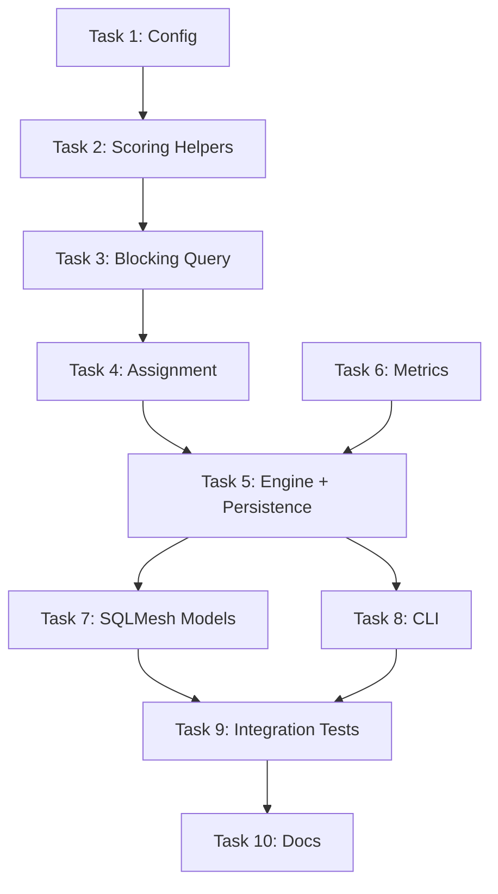

# Transfer Detection Implementation Plan

> **For agentic workers:** REQUIRED SUB-SKILL: Use superpowers:subagent-driven-development (recommended) or superpowers:executing-plans to implement this plan task-by-task. Steps use checkbox (`- [ ]`) syntax for tracking.

**Goal:** Detect and link opposite-sign transaction pairs across accounts as transfers, excluding them from spending/income totals by default.

**Architecture:** Extends the existing matching engine (Tiers 2b/3 dedup) with a Tier 4 transfer detection mode. Transfer candidates are found via SQL blocking (different accounts, opposite signs, exact amount, date window), scored on four signals (date distance, keyword presence, amount roundness, account pair frequency), assigned 1:1 greedily, and persisted to `app.match_decisions` with `match_type='transfer'`. A new `core.bridge_transfers` SQLMesh model derives confirmed pairs, and `core.fct_transactions` gains `is_transfer` / `transfer_pair_id` columns via LEFT JOIN. All proposals go through human review (no auto-confirm in v1).

**Tech Stack:** Python 3.12+, DuckDB, SQLMesh, Typer CLI, Pydantic Settings, pytest

**Spec:** `docs/specs/matching-transfer-detection.md` (pillar B of the matching umbrella)

---

## File Structure

| Action | File | Responsibility |
|--------|------|----------------|
| Create | `src/moneybin/matching/transfer.py` | `TransferCandidatePair` dataclass, transfer-specific blocking query, scoring helpers (keyword, roundness, pair frequency, combined confidence) |
| Modify | `src/moneybin/config.py:270-323` | Add `transfer_review_threshold` and `transfer_signal_weights` to `MatchingSettings` |
| Modify | `src/moneybin/matching/assignment.py` | Add `_Matchable` Protocol + TypeVar so `assign_greedy` accepts both dedup and transfer candidate types |
| Modify | `src/moneybin/matching/engine.py` | Add `pending_transfers` to `MatchResult`, `_run_transfer_tier()`, `_get_transfer_matched_ids()`, Tier 4 call in `run()` |
| Modify | `src/moneybin/matching/persistence.py` | Update `get_pending_matches` / `get_active_matches` to accept `match_type=None` for all types |
| Modify | `src/moneybin/metrics/registry.py` | Add transfer-specific metrics |
| Modify | `src/moneybin/services/import_service.py:706-725` | Update `_run_matching` to include transfer counts in messaging |
| Modify | `src/moneybin/tables.py` | Add `BRIDGE_TRANSFERS = TableRef("core", "bridge_transfers")` |
| Create | `sqlmesh/models/core/bridge_transfers.sql` | SQLMesh VIEW deriving confirmed transfer pairs from `app.match_decisions` + `int_transactions__matched` |
| Modify | `sqlmesh/models/core/fct_transactions.sql` | Add `is_transfer` and `transfer_pair_id` via LEFT JOIN to `core.bridge_transfers` |
| Modify | `src/moneybin/cli/commands/matches.py` | Add `--type` filter to review/history/run/backfill, transfer-specific review display |
| Create | `tests/moneybin/matching/test_transfer.py` | Unit tests for transfer scoring helpers and blocking query |
| Modify | `tests/moneybin/matching/test_engine.py` | Transfer tier orchestration tests |
| Modify | `tests/moneybin/matching/test_assignment.py` | Test assign_greedy with transfer candidates |
| Create | `tests/moneybin/matching/test_transfer_integration.py` | End-to-end pipeline tests |

---

### Task 1: Config — Transfer Matching Settings

**Files:**
- Modify: `src/moneybin/config.py:270-323`
- Test: `tests/moneybin/matching/test_config_matching.py`

- [ ] **Step 1: Write failing tests for transfer config fields**

```python
# tests/moneybin/matching/test_config_matching.py — append to existing file


class TestTransferSettings:
    """Tests for transfer-specific matching configuration."""

    def test_transfer_review_threshold_default(self) -> None:
        settings = MatchingSettings()
        assert settings.transfer_review_threshold == 0.70

    def test_transfer_review_threshold_custom(self) -> None:
        settings = MatchingSettings(transfer_review_threshold=0.85)
        assert settings.transfer_review_threshold == 0.85

    def test_transfer_review_threshold_bounds(self) -> None:
        with pytest.raises(ValidationError):
            MatchingSettings(transfer_review_threshold=1.5)
        with pytest.raises(ValidationError):
            MatchingSettings(transfer_review_threshold=-0.1)

    def test_transfer_signal_weights_default(self) -> None:
        settings = MatchingSettings()
        assert settings.transfer_signal_weights == {
            "date_distance": 0.4,
            "keyword": 0.3,
            "roundness": 0.15,
            "pair_frequency": 0.15,
        }

    def test_transfer_signal_weights_custom(self) -> None:
        custom = {
            "date_distance": 0.5,
            "keyword": 0.25,
            "roundness": 0.15,
            "pair_frequency": 0.1,
        }
        settings = MatchingSettings(transfer_signal_weights=custom)
        assert settings.transfer_signal_weights == custom
```

- [ ] **Step 2: Run tests to verify they fail**

Run: `uv run pytest tests/moneybin/matching/test_config_matching.py::TestTransferSettings -v`
Expected: FAIL — `transfer_review_threshold` and `transfer_signal_weights` not defined on `MatchingSettings`

- [ ] **Step 3: Add transfer fields to MatchingSettings**

In `src/moneybin/config.py`, add after the `source_priority` field (line ~304) and before the `validate_source_priority` validator:

```python
    transfer_review_threshold: float = Field(
        default=0.70,
        ge=0.0,
        le=1.0,
        description="Review queue threshold for transfer pairs",
    )
    transfer_signal_weights: dict[str, float] = Field(
        default={
            "date_distance": 0.4,
            "keyword": 0.3,
            "roundness": 0.15,
            "pair_frequency": 0.15,
        },
        description="Per-signal weights for transfer confidence scoring",
    )
```

- [ ] **Step 4: Run tests to verify they pass**

Run: `uv run pytest tests/moneybin/matching/test_config_matching.py -v`
Expected: ALL PASS

- [ ] **Step 5: Commit**

```bash
git add src/moneybin/config.py tests/moneybin/matching/test_config_matching.py
git commit -m "feat(matching): add transfer detection config fields

Add transfer_review_threshold and transfer_signal_weights to
MatchingSettings for Tier 4 transfer detection scoring.

Co-Authored-By: Claude Opus 4.6 <noreply@anthropic.com>"
```

---

### Task 2: Transfer Scoring Helpers

**Files:**
- Create: `src/moneybin/matching/transfer.py`
- Create: `tests/moneybin/matching/test_transfer.py`

- [ ] **Step 1: Write failing tests for scoring helpers**

```python
# tests/moneybin/matching/test_transfer.py
"""Tests for transfer detection scoring and blocking."""

from decimal import Decimal

import pytest

from moneybin.matching.transfer import (
    compute_amount_roundness,
    compute_keyword_score,
    compute_pair_frequency,
    compute_transfer_confidence,
)


class TestComputeKeywordScore:
    """Tests for transfer keyword detection."""

    def test_no_keywords(self) -> None:
        assert compute_keyword_score("STARBUCKS COFFEE", "GROCERY STORE") == 0.0

    def test_one_keyword(self) -> None:
        assert compute_keyword_score("ONLINE TRANSFER TO SAV", "GROCERY") == 0.5

    def test_two_keywords(self) -> None:
        assert compute_keyword_score("ACH TRANSFER", "PAYMENT") == 0.8

    def test_three_or_more_keywords(self) -> None:
        score = compute_keyword_score("ACH TRANSFER TO SAV", "WIRE FROM CHK")
        assert score == 1.0

    def test_case_insensitive(self) -> None:
        assert compute_keyword_score("transfer from checking", "deposit") == 0.5

    def test_both_descriptions_contribute(self) -> None:
        score = compute_keyword_score("TRANSFER", "ACH DEPOSIT")
        assert score >= 0.8


class TestComputeAmountRoundness:
    """Tests for amount roundness scoring."""

    def test_divisible_by_100(self) -> None:
        assert compute_amount_roundness(Decimal("500")) == 1.0
        assert compute_amount_roundness(Decimal("1000")) == 1.0

    def test_divisible_by_10(self) -> None:
        assert compute_amount_roundness(Decimal("50")) == 0.7
        assert compute_amount_roundness(Decimal("130")) == 0.7

    def test_whole_dollar(self) -> None:
        assert compute_amount_roundness(Decimal("42")) == 0.5
        assert compute_amount_roundness(Decimal("7")) == 0.5

    def test_fractional(self) -> None:
        assert compute_amount_roundness(Decimal("42.50")) == 0.3
        assert compute_amount_roundness(Decimal("99.99")) == 0.3


class TestComputePairFrequency:
    """Tests for account pair frequency scoring."""

    def test_single_pair(self) -> None:
        counts = {("acct1", "acct2"): 1}
        score = compute_pair_frequency("acct1", "acct2", counts, max_count=1)
        assert score == 1.0

    def test_frequent_pair(self) -> None:
        counts = {("acct1", "acct2"): 5, ("acct1", "acct3"): 2}
        score = compute_pair_frequency("acct1", "acct2", counts, max_count=5)
        assert score == 1.0

    def test_infrequent_pair(self) -> None:
        counts = {("acct1", "acct2"): 5, ("acct1", "acct3"): 2}
        score = compute_pair_frequency("acct1", "acct3", counts, max_count=5)
        assert score == pytest.approx(0.4)

    def test_order_independent(self) -> None:
        counts = {("acct1", "acct2"): 3}
        score_ab = compute_pair_frequency("acct1", "acct2", counts, max_count=3)
        score_ba = compute_pair_frequency("acct2", "acct1", counts, max_count=3)
        assert score_ab == score_ba

    def test_unknown_pair(self) -> None:
        counts = {("acct1", "acct2"): 3}
        score = compute_pair_frequency("acct3", "acct4", counts, max_count=3)
        assert score == 0.0


class TestComputeTransferConfidence:
    """Tests for combined transfer confidence scoring."""

    def test_perfect_signals(self) -> None:
        score = compute_transfer_confidence(
            date_distance_days=0,
            date_window_days=3,
            keyword_score=1.0,
            amount_roundness=1.0,
            pair_frequency=1.0,
        )
        assert score == pytest.approx(1.0)

    def test_zero_signals(self) -> None:
        score = compute_transfer_confidence(
            date_distance_days=3,
            date_window_days=3,
            keyword_score=0.0,
            amount_roundness=0.0,
            pair_frequency=0.0,
        )
        assert score == pytest.approx(0.0)

    def test_date_distance_impact(self) -> None:
        same_day = compute_transfer_confidence(
            date_distance_days=0,
            date_window_days=3,
            keyword_score=0.5,
            amount_roundness=0.5,
            pair_frequency=0.5,
        )
        one_day = compute_transfer_confidence(
            date_distance_days=1,
            date_window_days=3,
            keyword_score=0.5,
            amount_roundness=0.5,
            pair_frequency=0.5,
        )
        assert same_day > one_day

    def test_custom_weights(self) -> None:
        weights = {
            "date_distance": 1.0,
            "keyword": 0.0,
            "roundness": 0.0,
            "pair_frequency": 0.0,
        }
        score = compute_transfer_confidence(
            date_distance_days=0,
            date_window_days=3,
            keyword_score=1.0,
            amount_roundness=1.0,
            pair_frequency=1.0,
            weights=weights,
        )
        assert score == pytest.approx(1.0)

    def test_score_between_zero_and_one(self) -> None:
        for days in range(4):
            for kw in [0.0, 0.5, 1.0]:
                score = compute_transfer_confidence(
                    date_distance_days=days,
                    date_window_days=3,
                    keyword_score=kw,
                    amount_roundness=0.5,
                    pair_frequency=0.5,
                )
                assert 0.0 <= score <= 1.0
```

- [ ] **Step 2: Run tests to verify they fail**

Run: `uv run pytest tests/moneybin/matching/test_transfer.py -v`
Expected: FAIL — `moneybin.matching.transfer` module not found

- [ ] **Step 3: Create transfer.py with scoring helpers**

```python
# src/moneybin/matching/transfer.py
"""Transfer detection: candidate blocking and confidence scoring.

Tier 4 of the matching pipeline. Finds transactions from different accounts
with opposite signs and the same absolute amount, scores them on four signals,
and returns scored candidate pairs for 1:1 assignment.
"""

import logging
from dataclasses import dataclass
from decimal import Decimal
from typing import Any

from moneybin.database import Database

logger = logging.getLogger(__name__)

UNIONED_TABLE = "prep.int_transactions__unioned"

_TRANSFER_KEYWORDS = frozenset({
    "TRANSFER",
    "XFER",
    "ACH",
    "DIRECT DEP",
    "WIRE",
    "ONLINE TRANSFER",
    "MOBILE TRANSFER",
    "INTERNAL TRANSFER",
    "FROM CHK",
    "FROM SAV",
    "TO CHK",
    "TO SAV",
    "FROM CHECKING",
    "FROM SAVINGS",
    "TO CHECKING",
    "TO SAVINGS",
})

_DEFAULT_WEIGHTS: dict[str, float] = {
    "date_distance": 0.4,
    "keyword": 0.3,
    "roundness": 0.15,
    "pair_frequency": 0.15,
}


@dataclass(frozen=True)
class TransferCandidatePair:
    """A scored transfer candidate pair from blocking + scoring."""

    source_transaction_id_a: str
    source_type_a: str
    source_origin_a: str
    account_id_a: str
    source_transaction_id_b: str
    source_type_b: str
    source_origin_b: str
    account_id_b: str
    amount: Decimal
    date_distance_days: int
    description_a: str
    description_b: str
    date_distance_score: float
    keyword_score: float
    amount_roundness_score: float
    pair_frequency_score: float
    confidence_score: float


def compute_keyword_score(desc_a: str, desc_b: str) -> float:
    """Score based on transfer-indicating keywords in either description."""
    combined = f"{desc_a} {desc_b}".upper()
    matches = sum(1 for kw in _TRANSFER_KEYWORDS if kw in combined)
    if matches >= 3:
        return 1.0
    if matches >= 2:
        return 0.8
    if matches >= 1:
        return 0.5
    return 0.0


def compute_amount_roundness(amount: Decimal) -> float:
    """Score based on how round the transfer amount is."""
    abs_amount = abs(amount)
    if abs_amount % 100 == 0:
        return 1.0
    if abs_amount % 10 == 0:
        return 0.7
    if abs_amount % 1 == 0:
        return 0.5
    return 0.3


def compute_pair_frequency(
    account_id_a: str,
    account_id_b: str,
    pair_counts: dict[tuple[str, str], int],
    max_count: int,
) -> float:
    """Score based on how often this account pair appears in the batch."""
    key = tuple(sorted([account_id_a, account_id_b]))
    count = pair_counts.get(key, 0)
    return min(1.0, count / max(max_count, 1))


def compute_transfer_confidence(
    *,
    date_distance_days: int,
    date_window_days: int,
    keyword_score: float,
    amount_roundness: float,
    pair_frequency: float,
    weights: dict[str, float] | None = None,
) -> float:
    """Compute transfer confidence from four weighted signals."""
    w = weights or _DEFAULT_WEIGHTS
    date_score = (
        max(0.0, 1.0 - (date_distance_days / date_window_days))
        if date_window_days > 0
        else 1.0
    )
    return (
        w["date_distance"] * date_score
        + w["keyword"] * keyword_score
        + w["roundness"] * amount_roundness
        + w["pair_frequency"] * pair_frequency
    )
```

Note: the `get_candidates_transfers` blocking function is added in Task 3.

- [ ] **Step 4: Run tests to verify they pass**

Run: `uv run pytest tests/moneybin/matching/test_transfer.py -v`
Expected: ALL PASS

- [ ] **Step 5: Run format + lint**

Run: `make format && make lint`
Expected: Clean

- [ ] **Step 6: Commit**

```bash
git add src/moneybin/matching/transfer.py tests/moneybin/matching/test_transfer.py
git commit -m "feat(matching): add transfer scoring helpers

Implement keyword detection, amount roundness, pair frequency, and
combined confidence scoring for transfer candidate pairs.

Co-Authored-By: Claude Opus 4.6 <noreply@anthropic.com>"
```

---

### Task 3: Transfer Blocking Query

**Files:**
- Modify: `src/moneybin/matching/transfer.py`
- Modify: `tests/moneybin/matching/test_transfer.py`

- [ ] **Step 1: Write failing tests for blocking query**

Append to `tests/moneybin/matching/test_transfer.py`:

```python
from collections.abc import Generator
from pathlib import Path
from unittest.mock import MagicMock

from moneybin.database import Database
from moneybin.matching.transfer import (
    TransferCandidatePair,
    get_candidates_transfers,
)


@pytest.fixture()
def db(tmp_path: Path, mock_secret_store: MagicMock) -> Generator[Database, None, None]:
    """Provide a fresh test database for transfer tests."""
    database = Database(
        tmp_path / "test.duckdb",
        secret_store=mock_secret_store,
        no_auto_upgrade=True,
    )
    yield database
    database.close()


def _insert_transfer_row(
    db: Database,
    *,
    source_transaction_id: str,
    account_id: str,
    transaction_date: str,
    amount: str,
    description: str,
    source_type: str = "csv",
    source_origin: str = "bank",
    source_file: str = "test.csv",
) -> None:
    db.execute(
        """
        INSERT INTO _test_unioned (
            source_transaction_id, account_id, transaction_date, amount,
            description, source_type, source_origin, source_file
        ) VALUES (?, ?, ?::DATE, ?::DECIMAL(18,2), ?, ?, ?, ?)
        """,
        [
            source_transaction_id,
            account_id,
            transaction_date,
            amount,
            description,
            source_type,
            source_origin,
            source_file,
        ],
    )


@pytest.fixture()
def transfer_table(db: Database) -> Database:
    """Create a minimal unioned-style table for transfer blocking tests."""
    db.execute("""
        CREATE TABLE _test_unioned (
            source_transaction_id VARCHAR,
            account_id VARCHAR,
            transaction_date DATE,
            amount DECIMAL(18, 2),
            description VARCHAR,
            source_type VARCHAR,
            source_origin VARCHAR,
            source_file VARCHAR
        )
    """)
    return db


class TestGetCandidatesTransfers:
    """Tests for transfer candidate blocking query."""

    def test_finds_opposite_sign_pair(self, transfer_table: Database) -> None:
        _insert_transfer_row(
            transfer_table,
            source_transaction_id="csv_chk1",
            account_id="checking",
            transaction_date="2026-03-15",
            amount="-500.00",
            description="ONLINE TRANSFER TO SAV",
        )
        _insert_transfer_row(
            transfer_table,
            source_transaction_id="csv_sav1",
            account_id="savings",
            transaction_date="2026-03-15",
            amount="500.00",
            description="TRANSFER FROM CHK",
        )
        candidates = get_candidates_transfers(
            transfer_table, table="main._test_unioned", date_window_days=3
        )
        assert len(candidates) == 1
        pair = candidates[0]
        assert isinstance(pair, TransferCandidatePair)
        assert pair.account_id_a == "checking"
        assert pair.account_id_b == "savings"
        assert pair.amount == Decimal("500.00")
        assert pair.date_distance_days == 0

    def test_excludes_same_account(self, transfer_table: Database) -> None:
        _insert_transfer_row(
            transfer_table,
            source_transaction_id="a",
            account_id="checking",
            transaction_date="2026-03-15",
            amount="-500.00",
            description="REFUND",
        )
        _insert_transfer_row(
            transfer_table,
            source_transaction_id="b",
            account_id="checking",
            transaction_date="2026-03-15",
            amount="500.00",
            description="DEPOSIT",
        )
        candidates = get_candidates_transfers(
            transfer_table, table="main._test_unioned", date_window_days=3
        )
        assert len(candidates) == 0

    def test_excludes_same_sign(self, transfer_table: Database) -> None:
        _insert_transfer_row(
            transfer_table,
            source_transaction_id="a",
            account_id="checking",
            transaction_date="2026-03-15",
            amount="-500.00",
            description="PAYMENT",
        )
        _insert_transfer_row(
            transfer_table,
            source_transaction_id="b",
            account_id="savings",
            transaction_date="2026-03-15",
            amount="-500.00",
            description="PAYMENT",
        )
        candidates = get_candidates_transfers(
            transfer_table, table="main._test_unioned", date_window_days=3
        )
        assert len(candidates) == 0

    def test_excludes_different_amount(self, transfer_table: Database) -> None:
        _insert_transfer_row(
            transfer_table,
            source_transaction_id="a",
            account_id="checking",
            transaction_date="2026-03-15",
            amount="-500.00",
            description="TRANSFER",
        )
        _insert_transfer_row(
            transfer_table,
            source_transaction_id="b",
            account_id="savings",
            transaction_date="2026-03-15",
            amount="501.00",
            description="TRANSFER",
        )
        candidates = get_candidates_transfers(
            transfer_table, table="main._test_unioned", date_window_days=3
        )
        assert len(candidates) == 0

    def test_excludes_outside_date_window(self, transfer_table: Database) -> None:
        _insert_transfer_row(
            transfer_table,
            source_transaction_id="a",
            account_id="checking",
            transaction_date="2026-03-10",
            amount="-500.00",
            description="TRANSFER",
        )
        _insert_transfer_row(
            transfer_table,
            source_transaction_id="b",
            account_id="savings",
            transaction_date="2026-03-15",
            amount="500.00",
            description="TRANSFER",
        )
        candidates = get_candidates_transfers(
            transfer_table, table="main._test_unioned", date_window_days=3
        )
        assert len(candidates) == 0

    def test_respects_excluded_ids(self, transfer_table: Database) -> None:
        _insert_transfer_row(
            transfer_table,
            source_transaction_id="csv_chk1",
            account_id="checking",
            transaction_date="2026-03-15",
            amount="-500.00",
            description="TRANSFER",
        )
        _insert_transfer_row(
            transfer_table,
            source_transaction_id="csv_sav1",
            account_id="savings",
            transaction_date="2026-03-15",
            amount="500.00",
            description="TRANSFER",
        )
        candidates = get_candidates_transfers(
            transfer_table,
            table="main._test_unioned",
            date_window_days=3,
            excluded_ids={("csv_chk1", "checking")},
        )
        assert len(candidates) == 0

    def test_respects_rejected_pairs(self, transfer_table: Database) -> None:
        _insert_transfer_row(
            transfer_table,
            source_transaction_id="csv_chk1",
            account_id="checking",
            transaction_date="2026-03-15",
            amount="-500.00",
            description="TRANSFER",
        )
        _insert_transfer_row(
            transfer_table,
            source_transaction_id="csv_sav1",
            account_id="savings",
            transaction_date="2026-03-15",
            amount="500.00",
            description="TRANSFER",
        )
        rejected = [
            {
                "source_type_a": "csv",
                "source_transaction_id_a": "csv_chk1",
                "source_origin_a": "bank",
                "source_type_b": "csv",
                "source_transaction_id_b": "csv_sav1",
                "source_origin_b": "bank",
                "account_id": "checking",
            }
        ]
        candidates = get_candidates_transfers(
            transfer_table,
            table="main._test_unioned",
            date_window_days=3,
            rejected_pairs=rejected,
        )
        assert len(candidates) == 0

    def test_scores_all_four_signals(self, transfer_table: Database) -> None:
        _insert_transfer_row(
            transfer_table,
            source_transaction_id="csv_chk1",
            account_id="checking",
            transaction_date="2026-03-15",
            amount="-500.00",
            description="ONLINE TRANSFER TO SAV",
        )
        _insert_transfer_row(
            transfer_table,
            source_transaction_id="csv_sav1",
            account_id="savings",
            transaction_date="2026-03-15",
            amount="500.00",
            description="TRANSFER FROM CHK",
        )
        candidates = get_candidates_transfers(
            transfer_table, table="main._test_unioned", date_window_days=3
        )
        assert len(candidates) == 1
        pair = candidates[0]
        assert pair.date_distance_score == 1.0
        assert pair.keyword_score > 0.0
        assert pair.amount_roundness_score == 1.0
        assert pair.pair_frequency_score > 0.0
        assert 0.0 < pair.confidence_score <= 1.0

    def test_debit_side_is_a_credit_side_is_b(self, transfer_table: Database) -> None:
        """Verify the debit (negative) transaction is always side A."""
        _insert_transfer_row(
            transfer_table,
            source_transaction_id="csv_sav1",
            account_id="savings",
            transaction_date="2026-03-15",
            amount="500.00",
            description="TRANSFER FROM CHK",
        )
        _insert_transfer_row(
            transfer_table,
            source_transaction_id="csv_chk1",
            account_id="checking",
            transaction_date="2026-03-15",
            amount="-500.00",
            description="ONLINE TRANSFER TO SAV",
        )
        candidates = get_candidates_transfers(
            transfer_table, table="main._test_unioned", date_window_days=3
        )
        assert len(candidates) == 1
        pair = candidates[0]
        assert pair.source_transaction_id_a == "csv_chk1"
        assert pair.source_transaction_id_b == "csv_sav1"

    def test_near_boundary_date(self, transfer_table: Database) -> None:
        """Pair exactly at date_window_days boundary is included."""
        _insert_transfer_row(
            transfer_table,
            source_transaction_id="a",
            account_id="checking",
            transaction_date="2026-03-12",
            amount="-500.00",
            description="TRANSFER",
        )
        _insert_transfer_row(
            transfer_table,
            source_transaction_id="b",
            account_id="savings",
            transaction_date="2026-03-15",
            amount="500.00",
            description="TRANSFER",
        )
        candidates = get_candidates_transfers(
            transfer_table, table="main._test_unioned", date_window_days=3
        )
        assert len(candidates) == 1
        assert candidates[0].date_distance_days == 3
```

- [ ] **Step 2: Run tests to verify they fail**

Run: `uv run pytest tests/moneybin/matching/test_transfer.py::TestGetCandidatesTransfers -v`
Expected: FAIL — `get_candidates_transfers` not importable

- [ ] **Step 3: Implement the blocking query**

Append to `src/moneybin/matching/transfer.py`:

```python
def get_candidates_transfers(
    db: Database,
    *,
    table: str = UNIONED_TABLE,
    date_window_days: int = 3,
    excluded_ids: set[tuple[str, str]] | None = None,
    rejected_pairs: list[dict[str, Any]] | None = None,
    signal_weights: dict[str, float] | None = None,
) -> list[TransferCandidatePair]:
    """Find transfer candidate pairs (Tier 4).

    Blocking: different accounts, opposite signs, exact absolute amount,
    date within window. Side A is always the debit (negative amount).
    """
    from sqlglot import exp

    parts = table.split(".")
    if len(parts) != 2:
        raise ValueError(f"table must be schema.name, got: {table!r}")
    safe_schema = exp.to_identifier(parts[0], quoted=True).sql("duckdb")
    safe_table = exp.to_identifier(parts[1], quoted=True).sql("duckdb")
    safe_ref = f"{safe_schema}.{safe_table}"

    query = f"""
        SELECT
            a.source_transaction_id AS stid_a,
            a.source_type AS st_a,
            a.source_origin AS so_a,
            a.account_id AS acct_a,
            a.description AS desc_a,
            a.amount AS amount_a,
            b.source_transaction_id AS stid_b,
            b.source_type AS st_b,
            b.source_origin AS so_b,
            b.account_id AS acct_b,
            b.description AS desc_b,
            b.amount AS amount_b,
            ABS(DATEDIFF('day', a.transaction_date, b.transaction_date)) AS date_dist
        FROM {safe_ref} AS a
        JOIN {safe_ref} AS b
            ON a.account_id != b.account_id
            AND a.amount < 0
            AND b.amount > 0
            AND ABS(a.amount) = b.amount
            AND ABS(DATEDIFF('day', a.transaction_date, b.transaction_date)) <= ?
        ORDER BY date_dist ASC
    """  # noqa: S608 — table name validated above; date_window_days is parameterized

    rows = db.execute(query, [date_window_days]).fetchall()

    rejected_set: set[tuple[str, ...]] = set()
    if rejected_pairs:
        for rp in rejected_pairs:
            rejected_set.add((
                rp["source_type_a"],
                rp["source_transaction_id_a"],
                rp["source_type_b"],
                rp["source_transaction_id_b"],
            ))
            rejected_set.add((
                rp["source_type_b"],
                rp["source_transaction_id_b"],
                rp["source_type_a"],
                rp["source_transaction_id_a"],
            ))

    raw_pairs: list[tuple[Any, ...]] = []
    pair_counts: dict[tuple[str, str], int] = {}

    for row in rows:
        (
            stid_a,
            st_a,
            so_a,
            acct_a,
            desc_a,
            amount_a,
            stid_b,
            st_b,
            so_b,
            acct_b,
            desc_b,
            amount_b,
            date_dist,
        ) = row

        if excluded_ids and (
            (stid_a, acct_a) in excluded_ids or (stid_b, acct_b) in excluded_ids
        ):
            continue

        if (st_a, stid_a, st_b, stid_b) in rejected_set:
            continue

        raw_pairs.append(row)
        freq_key = tuple(sorted([acct_a, acct_b]))
        pair_counts[freq_key] = pair_counts.get(freq_key, 0) + 1

    max_count = max(pair_counts.values()) if pair_counts else 1

    results: list[TransferCandidatePair] = []
    for row in raw_pairs:
        (
            stid_a,
            st_a,
            so_a,
            acct_a,
            desc_a,
            amount_a,
            stid_b,
            st_b,
            so_b,
            acct_b,
            desc_b,
            amount_b,
            date_dist,
        ) = row

        abs_amount = abs(Decimal(str(amount_a)))
        kw_score = compute_keyword_score(desc_a or "", desc_b or "")
        roundness = compute_amount_roundness(abs_amount)
        pair_freq = compute_pair_frequency(acct_a, acct_b, pair_counts, max_count)
        date_dist_int = int(date_dist)
        date_score = (
            max(0.0, 1.0 - (date_dist_int / date_window_days))
            if date_window_days > 0
            else 1.0
        )
        confidence = compute_transfer_confidence(
            date_distance_days=date_dist_int,
            date_window_days=date_window_days,
            keyword_score=kw_score,
            amount_roundness=roundness,
            pair_frequency=pair_freq,
            weights=signal_weights,
        )

        results.append(
            TransferCandidatePair(
                source_transaction_id_a=stid_a,
                source_type_a=st_a,
                source_origin_a=so_a,
                account_id_a=acct_a,
                source_transaction_id_b=stid_b,
                source_type_b=st_b,
                source_origin_b=so_b,
                account_id_b=acct_b,
                amount=abs_amount,
                date_distance_days=date_dist_int,
                description_a=desc_a or "",
                description_b=desc_b or "",
                date_distance_score=date_score,
                keyword_score=kw_score,
                amount_roundness_score=roundness,
                pair_frequency_score=pair_freq,
                confidence_score=confidence,
            )
        )

    return results
```

- [ ] **Step 4: Run tests to verify they pass**

Run: `uv run pytest tests/moneybin/matching/test_transfer.py -v`
Expected: ALL PASS

- [ ] **Step 5: Run format + lint**

Run: `make format && make lint`

- [ ] **Step 6: Commit**

```bash
git add src/moneybin/matching/transfer.py tests/moneybin/matching/test_transfer.py
git commit -m "feat(matching): add transfer blocking query

Implement SQL blocking and multi-signal scoring for transfer candidate
pairs. Enforces opposite signs, exact amount, different accounts, and
date window constraints.

Co-Authored-By: Claude Opus 4.6 <noreply@anthropic.com>"
```

---

### Task 4: Assignment Generalization

**Files:**
- Modify: `src/moneybin/matching/assignment.py`
- Modify: `tests/moneybin/matching/test_assignment.py`

- [ ] **Step 1: Write test for transfer candidates through assign_greedy**

Append to `tests/moneybin/matching/test_assignment.py`:

```python
from decimal import Decimal

from moneybin.matching.transfer import TransferCandidatePair


class TestAssignGreedyTransfers:
    """Tests for assign_greedy with transfer candidate pairs."""

    def test_assigns_best_transfer_pair(self) -> None:
        candidates = [
            TransferCandidatePair(
                source_transaction_id_a="chk_1",
                source_type_a="csv",
                source_origin_a="chase",
                account_id_a="checking",
                source_transaction_id_b="sav_1",
                source_type_b="csv",
                source_origin_b="chase",
                account_id_b="savings",
                amount=Decimal("500.00"),
                date_distance_days=0,
                description_a="TRANSFER",
                description_b="TRANSFER",
                date_distance_score=1.0,
                keyword_score=0.5,
                amount_roundness_score=1.0,
                pair_frequency_score=1.0,
                confidence_score=0.90,
            ),
            TransferCandidatePair(
                source_transaction_id_a="chk_1",
                source_type_a="csv",
                source_origin_a="chase",
                account_id_a="checking",
                source_transaction_id_b="brk_1",
                source_type_b="csv",
                source_origin_b="chase",
                account_id_b="brokerage",
                amount=Decimal("500.00"),
                date_distance_days=1,
                description_a="TRANSFER",
                description_b="DEPOSIT",
                date_distance_score=0.67,
                keyword_score=0.5,
                amount_roundness_score=1.0,
                pair_frequency_score=0.5,
                confidence_score=0.70,
            ),
        ]
        assigned = assign_greedy(candidates)
        assert len(assigned) == 1
        assert assigned[0].confidence_score == 0.90
        assert assigned[0].account_id_b == "savings"

    def test_one_to_one_enforcement(self) -> None:
        """Each transaction participates in at most one transfer pair."""
        candidates = [
            TransferCandidatePair(
                source_transaction_id_a="chk_1",
                source_type_a="csv",
                source_origin_a="chase",
                account_id_a="checking",
                source_transaction_id_b="sav_1",
                source_type_b="csv",
                source_origin_b="chase",
                account_id_b="savings",
                amount=Decimal("500.00"),
                date_distance_days=0,
                description_a="TRANSFER",
                description_b="TRANSFER",
                date_distance_score=1.0,
                keyword_score=1.0,
                amount_roundness_score=1.0,
                pair_frequency_score=1.0,
                confidence_score=0.95,
            ),
            TransferCandidatePair(
                source_transaction_id_a="chk_2",
                source_type_a="csv",
                source_origin_a="chase",
                account_id_a="checking",
                source_transaction_id_b="sav_1",
                source_type_b="csv",
                source_origin_b="chase",
                account_id_b="savings",
                amount=Decimal("500.00"),
                date_distance_days=1,
                description_a="TRANSFER",
                description_b="TRANSFER",
                date_distance_score=0.67,
                keyword_score=1.0,
                amount_roundness_score=1.0,
                pair_frequency_score=1.0,
                confidence_score=0.85,
            ),
        ]
        assigned = assign_greedy(candidates)
        assert len(assigned) == 1
        assert assigned[0].source_transaction_id_a == "chk_1"
```

- [ ] **Step 2: Run test to verify it fails (type error)**

Run: `uv run pytest tests/moneybin/matching/test_assignment.py::TestAssignGreedyTransfers -v`
Expected: FAIL or type error — `assign_greedy` only accepts `list[CandidatePair]`

- [ ] **Step 3: Add Protocol and TypeVar to assignment.py**

Replace the entire `src/moneybin/matching/assignment.py`:

```python
"""Greedy best-score-first 1:1 bipartite assignment.

When multiple candidates compete for the same source row, the highest-
scoring pair wins. Both rows in a winning pair are marked as "claimed"
and cannot participate in further assignments.
"""

from typing import Protocol, TypeVar


class _Matchable(Protocol):
    """Structural interface for candidate pairs (dedup or transfer)."""

    @property
    def source_type_a(self) -> str: ...
    @property
    def source_transaction_id_a(self) -> str: ...
    @property
    def source_type_b(self) -> str: ...
    @property
    def source_transaction_id_b(self) -> str: ...
    @property
    def confidence_score(self) -> float: ...


T = TypeVar("T", bound=_Matchable)


def assign_greedy(candidates: list[T]) -> list[T]:
    """Assign candidate pairs using greedy best-score-first.

    Args:
        candidates: Scored candidate pairs (any order).

    Returns:
        Non-overlapping subset of pairs, highest scores first.
    """
    sorted_candidates = sorted(
        candidates, key=lambda c: c.confidence_score, reverse=True
    )
    claimed: set[str] = set()
    assigned: list[T] = []

    for pair in sorted_candidates:
        key_a = f"{pair.source_type_a}|{pair.source_transaction_id_a}"
        key_b = f"{pair.source_type_b}|{pair.source_transaction_id_b}"
        if key_a not in claimed and key_b not in claimed:
            claimed.add(key_a)
            claimed.add(key_b)
            assigned.append(pair)

    return assigned
```

- [ ] **Step 4: Run all assignment tests**

Run: `uv run pytest tests/moneybin/matching/test_assignment.py -v`
Expected: ALL PASS (existing dedup tests + new transfer tests)

- [ ] **Step 5: Run type check**

Run: `uv run pyright src/moneybin/matching/assignment.py`
Expected: Clean

- [ ] **Step 6: Commit**

```bash
git add src/moneybin/matching/assignment.py tests/moneybin/matching/test_assignment.py
git commit -m "feat(matching): generalize assign_greedy for transfer pairs

Add _Matchable Protocol so assign_greedy accepts both CandidatePair
and TransferCandidatePair via structural subtyping.

Co-Authored-By: Claude Opus 4.6 <noreply@anthropic.com>"
```

---

### Task 5: Engine — Transfer Tier + Persistence Updates

**Files:**
- Modify: `src/moneybin/matching/engine.py`
- Modify: `src/moneybin/matching/persistence.py`
- Modify: `src/moneybin/services/import_service.py:706-725`
- Modify: `tests/moneybin/matching/test_engine.py`

- [ ] **Step 1: Write failing tests for transfer tier**

Append to `tests/moneybin/matching/test_engine.py`:

```python
class TestTransferDetection:
    """Tests for Tier 4 transfer detection."""

    def test_transfer_pair_goes_to_review(self, db: Database) -> None:
        _create_test_table(db)
        _insert(
            db,
            "csv_chk1",
            "checking",
            "2026-03-15",
            "-500.00",
            "ONLINE TRANSFER TO SAV",
            "csv",
            "chase",
        )
        _insert(
            db,
            "csv_sav1",
            "savings",
            "2026-03-15",
            "500.00",
            "TRANSFER FROM CHK",
            "csv",
            "chase",
        )
        settings = MatchingSettings()
        matcher = TransactionMatcher(db, settings, table="main._test_unioned")
        result = matcher.run()
        assert result.pending_transfers >= 1
        assert result.auto_merged == 0

    def test_no_auto_merge_for_transfers(self, db: Database) -> None:
        """Transfers are always-review in v1, even with perfect scores."""
        _create_test_table(db)
        _insert(
            db,
            "csv_chk1",
            "checking",
            "2026-03-15",
            "-500.00",
            "TRANSFER TO SAV",
            "csv",
            "chase",
        )
        _insert(
            db,
            "csv_sav1",
            "savings",
            "2026-03-15",
            "500.00",
            "TRANSFER FROM CHK",
            "csv",
            "chase",
        )
        settings = MatchingSettings(transfer_review_threshold=0.0)
        matcher = TransactionMatcher(db, settings, table="main._test_unioned")
        result = matcher.run()
        assert result.auto_merged == 0
        assert result.pending_transfers >= 1

    def test_dedup_then_transfer_sequencing(self, db: Database) -> None:
        """Dedup runs first; deduped transactions then match as transfers."""
        _create_test_table(db)
        # Two sources of the same checking debit (dedup candidates)
        _insert(
            db,
            "csv_chk1",
            "checking",
            "2026-03-15",
            "-500.00",
            "ONLINE TRANSFER TO SAV",
            "csv",
            "chase",
        )
        _insert(
            db,
            "ofx_chk1",
            "checking",
            "2026-03-15",
            "-500.00",
            "ONLINE TRANSFER TO SAV",
            "ofx",
            "chase_ofx",
        )
        # The credit side
        _insert(
            db,
            "csv_sav1",
            "savings",
            "2026-03-15",
            "500.00",
            "TRANSFER FROM CHK",
            "csv",
            "chase",
        )
        settings = MatchingSettings()
        matcher = TransactionMatcher(db, settings, table="main._test_unioned")
        result = matcher.run()
        # Dedup should merge the two checking records
        assert result.auto_merged == 1
        # Transfer should find the checking->savings pair
        assert result.pending_transfers >= 1

    def test_rejected_transfer_not_reproposed(self, db: Database) -> None:
        _create_test_table(db)
        _insert(
            db,
            "csv_chk1",
            "checking",
            "2026-03-15",
            "-500.00",
            "TRANSFER",
            "csv",
            "chase",
        )
        _insert(
            db,
            "csv_sav1",
            "savings",
            "2026-03-15",
            "500.00",
            "TRANSFER",
            "csv",
            "chase",
        )
        settings = MatchingSettings()
        matcher = TransactionMatcher(db, settings, table="main._test_unioned")

        # First run: transfer proposed
        result1 = matcher.run()
        assert result1.pending_transfers >= 1

        # Reject the transfer
        from moneybin.matching.persistence import (
            get_pending_matches,
            update_match_status,
        )

        pending = get_pending_matches(db, match_type="transfer")
        for m in pending:
            update_match_status(db, m["match_id"], status="rejected", decided_by="user")

        # Second run: should not re-propose
        result2 = matcher.run()
        assert result2.pending_transfers == 0

    def test_match_result_includes_transfers(self) -> None:
        result = MatchResult(auto_merged=3, pending_review=1, pending_transfers=2)
        summary = result.summary()
        assert "3 auto-merged" in summary
        assert "1 pending review" in summary
        assert "2 potential transfers" in summary

    def test_one_sided_transfer_no_match(self, db: Database) -> None:
        """Only one side imported — no transfer pair proposed."""
        _create_test_table(db)
        _insert(
            db,
            "csv_chk1",
            "checking",
            "2026-03-15",
            "-500.00",
            "TRANSFER",
            "csv",
            "chase",
        )
        settings = MatchingSettings()
        matcher = TransactionMatcher(db, settings, table="main._test_unioned")
        result = matcher.run()
        assert result.pending_transfers == 0
```

- [ ] **Step 2: Run tests to verify they fail**

Run: `uv run pytest tests/moneybin/matching/test_engine.py::TestTransferDetection -v`
Expected: FAIL — `pending_transfers` not on `MatchResult`

- [ ] **Step 3: Update persistence.py — make get_pending_matches/get_active_matches accept None**

In `src/moneybin/matching/persistence.py`, update `get_pending_matches` (lines 94-109):

```python
def get_pending_matches(
    db: Database, match_type: str | None = None
) -> list[dict[str, Any]]:
    """Return pending match decisions awaiting user review.

    Args:
        db: Database instance.
        match_type: Filter by type ('dedup', 'transfer'), or None for all.
    """
    where = "WHERE match_status = 'pending' AND reversed_at IS NULL"
    params: list[Any] = []
    if match_type:
        if match_type not in _VALID_MATCH_TYPES:
            raise ValueError(f"Invalid match_type: {match_type!r}")
        where += " AND match_type = ?"
        params.append(match_type)
    rows = db.execute(
        f"""
        SELECT * FROM app.match_decisions
        {where}
        ORDER BY confidence_score DESC
        """,  # noqa: S608 — match_type validated above
        params,
    ).fetchall()
    cols = _columns(db)
    return [dict(zip(cols, row, strict=True)) for row in rows]
```

Update `get_active_matches` (lines 78-91) similarly:

```python
def get_active_matches(
    db: Database, match_type: str | None = None
) -> list[dict[str, Any]]:
    """Return accepted, non-reversed match decisions."""
    where = "WHERE match_status = 'accepted' AND reversed_at IS NULL"
    params: list[Any] = []
    if match_type:
        if match_type not in _VALID_MATCH_TYPES:
            raise ValueError(f"Invalid match_type: {match_type!r}")
        where += " AND match_type = ?"
        params.append(match_type)
    rows = db.execute(
        f"""
        SELECT * FROM app.match_decisions
        {where}
        ORDER BY decided_at DESC
        """,  # noqa: S608 — match_type validated above
        params,
    ).fetchall()
    cols = _columns(db)
    return [dict(zip(cols, row, strict=True)) for row in rows]
```

- [ ] **Step 4: Update engine.py — add pending_transfers, transfer tier, transfer matched IDs**

In `src/moneybin/matching/engine.py`, make these changes:

**4a. Update imports** (add transfer imports, transfer metrics):

```python
from moneybin.matching.transfer import (
    TransferCandidatePair,
    get_candidates_transfers,
)
from moneybin.metrics.registry import (
    DEDUP_MATCH_CONFIDENCE,
    DEDUP_MATCHES_TOTAL,
    DEDUP_PAIRS_SCORED,
    DEDUP_REVIEW_PENDING,
    TRANSFER_MATCH_CONFIDENCE,
    TRANSFER_MATCHES_PROPOSED,
    TRANSFER_PAIRS_SCORED,
)
```

**4b. Add `pending_transfers` to `MatchResult`:**

```python
@dataclass
class MatchResult:
    """Summary of a matching run."""

    auto_merged: int = 0
    pending_review: int = 0
    pending_transfers: int = 0

    def summary(self) -> str:
        """Return a human-readable summary of the matching run."""
        parts: list[str] = []
        if self.auto_merged:
            parts.append(f"{self.auto_merged} auto-merged")
        if self.pending_review:
            parts.append(f"{self.pending_review} pending review")
        if self.pending_transfers:
            parts.append(f"{self.pending_transfers} potential transfers")
        if not parts:
            return "No new matches found"
        return ", ".join(parts)
```

**4c. Add `_get_transfer_matched_ids` method to `TransactionMatcher`:**

```python
    def _get_transfer_matched_ids(self) -> set[tuple[str, str]]:
        """Get (source_transaction_id, account_id) tuples in active/pending transfer matches."""
        rows = self._db.execute(
            """
            SELECT source_transaction_id_a, account_id,
                   source_transaction_id_b, account_id_b
            FROM app.match_decisions
            WHERE match_status IN ('accepted', 'pending')
              AND reversed_at IS NULL
              AND match_type = 'transfer'
            """
        ).fetchall()
        ids: set[tuple[str, str]] = set()
        for row in rows:
            ids.add((row[0], row[1]))
            ids.add((row[2], row[3]))
        return ids
```

**4d. Add `_run_transfer_tier` method:**

```python
    def _run_transfer_tier(
        self,
        *,
        excluded_ids: set[tuple[str, str]],
        rejected_pairs: list[dict[str, Any]],
        result: MatchResult,
    ) -> None:
        """Run transfer detection (Tier 4): blocking -> scoring -> assignment -> persist."""
        candidates = get_candidates_transfers(
            self._db,
            table=self._table,
            date_window_days=self._settings.date_window_days,
            excluded_ids=excluded_ids,
            rejected_pairs=rejected_pairs,
            signal_weights=self._settings.transfer_signal_weights,
        )
        TRANSFER_PAIRS_SCORED.inc(len(candidates))

        if not candidates:
            return

        assigned = assign_greedy(candidates)
        tier_pending = 0

        for pair in assigned:
            TRANSFER_MATCH_CONFIDENCE.observe(pair.confidence_score)

            if pair.confidence_score < self._settings.transfer_review_threshold:
                logger.debug(
                    f"Transfer below threshold ({pair.confidence_score:.2f}): "
                    f"{pair.account_id_a[:8]} -> {pair.account_id_b[:8]}"
                )
                continue

            match_id = uuid.uuid4().hex[:12]
            create_match_decision(
                self._db,
                match_id=match_id,
                source_transaction_id_a=pair.source_transaction_id_a,
                source_type_a=pair.source_type_a,
                source_origin_a=pair.source_origin_a,
                source_transaction_id_b=pair.source_transaction_id_b,
                source_type_b=pair.source_type_b,
                source_origin_b=pair.source_origin_b,
                account_id=pair.account_id_a,
                account_id_b=pair.account_id_b,
                confidence_score=pair.confidence_score,
                match_signals={
                    "date_distance": round(pair.date_distance_score, 4),
                    "keyword": round(pair.keyword_score, 4),
                    "roundness": round(pair.amount_roundness_score, 4),
                    "pair_frequency": round(pair.pair_frequency_score, 4),
                },
                match_type="transfer",
                match_tier=None,
                match_status="pending",
                decided_by="auto",
                match_reason=(
                    f"Transfer: {pair.account_id_a[:8]} -> {pair.account_id_b[:8]}, "
                    f"${pair.amount}, {pair.date_distance_days}d apart"
                ),
            )

            result.pending_transfers += 1
            tier_pending += 1
            TRANSFER_MATCHES_PROPOSED.inc()

        if tier_pending:
            logger.info(f"Tier 4: {tier_pending} potential transfers found")
```

**4e. Update `run()` to include Tier 4:**

After the Tier 3 block (line ~103), add:

```python
        # Tier 4: transfer detection (runs after dedup)
        already_matched.update(self._get_transfer_matched_ids())
        rejected_transfer = get_rejected_pairs(self._db, match_type="transfer")

        self._run_transfer_tier(
            excluded_ids=already_matched,
            rejected_pairs=rejected_transfer,
            result=result,
        )

        return result
```

Also add import for `Any` at top of file:

```python
from typing import Any
```

- [ ] **Step 5: Update import_service.py to include transfer counts**

In `src/moneybin/services/import_service.py`, update the `_run_matching` function (lines 706-725):

```python
def _run_matching(db: Database) -> None:
    """Run transaction matching after import.

    Seeds source priority from config and runs the matcher engine.
    Results are logged; pending matches prompt user action.
    """
    from moneybin.config import get_settings
    from moneybin.matching.engine import TransactionMatcher
    from moneybin.matching.priority import seed_source_priority

    settings = get_settings().matching
    seed_source_priority(db, settings)
    matcher = TransactionMatcher(db, settings)
    result = matcher.run()

    if result.auto_merged or result.pending_review or result.pending_transfers:
        logger.info(f"Matching: {result.summary()}")
        if result.pending_review or result.pending_transfers:
            logger.info("Run 'moneybin matches review' when ready")
```

- [ ] **Step 6: Run tests to verify they pass**

Run: `uv run pytest tests/moneybin/matching/test_engine.py -v`
Expected: ALL PASS (existing + new transfer tests)

Note: The `TRANSFER_*` metric imports will fail until Task 6. If needed, create placeholder metrics first, or run Task 6 before this step.

- [ ] **Step 7: Run format + lint**

Run: `make format && make lint`

- [ ] **Step 8: Commit**

```bash
git add src/moneybin/matching/engine.py src/moneybin/matching/persistence.py \
       src/moneybin/services/import_service.py tests/moneybin/matching/test_engine.py
git commit -m "feat(matching): add Tier 4 transfer detection to engine

Add _run_transfer_tier() and _get_transfer_matched_ids() to
TransactionMatcher. Transfers are always-review in v1. Update
MatchResult with pending_transfers count.

Co-Authored-By: Claude Opus 4.6 <noreply@anthropic.com>"
```

---

### Task 6: Transfer Metrics

**Files:**
- Modify: `src/moneybin/metrics/registry.py`

- [ ] **Step 1: Add transfer metrics to registry**

In `src/moneybin/metrics/registry.py`, add after the dedup section (line ~81):

```python
# ── Transfer detection ───────────────────────────────────────────────────────

TRANSFER_PAIRS_SCORED = Counter(
    "moneybin_transfer_pairs_scored_total",
    "Total transfer candidate pairs scored by the matching engine",
)

TRANSFER_MATCHES_PROPOSED = Counter(
    "moneybin_transfer_matches_proposed_total",
    "Total transfer pairs proposed for review",
)

TRANSFER_MATCH_CONFIDENCE = Histogram(
    "moneybin_transfer_match_confidence",
    "Distribution of transfer match confidence scores",
)
```

- [ ] **Step 2: Verify engine imports resolve**

Run: `uv run pytest tests/moneybin/matching/test_engine.py -v`
Expected: ALL PASS (metrics now importable)

- [ ] **Step 3: Commit**

```bash
git add src/moneybin/metrics/registry.py
git commit -m "feat(metrics): add transfer detection metrics

Add TRANSFER_PAIRS_SCORED, TRANSFER_MATCHES_PROPOSED, and
TRANSFER_MATCH_CONFIDENCE to the metrics registry.

Co-Authored-By: Claude Opus 4.6 <noreply@anthropic.com>"
```

---

### Task 7: SQLMesh Models — bridge_transfers + fct_transactions

**Files:**
- Create: `sqlmesh/models/core/bridge_transfers.sql`
- Modify: `sqlmesh/models/core/fct_transactions.sql`
- Modify: `src/moneybin/tables.py`

- [ ] **Step 1: Add BRIDGE_TRANSFERS to TableRef**

In `src/moneybin/tables.py`, add after `FCT_TRANSACTIONS` (line ~23):

```python
BRIDGE_TRANSFERS = TableRef("core", "bridge_transfers")
```

- [ ] **Step 2: Create bridge_transfers SQLMesh model**

```sql
-- sqlmesh/models/core/bridge_transfers.sql
/* Confirmed transfer pairs linking two fct_transactions rows;
   derived from app.match_decisions where match_type = 'transfer' */
MODEL (
  name core.bridge_transfers,
  kind VIEW,
  grain transfer_id
);

SELECT
  md.match_id AS transfer_id, /* UUID identifying this transfer pair */
  debit.transaction_id AS debit_transaction_id, /* FK to fct_transactions; the outgoing side (negative amount) */
  credit.transaction_id AS credit_transaction_id, /* FK to fct_transactions; the incoming side (positive amount) */
  md.match_id, /* FK to app.match_decisions */
  ABS(
    DATEDIFF('day', debit.transaction_date, credit.transaction_date)
  ) AS date_offset_days, /* Days between the two post dates (0 = same day) */
  ABS(debit.amount) AS amount /* Absolute transfer amount */
FROM app.match_decisions AS md
JOIN prep.int_transactions__matched AS debit
  ON md.source_transaction_id_a = debit.source_transaction_id
  AND md.source_type_a = debit.source_type
  AND md.account_id = debit.account_id
JOIN prep.int_transactions__matched AS credit
  ON md.source_transaction_id_b = credit.source_transaction_id
  AND md.source_type_b = credit.source_type
  AND md.account_id_b = credit.account_id
WHERE
  md.match_type = 'transfer'
  AND md.match_status = 'accepted'
  AND md.reversed_at IS NULL
```

- [ ] **Step 3: Modify fct_transactions to add is_transfer and transfer_pair_id**

In `sqlmesh/models/core/fct_transactions.sql`, add LEFT JOINs to bridge_transfers in the `enriched` CTE. Add after the `LEFT JOIN app.merchants` (line ~46):

```sql
  LEFT JOIN core.bridge_transfers AS bt_debit
    ON t.transaction_id = bt_debit.debit_transaction_id
  LEFT JOIN core.bridge_transfers AS bt_credit
    ON t.transaction_id = bt_credit.credit_transaction_id
```

And add two new columns to the `enriched` CTE SELECT list (after `t.loaded_at` at line ~40):

```sql
    COALESCE(bt_debit.transfer_id, bt_credit.transfer_id) AS transfer_pair_id,
    (bt_debit.transfer_id IS NOT NULL OR bt_credit.transfer_id IS NOT NULL) AS is_transfer,
```

Then in the final SELECT (lines 49-86), add the two new columns before the date-part derived columns:

```sql
  is_transfer, /* TRUE if this transaction is part of a confirmed transfer pair */
  transfer_pair_id, /* FK to core.bridge_transfers.transfer_id; NULL if not a transfer */
```

- [ ] **Step 4: Format SQL**

Run: `uv run sqlmesh -p sqlmesh format`

- [ ] **Step 5: Verify SQLMesh plan is valid**

Run: `uv run sqlmesh -p sqlmesh plan --no-prompts --skip-tests 2>&1 | head -30`
Expected: Plan shows changes to `core.fct_transactions` and new `core.bridge_transfers` model

- [ ] **Step 6: Commit**

```bash
git add sqlmesh/models/core/bridge_transfers.sql sqlmesh/models/core/fct_transactions.sql \
       src/moneybin/tables.py
git commit -m "feat(models): add bridge_transfers and transfer columns to fct_transactions

New core.bridge_transfers VIEW derives confirmed transfer pairs from
match decisions. fct_transactions gains is_transfer and transfer_pair_id
via LEFT JOIN.

Co-Authored-By: Claude Opus 4.6 <noreply@anthropic.com>"
```

---

### Task 8: CLI — Type Filter + Transfer Review UX

**Files:**
- Modify: `src/moneybin/cli/commands/matches.py`

- [ ] **Step 1: Add --type filter to review command**

Update the `matches_review` function signature to add `match_type` parameter:

```python
@app.command("review")
def matches_review(
    match_type: str | None = typer.Option(
        None, "--type", help="Filter by match type: dedup or transfer"
    ),
    accept_all: bool = typer.Option(
        False, "--accept-all", help="Accept all pending matches without prompting"
    ),
    match_id: str | None = typer.Option(
        None, "--match-id", help="Specific match ID to act on (use with --decision)"
    ),
    decision: str | None = typer.Option(
        None,
        "--decision",
        help="accept or reject (use with --match-id)",
    ),
) -> None:
```

Add match_type validation at the top of the function body:

```python
    if match_type and match_type not in ("dedup", "transfer"):
        logger.error("❌ --type must be 'dedup' or 'transfer'")
        raise typer.Exit(2)
```

Update the pending matches call:

```python
        pending = get_pending_matches(db, match_type=match_type)
```

Update the accept-all to filter by type:

```python
if accept_all:
    for match in pending:
        update_match_status(db, match["match_id"], status="accepted", decided_by="user")
    logger.info(f"Accepted {len(pending)} pending match(es)")
    return
```

- [ ] **Step 2: Add transfer-specific display to review**

Replace the interactive review loop (lines ~105-134) with type-aware display:

```python
# Interactive review
logger.info(f"{len(pending)} match(es) to review\n")
for match in pending:
    if match.get("match_type") == "transfer":
        _display_transfer_match(match)
    else:
        _display_dedup_match(match)

    action = typer.prompt("  [a]ccept / [r]eject / [s]kip / [q]uit", default="s")
    if action.lower().startswith("a"):
        update_match_status(db, match["match_id"], status="accepted", decided_by="user")
        logger.info(f"Accepted {match['match_id'][:8]}")
    elif action.lower().startswith("r"):
        update_match_status(db, match["match_id"], status="rejected", decided_by="user")
        logger.info(f"Rejected {match['match_id'][:8]}")
    elif action.lower().startswith("q"):
        break
```

Add display helpers before the `matches_review` function:

```python
import json


def _display_dedup_match(match: dict[str, Any]) -> None:
    """Display a dedup match for interactive review."""
    typer.echo(
        f"  Match {match['match_id'][:8]}... "
        f"(confidence: {match['confidence_score']:.2f})"
    )
    typer.echo(
        f"    A: [{match['source_type_a']}] {match['source_transaction_id_a'][:20]}"
    )
    typer.echo(
        f"    B: [{match['source_type_b']}] {match['source_transaction_id_b'][:20]}"
    )
    if match.get("match_reason"):
        typer.echo(f"    Reason: {match['match_reason']}")


def _display_transfer_match(match: dict[str, Any]) -> None:
    """Display a transfer match for interactive review."""
    typer.echo(f"  Transfer pair (confidence: {match['confidence_score']:.2f})")
    typer.echo(
        f"    DEBIT:  [{match['source_type_a']}] "
        f"{match['source_transaction_id_a'][:16]}  "
        f"acct:{match['account_id'][:8]}"
    )
    typer.echo(
        f"    CREDIT: [{match['source_type_b']}] "
        f"{match['source_transaction_id_b'][:16]}  "
        f"acct:{(match.get('account_id_b') or '?')[:8]}"
    )
    signals = match.get("match_signals")
    if signals:
        if isinstance(signals, str):
            signals = json.loads(signals)
        parts = [f"{k}={v:.1f}" for k, v in signals.items()]
        typer.echo(f"    Signals: {'  '.join(parts)}")
    if match.get("match_reason"):
        typer.echo(f"    Reason: {match['match_reason']}")
```

Add `Any` import and `json` import at top of file.

- [ ] **Step 3: Add --type filter to history command**

Update `matches_history_cmd`:

```python
@app.command("history")
def matches_history_cmd(
    limit: int = typer.Option(20, "--limit", "-n", help="Max records to show"),
    match_type: str | None = typer.Option(
        None, "--type", help="Filter by match type: dedup or transfer"
    ),
) -> None:
    """Show recent match decisions."""
    if match_type and match_type not in ("dedup", "transfer"):
        logger.error("❌ --type must be 'dedup' or 'transfer'")
        raise typer.Exit(2)

    try:
        db = get_database()
        entries = get_match_log(db, limit=limit, match_type=match_type)

        if not entries:
            logger.info("No match decisions found")
            return

        typer.echo(
            f"\n{'Match ID':<14} {'Type':<9} {'Status':<10} {'Tier':<5} {'Score':>6} "
            f"{'Decided By':<10} {'Type A':<6} {'Type B':<6}"
        )
        typer.echo("-" * 80)
        for entry in entries:
            typer.echo(
                f"{entry['match_id'][:12]:<14} "
                f"{entry.get('match_type', 'dedup'):<9} "
                f"{entry['match_status']:<10} "
                f"{(entry.get('match_tier') or '-'):<5} "
                f"{float(entry.get('confidence_score') or 0):>6.2f} "
                f"{entry['decided_by']:<10} "
                f"{entry['source_type_a']:<6} "
                f"{entry['source_type_b']:<6}"
            )
        typer.echo()

    except DatabaseKeyError as e:
        from moneybin.database import database_key_error_hint

        logger.error(f"❌ {e}")
        logger.info(database_key_error_hint())
        raise typer.Exit(1) from e
```

- [ ] **Step 4: Add --type filter to run command**

Update `matches_run` to accept `--type` option and pass it through (future-proofing — currently the engine runs all tiers):

```python
@app.command("run")
def matches_run(
    skip_transform: bool = typer.Option(
        False, "--skip-transform", help="Skip SQLMesh transforms after matching"
    ),
) -> None:
```

No changes needed to `run` — the engine always runs all tiers (dedup + transfer). The spec's `--type transfer` for run-only-transfers is a future optimization.

- [ ] **Step 5: Update backfill to mention transfers**

Update `matches_backfill` log message (line ~227):

```python
logger.info(f"Scanning {total:,} existing transactions for duplicates and transfers...")
```

And update completion message:

```python
        logger.info(f"Backfill complete: {result.summary()}")
        if result.pending_review or result.pending_transfers:
            logger.info("Run 'moneybin matches review' when ready")
```

Also update the transform condition (line ~237):

```python
        if not skip_transform and (result.auto_merged or result.pending_transfers):
```

- [ ] **Step 6: Run format + lint**

Run: `make format && make lint`

- [ ] **Step 7: Commit**

```bash
git add src/moneybin/cli/commands/matches.py
git commit -m "feat(cli): add --type filter and transfer review UX to matches commands

Review, history, and backfill commands now support --type dedup|transfer
filtering. Transfer matches display both sides with signal breakdown.

Co-Authored-By: Claude Opus 4.6 <noreply@anthropic.com>"
```

---

### Task 9: Integration Tests

**Files:**
- Create: `tests/moneybin/matching/test_transfer_integration.py`

- [ ] **Step 1: Write end-to-end transfer detection test**

```python
# tests/moneybin/matching/test_transfer_integration.py
"""Integration tests for the transfer detection pipeline."""

import json
from collections.abc import Generator
from decimal import Decimal
from pathlib import Path
from unittest.mock import MagicMock

import pytest

from moneybin.config import MatchingSettings
from moneybin.database import Database
from moneybin.matching.engine import TransactionMatcher
from moneybin.matching.persistence import (
    get_active_matches,
    get_pending_matches,
    undo_match,
    update_match_status,
)


@pytest.fixture()
def db(tmp_path: Path, mock_secret_store: MagicMock) -> Generator[Database, None, None]:
    """Provide a test Database with match_decisions table."""
    database = Database(
        tmp_path / "test.duckdb",
        secret_store=mock_secret_store,
        no_auto_upgrade=True,
    )
    yield database
    database.close()


def _setup_tables(db: Database) -> None:
    """Create the unioned table and match_decisions for integration tests."""
    db.execute("CREATE SCHEMA IF NOT EXISTS app")
    db.execute("""
        CREATE TABLE IF NOT EXISTS app.match_decisions (
            match_id VARCHAR NOT NULL,
            source_transaction_id_a VARCHAR NOT NULL,
            source_type_a VARCHAR NOT NULL,
            source_origin_a VARCHAR NOT NULL,
            source_transaction_id_b VARCHAR NOT NULL,
            source_type_b VARCHAR NOT NULL,
            source_origin_b VARCHAR NOT NULL,
            account_id VARCHAR NOT NULL,
            confidence_score DECIMAL(5, 4),
            match_signals JSON,
            match_type VARCHAR NOT NULL DEFAULT 'dedup',
            match_tier VARCHAR,
            account_id_b VARCHAR,
            match_status VARCHAR NOT NULL,
            match_reason VARCHAR,
            decided_by VARCHAR NOT NULL,
            decided_at TIMESTAMP NOT NULL,
            reversed_at TIMESTAMP,
            reversed_by VARCHAR,
            PRIMARY KEY (match_id)
        )
    """)
    db.execute("""
        CREATE OR REPLACE TABLE _test_unioned (
            source_transaction_id VARCHAR,
            account_id VARCHAR,
            transaction_date DATE,
            amount DECIMAL(18, 2),
            description VARCHAR,
            source_type VARCHAR,
            source_origin VARCHAR,
            source_file VARCHAR
        )
    """)


def _insert(
    db: Database,
    stid: str,
    acct: str,
    txn_date: str,
    amount: str,
    desc: str,
    stype: str = "csv",
    sorigin: str = "bank",
    sfile: str = "test.csv",
) -> None:
    db.execute(
        """
        INSERT INTO _test_unioned VALUES (?, ?, ?::DATE, ?::DECIMAL(18,2), ?, ?, ?, ?)
        """,
        [stid, acct, txn_date, amount, desc, stype, sorigin, sfile],
    )


@pytest.mark.integration
class TestTransferPipeline:
    """End-to-end transfer detection tests."""

    def test_same_day_same_institution_transfer(self, db: Database) -> None:
        """Happy path: checking->savings, same day, transfer keywords."""
        _setup_tables(db)
        _insert(
            db,
            "csv_chk1",
            "checking",
            "2026-03-15",
            "-500.00",
            "ONLINE TRANSFER TO SAV",
        )
        _insert(db, "csv_sav1", "savings", "2026-03-15", "500.00", "TRANSFER FROM CHK")

        settings = MatchingSettings()
        matcher = TransactionMatcher(db, settings, table="main._test_unioned")
        result = matcher.run()

        assert result.pending_transfers == 1
        pending = get_pending_matches(db, match_type="transfer")
        assert len(pending) == 1
        assert pending[0]["account_id"] == "checking"
        assert pending[0]["account_id_b"] == "savings"
        assert pending[0]["match_type"] == "transfer"

        signals = json.loads(pending[0]["match_signals"])
        assert "date_distance" in signals
        assert "keyword" in signals
        assert "roundness" in signals
        assert "pair_frequency" in signals

    def test_cross_institution_ach_with_date_offset(self, db: Database) -> None:
        """Cross-institution ACH with 2-day offset, different descriptions."""
        _setup_tables(db)
        _insert(
            db,
            "csv_chk1",
            "chase_checking",
            "2026-03-15",
            "-1000.00",
            "ACH PAYMENT TO ALLY",
        )
        _insert(
            db,
            "csv_sav1",
            "ally_savings",
            "2026-03-17",
            "1000.00",
            "ACH DEPOSIT FROM EXTERNAL",
        )

        settings = MatchingSettings()
        matcher = TransactionMatcher(db, settings, table="main._test_unioned")
        result = matcher.run()

        assert result.pending_transfers == 1
        pending = get_pending_matches(db, match_type="transfer")
        assert len(pending) == 1
        assert pending[0]["confidence_score"] > 0

    def test_review_accept_flow(self, db: Database) -> None:
        """Accept a transfer pair, verify it appears in active matches."""
        _setup_tables(db)
        _insert(db, "csv_chk1", "checking", "2026-03-15", "-500.00", "TRANSFER")
        _insert(db, "csv_sav1", "savings", "2026-03-15", "500.00", "TRANSFER")

        settings = MatchingSettings()
        matcher = TransactionMatcher(db, settings, table="main._test_unioned")
        matcher.run()

        pending = get_pending_matches(db, match_type="transfer")
        assert len(pending) == 1

        update_match_status(
            db, pending[0]["match_id"], status="accepted", decided_by="user"
        )

        active = get_active_matches(db, match_type="transfer")
        assert len(active) == 1

    def test_undo_flow(self, db: Database) -> None:
        """Accept a transfer, undo it, verify restored to independent status."""
        _setup_tables(db)
        _insert(db, "csv_chk1", "checking", "2026-03-15", "-500.00", "TRANSFER")
        _insert(db, "csv_sav1", "savings", "2026-03-15", "500.00", "TRANSFER")

        settings = MatchingSettings()
        matcher = TransactionMatcher(db, settings, table="main._test_unioned")
        matcher.run()

        pending = get_pending_matches(db, match_type="transfer")
        update_match_status(
            db, pending[0]["match_id"], status="accepted", decided_by="user"
        )

        active = get_active_matches(db, match_type="transfer")
        assert len(active) == 1

        undo_match(db, active[0]["match_id"], reversed_by="user")
        active_after = get_active_matches(db, match_type="transfer")
        assert len(active_after) == 0

        # Re-running the matcher should re-propose
        result2 = matcher.run()
        assert result2.pending_transfers == 1

    def test_recurring_monthly_transfers(self, db: Database) -> None:
        """3 months of $500 checking->savings; greedy pairs same-day, not cross-month."""
        _setup_tables(db)
        for month in ["01", "02", "03"]:
            _insert(
                db,
                f"csv_chk_{month}",
                "checking",
                f"2026-{month}-15",
                "-500.00",
                "MONTHLY TRANSFER",
            )
            _insert(
                db,
                f"csv_sav_{month}",
                "savings",
                f"2026-{month}-15",
                "500.00",
                "MONTHLY TRANSFER",
            )

        settings = MatchingSettings(date_window_days=3)
        matcher = TransactionMatcher(db, settings, table="main._test_unioned")
        result = matcher.run()

        # Each month should pair with its own counterpart
        assert result.pending_transfers == 3
        pending = get_pending_matches(db, match_type="transfer")
        assert len(pending) == 3

    def test_false_positive_coincidental_amount(self, db: Database) -> None:
        """$100 electric bill and $100 refund — same amount, not a transfer."""
        _setup_tables(db)
        _insert(
            db,
            "csv_chk1",
            "checking",
            "2026-03-15",
            "-100.00",
            "ELECTRIC COMPANY PAYMENT",
        )
        _insert(db, "csv_sav1", "savings", "2026-03-15", "100.00", "INTEREST PAYMENT")

        settings = MatchingSettings(transfer_review_threshold=0.85)
        matcher = TransactionMatcher(db, settings, table="main._test_unioned")
        result = matcher.run()

        # Low keyword score + high threshold should filter this out
        # The pair might still be proposed at lower thresholds
        # but at 0.85, lack of transfer keywords should drop it below threshold
        pending = get_pending_matches(db, match_type="transfer")
        for p in pending:
            signals = json.loads(p["match_signals"])
            assert signals["keyword"] == 0.0

    def test_multiple_candidates_best_match_wins(self, db: Database) -> None:
        """$200 debit with two $200 credits; best match (same-day) wins."""
        _setup_tables(db)
        _insert(
            db, "csv_chk1", "checking", "2026-03-15", "-200.00", "TRANSFER TO SAVINGS"
        )
        _insert(
            db, "csv_sav1", "savings", "2026-03-15", "200.00", "TRANSFER FROM CHECKING"
        )
        _insert(db, "csv_brk1", "brokerage", "2026-03-16", "200.00", "DEPOSIT")

        settings = MatchingSettings()
        matcher = TransactionMatcher(db, settings, table="main._test_unioned")
        result = matcher.run()

        pending = get_pending_matches(db, match_type="transfer")
        # The checking debit should pair with savings (same-day, keywords)
        # not brokerage (next-day, no keywords)
        assert result.pending_transfers >= 1
        best = max(pending, key=lambda p: float(p["confidence_score"]))
        assert best["account_id_b"] == "savings"
```

- [ ] **Step 2: Run integration tests**

Run: `uv run pytest tests/moneybin/matching/test_transfer_integration.py -v`
Expected: ALL PASS

- [ ] **Step 3: Run the full matching test suite**

Run: `uv run pytest tests/moneybin/matching/ -v`
Expected: ALL PASS (no regressions)

- [ ] **Step 4: Run full pre-commit check**

Run: `make check test`
Expected: Clean

- [ ] **Step 5: Commit**

```bash
git add tests/moneybin/matching/test_transfer_integration.py
git commit -m "test: add transfer detection integration tests

End-to-end tests covering same-day transfers, cross-institution ACH,
review/undo flows, recurring monthly transfers, false positives, and
multi-candidate assignment.

Co-Authored-By: Claude Opus 4.6 <noreply@anthropic.com>"
```

---

### Task 10: Spec & Documentation Updates

**Files:**
- Modify: `docs/specs/matching-transfer-detection.md`
- Modify: `docs/specs/INDEX.md`
- Modify: `README.md`

- [ ] **Step 1: Update spec status to in-progress**

In `docs/specs/matching-transfer-detection.md`, change line 3:

```
> Status: in-progress
```

- [ ] **Step 2: Update INDEX.md**

Update the matching-transfer-detection entry status from `ready` to `in-progress`.

- [ ] **Step 3: Update README.md roadmap**

Find the transfer detection entry in the roadmap table and change its icon from `📐` to `🗓️` (in-progress, not yet shipped — the MCP tools are deferred to Phase 2 per spec).

Note: after full verification passes (all tests, manual smoke test), update status to `implemented` and icon to `✅`.

- [ ] **Step 4: Commit**

```bash
git add docs/specs/matching-transfer-detection.md docs/specs/INDEX.md README.md
git commit -m "docs: mark transfer detection as in-progress

Update spec status and roadmap to reflect active implementation.

Co-Authored-By: Claude Opus 4.6 <noreply@anthropic.com>"
```

---

## Dependency Graph



**Parallelizable:** Tasks 6 (Metrics) and Tasks 1-4 can run in parallel. Task 7 (SQLMesh) and Task 8 (CLI) can run in parallel after Task 5.

## Key Design Decisions

1. **Separate `transfer.py` module** — Transfer scoring has 4 signals vs dedup's 2, different blocking criteria, and a new dataclass. A separate module keeps files focused (~200 LOC each).

2. **`_Matchable` Protocol for `assign_greedy`** — Structural subtyping lets the same greedy algorithm work with both `CandidatePair` and `TransferCandidatePair` without inheritance.

3. **Debit side is always side A** — The blocking query constrains `a.amount < 0` and `b.amount > 0`, so `account_id` in match_decisions is always the debit account and `account_id_b` is always the credit account.

4. **Two-pass scoring in `get_candidates_transfers`** — First pass collects raw pairs and counts pair frequencies; second pass scores each pair with the pair_frequency signal.

5. **`get_pending_matches` default changed to `None`** — Shows all types by default. The only caller (CLI review) benefits from seeing both dedup and transfer matches.

6. **`bridge_transfers` as VIEW** — Derived from match_decisions on every SQLMesh run. No mutable state in core schema. JOINs through `int_transactions__matched` to resolve gold keys for dedup-merged transactions.

## Spec Coverage Check

| Spec Requirement | Task |
|---|---|
| Detection: opposite signs, same amount, different accounts, date window | Task 3 |
| Four scoring signals (date, keyword, roundness, pair_frequency) | Task 2 |
| All above threshold -> review queue, no auto-confirm v1 | Task 5 |
| Below threshold not surfaced (DEBUG only) | Task 5 |
| 1:1 assignment | Task 4 |
| Persisted in match_decisions with match_type='transfer' | Task 5 |
| Rejected not re-proposed | Task 5 |
| Confirmed reversible, re-proposable after reversal | Task 9 (integration test) |
| Runs after dedup (Tier 4) | Task 5 |
| is_transfer / transfer_pair_id on fct_transactions | Task 7 |
| bridge_transfers model | Task 7 |
| CLI review with both sides displayed | Task 8 |
| --type filter on review/history | Task 8 |
| Non-interactive parity (--accept-all --type transfer) | Task 8 |
| Configurable threshold, date window, signal weights | Task 1 |
| Recurring transfer safety (same-day pairs first) | Task 9 (integration test) |
