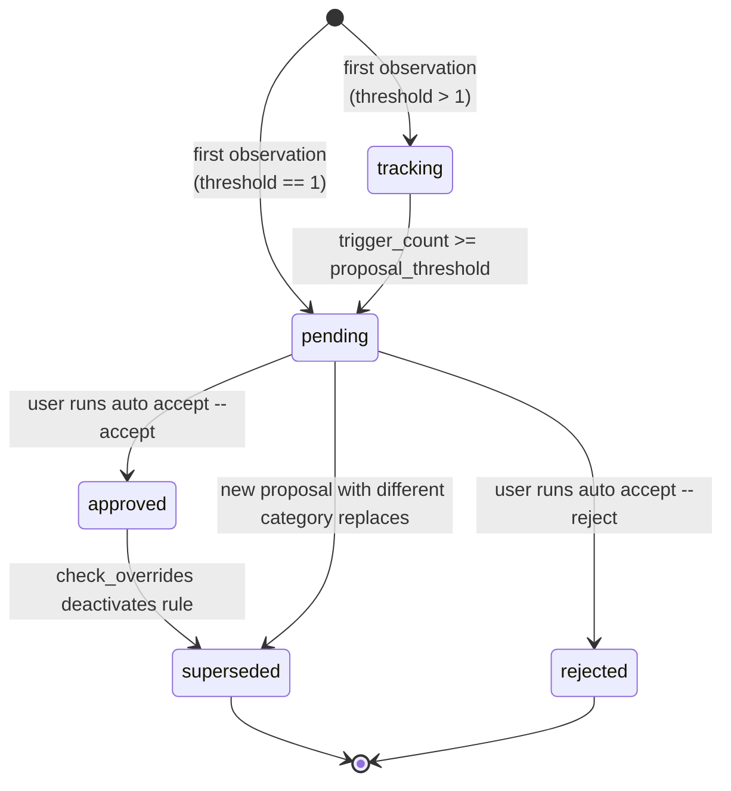
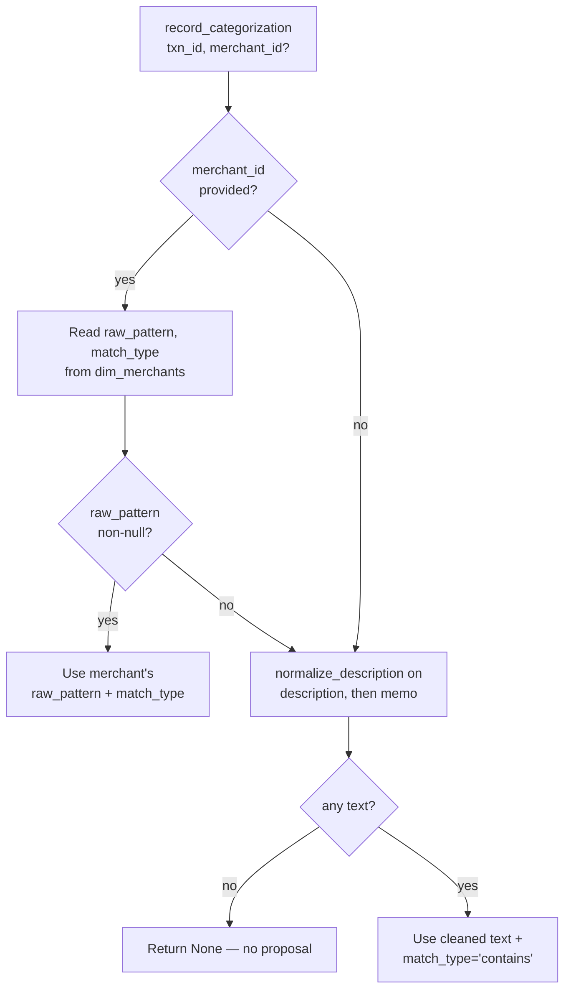
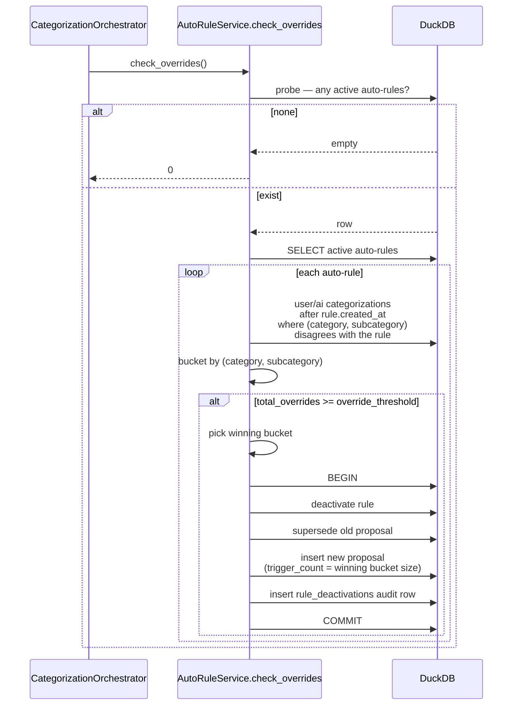

<!-- Last reviewed: 2026-05-17 -->

# Auto-Rule Pipeline

How MoneyBin learns categorization rules from your manual choices and proposes new ones. This is the deep technical view; for the user-facing flow, see [`docs/guides/categorization.md`](../guides/categorization.md). Design rationale and acceptance criteria live in [`docs/specs/categorization-auto-rules.md`](../specs/categorization-auto-rules.md).

Two services collaborate:

- `CategorizationOrchestrator` — the apply layer. Calls `AutoRuleService.record_categorization` after every successful write and `AutoRuleService.check_overrides` at end-of-batch.
- `AutoRuleService` — the learn layer. Owns proposal extraction, dedup, promotion, and override-driven deactivation. Calls back into the matcher for canonical rule semantics so observation, dedup, and override detection all use the same logic as rule evaluation.

## The pipeline at a glance

```mermaid
flowchart LR
    user[User or LLM<br/>categorizes a txn] --> orch[CategorizationOrchestrator<br/>.categorize_items]
    orch -->|record_categorization| obs[AutoRuleService<br/>observe + propose]
    obs --> staged[(app.proposed_rules<br/>tracking → pending)]
    staged --> cli[transactions categorize auto review]
    cli --> accept[transactions categorize auto accept]
    accept --> rule[(app.categorization_rules<br/>created_by='auto_rule')]
    rule --> apply[CategorizationOrchestrator<br/>.apply_rules]
    apply --> txn[(app.transaction_categories<br/>categorized_by='auto_rule')]
    orch -->|check_overrides| obs
    obs -->|threshold hit| deact[deactivate rule<br/>+ re-propose corrected category]
    deact --> staged
```



A fresh `AutoRuleService` is instantiated per batch — it holds no cross-batch state. Per-batch caches live on a recording context so the observation hook issues no per-item reads.

## Lifecycle states

Proposals move through five states in `app.proposed_rules.status`:



`approved` is terminal-but-revertible: once the override threshold is hit, `check_overrides` deactivates the rule and creates a fresh `pending` or `tracking` proposal carrying the corrected category.

## Stage 1 — Exemplar accumulation

Every categorization writes two things: the categorization itself and (best-effort) a merchant exemplar. Merchants are the *primary* learning surface; rule proposals are a secondary derived signal extracted from the same observations.

For each item in the batch:

1. **Resolve any existing merchant** against the cached `core.dim_merchants` rows. If a merchant matches, its `merchant_id` is carried into the write.
2. **Write the categorization** through the source-precedence guard (see "Source precedence" below).
3. **If the write landed**, fire `AutoRuleService.record_categorization` — gated on the write actually succeeding so rejected suggestions cannot poison training.
4. **If no merchant matched**, either append the row's normalized text as a new exemplar on an existing `oneOf` merchant with the same canonical name, or create a fresh exemplar-only merchant (`match_type='oneOf'`, `created_by='ai'`).

Exemplars live on `core.dim_merchants` as `oneOf` set-membership entries — no pattern needed. The merchant accumulator path covers more cases than auto-rule proposals because exemplars don't require a threshold; one categorization seeds future matches for identical text.

### Manual-source exemption

Rows with `source_type='manual'` do not seed auto-rule training. `record_categorization` short-circuits before pattern extraction so neither proposal creation nor increment paths observe manual rows. Manual rows are user-curated by definition; using them as evidence would conflate authoring intent with rule-discovery signal.

## Stage 2 — Pattern extraction

Pattern extraction decides what string the proposed rule should match. Two paths:



Why merchant pattern over description: the merchant's `raw_pattern` is the substring that actually matches statement text (e.g., `AMZN MKTP`) rather than the canonical display name (`Amazon`). Description fallback handles the cold-start case where no merchant exists yet.

Pattern extraction, dedup, and override detection always work against the same canonical normalized form so behavior is consistent across stages.

## Stage 3 — Proposal generation

Once a pattern is extracted, three dedup gates run in order before any write:

1. **Active-rule coverage** — if any active rule (user or auto) already produces the same `(category, subcategory)` for this transaction, no proposal.
2. **In-progress proposal lookup** — case-insensitive lookup on `(merchant_pattern, match_type)` for a `pending` or `tracking` proposal.
3. **Merchant-mapping coverage** — *only when no in-progress proposal exists*. Iterates the cached merchant list, evaluating each row's `raw_pattern` + `match_type` against the candidate pattern. `(category, subcategory)` equality is part of the check; `oneOf` (exemplar-only) merchants are skipped because they don't carry a pattern.

The merchant-coverage check is gated on "no in-progress proposal" so tracking proposals cannot get stuck below threshold once a merchant mapping is created during the same batch.

After the gates, one of three things happens. In pseudocode:

```python
def observe(txn, category, subcategory, merchant_id):
    pattern, match_type = extract_pattern(txn, merchant_id)
    if pattern is None:
        return  # no text to learn from
    if active_rule_covers(txn, pattern, category, subcategory):
        return  # gate 1
    proposal = find_in_progress(pattern, match_type)  # gate 2
    if proposal is None and merchant_mapping_covers(pattern, match_type, category):
        return  # gate 3
    if proposal is None:
        insert_proposal(
            pattern,
            match_type,
            category,
            subcategory,
            status="tracking" if proposal_threshold > 1 else "pending",
            trigger_count=1,
            sample_txn_ids=[txn.id],
        )
        return
    if (proposal.category, proposal.subcategory) != (category, subcategory):
        mark_superseded(proposal)
        insert_proposal(...)  # fresh proposal with new category
        return
    if txn.id in proposal.sample_txn_ids:
        return  # replay — never double-counts
    proposal.trigger_count += 1
    proposal.sample_txn_ids = ([txn.id] + proposal.sample_txn_ids)[
        :auto_rule_sample_txn_cap
    ]
    if proposal.trigger_count >= proposal_threshold:
        proposal.status = "pending"
    persist(proposal)
```

Distinct-`transaction_id` dedup matters because retries and re-imports can replay the same observation; counting them would silently promote `tracking` → `pending` without genuinely new evidence.

## Stage 4 — Review queue and acceptance

| Surface | Operation | Mutation | Idempotent? |
|---|---|---|---|
| CLI `transactions categorize auto review` / MCP `transactions_categorize_auto_review` | List pending proposals | None | Yes |
| CLI `transactions categorize auto accept --accept <id>` / MCP `transactions_categorize_auto_accept` (`accept=[...]`) | Promote proposal → rule, back-fill matching rows | Write | Yes (per proposal_id) |
| CLI `transactions categorize auto accept --reject <id>` / MCP `transactions_categorize_auto_accept` (`reject=[...]`) | Mark proposal `rejected` | Write | Yes |
| CLI `transactions categorize auto accept --accept-all` | Bulk promote (CLI-only convenience; expands to a list) | Write | Yes |
| CLI `transactions categorize auto stats` / MCP `transactions_categorize_auto_stats` | Active-rule and pending counts | None | Yes |
| CLI `transactions categorize auto rules` | List active auto-rules | None | Yes |
| CLI `transactions categorize rules delete <id> --reapply` | Soft-delete a rule and re-categorize affected rows | Write | Yes |

`--accept-all --reject <id>` means "accept everything pending except `<id>`". The CLI subtracts `reject_set` from `accept_set` before calling the service; the service repeats the dedup so direct service callers (MCP, scripts) inherit the guarantee.

The CLI verb is `accept`; the underlying service method is named `approve`. They are the same operation — the naming is a historical artifact, preserved because external scripts already call the CLI.

### Acceptance is atomic

Each accepted proposal runs three writes — insert rule, mark proposal approved, back-fill uncategorized rows — inside a single transaction. A partial failure cannot leave an active rule whose proposal is still `pending`.

### Back-fill respects priority

The back-fill does *not* simply categorize every uncategorized row whose description matches the new pattern. It runs the row through the full active rule set (sorted by priority) and only writes when the new rule is the priority winner. Otherwise a higher-priority user rule that also matches would be silently shadowed; subsequent `apply_rules` runs use `INSERT OR IGNORE` and cannot recover the right answer once an auto-rule has claimed the row.

The scan is bounded by `auto_rule_backfill_scan_cap` (default 50,000). Rows beyond the cap stay uncategorized until the next `apply_rules` sweep picks them up.

### Source precedence

Every write goes through the source-precedence guard:

```
user (1) > rule (2) > auto_rule (3) > migration (4) > ml (5) > plaid (6) > ai (7)
```

Lower number = higher priority. A categorization at priority `N` can replace any row at priority `≥ N`. The lone sanctioned bypass is `categorized_by='user'`, which always wins. This is what guarantees auto-rules cannot overwrite user manual edits.

### `sample_txn_ids` shape

`sample_txn_ids` is a `VARCHAR[]` (DuckDB array-of-VARCHAR) column on `app.proposed_rules` holding up to `auto_rule_sample_txn_cap = 5` transaction IDs (newest first; older samples drop off at the cap). To fetch the underlying transactions for review context:

```sql
SELECT *
FROM core.fct_transactions
WHERE transaction_id IN (?, ?, ?, ?, ?);
```

The CLI text output of `auto review` prints the same IDs after `samples:` on each row.

## Stage 5 — Override detection

After every successful batch, `check_overrides` catches the case where users repeatedly correct an auto-rule's output and rolls the rule back.



### Override semantics

An override is any `app.transaction_categories` row that:

- Was written *after* the rule's `created_at` (legacy rows that predate the rule do not count).
- Has `categorized_by IN ('user', 'ai')`. Machine-applied rows (`'rule'`, `'auto_rule'`) are excluded — counting them would let the auto-rule's own writes deactivate it.
- Has `(category, subcategory)` different from the rule's.
- Matches the rule's `(pattern, match_type)` under the matcher. Manual rows (`source_type='manual'`) are filtered out at the SQL level.

The new proposal's `trigger_count` is the size of the *winning* bucket, not the total override count. Minority buckets representing unrelated drift should not inflate the new proposal's evidence.

### Threshold ordering invariant

`auto_rule_proposal_threshold <= auto_rule_override_threshold` is enforced by a Pydantic validator. If proposal > override, deactivation could create a re-proposal that lands in `tracking` (count below proposal threshold), hiding the corrected category from `auto review` until further user categorizations arrive.

## Concurrency and locking

DuckDB is single-writer per database file. Concurrent `categorize_items` batches against the same profile serialize via the database lock — there is no in-process locking on top. The observation hook runs inside the categorize-write transaction, so dedup gates are atomically consistent within a batch. Across racing batches that contend for the lock, whichever wins commits first; the second batch reads the updated `proposed_rules` and merchant cache on its retry. Two batches that genuinely run in parallel against *different* profiles do not interact.

Acceptance and override-deactivation are each wrapped in their own transactions; they do not need to coordinate with `categorize_items` beyond the database lock.

## Data model

| Table | Purpose |
|---|---|
| `app.proposed_rules` | Review queue. One row per `proposed_rule_id` (12-char UUID4 hex). Carries `merchant_pattern`, `match_type`, `category`/`subcategory` (text snapshot) + `category_id` (FK to `core.dim_categories`), `status`, `trigger_count`, `sample_txn_ids`, `source`, `proposed_at`, `decided_at`, `decided_by`. |
| `app.categorization_rules` | Active and historical rules. One row per `rule_id`. Auto-promoted rules have `created_by='auto_rule'` and `priority=auto_rule_default_priority` (default 200). Same shape as user rules (`merchant_pattern`, `match_type`, optional `min_amount` / `max_amount` / `account_id`, `category_id`, `is_active`). |
| `app.transaction_categories` | The applied categorization. One row per `transaction_id`. Auto-rule applies write `categorized_by='auto_rule'`, carrying `rule_id` for back-reference. |
| `app.user_merchants` | Exemplar accumulator (surfaced as `core.dim_merchants`). Exemplar-only merchants carry `match_type='oneOf'` and a list of exact match-text values. |
| `app.rule_deactivations` | Audit trail. One row per deactivation with `reason` (`override_threshold` for the auto-rule path), `override_count`, and the `new_category_id` the deactivation converged on. Append-only; never updated. |

Detailed column-by-column reference in [`docs/reference/data-model.md`](../reference/data-model.md).

## Thresholds and tuning

All settings live under `MoneyBinSettings.categorization` in `src/moneybin/config.py`. The model is `frozen=True` — changes require restarting the process.

| Setting | Default | Effect |
|---|---|---|
| `auto_rule_proposal_threshold` | `1` | Distinct categorizations needed to promote `tracking` → `pending`. At the default (`1`), every observation that survives the dedup gates lands directly in `pending`. |
| `auto_rule_override_threshold` | `2` | User overrides needed to deactivate an active auto-rule. Must be `>= auto_rule_proposal_threshold`. |
| `auto_rule_default_priority` | `200` | `priority` assigned to newly-promoted rules. Higher number = lower priority; user-authored rules at the default `100` win conflicts. |
| `auto_rule_sample_txn_cap` | `5` | Maximum `transaction_id`s retained per proposal in `sample_txn_ids`. Older samples drop off when capacity is hit; the newest survive. |
| `auto_rule_list_default_limit` | `100` | Default `LIMIT` applied to `auto review` and `auto rules` when no `--limit` is given. |
| `auto_rule_backfill_scan_cap` | `50_000` | Maximum uncategorized rows scanned during the accept back-fill. Rows beyond the cap stay uncategorized until the next `apply_rules` run. |

Env-var overrides use the `MONEYBIN_CATEGORIZATION__` prefix, e.g. `MONEYBIN_CATEGORIZATION__AUTO_RULE_PROPOSAL_THRESHOLD=3`.

## User tuning guide

The defaults are tuned for fast feedback — a single categorization seeds a proposal, two corrections retract it. That works well for small-to-medium datasets where users are actively curating; it is too noisy on large historical back-fills. This section is the practical guidance for picking thresholds and operating the queue.

### When to trust auto-rules

Auto-rules are pattern detection, not a learned taxonomy. Don't expect them to figure out your category structure from scratch. The expected workflow:

1. Author user rules for the obvious cases — your top-10 to top-30 merchant patterns. These have higher priority than auto-rules and short-circuit the auto-rule observer entirely (dedup gate 1).
2. Let auto-rules fill in the long tail as you categorize transactions over time.
3. Review the queue periodically and accept the proposals that look right.

User rules and auto-rules coexist in the same `app.categorization_rules` table; the only difference is `created_by` and the default priority.

### Thresholds by data volume

| Dataset | `proposal_threshold` | `override_threshold` | Why |
|---|---|---|---|
| Light (< 1k txn/year) | `1` (default) | `2` (default) | Few signals; surfacing every distinct pattern fast is right. |
| Medium (1k–10k txn/year) | `2` | `3` | Reduces single-observation noise while still catching repeat patterns within a month. |
| Heavy (10k–50k txn/year) | `3` | `5` | At this volume one-offs are common; require multiple observations before staging a proposal. |
| Very heavy (50k+ txn/year, or large historical back-fill) | `5` | `10` | Review the queue weekly; aggressive thresholds keep the proposal table from drowning the reviewer. |

When bulk-importing years of history for the first time, raise the thresholds *before* the import — the observation hook runs during `categorize_items`, so retroactively tightening them does not retract already-staged proposals.

### What a bad proposal looks like in `auto review`

Patterns to reject (and why):

- **Pattern: `PAYMENT`** — too generic; matches every payment of any kind. Reject.
- **Pattern: `STARBUCKS` mapped to `Income`** — categorization mistake captured by the accumulator. Reject *and* correct the underlying transactions so the next round of observations carries the right category.
- **Pattern: `WIRE FEE` mapped to your top spending category** — bank fees and transfers should not mix into spending. Reject; author a user rule for the correct (fee/transfer) category instead.
- **Pattern: a single bank's standard prefix (e.g., `EXTERNAL TRANSFER`)** — matches noise, not a merchant. Reject and use the merchant exemplar path or a more specific user rule.

### Auto-rule vs hand-authored rule

Author a user rule when the pattern is clear and stable: "every Amazon transaction is Shopping", "every Spotify transaction is Subscriptions". User rules outrank auto-rules in the priority chain (default 100 vs 200), so they coexist cleanly.

Let auto-rules surface the patterns you didn't predict: a regional grocery chain you started shopping at this year, a new gym, a recurring service whose merchant name doesn't match anything you'd think to write a rule for.

### Blast radius of acceptance

Accepting a proposal triggers a back-fill that scans up to `auto_rule_backfill_scan_cap` (default 50,000) uncategorized rows and applies the new rule wherever it wins on priority. There is no built-in dry-run flag.

To preview before accepting:

- `transactions categorize auto review` prints the `sample_txn_ids` for each proposal — those are real transactions you can inspect via `transactions show <id>` to confirm the pattern matches what you think it matches.
- For a count of how many uncategorized rows would match a candidate pattern, run an ad-hoc read query (see "Audit recipes" below) against `core.fct_transactions` filtered to `category_id IS NULL`.

### Rollback

To remove a recently accepted auto-rule and re-categorize the affected rows:

```bash
moneybin transactions categorize rules delete <rule_id> --reapply
```

`--reapply` strips the categorizations that this rule wrote and re-evaluates those rows against remaining active matchers. The rule is *soft*-deleted (`is_active=false`); its row stays in `app.categorization_rules` for audit. `app.rule_deactivations` carries an additional audit row when the deactivation came from the override path.

Rejected proposals cannot be un-rejected — but they aren't sticky either: a future observation matching the same pattern can create a fresh proposal because the in-progress lookup only considers `status IN ('pending', 'tracking')`.

### Audit recipes

Recent auto-rules created:

```sql
SELECT rule_id, merchant_pattern, match_type, category, priority, created_at
FROM app.categorization_rules
WHERE created_by = 'auto_rule'
  AND created_at > now() - INTERVAL 7 DAY
ORDER BY created_at DESC;
```

Recent auto-rule deactivations (override-driven rollbacks):

```sql
SELECT deactivation_id, rule_id, reason, override_count, new_category, deactivated_at
FROM app.rule_deactivations
WHERE reason = 'override_threshold'
ORDER BY deactivated_at DESC
LIMIT 100;
```

How many uncategorized rows a candidate pattern *would* match (substitute the pattern; use parameterization rather than raw interpolation when scripting this):

```sql
SELECT count(*)
FROM core.fct_transactions f
LEFT JOIN app.transaction_categories tc USING (transaction_id)
WHERE tc.transaction_id IS NULL
  AND f.description ILIKE '%' || ? || '%';
```

The auto-rule service itself does not write to `app.audit_log` today — `app.rule_deactivations` is the durable record for the override path, and `app.categorization_rules.created_at` is the durable record for accepted proposals.

## Agent loop pattern

A worked example for an agent (Claude Code, Codex, or an MCP-driving script) polling the queue and auto-accepting high-confidence proposals:

```python
# Poll the queue
review = mcp.call("transactions_categorize_auto_review")
for proposal in review.data["proposals"]:
    # There is no confidence column today; trigger_count is the proxy.
    high_evidence = proposal["trigger_count"] >= 5
    # Pattern-quality is the agent's responsibility — the service does
    # not score it. Reject generic patterns and obviously short tokens.
    pattern = proposal["merchant_pattern"]
    too_generic = len(pattern) < 5 or pattern.upper() in {
        "PAYMENT",
        "TRANSFER",
        "DEBIT",
        "CREDIT",
        "ACH",
    }
    if high_evidence and not too_generic:
        mcp.call(
            "transactions_categorize_auto_accept",
            accept=[proposal["proposed_rule_id"]],
        )
    # Otherwise leave for human review.
```

Honest about the shape today: there is no confidence column on `proposed_rules`. `trigger_count` is the only signal the service exposes; the "is this pattern any good?" judgment lives in the agent, not the service. If you want to encode a stricter policy (require a minimum sample diversity, filter on category, etc.), inspect `sample_txn_ids` and fetch the underlying transactions via `core.fct_transactions` before deciding.

The same loop can run against the CLI directly with `--output json`:

```bash
moneybin transactions categorize auto review --output json \
  | jq -r '.data.proposals[] | select(.trigger_count >= 5) | .proposed_rule_id' \
  | xargs -r -I {} moneybin transactions categorize auto accept --accept {}
```

## Idempotency and re-runs

| Operation | Re-runnable | Notes |
|---|---|---|
| `record_categorization` (replay same `transaction_id`) | Yes | `trigger_count` only increments for `transaction_id` not already in `sample_txn_ids`; replays don't promote `tracking` → `pending`. |
| `auto review` | Yes | Read-only. |
| `auto accept --accept <id>` | Yes | Skips proposals not in `status='pending'` and increments `skipped` instead. A second call after a successful approve is a no-op. |
| `auto accept --reject <id>` | Yes | Rejects only fire on `pending` rows. |
| Back-fill at acceptance | Effectively idempotent | Each row goes through the precedence-guarded writer; second runs either re-confirm or skip. |
| `check_overrides` | Yes | Re-evaluates every active auto-rule each batch. A rule that hasn't crossed threshold this cycle won't deactivate; one that has deactivates once (atomic). |

Pattern extraction is incremental, not a periodic rebuild. The pipeline never re-scans historical transactions to extract patterns — it observes only the categorizations that pass through `categorize_items` after the service starts. Approved rules then apply to historical rows via the one-shot back-fill at acceptance time, and to future rows via `apply_rules`.

## Edge cases

**Proposed rule conflicts with an existing user-set rule.** The active-rule coverage gate catches this *before* the proposal is created — if any active rule (user or auto) already produces the same `(category, subcategory)` for the transaction being observed, `record_categorization` returns `None`. A conflict that emerges *after* the proposal is staged (user authors a rule covering the same pattern between observation and acceptance) is caught at acceptance back-fill: the matcher honors priority, so the higher-priority user rule wins on every overlap row and the auto-rule applies only to non-overlapping rows.

**Same merchant pattern has two distinct categories across exemplars.** The second observation triggers the "existing proposal, different category" branch — old proposal marked `superseded`, new proposal created carrying the latest `(category, subcategory)`. The user sees only the latest version in `auto review`; the superseded row remains in `app.proposed_rules` for audit. There is no merging; the most recent categorization wins for proposal purposes.

**Rejected proposal — can it re-surface?** Yes, eventually. `reject` writes `status='rejected'`, which terminates that specific proposal. Future categorizations matching the same `(pattern, match_type)` go through the in-progress lookup, which only considers `status IN ('pending', 'tracking')` — so a fresh proposal can be created from scratch on the next matching observation. There is no "rejection memory" that blocks re-proposal; reject is per-row, not per-pattern. If you want a hard block, author a user rule for the desired `(category, subcategory)` so the active-rule coverage gate short-circuits future observations.

**Auto-rule deactivated by overrides, then the corrected proposal is also rejected.** The rule stays deactivated (no path re-activates a `is_active=false` auto-rule). The corrected proposal terminates as `rejected`. Future observations matching the original pattern create new proposals as usual. The deactivation row in `app.rule_deactivations` is the durable record.
