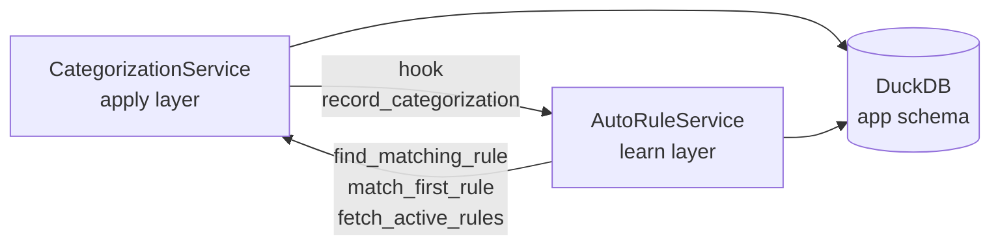
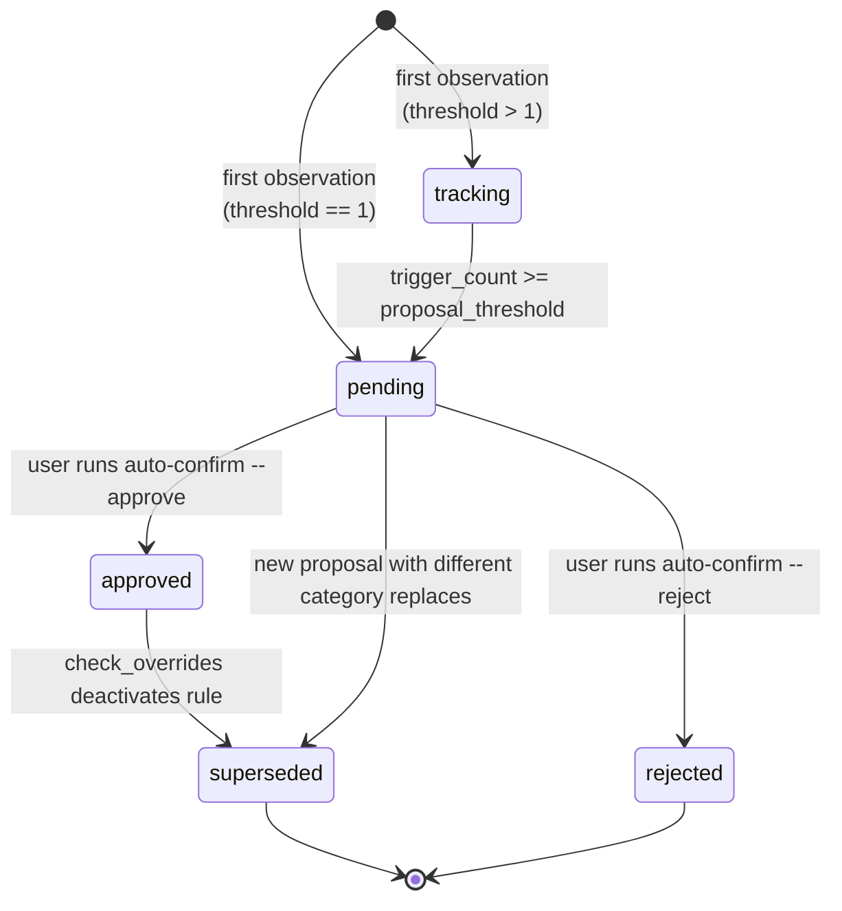
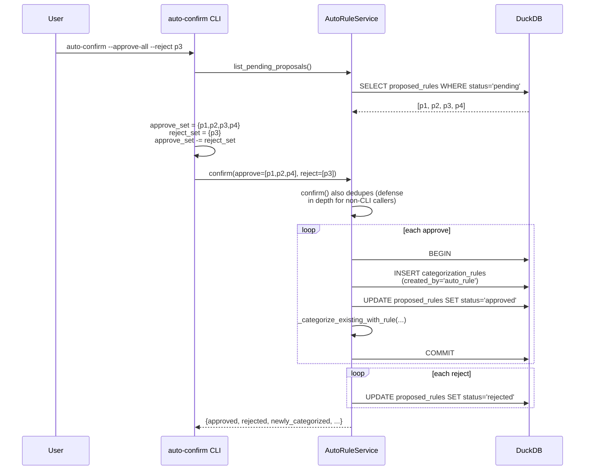
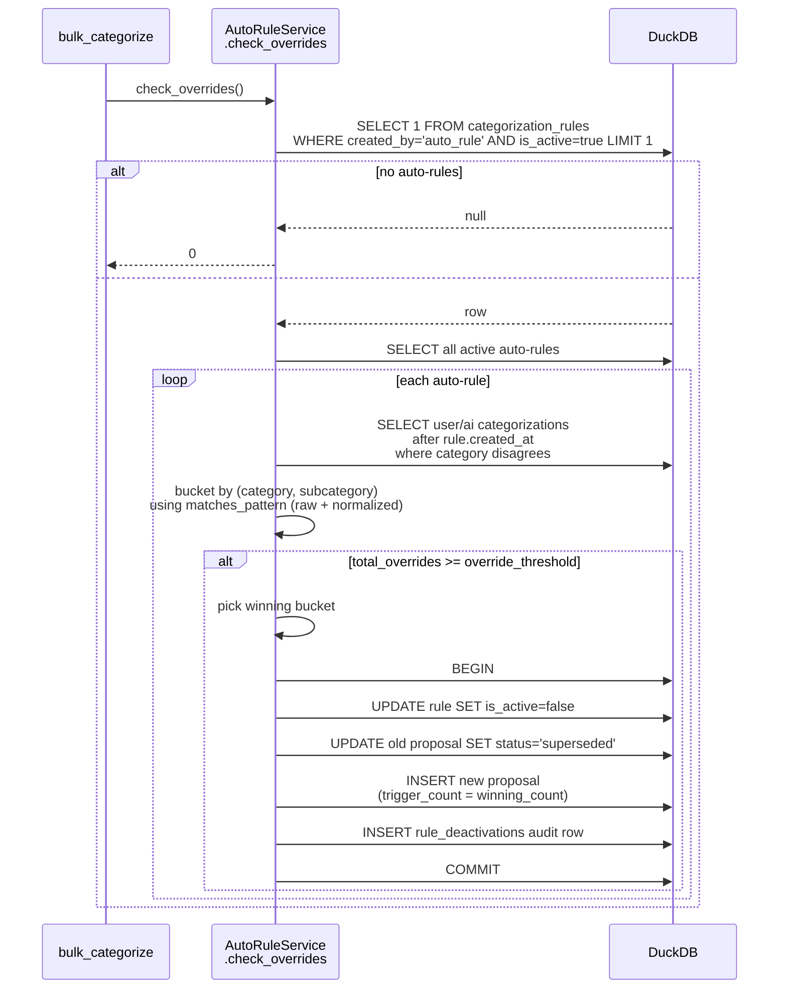
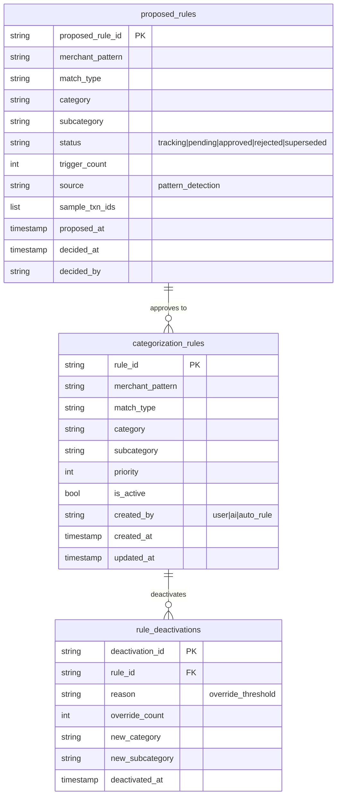

# Auto-Rule Pipeline

How MoneyBin observes user/AI categorizations, stages them as rule proposals, promotes them to active rules, and rolls them back when users disagree. This document covers the runtime mechanics — see [`docs/specs/categorization-auto-rules.md`](../specs/categorization-auto-rules.md) for the design rationale and [`docs/guides/categorization.md`](../guides/categorization.md) for end-user usage.

## Overview

The pipeline is split between two services with a one-way dependency:



`AutoRuleService` learns from categorizations recorded by `CategorizationService.bulk_categorize`. It calls back into `CategorizationService` for canonical rule-match semantics (priority order, normalized descriptions, regex case handling) so dedup and override detection use the same logic the rule engine itself uses at apply time. The dependency is one-directional at module load — `CategorizationService` only imports `AutoRuleService` lazily inside the hook to avoid a cycle.

## Lifecycle states

Proposals move through five states in `app.proposed_rules`:



`approved` is terminal-but-revertible: once override threshold is hit, `check_overrides` deactivates the rule and creates a fresh `pending`/`tracking` proposal carrying the corrected category.

## Phase 1 — Observation: `record_categorization`

Called from inside `CategorizationService.bulk_categorize` for every successful (txn, category) pair. Best-effort: failures are caught and logged but do not break categorization.

```mermaid
sequenceDiagram
    participant C as CategorizationService<br/>.bulk_categorize
    participant A as AutoRuleService<br/>.record_categorization
    participant DB as DuckDB

    C->>C: resolve pre-existing<br/>merchant_id (Phase 3 cache)
    C->>A: record_categorization(<br/>txn_id, category,<br/>subcategory, merchant_id)
    A->>A: _extract_pattern(<br/>txn_id, merchant_id)

    alt merchant_id given
        A->>DB: SELECT raw_pattern, match_type<br/>FROM merchants WHERE merchant_id=?
        DB-->>A: (pattern, match_type)
    else no merchant
        A->>DB: SELECT description<br/>FROM fct_transactions
        DB-->>A: description
        A->>A: pattern = normalize_description(desc)<br/>match_type = 'contains'
    end

    A->>A: _active_rule_covers_transaction?
    Note over A: Calls find_matching_rule;<br/>skips if a rule already wins
    A->>A: _find_pending_proposal(<br/>pattern, match_type)
    A->>A: _merchant_mapping_covers?<br/>(only when no in-progress proposal)

    alt existing proposal, same category
        A->>DB: UPDATE proposed_rules<br/>SET trigger_count, sample_txn_ids, status
        Note over A: trigger_count only increments<br/>for distinct transaction_id
    else existing proposal, different category
        A->>DB: UPDATE old proposal SET status='superseded'
        A->>DB: INSERT new proposal
    else no existing proposal
        A->>DB: INSERT new proposal
    end

    A-->>C: proposed_rule_id | None
    C->>C: create new merchant<br/>(if none matched)
    C->>DB: INSERT transaction_categories
```

### Pattern extraction priority

`_extract_pattern` prefers the merchant's `raw_pattern` + `match_type` over the description because the merchant pattern is the substring that actually matches statement text (e.g., `AMZN` rather than the canonical `Amazon`). Without a merchant link, it falls back to `normalize_description(description)` with `match_type='contains'`.

### Why merchant resolution happens before the hook

`bulk_categorize` resolves any pre-existing merchant in Phase 3's cache, then calls `record_categorization` with that `merchant_id`, then creates a new merchant if none matched. The ordering matters:

- **Pre-existing merchant first** — so the hook can use the merchant's actual `raw_pattern` instead of falling back to the raw description.
- **New merchant after the hook** — `_merchant_mapping_covers` would short-circuit a fresh proposal if the merchant existed at hook time. Deferring creation lets the proposal land before the merchant exists.

### Dedup gates (in order)

1. **`_active_rule_covers_transaction`** — delegates to `CategorizationService.find_matching_rule`. If any active rule already matches this transaction with the same category, no proposal.
2. **`_find_pending_proposal`** — keyed on `(merchant_pattern, match_type)`; surfaces an in-progress proposal if one exists.
3. **`_merchant_mapping_covers`** — only when *no* in-progress proposal exists. Iterates `merchants` in Python, evaluating each row's `raw_pattern` + `match_type` against the candidate pattern via `matches_pattern`. Subcategory equality is part of the check.

The merchant-coverage check is gated on "no in-progress proposal" so tracking proposals can't get stuck below threshold once `bulk_categorize` creates a merchant mapping during the same batch.

### `trigger_count` dedup

`sample_txn_ids` deduplicates by membership check; `trigger_count` increments only when `transaction_id` is new in `samples`. This prevents replays (MCP retry, re-import) from artificially promoting tracking → pending without genuinely new evidence.

## Phase 2 — Promotion: `auto-confirm`

The user reviews pending proposals and approves or rejects them in batch.



### Approve atomicity

The three writes — rule INSERT, proposal UPDATE to `approved`, and back-fill — run in a single `db.begin()/commit()/rollback()` transaction. Without this, a partial failure could leave an active rule whose source proposal is still `pending`, allowing a retry to create a duplicate rule.

### Back-fill priority check

`_categorize_existing_with_rule` does *not* simply assign the new rule's category to every uncategorized transaction whose description matches. It calls `CategorizationService.match_first_rule` against the full active-rule set (sorted by priority) and assigns only when this rule is the priority winner. Reasoning: a higher-priority user rule that also matches must not be silently shadowed by an auto-rule. Subsequent `apply_rules` runs use `INSERT OR IGNORE` and would not be able to override the auto-rule once written.

The scan is bounded by `auto_rule_backfill_scan_cap` (default 50,000). Transactions beyond the cap are picked up by the next `apply_rules` run.

### Why explicit reject wins over `--approve-all`

`auto-confirm --approve-all --reject p3` means "approve everything pending except p3". The CLI subtracts `reject_set` from `approve_set` before calling `confirm()`. Without this, `approve()` runs first and promotes p3 to `approved`; the subsequent `reject()` call sees it as non-`pending` and reports it skipped. The dedup is also done inside `confirm()` for defense in depth — direct service callers (MCP, scripts) don't have to repeat it.

## Phase 3 — Apply: rule engine integration

Once approved, an auto-rule is just a `categorization_rules` row with `created_by='auto_rule'`. It participates in `CategorizationService.apply_rules` like any other rule. There are two distinguishing behaviors:

1. When the rule engine writes a categorization sourced from an auto-rule, it sets `categorized_by='auto_rule'` (not `'rule'`). This is what `AutoRuleService.stats()` counts.
2. The default priority is configurable (`auto_rule_default_priority`, default 200) — higher number = lower priority, so user-authored rules win conflicts by default.

## Phase 4 — Override detection: `check_overrides`

Called from `bulk_categorize` after every batch. Detects when users repeatedly correct an auto-rule's output and rolls the rule back.



### Override semantics

An override is a `transaction_categories` row that:

- Was written *after* the rule's `created_at` (legacy categorizations that predate the rule don't count).
- Has `categorized_by IN ('user', 'ai')` (machine-applied rows from `'rule'` and `'auto_rule'` are excluded — counting them would let overlapping rule output deactivate auto-rules).
- Has `(category, subcategory)` different from the rule's.
- Has a description that matches the rule's `(pattern, match_type)` under `matches_pattern`, evaluated against both the raw description and `normalize_description(description)` to mirror `apply_rules`.

### Trigger count of the replacement proposal

`trigger_count` for the new proposal is the size of the *winning* bucket, not the total number of overrides. Total overrides may include unrelated minority buckets that should not inflate the new proposal's evidence count.

### Threshold ordering invariant

`auto_rule_proposal_threshold <= auto_rule_override_threshold` is enforced by a Pydantic `model_validator`. If proposal > override, a deactivation could create a re-proposal that lands in `tracking` (count below proposal threshold) — hiding the corrected category from `auto-review` until further user categorizations arrive.

### Atomic deactivation

The four writes — rule deactivation, old-proposal supersede, new-proposal insert, audit row — run in a single transaction so a failure between steps cannot leave the rule deactivated with no replacement proposal.

## Configuration

All settings live under `MoneyBinSettings.categorization` in `src/moneybin/config.py`:

| Setting | Default | Purpose |
|---|---|---|
| `auto_rule_proposal_threshold` | 3 | Distinct categorizations needed to promote `tracking` → `pending` |
| `auto_rule_override_threshold` | 3 | User overrides needed to deactivate an active auto-rule |
| `auto_rule_default_priority` | 200 | Priority of newly-promoted rules (lower = higher priority) |
| `auto_rule_sample_txn_cap` | 5 | Max sample transaction IDs retained per proposal |
| `auto_rule_backfill_scan_cap` | 50,000 | Max uncategorized transactions scanned during approve back-fill |

## Schema



## Failure modes

| Failure | Containment |
|---|---|
| `record_categorization` raises | Caught by `bulk_categorize`; logged at WARNING, categorization continues |
| `approve` partial write | Per-proposal transaction rolls back; other proposals in the batch still apply |
| `check_overrides` partial write | Per-rule transaction rolls back; remaining auto-rules still evaluated |
| `_categorize_existing_with_rule` exceeds scan cap | Excess transactions remain uncategorized; next `apply_rules` run picks them up via `INSERT OR IGNORE` |
| Catalog missing (table not created) | Each read path catches `duckdb.CatalogException` and returns an empty result |

## Observability

| Event | Log level | Detail |
|---|---|---|
| Approve completed | INFO | `Approved N proposal(s); M existing transaction(s) categorized` |
| Override deactivation | INFO | `Deactivated N auto-rule(s) due to user overrides` |
| Hook failure | WARNING | `auto-rule recording failed` (with stack trace) |
| Merchant lookup failure | DEBUG | `Could not resolve merchant for {txn_id}` |

No PII is logged — patterns, merchant names, and descriptions stay out of log lines. See [`security.md`](../../.claude/rules/security.md).
