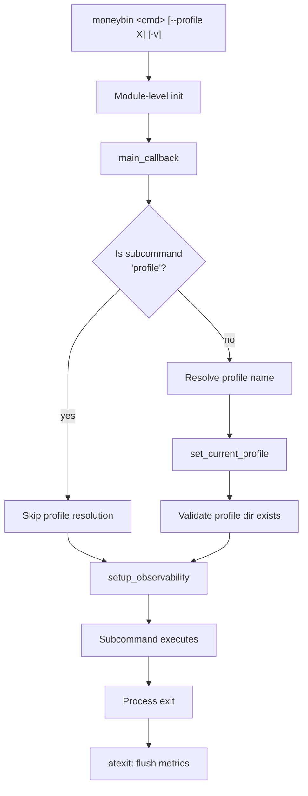
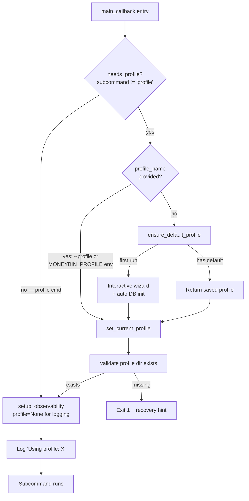
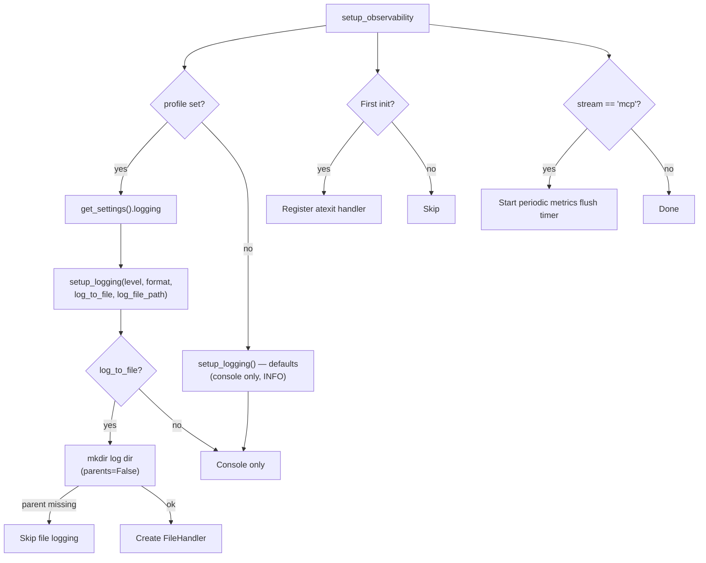
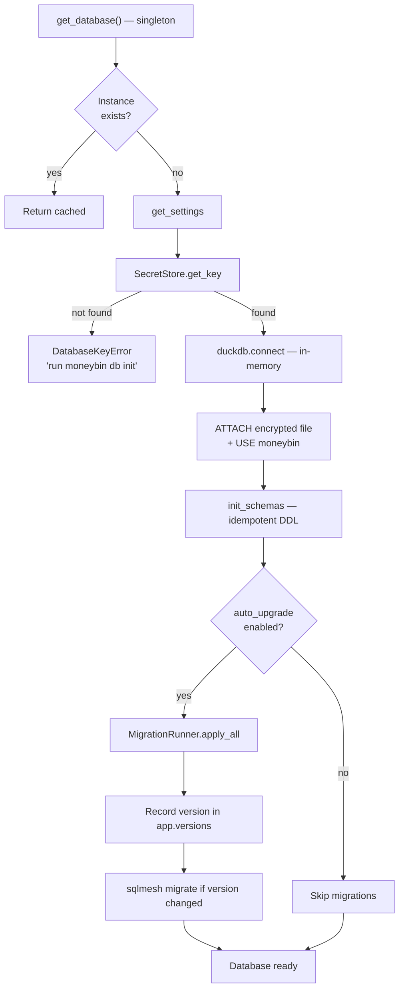
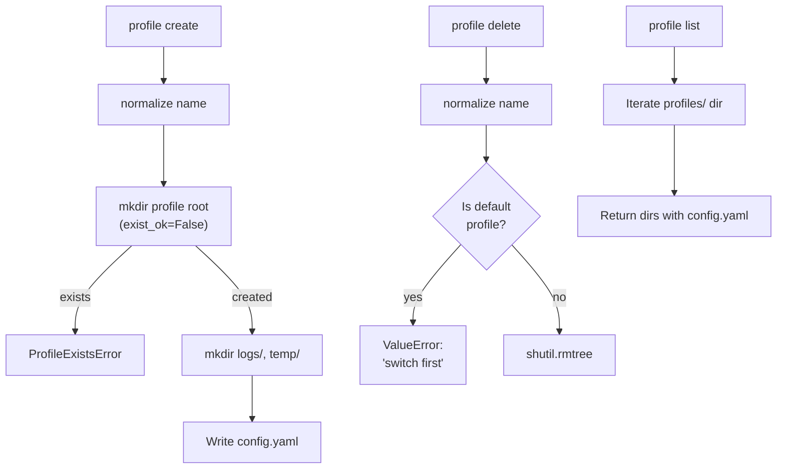
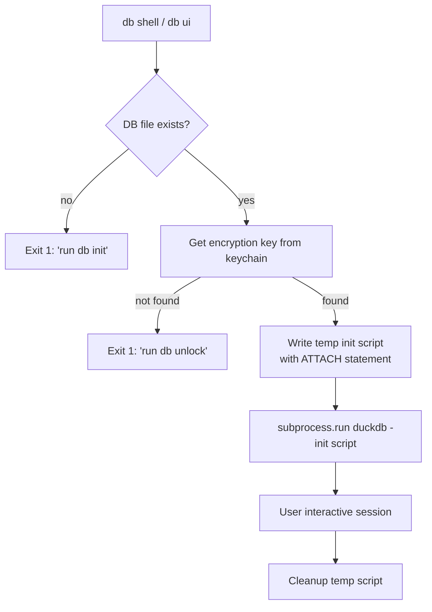
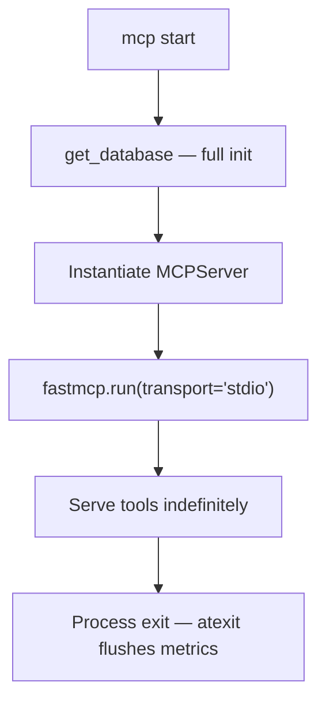
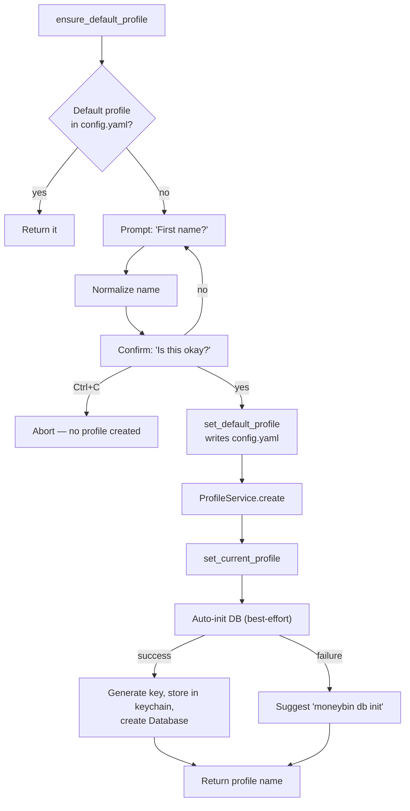
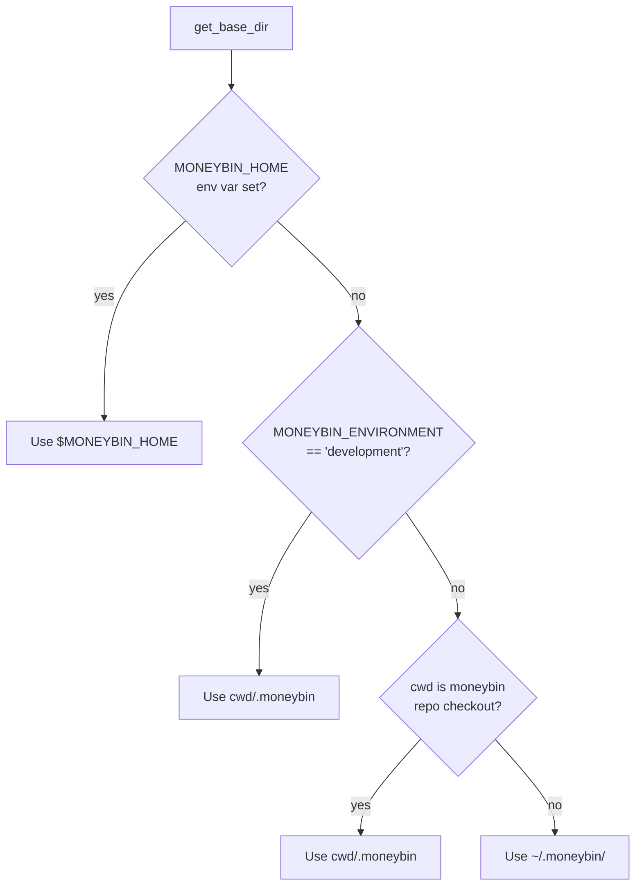

# CLI Startup Flow

How a MoneyBin CLI command goes from `moneybin <cmd>` to executing user code, what happens at each stage, and where things can go wrong.

## Overview



## Stage 1: Module-Level Initialization

When `moneybin.config` is first imported, a module-level variable is initialized:

```python
_current_profile: str | None = None
```

No profile is set at import time — it stays `None` until `set_current_profile()` is called in `main_callback()`. Calling `get_settings()` or `get_current_profile()` before that raises `RuntimeError`.

**Side effects:** None. No YAML reads, no directories, no database.

## Stage 2: main_callback

The Typer callback is the central orchestrator. All commands pass through it.



### Profile Resolution Priority

| Priority | Source | When used |
|---|---|---|
| 1 | `--profile` flag | Always wins |
| 2 | `MONEYBIN_PROFILE` env var | If no flag |
| 3 | `ensure_default_profile()` | If neither flag nor env var |
| 4 | Interactive first-run wizard | If `ensure_default_profile()` finds no saved default |

### Profile Commands Are Special

When `ctx.invoked_subcommand == "profile"`, the callback skips all profile resolution:

- No `ensure_default_profile()` call
- No `set_current_profile()` call
- No profile directory validation

This is deliberate. Profile commands *manage* profiles rather than *operating within* one. Without this separation, `profile create` would try to resolve a profile before it exists.

## Stage 3: setup_observability

Called for every command. Sets up logging and registers the atexit metrics handler.



`setup_logging()` does not call `get_settings()`. All config values are passed explicitly by `setup_observability()`. When no profile is set (e.g. profile commands), `setup_logging()` runs with defaults: console-only, INFO level, human format.

### Directory Creation Rules

**Profile root** (`<base>/profiles/<name>/`) is only created by `ProfileService.create()`. No other code path creates it. This is the single invariant that prevents deleted profiles from being silently resurrected.

**Subdirectories** (logs, temp) are created by `ProfileService.create()` during profile setup.

**Log directory** uses `mkdir(parents=False)` — it will create `logs/` inside an existing profile dir, but won't create the profile dir itself. If the profile dir is missing, file logging is skipped gracefully.

**Database directory** uses `mkdir(parents=False, exist_ok=True)` — same principle. The profile root must already exist.

### The atexit Handler

`_flush_metrics_on_exit()` runs when the process exits. It only flushes metrics if a `Database` instance was already created during the session. It never calls `get_database()` to create a new one — that would trigger the full database initialization chain (directory creation, schema init, migrations) on shutdown, which is wrong for commands that never touch the database.

## Stage 4: Subcommand Execution

After the callback completes, Typer dispatches to the subcommand function.

### Regular Commands (import, sync, categorize, etc.)

These call `get_database()` on first use, triggering lazy initialization:



**Note:** `Database.__init__` calls `db_path.parent.mkdir(parents=False, exist_ok=True)`. This ensures the immediate parent exists but will not recreate a deleted profile's root directory — the `parents=False` flag means the profile root must already exist.

### Profile Commands

No database access. Use `ProfileService` directly:



### db shell / db ui

These are special — they don't use the `Database` class at all. They spawn a DuckDB CLI subprocess with an init script that ATTACHes the encrypted database:



This bypasses all Python-level database initialization (schema init, migrations). The user gets a raw DuckDB shell.

### MCP Server

Similar to regular commands but long-running:



Additionally, MCP mode starts a periodic metrics flush timer (every 5 minutes) since the process may run for hours.

## Stage 5: First-Run Wizard

Triggered when `ensure_default_profile()` finds no saved default and no `--profile` flag was provided.



**Side effects (all-or-nothing on success):**
1. `~/.moneybin/config.yaml` created/updated with `active_profile`
2. Profile directory tree created
3. Encryption key generated and stored in OS keychain
4. Encrypted database created with schema

**On Ctrl+C:** Nothing is created. The wizard re-triggers on next invocation.

## Base Directory Resolution

Where MoneyBin looks for profile data:



In development (running from the repo), the base dir is `<repo>/.moneybin/`, so profiles live at `<repo>/.moneybin/profiles/<name>/`. In production, they live at `~/.moneybin/profiles/<name>/`.

## Invariants

These are the rules that prevent the bugs we've encountered:

1. **Only `ProfileService.create()` creates profile root directories.** No other code path — not `setup_logging()`, not `Database.__init__()` — creates `<base>/profiles/<name>/`. Both `setup_logging()` and `Database.__init__()` use `mkdir(parents=False)`, so they can create immediate subdirectories but will fail (gracefully) if the profile root doesn't exist.

2. **The atexit handler never creates database connections.** It only flushes metrics if a `Database` singleton was already initialized during the session. Otherwise it's a no-op.

3. **Profile commands skip profile resolution.** The `main_callback` does not call `set_current_profile()` or `ensure_default_profile()` when `invoked_subcommand == "profile"`. This prevents side-effects during profile lifecycle operations.

4. **`get_settings()` is a pure read.** It loads configuration from files and environment variables but creates no directories and has no filesystem side effects. Safe to call from any context. Raises `RuntimeError` if called before `set_current_profile()`.

5. **`setup_logging()` is decoupled from `get_settings()`.** All log config values (level, format, file path) are passed explicitly by `setup_observability()`. Profile commands get console-only logging with defaults — no `get_settings()` call needed.

6. **No module-level profile initialization.** `_current_profile` starts as `None`. The profile is set exclusively by `main_callback()` via `set_current_profile()`. This makes the flow linear: callback sets profile → everything else reads it. No stale-state windows.

## Known Remaining Issues

### `ensure_default_profile` Does Too Much

The first-run wizard in `ensure_default_profile()` handles profile creation, config writing, key generation, and database initialization — all in one function in `user_config.py`. This couples user config management to database and keychain operations. A cleaner design would have the wizard only create the profile and config, with `db init` handling key/database setup separately (or as a clearly separate step).

## Simplifications Applied

The bugs we fixed were symptoms of a deeper issue: **too many things knew how to create directories**, and **startup side effects were scattered across modules that shouldn't own them**. All four simplifications have been applied:

1. **Removed `create_directories()` from `get_settings()`** — The `create_dirs` config flag and `create_directories()` method were deleted from `MoneyBinSettings`. `get_settings()` is now a pure read with no filesystem side effects.
2. **Fixed `Database.__init__` directory creation** — Changed from `mkdir(parents=True)` to `mkdir(parents=False)`, closing the last path that could recreate a deleted profile.
3. **Eliminated module-level `_current_profile`** — `_current_profile` starts as `None` instead of eagerly reading `config.yaml` at import time. `get_settings()` and `get_current_profile()` raise `RuntimeError` if called before `set_current_profile()`.
4. **Decoupled `setup_logging()` from `get_settings()`** — `setup_logging()` accepts all config values as explicit parameters. `setup_observability()` resolves them from settings when a profile is available, or uses defaults (console-only, INFO level) when not. Profile commands get proper logging without touching the settings chain.
