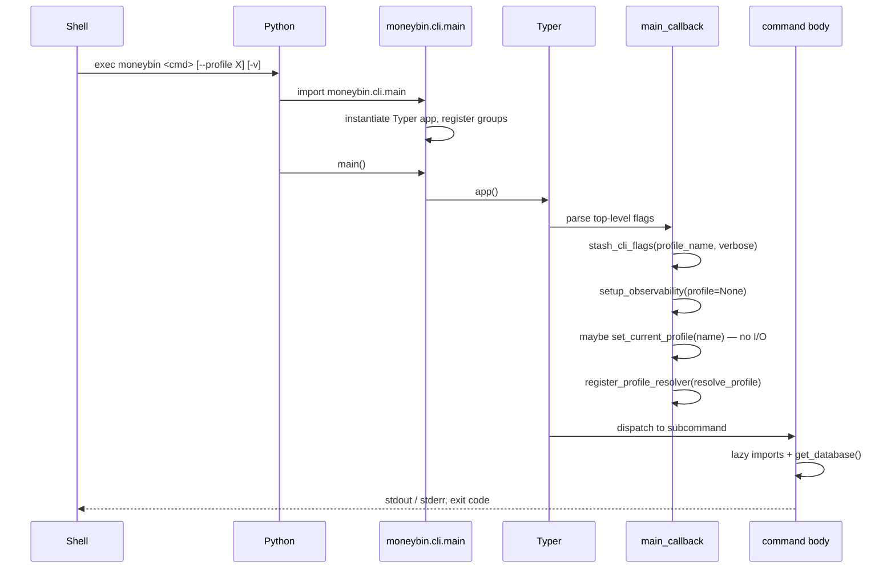
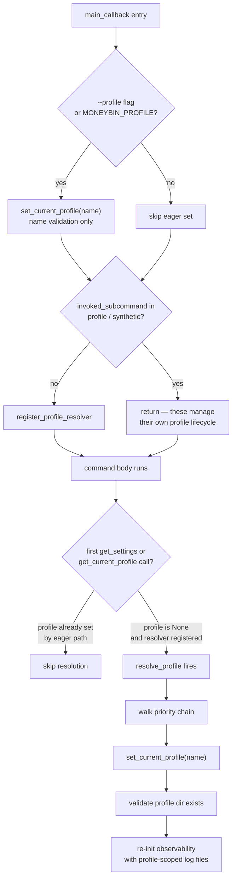

<!-- Last reviewed: 2026-05-17 -->

# CLI Startup Flow

How `moneybin <command>` actually runs from the shell to the command body. This deep technical view documents the cold-start path (the `--help` invariant), profile resolution, and the lazy-import patterns that keep cold start fast. For the user-facing command reference, see [`docs/guides/cli-reference.md`](../guides/cli-reference.md). For the profile model, see [`docs/guides/profiles.md`](../guides/profiles.md). For the encryption-key lifecycle, see [`docs/guides/database-security.md`](../guides/database-security.md).

## The cold-start path



1. **Shell exec.** The `moneybin` console script is registered by `pyproject.toml`:

   ```toml
   [project.scripts]
   moneybin = "moneybin.cli.main:main"
   ```

   The launcher script created by `uv`/`pip` is what the shell finds on `PATH`.

2. **Python import.** Python imports `moneybin.cli.main`. The module imports Typer, the config helpers, the observability setup, and every command-group module in [`src/moneybin/cli/commands/`](../../src/moneybin/cli/commands/). Heavy transitive dependencies (`fastmcp`, `sqlmesh`, `polars`) are **not** imported here — they live inside individual command bodies (see "Cold-start hygiene" below).

3. **Typer app instantiation.** `app = typer.Typer(name="moneybin", no_args_is_help=True, ...)`. Each sub-group is attached via `app.add_typer(...)`; the leaf commands (`stats`, `logs`) are attached via `app.command(...)`.

4. **Typer argument parsing.** Typer (a thin layer over Click) parses argv, identifies the leaf command, and routes through `main_callback` on the way down.

5. **`main_callback` runs.** Stashes flags, calls `setup_observability` with no profile, eagerly validates the profile name when one is explicit, registers the lazy resolver. No I/O against the profile dir or database.

6. **Leaf command body runs.** First call to `get_settings()` / `get_current_profile()` fires the lazy resolver. First call to `get_database()` opens the encrypted DuckDB connection.

## Cold-start hygiene

`--help`, shell autocomplete, every E2E test, and every CLI invocation pay the module-import cost for `moneybin.cli.main`. That cost is the budget. The rules in [`.claude/rules/cli.md`](../../.claude/rules/cli.md) → "Cold-Start Hygiene" enforce three invariants.

### The `--help` invariant

`--help` and `-h` MUST be side-effect free:

- No first-run wizard, no `config.yaml` writes.
- No profile-directory creation, no log file rotation.
- No database connection, no keychain lookup.
- No network calls.

Typer short-circuits explicit `--help` before any callback or command body runs. Bare-group invocations (`moneybin db`, `moneybin import`) exit via `no_args_is_help=True` before the subcommand body runs. Because `main_callback` itself is inert (no `get_settings()`, no `resolve_profile()` call), `moneybin <subgroup> --help` is also safe — the callback runs, but only stashes flags and registers the resolver.

This is why `main_callback`'s name validation uses only `set_current_profile(name)`, which is a format-and-cache update with no I/O.

### Lazy imports in command bodies

Heavy transitive imports MUST be deferred inside the function that needs them:

```python
# src/moneybin/cli/commands/mcp.py
@app.command("list-prompts")
def mcp_list_prompts(...) -> None:
    from moneybin.mcp.server import (
        mcp,  # noqa: PLC0415 — defer fastmcp import to subcommand body
    )
    ...
```

The `# noqa: PLC0415` suppression is the grep-able marker for the pattern. The same pattern applies to anything that pulls a parser, ORM, or large package graph: `fastmcp`, `sqlmesh`, `polars`.

The non-obvious failure mode: `from x import Y` at module top of any command file (including transitive imports from helper modules those files load) loads the heavy graph for *every* invocation — `--help`, autocomplete, every E2E subprocess. The CLI feels fine in isolation but the test suite slows by a factor of N over time. The CI guard described below catches regressions early.

### `main_callback` stays inert

The callback in [`src/moneybin/cli/main.py`](../../src/moneybin/cli/main.py) does exactly four things and nothing else:

1. `stash_cli_flags(profile_name, verbose)` — writes to a module-level `_CLIFlags` dataclass.
2. `setup_observability(stream="cli", verbose=verbose, profile=None)` — console logging only; no file handler yet because the profile isn't resolved.
3. When `--profile <name>` or `MONEYBIN_PROFILE` is explicit: `set_current_profile(name)`. This validates the name format and updates the `_current_profile` module variable — no directory check, no YAML read, no DB open.
4. When `ctx.invoked_subcommand` is neither `"profile"` nor `"synthetic"`: `register_profile_resolver(resolve_profile)`. The resolver fires the first time anything calls `get_settings()` or `get_current_profile()`.

The callback NEVER calls `resolve_profile()` directly. That is the single rule that keeps `--help` and bare-group invocations side-effect free.

## Cold-start budget and measurement

There is no formal latency target pinned in the codebase. As a working baseline, on a developer laptop with warm OS file caches, `moneybin --help` runs in roughly **250 ms** end-to-end (best of three subprocess invocations); the underlying `import moneybin.cli.main` accounts for the bulk of that. First invocation after a cold boot or branch switch can be 1–2 s while Python's `.pyc` cache and the OS page cache warm up. Numbers vary across machines — measure on yours rather than trusting these.

Profile heavy imports with `-X importtime`:

```bash
uv run python -X importtime -c "import moneybin.cli.main" 2>&1 | tail -30
```

Read the rightmost `cumulative` column to find the heavy modules. The names to watch for: `fastmcp` (~150 ms), `sqlmesh` (~300 ms cold), `polars` (~100 ms). None of these should appear on the cold-start path.

The regression guard is the unit test [`tests/moneybin/test_cli/test_cold_start.py`](../../tests/moneybin/test_cli/test_cold_start.py), which imports `moneybin.cli.main` in a clean subprocess and asserts that none of `fastmcp.*`, `sqlmesh.*`, or `polars.*` end up in `sys.modules`. It runs as part of the unit-test job in [`ci.yml`](../../.github/workflows/ci.yml), so an eager import added in a PR fails CI before merge.

### Verifying `--help` is side-effect free

The behavioral test is [`tests/moneybin/test_cli/test_help_no_wizard.py`](../../tests/moneybin/test_cli/test_help_no_wizard.py): it parametrizes every command group, mocks `ensure_default_profile`, runs `--help` via Typer's `CliRunner`, asserts the wizard was never called, and additionally asserts nothing wrote `profiles/` under a fake `HOME`. Defense-in-depth across both the behavioral path and the filesystem.

For a manual smoke check with a clean home:

```bash
rm -rf /tmp/mb-test-home
MONEYBIN_HOME=/tmp/mb-test-home moneybin --help
ls -la /tmp/mb-test-home 2>/dev/null   # should not exist
```

## Profile resolution flow

Profile resolution has two paths: an **eager** path when the user supplies a profile name explicitly, and a **lazy** path when the resolver fires from the first `get_settings()` call inside the command body.



### Eager path (no I/O)

When `--profile <name>` is on argv, or `MONEYBIN_PROFILE` is in the environment, `main_callback` calls `stash_cli_flags(...)` followed by `set_current_profile(name)`. This is just module-state mutation:

- `_current_profile` gets the normalized name.
- `_current_settings` is invalidated.
- The per-process encryption-key cache is invalidated so the next `Database()` open re-fetches.

No filesystem touch. No keychain touch. Safe for `--help` and bare-group invocations.

### Lazy path

When neither flag nor env var is set, `main_callback` registers the lazy resolver `resolve_profile` (in [`src/moneybin/cli/utils.py`](../../src/moneybin/cli/utils.py)). The resolver fires from inside `config.get_settings()` / `config.get_current_profile()` via the `_maybe_resolve_profile()` shim — that is, the first time a command body actually needs configuration.

### Profile-selection precedence

`resolve_profile()` walks this chain top-down — the first source that produces a name wins:

| Priority | Source | Notes |
|---|---|---|
| 1 | `--profile <name>` flag | Stashed by `main_callback` via `stash_cli_flags`. Source = `"--profile flag"`. |
| 2 | `MONEYBIN_PROFILE` env var | Read once per process at resolver time, not at module import. Source = `"MONEYBIN_PROFILE env var"`. |
| 3 | `<base>/config.yaml` → `active_profile` | Set by `moneybin profile switch <name>`. Read via `ensure_default_profile()`. |
| 4 | First-run wizard | Interactive prompt that creates the profile and writes `config.yaml`. Only fires when (1)–(3) all miss. |

Setting both `--profile` and `MONEYBIN_PROFILE` is fine — the flag wins. Setting `MONEYBIN_PROFILE` in a systemd unit or `Dockerfile` `ENV` is the recommended way to pin a profile for a long-running process; it overrides whatever `config.yaml` says without modifying user state.

After the chain returns a profile name, the resolver:

1. Calls `set_current_profile(name)`.
2. Checks `<base>/profiles/<normalized>/` exists. If not, emits a hint to `profile list` / `profile create <name>` and exits 1.
3. Calls `setup_observability(stream="cli", verbose=_flags.verbose, profile=name)` — this is the call that actually opens the profile-scoped log file at `<base>/profiles/<profile>/logs/moneybin.log`.
4. Logs `Using profile: X (from <source>)`.

### Bare-group invocations and recovery commands

`moneybin db --help`, `moneybin import` (no args), `moneybin db` (no args) all reach `main_callback`. The callback runs, stashes flags, optionally validates an explicit `--profile`, and registers the resolver — but Typer then exits with the group's help text (via `no_args_is_help=True`) or with `--help` output, **before** any command body runs. The resolver is registered but never fires. No profile dir is read, no log file is opened.

When `ctx.invoked_subcommand` is `"profile"` or `"synthetic"`, `main_callback` returns before `register_profile_resolver(...)`. Both subgroups call `get_current_profile(auto_resolve=False)` internally so they never trigger the lazy chain even if the resolver were registered. `profile create <new>` legitimately runs against a profile that doesn't exist yet; `synthetic` commands manage their own profile lifecycle.

## Encryption-key resolution

Cold-start does not load the encryption key. The key is only loaded on the first `get_database()` call inside the command body. When that happens, [`SecretStore.get_key`](../../src/moneybin/secrets.py) walks this chain:

1. **OS keychain** — `service="moneybin-<profile>"`, `username="DATABASE__ENCRYPTION_KEY"`. The default mode on macOS/Linux desktops with a working keyring.
2. **`MONEYBIN_DATABASE__ENCRYPTION_KEY` env var** — fallback when the keychain entry is missing OR no keyring backend is available (headless CI runners, minimal Linux containers, NAS appliances). This is the supported pattern for non-desktop deployments.
3. **`SecretNotFoundError`** — raised by `SecretStore`, wrapped by `Database` as `DatabaseKeyError` with a recovery message pointing at `moneybin db init` and `MONEYBIN_DATABASE__ENCRYPTION_KEY`.

There is no separate "passphrase mode" at startup — passphrase derivation (Argon2id) happens during `moneybin db init` / `db key rotate` and writes the derived AES-256-GCM key to the keychain. The runtime read path is always "keychain → env var."

The key is cached per-process in `database.py:_cached_encryption_key` after the first successful read; `set_current_profile()` invalidates this cache so profile switches re-fetch.

Container pattern: inject the key via `--env-file` or Docker secrets and pre-set `MONEYBIN_PROFILE`. Full headless-deployment recipes live in [`docs/guides/database-security.md`](../guides/database-security.md) → "Headless and cron deployments."

## Headless and non-TTY behavior

The first-run wizard (`ensure_default_profile` → `prompt_for_profile_name`) is a raw blocking `input()` call. There is no `sys.stdin.isatty()` guard in front of it — if it fires in a non-interactive context where stdin is closed or empty, `input()` raises `EOFError`, the wizard catches it as a cancellation and raises `KeyboardInterrupt`, and the resolver maps that to `typer.Abort()` (exit code 1). A clean failure, but not a friendly one.

The supported headless setup is to pre-resolve profile selection so the wizard never enters the chain in the first place. In a container or systemd unit:

```dockerfile
ENV MONEYBIN_PROFILE=primary
ENV MONEYBIN_DATABASE__ENCRYPTION_KEY=<hex>
```

…OR mount a pre-initialized `<base>/config.yaml` with `active_profile` set, plus a `<base>/profiles/<name>/` tree created on a machine that had a working keyring.

Container build-time: `moneybin --help` during `docker build` is safe — the `--help` invariant guarantees no filesystem writes. `moneybin profile create` during build is discouraged: it touches `$HOME`, requires a keyring, and bakes the encryption key into an image layer. Run `profile create` at container start, not at image build.

## Concurrency across processes

DuckDB is single-writer per file. Multiple `read_only=True` attaches against the same profile DB coexist freely across processes. Multiple write-mode `Database()` opens serialize via the file lock: the second writer either acquires the lock when the first releases it, or — after `max_wait` seconds (default 5 s) of exponential backoff retry — surfaces `DatabaseLockError`. The error message identifies the blocking process when `lsof` is available.

For containers sharing a volume, pick active-passive rather than active-active. Multiple sidecars writing to the same profile DB at once will see lock errors under load; the safe pattern is one container as the writer (sync, transform) and others as read-only consumers (MCP server, query CLI).

See [`docs/specs/database-writer-coordination.md`](../specs/database-writer-coordination.md) for the full coordination model.

## Settings load (one-liner)

`get_settings()` is a pure read: returns the cached `MoneyBinSettings` if present, otherwise calls `_maybe_resolve_profile()` to fire the lazy resolver, then constructs and caches `MoneyBinSettings(profile=_current_profile)`. It does not create directories, load the encryption key, or touch the database. Calling it before any profile is set raises `RuntimeError`. Environment variables use the `MONEYBIN_` prefix with `__` for nesting (e.g. `MONEYBIN_DATABASE__PATH`).

## Database open

Database open happens inside the command body, on the first `get_database()` call. See [`docs/guides/database-security.md`](../guides/database-security.md) → "How encryption works in MoneyBin" for the attach mechanics, and [`docs/specs/database-writer-coordination.md`](../specs/database-writer-coordination.md) for the read/write contract.

Two errors are routinely surfaced by `handle_cli_errors()`:

- `DatabaseKeyError` — encryption key not in keychain or env. Recovery: `moneybin db unlock` (or set `MONEYBIN_DATABASE__ENCRYPTION_KEY`).
- `DatabaseNotInitializedError` — the `.duckdb` file does not exist for this profile. Recovery: `moneybin db init`.

Both are classified user-facing errors. Stack traces are not surfaced.

## Command body

By the time the leaf command body runs:

- The profile is resolved (eagerly or lazily) and `_current_profile` is set.
- `get_settings()` returns a frozen `MoneyBinSettings` for that profile.
- The first `get_database()` call inside the body opens the encrypted connection.
- The body typically wraps work in `with handle_cli_errors():` (or `with sqlmesh_command(...)` for SQLMesh-fronted operations) to route classified user errors to the standard `❌`-prefixed log line and `typer.Exit(1)`.

Output rendering follows the `--output {text,json}` contract from [`.claude/rules/cli.md`](../../.claude/rules/cli.md); JSON output uses the response envelope defined in `moneybin.protocol.envelope`. Diagnostic output goes to stderr; data output goes to stdout. Exit codes follow the docker/kubectl convention (`0` success, `1` runtime error, `2` usage error) — see [`docs/guides/cli-reference.md`](../guides/cli-reference.md) for the full table.

## Failure-mode catalog

What a regression in this layer looks like, and where to look first:

| Symptom | Likely cause | Where to look |
|---|---|---|
| `moneybin --help` slow (>500 ms steady state) | Eager import of `fastmcp` / `sqlmesh` / `polars` (or a transitive helper) at module top of a command file | `uv run pytest tests/moneybin/test_cli/test_cold_start.py -v`; then `-X importtime` to find the offender |
| First-run wizard fires during a CLI call that should be inert (e.g. `--help`, `moneybin db --help`) | `main_callback` calling `resolve_profile()` directly, or a callback running inside a leaf that should defer | `test_help_no_wizard.py`; audit `main.py` for any path that hits `ensure_default_profile` outside the resolver |
| Log file written to an unexpected path | `setup_observability(profile=...)` called with the wrong profile, or before `set_current_profile` | Trace the `profile=` argument in every `setup_observability` call site |
| Cold start blocks on network or DB unlock | Violation of the `--help` invariant or the inert-callback rule — something on the import path is opening a connection or hitting an API | Reproduce with `MONEYBIN_HOME=/tmp/empty moneybin --help`; if it hangs, bisect via `-X importtime` |
| `moneybin <cmd>` in a container exits with `typer.Abort` and no obvious error | Wizard fired in a non-interactive context; stdin EOF cancelled it | Pre-set `MONEYBIN_PROFILE` and ensure the profile dir exists |

## Edge cases

- **`moneybin --help`.** Typer prints help and exits. `main_callback` does not run. No profile resolution, no DB open.
- **`moneybin <subgroup> --help`.** `main_callback` runs (inert), Typer prints the subgroup help, exits. Resolver is registered but never fires.
- **`moneybin db` (bare group).** `main_callback` runs (inert), Typer exits with the group's help via `no_args_is_help=True`. Resolver is registered but never fires.
- **`moneybin profile create <new>` / `moneybin synthetic ...`.** `main_callback` skips `register_profile_resolver(...)`. The eager `set_current_profile(name)` still runs if `--profile` was supplied. Both subgroups use `get_current_profile(auto_resolve=False)` internally.
- **`moneybin logs` (no stream argument).** Leaf command with a required positional. Typer surfaces the missing-arg error and exits 2 *without* the resolver firing — the wizard never runs for usage errors.

## Extending the CLI

Where to add a new command (per [`.claude/rules/cli.md`](../../.claude/rules/cli.md) → "Leaf Commands vs Sub-Groups"):

- **New subcommand in an existing group:** add a function in the relevant module under `src/moneybin/cli/commands/<group>/`. Use `<group>_<verb>` naming.
- **New sub-group:** create `src/moneybin/cli/commands/<group>/__init__.py` with its own `typer.Typer(no_args_is_help=True)`, then register it from `src/moneybin/cli/main.py` via `app.add_typer(...)` in the workflow-ordered list (setup → ingest → enrich → pipeline → analyze → output → integrations → ops).
- **New top-level leaf:** add a free function named `<name>_command` and register with `app.command(name=...)(...)`.

Before opening the PR, verify cold start stays clean:

```bash
uv run pytest tests/moneybin/test_cli/test_cold_start.py tests/moneybin/test_cli/test_help_no_wizard.py -v
```

If your new command needs a heavy import, put it inside the function body with `# noqa: PLC0415 — defer <dep> import` per the pattern in `mcp.py` and `transform.py`. See CONTRIBUTING.md → "Adding a new CLI command" for the full recipe (test layer expectations, JSON-output parity, `--help` audit).
